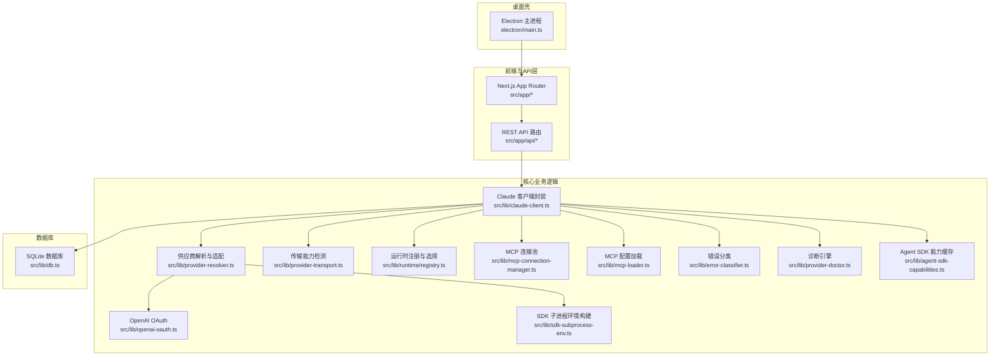
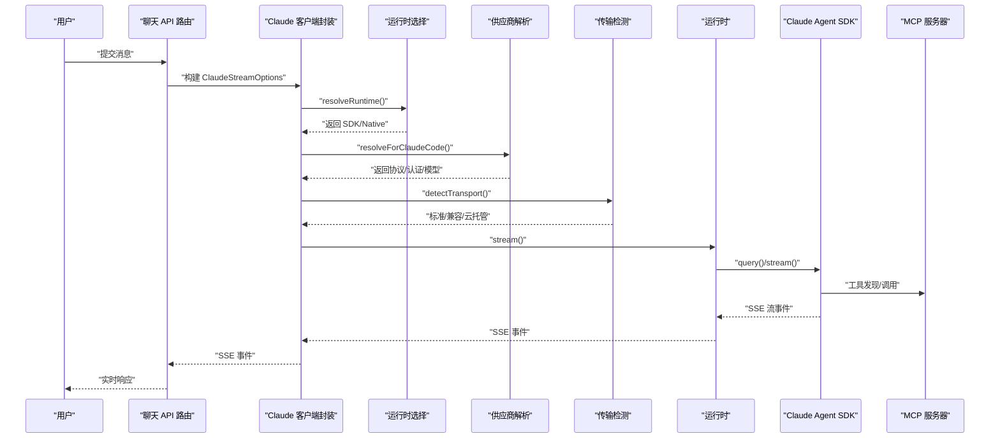
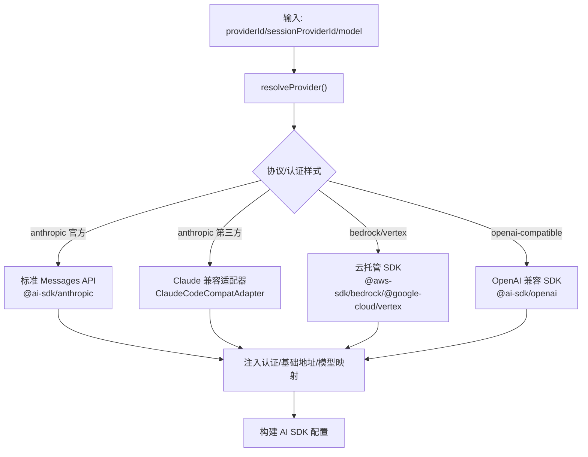
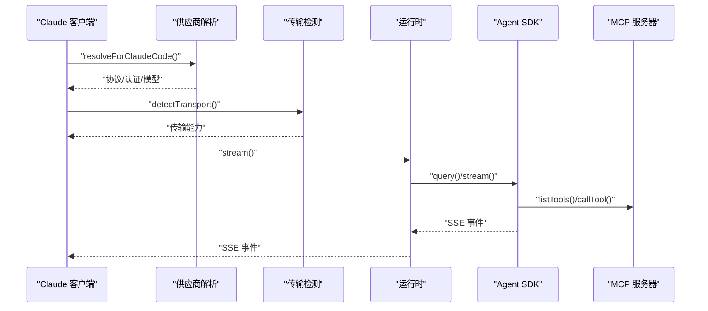
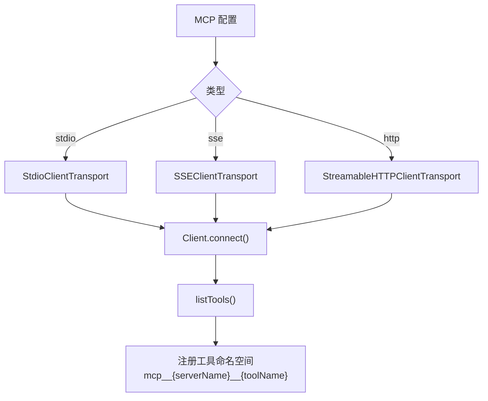
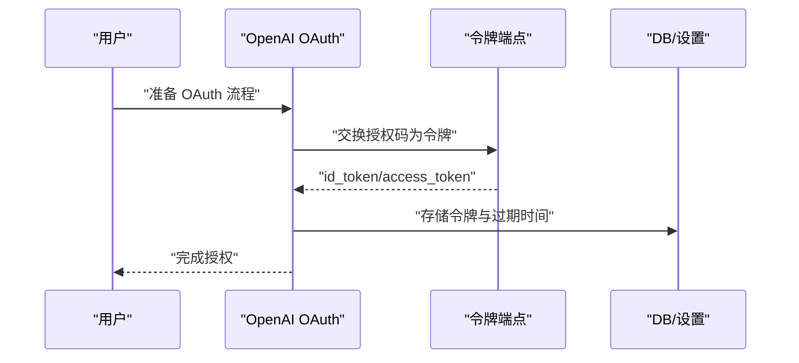
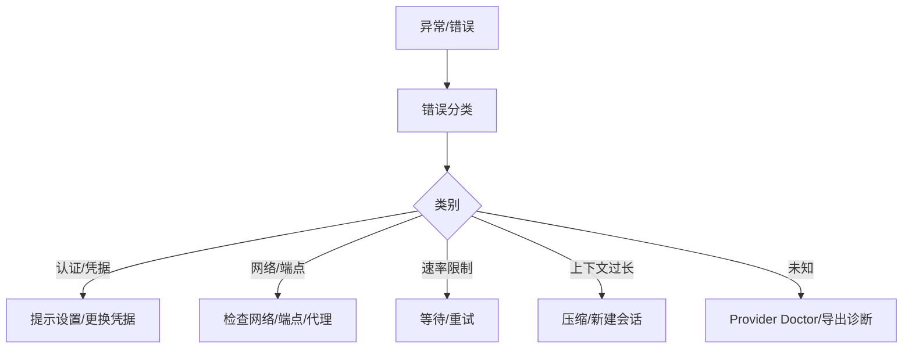
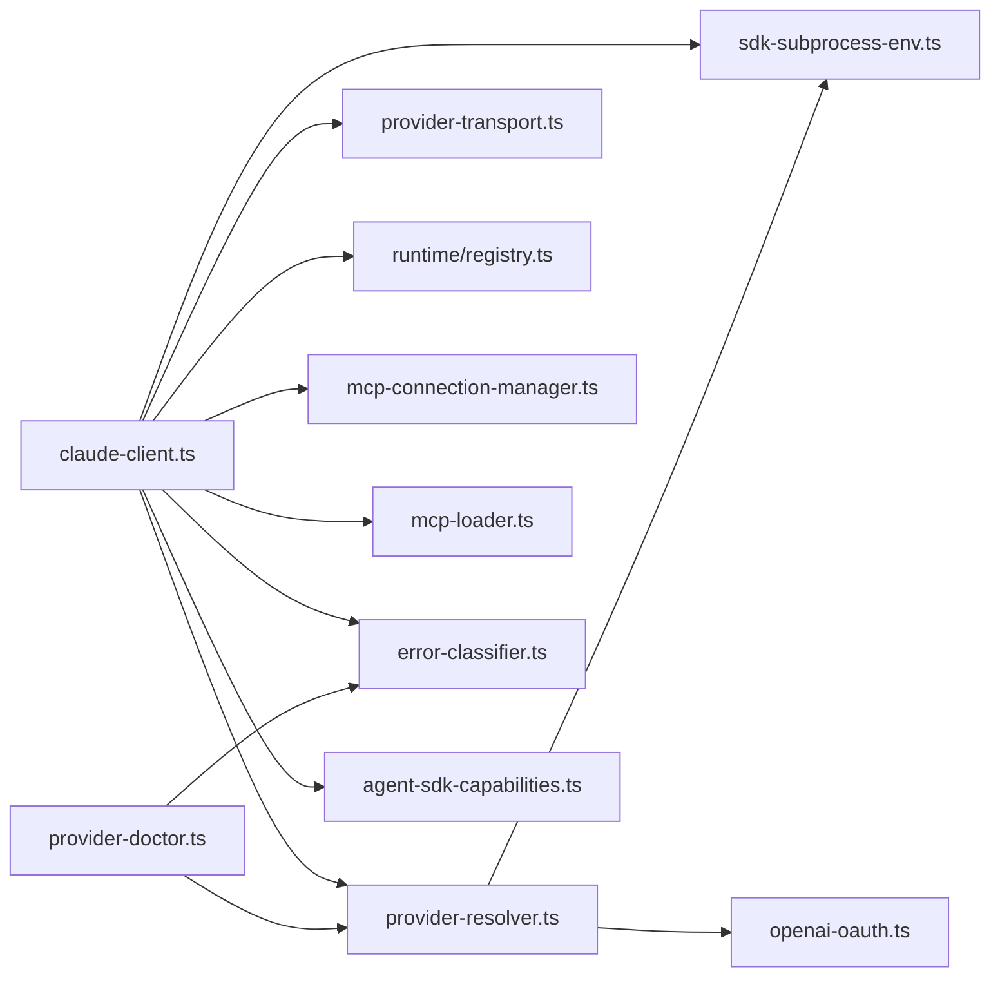

# 集成架构

<cite>
**本文引用的文件**
- [ARCHITECTURE.md](file://ARCHITECTURE.md)
- [claude-client.ts](file://src/lib/claude-client.ts)
- [mcp-connection-manager.ts](file://src/lib/mcp-connection-manager.ts)
- [mcp-loader.ts](file://src/lib/mcp-loader.ts)
- [provider-resolver.ts](file://src/lib/provider-resolver.ts)
- [provider-transport.ts](file://src/lib/provider-transport.ts)
- [openai-oauth.ts](file://src/lib/openai-oauth.ts)
- [error-classifier.ts](file://src/lib/error-classifier.ts)
- [provider-doctor.ts](file://src/lib/provider-doctor.ts)
- [runtime/registry.ts](file://src/lib/runtime/registry.ts)
- [sdk-subprocess-env.ts](file://src/lib/sdk-subprocess-env.ts)
- [agent-sdk-capabilities.ts](file://src/lib/agent-sdk-capabilities.ts)
</cite>

## 目录
1. [简介](#简介)
2. [项目结构](#项目结构)
3. [核心组件](#核心组件)
4. [架构总览](#架构总览)
5. [详细组件分析](#详细组件分析)
6. [依赖关系分析](#依赖关系分析)
7. [性能考量](#性能考量)
8. [故障排查指南](#故障排查指南)
9. [结论](#结论)
10. [附录](#附录)

## 简介
本文件面向 CodePilot 的集成架构，系统化阐述第三方服务集成设计（AI 供应商适配、Claude Agent SDK 封装）、MCP 服务器集成架构（stdi、sse、http 三种传输协议）、插件发现与加载机制、OAuth 流程与 API 密钥管理、错误处理与故障转移策略，并给出新增集成的标准触点、最佳实践、集成测试策略与监控方案。

## 项目结构
CodePilot 采用多模型 AI Agent 桌面客户端架构：Electron 壳 + Next.js App Router 前端 + better-sqlite3 本地持久化；通过 Claude Agent SDK 与 AI 服务商交互；同时支持通过 MCP（Model Context Protocol）扩展工具与能力。

**图表来源**
- [ARCHITECTURE.md:1-183](file://ARCHITECTURE.md#L1-L183)
- [claude-client.ts:1-2116](file://src/lib/claude-client.ts#L1-L2116)
- [provider-resolver.ts:1-1186](file://src/lib/provider-resolver.ts#L1-L1186)
- [provider-transport.ts:1-74](file://src/lib/provider-transport.ts#L1-L74)
- [runtime/registry.ts:1-116](file://src/lib/runtime/registry.ts#L1-L116)
- [mcp-connection-manager.ts:1-221](file://src/lib/mcp-connection-manager.ts#L1-L221)
- [mcp-loader.ts:1-212](file://src/lib/mcp-loader.ts#L1-L212)
- [openai-oauth.ts:1-275](file://src/lib/openai-oauth.ts#L1-L275)
- [error-classifier.ts:1-522](file://src/lib/error-classifier.ts#L1-L522)
- [provider-doctor.ts:1-1078](file://src/lib/provider-doctor.ts#L1-L1078)
- [sdk-subprocess-env.ts:1-82](file://src/lib/sdk-subprocess-env.ts#L1-L82)
- [agent-sdk-capabilities.ts:1-203](file://src/lib/agent-sdk-capabilities.ts#L1-L203)

**章节来源**
- [ARCHITECTURE.md:1-183](file://ARCHITECTURE.md#L1-L183)

## 核心组件
- Claude 客户端封装：统一入口，负责运行时选择、MCP 配置转换、工具注册、会话与上下文构建、流式输出与错误处理。
- 供应商解析与适配：统一解析 DB/环境变量/虚拟提供商（如 OpenAI OAuth），注入认证、基础地址、模型映射与额外头。
- 传输能力检测：区分标准 Messages API、Claude 兼容代理、云厂商托管（Bedrock/Vertex）三类传输路径。
- 运行时注册与选择：根据 CLI 是否存在与用户设置自动选择 SDK 或 Native 运行时。
- MCP 连接池与加载：连接外部 MCP 服务器（stdio/sse/http），发现工具并暴露调用接口；加载本地与项目级 MCP 配置。
- OpenAI OAuth：实现 PKCE 授权、令牌交换与刷新，支持重试与错误分类。
- 错误分类与诊断：结构化错误分类、可操作恢复建议、Sentry 报告与诊断探针。
- SDK 子进程环境：统一构建 SDK 子进程环境，隔离不同提供商的凭据与配置。
- Agent SDK 能力缓存：捕获并缓存模型、命令、账户与 MCP 状态，跨请求复用。

**章节来源**
- [claude-client.ts:1-2116](file://src/lib/claude-client.ts#L1-L2116)
- [provider-resolver.ts:1-1186](file://src/lib/provider-resolver.ts#L1-L1186)
- [provider-transport.ts:1-74](file://src/lib/provider-transport.ts#L1-L74)
- [runtime/registry.ts:1-116](file://src/lib/runtime/registry.ts#L1-L116)
- [mcp-connection-manager.ts:1-221](file://src/lib/mcp-connection-manager.ts#L1-L221)
- [mcp-loader.ts:1-212](file://src/lib/mcp-loader.ts#L1-L212)
- [openai-oauth.ts:1-275](file://src/lib/openai-oauth.ts#L1-L275)
- [error-classifier.ts:1-522](file://src/lib/error-classifier.ts#L1-L522)
- [provider-doctor.ts:1-1078](file://src/lib/provider-doctor.ts#L1-L1078)
- [sdk-subprocess-env.ts:1-82](file://src/lib/sdk-subprocess-env.ts#L1-L82)
- [agent-sdk-capabilities.ts:1-203](file://src/lib/agent-sdk-capabilities.ts#L1-L203)

## 架构总览
本节展示从用户输入到 AI 供应商与 MCP 工具的完整调用链路与关键决策点。

**图表来源**
- [claude-client.ts:433-505](file://src/lib/claude-client.ts#L433-L505)
- [runtime/registry.ts:48-86](file://src/lib/runtime/registry.ts#L48-L86)
- [provider-resolver.ts:176-196](file://src/lib/provider-resolver.ts#L176-L196)
- [provider-transport.ts:23-34](file://src/lib/provider-transport.ts#L23-L34)

## 详细组件分析

### AI 供应商集成与适配器模式
- 统一解析与注入
  - 解析优先级：显式 providerId → 会话 providerId → 默认 provider → 环境变量。
  - 注入认证：基于 authStyle 决定使用 API Key 或 Auth Token；清理敏感环境变量防止泄漏。
  - 基础地址与模型映射：支持 role_models_json 与 env overrides，兼容第三方代理。
- 传输能力检测
  - 标准 Messages API：官方 Anthropic API。
  - Claude 兼容代理：第三方 Anthropic 代理（统一走兼容适配器）。
  - 云托管：AWS Bedrock / Google Vertex 使用专用 SDK。
- 适配器与 SDK 选择
  - 对于非官方 Anthropic 代理，统一通过 ClaudeCodeCompatAdapter，保证与标准 Messages API 的兼容性。
  - OpenAI OAuth（Codex API）通过虚拟 provider 路径，使用 OpenAI 兼容 SDK 并以 Bearer Token 调用。

**图表来源**
- [provider-resolver.ts:356-620](file://src/lib/provider-resolver.ts#L356-L620)
- [provider-transport.ts:36-65](file://src/lib/provider-transport.ts#L36-L65)

**章节来源**
- [provider-resolver.ts:1-1186](file://src/lib/provider-resolver.ts#L1-L1186)
- [provider-transport.ts:1-74](file://src/lib/provider-transport.ts#L1-L74)

### Claude Agent SDK 封装策略
- 运行时选择
  - auto 语义：存在 CLI → SDK 运行时；否则 Native 运行时。
  - 支持显式 override 与全局设置。
- 流式对话
  - 统一封装 query() 为 ReadableStream，统一处理权限、MCP、文件附件、上下文压缩与会话恢复。
  - MCP 服务器配置转换：支持 stdio、sse、http 三种传输类型。
- 工具与能力
  - 自动注册内置 MCP（内存检索、通知、媒体、CLI 工具、仪表盘、Widget 指南）。
  - 关键字触发按需注册媒体与 Widget 相关 MCP，降低发现开销。
- 子进程环境
  - 统一构建 SDK 子进程环境，隔离不同提供商凭据，确保诊断与主流程一致。

**图表来源**
- [claude-client.ts:433-505](file://src/lib/claude-client.ts#L433-L505)
- [claude-client.ts:138-195](file://src/lib/claude-client.ts#L138-L195)
- [claude-client.ts:511-800](file://src/lib/claude-client.ts#L511-L800)
- [runtime/registry.ts:48-86](file://src/lib/runtime/registry.ts#L48-L86)

**章节来源**
- [claude-client.ts:1-2116](file://src/lib/claude-client.ts#L1-L2116)
- [runtime/registry.ts:1-116](file://src/lib/runtime/registry.ts#L1-L116)
- [sdk-subprocess-env.ts:1-82](file://src/lib/sdk-subprocess-env.ts#L1-L82)

### MCP 服务器集成架构
- 传输协议
  - stdio：子进程启动，适合本地工具。
  - sse：HTTP SSE 流，适合远程 MCP。
  - http：HTTP 流式传输，适合跨网络访问。
- 连接池与工具发现
  - 连接池维护每个服务器的连接状态、工具列表与错误信息。
  - 通过 listTools() 发现工具，命名规范为 mcp__{serverName}__{toolName}。
- 配置加载
  - 用户级 ~/.claude.json 与 ~/.claude/settings.json。
  - 项目级 .mcp.json（Next.js 工作目录）。
  - CodePilot 特定处理：对 env 中的 ${...} 占位符进行 DB 设置解析。

**图表来源**
- [mcp-connection-manager.ts:191-220](file://src/lib/mcp-connection-manager.ts#L191-L220)
- [mcp-loader.ts:162-211](file://src/lib/mcp-loader.ts#L162-L211)

**章节来源**
- [mcp-connection-manager.ts:1-221](file://src/lib/mcp-connection-manager.ts#L1-L221)
- [mcp-loader.ts:1-212](file://src/lib/mcp-loader.ts#L1-L212)

### OAuth 流程与 API 密钥管理
- OpenAI OAuth（Codex API）
  - PKCE 授权码流程：准备授权 URL、生成 state 与 code_verifier，交换授权码为 id_token/access_token。
  - 令牌刷新：支持 refresh_token 刷新。
  - 重试策略：对网络错误与 403/408/429/5xx 进行指数回退重试。
  - 账户信息提取：从 id_token 中解析 ChatGPT 账号标识。
- API 密钥管理
  - 支持多种来源：DB provider.api_key、环境变量（ANTHROPIC_API_KEY/ANTHROPIC_AUTH_TOKEN）、cc-switch settings.json。
  - 注入策略：根据 authStyle 决定使用 API Key 或 Auth Token；清理敏感键防止泄漏。
  - 子进程隔离：不同提供商凭据隔离在独立 shadow home 下，避免交叉污染。

**图表来源**
- [openai-oauth.ts:63-201](file://src/lib/openai-oauth.ts#L63-L201)
- [provider-resolver.ts:208-329](file://src/lib/provider-resolver.ts#L208-L329)
- [sdk-subprocess-env.ts:50-81](file://src/lib/sdk-subprocess-env.ts#L50-L81)

**章节来源**
- [openai-oauth.ts:1-275](file://src/lib/openai-oauth.ts#L1-L275)
- [provider-resolver.ts:1-1186](file://src/lib/provider-resolver.ts#L1-L1186)
- [sdk-subprocess-env.ts:1-82](file://src/lib/sdk-subprocess-env.ts#L1-L82)

### 错误处理与故障转移
- 结构化错误分类
  - 16 类错误类别：CLI 未找到、无凭据、认证失败、速率限制、上下文过长、未知等。
  - 提供用户可读提示、可操作恢复动作与 Sentry 报告。
- 故障转移策略
  - 运行时自动切换：SDK 不可用时回退 Native。
  - 传输能力兼容：非官方 Anthropic 代理统一走兼容适配器。
  - 会话恢复保护：检测会话状态错误并提示重新开始对话。
- 诊断引擎
  - CLI、认证、提供商、特性兼容、网络可达性探针。
  - 实时探针：最小化进程验证当前配置是否实际可用。

**图表来源**
- [error-classifier.ts:154-421](file://src/lib/error-classifier.ts#L154-L421)
- [provider-doctor.ts:751-800](file://src/lib/provider-doctor.ts#L751-L800)
- [runtime/registry.ts:48-86](file://src/lib/runtime/registry.ts#L48-L86)

**章节来源**
- [error-classifier.ts:1-522](file://src/lib/error-classifier.ts#L1-L522)
- [provider-doctor.ts:1-1078](file://src/lib/provider-doctor.ts#L1-L1078)
- [runtime/registry.ts:1-116](file://src/lib/runtime/registry.ts#L1-L116)

### 新集成添加标准触点与最佳实践
- 类型定义
  - 在 src/types/index.ts 新增接口/类型。
- 数据库
  - 在 src/lib/db.ts 新增表或字段（含迁移逻辑）。
- API 路由
  - 在 src/app/api/{功能名}/route.ts 新增 REST 端点。
- 页面与组件
  - 在 src/app/{功能名}/page.tsx 与 src/components/{功能名}/ 添加 UI 组件。
- Hook
  - 在 src/hooks/use{功能名}.ts 添加状态管理 Hook。
- 国际化
  - 在 src/i18n/en.ts 与 zh.ts 添加双语翻译键。
- Bridge
  - 若涉及 IM 集成，在 src/lib/bridge/adapters/ 与 src/lib/bridge/types.ts 修改。
- 供应商与传输
  - 在 provider-resolver.ts 与 provider-transport.ts 增加协议/认证样式支持。
- MCP
  - 在 mcp-loader.ts 与 mcp-connection-manager.ts 增加配置与连接逻辑。
- OAuth
  - 在 openai-oauth.ts 或新增模块中实现授权流程。
- 错误与诊断
  - 在 error-classifier.ts 增加错误类别与恢复动作；在 provider-doctor.ts 增加探针。

**章节来源**
- [ARCHITECTURE.md:142-167](file://ARCHITECTURE.md#L142-L167)

## 依赖关系分析

**图表来源**
- [claude-client.ts:1-2116](file://src/lib/claude-client.ts#L1-L2116)
- [provider-resolver.ts:1-1186](file://src/lib/provider-resolver.ts#L1-L1186)
- [provider-transport.ts:1-74](file://src/lib/provider-transport.ts#L1-L74)
- [runtime/registry.ts:1-116](file://src/lib/runtime/registry.ts#L1-L116)
- [mcp-connection-manager.ts:1-221](file://src/lib/mcp-connection-manager.ts#L1-L221)
- [mcp-loader.ts:1-212](file://src/lib/mcp-loader.ts#L1-L212)
- [openai-oauth.ts:1-275](file://src/lib/openai-oauth.ts#L1-L275)
- [error-classifier.ts:1-522](file://src/lib/error-classifier.ts#L1-L522)
- [agent-sdk-capabilities.ts:1-203](file://src/lib/agent-sdk-capabilities.ts#L1-L203)
- [provider-doctor.ts:1-1078](file://src/lib/provider-doctor.ts#L1-L1078)
- [sdk-subprocess-env.ts:1-82](file://src/lib/sdk-subprocess-env.ts#L1-L82)

**章节来源**
- [claude-client.ts:1-2116](file://src/lib/claude-client.ts#L1-L2116)
- [provider-resolver.ts:1-1186](file://src/lib/provider-resolver.ts#L1-L1186)
- [provider-transport.ts:1-74](file://src/lib/provider-transport.ts#L1-L74)
- [runtime/registry.ts:1-116](file://src/lib/runtime/registry.ts#L1-L116)
- [mcp-connection-manager.ts:1-221](file://src/lib/mcp-connection-manager.ts#L1-L221)
- [mcp-loader.ts:1-212](file://src/lib/mcp-loader.ts#L1-L212)
- [openai-oauth.ts:1-275](file://src/lib/openai-oauth.ts#L1-L275)
- [error-classifier.ts:1-522](file://src/lib/error-classifier.ts#L1-L522)
- [agent-sdk-capabilities.ts:1-203](file://src/lib/agent-sdk-capabilities.ts#L1-L203)
- [provider-doctor.ts:1-1078](file://src/lib/provider-doctor.ts#L1-L1078)
- [sdk-subprocess-env.ts:1-82](file://src/lib/sdk-subprocess-env.ts#L1-L82)

## 性能考量
- MCP 工具发现延迟优化：通过关键字触发按需注册媒体与 Widget 相关 MCP，避免每次会话都进行工具发现。
- 会话上下文压缩：在构建回退上下文时按 token 预算选择消息，减少超长上下文带来的延迟。
- 运行时选择：自动选择 SDK 运行时以获得更优的本地体验，若不可用则快速回退 Native。
- 缓存与复用：Agent SDK 能力缓存（模型、命令、账户、MCP 状态）减少重复查询。
- 传输协议选择：标准 Messages API 与云托管 SDK 优化网络与认证路径，减少中间层开销。

[本节为通用指导，不直接分析具体文件]

## 故障排查指南
- 常见错误与恢复
  - CLI 未找到：安装 Claude Code CLI 并确保 PATH 正确。
  - 无凭据：在设置中添加 API Key 或设置环境变量。
  - 认证失败：核对 API Key 与认证样式（API Key vs Auth Token）。
  - 速率限制：等待后重试或升级计划。
  - 上下文过长：自动压缩或新建会话。
- 诊断工具
  - Provider Doctor：运行 CLI、认证、提供商、特性兼容、网络可达性探针，提供修复动作。
  - 最小化实时探针：最小化进程验证当前配置是否实际可用。
- 错误上报
  - Sentry 报告：对可上报错误进行分类与指纹化，便于追踪与修复。

**章节来源**
- [error-classifier.ts:1-522](file://src/lib/error-classifier.ts#L1-L522)
- [provider-doctor.ts:1-1078](file://src/lib/provider-doctor.ts#L1-L1078)

## 结论
CodePilot 的集成架构通过统一的供应商解析与传输检测、运行时选择与 SDK 封装、MCP 工具生态与 OAuth/密钥管理，实现了对多模型与多供应商的稳定集成。结构化的错误分类与诊断工具保障了问题定位与快速恢复。新增集成遵循既定触点与最佳实践，可快速扩展并保持一致性。

[本节为总结，不直接分析具体文件]

## 附录
- 集成测试策略
  - 单元测试：针对 provider-resolver、provider-transport、mcp-loader、openai-oauth 等模块的关键分支与边界条件。
  - 集成测试：通过 claude-client 的流式对话与 MCP 工具调用端到端验证。
  - E2E 测试：覆盖聊天、MCP 工具、OAuth 授权与 Provider Doctor 诊断流程。
- 监控方案
  - Sentry：对可上报错误进行分类与聚合，设置指纹与上下文标签。
  - 日志：统一 JSON Lines 日志格式，支持级别动态调整与按账号隔离。
  - 指标：结合 Agent SDK 能力缓存与运行时状态，记录模型可用性、MCP 工具数量与状态、错误率与延迟。

[本节为通用指导，不直接分析具体文件]