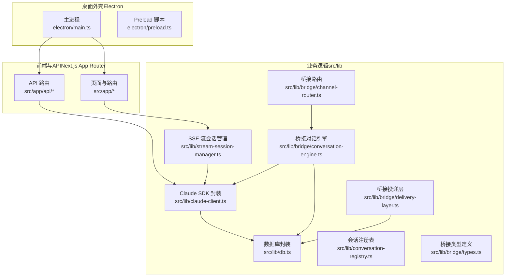
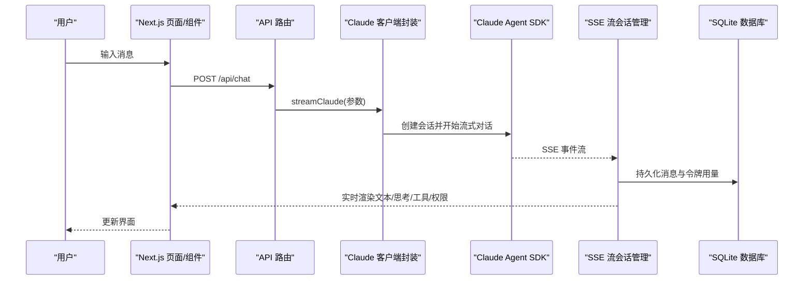
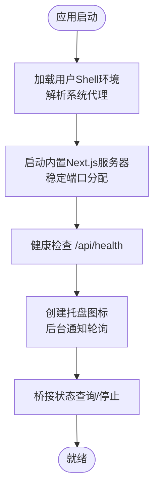
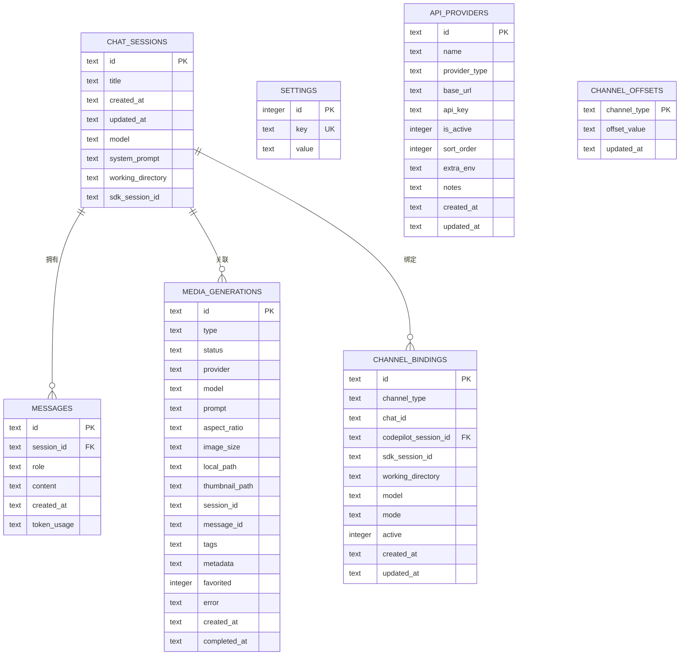
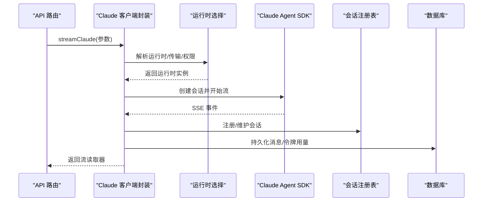
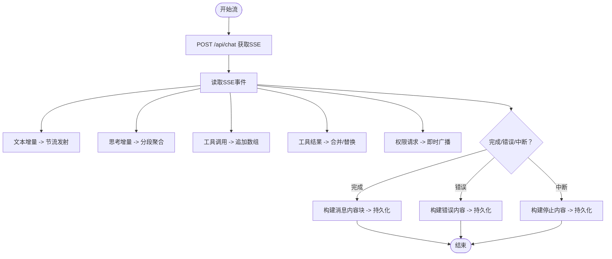
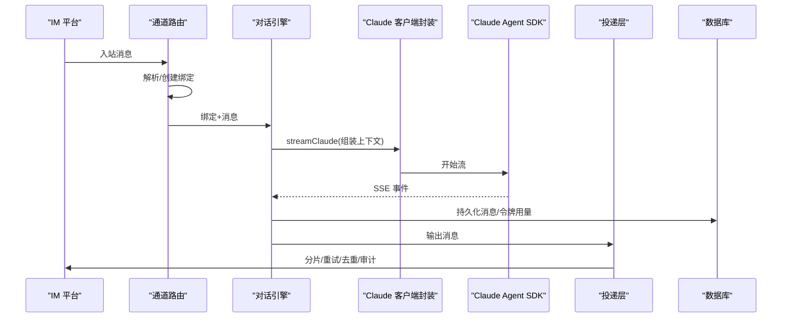
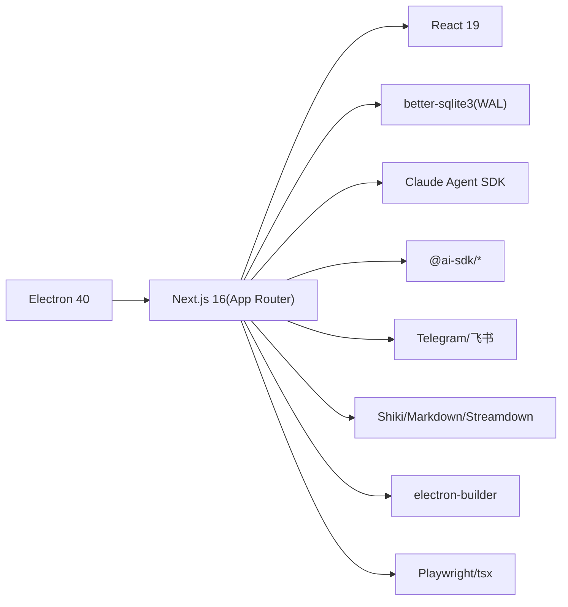

# 项目架构

<cite>
**本文引用的文件**
- [ARCHITECTURE.md](file://ARCHITECTURE.md)
- [README.md](file://README.md)
- [package.json](file://package.json)
- [electron/main.ts](file://electron/main.ts)
- [src/lib/db.ts](file://src/lib/db.ts)
- [src/lib/claude-client.ts](file://src/lib/claude-client.ts)
- [src/lib/stream-session-manager.ts](file://src/lib/stream-session-manager.ts)
- [src/lib/conversation-registry.ts](file://src/lib/conversation-registry.ts)
- [src/lib/bridge/types.ts](file://src/lib/bridge/types.ts)
- [src/lib/bridge/channel-router.ts](file://src/lib/bridge/channel-router.ts)
- [src/lib/bridge/conversation-engine.ts](file://src/lib/bridge/conversation-engine.ts)
- [src/lib/bridge/delivery-layer.ts](file://src/lib/bridge/delivery-layer.ts)
</cite>

## 目录
1. [简介](#简介)
2. [项目结构](#项目结构)
3. [核心组件](#核心组件)
4. [架构总览](#架构总览)
5. [详细组件分析](#详细组件分析)
6. [依赖关系分析](#依赖关系分析)
7. [性能考虑](#性能考虑)
8. [故障排查指南](#故障排查指南)
9. [结论](#结论)
10. [附录](#附录)

## 简介
本项目是一个多模型 AI Agent 桌面客户端，采用 Electron 作为桌面外壳，Next.js App Router 作为前端与 API 层，使用 better-sqlite3 实现本地 SQLite 持久化，并通过 Claude Agent SDK 与 AI 服务商进行交互。系统支持聊天对话、MCP 插件、技能市场、远程桥接（IM）控制、媒体生成与管理、任务调度与使用统计等能力。

## 项目结构
- 应用层
  - Electron 主进程负责启动内置的 Next.js Standalone 服务器、托盘与通知、系统代理与环境注入、原生模块 ABI 校验等。
  - Next.js App Router 提供页面与 API 路由，覆盖聊天、插件、设置、桥接、画廊等功能。
- 业务层
  - 核心业务逻辑集中在 src/lib 下，包含数据库访问、Claude SDK 封装、SSE 流会话管理、桥接子系统、运行时与传输选择、上下文组装、工具与媒体处理等。
- 数据层
  - 使用 SQLite（WAL 模式），表结构覆盖会话、消息、设置、任务、API 提供商、媒体生成与作业、桥接绑定与审计等。
- 插件与桥接
  - 支持 MCP 服务器（stdio/sse/http），桥接系统适配多种 IM 渠道（Telegram、飞书等），具备权限请求、消息分片、速率限制、去重与审计等能力。

**图表来源**
- [electron/main.ts:1-800](file://electron/main.ts#L1-L800)
- [src/lib/db.ts:1-800](file://src/lib/db.ts#L1-L800)
- [src/lib/claude-client.ts:1-800](file://src/lib/claude-client.ts#L1-L800)
- [src/lib/stream-session-manager.ts:1-800](file://src/lib/stream-session-manager.ts#L1-L800)
- [src/lib/bridge/types.ts:1-180](file://src/lib/bridge/types.ts#L1-L180)
- [src/lib/bridge/channel-router.ts:1-174](file://src/lib/bridge/channel-router.ts#L1-L174)
- [src/lib/bridge/conversation-engine.ts:1-573](file://src/lib/bridge/conversation-engine.ts#L1-L573)
- [src/lib/bridge/delivery-layer.ts:1-357](file://src/lib/bridge/delivery-layer.ts#L1-L357)

**章节来源**
- [ARCHITECTURE.md:1-183](file://ARCHITECTURE.md#L1-L183)
- [README.md:1-287](file://README.md#L1-L287)

## 核心组件
- Electron 主进程
  - 启动内置的 Next.js Standalone 服务器，监听健康检查端点；管理托盘图标与后台通知；校验 better-sqlite3 原生模块 ABI；解析系统代理并注入子进程环境；稳定端口分配避免 localStorage 跨重启丢失。
- Next.js App Router
  - 提供页面路由与 API 路由，API 路由负责聊天、桥接、设置、文件、媒体、任务、工作区等后端逻辑。
- 数据库（SQLite）
  - WAL 模式 + 外键约束；包含会话、消息、设置、任务、API 提供商、媒体生成与作业、桥接绑定与审计等表；支持迁移与并发锁。
- Claude SDK 封装
  - 统一运行时选择（Native/SDK/Claude Code），MCP 服务器配置，权限模式与系统提示拼接，文件附件处理，上下文组装与令牌用量提取。
- SSE 流会话管理
  - 独立于组件生命周期的流会话管理器，负责节流文本事件、工具调用与结果聚合、权限请求转发、空闲超时与 GC、监听者注册与事件广播。
- 桥接子系统
  - 类型定义、地址解析与绑定、对话引擎消费 SSE 并持久化、投递层负责分片、去重、重试、速率限制与审计。

**章节来源**
- [electron/main.ts:1-800](file://electron/main.ts#L1-L800)
- [src/lib/db.ts:1-800](file://src/lib/db.ts#L1-L800)
- [src/lib/claude-client.ts:1-800](file://src/lib/claude-client.ts#L1-L800)
- [src/lib/stream-session-manager.ts:1-800](file://src/lib/stream-session-manager.ts#L1-L800)
- [src/lib/bridge/types.ts:1-180](file://src/lib/bridge/types.ts#L1-L180)
- [src/lib/bridge/channel-router.ts:1-174](file://src/lib/bridge/channel-router.ts#L1-L174)
- [src/lib/bridge/conversation-engine.ts:1-573](file://src/lib/bridge/conversation-engine.ts#L1-L573)
- [src/lib/bridge/delivery-layer.ts:1-357](file://src/lib/bridge/delivery-layer.ts#L1-L357)

## 架构总览
系统采用“桌面外壳 + 前后端一体化”的设计：
- Electron 主进程负责应用生命周期、系统集成与内置服务启动。
- Next.js App Router 在 Electron 内部以 Standalone 服务器形式运行，统一提供页面与 API。
- 业务逻辑集中于 src/lib，通过数据库与 Claude SDK 完成数据持久化与 AI 交互。
- 桥接子系统独立于聊天主链路，通过适配器模式对接不同 IM 平台，实现消息路由、权限管理与可靠投递。

**图表来源**
- [src/lib/claude-client.ts:433-505](file://src/lib/claude-client.ts#L433-L505)
- [src/lib/stream-session-manager.ts:291-498](file://src/lib/stream-session-manager.ts#L291-L498)
- [src/lib/db.ts:111-119](file://src/lib/db.ts#L111-L119)

**章节来源**
- [ARCHITECTURE.md:55-66](file://ARCHITECTURE.md#L55-L66)

## 详细组件分析

### Electron 主进程与内置服务
- 启动与健康检查
  - 主进程启动内置的 Next.js Standalone 服务器，监听 /api/health；支持稳定端口分配以保持 localStorage 跨重启一致。
- 系统集成
  - 托盘图标与菜单、后台通知轮询、系统代理解析、用户 Shell 环境加载、原生模块 ABI 校验、安装与升级流程。
- 远程桥接控制
  - 通过本地 API 查询与停止桥接服务，支持托盘模式下的后台运行。

**图表来源**
- [electron/main.ts:572-720](file://electron/main.ts#L572-L720)
- [electron/main.ts:135-189](file://electron/main.ts#L135-L189)
- [electron/main.ts:269-321](file://electron/main.ts#L269-L321)

**章节来源**
- [electron/main.ts:1-800](file://electron/main.ts#L1-L800)

### 数据库架构（SQLite WAL 模式）
- 初始化与迁移
  - 首次访问时初始化 WAL 模式、外键约束与索引；支持从旧路径迁移；提供列安全新增与版本迁移。
- 表结构概览
  - 会话与消息、设置、任务、API 提供商、媒体生成与作业、桥接绑定与审计等。
- 并发与一致性
  - 会话级锁、运行时状态标记、权限请求超时清理、进程重启恢复。

**图表来源**
- [src/lib/db.ts:98-320](file://src/lib/db.ts#L98-L320)
- [src/lib/db.ts:244-316](file://src/lib/db.ts#L244-L316)

**章节来源**
- [src/lib/db.ts:1-800](file://src/lib/db.ts#L1-L800)
- [ARCHITECTURE.md:79-98](file://ARCHITECTURE.md#L79-L98)

### Claude SDK 与消息流处理
- 运行时选择与传输检测
  - 根据提供商与设置选择 Native 或 SDK 运行时；非 Anthropic 提供商强制使用 Native。
- MCP 服务器与系统提示
  - 统一转换为 SDK 配置；根据关键词动态注册媒体、CLI 工具、通知、Widget 等 MCP 服务器；支持系统提示拼接与工具白名单。
- 文件附件与工作目录
  - 上传文件落盘并复用；工作目录解析与变更时清理 SDK 会话 ID 以避免残留。
- SSE 事件消费
  - 思考、文本、工具调用/结果、权限请求、状态与结果事件；令牌用量与终端原因提取；错误分类与持久化。

**图表来源**
- [src/lib/claude-client.ts:433-505](file://src/lib/claude-client.ts#L433-L505)
- [src/lib/conversation-registry.ts:12-22](file://src/lib/conversation-registry.ts#L12-L22)
- [src/lib/db.ts:111-119](file://src/lib/db.ts#L111-L119)

**章节来源**
- [src/lib/claude-client.ts:1-800](file://src/lib/claude-client.ts#L1-L800)
- [src/lib/conversation-registry.ts:1-23](file://src/lib/conversation-registry.ts#L1-L23)

### SSE 流会话管理（客户端）
- 独立生命周期
  - 通过全局 Map 保存活动流，跨组件切换不中断；支持空闲超时、定时 GC、定时器清理。
- 事件节流与聚合
  - 文本事件节流（降低渲染压力）；思考内容分段与合并；工具调用/结果数组聚合；权限请求即时广播。
- 错误分支与自动重试
  - 空闲超时、工具超时（自动重试）、手动停止、异常错误；最终构建消息内容块并持久化。

**图表来源**
- [src/lib/stream-session-manager.ts:291-498](file://src/lib/stream-session-manager.ts#L291-L498)
- [src/lib/db.ts:111-119](file://src/lib/db.ts#L111-L119)

**章节来源**
- [src/lib/stream-session-manager.ts:1-800](file://src/lib/stream-session-manager.ts#L1-L800)

### 桥接子系统（远程 IM 控制）
- 适配器模式
  - 通道类型抽象、地址与消息结构、绑定与审计、去重与引用跟踪。
- 消息路由
  - 将 IM 地址解析为 CodePilot 会话，自动生成或绑定现有会话；工作目录与 SDK 会话 ID 自愈。
- 对话引擎
  - 从绑定与入站消息开始，组装上下文，调用 streamClaude，消费 SSE 并持久化；处理权限请求、令牌用量、任务同步与模型更新。
- 投递层
  - 文本分片（按平台限制）、速率限制（每聊天 20/min）、指数退避重试、HTML 解析错误降级为纯文本、去重与审计日志。

**图表来源**
- [src/lib/bridge/channel-router.ts:32-85](file://src/lib/bridge/channel-router.ts#L32-L85)
- [src/lib/bridge/conversation-engine.ts:88-284](file://src/lib/bridge/conversation-engine.ts#L88-L284)
- [src/lib/bridge/delivery-layer.ts:142-219](file://src/lib/bridge/delivery-layer.ts#L142-L219)
- [src/lib/db.ts:111-119](file://src/lib/db.ts#L111-L119)

**章节来源**
- [src/lib/bridge/types.ts:1-180](file://src/lib/bridge/types.ts#L1-L180)
- [src/lib/bridge/channel-router.ts:1-174](file://src/lib/bridge/channel-router.ts#L1-L174)
- [src/lib/bridge/conversation-engine.ts:1-573](file://src/lib/bridge/conversation-engine.ts#L1-L573)
- [src/lib/bridge/delivery-layer.ts:1-357](file://src/lib/bridge/delivery-layer.ts#L1-L357)

## 依赖关系分析
- 技术栈
  - 桌面外壳：Electron 40
  - 前端框架：Next.js 16（App Router）+ React 19
  - 样式：Tailwind CSS 4 + Radix UI
  - 数据库：better-sqlite3（WAL）
  - AI 集成：Claude Agent SDK、@ai-sdk/* 系列
  - IM 集成：Telegram Bot API、飞书 SDK
  - 代码高亮：Shiki
  - Markdown：react-markdown、streamdown、markdown-it
  - 打包：electron-builder
  - 测试：Playwright（E2E）、tsx（单元）

**图表来源**
- [package.json:43-107](file://package.json#L43-L107)
- [ARCHITECTURE.md:169-183](file://ARCHITECTURE.md#L169-L183)

**章节来源**
- [package.json:1-148](file://package.json#L1-L148)
- [ARCHITECTURE.md:169-183](file://ARCHITECTURE.md#L169-L183)

## 性能考虑
- SSE 流节流与渲染优化
  - 文本事件节流（约 100ms）减少频繁渲染；思考内容分段聚合避免 UI 抖动。
- 空闲超时与 GC
  - 330s 空闲超时自动中断；5 分钟后对已完成流进行 GC，释放内存。
- 速率限制与重试
  - 投递层按聊天维度限流（20/min），多分片消息间隔发送；指数退避 + 抖动，尊重平台 retry_after。
- 数据库并发
  - 会话级锁与运行时状态标记，避免并发冲突；WAL 模式提升并发读性能。
- 运行时选择
  - 根据提供商与设置选择 Native/SDK/Claude Code，兼顾兼容性与性能；非 Anthropic 提供商强制 Native。

[本节为通用指导，无需具体文件分析]

## 故障排查指南
- 本地服务启动失败
  - 检查 /api/health 健康检查；确认稳定端口可用；查看主进程输出与 stderr。
- better-sqlite3 原生模块 ABI 不匹配
  - 主进程在打包后进行 ABI 校验，若不匹配会弹窗提示并退出；需重新构建原生模块。
- 桥接消息未送达或重复
  - 查看投递层去重与审计日志；检查速率限制与重试策略；确认平台解析错误降级为纯文本。
- SSE 流中断或空闲超时
  - 检查客户端侧空闲超时与 GC；确认网络稳定性；必要时手动停止并重试。
- 权限请求阻塞
  - 对话引擎在流中即时转发权限请求；确保回调处理正确；检查数据库中权限链接状态。

**章节来源**
- [electron/main.ts:329-377](file://electron/main.ts#L329-L377)
- [src/lib/bridge/delivery-layer.ts:83-135](file://src/lib/bridge/delivery-layer.ts#L83-L135)
- [src/lib/stream-session-manager.ts:246-253](file://src/lib/stream-session-manager.ts#L246-L253)

## 结论
本项目通过 Electron + Next.js App Router 的一体化设计，实现了桌面端与 Web 端一致的开发体验；借助 better-sqlite3 与 WAL 模式保障本地数据性能与可靠性；Claude Agent SDK 与运行时选择机制提供了灵活的 AI 交互能力；桥接子系统以适配器模式扩展多平台 IM，结合权限管理、消息分片与投递层实现可靠的远程控制。整体架构强调可扩展性（MCP、桥接适配器）、可观测性（审计与日志）与性能（节流、限流、GC）。

[本节为总结，无需具体文件分析]

## 附录
- 新增功能标准触及点
  - 类型定义、数据库、API 路由、页面、组件、Hook、国际化、桥接适配器等。
- 关键文档索引
  - Bridge 系统、Agent 工具集成、SDK 集成调研、上下文存储迁移计划、技术债务追踪、Provider/错误/诊断中心等。

**章节来源**
- [ARCHITECTURE.md:142-167](file://ARCHITECTURE.md#L142-L167)