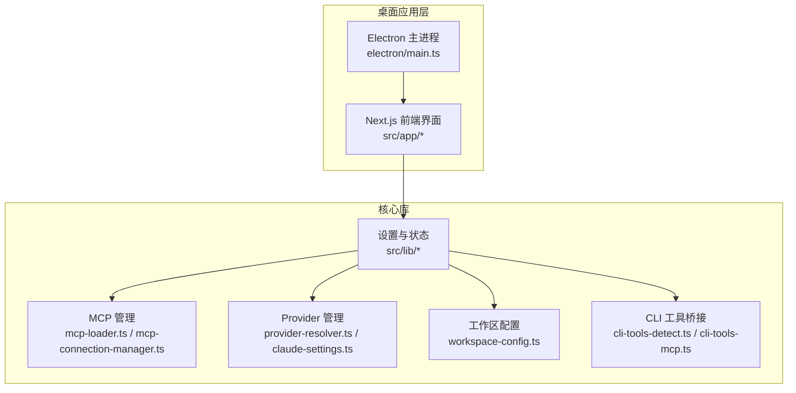
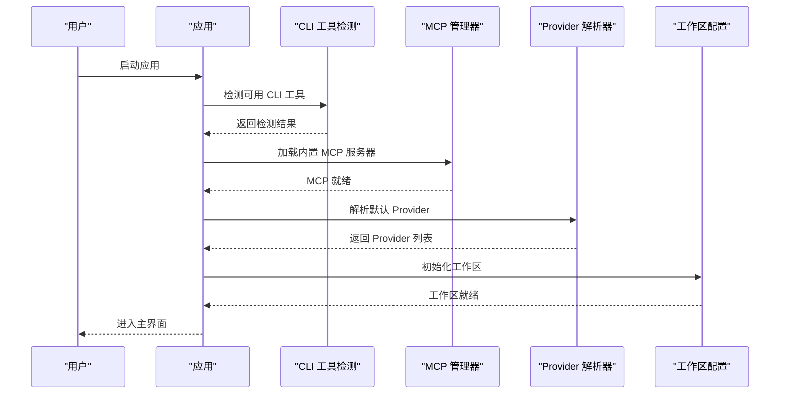
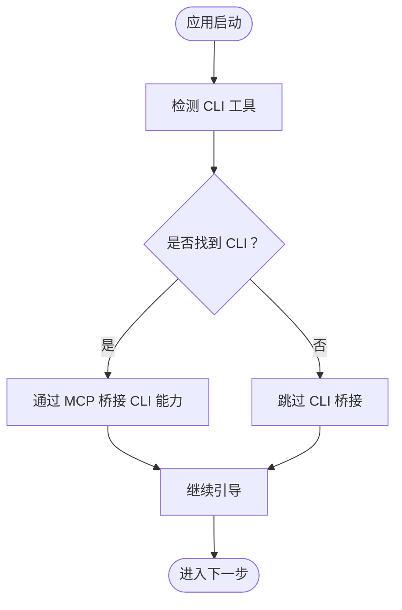
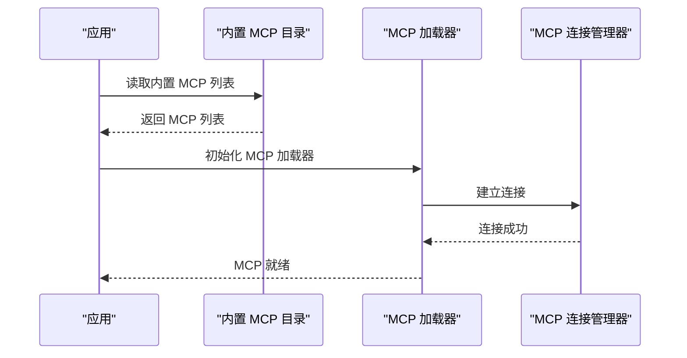
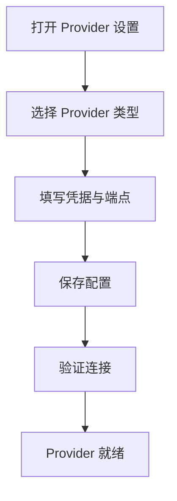
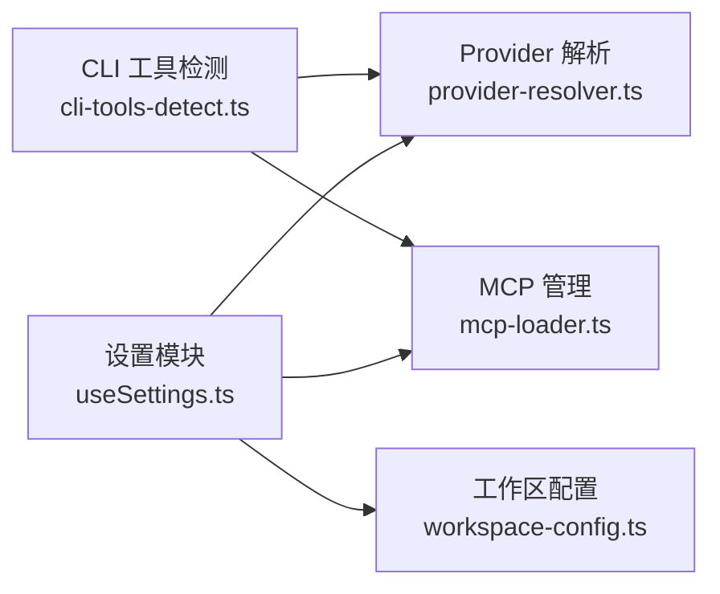

# 快速开始

<cite>
**本文引用的文件**
- [README.md](file://README.md)
- [README_CN.md](file://README_CN.md)
- [CLAUDE.md](file://CLAUDE.md)
- [docs/CLAUDE.md](file://docs/CLAUDE.md)
- [src/lib/claude-code-compat/index.ts](file://src/lib/claude-code-compat/index.ts)
- [src/app/settings/providers/page.tsx](file://src/app/settings/providers/page.tsx)
- [src/app/settings/workspace/page.tsx](file://src/app/settings/workspace/page.tsx)
- [src/app/mcp/page.tsx](file://src/app/mcp/page.tsx)
- [src/lib/cli-tools-detect.ts](file://src/lib/cli-tools-detect.ts)
- [src/lib/cli-tools-mcp.ts](file://src/lib/cli-tools-mcp.ts)
- [src/lib/builtin-mcp-catalog.ts](file://src/lib/builtin-mcp-catalog.ts)
- [src/lib/mcp-loader.ts](file://src/lib/mcp-loader.ts)
- [src/lib/mcp-connection-manager.ts](file://src/lib/mcp-connection-manager.ts)
- [src/lib/workspace-config.ts](file://src/lib/workspace-config.ts)
- [src/lib/provider-resolver.ts](file://src/lib/provider-resolver.ts)
- [src/lib/claude-settings.ts](file://src/lib/claude-settings.ts)
- [src/hooks/useClaudeStatus.ts](file://src/hooks/useClaudeStatus.ts)
- [src/hooks/useSettings.ts](file://src/hooks/useSettings.ts)
- [src/app/setup/page.tsx](file://src/app/setup/page.tsx)
- [src/lib/onboarding-processor.ts](file://src/lib/onboarding-processor.ts)
- [src/lib/onboarding-completion.ts](file://src/lib/onboarding-completion.ts)
- [public/skills/image-generation.md](file://public/skills/image-generation.md)
- [资料/weixin-openclaw-cli/package/README.md](file://资料/weixin-openclaw-cli/package/README.md)
</cite>

## 目录
1. [简介](#简介)
2. [项目结构](#项目结构)
3. [核心组件](#核心组件)
4. [架构总览](#架构总览)
5. [详细组件分析](#详细组件分析)
6. [依赖关系分析](#依赖关系分析)
7. [性能考虑](#性能考虑)
8. [故障排除指南](#故障排除指南)
9. [结论](#结论)
10. [附录](#附录)

## 简介
本指南面向首次接触 CodePilot 的用户，帮助您完成从零到一的安装与首次启动流程。内容涵盖两种安装方式（发布包安装与源码构建）、系统要求与前置条件、Provider 配置、工作区设置、MCP 服务器添加、Claude Code CLI 可选安装及常见问题排查。为保证准确性，所有操作步骤均基于仓库中的实际实现与文档路径进行说明。

## 项目结构
CodePilot 是一个基于 Electron + Next.js 的桌面应用，核心逻辑集中在 src 目录下，包含设置页、聊天界面、CLI 工具桥接、MCP 连接管理、工作区配置与 Provider 解析等模块。文档与设计说明位于 docs 目录，README 提供总体介绍与背景信息。

图表来源
- [src/lib/mcp-loader.ts](file://src/lib/mcp-loader.ts)
- [src/lib/mcp-connection-manager.ts](file://src/lib/mcp-connection-manager.ts)
- [src/lib/provider-resolver.ts](file://src/lib/provider-resolver.ts)
- [src/lib/workspace-config.ts](file://src/lib/workspace-config.ts)
- [src/lib/cli-tools-detect.ts](file://src/lib/cli-tools-detect.ts)
- [src/lib/cli-tools-mcp.ts](file://src/lib/cli-tools-mcp.ts)

章节来源
- [README.md](file://README.md)
- [README_CN.md](file://README_CN.md)

## 核心组件
- 设置与状态：负责读取/写入用户设置、Provider 凭据、工作区路径等，典型文件参考 [src/hooks/useSettings.ts](file://src/hooks/useSettings.ts)、[src/lib/claude-settings.ts](file://src/lib/claude-settings.ts)。
- Provider 管理：解析与选择模型、处理凭据与端点，典型文件参考 [src/lib/provider-resolver.ts](file://src/lib/provider-resolver.ts)。
- MCP 管理：加载内置 MCP 服务器、建立连接、分发工具调用，典型文件参考 [src/lib/builtin-mcp-catalog.ts](file://src/lib/builtin-mcp-catalog.ts)、[src/lib/mcp-loader.ts](file://src/lib/mcp-loader.ts)、[src/lib/mcp-connection-manager.ts](file://src/lib/mcp-connection-manager.ts)。
- 工作区配置：管理本地项目索引与检索，典型文件参考 [src/lib/workspace-config.ts](file://src/lib/workspace-config.ts)。
- CLI 工具桥接：检测与桥接外部 CLI 工具（如 Claude Code CLI），典型文件参考 [src/lib/cli-tools-detect.ts](file://src/lib/cli-tools-detect.ts)、[src/lib/cli-tools-mcp.ts](file://src/lib/cli-tools-mcp.ts)。

章节来源
- [src/hooks/useSettings.ts](file://src/hooks/useSettings.ts)
- [src/lib/claude-settings.ts](file://src/lib/claude-settings.ts)
- [src/lib/provider-resolver.ts](file://src/lib/provider-resolver.ts)
- [src/lib/builtin-mcp-catalog.ts](file://src/lib/builtin-mcp-catalog.ts)
- [src/lib/mcp-loader.ts](file://src/lib/mcp-loader.ts)
- [src/lib/mcp-connection-manager.ts](file://src/lib/mcp-connection-manager.ts)
- [src/lib/workspace-config.ts](file://src/lib/workspace-config.ts)
- [src/lib/cli-tools-detect.ts](file://src/lib/cli-tools-detect.ts)
- [src/lib/cli-tools-mcp.ts](file://src/lib/cli-tools-mcp.ts)

## 架构总览
下图展示了首次启动的关键交互：应用初始化 -> 检测 CLI 工具 -> 加载 MCP 服务器 -> 配置 Provider -> 设置工作区 -> 完成引导。

图表来源
- [src/lib/onboarding-processor.ts](file://src/lib/onboarding-processor.ts)
- [src/lib/onboarding-completion.ts](file://src/lib/onboarding-completion.ts)
- [src/lib/cli-tools-detect.ts](file://src/lib/cli-tools-detect.ts)
- [src/lib/builtin-mcp-catalog.ts](file://src/lib/builtin-mcp-catalog.ts)
- [src/lib/mcp-loader.ts](file://src/lib/mcp-loader.ts)
- [src/lib/provider-resolver.ts](file://src/lib/provider-resolver.ts)
- [src/lib/workspace-config.ts](file://src/lib/workspace-config.ts)

## 详细组件分析

### 安装方式一：从发布页面下载（推荐新手）
- 下载对应平台的安装包（Windows/macOS/Linux）。
- 安装完成后启动应用，进入首次引导流程。

章节来源
- [README.md](file://README.md)
- [README_CN.md](file://README_CN.md)

### 安装方式二：从源码构建
- 克隆仓库后，安装依赖（具体命令以项目根目录的构建脚本为准）。
- 执行构建脚本生成可运行的应用包。
- 启动应用并进入首次引导流程。

章节来源
- [README.md](file://README.md)
- [README_CN.md](file://README_CN.md)

### 系统要求与前置条件
- 操作系统：Windows/macOS/Linux（具体版本以发行说明为准）。
- Node.js 版本：以 package.json 中 engines 字段为准。
- 权限：需要访问本地文件系统（用于工作区索引与检索）。
- 网络：首次启动需联网以完成 Provider 与 MCP 服务器的初始化。

章节来源
- [README.md](file://README.md)
- [README_CN.md](file://README_CN.md)

### 首次启动流程

#### 步骤 1：检测 CLI 工具
- 应用启动后会自动检测已安装的 CLI 工具（如 Claude Code CLI）。
- 若检测到 CLI，将通过 MCP 桥接其能力；未检测到则跳过或提示安装。

图表来源
- [src/lib/cli-tools-detect.ts](file://src/lib/cli-tools-detect.ts)
- [src/lib/cli-tools-mcp.ts](file://src/lib/cli-tools-mcp.ts)

章节来源
- [src/lib/cli-tools-detect.ts](file://src/lib/cli-tools-detect.ts)
- [src/lib/cli-tools-mcp.ts](file://src/lib/cli-tools-mcp.ts)

#### 步骤 2：加载 MCP 服务器
- 应用加载内置 MCP 服务器目录，并建立连接。
- 用户可在设置中添加自定义 MCP 服务器。

图表来源
- [src/lib/builtin-mcp-catalog.ts](file://src/lib/builtin-mcp-catalog.ts)
- [src/lib/mcp-loader.ts](file://src/lib/mcp-loader.ts)
- [src/lib/mcp-connection-manager.ts](file://src/lib/mcp-connection-manager.ts)

章节来源
- [src/lib/builtin-mcp-catalog.ts](file://src/lib/builtin-mcp-catalog.ts)
- [src/lib/mcp-loader.ts](file://src/lib/mcp-loader.ts)
- [src/lib/mcp-connection-manager.ts](file://src/lib/mcp-connection-manager.ts)
- [src/app/mcp/page.tsx](file://src/app/mcp/page.tsx)

#### 步骤 3：配置 Provider
- 在设置中选择并配置 Provider（如 Claude、OpenAI 等）。
- 输入必要的凭据与端点信息，保存后生效。

图表来源
- [src/app/settings/providers/page.tsx](file://src/app/settings/providers/page.tsx)
- [src/lib/provider-resolver.ts](file://src/lib/provider-resolver.ts)
- [src/lib/claude-settings.ts](file://src/lib/claude-settings.ts)

章节来源
- [src/app/settings/providers/page.tsx](file://src/app/settings/providers/page.tsx)
- [src/lib/provider-resolver.ts](file://src/lib/provider-resolver.ts)
- [src/lib/claude-settings.ts](file://src/lib/claude-settings.ts)

#### 步骤 4：设置工作区
- 指定本地项目目录作为工作区，应用将对其进行索引以便上下文检索。
- 支持多工作区与侧边栏标签管理。

章节来源
- [src/app/settings/workspace/page.tsx](file://src/app/settings/workspace/page.tsx)
- [src/lib/workspace-config.ts](file://src/lib/workspace-config.ts)

#### 步骤 5：完成引导
- 应用完成 CLI 检测、MCP 连接、Provider 配置与工作区设置后，进入主界面。

章节来源
- [src/lib/onboarding-processor.ts](file://src/lib/onboarding-processor.ts)
- [src/lib/onboarding-completion.ts](file://src/lib/onboarding-completion.ts)
- [src/app/setup/page.tsx](file://src/app/setup/page.tsx)

### Claude Code CLI 可选安装
- 安装 Claude Code CLI 后，应用可通过 MCP 自动发现并桥接其工具能力。
- CLI 工具的检测与桥接逻辑由以下文件提供支持：
  - [src/lib/cli-tools-detect.ts](file://src/lib/cli-tools-detect.ts)
  - [src/lib/cli-tools-mcp.ts](file://src/lib/cli-tools-mcp.ts)
- CLI 工具的使用场景可参考技能文档：
  - [public/skills/image-generation.md](file://public/skills/image-generation.md)

章节来源
- [src/lib/cli-tools-detect.ts](file://src/lib/cli-tools-detect.ts)
- [src/lib/cli-tools-mcp.ts](file://src/lib/cli-tools-mcp.ts)
- [public/skills/image-generation.md](file://public/skills/image-generation.md)

### 与 Claude 的兼容性
- 项目提供了与 Claude Code 的兼容层，便于迁移与互通。
- 参考文件：
  - [CLAUDE.md](file://CLAUDE.md)
  - [docs/CLAUDE.md](file://docs/CLAUDE.md)
  - [src/lib/claude-code-compat/index.ts](file://src/lib/claude-code-compat/index.ts)

章节来源
- [CLAUDE.md](file://CLAUDE.md)
- [docs/CLAUDE.md](file://docs/CLAUDE.md)
- [src/lib/claude-code-compat/index.ts](file://src/lib/claude-code-compat/index.ts)

## 依赖关系分析
- 组件耦合：设置模块与 Provider/MCP/工作区模块存在强耦合，确保配置变更时能正确刷新运行时。
- 外部依赖：CLI 工具、MCP 服务器、Provider API。
- 潜在循环依赖：当前结构以 hooks/useSettings 为中心协调各模块，未见明显循环依赖。

图表来源
- [src/hooks/useSettings.ts](file://src/hooks/useSettings.ts)
- [src/lib/provider-resolver.ts](file://src/lib/provider-resolver.ts)
- [src/lib/mcp-loader.ts](file://src/lib/mcp-loader.ts)
- [src/lib/workspace-config.ts](file://src/lib/workspace-config.ts)
- [src/lib/cli-tools-detect.ts](file://src/lib/cli-tools-detect.ts)

章节来源
- [src/hooks/useSettings.ts](file://src/hooks/useSettings.ts)
- [src/lib/provider-resolver.ts](file://src/lib/provider-resolver.ts)
- [src/lib/mcp-loader.ts](file://src/lib/mcp-loader.ts)
- [src/lib/workspace-config.ts](file://src/lib/workspace-config.ts)
- [src/lib/cli-tools-detect.ts](file://src/lib/cli-tools-detect.ts)

## 性能考虑
- 首次启动时，MCP 服务器加载与工作区索引可能耗时较长，建议在空闲网络环境下进行。
- Provider 连接验证与模型列表拉取会占用网络资源，建议在稳定网络环境中完成初始配置。
- CLI 工具检测仅在启动阶段执行一次，后续可通过缓存减少重复开销。

## 故障排除指南
- 无法检测到 CLI 工具
  - 确认 CLI 是否已安装并加入系统 PATH。
  - 查看 CLI 工具检测逻辑与错误输出位置：
    - [src/lib/cli-tools-detect.ts](file://src/lib/cli-tools-detect.ts)
  - 如需手动桥接，参考：
    - [src/lib/cli-tools-mcp.ts](file://src/lib/cli-tools-mcp.ts)

- MCP 服务器无法连接
  - 检查内置目录与加载流程：
    - [src/lib/builtin-mcp-catalog.ts](file://src/lib/builtin-mcp-catalog.ts)
    - [src/lib/mcp-loader.ts](file://src/lib/mcp-loader.ts)
    - [src/lib/mcp-connection-manager.ts](file://src/lib/mcp-connection-manager.ts)
  - 在设置中添加自定义 MCP 服务器并重试连接。

- Provider 配置失败
  - 检查凭据与端点是否正确：
    - [src/lib/claude-settings.ts](file://src/lib/claude-settings.ts)
    - [src/lib/provider-resolver.ts](file://src/lib/provider-resolver.ts)
  - 使用状态钩子确认当前 Provider 状态：
    - [src/hooks/useClaudeStatus.ts](file://src/hooks/useClaudeStatus.ts)

- 工作区未生效
  - 确认工作区路径与权限：
    - [src/lib/workspace-config.ts](file://src/lib/workspace-config.ts)
  - 在设置中重新指定工作区并重建索引。

- CLI 工具桥接异常
  - 参考 CLI 工具桥接实现与错误处理：
    - [src/lib/cli-tools-mcp.ts](file://src/lib/cli-tools-mcp.ts)
  - 若使用微信 OpenClaw CLI 插件，请参考：
    - [资料/weixin-openclaw-cli/package/README.md](file://资料/weixin-openclaw-cli/package/README.md)

章节来源
- [src/lib/cli-tools-detect.ts](file://src/lib/cli-tools-detect.ts)
- [src/lib/cli-tools-mcp.ts](file://src/lib/cli-tools-mcp.ts)
- [src/lib/builtin-mcp-catalog.ts](file://src/lib/builtin-mcp-catalog.ts)
- [src/lib/mcp-loader.ts](file://src/lib/mcp-loader.ts)
- [src/lib/mcp-connection-manager.ts](file://src/lib/mcp-connection-manager.ts)
- [src/lib/claude-settings.ts](file://src/lib/claude-settings.ts)
- [src/lib/provider-resolver.ts](file://src/lib/provider-resolver.ts)
- [src/hooks/useClaudeStatus.ts](file://src/hooks/useClaudeStatus.ts)
- [src/lib/workspace-config.ts](file://src/lib/workspace-config.ts)
- [资料/weixin-openclaw-cli/package/README.md](file://资料/weixin-openclaw-cli/package/README.md)

## 结论
通过本指南，您已完成 CodePilot 的安装与首次启动配置。建议在日常使用中定期检查 Provider 与 MCP 服务器状态，合理设置工作区以获得最佳上下文检索体验。若遇到问题，可依据“故障排除指南”逐步定位并解决。

## 附录
- 相关文档与设计说明可参考：
  - [README.md](file://README.md)
  - [README_CN.md](file://README_CN.md)
  - [docs/CLAUDE.md](file://docs/CLAUDE.md)
- 技能与工具使用可参考：
  - [public/skills/image-generation.md](file://public/skills/image-generation.md)