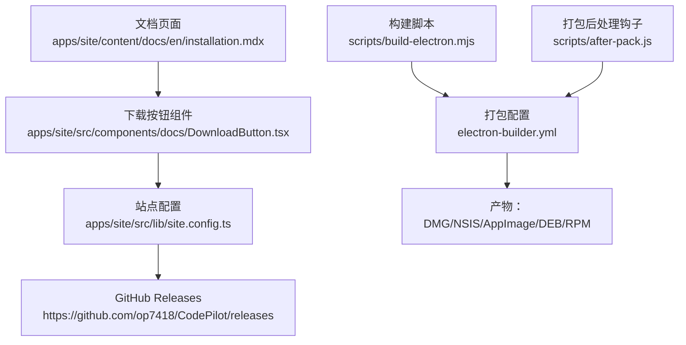
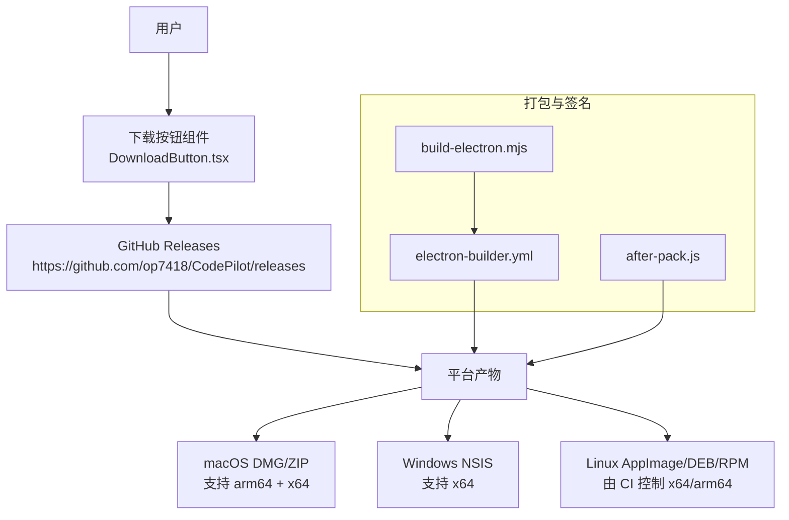
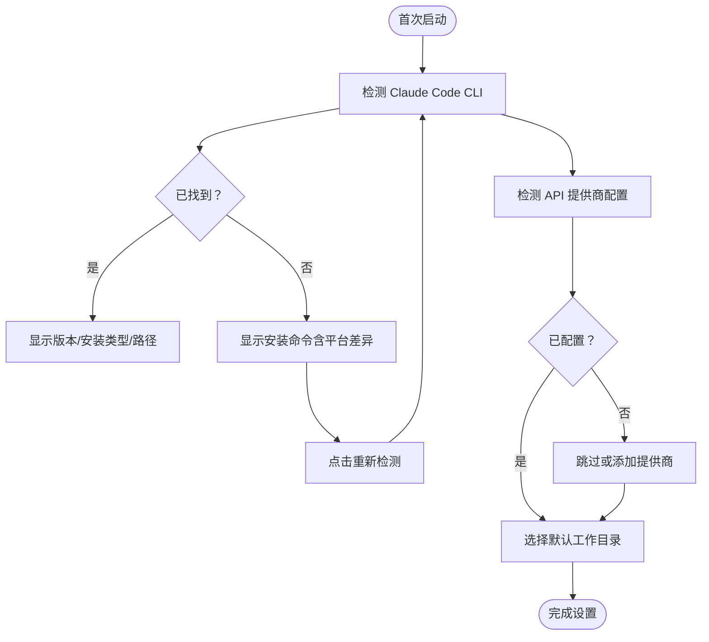
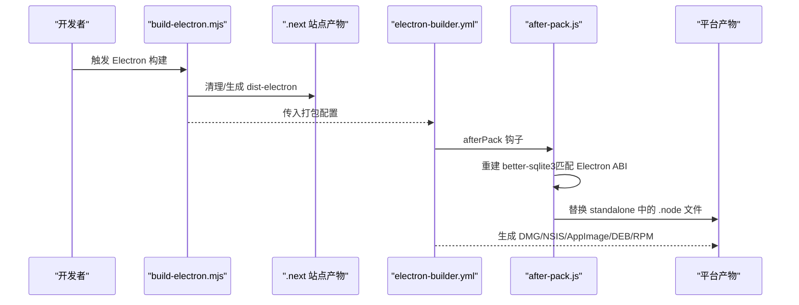
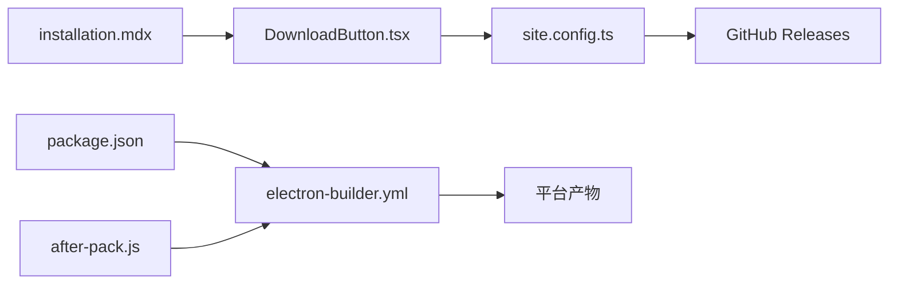

# 下载与安装

<cite>
**本文引用的文件**
- [apps/site/content/docs/en/installation.mdx](file://apps/site/content/docs/en/installation.mdx)
- [apps/site/src/components/docs/DownloadButton.tsx](file://apps/site/src/components/docs/DownloadButton.tsx)
- [apps/site/src/lib/site.config.ts](file://apps/site/src/lib/site.config.ts)
- [electron-builder.yml](file://electron-builder.yml)
- [package.json](file://package.json)
- [scripts/build-electron.mjs](file://scripts/build-electron.mjs)
- [scripts/after-pack.js](file://scripts/after-pack.js)
</cite>

## 目录
1. [简介](#简介)
2. [项目结构](#项目结构)
3. [核心组件](#核心组件)
4. [架构总览](#架构总览)
5. [详细组件分析](#详细组件分析)
6. [依赖关系分析](#依赖关系分析)
7. [性能考虑](#性能考虑)
8. [故障排查指南](#故障排查指南)
9. [结论](#结论)
10. [附录](#附录)

## 简介
本指南面向首次接触 CodePilot 的用户，提供跨平台下载与安装的完整流程，覆盖 macOS、Windows、Linux 的具体步骤；解释各平台支持的架构与安装包类型差异；说明首次启动时的系统兼容性检查机制；并给出常见安装问题的解决方案。同时明确环境要求（Node.js 18+）与可选依赖（Claude Code CLI）的安装建议。

## 项目结构
与“下载与安装”直接相关的核心位置如下：
- 官方文档页面：英文安装文档位于站点内容目录，包含系统要求、下载入口、安装步骤、首次启动与常见问题等。
- 下载按钮组件：在文档页中通过组件生成“下载最新版本”的链接，该链接指向仓库的 GitHub Releases 页面。
- 构建配置：electron-builder.yml 描述了各平台目标产物（DMG、NSIS、AppImage、DEB、RPM）及架构策略。
- 打包脚本：构建 Electron 主进程与预加载脚本，并在打包后对原生模块进行重建与替换，确保 Electron ABI 兼容。

图表来源
- [apps/site/content/docs/en/installation.mdx:1-123](file://apps/site/content/docs/en/installation.mdx#L1-L123)
- [apps/site/src/components/docs/DownloadButton.tsx:1-16](file://apps/site/src/components/docs/DownloadButton.tsx#L1-L16)
- [apps/site/src/lib/site.config.ts:1-35](file://apps/site/src/lib/site.config.ts#L1-L35)
- [electron-builder.yml:1-94](file://electron-builder.yml#L1-L94)
- [scripts/build-electron.mjs:1-66](file://scripts/build-electron.mjs#L1-L66)
- [scripts/after-pack.js:1-127](file://scripts/after-pack.js#L1-L127)

章节来源
- [apps/site/content/docs/en/installation.mdx:1-123](file://apps/site/content/docs/en/installation.mdx#L1-L123)
- [apps/site/src/components/docs/DownloadButton.tsx:1-16](file://apps/site/src/components/docs/DownloadButton.tsx#L1-L16)
- [apps/site/src/lib/site.config.ts:1-35](file://apps/site/src/lib/site.config.ts#L1-L35)
- [electron-builder.yml:1-94](file://electron-builder.yml#L1-L94)
- [scripts/build-electron.mjs:1-66](file://scripts/build-electron.mjs#L1-L66)
- [scripts/after-pack.js:1-127](file://scripts/after-pack.js#L1-L127)

## 核心组件
- 系统要求与环境
  - 操作系统：macOS 12+（Apple Silicon 或 Intel）、Windows 10+（64 位）
  - 运行时：Node.js 18 或更高版本
  - 可选依赖：Claude Code CLI（若未安装，将在首次启动时自动提示安装）
- 下载入口
  - 文档页提供“下载最新版本”按钮，点击后跳转至 GitHub Releases 页面
- 首次启动与设置中心
  - 自动打开“设置中心”，引导完成三步前置条件：Claude Code CLI 检测、API 提供商配置、默认工作目录选择
- 常见冲突与修复
  - 多个 Claude Code 安装导致的冲突与清理命令
- 更新机制
  - 应用内自动更新通知，或在“通用设置”中手动检查更新

章节来源
- [apps/site/content/docs/en/installation.mdx:6-123](file://apps/site/content/docs/en/installation.mdx#L6-L123)

## 架构总览
下图展示从用户点击“下载”到安装完成的关键路径，以及各平台产物与架构支持概览。

图表来源
- [apps/site/src/components/docs/DownloadButton.tsx:1-16](file://apps/site/src/components/docs/DownloadButton.tsx#L1-L16)
- [apps/site/src/lib/site.config.ts:12-18](file://apps/site/src/lib/site.config.ts#L12-L18)
- [electron-builder.yml:50-94](file://electron-builder.yml#L50-L94)
- [scripts/build-electron.mjs:26-60](file://scripts/build-electron.mjs#L26-L60)
- [scripts/after-pack.js:17-127](file://scripts/after-pack.js#L17-L127)

## 详细组件分析

### 平台与架构支持
- macOS
  - 支持架构：arm64（Apple Silicon）+ x64（Intel）
  - 安装包类型：DMG（磁盘映像），便于拖拽安装
- Windows
  - 支持架构：x64
  - 安装包类型：NSIS 安装器（exe），提供开始菜单快捷方式
- Linux
  - 支持架构：由 CI 通过命令行参数控制（x64 或 arm64）
  - 安装包类型：AppImage、DEB、RPM，满足不同发行版生态

章节来源
- [apps/site/content/docs/en/installation.mdx:19-23](file://apps/site/content/docs/en/installation.mdx#L19-L23)
- [electron-builder.yml:50-94](file://electron-builder.yml#L50-L94)

### 安装包类型与适用场景
- DMG（macOS）
  - 适合个人桌面安装，便于从 Finder 拖拽到应用程序文件夹
- EXE（Windows）
  - NSIS 安装器，提供标准安装体验与快捷方式创建
- AppImage（Linux）
  - 即取即用，无需安装，适合便携使用
- DEB（Debian/Ubuntu）
  - 适用于基于 Debian 的发行版，可通过软件中心或命令行安装
- RPM（Red Hat/Fedora/SUSE）
  - 适用于基于 RPM 的发行版，便于通过包管理器安装

章节来源
- [apps/site/content/docs/en/installation.mdx:19-23](file://apps/site/content/docs/en/installation.mdx#L19-L23)
- [electron-builder.yml:90-94](file://electron-builder.yml#L90-L94)

### 首次启动与系统兼容性检查
- 设置中心三步走
  1) Claude Code CLI 检测
     - 已检测：显示版本、安装类型（原生/npm/bun/homebrew）与二进制路径
     - 未找到：提供对应平台的安装命令；Windows 提示 Git 缺失时提供安装指引
     - 多实例冲突：列出当前使用与其它安装路径，附带按类型卸载命令
  2) API 提供商配置
     - 检查数据库配置、环境变量（如 ANTHROPIC_API_KEY/ANTHROPIC_AUTH_TOKEN）、旧版应用设置
     - 未配置时可跳过，但发送消息前仍会提示配置
  3) 默认工作目录
     - 选择新对话的默认工作目录，可随时按会话调整
- 重新打开设置中心
  - 可在“设置 > 通用 > 初始设置指南”中随时重开

图表来源
- [apps/site/content/docs/en/installation.mdx:39-78](file://apps/site/content/docs/en/installation.mdx#L39-L78)

章节来源
- [apps/site/content/docs/en/installation.mdx:39-107](file://apps/site/content/docs/en/installation.mdx#L39-L107)

### 安装步骤（按平台）
- macOS
  1) 下载对应架构的 .dmg 文件
  2) 打开 .dmg，将 CodePilot 拖入“应用程序”
  3) 从“应用程序”启动
  4) 首次启动可能提示“未验证开发者”，前往“系统设置 > 隐私与安全”确认打开
- Windows
  1) 下载 .exe 安装程序
  2) 运行安装程序并按提示操作
  3) 安装完成后可在“开始菜单”找到 CodePilot
- Linux（通用流程）
  - AppImage：双击运行或赋予可执行权限后运行
  - DEB：使用软件中心或命令行安装
  - RPM：使用包管理器安装

章节来源
- [apps/site/content/docs/en/installation.mdx:24-38](file://apps/site/content/docs/en/installation.mdx#L24-L38)

### 环境要求与可选依赖
- 环境要求
  - Node.js 18 或更高版本（用于开发与构建，运行时由打包产物内置）
- 可选依赖（推荐）
  - Claude Code CLI：若未安装，首次启动会提示安装命令；推荐使用原生安装脚本以避免多源冲突

章节来源
- [apps/site/content/docs/en/installation.mdx:6-11](file://apps/site/content/docs/en/installation.mdx#L6-L11)

### 构建与打包链路（技术视角）
- Electron 主进程与预加载脚本构建
  - 使用 esbuild 将 electron/main.ts 与 electron/preload.ts 分别打包为 dist-electron/main.js 与 dist-electron/preload.js
  - 目标平台为 node18，外部化 electron，保留 sourcemap
- 站点资源与静态文件打包
  - electron-builder 将 .next/standalone 产物与 public、themes 等资源复制到 standalone 目录，确保应用自包含
- 原生模块 ABI 兼容性
  - after-pack 钩子在打包后对 better-sqlite3 进行针对 Electron 版本与架构的重建，并将生成的 .node 文件替换到所有 standalone 路径中
- 平台产物与架构
  - macOS：dmg、zip，支持 x64 与 arm64
  - Windows：nsis，支持 x64 与 arm64
  - Linux：AppImage、deb、rpm，由 CI 通过 --x64/--arm64 控制

图表来源
- [scripts/build-electron.mjs:26-60](file://scripts/build-electron.mjs#L26-L60)
- [electron-builder.yml:20-46](file://electron-builder.yml#L20-L46)
- [scripts/after-pack.js:17-127](file://scripts/after-pack.js#L17-L127)

章节来源
- [scripts/build-electron.mjs:1-66](file://scripts/build-electron.mjs#L1-L66)
- [electron-builder.yml:1-94](file://electron-builder.yml#L1-L94)
- [scripts/after-pack.js:1-127](file://scripts/after-pack.js#L1-L127)

## 依赖关系分析
- 文档与下载入口
  - installation.mdx 提供系统要求与下载说明
  - DownloadButton.tsx 通过 site.config.ts 的 releases 地址生成最新版本链接
- 构建与打包
  - package.json 中定义了 electron:pack:* 脚本，调用 electron-builder 并读取 electron-builder.yml
  - after-pack.js 在打包后处理原生模块，确保 Electron ABI 兼容

图表来源
- [apps/site/content/docs/en/installation.mdx:1-16](file://apps/site/content/docs/en/installation.mdx#L1-L16)
- [apps/site/src/components/docs/DownloadButton.tsx:1-16](file://apps/site/src/components/docs/DownloadButton.tsx#L1-L16)
- [apps/site/src/lib/site.config.ts:12-18](file://apps/site/src/lib/site.config.ts#L12-L18)
- [package.json:33-36](file://package.json#L33-L36)
- [electron-builder.yml:1-94](file://electron-builder.yml#L1-L94)
- [scripts/after-pack.js:17-127](file://scripts/after-pack.js#L17-L127)

章节来源
- [apps/site/content/docs/en/installation.mdx:1-16](file://apps/site/content/docs/en/installation.mdx#L1-L16)
- [apps/site/src/components/docs/DownloadButton.tsx:1-16](file://apps/site/src/components/docs/DownloadButton.tsx#L1-L16)
- [apps/site/src/lib/site.config.ts:12-18](file://apps/site/src/lib/site.config.ts#L12-L18)
- [package.json:33-36](file://package.json#L33-L36)
- [electron-builder.yml:1-94](file://electron-builder.yml#L1-L94)
- [scripts/after-pack.js:17-127](file://scripts/after-pack.js#L17-L127)

## 性能考虑
- 首次启动时的设置中心仅进行本地检测与必要提示，不会影响应用核心功能
- 原生模块的 Electron ABI 重建与替换在打包阶段完成，不影响运行时性能
- Linux 发行版安装包类型多样，建议优先选择与系统生态契合的格式（如 DEB/RPM）

## 故障排查指南
- macOS 启动提示“未验证开发者”
  - 解决：前往“系统设置 > 隐私与安全”，点击“仍要打开”
- Windows 启动报错或无法找到 Claude Code CLI
  - 解决：根据提示安装 Git（Windows）；使用平台对应的安装命令安装 Claude Code CLI；点击“重新检测”
- 多个 Claude Code 安装导致冲突
  - 解决：按设置中心提示清理多余安装（按类型提供卸载命令），仅保留一种安装方式
- Linux 无法运行 AppImage/DEB/RPM
  - 解决：确保具备执行权限；DEB/RPM 需使用相应包管理器安装；如遇权限问题，检查用户组与权限设置

章节来源
- [apps/site/content/docs/en/installation.mdx:31-107](file://apps/site/content/docs/en/installation.mdx#L31-L107)

## 结论
通过官方文档与下载入口，用户可快速获取适用于自身平台的安装包；首次启动的设置中心帮助完成关键前置条件（Claude Code CLI、API 提供商、默认工作目录）。构建与打包链路确保 Electron ABI 兼容与产物一致性，跨平台支持覆盖主流桌面环境。遇到问题时，可依据文档中的指引与冲突处理方案快速恢复。

## 附录
- 下载入口
  - “下载最新版本”按钮链接至 GitHub Releases 页面
- 更新方式
  - 应用内自动更新通知；或在“通用设置”中手动检查更新

章节来源
- [apps/site/src/components/docs/DownloadButton.tsx:4-14](file://apps/site/src/components/docs/DownloadButton.tsx#L4-L14)
- [apps/site/src/lib/site.config.ts:16](file://apps/site/src/lib/site.config.ts#L16)
- [apps/site/content/docs/en/installation.mdx:120-123](file://apps/site/content/docs/en/installation.mdx#L120-L123)