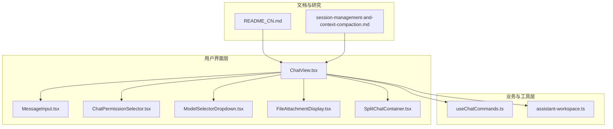
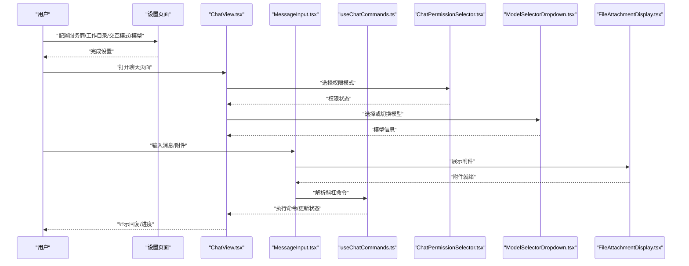
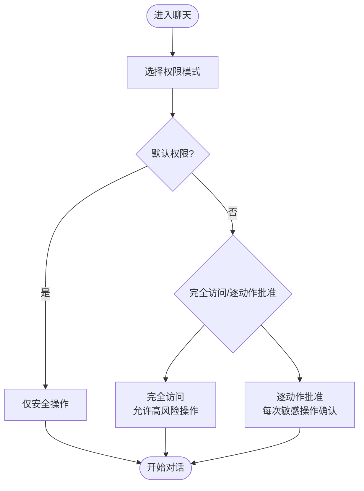
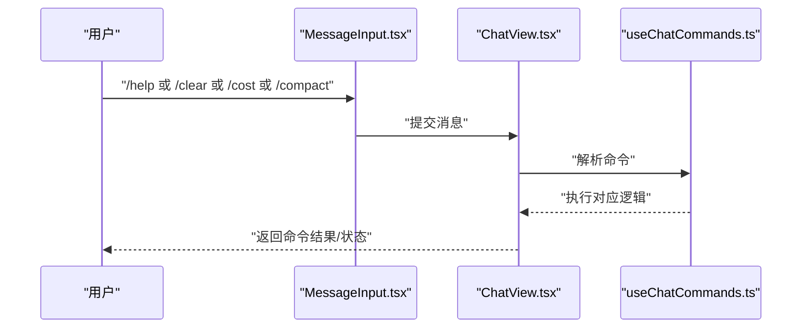
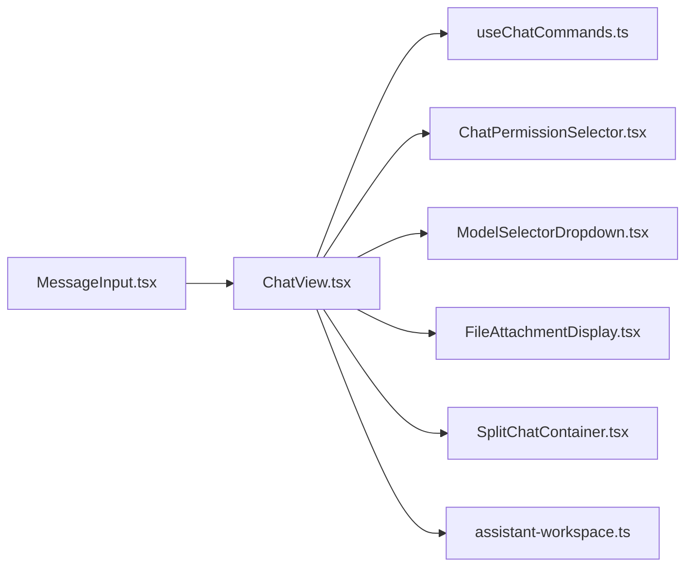

# 基础使用方法

<cite>
**本文引用的文件**
- [README_CN.md](file://README_CN.md)
- [ChatView.tsx](file://src/components/chat/ChatView.tsx)
- [MessageInput.tsx](file://src/components/chat/MessageInput.tsx)
- [useChatCommands.ts](file://src/hooks/useChatCommands.ts)
- [ChatPermissionSelector.tsx](file://src/components/chat/ChatPermissionSelector.tsx)
- [ModelSelectorDropdown.tsx](file://src/components/chat/ModelSelectorDropdown.tsx)
- [FileAttachmentDisplay.tsx](file://src/components/chat/FileAttachmentDisplay.tsx)
- [SplitChatContainer.tsx](file://src/layout/panels/SplitChatContainer.tsx)
- [assistant-workspace.ts](file://src/lib/assistant-workspace.ts)
- [session-management-and-context-compaction.md](file://docs/research/session-management-and-context-compaction.md)
- [chat-sdk-integration-feasibility.md](file://docs/research/chat-sdk-integration-feasibility.md)
- [chat-enhanced.spec.ts](file://src/__tests__/e2e/chat-enhanced.spec.ts)
- [chat.spec.ts](file://src/__tests__/e2e/chat.spec.ts)
- [cli-tools-mcp.test.ts](file://src/__tests__/unit/cli-tools-mcp.test.ts)
- [permission-broker-bridge.manual-test.ts](file://src/__tests__/unit/permission-broker-bridge.manual-test.ts)
- [working-directory.test.ts](file://src/__tests__/unit/working-directory.test.ts)
</cite>

## 目录
1. [简介](#简介)
2. [项目结构](#项目结构)
3. [核心组件](#核心组件)
4. [架构总览](#架构总览)
5. [详细组件分析](#详细组件分析)
6. [依赖关系分析](#依赖关系分析)
7. [性能考量](#性能考量)
8. [故障排除指南](#故障排除指南)
9. [结论](#结论)
10. [附录](#附录)

## 简介
本指南面向首次使用 CodePilot 的用户，帮助你快速完成第一次对话，掌握交互模式、权限控制、会话管理、常用斜杠命令以及附件上传、模型切换、分屏显示等基础功能。文档基于仓库中的用户文档与前端组件实现，确保操作步骤与实际代码行为一致。

## 项目结构
围绕“基础使用”，以下文件与组件最为关键：
- 首次使用与核心能力说明：README_CN.md
- 聊天视图与命令处理：ChatView.tsx、MessageInput.tsx、useChatCommands.ts
- 权限选择器：ChatPermissionSelector.tsx
- 模型选择器：ModelSelectorDropdown.tsx
- 附件上传展示：FileAttachmentDisplay.tsx
- 分屏容器：SplitChatContainer.tsx
- 助理工作区（工作目录与上下文）：assistant-workspace.ts
- 会话管理与上下文压缩研究文档：session-management-and-context-compaction.md
- 相关测试用例（验证功能行为）：chat-enhanced.spec.ts、chat.spec.ts、cli-tools-mcp.test.ts、permission-broker-bridge.manual-test.ts、working-directory.test.ts

**图表来源**
- [README_CN.md:142-149](file://README_CN.md#L142-L149)
- [ChatView.tsx:32](file://src/components/chat/ChatView.tsx#L32)
- [useChatCommands.ts:10](file://src/hooks/useChatCommands.ts#L10)
- [ChatPermissionSelector.tsx](file://src/components/chat/ChatPermissionSelector.tsx)
- [ModelSelectorDropdown.tsx](file://src/components/chat/ModelSelectorDropdown.tsx)
- [FileAttachmentDisplay.tsx](file://src/components/chat/FileAttachmentDisplay.tsx)
- [SplitChatContainer.tsx](file://src/layout/panels/SplitChatContainer.tsx)
- [assistant-workspace.ts](file://src/lib/assistant-workspace.ts)

**章节来源**
- [README_CN.md:142-149](file://README_CN.md#L142-L149)
- [README_CN.md:100-114](file://README_CN.md#L100-L114)

## 核心组件
- 首次使用流程：服务商配置、选择工作目录、交互模式与模型选择、可选的 Assistant Workspace 初始化。
- 聊天输入与命令：MessageInput.tsx 提供输入区域、斜杠命令弹窗与快捷操作；ChatView.tsx 负责渲染消息列表与命令处理；useChatCommands.ts 统一处理斜杠命令。
- 权限控制：ChatPermissionSelector.tsx 提供默认权限与完全访问权限之间的切换，必要时触发逐项审批。
- 模型切换：ModelSelectorDropdown.tsx 支持在对话中随时切换模型。
- 附件上传：FileAttachmentDisplay.tsx 展示已选择的文件与图片，支持多模态视觉输入。
- 分屏显示：SplitChatContainer.tsx 实现并排双会话布局。
- 工作目录与上下文：assistant-workspace.ts 管理工作区文件与上下文注入。

**章节来源**
- [README_CN.md:142-149](file://README_CN.md#L142-L149)
- [README_CN.md:100-114](file://README_CN.md#L100-L114)
- [ChatView.tsx:804](file://src/components/chat/ChatView.tsx#L804)
- [useChatCommands.ts:10](file://src/hooks/useChatCommands.ts#L10)

## 架构总览
下图展示了“首次对话”的端到端流程：从设置服务商与工作目录，到选择交互模式与模型，再到发起聊天、处理斜杠命令、权限控制与附件上传。

**图表来源**
- [README_CN.md:142-149](file://README_CN.md#L142-L149)
- [ChatView.tsx:32](file://src/components/chat/ChatView.tsx#L32)
- [useChatCommands.ts:10](file://src/hooks/useChatCommands.ts#L10)
- [ChatPermissionSelector.tsx](file://src/components/chat/ChatPermissionSelector.tsx)
- [ModelSelectorDropdown.tsx](file://src/components/chat/ModelSelectorDropdown.tsx)
- [FileAttachmentDisplay.tsx](file://src/components/chat/FileAttachmentDisplay.tsx)

## 详细组件分析

### 交互模式（Code/Plan/Ask）
- 特点与适用场景
  - Code：专注编码任务，适合编写/重构/调试代码。
  - Plan：专注制定与拆解任务计划，适合需求分析、项目规划。
  - Ask：专注问答与知识检索，适合查询文档、概念解释。
- 选择入口：首次使用说明中明确要求在创建对话时选择交互模式与模型。
- 行为依据：README_CN.md 中“核心能力”与“首次使用”段落均强调交互模式的选择。

**章节来源**
- [README_CN.md:106](file://README_CN.md#L106)
- [README_CN.md:145](file://README_CN.md#L145)

### 权限控制系统（默认权限、完全访问、逐动作批准）
- 默认权限：适用于常规对话，限制高风险操作。
- 完全访问：允许执行更广泛的系统/文件/终端操作。
- 逐动作批准：对敏感操作进行二次确认。
- 选择入口：ChatPermissionSelector.tsx 提供权限模式切换与确认提示。
- 行为依据：README_CN.md “核心能力”与“首次使用”段落说明权限控制与交互模式并列。

**图表来源**
- [ChatPermissionSelector.tsx](file://src/components/chat/ChatPermissionSelector.tsx)
- [README_CN.md:108](file://README_CN.md#L108)

**章节来源**
- [README_CN.md:108](file://README_CN.md#L108)

### 会话管理（暂停、恢复、回退到检查点、归档）
- 暂停与恢复：可在对话过程中临时停止生成，稍后再继续。
- 回退到检查点：支持将会话回退到任意历史检查点，便于修正思路或重新尝试。
- 归档：可将已完成的会话归档以便后续查阅。
- 行为依据：README_CN.md 明确列出“暂停、恢复和回退会话到任意检查点”“会话控制”。

**章节来源**
- [README_CN.md:109](file://README_CN.md#L109)

### 常用斜杠命令（/help、/clear、/cost、/compact）
- /help：查看可用命令与帮助信息。
- /clear：清空当前会话消息列表。
- /cost：查看当前会话的 Token 用量与费用估算。
- /compact：压缩上下文，优化长对话的性能与成本。
- 处理机制：ChatView.tsx 通过 useChatCommands.ts 统一注册与执行斜杠命令，命令解析与执行在钩子中完成。

**图表来源**
- [ChatView.tsx:804](file://src/components/chat/ChatView.tsx#L804)
- [useChatCommands.ts:10](file://src/hooks/useChatCommands.ts#L10)
- [README_CN.md:113](file://README_CN.md#L113)

**章节来源**
- [README_CN.md:113](file://README_CN.md#L113)
- [ChatView.tsx:804](file://src/components/chat/ChatView.tsx#L804)
- [useChatCommands.ts:10](file://src/hooks/useChatCommands.ts#L10)

### 附件上传、模型切换与分屏显示
- 附件上传：在消息输入区域选择文件或图片，FileAttachmentDisplay.tsx 展示附件并参与多模态输入。
- 模型切换：在对话中随时通过 ModelSelectorDropdown.tsx 切换模型，保持上下文连续。
- 分屏显示：使用 SplitChatContainer.tsx 并排运行两个对话，提高多任务效率。
- 行为依据：README_CN.md “核心能力”列出“附件”“模型切换”“分屏”。

**章节来源**
- [README_CN.md:112](file://README_CN.md#L112)
- [README_CN.md:110](file://README_CN.md#L110)
- [README_CN.md:111](file://README_CN.md#L111)

### 工作目录与 Assistant Workspace
- 工作目录：首次使用时选择项目根目录，作为后续文件检索、编辑与上下文注入的基础。
- Assistant Workspace：可选启用，用于注入人设文件与记忆，提升对话个性化与一致性。
- 行为依据：README_CN.md “首次使用”与 “核心能力”中关于工作目录与 Workspace 的说明。

**章节来源**
- [README_CN.md:144](file://README_CN.md#L144)
- [README_CN.md:145](file://README_CN.md#L145)
- [README_CN.md:130](file://README_CN.md#L130)

## 依赖关系分析
- ChatView.tsx 依赖 useChatCommands.ts 进行命令解析与执行。
- MessageInput.tsx 与 ChatView.tsx 协同处理输入、附件与斜杠命令。
- ChatPermissionSelector.tsx、ModelSelectorDropdown.tsx、FileAttachmentDisplay.tsx、SplitChatContainer.tsx 分别负责权限、模型、附件与布局。
- assistant-workspace.ts 为工作目录与上下文注入提供支撑。

**图表来源**
- [ChatView.tsx:32](file://src/components/chat/ChatView.tsx#L32)
- [useChatCommands.ts:10](file://src/hooks/useChatCommands.ts#L10)
- [ChatPermissionSelector.tsx](file://src/components/chat/ChatPermissionSelector.tsx)
- [ModelSelectorDropdown.tsx](file://src/components/chat/ModelSelectorDropdown.tsx)
- [FileAttachmentDisplay.tsx](file://src/components/chat/FileAttachmentDisplay.tsx)
- [SplitChatContainer.tsx](file://src/layout/panels/SplitChatContainer.tsx)
- [assistant-workspace.ts](file://src/lib/assistant-workspace.ts)

**章节来源**
- [ChatView.tsx:32](file://src/components/chat/ChatView.tsx#L32)
- [useChatCommands.ts:10](file://src/hooks/useChatCommands.ts#L10)

## 性能考量
- 上下文压缩：在长对话中使用 /compact 压缩上下文，有助于降低 Token 消耗与延迟。
- 会话检查点：通过暂停/恢复与回退到检查点减少无效重算。
- 模型选择：根据任务复杂度选择合适模型，避免不必要的高成本推理。

**章节来源**
- [README_CN.md:113](file://README_CN.md#L113)
- [README_CN.md:109](file://README_CN.md#L109)

## 故障排除指南
- 服务商配置后模型不可见
  - 检查 API Key 有效性与端点可达性；部分服务商需要额外环境变量或 IAM 配置；可通过内置诊断功能检查连通性。
- 首次启动提示与安装问题
  - macOS Gatekeeper、Windows SmartScreen 提示按官方说明处理。
- 附件上传失败
  - 确认文件类型与大小限制；检查附件展示组件是否正常渲染。
- 权限不足导致操作受限
  - 切换至完全访问或逐动作批准模式；必要时逐项审批。

**章节来源**
- [README_CN.md:212](file://README_CN.md#L212)
- [README_CN.md:156](file://README_CN.md#L156)
- [README_CN.md:170](file://README_CN.md#L170)

## 结论
通过本指南，你可以完成首次对话的全流程：配置服务商与工作目录、选择交互模式与模型、设置权限、发起聊天并使用斜杠命令、上传附件、切换模型与分屏显示。结合会话管理与上下文压缩，可进一步提升效率与成本控制。

## 附录
- 相关测试参考
  - 聊天增强与基础聊天测试：chat-enhanced.spec.ts、chat.spec.ts
  - CLI 工具与 MCP 测试：cli-tools-mcp.test.ts
  - 权限与桥接测试：permission-broker-bridge.manual-test.ts
  - 工作目录测试：working-directory.test.ts
- 研究文档参考
  - 会话管理与上下文压缩：session-management-and-context-compaction.md
  - 聊天 SDK 集成可行性：chat-sdk-integration-feasibility.md

**章节来源**
- [chat-enhanced.spec.ts](file://src/__tests__/e2e/chat-enhanced.spec.ts)
- [chat.spec.ts](file://src/__tests__/e2e/chat.spec.ts)
- [cli-tools-mcp.test.ts](file://src/__tests__/unit/cli-tools-mcp.test.ts)
- [permission-broker-bridge.manual-test.ts](file://src/__tests__/unit/permission-broker-bridge.manual-test.ts)
- [working-directory.test.ts](file://src/__tests__/unit/working-directory.test.ts)
- [session-management-and-context-compaction.md](file://docs/research/session-management-and-context-compaction.md)
- [chat-sdk-integration-feasibility.md](file://docs/research/chat-sdk-integration-feasibility.md)