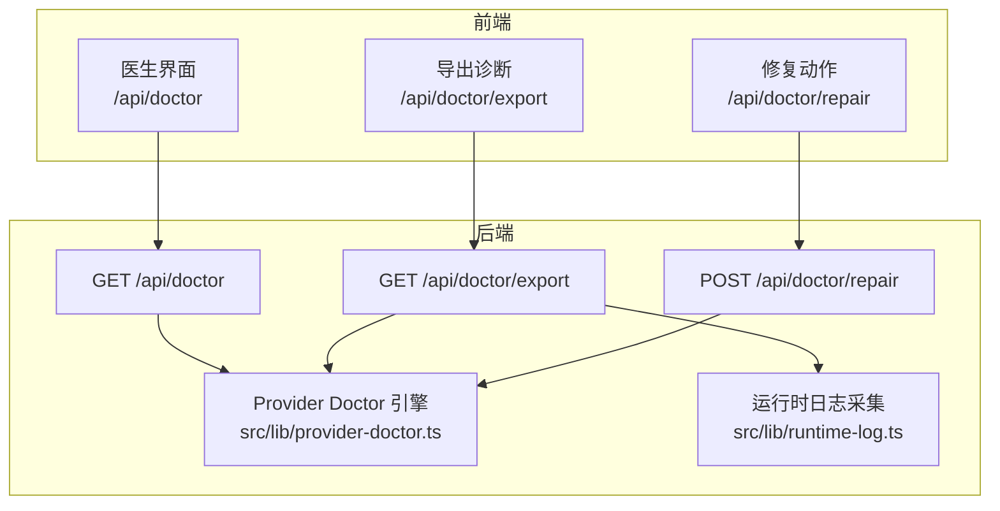
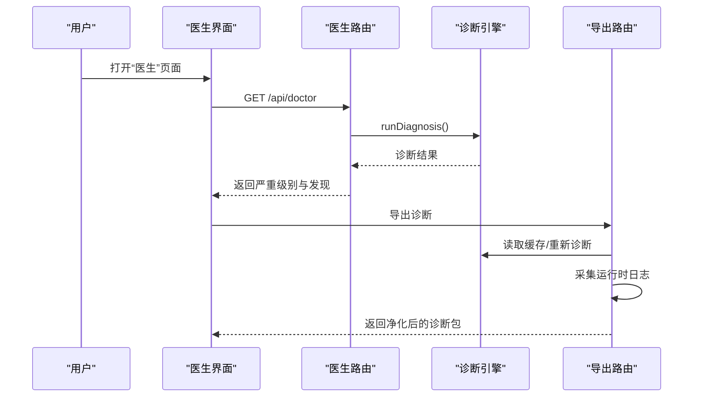
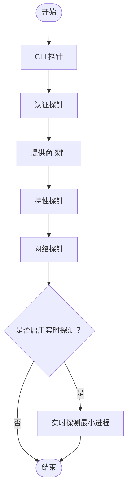
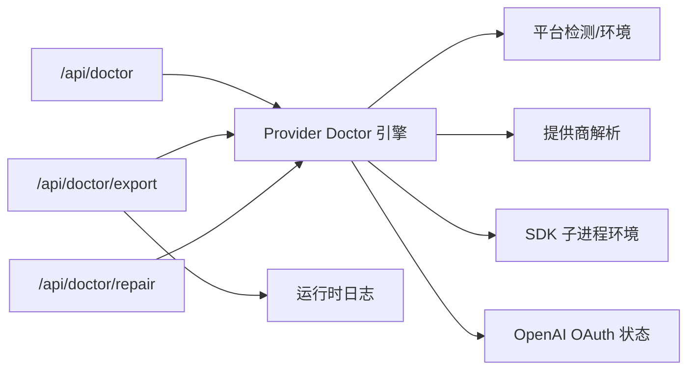

# 常见问题与故障排除

<cite>
**本文引用的文件**
- [apps/site/content/docs/en/faq.mdx](file://apps/site/content/docs/en/faq.mdx)
- [src/app/api/doctor/route.ts](file://src/app/api/doctor/route.ts)
- [src/app/api/doctor/export/route.ts](file://src/app/api/doctor/export/route.ts)
- [src/app/api/doctor/repair/route.ts](file://src/app/api/doctor/repair/route.ts)
- [src/lib/provider-doctor.ts](file://src/lib/provider-doctor.ts)
- [资料/weixin-openclaw-package/package/src/util/logger.ts](file://资料/weixin-openclaw-package/package/src/util/logger.ts)
- [资料/weixin-openclaw-package/package/src/api/api.ts](file://资料/weixin-openclaw-package/package/src/api/api.ts)
- [资料/weixin-openclaw-package/package/src/monitor/monitor.ts](file://资料/weixin-openclaw-package/package/src/monitor/monitor.ts)
- [资料/weixin-openclaw-package/package/src/api/session-guard.ts](file://资料/weixin-openclaw-package/package/src/api/session-guard.ts)
- [资料/weixin-openclaw-package/package/src/messaging/send.ts](file://资料/weixin-openclaw-package/package/src/messaging/send.ts)
- [资料/weixin-openclaw-cli/package/cli.mjs](file://资料/weixin-openclaw-cli/package/cli.mjs)
- [资料/feishu-openclaw-plugin/package/src/tools/mcp/shared.js](file://资料/feishu-openclaw-plugin/package/src/tools/mcp/shared.js)
</cite>

## 目录
1. [简介](#简介)
2. [项目结构](#项目结构)
3. [核心组件](#核心组件)
4. [架构总览](#架构总览)
5. [详细组件分析](#详细组件分析)
6. [依赖关系分析](#依赖关系分析)
7. [性能考虑](#性能考虑)
8. [故障排除指南](#故障排除指南)
9. [结论](#结论)
10. [附录](#附录)

## 简介
本指南面向 CodePilot 用户，聚焦于日常使用中最常见的问题与排障路径，覆盖以下主题：
- API 密钥配置失败与认证样式冲突
- 模型列表为空或默认模型缺失
- Claude Code CLI 未安装或多版本冲突
- 不同平台的启动与安全提示处理（macOS Gatekeeper、Windows SmartScreen）
- 网络连接问题、权限不足、文件访问限制
- 日志查看、错误信息解读与导出诊断报告
- 性能优化建议与已知限制

## 项目结构
围绕“诊断—修复—导出”的闭环，CodePilot 在前端 Next.js 中提供了统一的诊断入口与修复动作接口，并在后端通过诊断引擎对 CLI、认证、提供商、特性兼容性与网络进行系统性检查。

图表来源
- [src/app/api/doctor/route.ts:1-38](file://src/app/api/doctor/route.ts#L1-L38)
- [src/app/api/doctor/export/route.ts:1-151](file://src/app/api/doctor/export/route.ts#L1-L151)
- [src/app/api/doctor/repair/route.ts:1-189](file://src/app/api/doctor/repair/route.ts#L1-L189)
- [src/lib/provider-doctor.ts:1-800](file://src/lib/provider-doctor.ts#L1-L800)

章节来源
- [src/app/api/doctor/route.ts:1-38](file://src/app/api/doctor/route.ts#L1-L38)
- [src/app/api/doctor/export/route.ts:1-151](file://src/app/api/doctor/export/route.ts#L1-L151)
- [src/app/api/doctor/repair/route.ts:1-189](file://src/app/api/doctor/repair/route.ts#L1-L189)
- [src/lib/provider-doctor.ts:1-800](file://src/lib/provider-doctor.ts#L1-L800)

## 核心组件
- 医生路由（/api/doctor）：运行静态诊断与可选的实时探测，返回整体严重级别与逐项发现。
- 修复动作路由（/api/doctor/repair）：根据诊断结果提供一键修复动作，如设置默认提供商、切换认证样式、清理过期会话标识等。
- 导出路由（/api/doctor/export）：生成可分享的诊断包，含净化后的诊断结果、最近运行时日志与当前提供商解析链。
- 诊断引擎（Provider Doctor）：对 CLI、认证、提供商、特性兼容性与网络进行系统性检查，输出标准化的严重级别与修复建议。

章节来源
- [src/app/api/doctor/route.ts:1-38](file://src/app/api/doctor/route.ts#L1-L38)
- [src/app/api/doctor/export/route.ts:1-151](file://src/app/api/doctor/export/route.ts#L1-L151)
- [src/app/api/doctor/repair/route.ts:1-189](file://src/app/api/doctor/repair/route.ts#L1-L189)
- [src/lib/provider-doctor.ts:1-800](file://src/lib/provider-doctor.ts#L1-L800)

## 架构总览
下图展示从用户触发诊断到导出诊断包的关键流程与关键文件映射。

图表来源
- [src/app/api/doctor/route.ts:1-38](file://src/app/api/doctor/route.ts#L1-L38)
- [src/app/api/doctor/export/route.ts:1-151](file://src/app/api/doctor/export/route.ts#L1-L151)
- [src/lib/provider-doctor.ts:1-800](file://src/lib/provider-doctor.ts#L1-L800)

## 详细组件分析

### 诊断引擎（Provider Doctor）
- 职责：对 CLI、认证、提供商、特性兼容性与网络进行系统性检查；支持快速静态检查与可选的实时探测。
- 关键检查点：
  - CLI 探针：二进制存在性、版本查询、多版本冲突、Windows Git Bash 缺失提示。
  - 认证探针：环境变量与数据库存储的密钥状态、OpenAI OAuth 状态、认证样式冲突与歧义。
  - 提供商探针：默认提供商、模型配置、第三方 Anthropic 端点的显式模型需求、解析路径。
  - 特性探针：思维模式、1M 上下文等特性与协议的兼容性，以及过期会话标识风险。
  - 网络探针：对解析出的上游地址发起 HEAD 请求，判断可达性与超时。
- 实时探测：以真实 SDK 环境启动最小 Claude 进程，验证运行时可用性，避免“配置通过、实际不可用”的误判。

图表来源
- [src/lib/provider-doctor.ts:100-170](file://src/lib/provider-doctor.ts#L100-L170)
- [src/lib/provider-doctor.ts:172-307](file://src/lib/provider-doctor.ts#L172-L307)
- [src/lib/provider-doctor.ts:309-513](file://src/lib/provider-doctor.ts#L309-L513)
- [src/lib/provider-doctor.ts:515-610](file://src/lib/provider-doctor.ts#L515-L610)
- [src/lib/provider-doctor.ts:612-687](file://src/lib/provider-doctor.ts#L612-L687)
- [src/lib/provider-doctor.ts:689-800](file://src/lib/provider-doctor.ts#L689-L800)

章节来源
- [src/lib/provider-doctor.ts:1-800](file://src/lib/provider-doctor.ts#L1-L800)

### 修复动作（/api/doctor/repair）
- 支持动作类型：
  - 设置默认提供商
  - 清理过期会话标识（单个或全部）
  - 切换认证样式（API Key 与 Auth Token 互换）
  - 将默认提供商应用到会话
  - 重新导入环境变量配置到数据库设置
- 作用：在诊断发现问题后，提供一键修复，减少手工配置成本。

章节来源
- [src/app/api/doctor/repair/route.ts:1-189](file://src/app/api/doctor/repair/route.ts#L1-L189)

### 导出诊断（/api/doctor/export）
- 功能：生成可分享的诊断包，包含：
  - 净化后的诊断结果（URL、API Key 等敏感信息脱敏）
  - 最近运行时日志
  - 当前提供商解析链（协议、认证方式、模型、上游模型等）
  - 实时探测错误（若存在）
- 安全策略：对 URL、API Key、路径等字段进行净化，仅暴露必要信息。

章节来源
- [src/app/api/doctor/export/route.ts:1-151](file://src/app/api/doctor/export/route.ts#L1-L151)

### 日志与错误处理（微信通道示例）
- 日志：统一写入主日志文件，支持动态调整日志级别，便于定位问题。
- 错误：HTTP 请求失败抛出带状态码与响应体的错误；长轮询超时按约定返回空响应以便重试。
- 会话保护：当服务端返回特定错误码时，客户端暂停一段时间，避免频繁重试造成压力。

章节来源
- [资料/weixin-openclaw-package/package/src/util/logger.ts:1-143](file://资料/weixin-openclaw-package/package/src/util/logger.ts#L1-L143)
- [资料/weixin-openclaw-package/package/src/api/api.ts:88-157](file://资料/weixin-openclaw-package/package/src/api/api.ts#L88-L157)
- [资料/weixin-openclaw-package/package/src/api/session-guard.ts:1-58](file://资料/weixin-openclaw-package/package/src/api/session-guard.ts#L1-L58)

## 依赖关系分析
- 医生路由依赖诊断引擎；导出路由依赖诊断引擎与运行时日志采集；修复路由直接操作数据库与设置。
- 诊断引擎内部依赖平台检测、提供商解析、SDK 环境准备、错误分类器与 OAuth 状态查询等模块。

图表来源
- [src/app/api/doctor/route.ts:1-38](file://src/app/api/doctor/route.ts#L1-L38)
- [src/app/api/doctor/export/route.ts:1-151](file://src/app/api/doctor/export/route.ts#L1-L151)
- [src/app/api/doctor/repair/route.ts:1-189](file://src/app/api/doctor/repair/route.ts#L1-L189)
- [src/lib/provider-doctor.ts:1-800](file://src/lib/provider-doctor.ts#L1-L800)

章节来源
- [src/lib/provider-doctor.ts:1-800](file://src/lib/provider-doctor.ts#L1-L800)

## 性能考虑
- 快速诊断优先：默认仅运行静态检查，实时探测需显式开启，避免阻塞 UI。
- 并发网络检查：对多个上游地址并发 HEAD 请求，缩短等待时间。
- 会话保护与退避：在连续失败时采用指数退避与固定间隔退避，降低对上游的压力。
- 日志级别控制：通过环境变量动态调整日志级别，减少高噪声日志对性能的影响。

章节来源
- [src/app/api/doctor/route.ts:7-11](file://src/app/api/doctor/route.ts#L7-L11)
- [src/lib/provider-doctor.ts:612-687](file://src/lib/provider-doctor.ts#L612-L687)
- [资料/weixin-openclaw-package/package/src/monitor/monitor.ts:194-221](file://资料/weixin-openclaw-package/package/src/monitor/monitor.ts#L194-L221)
- [资料/weixin-openclaw-package/package/src/util/logger.ts:38-45](file://资料/weixin-openclaw-package/package/src/util/logger.ts#L38-L45)

## 故障排除指南

### API 密钥配置失败
- 症状
  - “无可用凭据”或“解析提供商无可用凭据”
  - 同时设置 API Key 与 Auth Token 导致认证样式歧义
- 诊断要点
  - 检查环境变量与数据库设置中的密钥是否存在
  - 若同时存在两种样式，建议移除其一以避免冲突
  - 对第三方提供商，确认 extra_env 中的认证样式与实际服务一致
- 修复动作
  - 使用“切换认证样式”修复认证样式冲突
  - 使用“重新导入环境配置”将环境变量持久化至数据库设置
- 参考
  - 认证探针与修复动作实现

章节来源
- [src/lib/provider-doctor.ts:172-307](file://src/lib/provider-doctor.ts#L172-L307)
- [src/app/api/doctor/repair/route.ts:54-110](file://src/app/api/doctor/repair/route.ts#L54-L110)
- [src/app/api/doctor/repair/route.ts:151-174](file://src/app/api/doctor/repair/route.ts#L151-L174)

### 模型列表为空或默认模型缺失
- 症状
  - 提供商无模型配置或默认模型为空
  - 第三方 Anthropic 端点依赖显式模型名
- 诊断要点
  - 检查提供商的模型配置、角色默认模型与环境覆盖
  - 对非官方 Anthropic 端点，建议显式设置默认模型
- 修复动作
  - 在提供商设置中添加默认模型或通过环境覆盖指定模型
- 参考
  - 提供商探针与修复动作实现

章节来源
- [src/lib/provider-doctor.ts:309-513](file://src/lib/provider-doctor.ts#L309-L513)
- [src/app/api/doctor/repair/route.ts:1-189](file://src/app/api/doctor/repair/route.ts#L1-L189)

### Claude Code CLI 未安装或多版本冲突
- 症状
  - “未找到 Claude CLI”或“检测到多个安装”
  - Windows 下缺少 Git Bash
- 诊断要点
  - 检查系统 PATH 是否包含 CLI 二进制
  - 多版本冲突时建议清理多余安装并重新检测
  - Windows 建议安装 Git Bash 以提升兼容性
- 修复动作
  - 重新检测 CLI 安装状态
  - 清理多余安装后重试
- 参考
  - CLI 探针与 FAQ 文档

章节来源
- [src/lib/provider-doctor.ts:100-170](file://src/lib/provider-doctor.ts#L100-L170)
- [apps/site/content/docs/en/faq.mdx:33-58](file://apps/site/content/docs/en/faq.mdx#L33-L58)

### 不同平台的启动问题（macOS Gatekeeper、Windows SmartScreen）
- macOS Gatekeeper
  - 症状：系统提示“无法验证开发者”
  - 处理：前往“系统设置 > 隐私与安全性”，点击“仍要打开”
- Windows SmartScreen
  - 症状：SmartScreen 拦截未知发布者
  - 处理：点击“仍要运行”
- 参考
  - FAQ 文档

章节来源
- [apps/site/content/docs/en/faq.mdx:77-80](file://apps/site/content/docs/en/faq.mdx#L77-L80)

### 网络连接问题
- 症状
  - 上游地址不可达或超时
- 诊断要点
  - 使用网络探针检查解析出的上游地址可达性
  - 对第三方提供商，确认 base_url 正确且可访问
- 修复动作
  - 更换网络环境或代理；修正 base_url
- 参考
  - 网络探针实现

章节来源
- [src/lib/provider-doctor.ts:612-687](file://src/lib/provider-doctor.ts#L612-L687)

### 权限不足与文件访问限制
- 症状
  - 日志写入失败、文件读写异常
- 诊断要点
  - 检查日志目录权限与磁盘空间
  - 确认应用具有必要的文件系统访问权限
- 修复动作
  - 以管理员权限运行或调整目标目录权限
- 参考
  - 日志写入逻辑

章节来源
- [资料/weixin-openclaw-package/package/src/util/logger.ts:105-114](file://资料/weixin-openclaw-package/package/src/util/logger.ts#L105-L114)

### 日志查看、错误解读与导出
- 日志查看
  - 使用“医生”界面查看诊断结果与严重级别
  - 导出诊断包以获取净化后的日志与诊断详情
- 错误解读
  - 关注实时探测错误与提供商解析链，定位具体上游问题
- 导出与上报
  - 通过导出路由生成诊断包，附带到 GitHub Issues 或支持渠道
- 参考
  - 导出路由与医生路由

章节来源
- [src/app/api/doctor/route.ts:1-38](file://src/app/api/doctor/route.ts#L1-L38)
- [src/app/api/doctor/export/route.ts:1-151](file://src/app/api/doctor/export/route.ts#L1-L151)

### 联系支持
- 提交 Issue 时请包含：
  - 操作系统与 CodePilot 版本
  - 可复现步骤
  - 相关诊断日志与导出包

章节来源
- [apps/site/content/docs/en/faq.mdx:105-114](file://apps/site/content/docs/en/faq.mdx#L105-L114)

### 已知限制
- 思维模式与 1M 上下文仅在原生 Anthropic 协议上完全支持
- 第三方代理可能不支持部分 Claude Code 特性
- 多版本 CLI 冲突可能导致解析路径不稳定

章节来源
- [src/lib/provider-doctor.ts:515-610](file://src/lib/provider-doctor.ts#L515-L610)
- [src/lib/provider-doctor.ts:465-475](file://src/lib/provider-doctor.ts#L465-L475)

## 结论
通过“医生”界面与诊断引擎，用户可以快速定位并修复大多数配置与运行问题。建议在遇到问题时：
- 先运行静态诊断，再按需启用实时探测
- 使用修复动作一键解决常见配置问题
- 导出诊断包提交给支持团队以加速定位

## 附录

### 常见问题速查
- API 密钥无效或余额不足：检查提供商设置与账户状态
- 模型列表为空：为提供商设置默认模型或通过环境覆盖指定模型
- CLI 未被检测：确保 PATH 正确、仅保留单一安装版本
- 平台拦截：按系统提示允许应用继续运行
- 网络不通：检查 base_url 与网络连通性
- 权限不足：调整日志目录权限或以管理员身份运行

章节来源
- [apps/site/content/docs/en/faq.mdx:27-114](file://apps/site/content/docs/en/faq.mdx#L27-L114)
- [src/lib/provider-doctor.ts:309-513](file://src/lib/provider-doctor.ts#L309-L513)