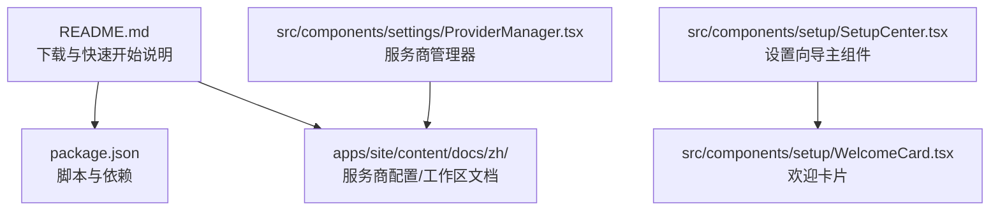
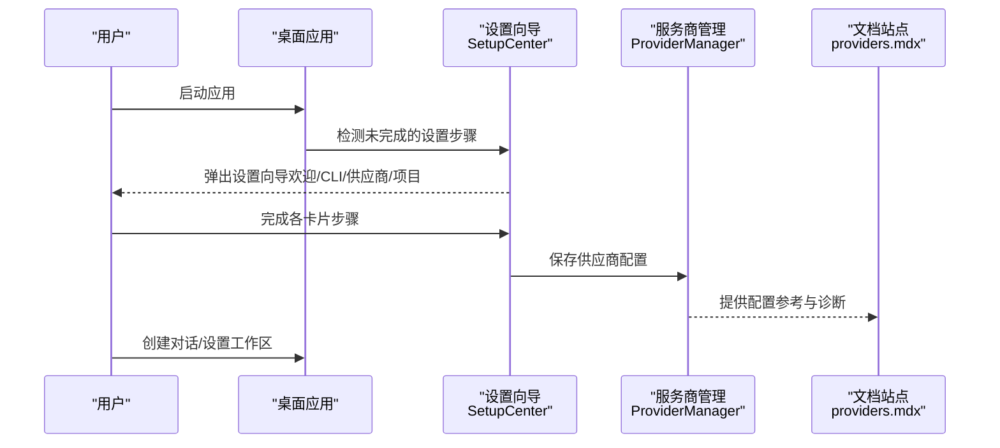
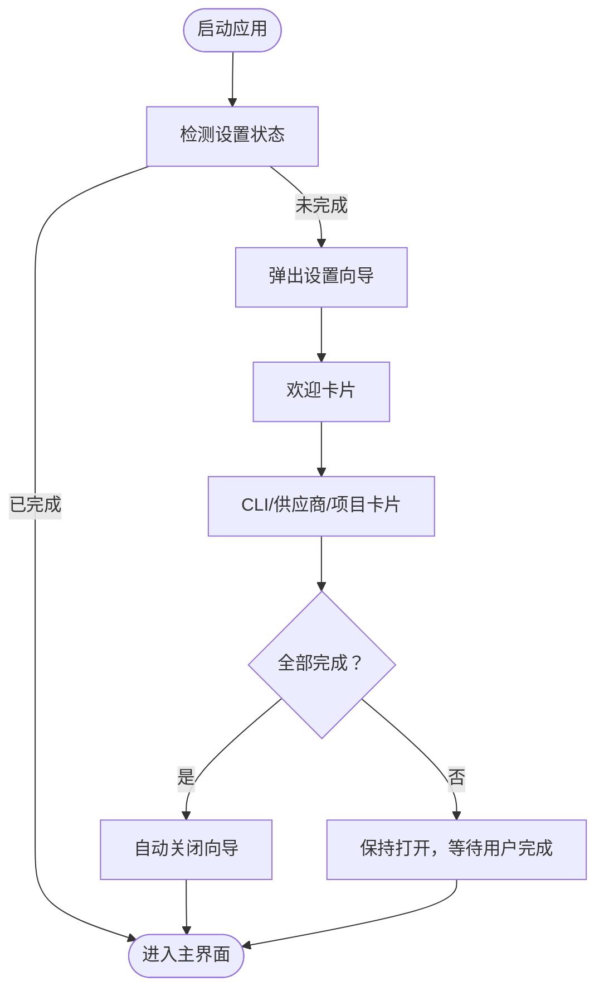
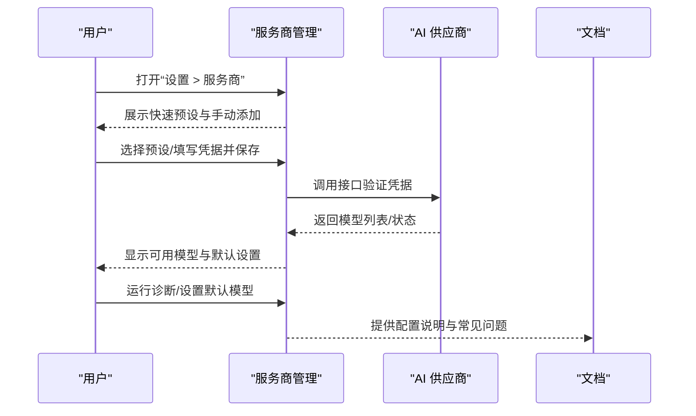
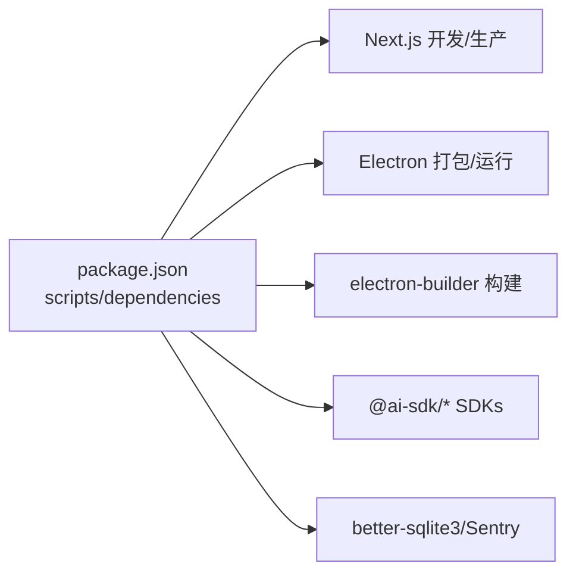

# 快速开始

<cite>
**本文引用的文件**
- [README.md](file://README.md)
- [README_CN.md](file://README_CN.md)
- [package.json](file://package.json)
- [apps/site/content/docs/zh/providers.mdx](file://apps/site/content/docs/zh/providers.mdx)
- [apps/site/content/docs/zh/assistant-workspace.mdx](file://apps/site/content/docs/zh/assistant-workspace.mdx)
- [src/components/setup/SetupCenter.tsx](file://src/components/setup/SetupCenter.tsx)
- [src/components/setup/WelcomeCard.tsx](file://src/components/setup/WelcomeCard.tsx)
- [src/components/settings/ProviderManager.tsx](file://src/components/settings/ProviderManager.tsx)
</cite>

## 目录
1. [简介](#简介)
2. [项目结构](#项目结构)
3. [核心组件](#核心组件)
4. [架构总览](#架构总览)
5. [详细组件分析](#详细组件分析)
6. [依赖分析](#依赖分析)
7. [性能考虑](#性能考虑)
8. [故障排除指南](#故障排除指南)
9. [结论](#结论)
10. [附录](#附录)

## 简介
本指南面向首次接触 CodePilot 的用户，帮助你在不同平台上完成下载安装、首次启动配置与基础使用。内容涵盖：
- 下载安装（macOS、Windows、Linux）
- 环境要求（Node.js 18+）
- 从源码构建（开发环境）
- 配置首个 AI 供应商
- 创建对话
- 设置助手工作区（Assistant Workspace）
- 常见问题与故障排除

## 项目结构
CodePilot 是一个基于 Next.js 的桌面应用，采用 Electron 打包为多平台可执行程序。根目录包含应用代码、站点文档与脚本。首次启动时，应用会通过“设置向导”引导用户完成 Claude Code CLI、AI 供应商与项目目录的配置。

**图表来源**
- [README.md:22-96](file://README.md#L22-L96)
- [package.json:17-36](file://package.json#L17-L36)
- [apps/site/content/docs/zh/providers.mdx:1-203](file://apps/site/content/docs/zh/providers.mdx#L1-L203)
- [apps/site/content/docs/zh/assistant-workspace.mdx:1-63](file://apps/site/content/docs/zh/assistant-workspace.mdx#L1-L63)
- [src/components/setup/SetupCenter.tsx:17-153](file://src/components/setup/SetupCenter.tsx#L17-L153)
- [src/components/setup/WelcomeCard.tsx:1-17](file://src/components/setup/WelcomeCard.tsx#L1-L17)
- [src/components/settings/ProviderManager.tsx:50-834](file://src/components/settings/ProviderManager.tsx#L50-L834)

**章节来源**
- [README.md:22-96](file://README.md#L22-L96)
- [package.json:17-36](file://package.json#L17-L36)

## 核心组件
- 设置向导（SetupCenter）：首次启动时弹出的引导蒙层，包含欢迎、Claude Code CLI、AI 供应商与项目目录四步。
- 服务商管理（ProviderManager）：集中管理已连接的 AI 供应商，支持一键诊断、默认模型设置与媒体生成提供商选择。
- 文档与指引：站点文档提供中文“服务商配置”和“助理工作区”的详细说明。

**章节来源**
- [src/components/setup/SetupCenter.tsx:17-153](file://src/components/setup/SetupCenter.tsx#L17-L153)
- [src/components/setup/WelcomeCard.tsx:1-17](file://src/components/setup/WelcomeCard.tsx#L1-L17)
- [src/components/settings/ProviderManager.tsx:50-834](file://src/components/settings/ProviderManager.tsx#L50-L834)
- [apps/site/content/docs/zh/providers.mdx:1-203](file://apps/site/content/docs/zh/providers.mdx#L1-L203)
- [apps/site/content/docs/zh/assistant-workspace.mdx:1-63](file://apps/site/content/docs/zh/assistant-workspace.mdx#L1-L63)

## 架构总览
下图展示从用户启动应用到完成首次配置的关键交互路径。

**图表来源**
- [src/components/setup/SetupCenter.tsx:56-89](file://src/components/setup/SetupCenter.tsx#L56-L89)
- [src/components/settings/ProviderManager.tsx:96-167](file://src/components/settings/ProviderManager.tsx#L96-L167)
- [apps/site/content/docs/zh/providers.mdx:124-142](file://apps/site/content/docs/zh/providers.mdx#L124-L142)

## 详细组件分析

### 平台安装与环境要求
- 下载安装：从发布页获取对应平台的安装包，支持 macOS（Apple Silicon/Intel）、Windows（x64/arm64）、Linux（AppImage/.deb/.rpm）。
- 环境要求：Node.js 18+，npm 9+（随 Node 18 附带）。
- 源码构建：克隆仓库后安装依赖，运行开发服务器或 Electron 桌面应用。

**章节来源**
- [README.md:22-30](file://README.md#L22-L30)
- [README.md:82-96](file://README.md#L82-L96)
- [README_CN.md:22-30](file://README_CN.md#L22-L30)
- [README_CN.md:82-96](file://README_CN.md#L82-L96)
- [package.json:17-36](file://package.json#L17-L36)

### 首次启动与设置向导
- 启动后自动检测未完成的设置步骤，弹出设置向导蒙层。
- 向导包含欢迎、Claude Code CLI、AI 供应商、项目目录四步，完成后自动关闭。
- 若用户在某步跳过，后续可通过设置页面继续配置。

**图表来源**
- [src/components/setup/SetupCenter.tsx:56-89](file://src/components/setup/SetupCenter.tsx#L56-L89)
- [src/components/setup/WelcomeCard.tsx:5-16](file://src/components/setup/WelcomeCard.tsx#L5-L16)

**章节来源**
- [src/components/setup/SetupCenter.tsx:17-153](file://src/components/setup/SetupCenter.tsx#L17-L153)
- [src/components/setup/WelcomeCard.tsx:1-17](file://src/components/setup/WelcomeCard.tsx#L1-L17)

### 配置第一个 AI 供应商
- 在“设置 > 服务商”中添加 API 密钥或使用 CLI 环境变量自动检测。
- 支持多种服务商（含国内厂商、云厂商、本地/自托管等），可设置默认模型与全局默认供应商。
- 可使用内置诊断功能排查连接问题。

**图表来源**
- [src/components/settings/ProviderManager.tsx:96-167](file://src/components/settings/ProviderManager.tsx#L96-L167)
- [apps/site/content/docs/zh/providers.mdx:124-142](file://apps/site/content/docs/zh/providers.mdx#L124-L142)

**章节来源**
- [apps/site/content/docs/zh/providers.mdx:1-203](file://apps/site/content/docs/zh/providers.mdx#L1-L203)
- [src/components/settings/ProviderManager.tsx:50-834](file://src/components/settings/ProviderManager.tsx#L50-L834)

### 创建对话
- 选择工作目录、交互模式（Code/Plan/Ask）与模型后即可开始对话。
- 可随时切换模型、暂停/恢复/回退会话、分屏对比等。

**章节来源**
- [README.md:142-148](file://README.md#L142-L148)
- [README_CN.md:142-148](file://README_CN.md#L142-L148)

### 设置助手工作区（Assistant Workspace）
- 在“设置 > 助理”中选择工作区目录并启用引导设置/每日问询。
- 工作区包含 soul.md、user.md、claude.md、memory.md 等文件，支持持久记忆与每日签到。

**章节来源**
- [apps/site/content/docs/zh/assistant-workspace.mdx:1-63](file://apps/site/content/docs/zh/assistant-workspace.mdx#L1-L63)
- [README.md:142-148](file://README.md#L142-L148)
- [README_CN.md:142-148](file://README_CN.md#L142-L148)

## 依赖分析
- 开发与构建：Next.js、Electron、electron-builder、concurrently 等。
- 运行时依赖：多 SDK（如 @ai-sdk/*、@anthropic-ai/claude-agent-sdk）、SQLite、Sentry 等。
- 脚本命令：dev、electron:dev、build、electron:build、electron:pack:* 等。

**图表来源**
- [package.json:17-36](file://package.json#L17-L36)
- [package.json:43-107](file://package.json#L43-L107)

**章节来源**
- [package.json:17-36](file://package.json#L17-L36)
- [package.json:43-107](file://package.json#L43-L107)

## 性能考虑
- 数据存储：SQLite（WAL 模式），并发读取性能良好。
- 开发体验：electron:dev 同时启动 Next.js 与 Electron，获得接近生产的桌面体验。
- 资源占用：根据模型与并发会话数量变化，建议在本地/自托管场景合理选择模型与上下文长度。

**章节来源**
- [README.md:272-276](file://README.md#L272-L276)
- [README_CN.md:272-276](file://README_CN.md#L272-L276)

## 故障排除指南
- 未检测到 CLI 凭据：确保环境变量在应用启动时可见，必要时重启应用；macOS 通过 Launchpad 启动的应用可能不继承终端环境变量。
- API 密钥有效但请求失败：检查账户余额、模型访问权限、网络连通性；AWS Bedrock 需确认 IAM 权限。
- 切换服务商后对话异常：不同服务商上下文窗口不同，可能因上下文过长导致报错；部分服务商不支持特定功能。
- 本地模型（Ollama）：模型名称需与 ollama list 显示的名称完全一致（含标签）。
- 平台安装提示：macOS Gatekeeper、Windows SmartScreen 的处理方式详见发行说明。

**章节来源**
- [apps/site/content/docs/zh/providers.mdx:143-166](file://apps/site/content/docs/zh/providers.mdx#L143-L166)
- [apps/site/content/docs/zh/providers.mdx:169-203](file://apps/site/content/docs/zh/providers.mdx#L169-L203)
- [README.md:156-176](file://README.md#L156-L176)
- [README_CN.md:156-176](file://README_CN.md#L156-L176)

## 结论
通过本指南，你可以在不同平台上快速完成 CodePilot 的安装与首次配置，完成首个 AI 供应商接入、创建对话并设置助理工作区。若遇到问题，可借助内置诊断与站点文档定位原因。随着使用深入，可进一步探索 MCP、技能市场与远程桥接等扩展能力。

## 附录
- 快速开始路径（下载/源码）与平台说明：参见根目录 README 与 README_CN。
- 服务商配置与本地模型（Ollama）：参见站点文档“服务商配置”。
- 助理工作区使用场景与配置要点：参见站点文档“助理工作区”。

**章节来源**
- [README.md:71-96](file://README.md#L71-L96)
- [README_CN.md:71-96](file://README_CN.md#L71-L96)
- [apps/site/content/docs/zh/providers.mdx:1-203](file://apps/site/content/docs/zh/providers.mdx#L1-L203)
- [apps/site/content/docs/zh/assistant-workspace.mdx:1-63](file://apps/site/content/docs/zh/assistant-workspace.mdx#L1-L63)