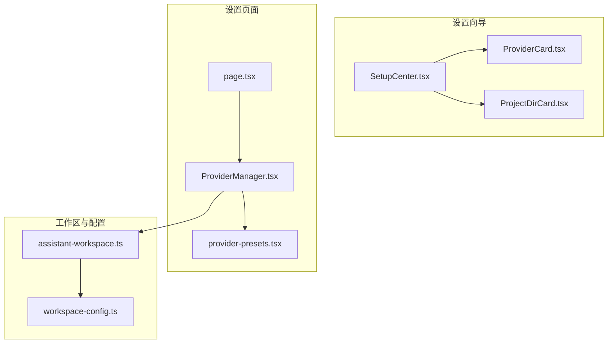
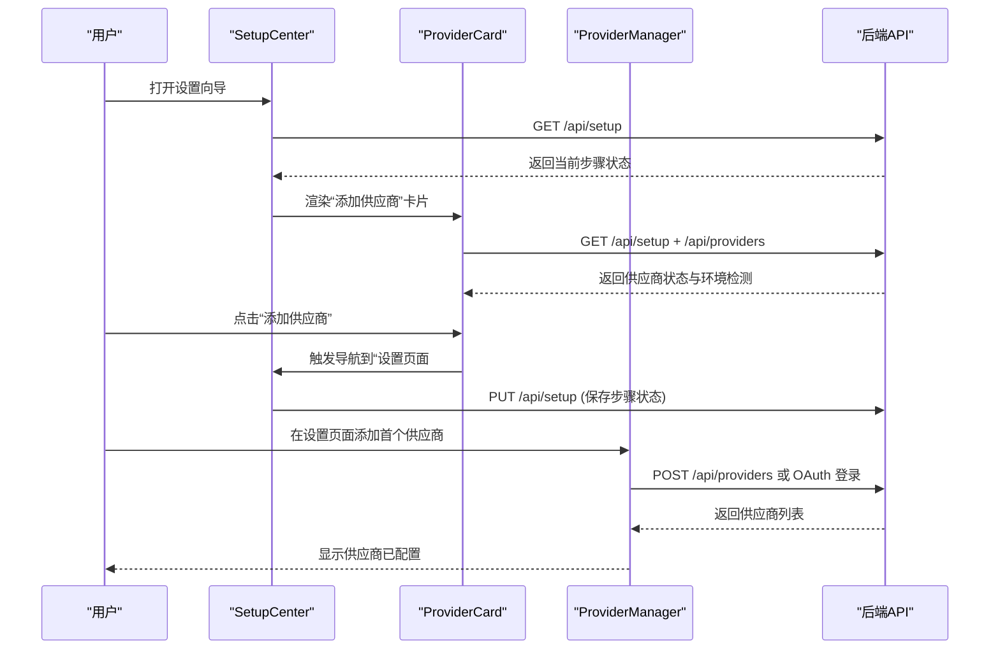
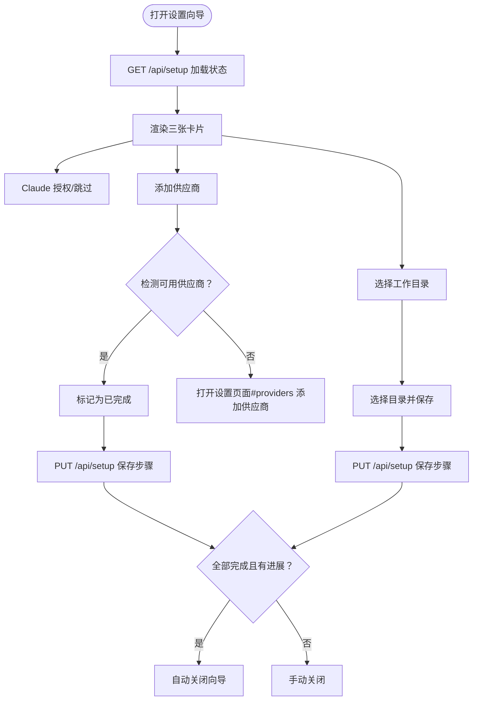
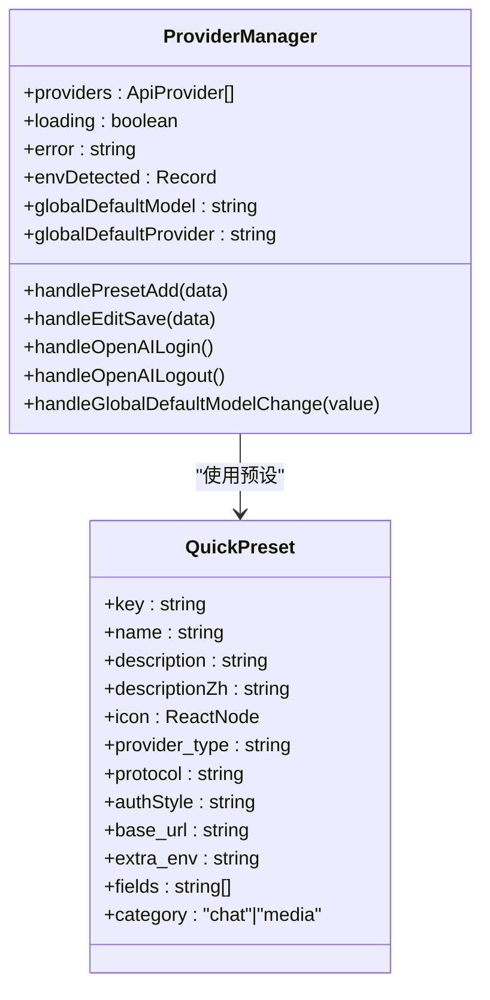
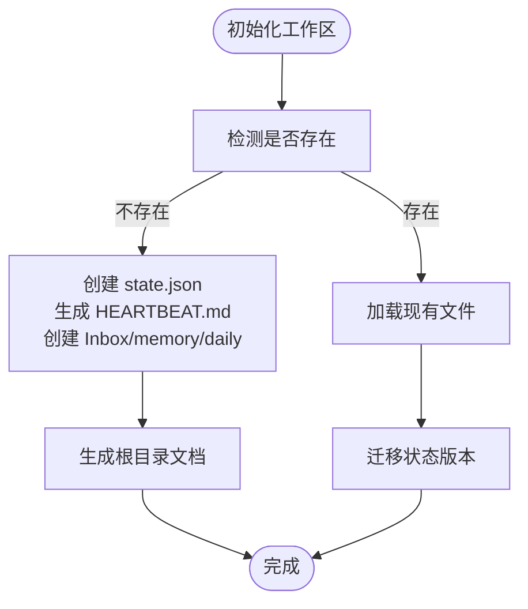
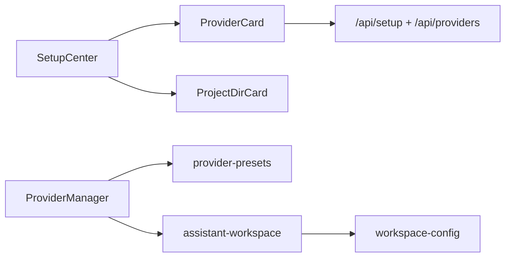

# 首次启动配置

<cite>
**本文档引用的文件**
- [SetupCenter.tsx](file://src/components/setup/SetupCenter.tsx)
- [ProviderCard.tsx](file://src/components/setup/ProviderCard.tsx)
- [ProjectDirCard.tsx](file://src/components/setup/ProjectDirCard.tsx)
- [ProviderManager.tsx](file://src/components/settings/ProviderManager.tsx)
- [provider-presets.tsx](file://src/components/settings/provider-presets.tsx)
- [assistant-workspace.ts](file://src/lib/assistant-workspace.ts)
- [workspace-config.ts](file://src/lib/workspace-config.ts)
- [page.tsx](file://src/app/settings/page.tsx)
</cite>

## 目录
1. [简介](#简介)
2. [项目结构](#项目结构)
3. [核心组件](#核心组件)
4. [架构总览](#架构总览)
5. [详细组件分析](#详细组件分析)
6. [依赖关系分析](#依赖关系分析)
7. [性能考量](#性能考量)
8. [故障排查指南](#故障排查指南)
9. [结论](#结论)
10. [附录](#附录)

## 简介
本指南面向首次使用 CodePilot 的用户，帮助您完成从零开始的配置流程，涵盖以下关键目标：
- 在设置页面添加首个 AI 供应商（含 API 密钥等凭证）。
- 了解如何选择与配置不同供应商（例如 Anthropic、OpenRouter、Bedrock 等）。
- 创建并配置助手工作区（包含 persona 文件：soul.md、user.md、claude.md、memory.md）。
- 选择工作目录、配置会话模式（Code/Plan/Ask）与推理努力级别（Effort）。

本指南将结合前端设置向导与后端 API 行为，给出清晰的步骤说明与可视化图示，确保新手也能顺利完成配置。

## 项目结构
与首次启动配置直接相关的核心模块如下：
- 设置向导组件：负责引导用户完成“Claude 授权”“添加供应商”“选择项目目录”三步。
- 供应商管理：负责供应商的增删改查、快速预设、OAuth 登录、默认模型设置等。
- 助手工作区：负责工作区初始化、persona 文件生成与加载、提示词组装与预算控制。
- 工作区配置：负责工作区类型、索引策略、忽略规则、归档策略等。

**图表来源**
- [SetupCenter.tsx:17-152](file://src/components/setup/SetupCenter.tsx#L17-L152)
- [ProviderCard.tsx:24-183](file://src/components/setup/ProviderCard.tsx#L24-L183)
- [ProjectDirCard.tsx:17-128](file://src/components/setup/ProjectDirCard.tsx#L17-L128)
- [page.tsx:7-19](file://src/app/settings/page.tsx#L7-L19)
- [ProviderManager.tsx:50-833](file://src/components/settings/ProviderManager.tsx#L50-L833)
- [provider-presets.tsx:58-203](file://src/components/settings/provider-presets.tsx#L58-L203)
- [assistant-workspace.ts:1-666](file://src/lib/assistant-workspace.ts#L1-L666)
- [workspace-config.ts:1-119](file://src/lib/workspace-config.ts#L1-L119)

**章节来源**
- [SetupCenter.tsx:17-152](file://src/components/setup/SetupCenter.tsx#L17-L152)
- [ProviderCard.tsx:24-183](file://src/components/setup/ProviderCard.tsx#L24-L183)
- [ProjectDirCard.tsx:17-128](file://src/components/setup/ProjectDirCard.tsx#L17-L128)
- [page.tsx:7-19](file://src/app/settings/page.tsx#L7-L19)
- [ProviderManager.tsx:50-833](file://src/components/settings/ProviderManager.tsx#L50-L833)
- [provider-presets.tsx:58-203](file://src/components/settings/provider-presets.tsx#L58-L203)
- [assistant-workspace.ts:1-666](file://src/lib/assistant-workspace.ts#L1-L666)
- [workspace-config.ts:1-119](file://src/lib/workspace-config.ts#L1-L119)

## 核心组件
- 设置中心（SetupCenter）：承载三个步骤卡片，负责状态持久化与自动关闭。
- 供应商卡片（ProviderCard）：检测是否有可用供应商（数据库、环境变量、OAuth），引导添加或跳过。
- 项目目录卡片（ProjectDirCard）：引导选择工作目录，并持久化最近项目列表。
- 供应商管理（ProviderManager）：提供供应商列表、快速预设、编辑/删除、OAuth 登录、默认模型设置等。
- 供应商预设（provider-presets）：定义各供应商的图标、认证方式、协议、默认参数等。
- 助手工作区（assistant-workspace）：初始化工作区、生成 persona 文件、组装提示词、心跳与归档策略。
- 工作区配置（workspace-config）：工作区类型、索引策略、忽略规则、归档策略等。

**章节来源**
- [SetupCenter.tsx:17-152](file://src/components/setup/SetupCenter.tsx#L17-L152)
- [ProviderCard.tsx:24-183](file://src/components/setup/ProviderCard.tsx#L24-L183)
- [ProjectDirCard.tsx:17-128](file://src/components/setup/ProjectDirCard.tsx#L17-L128)
- [ProviderManager.tsx:50-833](file://src/components/settings/ProviderManager.tsx#L50-L833)
- [provider-presets.tsx:58-203](file://src/components/settings/provider-presets.tsx#L58-L203)
- [assistant-workspace.ts:1-666](file://src/lib/assistant-workspace.ts#L1-L666)
- [workspace-config.ts:1-119](file://src/lib/workspace-config.ts#L1-L119)

## 架构总览
首次启动配置由前端设置向导与设置页面协同完成，后端提供 API 支撑状态查询与持久化。

**图表来源**
- [SetupCenter.tsx:40-53](file://src/components/setup/SetupCenter.tsx#L40-L53)
- [ProviderCard.tsx:36-100](file://src/components/setup/ProviderCard.tsx#L36-L100)
- [ProviderManager.tsx:186-218](file://src/components/settings/ProviderManager.tsx#L186-L218)

**章节来源**
- [SetupCenter.tsx:40-90](file://src/components/setup/SetupCenter.tsx#L40-L90)
- [ProviderCard.tsx:36-100](file://src/components/setup/ProviderCard.tsx#L36-L100)
- [ProviderManager.tsx:186-218](file://src/components/settings/ProviderManager.tsx#L186-L218)

## 详细组件分析

### 设置向导：三步完成首次配置
- 卡片一：欢迎与进度显示
- 卡片二：添加首个 AI 供应商（检测数据库、环境变量、OAuth）
- 卡片三：选择工作目录（本地文件夹）

**图表来源**
- [SetupCenter.tsx:55-89](file://src/components/setup/SetupCenter.tsx#L55-L89)
- [ProviderCard.tsx:36-100](file://src/components/setup/ProviderCard.tsx#L36-L100)
- [ProjectDirCard.tsx:40-54](file://src/components/setup/ProjectDirCard.tsx#L40-L54)

**章节来源**
- [SetupCenter.tsx:55-89](file://src/components/setup/SetupCenter.tsx#L55-L89)
- [ProviderCard.tsx:36-100](file://src/components/setup/ProviderCard.tsx#L36-L100)
- [ProjectDirCard.tsx:40-54](file://src/components/setup/ProjectDirCard.tsx#L40-L54)

### 供应商配置：添加首个 AI 供应商
- 快速预设：内置多家供应商的图标、认证方式、协议与默认参数，一键连接。
- 自定义表单：当无法匹配预设时，使用通用表单进行编辑。
- OAuth 登录：OpenAI 提供 OAuth 登录流程，自动轮询状态并刷新模型列表。
- 默认模型：统一设置全局默认模型，便于后续会话使用。

**图表来源**
- [ProviderManager.tsx:50-833](file://src/components/settings/ProviderManager.tsx#L50-L833)
- [provider-presets.tsx:58-203](file://src/components/settings/provider-presets.tsx#L58-L203)

**章节来源**
- [ProviderManager.tsx:186-218](file://src/components/settings/ProviderManager.tsx#L186-L218)
- [ProviderManager.tsx:302-357](file://src/components/settings/ProviderManager.tsx#L302-L357)
- [ProviderManager.tsx:362-393](file://src/components/settings/ProviderManager.tsx#L362-L393)
- [provider-presets.tsx:97-121](file://src/components/settings/provider-presets.tsx#L97-L121)

### 助手工作区：创建与配置 persona 文件
- 初始化：若工作区不存在，自动创建 .assistant/state.json、HEARTBEAT.md、Inbox、memory/daily 等目录与文件。
- persona 文件：soul.md（个性与风格）、user.md（用户画像）、claude.md（规则与约束）、memory.md（长期记忆）。
- 提示词组装：按优先级与预算限制组装系统提示，确保 claude.md 不被裁剪。
- 日常记忆：按日期生成 daily 记忆文件，支持检索工具读取。

**图表来源**
- [assistant-workspace.ts:336-412](file://src/lib/assistant-workspace.ts#L336-L412)
- [assistant-workspace.ts:425-449](file://src/lib/assistant-workspace.ts#L425-L449)
- [assistant-workspace.ts:462-511](file://src/lib/assistant-workspace.ts#L462-L511)

**章节来源**
- [assistant-workspace.ts:19-38](file://src/lib/assistant-workspace.ts#L19-L38)
- [assistant-workspace.ts:336-412](file://src/lib/assistant-workspace.ts#L336-L412)
- [assistant-workspace.ts:425-511](file://src/lib/assistant-workspace.ts#L425-L511)

### 工作区配置：类型、索引与归档策略
- 类型：general（通用）、organization（组织）、project（项目）等。
- 组织风格：mixed（混合）等。
- 捕获默认：Inbox。
- 归档策略：任务完成后的归档天数、项目关闭后的归档、日常记忆保留天数。
- 忽略规则：支持通配符，排除特定文件与目录。
- 索引策略：最大文件大小、分块大小、重叠、最大深度、包含的扩展名。

**章节来源**
- [workspace-config.ts:7-34](file://src/lib/workspace-config.ts#L7-L34)
- [workspace-config.ts:59-68](file://src/lib/workspace-config.ts#L59-L68)
- [workspace-config.ts:70-77](file://src/lib/workspace-config.ts#L70-L77)
- [workspace-config.ts:111-119](file://src/lib/workspace-config.ts#L111-L119)

## 依赖关系分析
- SetupCenter 依赖 ProviderCard 与 ProjectDirCard 的状态变化，以决定是否自动关闭。
- ProviderCard 通过 /api/setup 与 /api/providers 判断供应商可用性，必要时引导至设置页面。
- ProviderManager 依赖 provider-presets 定义的 QuickPreset，实现一键连接与通用表单回退。
- assistant-workspace 与 workspace-config 共同决定工作区的文件结构与索引策略。

**图表来源**
- [SetupCenter.tsx:55-89](file://src/components/setup/SetupCenter.tsx#L55-L89)
- [ProviderCard.tsx:36-100](file://src/components/setup/ProviderCard.tsx#L36-L100)
- [ProviderManager.tsx:50-833](file://src/components/settings/ProviderManager.tsx#L50-L833)
- [provider-presets.tsx:58-203](file://src/components/settings/provider-presets.tsx#L58-L203)
- [assistant-workspace.ts:1-666](file://src/lib/assistant-workspace.ts#L1-L666)
- [workspace-config.ts:1-119](file://src/lib/workspace-config.ts#L1-L119)

**章节来源**
- [SetupCenter.tsx:55-89](file://src/components/setup/SetupCenter.tsx#L55-L89)
- [ProviderCard.tsx:36-100](file://src/components/setup/ProviderCard.tsx#L36-L100)
- [ProviderManager.tsx:50-833](file://src/components/settings/ProviderManager.tsx#L50-L833)
- [provider-presets.tsx:58-203](file://src/components/settings/provider-presets.tsx#L58-L203)
- [assistant-workspace.ts:1-666](file://src/lib/assistant-workspace.ts#L1-L666)
- [workspace-config.ts:1-119](file://src/lib/workspace-config.ts#L1-L119)

## 性能考量
- 向导自动关闭：仅在本次会话内从“未完成”推进到“全部完成”时触发，避免频繁弹窗。
- 供应商状态检测：并行请求 /api/setup 与 /api/providers，减少等待时间。
- 工作区初始化：仅在缺失时创建文件与目录，避免重复 IO。
- 提示词组装：采用预算感知的截断策略，优先保留 claude.md，确保核心规则不被裁剪。

[本节为通用建议，无需特定文件引用]

## 故障排查指南
- 供应商未显示为“已配置”
  - 检查是否已通过“设置页面#providers”完成添加或 OAuth 登录。
  - 若使用环境变量，确认环境变量键值正确且未被隐藏。
- OAuth 登录失败或超时
  - 查看错误提示，重新发起登录；最长轮询时间为约 5 分钟。
  - 登出后重试，确保移除了旧状态。
- 工作区未生成 persona 文件
  - 确认工作区目录存在且可写。
  - 检查初始化流程是否完成，必要时手动触发初始化逻辑。
- 会话模式与推理努力级别
  - 在聊天界面选择 Code/Plan/Ask 三种模式。
  - 推理努力级别可在设置中调整，影响响应速度与质量。

**章节来源**
- [ProviderCard.tsx:36-100](file://src/components/setup/ProviderCard.tsx#L36-L100)
- [ProviderManager.tsx:302-357](file://src/components/settings/ProviderManager.tsx#L302-L357)
- [assistant-workspace.ts:336-412](file://src/lib/assistant-workspace.ts#L336-L412)

## 结论
通过设置向导与设置页面的协同，您可以快速完成首个 AI 供应商的添加、工作目录的选择以及助手工作区的初始化。配合工作区配置与 persona 文件，即可获得稳定、可扩展的智能助手体验。后续可根据团队协作需求进一步细化供应商与工作区策略。

[本节为总结，无需特定文件引用]

## 附录

### 附录A：首次启动配置步骤清单
- 步骤一：打开设置向导，完成“Claude 授权/跳过”。
- 步骤二：点击“添加供应商”，在设置页面选择并添加首个供应商（支持快速预设与 OAuth）。
- 步骤三：选择工作目录，保存最近项目以便快速切换。
- 步骤四：进入助手工作区，确认 persona 文件（soul.md、user.md、claude.md、memory.md）已生成。
- 步骤五：根据需要调整会话模式（Code/Plan/Ask）与推理努力级别。

**章节来源**
- [SetupCenter.tsx:55-89](file://src/components/setup/SetupCenter.tsx#L55-L89)
- [ProviderCard.tsx:113-125](file://src/components/setup/ProviderCard.tsx#L113-L125)
- [ProjectDirCard.tsx:40-54](file://src/components/setup/ProjectDirCard.tsx#L40-L54)
- [assistant-workspace.ts:336-412](file://src/lib/assistant-workspace.ts#L336-L412)

### 附录B：常用供应商与认证方式
- Anthropic：官方 API，支持 Auth Token 或 API Key。
- OpenRouter：聚合路由，支持多种上游模型。
- Bedrock：AWS 本地部署或托管服务。
- Vertex：Google Cloud 本地部署或托管服务。
- Gemini/OpenAI 图像：媒体生成专用供应商，可设置默认图像模型。

**章节来源**
- [provider-presets.tsx:97-121](file://src/components/settings/provider-presets.tsx#L97-L121)
- [ProviderManager.tsx:639-704](file://src/components/settings/ProviderManager.tsx#L639-L704)