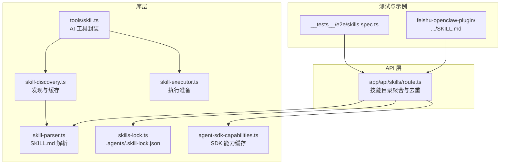
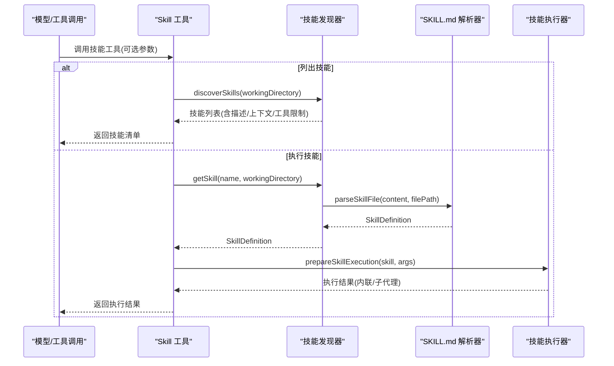
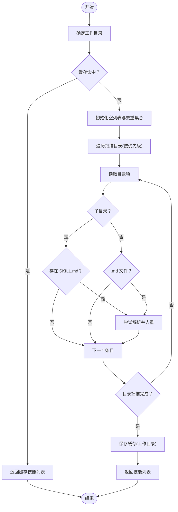
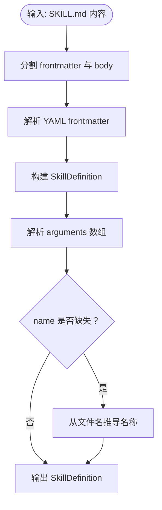
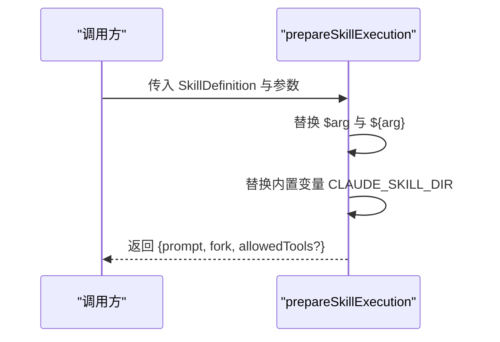
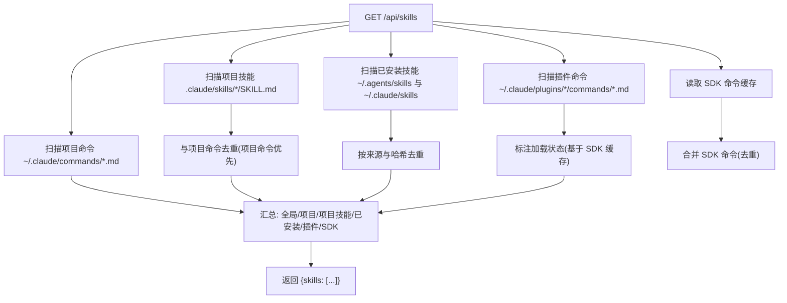
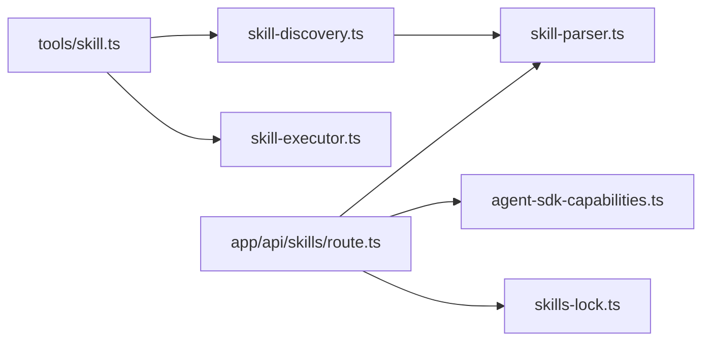

# 技能发现与解析

<cite>
**本文引用的文件**
- [src/lib/skill-discovery.ts](file://src/lib/skill-discovery.ts)
- [src/lib/skill-parser.ts](file://src/lib/skill-parser.ts)
- [src/lib/skill-executor.ts](file://src/lib/skill-executor.ts)
- [src/app/api/skills/route.ts](file://src/app/api/skills/route.ts)
- [src/lib/tools/skill.ts](file://src/lib/tools/skill.ts)
- [src/lib/skills-lock.ts](file://src/lib/skills-lock.ts)
- [src/lib/agent-sdk-capabilities.ts](file://src/lib/agent-sdk-capabilities.ts)
- [src/__tests__/e2e/skills.spec.ts](file://src/__tests__/e2e/skills.spec.ts)
- [资料/feishu-openclaw-plugin/package/skills/feishu-create-doc/SKILL.md](file://资料/feishu-openclaw-plugin/package/skills/feishu-create-doc/SKILL.md)
</cite>

## 目录
1. [简介](#简介)
2. [项目结构](#项目结构)
3. [核心组件](#核心组件)
4. [架构总览](#架构总览)
5. [详细组件分析](#详细组件分析)
6. [依赖关系分析](#依赖关系分析)
7. [性能考量](#性能考量)
8. [故障排查指南](#故障排查指南)
9. [结论](#结论)
10. [附录](#附录)

## 简介
本文件系统性阐述 CodePilot 的“技能发现与解析”子系统，覆盖以下主题：
- 技能文件扫描机制：项目级、用户级、跨代理、插件命令与命令目录的扫描顺序与优先级
- SKILL.md 文件格式规范、解析规则与验证机制
- 技能去重逻辑、缓存策略与性能优化
- 技能文件结构示例、错误处理与调试方法

该系统同时服务于运行时工具调用与 Web API 技能目录展示，确保在不同场景下一致、可靠地发现与解析技能。

## 项目结构
围绕技能发现与解析的关键代码位于 src/lib 与 src/app/api 下，并辅以测试与外部示例技能文件：
- 发现与解析：skill-discovery.ts、skill-parser.ts、skill-executor.ts
- Web API：app/api/skills/route.ts
- 工具集成：lib/tools/skill.ts
- 锁定与来源：skills-lock.ts
- SDK 能力缓存：agent-sdk-capabilities.ts
- 测试与示例：__tests__/e2e/skills.spec.ts、feishu-openclaw-plugin 的 SKILL.md 示例

图表来源
- [src/lib/skill-discovery.ts:1-125](file://src/lib/skill-discovery.ts#L1-L125)
- [src/lib/skill-parser.ts:1-127](file://src/lib/skill-parser.ts#L1-L127)
- [src/lib/skill-executor.ts:1-52](file://src/lib/skill-executor.ts#L1-L52)
- [src/lib/tools/skill.ts:1-62](file://src/lib/tools/skill.ts#L1-L62)
- [src/lib/skills-lock.ts:1-23](file://src/lib/skills-lock.ts#L1-L23)
- [src/lib/agent-sdk-capabilities.ts:1-203](file://src/lib/agent-sdk-capabilities.ts#L1-L203)
- [src/app/api/skills/route.ts:1-491](file://src/app/api/skills/route.ts#L1-L491)
- [src/__tests__/e2e/skills.spec.ts:1-214](file://src/__tests__/e2e/skills.spec.ts#L1-L214)
- [资料/feishu-openclaw-plugin/package/skills/feishu-create-doc/SKILL.md](file://资料/feishu-openclaw-plugin/package/skills/feishu-create-doc/SKILL.md)

章节来源
- [src/lib/skill-discovery.ts:1-125](file://src/lib/skill-discovery.ts#L1-L125)
- [src/lib/skill-parser.ts:1-127](file://src/lib/skill-parser.ts#L1-L127)
- [src/lib/skill-executor.ts:1-52](file://src/lib/skill-executor.ts#L1-L52)
- [src/lib/tools/skill.ts:1-62](file://src/lib/tools/skill.ts#L1-L62)
- [src/lib/skills-lock.ts:1-23](file://src/lib/skills-lock.ts#L1-L23)
- [src/lib/agent-sdk-capabilities.ts:1-203](file://src/lib/agent-sdk-capabilities.ts#L1-L203)
- [src/app/api/skills/route.ts:1-491](file://src/app/api/skills/route.ts#L1-L491)
- [src/__tests__/e2e/skills.spec.ts:1-214](file://src/__tests__/e2e/skills.spec.ts#L1-L214)

## 核心组件
- 技能发现器：负责扫描多源路径、构建技能清单并缓存结果，支持按名称检索与失效。
- SKILL.md 解析器：将 Markdown + YAML frontmatter 解析为结构化的技能定义。
- 技能执行器：根据技能定义生成执行结果（内联注入或子代理模式），并进行模板变量替换。
- Web API 聚合器：统一聚合项目级技能、用户级命令、已安装技能、插件命令与 SDK 命令，执行去重与来源标注。
- AI 工具封装：将技能系统暴露为可被模型调用的工具，支持列出与执行。
- 锁定与来源：维护跨代理技能来源锁定文件，用于来源识别与去重决策。
- SDK 能力缓存：按 providerId 缓存 SDK 提供的模型、命令、MCP 状态等能力信息，用于 API 展示与加载状态标注。

章节来源
- [src/lib/skill-discovery.ts:36-76](file://src/lib/skill-discovery.ts#L36-L76)
- [src/lib/skill-parser.ts:43-59](file://src/lib/skill-parser.ts#L43-L59)
- [src/lib/skill-executor.ts:25-44](file://src/lib/skill-executor.ts#L25-L44)
- [src/app/api/skills/route.ts:290-422](file://src/app/api/skills/route.ts#L290-L422)
- [src/lib/tools/skill.ts:15-61](file://src/lib/tools/skill.ts#L15-L61)
- [src/lib/skills-lock.ts:8-22](file://src/lib/skills-lock.ts#L8-L22)
- [src/lib/agent-sdk-capabilities.ts:46-74](file://src/lib/agent-sdk-capabilities.ts#L46-L74)

## 架构总览
技能发现与解析贯穿“发现—解析—执行—展示”链路，既服务本地运行时工具调用，也服务 Web API 的技能目录查询。

图表来源
- [src/lib/tools/skill.ts:25-59](file://src/lib/tools/skill.ts#L25-L59)
- [src/lib/skill-discovery.ts:73-76](file://src/lib/skill-discovery.ts#L73-L76)
- [src/lib/skill-parser.ts:43-59](file://src/lib/skill-parser.ts#L43-L59)
- [src/lib/skill-executor.ts:25-44](file://src/lib/skill-executor.ts#L25-L44)

## 详细组件分析

### 技能发现器（skill-discovery.ts）
职责
- 扫描多源目录，收集 SKILL.md 或 .md 命令文件
- 基于工作目录构建优先级顺序，实现“项目级 > 用户级 > 跨代理”
- 去重策略：按名称去重（首次遇到者保留，即项目级优先）
- 缓存策略：按工作目录缓存，避免重复扫描

扫描顺序与优先级
- 项目级：当前工作目录下的 .claude/skills 与 .claude/commands
- 用户级：用户主目录下的 .claude/skills 与 .claude/commands
- 跨代理：用户主目录下的 .agents/skills
- 命令目录：同上，但以 .md 文件为命令条目

去重与缓存
- 使用 Set 记录已见名称（大小写不敏感）
- 缓存键为当前工作目录；缓存命中直接返回

错误处理
- 目录不存在或不可读时跳过
- 解析失败的文件被忽略

图表来源
- [src/lib/skill-discovery.ts:36-68](file://src/lib/skill-discovery.ts#L36-L68)
- [src/lib/skill-discovery.ts:92-124](file://src/lib/skill-discovery.ts#L92-L124)

章节来源
- [src/lib/skill-discovery.ts:18-26](file://src/lib/skill-discovery.ts#L18-L26)
- [src/lib/skill-discovery.ts:36-76](file://src/lib/skill-discovery.ts#L36-L76)
- [src/lib/skill-discovery.ts:92-124](file://src/lib/skill-discovery.ts#L92-L124)

### SKILL.md 解析器（skill-parser.ts）
职责
- 将 Markdown + YAML frontmatter 解析为 SkillDefinition
- 支持字段：name、description、body、allowedTools、whenToUse、context、arguments、model、effort、userInvocable、filePath
- 兼容 Claude Code 的技能格式，解析所有具备执行语义的字段

解析规则
- frontmatter 分割：以三连字符界定
- 字段类型推断：字符串数组、布尔、undefined、对象数组
- arguments 支持字符串与对象两种形式，对象形式提取 name/description/required
- 当未提供 name 时，回退为文件名转标题形式

验证机制
- 缺失 frontmatter 时，仅使用正文作为 body
- 非法或无法解析的字段被安全忽略

图表来源
- [src/lib/skill-parser.ts:43-59](file://src/lib/skill-parser.ts#L43-L59)
- [src/lib/skill-parser.ts:67-100](file://src/lib/skill-parser.ts#L67-L100)
- [src/lib/skill-parser.ts:108-121](file://src/lib/skill-parser.ts#L108-L121)
- [src/lib/skill-parser.ts:123-126](file://src/lib/skill-parser.ts#L123-L126)

章节来源
- [src/lib/skill-parser.ts:43-59](file://src/lib/skill-parser.ts#L43-L59)
- [src/lib/skill-parser.ts:67-100](file://src/lib/skill-parser.ts#L67-L100)
- [src/lib/skill-parser.ts:108-126](file://src/lib/skill-parser.ts#L108-L126)

### 技能执行器（skill-executor.ts）
职责
- 为内联模式与子代理模式准备执行结果
- 替换模板变量（$arg、${arg}）与内置变量（如 CLAUDE_SKILL_DIR）

执行模式
- 内联：返回可直接注入对话的提示文本
- 子代理：返回提示文本与工具限制，由上层路由到 AgentTool

图表来源
- [src/lib/skill-executor.ts:25-44](file://src/lib/skill-executor.ts#L25-L44)

章节来源
- [src/lib/skill-executor.ts:25-44](file://src/lib/skill-executor.ts#L25-L44)

### Web API 聚合器（app/api/skills/route.ts）
职责
- 统一聚合多种来源的技能与命令
- 执行去重与来源标注
- 与 SDK 能力缓存联动，标注插件加载状态
- 支持创建新命令（.md 文件）到用户级或项目级目录

扫描与聚合
- 项目级技能：.claude/skills/*/SKILL.md
- 用户级命令：~/.claude/commands/*.md（递归）
- 已安装技能：~/.agents/skills 与 ~/.claude/skills（内容哈希去重与来源偏好）
- 插件命令：~/.claude/plugins 下各市场/外部插件的 commands 目录
- SDK 命令：从 SDK 能力缓存中读取，去重后合并

去重与来源
- 项目命令优先于项目级技能（同名时）
- 已安装技能按名称分组，若内容哈希一致则选择偏好的来源（agents 优先于 claude）
- 插件命令按加载状态标注（基于 SDK 缓存中的插件路径）

错误处理
- 大多数读取异常被吞并，保证接口稳定
- 创建命令时进行名称校验与冲突检查

图表来源
- [src/app/api/skills/route.ts:290-422](file://src/app/api/skills/route.ts#L290-L422)
- [src/app/api/skills/route.ts:318-349](file://src/app/api/skills/route.ts#L318-L349)
- [src/app/api/skills/route.ts:351-383](file://src/app/api/skills/route.ts#L351-L383)
- [src/app/api/skills/route.ts:390-412](file://src/app/api/skills/route.ts#L390-L412)

章节来源
- [src/app/api/skills/route.ts:290-422](file://src/app/api/skills/route.ts#L290-L422)

### AI 工具封装（lib/tools/skill.ts）
职责
- 将技能系统暴露为 AI 工具，支持：
  - 列出可用技能（无参数）
  - 执行指定技能（带名称与参数）
- 与技能发现器与执行器协作，返回内联提示或子代理指令

章节来源
- [src/lib/tools/skill.ts:15-61](file://src/lib/tools/skill.ts#L15-L61)

### 锁定与来源（skills-lock.ts）
职责
- 读取 ~/.agents/.skill-lock.json，用于识别技能来源与版本
- 异常时返回默认空结构，保证健壮性

章节来源
- [src/lib/skills-lock.ts:8-22](file://src/lib/skills-lock.ts#L8-L22)

### SDK 能力缓存（agent-sdk-capabilities.ts）
职责
- 按 providerId 缓存 SDK 的模型、命令、MCP 状态等能力
- 提供缓存新鲜度判断与刷新接口
- 用于 API 层对插件命令加载状态的标注

章节来源
- [src/lib/agent-sdk-capabilities.ts:46-74](file://src/lib/agent-sdk-capabilities.ts#L46-L74)
- [src/lib/agent-sdk-capabilities.ts:148-171](file://src/lib/agent-sdk-capabilities.ts#L148-L171)

## 依赖关系分析
- 技能发现器依赖解析器进行文件解析
- AI 工具封装依赖发现器与执行器
- Web API 聚合器依赖解析器、SDK 能力缓存与锁定文件
- 插件命令加载状态依赖 SDK 能力缓存中的插件路径集合

图表来源
- [src/lib/tools/skill.ts:7-8](file://src/lib/tools/skill.ts#L7-L8)
- [src/lib/skill-discovery.ts](file://src/lib/skill-discovery.ts#L15)
- [src/lib/skill-parser.ts:1-127](file://src/lib/skill-parser.ts#L1-L127)
- [src/lib/skill-executor.ts:1-52](file://src/lib/skill-executor.ts#L1-L52)
- [src/app/api/skills/route.ts:361-366](file://src/app/api/skills/route.ts#L361-L366)
- [src/lib/skills-lock.ts](file://src/lib/skills-lock.ts#L6)
- [src/lib/agent-sdk-capabilities.ts:36-44](file://src/lib/agent-sdk-capabilities.ts#L36-L44)

章节来源
- [src/lib/tools/skill.ts:7-8](file://src/lib/tools/skill.ts#L7-L8)
- [src/lib/skill-discovery.ts](file://src/lib/skill-discovery.ts#L15)
- [src/app/api/skills/route.ts:361-366](file://src/app/api/skills/route.ts#L361-L366)

## 性能考量
- 缓存策略
  - 发现器按工作目录缓存，避免重复扫描
  - SDK 能力缓存按 providerId 缓存，TTL 5 分钟，减少频繁查询
- I/O 优化
  - 目录读取采用同步 readdirSync，减少异步开销；异常吞并，保证稳定性
  - 哈希计算仅在已安装技能去重时使用
- 去重成本
  - 名称去重使用 Set，时间复杂度 O(1)，整体线性
- 并发与懒加载
  - SDK 数据通过缓存读取，避免阻塞主线程
  - 插件命令按需标注加载状态

章节来源
- [src/lib/skill-discovery.ts:39-41](file://src/lib/skill-discovery.ts#L39-L41)
- [src/lib/agent-sdk-capabilities.ts:68-74](file://src/lib/agent-sdk-capabilities.ts#L68-L74)
- [src/app/api/skills/route.ts:330-349](file://src/app/api/skills/route.ts#L330-L349)

## 故障排查指南
常见问题与定位建议
- 技能未出现在列表
  - 检查文件是否存在且命名正确（.claude/skills/*/SKILL.md 或 .claude/commands/*.md）
  - 确认工作目录参数（cwd）是否正确传递给 API
  - 查看控制台日志中扫描路径与存在性输出
- 命令重复或来源冲突
  - 项目命令优先于项目级技能（同名时）
  - 已安装技能按来源与内容哈希去重，确认 ~/.agents 与 ~/.claude/skills 中的冲突
- 插件命令未标注加载状态
  - 确认 SDK 能力缓存中已捕获插件路径
  - 检查插件根目录是否在技能文件路径的父级链上
- 创建命令失败
  - 检查名称合法性（仅允许字母、数字、连字符、下划线）
  - 确认目标目录存在或可创建

调试方法
- 启用控制台日志：观察扫描阶段的日志输出，确认各目录存在性与数量
- 单元/端到端测试：参考 e2e 测试用例，验证技能列表渲染、搜索与编辑流程
- 示例技能：参考 feishu-openclaw-plugin 的 SKILL.md 示例，验证 frontmatter 结构与解析行为

章节来源
- [src/app/api/skills/route.ts:311-322](file://src/app/api/skills/route.ts#L311-L322)
- [src/app/api/skills/route.ts:342-349](file://src/app/api/skills/route.ts#L342-L349)
- [src/app/api/skills/route.ts:368-383](file://src/app/api/skills/route.ts#L368-L383)
- [src/__tests__/e2e/skills.spec.ts:205-212](file://src/__tests__/e2e/skills.spec.ts#L205-L212)
- [资料/feishu-openclaw-plugin/package/skills/feishu-create-doc/SKILL.md](file://资料/feishu-openclaw-plugin/package/skills/feishu-create-doc/SKILL.md)

## 结论
CodePilot 的技能发现与解析系统通过清晰的扫描顺序、严格的去重策略与稳健的缓存机制，实现了在多源路径下的一致性与高性能。Web API 与运行时工具双通道设计，既满足前端展示需求，又保障模型侧的可调用性。配合 SDK 能力缓存与来源锁定，系统在复杂环境下仍能保持稳定与可维护性。

## 附录

### SKILL.md 文件格式规范
- 必须使用 YAML frontmatter 包裹配置块，前后以三连字符界定
- 支持字段（示例）
  - name：技能名称（若缺失，回退为文件名推导）
  - description：技能描述
  - allowed-tools：允许使用的工具列表
  - when_to_use：何时使用该技能
  - context：执行上下文（inline/fork）
  - arguments：参数数组（字符串或对象，对象含 name/description/required）
  - model：模型覆盖
  - effort：努力级别覆盖
  - user-invocable：是否可作为斜杠命令被用户调用
- 正文：Markdown 提示文本，作为技能执行时的主体内容

章节来源
- [src/lib/skill-parser.ts:43-59](file://src/lib/skill-parser.ts#L43-L59)
- [src/lib/skill-parser.ts:67-100](file://src/lib/skill-parser.ts#L67-L100)
- [src/lib/skill-parser.ts:108-121](file://src/lib/skill-parser.ts#L108-L121)

### 扫描顺序与优先级
- 项目级（当前工作目录）优先于用户级与跨代理
- 用户级优先于跨代理
- 命令目录与技能目录分别扫描，命令目录以 .md 文件为主
- 项目命令优先于项目级技能（同名时）

章节来源
- [src/lib/skill-discovery.ts:80-89](file://src/lib/skill-discovery.ts#L80-L89)
- [src/app/api/skills/route.ts:324-328](file://src/app/api/skills/route.ts#L324-L328)

### 去重逻辑
- 名称去重（大小写不敏感）
- 项目级技能优先于用户级技能
- 已安装技能按来源与内容哈希去重，相同内容优先保留偏好的来源

章节来源
- [src/lib/skill-discovery.ts:115-120](file://src/lib/skill-discovery.ts#L115-L120)
- [src/app/api/skills/route.ts:214-249](file://src/app/api/skills/route.ts#L214-L249)

### 缓存策略
- 发现器：按工作目录缓存技能列表
- SDK 能力缓存：按 providerId 缓存，TTL 5 分钟
- 失效：变更技能文件后需调用失效函数或切换工作目录

章节来源
- [src/lib/skill-discovery.ts:28-31](file://src/lib/skill-discovery.ts#L28-L31)
- [src/lib/skill-discovery.ts:65-68](file://src/lib/skill-discovery.ts#L65-L68)
- [src/lib/agent-sdk-capabilities.ts:68-74](file://src/lib/agent-sdk-capabilities.ts#L68-L74)

### 错误处理与调试
- 目录不存在或不可读：静默跳过
- 解析失败：跳过该文件
- 控制台日志：观察扫描阶段输出，定位路径与数量
- 测试用例：参考 e2e 测试，验证 UI 行为与错误提示

章节来源
- [src/lib/skill-discovery.ts:50-54](file://src/lib/skill-discovery.ts#L50-L54)
- [src/lib/skill-parser.ts:121-123](file://src/lib/skill-parser.ts#L121-L123)
- [src/app/api/skills/route.ts:311-322](file://src/app/api/skills/route.ts#L311-L322)
- [src/__tests__/e2e/skills.spec.ts:205-212](file://src/__tests__/e2e/skills.spec.ts#L205-L212)