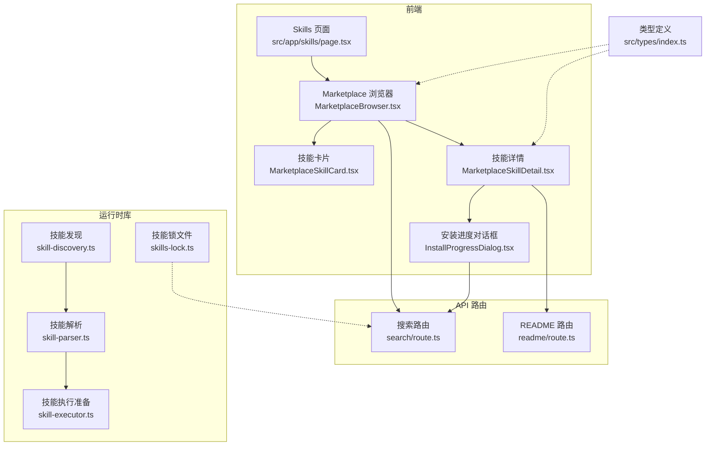
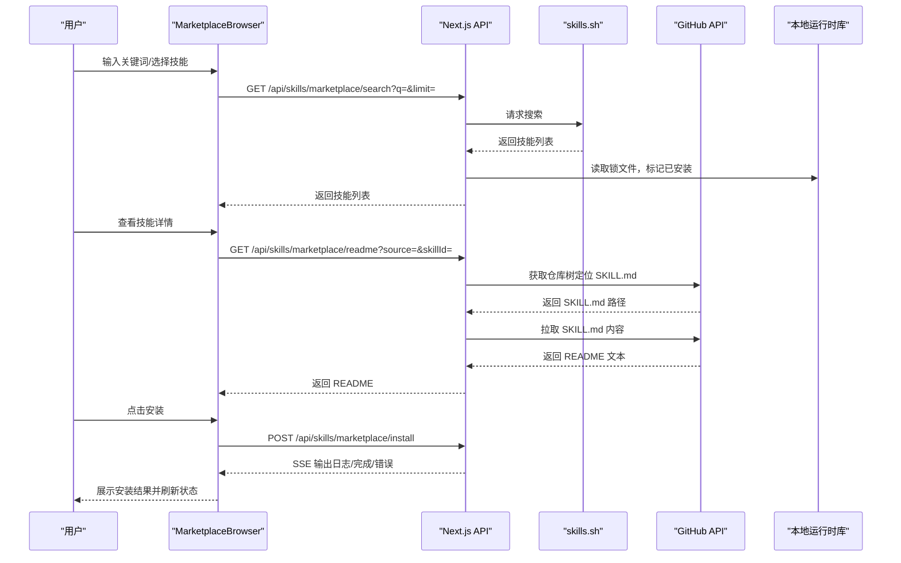
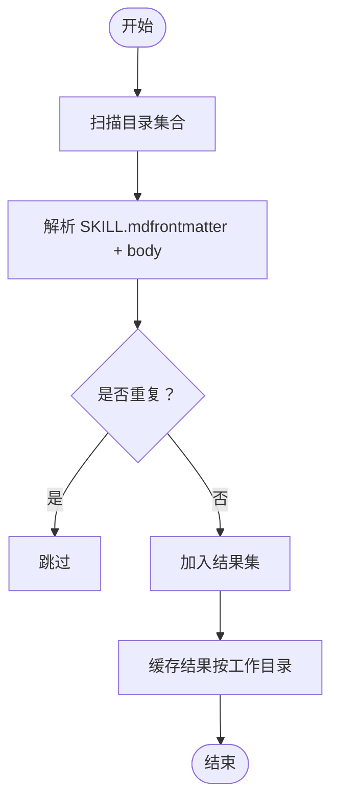
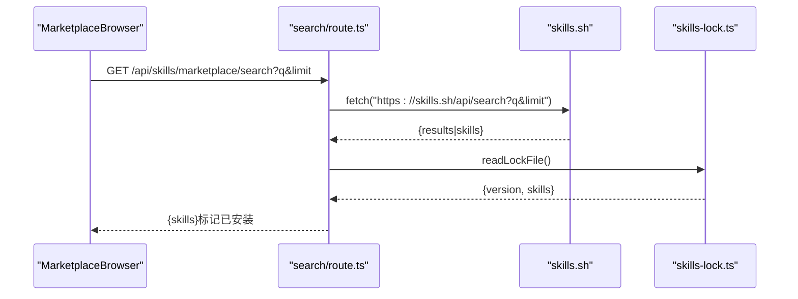
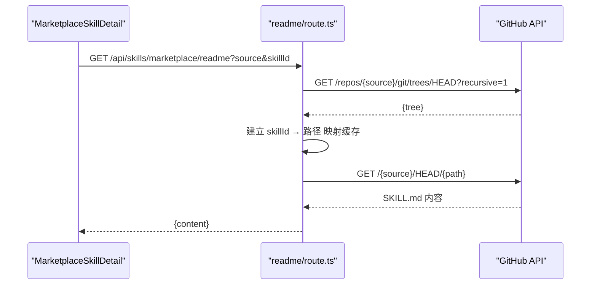
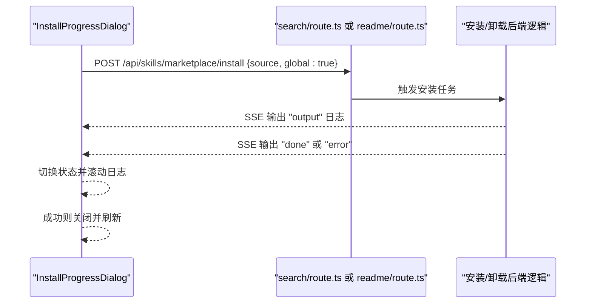
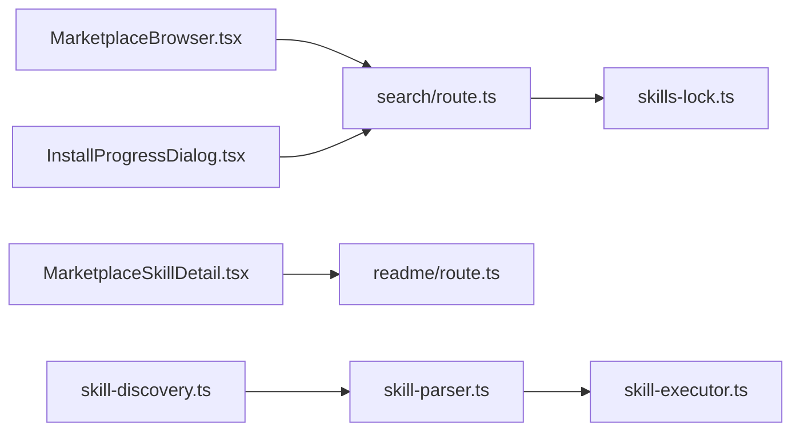

# 技能市场与商店

<cite>
**本文引用的文件**
- [skill-discovery.ts](file://src/lib/skill-discovery.ts)
- [skill-parser.ts](file://src/lib/skill-parser.ts)
- [skill-executor.ts](file://src/lib/skill-executor.ts)
- [skills-lock.ts](file://src/lib/skills-lock.ts)
- [MarketplaceBrowser.tsx](file://src/components/skills/MarketplaceBrowser.tsx)
- [MarketplaceSkillCard.tsx](file://src/components/skills/MarketplaceSkillCard.tsx)
- [MarketplaceSkillDetail.tsx](file://src/components/skills/MarketplaceSkillDetail.tsx)
- [InstallProgressDialog.tsx](file://src/components/skills/InstallProgressDialog.tsx)
- [search/route.ts](file://src/app/api/skills/marketplace/search/route.ts)
- [readme/route.ts](file://src/app/api/skills/marketplace/readme/route.ts)
- [skills/page.tsx](file://src/app/skills/page.tsx)
- [index.ts（类型定义）](file://src/types/index.ts)
- [skill-nudge.ts](file://src/lib/skill-nudge.ts)
</cite>

## 目录
1. [简介](#简介)
2. [项目结构](#项目结构)
3. [核心组件](#核心组件)
4. [架构总览](#架构总览)
5. [组件详解](#组件详解)
6. [依赖关系分析](#依赖关系分析)
7. [性能考量](#性能考量)
8. [故障排查指南](#故障排查指南)
9. [结论](#结论)
10. [附录](#附录)

## 简介
本文件面向 CodePilot 的“技能市场与商店”能力，围绕 skills.sh 技能市场的使用、技能搜索与过滤、安装流程、依赖与冲突处理、评分与下载统计、发布与审核、离线与批量安装、以及技能更新机制进行系统化说明。文档同时给出代码级架构图与关键流程图，帮助开发者快速理解并扩展该能力。

## 项目结构
技能市场与商店由前端 UI 组件、Next.js API 路由、以及本地技能发现/解析/执行/锁文件等运行时库共同组成。核心路径如下：
- 前端页面与组件：src/app/skills/page.tsx、src/components/skills/*
- API 路由：src/app/api/skills/marketplace/*
- 运行时库：src/lib/skill-*.ts、src/lib/skills-lock.ts
- 类型定义：src/types/index.ts

图表来源
- [skills/page.tsx:1-12](file://src/app/skills/page.tsx#L1-L12)
- [MarketplaceBrowser.tsx:1-141](file://src/components/skills/MarketplaceBrowser.tsx#L1-L141)
- [MarketplaceSkillCard.tsx:1-59](file://src/components/skills/MarketplaceSkillCard.tsx#L1-L59)
- [MarketplaceSkillDetail.tsx:1-173](file://src/components/skills/MarketplaceSkillDetail.tsx#L1-L173)
- [InstallProgressDialog.tsx:1-179](file://src/components/skills/InstallProgressDialog.tsx#L1-L179)
- [search/route.ts:1-75](file://src/app/api/skills/marketplace/search/route.ts#L1-L75)
- [readme/route.ts:1-96](file://src/app/api/skills/marketplace/readme/route.ts#L1-L96)
- [skill-discovery.ts:1-125](file://src/lib/skill-discovery.ts#L1-L125)
- [skill-parser.ts:1-127](file://src/lib/skill-parser.ts#L1-L127)
- [skill-executor.ts:1-52](file://src/lib/skill-executor.ts#L1-L52)
- [skills-lock.ts:1-23](file://src/lib/skills-lock.ts#L1-L23)
- [index.ts（类型定义）:385-411](file://src/types/index.ts#L385-L411)

章节来源
- [skills/page.tsx:1-12](file://src/app/skills/page.tsx#L1-L12)
- [MarketplaceBrowser.tsx:1-141](file://src/components/skills/MarketplaceBrowser.tsx#L1-L141)
- [MarketplaceSkillCard.tsx:1-59](file://src/components/skills/MarketplaceSkillCard.tsx#L1-L59)
- [MarketplaceSkillDetail.tsx:1-173](file://src/components/skills/MarketplaceSkillDetail.tsx#L1-L173)
- [InstallProgressDialog.tsx:1-179](file://src/components/skills/InstallProgressDialog.tsx#L1-L179)
- [search/route.ts:1-75](file://src/app/api/skills/marketplace/search/route.ts#L1-L75)
- [readme/route.ts:1-96](file://src/app/api/skills/marketplace/readme/route.ts#L1-L96)
- [skill-discovery.ts:1-125](file://src/lib/skill-discovery.ts#L1-L125)
- [skill-parser.ts:1-127](file://src/lib/skill-parser.ts#L1-L127)
- [skill-executor.ts:1-52](file://src/lib/skill-executor.ts#L1-L52)
- [skills-lock.ts:1-23](file://src/lib/skills-lock.ts#L1-L23)
- [index.ts（类型定义）:385-411](file://src/types/index.ts#L385-L411)

## 核心组件
- 技能发现与解析
  - 发现：扫描项目与用户级目录，解析 SKILL.md，去重并缓存结果。
  - 解析：提取 YAML frontmatter 与正文，构建 SkillDefinition。
  - 执行：根据上下文与参数替换生成可注入提示或子代理执行方案。
- 市场浏览与安装
  - 搜索：调用 skills.sh 搜索接口，短查询回退热门词；结合本地锁文件标记已安装。
  - 详情：通过 GitHub Tree API 定位 SKILL.md 实际路径并拉取 README 内容。
  - 安装：SSE 流式展示安装过程日志，支持取消与完成回调。
- 锁文件与状态
  - 锁文件记录已安装技能来源、版本与时间戳，用于状态同步与冲突识别。

章节来源
- [skill-discovery.ts:36-68](file://src/lib/skill-discovery.ts#L36-L68)
- [skill-parser.ts:43-59](file://src/lib/skill-parser.ts#L43-L59)
- [skill-executor.ts:25-44](file://src/lib/skill-executor.ts#L25-L44)
- [search/route.ts:5-60](file://src/app/api/skills/marketplace/search/route.ts#L5-L60)
- [readme/route.ts:11-51](file://src/app/api/skills/marketplace/readme/route.ts#L11-L51)
- [skills-lock.ts:8-22](file://src/lib/skills-lock.ts#L8-L22)

## 架构总览
技能市场与商店的端到端交互包括：前端 UI 触发搜索与详情请求，Next.js API 路由对接 skills.sh 与 GitHub API，并在安装阶段通过 SSE 返回实时日志。本地运行时库负责技能解析与执行，锁文件用于状态管理。

图表来源
- [MarketplaceBrowser.tsx:24-66](file://src/components/skills/MarketplaceBrowser.tsx#L24-L66)
- [MarketplaceSkillDetail.tsx:35-60](file://src/components/skills/MarketplaceSkillDetail.tsx#L35-L60)
- [search/route.ts:5-60](file://src/app/api/skills/marketplace/search/route.ts#L5-L60)
- [readme/route.ts:53-95](file://src/app/api/skills/marketplace/readme/route.ts#L53-L95)
- [InstallProgressDialog.tsx:40-113](file://src/components/skills/InstallProgressDialog.tsx#L40-L113)

## 组件详解

### 技能发现与解析
- 发现策略
  - 优先扫描工作目录下的项目级技能与命令目录，再扫描用户级与跨代理共享目录。
  - 缓存按工作目录隔离，变更后需显式失效。
  - 去重策略：按名称（大小写不敏感）去重，项目级覆盖用户级。
- 解析规则
  - 支持 YAML frontmatter 提取字段：名称、描述、允许工具、使用时机、执行上下文、参数、模型/努力级别、是否可被用户触发等。
  - 正文作为技能提示主体，保留原始格式。
- 执行准备
  - 参数替换：支持 ${arg} 与 $arg 两种占位符。
  - 内置变量：${CLAUDE_SKILL_DIR} 替换为技能所在目录。
  - 上下文：inline 注入对话；fork 启动子代理并限制工具集。

图表来源
- [skill-discovery.ts:80-108](file://src/lib/skill-discovery.ts#L80-L108)
- [skill-parser.ts:43-59](file://src/lib/skill-parser.ts#L43-L59)

章节来源
- [skill-discovery.ts:36-68](file://src/lib/skill-discovery.ts#L36-L68)
- [skill-parser.ts:43-59](file://src/lib/skill-parser.ts#L43-L59)
- [skill-executor.ts:25-44](file://src/lib/skill-executor.ts#L25-L44)

### 市场搜索与过滤
- 搜索接口
  - 对接 skills.sh 的搜索 API，短查询自动回退热门关键词。
  - 限制返回数量，默认 20。
  - 使用 AbortController 控制超时（默认 10 秒），异常统一处理。
- 已安装标记
  - 读取本地锁文件，基于 source 字段匹配，标记已安装技能。
- 过滤与排序
  - 前端 UI 支持关键词输入与空结果提示；后端未实现服务端排序/分类过滤。

图表来源
- [MarketplaceBrowser.tsx:24-44](file://src/components/skills/MarketplaceBrowser.tsx#L24-L44)
- [search/route.ts:5-60](file://src/app/api/skills/marketplace/search/route.ts#L5-L60)
- [skills-lock.ts:8-22](file://src/lib/skills-lock.ts#L8-L22)

章节来源
- [MarketplaceBrowser.tsx:15-66](file://src/components/skills/MarketplaceBrowser.tsx#L15-L66)
- [search/route.ts:5-75](file://src/app/api/skills/marketplace/search/route.ts#L5-L75)
- [skills-lock.ts:8-22](file://src/lib/skills-lock.ts#L8-L22)

### 技能详情与 README 拉取
- GitHub Tree API 定位
  - 首次按仓库默认分支递归树，缓存（5 分钟）：skillId → SKILL.md 路径。
  - 多个同名目录时优先较短路径（更靠近根目录）。
- README 渲染
  - 去除 frontmatter 后以 Markdown 渲染；加载中显示旋转图标；无内容时提示“无 README”。

图表来源
- [MarketplaceSkillDetail.tsx:35-60](file://src/components/skills/MarketplaceSkillDetail.tsx#L35-L60)
- [readme/route.ts:53-95](file://src/app/api/skills/marketplace/readme/route.ts#L53-L95)

章节来源
- [MarketplaceSkillDetail.tsx:35-80](file://src/components/skills/MarketplaceSkillDetail.tsx#L35-L80)
- [readme/route.ts:11-51](file://src/app/api/skills/marketplace/readme/route.ts#L11-L51)

### 安装流程与进度展示
- 安装入口
  - 用户点击“安装”，弹出安装进度对话框，发起 POST /api/skills/marketplace/install。
- SSE 日志
  - 服务端以事件流输出 output/done/error 事件，客户端滚动至最新日志。
- 取消与完成
  - 支持取消；成功后关闭对话框并刷新搜索结果与已安装状态。
- 卸载流程
  - 通过 POST /api/skills/marketplace/remove 支持卸载指定技能。

图表来源
- [InstallProgressDialog.tsx:40-113](file://src/components/skills/InstallProgressDialog.tsx#L40-L113)
- [MarketplaceSkillDetail.tsx:62-70](file://src/components/skills/MarketplaceSkillDetail.tsx#L62-L70)

章节来源
- [InstallProgressDialog.tsx:15-179](file://src/components/skills/InstallProgressDialog.tsx#L15-L179)
- [MarketplaceSkillDetail.tsx:62-70](file://src/components/skills/MarketplaceSkillDetail.tsx#L62-L70)

### 依赖检查与冲突解决
- 依赖检查
  - 解析阶段读取 allowed-tools 列表；执行阶段若 context=fork，则限制工具集。
- 冲突解决
  - 项目级技能优先于用户级技能（去重时后者覆盖前者）。
  - 锁文件记录已安装来源，用于 UI 标记与后续比对。
- 建议实践
  - 在 SKILL.md frontmatter 中明确 allowed-tools，避免过度宽泛权限。
  - 使用唯一 source 标识来源仓库，便于锁文件去重与冲突定位。

章节来源
- [skill-parser.ts:50-56](file://src/lib/skill-parser.ts#L50-L56)
- [skill-executor.ts:25-44](file://src/lib/skill-executor.ts#L25-L44)
- [skill-discovery.ts:115-124](file://src/lib/skill-discovery.ts#L115-L124)
- [skills-lock.ts:8-22](file://src/lib/skills-lock.ts#L8-L22)

### 评分系统、用户评价与下载统计
- 下载统计
  - skills.sh 返回 installs/downlods 字段，前端以“下载量”展示。
- 评分与评价
  - 当前实现未直接对接 skills.sh 的评分/评价字段；如需集成，可在搜索结果映射中补充字段并在 UI 呈现。
- 建议
  - 若 skills.sh 新增字段，可在类型定义与搜索映射处扩展。

章节来源
- [search/route.ts:53-57](file://src/app/api/skills/marketplace/search/route.ts#L53-L57)
- [MarketplaceSkillCard.tsx:48-53](file://src/components/skills/MarketplaceSkillCard.tsx#L48-L53)
- [index.ts（类型定义）:387-395](file://src/types/index.ts#L387-L395)

### 技能发布指南、质量标准与审核流程
- 发布入口
  - 将技能目录置于用户或项目级 .claude/skills 或 .claude/commands 下，确保包含 SKILL.md。
- 质量标准
  - frontmatter 必填项：name、description、context（inline/fork）、arguments（如有）。
  - 允许工具：建议最小化授权，仅列出必要工具。
  - 使用时机：when_to_use/whenToUse 描述触发场景。
  - 模型与努力：model/effort 可选覆盖。
- 审核流程
  - 本仓库未实现内置审核；可通过 skills.sh 平台进行审核与分发。
  - 建议在 README 中提供清晰的使用说明与示例。

章节来源
- [skill-parser.ts:43-59](file://src/lib/skill-parser.ts#L43-L59)
- [skill-discovery.ts:18-26](file://src/lib/skill-discovery.ts#L18-L26)

### 离线安装、批量安装与技能更新
- 离线安装
  - 将技能目录放置于本地 .claude/skills 或 .claude/commands，重启应用或触发重新扫描后即可发现。
- 批量安装
  - 当前 UI 未提供批量安装入口；可通过脚本或自动化方式批量复制目录至本地技能目录。
- 技能更新
  - 更新策略取决于来源：若来自 skills.sh，安装后以 source 为键写入锁文件；后续可通过重新安装覆盖。
  - 建议在 README 中标注版本号与变更说明，配合锁文件记录 installedAt/updatedAt。

章节来源
- [skills-lock.ts:8-22](file://src/lib/skills-lock.ts#L8-L22)
- [skill-discovery.ts:36-68](file://src/lib/skill-discovery.ts#L36-L68)

## 依赖关系分析
- 组件耦合
  - 前端组件依赖类型定义与翻译钩子；API 路由依赖运行时库与外部服务。
  - 安装进度对话框与搜索/详情组件解耦，通过 API 路由串联。
- 外部依赖
  - skills.sh：搜索与元数据。
  - GitHub：Tree API 定位 SKILL.md。
- 潜在循环依赖
  - 未见直接循环导入；各模块职责清晰。

图表来源
- [MarketplaceBrowser.tsx:1-141](file://src/components/skills/MarketplaceBrowser.tsx#L1-L141)
- [MarketplaceSkillDetail.tsx:1-173](file://src/components/skills/MarketplaceSkillDetail.tsx#L1-L173)
- [InstallProgressDialog.tsx:1-179](file://src/components/skills/InstallProgressDialog.tsx#L1-L179)
- [search/route.ts:1-75](file://src/app/api/skills/marketplace/search/route.ts#L1-L75)
- [readme/route.ts:1-96](file://src/app/api/skills/marketplace/readme/route.ts#L1-L96)
- [skills-lock.ts:1-23](file://src/lib/skills-lock.ts#L1-L23)
- [skill-parser.ts:1-127](file://src/lib/skill-parser.ts#L1-L127)
- [skill-executor.ts:1-52](file://src/lib/skill-executor.ts#L1-L52)
- [skill-discovery.ts:1-125](file://src/lib/skill-discovery.ts#L1-L125)

章节来源
- [index.ts（类型定义）:385-411](file://src/types/index.ts#L385-L411)

## 性能考量
- 搜索与缓存
  - 短查询回退热门词减少无效网络请求。
  - README Tree API 结果按仓库维度缓存 5 分钟，降低重复扫描开销。
- UI 体验
  - 搜索防抖 300ms，避免频繁请求。
  - 安装进度采用 SSE 流式日志，及时反馈。
- 建议优化
  - 增加服务端分页与排序参数，提升长列表性能。
  - 对 README 内容增加本地缓存与失效策略。

## 故障排查指南
- 搜索失败
  - 检查 skills.sh 接口可用性与网络超时设置。
  - 短查询会回退热门词，确认是否命中。
- README 为空
  - 确认 skillId 与 source 是否正确；检查仓库树中是否存在 SKILL.md。
  - 若存在多个同名目录，优先使用较短路径。
- 安装卡住或中断
  - 查看 SSE 日志中的 error 事件；确认安装后端逻辑是否抛错。
  - 取消后重新尝试，避免并发安装。
- 已安装状态不同步
  - 确认锁文件路径与内容；检查 source 字段是否一致。

章节来源
- [search/route.ts:27-32](file://src/app/api/skills/marketplace/search/route.ts#L27-L32)
- [readme/route.ts:72-82](file://src/app/api/skills/marketplace/readme/route.ts#L72-L82)
- [InstallProgressDialog.tsx:98-112](file://src/components/skills/InstallProgressDialog.tsx#L98-L112)
- [skills-lock.ts:8-22](file://src/lib/skills-lock.ts#L8-L22)

## 结论
CodePilot 的技能市场与商店以 skills.sh 为核心入口，结合本地技能发现、解析与执行，提供了从搜索、详情、安装到状态管理的完整链路。当前实现聚焦于易用性与可扩展性，未来可在服务端排序/筛选、评分/评价集成、批量安装与更新策略等方面进一步完善。

## 附录
- 相关能力提示
  - 运行时建议：复杂多步骤工作流可触发“保存为技能”的提示，便于复用。
- 关键类型参考
  - 市场技能模型、锁文件模型、技能定义等类型定义位于类型文件中。

章节来源
- [skill-nudge.ts:37-75](file://src/lib/skill-nudge.ts#L37-L75)
- [index.ts（类型定义）:387-411](file://src/types/index.ts#L387-L411)