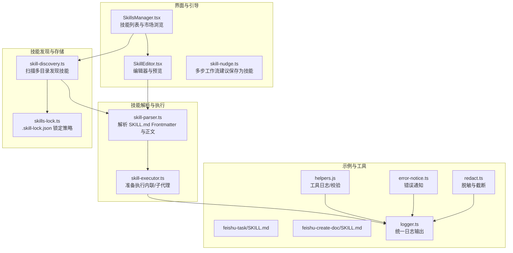
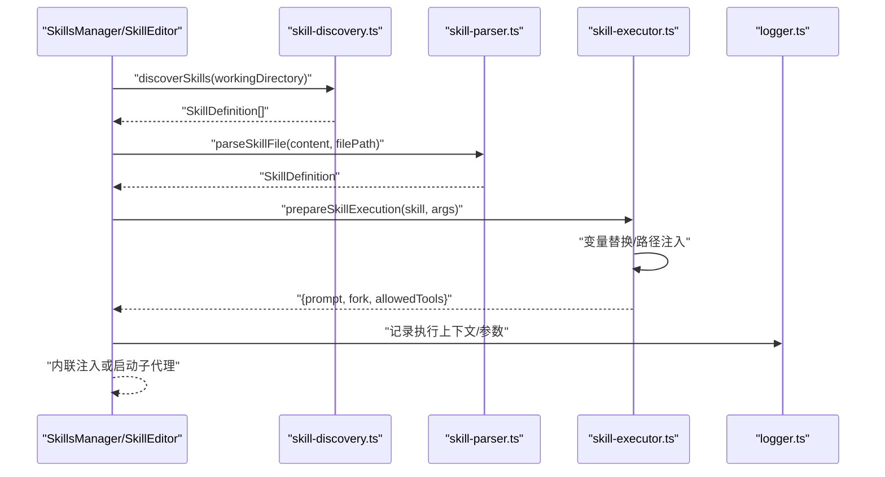
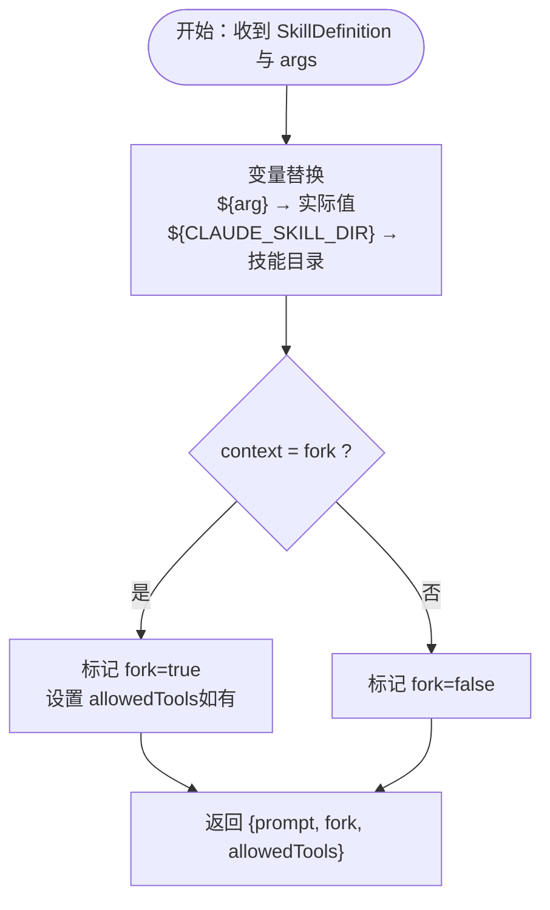
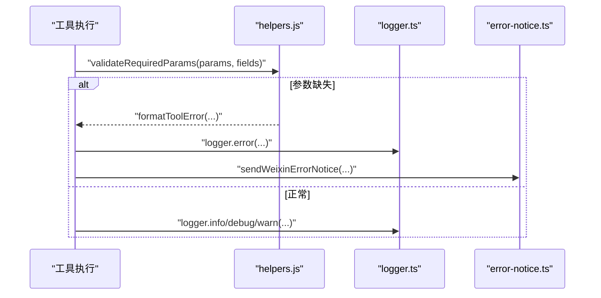
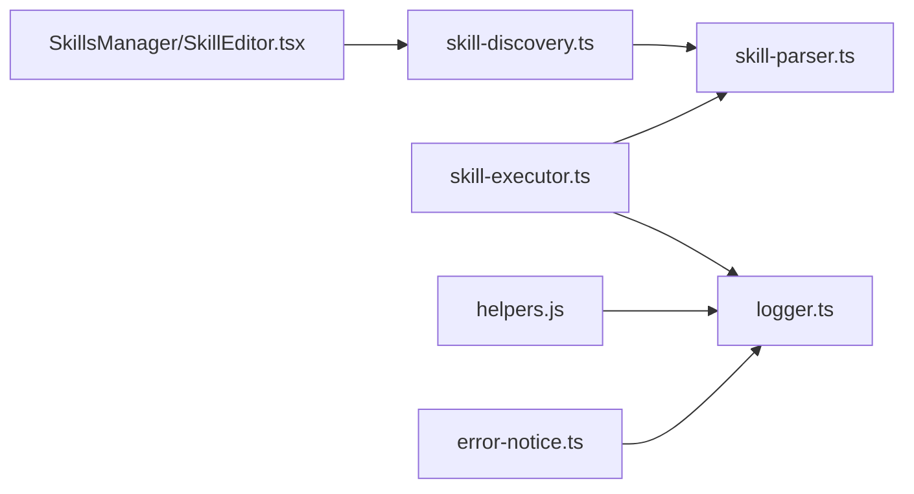

# 技能开发指南

<cite>
**本文引用的文件**
- [src/lib/skill-parser.ts](file://src/lib/skill-parser.ts)
- [src/lib/skill-executor.ts](file://src/lib/skill-executor.ts)
- [src/lib/skill-discovery.ts](file://src/lib/skill-discovery.ts)
- [src/lib/skill-nudge.ts](file://src/lib/skill-nudge.ts)
- [src/lib/skills-lock.ts](file://src/lib/skills-lock.ts)
- [src/components/skills/SkillEditor.tsx](file://src/components/skills/SkillEditor.tsx)
- [src/components/skills/SkillsManager.tsx](file://src/components/skills/SkillsManager.tsx)
- [资料/feishu-openclaw-plugin/package/skills/feishu-task/SKILL.md](file://资料/feishu-openclaw-plugin/package/skills/feishu-task/SKILL.md)
- [资料/feishu-openclaw-plugin/package/skills/feishu-create-doc/SKILL.md](file://资料/feishu-openclaw-plugin/package/skills/feishu-create-doc/SKILL.md)
- [资料/weixin-openclaw-package/package/src/util/logger.ts](file://资料/weixin-openclaw-package/package/src/util/logger.ts)
- [资料/weixin-openclaw-package/package/src/messaging/error-notice.ts](file://资料/weixin-openclaw-package/package/src/messaging/error-notice.ts)
- [资料/weixin-openclaw-package/package/src/util/redact.ts](file://资料/weixin-openclaw-package/package/src/util/redact.ts)
- [资料/feishu-openclaw-plugin/package/src/tools/helpers.js](file://资料/feishu-openclaw-plugin/package/src/tools/helpers.js)
- [资料/feishu-openclaw-plugin/package/src/tools/oapi/task/comment.js](file://资料/feishu-openclaw-plugin/package/src/tools/oapi/task/comment.js)
</cite>

## 目录
1. [简介](#简介)
2. [项目结构](#项目结构)
3. [核心组件](#核心组件)
4. [架构总览](#架构总览)
5. [详细组件分析](#详细组件分析)
6. [依赖分析](#依赖分析)
7. [性能考虑](#性能考虑)
8. [故障排查指南](#故障排查指南)
9. [结论](#结论)
10. [附录](#附录)

## 简介
本指南面向希望在 CodePilot 中开发与维护“技能（Skill）”的开发者。技能以 SKILL.md 文件形式存在，采用 YAML Frontmatter 声明技能元数据，正文为自然语言提示词与使用说明。CodePilot 的运行时负责发现、解析、执行技能，并在必要时以“内联提示”或“子代理”模式注入到对话流程中。

本指南覆盖：
- SKILL.md 编写规范与模板
- 技能参数定义、输入输出约定
- 错误处理与日志记录
- 技能测试、调试与性能优化
- 多类型技能示例（文件操作、API 调用、自动化任务）
- 技能版本管理、依赖声明与兼容性

## 项目结构
围绕技能的关键模块与文件如下：
- 解析与执行：skill-parser.ts、skill-executor.ts
- 发现与缓存：skill-discovery.ts、skills-lock.ts
- 交互与引导：skill-nudge.ts、SkillsManager.tsx、SkillEditor.tsx
- 示例技能：feishu-task、feishu-create-doc
- 日志与错误：logger.ts、error-notice.ts、redact.ts、helpers.js

**图表来源**
- [src/lib/skill-parser.ts:1-127](file://src/lib/skill-parser.ts#L1-L127)
- [src/lib/skill-executor.ts:1-52](file://src/lib/skill-executor.ts#L1-L52)
- [src/lib/skill-discovery.ts:1-125](file://src/lib/skill-discovery.ts#L1-L125)
- [src/lib/skills-lock.ts:1-23](file://src/lib/skills-lock.ts#L1-L23)
- [src/components/skills/SkillsManager.tsx:1-348](file://src/components/skills/SkillsManager.tsx#L1-L348)
- [src/components/skills/SkillEditor.tsx:1-235](file://src/components/skills/SkillEditor.tsx#L1-L235)
- [src/lib/skill-nudge.ts:1-112](file://src/lib/skill-nudge.ts#L1-L112)
- [资料/feishu-openclaw-plugin/package/skills/feishu-task/SKILL.md:1-294](file://资料/feishu-openclaw-plugin/package/skills/feishu-task/SKILL.md#L1-L294)
- [资料/feishu-openclaw-plugin/package/skills/feishu-create-doc/SKILL.md:1-720](file://资料/feishu-openclaw-plugin/package/skills/feishu-create-doc/SKILL.md#L1-L720)
- [资料/weixin-openclaw-package/package/src/util/logger.ts:81-143](file://资料/weixin-openclaw-package/package/src/util/logger.ts#L81-L143)
- [资料/weixin-openclaw-package/package/src/messaging/error-notice.ts:1-31](file://资料/weixin-openclaw-package/package/src/messaging/error-notice.ts#L1-L31)
- [资料/weixin-openclaw-package/package/src/util/redact.ts:1-46](file://资料/weixin-openclaw-package/package/src/util/redact.ts#L1-L46)
- [资料/feishu-openclaw-plugin/package/src/tools/helpers.js:187-279](file://资料/feishu-openclaw-plugin/package/src/tools/helpers.js#L187-L279)

**章节来源**
- [src/lib/skill-parser.ts:1-127](file://src/lib/skill-parser.ts#L1-L127)
- [src/lib/skill-executor.ts:1-52](file://src/lib/skill-executor.ts#L1-L52)
- [src/lib/skill-discovery.ts:1-125](file://src/lib/skill-discovery.ts#L1-L125)
- [src/lib/skills-lock.ts:1-23](file://src/lib/skills-lock.ts#L1-L23)
- [src/components/skills/SkillsManager.tsx:1-348](file://src/components/skills/SkillsManager.tsx#L1-L348)
- [src/components/skills/SkillEditor.tsx:1-235](file://src/components/skills/SkillEditor.tsx#L1-L235)
- [src/lib/skill-nudge.ts:1-112](file://src/lib/skill-nudge.ts#L1-L112)

## 核心组件
- 技能解析器：将 SKILL.md 的 YAML Frontmatter 与正文解析为结构化定义，支持 allowed-tools、arguments、context、model、effort 等语义字段。
- 技能执行器：根据上下文（内联/子代理）与工具限制，对技能正文进行变量替换并生成执行结果。
- 技能发现器：扫描项目级与用户级目录，去重合并，缓存结果，支持失效刷新。
- 技能锁：用户级 .agents/.skill-lock.json 用于技能版本锁定与兼容策略。
- 界面与引导：SkillsManager 与 SkillEditor 提供技能的浏览、编辑、保存、删除与市场安装；skill-nudge 基于统计阈值建议保存为技能。
- 日志与错误：统一日志、错误通知与敏感信息脱敏，保障可观测性与安全性。

**章节来源**
- [src/lib/skill-parser.ts:9-38](file://src/lib/skill-parser.ts#L9-L38)
- [src/lib/skill-executor.ts:10-17](file://src/lib/skill-executor.ts#L10-L17)
- [src/lib/skill-discovery.ts:18-26](file://src/lib/skill-discovery.ts#L18-L26)
- [src/lib/skills-lock.ts:6-22](file://src/lib/skills-lock.ts#L6-L22)
- [src/lib/skill-nudge.ts:17-41](file://src/lib/skill-nudge.ts#L17-L41)
- [资料/weixin-openclaw-package/package/src/util/logger.ts:117-141](file://资料/weixin-openclaw-package/package/src/util/logger.ts#L117-L141)
- [资料/weixin-openclaw-package/package/src/messaging/error-notice.ts:9-31](file://资料/weixin-openclaw-package/package/src/messaging/error-notice.ts#L9-L31)
- [资料/weixin-openclaw-package/package/src/util/redact.ts:1-46](file://资料/weixin-openclaw-package/package/src/util/redact.ts#L1-L46)

## 架构总览
下面的序列图展示了从“用户选择技能”到“技能注入对话”的关键流程。

**图表来源**
- [src/lib/skill-discovery.ts:36-60](file://src/lib/skill-discovery.ts#L36-L60)
- [src/lib/skill-parser.ts:43-59](file://src/lib/skill-parser.ts#L43-L59)
- [src/lib/skill-executor.ts:25-44](file://src/lib/skill-executor.ts#L25-L44)
- [资料/weixin-openclaw-package/package/src/util/logger.ts:117-141](file://资料/weixin-openclaw-package/package/src/util/logger.ts#L117-L141)

## 详细组件分析

### SKILL.md 编写规范与模板
- 文件位置：.claude/skills/<技能名>/SKILL.md 或 .claude/commands/*.md
- Frontmatter 字段（示例与兼容性参考）：
  - name：技能名称（未提供时从文件名推导）
  - description：技能描述
  - allowed-tools：允许使用的工具列表（为空表示不限制）
  - when_to_use：何时使用该技能的条件说明
  - context：inline（内联注入）或 fork（子代理）
  - arguments：模板参数数组（name/description/required）
  - model/effort：模型与算力覆盖
  - user-invocable：是否可通过斜杠命令触发
- 正文：自然语言提示词、使用说明、参数示例、常见问题等

示例参考：
- [资料/feishu-openclaw-plugin/package/skills/feishu-task/SKILL.md:1-120](file://资料/feishu-openclaw-plugin/package/skills/feishu-task/SKILL.md#L1-L120)
- [资料/feishu-openclaw-plugin/package/skills/feishu-create-doc/SKILL.md:1-60](file://资料/feishu-openclaw-plugin/package/skills/feishu-create-doc/SKILL.md#L1-L60)

最佳实践：
- 明确“意图→工具→参数”的映射，便于模型理解
- 在正文提供“执行前必读”“常见错误与排查”“附录背景知识”
- 使用表格与代码块示例，降低歧义
- 严格区分必填/可选参数，给出默认值与边界条件

**章节来源**
- [src/lib/skill-parser.ts:43-59](file://src/lib/skill-parser.ts#L43-L59)
- [资料/feishu-openclaw-plugin/package/skills/feishu-task/SKILL.md:1-120](file://资料/feishu-openclaw-plugin/package/skills/feishu-task/SKILL.md#L1-L120)
- [资料/feishu-openclaw-plugin/package/skills/feishu-create-doc/SKILL.md:1-60](file://资料/feishu-openclaw-plugin/package/skills/feishu-create-doc/SKILL.md#L1-L60)

### 技能参数定义与输入输出规范
- 参数来源：
  - Frontmatter.arguments：声明模板变量（name/description/required）
  - 正文中的“参数”“示例”“常见错误”等
- 执行期变量替换：
  - ${arg} 与 $arg 形式均支持
  - 内置变量：${CLAUDE_SKILL_DIR} 指向技能所在目录
- 输出：
  - 内联：返回 prompt 文本，直接注入对话
  - 子代理：返回 fork 标记与 allowedTools 限制

**图表来源**
- [src/lib/skill-executor.ts:25-44](file://src/lib/skill-executor.ts#L25-L44)

**章节来源**
- [src/lib/skill-executor.ts:25-44](file://src/lib/skill-executor.ts#L25-L44)

### 错误处理与日志记录
- 统一日志：
  - logger.ts 提供 info/debug/warn/error 方法，支持按账号绑定与文件落盘
- 工具日志与错误格式化：
  - helpers.js 提供 createToolLogger/formatToolError/validateRequiredParams 等工具
- 错误通知：
  - error-notice.ts 通过消息通道向用户发送错误通知，失败时静默记录
- 脱敏与截断：
  - redact.ts 提供 truncate/redactToken/redactBody/redactUrl，避免敏感信息泄露

**图表来源**
- [资料/feishu-openclaw-plugin/package/src/tools/helpers.js:190-242](file://资料/feishu-openclaw-plugin/package/src/tools/helpers.js#L190-L242)
- [资料/weixin-openclaw-package/package/src/util/logger.ts:117-141](file://资料/weixin-openclaw-package/package/src/util/logger.ts#L117-L141)
- [资料/weixin-openclaw-package/package/src/messaging/error-notice.ts:9-31](file://资料/weixin-openclaw-package/package/src/messaging/error-notice.ts#L9-L31)
- [资料/weixin-openclaw-package/package/src/util/redact.ts:1-46](file://资料/weixin-openclaw-package/package/src/util/redact.ts#L1-L46)

**章节来源**
- [资料/feishu-openclaw-plugin/package/src/tools/helpers.js:190-242](file://资料/feishu-openclaw-plugin/package/src/tools/helpers.js#L190-L242)
- [资料/weixin-openclaw-package/package/src/util/logger.ts:81-143](file://资料/weixin-openclaw-package/package/src/util/logger.ts#L81-L143)
- [资料/weixin-openclaw-package/package/src/messaging/error-notice.ts:1-31](file://资料/weixin-openclaw-package/package/src/messaging/error-notice.ts#L1-L31)
- [资料/weixin-openclaw-package/package/src/util/redact.ts:1-46](file://资料/weixin-openclaw-package/package/src/util/redact.ts#L1-L46)

### 技能测试方法与调试技巧
- 单元测试建议：
  - 使用 skill-parser.ts 的 parseSkillFile 对 SKILL.md 进行解析断言
  - 使用 skill-executor.ts 的 prepareSkillExecution 对变量替换与上下文进行断言
  - 使用 skill-discovery.ts 的 getSkill/invalidates 技术验证发现与缓存
- 调试技巧：
  - 在工具执行中使用 createToolLogger 输出关键中间态
  - 使用 redact.ts 对日志中的敏感信息进行脱敏
  - 使用 skill-nudge.ts 的阈值启发式定位“值得保存为技能”的工作流

**章节来源**
- [src/lib/skill-parser.ts:43-59](file://src/lib/skill-parser.ts#L43-L59)
- [src/lib/skill-executor.ts:25-44](file://src/lib/skill-executor.ts#L25-L44)
- [src/lib/skill-discovery.ts:73-76](file://src/lib/skill-discovery.ts#L73-L76)
- [src/lib/skill-nudge.ts:37-41](file://src/lib/skill-nudge.ts#L37-L41)
- [资料/feishu-openclaw-plugin/package/src/tools/helpers.js:219-242](file://资料/feishu-openclaw-plugin/package/src/tools/helpers.js#L219-L242)
- [资料/weixin-openclaw-package/package/src/util/redact.ts:1-46](file://资料/weixin-openclaw-package/package/src/util/redact.ts#L1-L46)

### 性能优化建议
- 缓存与去重：利用 skill-discovery.ts 的缓存与按名称去重，减少重复解析
- 变量替换：在 prepareSkillExecution 中一次性完成，避免多次正则替换
- 工具限制：合理设置 allowed-tools，减少不必要的工具调用
- 日志级别：生产环境使用 warn/error，开发阶段使用 debug/info
- 脱敏成本：对长日志与敏感字段使用 redact.ts，避免 IO 压力

**章节来源**
- [src/lib/skill-discovery.ts:28-68](file://src/lib/skill-discovery.ts#L28-L68)
- [src/lib/skill-executor.ts:25-44](file://src/lib/skill-executor.ts#L25-L44)
- [资料/weixin-openclaw-package/package/src/util/redact.ts:1-46](file://资料/weixin-openclaw-package/package/src/util/redact.ts#L1-L46)

### 多类型技能示例

#### 文件操作类：飞书任务管理
- 典型场景：创建/查询/更新任务，创建/管理任务清单，设置负责人/关注人，设置截止时间/全天任务
- 参数要点：action、task_guid、tasklist_guid、members、due、completed_at 等
- 约束与建议：自动保护机制、角色说明、时间格式、清单成员角色冲突

参考文件：
- [资料/feishu-openclaw-plugin/package/skills/feishu-task/SKILL.md:1-294](file://资料/feishu-openclaw-plugin/package/skills/feishu-task/SKILL.md#L1-L294)

**章节来源**
- [资料/feishu-openclaw-plugin/package/skills/feishu-task/SKILL.md:1-294](file://资料/feishu-openclaw-plugin/package/skills/feishu-task/SKILL.md#L1-L294)

#### API 调用类：飞书文档创建
- 典型场景：从 Lark-flavored Markdown 创建飞书云文档，支持指定位置（文件夹/知识库/知识空间）
- 参数要点：title、markdown、folder_token、wiki_node、wiki_space
- 内容格式：Lark 扩展语法（callout/grid/table/image/file/mermaid/plantuml 等）

参考文件：
- [资料/feishu-openclaw-plugin/package/skills/feishu-create-doc/SKILL.md:1-720](file://资料/feishu-openclaw-plugin/package/skills/feishu-create-doc/SKILL.md#L1-L720)

**章节来源**
- [资料/feishu-openclaw-plugin/package/skills/feishu-create-doc/SKILL.md:1-720](file://资料/feishu-openclaw-plugin/package/skills/feishu-create-doc/SKILL.md#L1-L720)

#### 自动化任务类：工具执行与错误处理
- 典型场景：工具注册、参数校验、日志记录、错误通知
- 参考实现：工具日志、参数校验、错误格式化、错误通知

参考文件：
- [资料/feishu-openclaw-plugin/package/src/tools/helpers.js:190-242](file://资料/feishu-openclaw-plugin/package/src/tools/helpers.js#L190-L242)
- [资料/feishu-openclaw-plugin/package/src/tools/oapi/task/comment.js:56-81](file://资料/feishu-openclaw-plugin/package/src/tools/oapi/task/comment.js#L56-L81)
- [资料/weixin-openclaw-package/package/src/messaging/error-notice.ts:9-31](file://资料/weixin-openclaw-package/package/src/messaging/error-notice.ts#L9-L31)

**章节来源**
- [资料/feishu-openclaw-plugin/package/src/tools/helpers.js:190-242](file://资料/feishu-openclaw-plugin/package/src/tools/helpers.js#L190-L242)
- [资料/feishu-openclaw-plugin/package/src/tools/oapi/task/comment.js:56-81](file://资料/feishu-openclaw-plugin/package/src/tools/oapi/task/comment.js#L56-L81)
- [资料/weixin-openclaw-package/package/src/messaging/error-notice.ts:1-31](file://资料/weixin-openclaw-package/package/src/messaging/error-notice.ts#L1-L31)

### 技能版本管理、依赖声明与兼容性
- 版本管理：
  - 用户级 .agents/.skill-lock.json 用于技能版本锁定与兼容策略
- 依赖声明：
  - Frontmatter.allowed-tools 限定工具范围
  - Frontmatter.arguments 声明模板参数
- 兼容性：
  - 兼容 Claude Code 的 SKILL.md 格式（Frontmatter 字段）
  - 建议保留 when_to_use、context、model、effort 等字段以提升可移植性

参考文件：
- [src/lib/skills-lock.ts:6-22](file://src/lib/skills-lock.ts#L6-L22)
- [src/lib/skill-parser.ts:43-59](file://src/lib/skill-parser.ts#L43-L59)

**章节来源**
- [src/lib/skills-lock.ts:6-22](file://src/lib/skills-lock.ts#L6-L22)
- [src/lib/skill-parser.ts:43-59](file://src/lib/skill-parser.ts#L43-L59)

## 依赖分析
- 组件耦合：
  - skill-discovery.ts 依赖 skill-parser.ts 与操作系统路径
  - skill-executor.ts 依赖 skill-parser.ts 的结构化定义
  - SkillsManager/SkillEditor 依赖 skill-discovery.ts 的发现结果
  - 日志与错误处理模块相互独立，通过接口注入
- 外部依赖：
  - 文件系统（fs/path/os）
  - 前端 UI（React/Next.js 组件）

**图表来源**
- [src/lib/skill-discovery.ts:12-15](file://src/lib/skill-discovery.ts#L12-L15)
- [src/lib/skill-parser.ts:1-10](file://src/lib/skill-parser.ts#L1-L10)
- [src/lib/skill-executor.ts:8-9](file://src/lib/skill-executor.ts#L8-L9)
- [src/components/skills/SkillsManager.tsx:1-16](file://src/components/skills/SkillsManager.tsx#L1-L16)
- [src/components/skills/SkillEditor.tsx:1-26](file://src/components/skills/SkillEditor.tsx#L1-L26)
- [资料/weixin-openclaw-package/package/src/util/logger.ts:117-141](file://资料/weixin-openclaw-package/package/src/util/logger.ts#L117-L141)
- [资料/feishu-openclaw-plugin/package/src/tools/helpers.js:190-242](file://资料/feishu-openclaw-plugin/package/src/tools/helpers.js#L190-L242)
- [资料/weixin-openclaw-package/package/src/messaging/error-notice.ts:1-31](file://资料/weixin-openclaw-package/package/src/messaging/error-notice.ts#L1-L31)

**章节来源**
- [src/lib/skill-discovery.ts:12-15](file://src/lib/skill-discovery.ts#L12-L15)
- [src/lib/skill-parser.ts:1-10](file://src/lib/skill-parser.ts#L1-L10)
- [src/lib/skill-executor.ts:8-9](file://src/lib/skill-executor.ts#L8-L9)
- [src/components/skills/SkillsManager.tsx:1-16](file://src/components/skills/SkillsManager.tsx#L1-L16)
- [src/components/skills/SkillEditor.tsx:1-26](file://src/components/skills/SkillEditor.tsx#L1-L26)

## 性能考虑
- 发现与缓存：首次扫描后缓存结果，变更后主动失效
- 解析与执行：Frontmatter 解析为轻量键值对，执行时仅做一次变量替换
- 日志与脱敏：对长日志与敏感字段进行截断与脱敏，避免 IO 压力
- 工具限制：通过 allowed-tools 减少无效调用

[本节为通用指导，无需特定文件引用]

## 故障排查指南
- 常见问题定位：
  - 参数缺失：使用 validateRequiredParams 校验必填字段
  - 日志脱敏：使用 redact.ts 对日志进行安全处理
  - 错误通知：通过 error-notice.ts 向用户反馈错误
- 建议流程：
  - 开启 debug 日志，复现问题
  - 检查 Frontmatter 字段与正文示例一致性
  - 校验 allowed-tools 与实际调用工具是否匹配
  - 使用 skill-nudge.ts 的阈值启发式确认是否应保存为技能

**章节来源**
- [资料/feishu-openclaw-plugin/package/src/tools/helpers.js:264-276](file://资料/feishu-openclaw-plugin/package/src/tools/helpers.js#L264-L276)
- [资料/weixin-openclaw-package/package/src/util/redact.ts:1-46](file://资料/weixin-openclaw-package/package/src/util/redact.ts#L1-L46)
- [资料/weixin-openclaw-package/package/src/messaging/error-notice.ts:9-31](file://资料/weixin-openclaw-package/package/src/messaging/error-notice.ts#L9-L31)
- [src/lib/skill-nudge.ts:37-41](file://src/lib/skill-nudge.ts#L37-L41)

## 结论
通过标准化的 SKILL.md Frontmatter 与正文结构、严格的参数与错误处理规范、完善的日志与脱敏机制，以及可缓存的发现与执行流程，CodePilot 能够稳定地支持多类型技能的开发与运行。建议在开发过程中：
- 严格遵循 SKILL.md 规范
- 明确参数与上下文，合理设置 allowed-tools
- 使用统一日志与错误通知，保障可观测性与用户体验
- 借助缓存与阈值启发式，持续优化性能与易用性

[本节为总结，无需特定文件引用]

## 附录

### SKILL.md 模板与字段说明
- 必填字段：name、description
- 建议字段：allowed-tools、when_to_use、context、arguments、model、effort、user-invocable
- 正文建议：意图→工具→参数映射、示例、常见错误、附录背景

参考文件：
- [src/lib/skill-parser.ts:43-59](file://src/lib/skill-parser.ts#L43-L59)
- [资料/feishu-openclaw-plugin/package/skills/feishu-task/SKILL.md:1-120](file://资料/feishu-openclaw-plugin/package/skills/feishu-task/SKILL.md#L1-L120)
- [资料/feishu-openclaw-plugin/package/skills/feishu-create-doc/SKILL.md:1-60](file://资料/feishu-openclaw-plugin/package/skills/feishu-create-doc/SKILL.md#L1-L60)

**章节来源**
- [src/lib/skill-parser.ts:43-59](file://src/lib/skill-parser.ts#L43-L59)
- [资料/feishu-openclaw-plugin/package/skills/feishu-task/SKILL.md:1-120](file://资料/feishu-openclaw-plugin/package/skills/feishu-task/SKILL.md#L1-L120)
- [资料/feishu-openclaw-plugin/package/skills/feishu-create-doc/SKILL.md:1-60](file://资料/feishu-openclaw-plugin/package/skills/feishu-create-doc/SKILL.md#L1-L60)