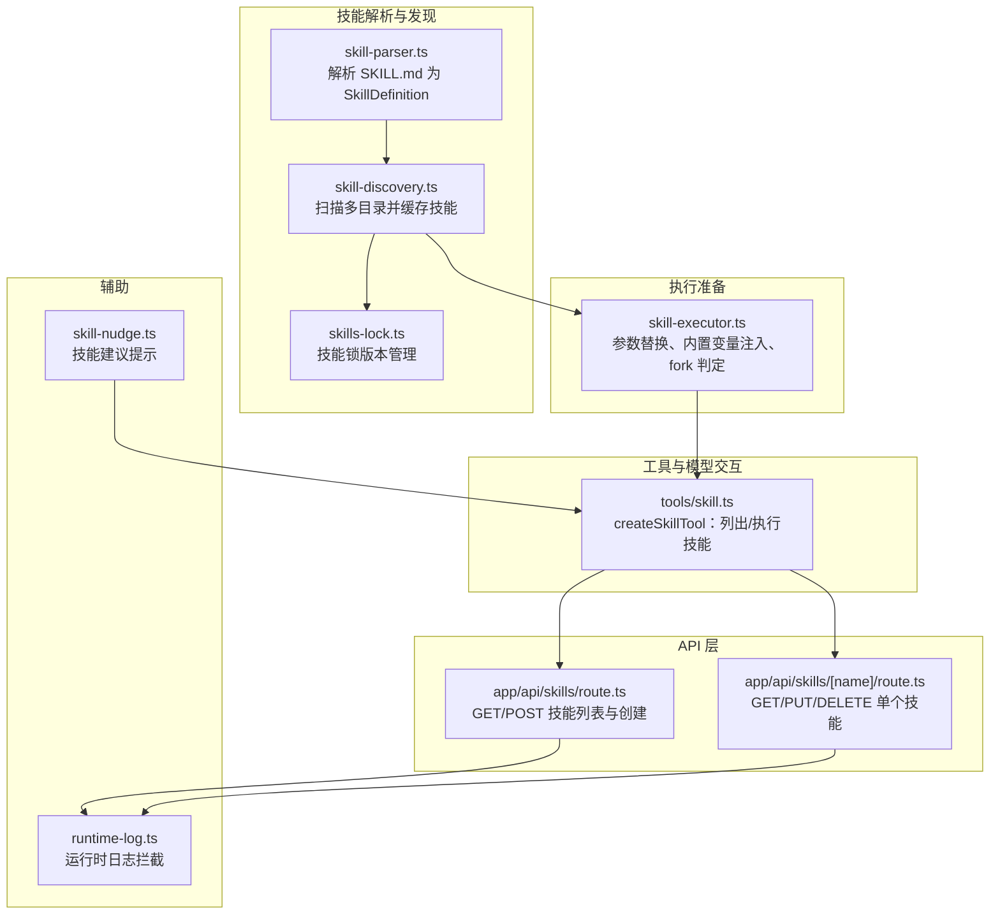
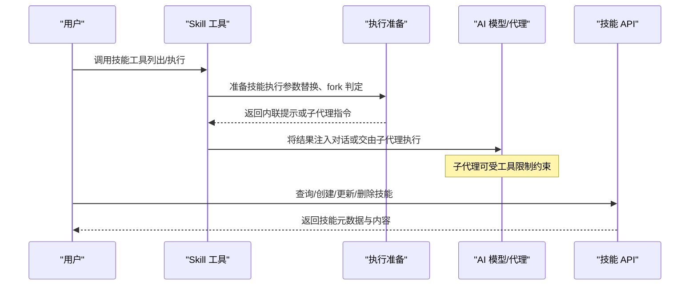
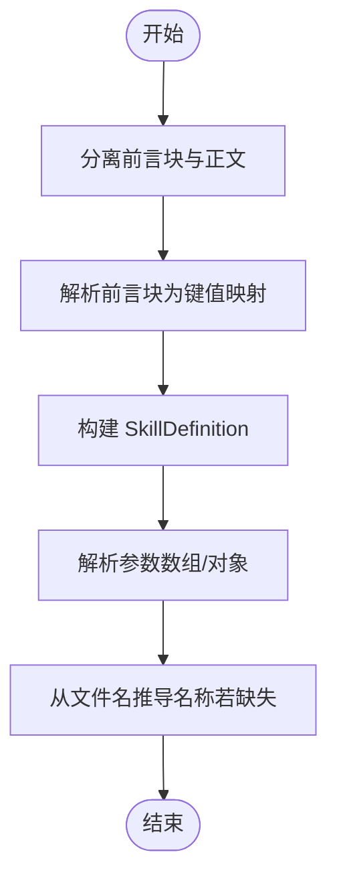
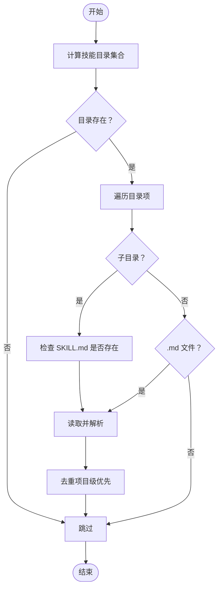
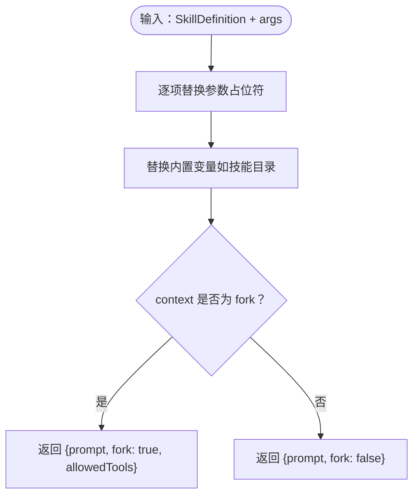
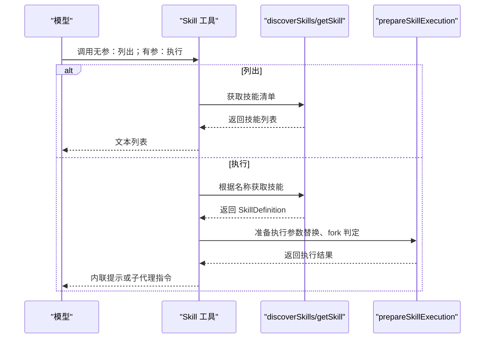
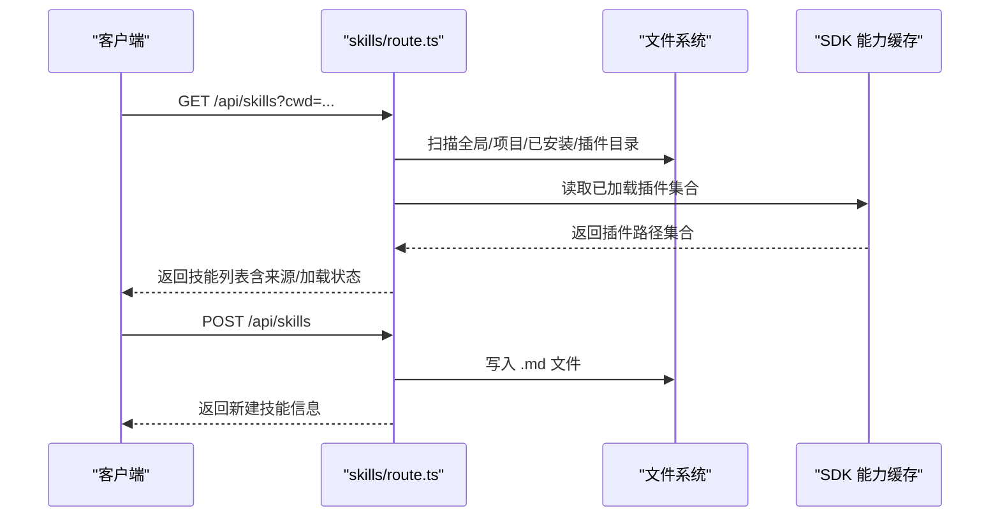
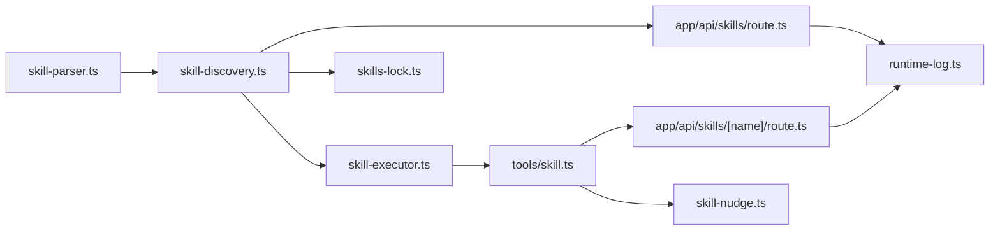
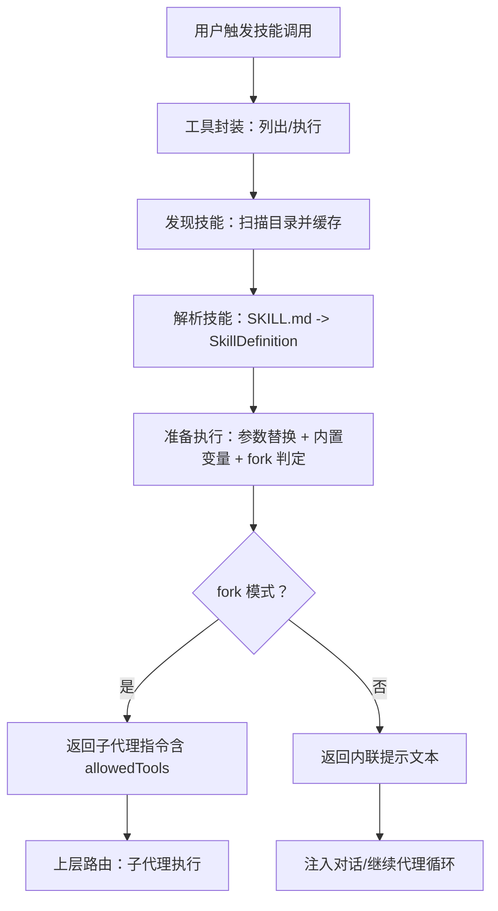

# 技能执行引擎

<cite>
**本文引用的文件**
- [skill-executor.ts](file://src/lib/skill-executor.ts)
- [skill-parser.ts](file://src/lib/skill-parser.ts)
- [skill-discovery.ts](file://src/lib/skill-discovery.ts)
- [tools/skill.ts](file://src/lib/tools/skill.ts)
- [skills-lock.ts](file://src/lib/skills-lock.ts)
- [app/api/skills/route.ts](file://src/app/api/skills/route.ts)
- [app/api/skills/[name]/route.ts](file://src/app/api/skills/[name]/route.ts)
- [runtime-log.ts](file://src/lib/runtime-log.ts)
- [skill-nudge.ts](file://src/lib/skill-nudge.ts)
- [__tests__/unit/skill-kind.test.ts](file://src/__tests__/unit/skill-kind.test.ts)
- [__tests__/e2e/skills.spec.ts](file://src/__tests__/e2e/skills.spec.ts)
</cite>

## 目录
1. [简介](#简介)
2. [项目结构](#项目结构)
3. [核心组件](#核心组件)
4. [架构总览](#架构总览)
5. [详细组件分析](#详细组件分析)
6. [依赖关系分析](#依赖关系分析)
7. [性能考量](#性能考量)
8. [故障排查指南](#故障排查指南)
9. [结论](#结论)
10. [附录](#附录)

## 简介
本文件系统性阐述 CodePilot 技能执行引擎的设计与实现，覆盖技能解析、发现、执行准备、参数传递、上下文管理、状态跟踪、与 AI 模型交互方式、异步处理与错误恢复、生命周期与资源清理、性能监控与调试技巧等。目标是帮助开发者与使用者全面理解“技能”在系统中的工作流，并提供可操作的实践建议。

## 项目结构
技能执行引擎主要由以下模块构成：
- 技能解析：将 SKILL.md 文件解析为结构化的技能定义。
- 技能发现：扫描多级目录，聚合可用技能并去重缓存。
- 执行准备：对技能进行参数替换、内置变量注入、模式判定（内联/子代理）。
- 工具封装：将技能能力暴露给模型调用（列出技能、执行技能）。
- API 层：提供技能的查询、创建、更新、删除接口。
- 辅助能力：技能锁版本管理、运行时日志拦截、技能建议提示。

**图表来源**
- [skill-parser.ts:1-127](file://src/lib/skill-parser.ts#L1-L127)
- [skill-discovery.ts:1-125](file://src/lib/skill-discovery.ts#L1-L125)
- [skills-lock.ts:1-23](file://src/lib/skills-lock.ts#L1-L23)
- [skill-executor.ts:1-52](file://src/lib/skill-executor.ts#L1-L52)
- [tools/skill.ts:1-62](file://src/lib/tools/skill.ts#L1-L62)
- [app/api/skills/route.ts:1-491](file://src/app/api/skills/route.ts#L1-L491)
- [app/api/skills/[name]/route.ts:1-412](file://src/app/api/skills/[name]/route.ts#L1-L412)
- [runtime-log.ts:1-115](file://src/lib/runtime-log.ts#L1-L115)
- [skill-nudge.ts:1-112](file://src/lib/skill-nudge.ts#L1-L112)

**章节来源**
- [skill-parser.ts:1-127](file://src/lib/skill-parser.ts#L1-L127)
- [skill-discovery.ts:1-125](file://src/lib/skill-discovery.ts#L1-L125)
- [skills-lock.ts:1-23](file://src/lib/skills-lock.ts#L1-L23)
- [skill-executor.ts:1-52](file://src/lib/skill-executor.ts#L1-L52)
- [tools/skill.ts:1-62](file://src/lib/tools/skill.ts#L1-L62)
- [app/api/skills/route.ts:1-491](file://src/app/api/skills/route.ts#L1-L491)
- [app/api/skills/[name]/route.ts:1-412](file://src/app/api/skills/[name]/route.ts#L1-L412)
- [runtime-log.ts:1-115](file://src/lib/runtime-log.ts#L1-L115)
- [skill-nudge.ts:1-112](file://src/lib/skill-nudge.ts#L1-L112)

## 核心组件
- 技能定义与解析
  - 解析 YAML 前言块与正文，提取名称、描述、允许工具、执行上下文、参数、模型/努力级别等语义字段。
- 技能发现与缓存
  - 扫描项目级、用户级、跨代理共享目录，按优先级合并并去重；缓存结果以提升性能。
- 执行准备
  - 参数模板替换、内置变量注入（如技能目录）、fork 模式判定与工具限制透传。
- 工具封装
  - createSkillTool：支持“列出所有技能”和“执行指定技能”，返回内联提示或子代理指令。
- API 层
  - 提供技能列表查询、创建、更新、删除接口，支持来源与冲突处理。
- 运行时日志与建议
  - 运行时日志拦截与脱敏；基于步骤数与工具多样性触发“保存为技能”的建议事件。

**章节来源**
- [skill-parser.ts:9-59](file://src/lib/skill-parser.ts#L9-L59)
- [skill-discovery.ts:36-76](file://src/lib/skill-discovery.ts#L36-L76)
- [skill-executor.ts:25-44](file://src/lib/skill-executor.ts#L25-L44)
- [tools/skill.ts:15-61](file://src/lib/tools/skill.ts#L15-L61)
- [app/api/skills/route.ts:290-422](file://src/app/api/skills/route.ts#L290-L422)
- [app/api/skills/[name]/route.ts:239-411](file://src/app/api/skills/[name]/route.ts#L239-L411)
- [runtime-log.ts:85-115](file://src/lib/runtime-log.ts#L85-L115)
- [skill-nudge.ts:37-111](file://src/lib/skill-nudge.ts#L37-L111)

## 架构总览
技能执行引擎围绕“文件即技能”的理念构建，通过解析、发现、准备、工具化与 API 化四个阶段，将静态的 SKILL.md 转换为可被模型调用与执行的动态能力。

**图表来源**
- [tools/skill.ts:25-59](file://src/lib/tools/skill.ts#L25-L59)
- [skill-executor.ts:25-44](file://src/lib/skill-executor.ts#L25-L44)
- [app/api/skills/route.ts:290-422](file://src/app/api/skills/route.ts#L290-L422)
- [app/api/skills/[name]/route.ts:239-411](file://src/app/api/skills/[name]/route.ts#L239-L411)

## 详细组件分析

### 组件一：技能解析（skill-parser.ts）
- 职责
  - 将 SKILL.md 的 YAML 前言块与正文解析为 SkillDefinition。
  - 支持数组字段解析、参数结构化、文件名推导名称等。
- 关键点
  - 允许工具列表、执行上下文、使用时机、参数列表、模型/努力级别、是否用户可触发等语义字段。
  - 对 frontmatter 的简单 YAML 解析器，兼容布尔值、空值与数组格式。
- 复杂度
  - 解析过程线性于内容长度，时间复杂度 O(n)，空间复杂度 O(n)。

**图表来源**
- [skill-parser.ts:43-127](file://src/lib/skill-parser.ts#L43-L127)

**章节来源**
- [skill-parser.ts:43-127](file://src/lib/skill-parser.ts#L43-L127)

### 组件二：技能发现与缓存（skill-discovery.ts）
- 职责
  - 扫描项目级、用户级、跨代理共享目录，收集 SKILL.md。
  - 去重策略：按名称去重，项目级优先覆盖用户级。
  - 缓存：按工作目录缓存，避免重复扫描。
- 关键点
  - 支持子目录内 SKILL.md 与同级 .md 文件两种形式。
  - 异常安全：忽略不可访问目录与解析失败文件。
- 性能
  - 首次扫描后缓存命中，后续调用 O(1) 返回。

**图表来源**
- [skill-discovery.ts:36-125](file://src/lib/skill-discovery.ts#L36-L125)

**章节来源**
- [skill-discovery.ts:36-125](file://src/lib/skill-discovery.ts#L36-L125)

### 组件三：执行准备（skill-executor.ts）
- 职责
  - 将 SkillDefinition 与用户参数结合，生成可执行的提示文本。
  - 注入内置变量（如技能目录），判定 fork 模式与工具限制。
- 关键点
  - 参数替换支持 $arg 与 ${arg} 两种占位符。
  - 内置变量替换：${CLAUDE_SKILL_DIR} 替换为技能文件所在目录。
  - fork 模式：返回标志与 allowedTools，交由上层路由至子代理执行。

**图表来源**
- [skill-executor.ts:25-51](file://src/lib/skill-executor.ts#L25-L51)

**章节来源**
- [skill-executor.ts:25-51](file://src/lib/skill-executor.ts#L25-L51)

### 组件四：工具封装（tools/skill.ts）
- 职责
  - 将技能能力封装为模型工具：支持列出技能、执行技能。
  - 执行时调用 discoverSkills/getSkill 与 prepareSkillExecution。
  - fork 模式返回特定标记，便于上层路由到子代理工具。
- 关键点
  - 输入 Schema：可选技能名与键值对参数。
  - 输出：内联提示或子代理指令字符串。

**图表来源**
- [tools/skill.ts:15-61](file://src/lib/tools/skill.ts#L15-L61)
- [skill-discovery.ts:36-76](file://src/lib/skill-discovery.ts#L36-L76)
- [skill-executor.ts:25-44](file://src/lib/skill-executor.ts#L25-L44)

**章节来源**
- [tools/skill.ts:15-61](file://src/lib/tools/skill.ts#L15-L61)

### 组件五：API 层（app/api/skills/*.ts）
- 职责
  - GET：聚合全局、项目、已安装、插件与 SDK 命令，去重与冲突解决。
  - POST：创建新技能文件（.md），自动推断描述。
  - 动态路由：GET/PUT/DELETE 单个技能，支持来源选择与冲突检测。
- 关键点
  - 已安装技能去重：同名但内容不同则冲突；相同内容按来源偏好保留。
  - 插件技能标注加载状态，基于 SDK 能力缓存判断。
  - 日志记录：扫描路径与数量，便于诊断。

**图表来源**
- [app/api/skills/route.ts:290-422](file://src/app/api/skills/route.ts#L290-L422)
- [app/api/skills/[name]/route.ts:239-411](file://src/app/api/skills/[name]/route.ts#L239-L411)

**章节来源**
- [app/api/skills/route.ts:290-422](file://src/app/api/skills/route.ts#L290-L422)
- [app/api/skills/[name]/route.ts:239-411](file://src/app/api/skills/[name]/route.ts#L239-L411)

### 组件六：辅助能力
- 技能锁（skills-lock.ts）
  - 读取用户主目录下的技能锁文件，用于版本与技能集合的统一管理。
- 运行时日志（runtime-log.ts）
  - 拦截 console.error/warn，脱敏并环形缓冲，便于问题定位。
- 技能建议（skill-nudge.ts）
  - 基于步骤数与工具多样性阈值触发“保存为技能”的建议事件，支持 SSE 状态事件。

**章节来源**
- [skills-lock.ts:8-22](file://src/lib/skills-lock.ts#L8-L22)
- [runtime-log.ts:85-115](file://src/lib/runtime-log.ts#L85-L115)
- [skill-nudge.ts:37-111](file://src/lib/skill-nudge.ts#L37-L111)

## 依赖关系分析
- 模块耦合
  - skill-parser 与 skill-discovery：前者负责结构化，后者负责聚合与缓存。
  - skill-executor 依赖 skill-parser 的结构化输出。
  - tools/skill 依赖 discovery 与 executor，作为模型工具入口。
  - API 层依赖 discovery 与文件系统，同时依赖 SDK 能力缓存。
- 外部依赖
  - 文件系统读写、会话与 SDK 能力缓存（按需加载）。
- 循环依赖
  - 当前设计未见循环依赖，模块职责清晰。

**图表来源**
- [skill-parser.ts:1-127](file://src/lib/skill-parser.ts#L1-L127)
- [skill-discovery.ts:1-125](file://src/lib/skill-discovery.ts#L1-L125)
- [skill-executor.ts:1-52](file://src/lib/skill-executor.ts#L1-L52)
- [tools/skill.ts:1-62](file://src/lib/tools/skill.ts#L1-L62)
- [app/api/skills/route.ts:1-491](file://src/app/api/skills/route.ts#L1-L491)
- [app/api/skills/[name]/route.ts:1-412](file://src/app/api/skills/[name]/route.ts#L1-L412)
- [runtime-log.ts:1-115](file://src/lib/runtime-log.ts#L1-L115)
- [skills-lock.ts:1-23](file://src/lib/skills-lock.ts#L1-L23)
- [skill-nudge.ts:1-112](file://src/lib/skill-nudge.ts#L1-L112)

**章节来源**
- [skill-parser.ts:1-127](file://src/lib/skill-parser.ts#L1-L127)
- [skill-discovery.ts:1-125](file://src/lib/skill-discovery.ts#L1-L125)
- [skill-executor.ts:1-52](file://src/lib/skill-executor.ts#L1-L52)
- [tools/skill.ts:1-62](file://src/lib/tools/skill.ts#L1-L62)
- [app/api/skills/route.ts:1-491](file://src/app/api/skills/route.ts#L1-L491)
- [app/api/skills/[name]/route.ts:1-412](file://src/app/api/skills/[name]/route.ts#L1-L412)
- [runtime-log.ts:1-115](file://src/lib/runtime-log.ts#L1-L115)
- [skills-lock.ts:1-23](file://src/lib/skills-lock.ts#L1-L23)
- [skill-nudge.ts:1-112](file://src/lib/skill-nudge.ts#L1-L112)

## 性能考量
- 缓存策略
  - 发现模块按工作目录缓存技能列表，减少重复扫描。
- I/O 优化
  - 扫描与读取采用同步 API，建议在高并发场景下引入异步读取与并发限制。
- 去重与冲突
  - 已安装技能按内容哈希去重，避免冗余；同名不同内容时返回冲突，便于前端引导修复。
- 日志与诊断
  - 运行时日志环形缓冲，避免内存膨胀；脱敏规则降低敏感信息泄露风险。

[本节为通用性能讨论，不直接分析具体文件]

## 故障排查指南
- 技能未显示或找不到
  - 检查技能文件命名与位置：支持子目录内 SKILL.md 与同级 .md。
  - 确认项目级优先覆盖用户级；确认缓存是否失效（调用缓存失效函数或重启进程）。
- fork 模式未生效
  - 确认技能定义的执行上下文为 fork；确保上层逻辑识别子代理指令并正确路由。
- 参数替换无效
  - 检查参数键名是否匹配；确认占位符格式（$arg 或 ${arg}）。
- API 创建/更新失败
  - 检查文件权限与路径；确认名称合法性；查看冲突（同名不同内容）。
- 运行时错误定位
  - 启用运行时日志拦截，查看最近日志条目；注意脱敏后的信息。

**章节来源**
- [skill-discovery.ts:36-76](file://src/lib/skill-discovery.ts#L36-L76)
- [skill-executor.ts:25-44](file://src/lib/skill-executor.ts#L25-L44)
- [app/api/skills/route.ts:424-490](file://src/app/api/skills/route.ts#L424-L490)
- [app/api/skills/[name]/route.ts:306-367](file://src/app/api/skills/[name]/route.ts#L306-L367)
- [runtime-log.ts:85-115](file://src/lib/runtime-log.ts#L85-L115)

## 结论
CodePilot 技能执行引擎以“文件即技能”为核心，通过解析、发现、准备、工具化与 API 化形成闭环。其设计强调可组合性与可扩展性：既可通过模型工具直接调用，也可经由 API 管理与持久化。配合缓存、去重与冲突处理，引擎在可用性与性能之间取得平衡。建议在生产环境中结合异步 I/O、超时控制与资源清理策略，进一步增强稳定性与可观测性。

[本节为总结，不直接分析具体文件]

## 附录

### 技能执行流程图（代码级）

**图表来源**
- [tools/skill.ts:25-59](file://src/lib/tools/skill.ts#L25-L59)
- [skill-discovery.ts:36-76](file://src/lib/skill-discovery.ts#L36-L76)
- [skill-parser.ts:43-59](file://src/lib/skill-parser.ts#L43-L59)
- [skill-executor.ts:25-44](file://src/lib/skill-executor.ts#L25-L44)

### 技能类型与展示行为（单元测试参考）
- agent_skill：发送技能名与用户上下文，不展开 SKILL.md 内容。
- slash_command：发送 “/{command} {context}” 格式。
- sdk_command：与 slash_command 行为一致。
- codepilot_command：无上下文时展开预设提示，有上下文时追加用户输入。

**章节来源**
- [__tests__/unit/skill-kind.test.ts:139-289](file://src/__tests__/unit/skill-kind.test.ts#L139-L289)

### 端到端测试要点（E2E）
- 技能编辑器导航与可见性验证。
- 技能列表渲染、搜索与清空。
- 创建、编辑、预览、保存与删除流程的 UI 行为。

**章节来源**
- [__tests__/e2e/skills.spec.ts:25-213](file://src/__tests__/e2e/skills.spec.ts#L25-L213)