# 技能管理与维护

<cite>
**本文引用的文件**
- [SkillsManager.tsx](file://src/components/skills/./SkillsManager.tsx)
- [SkillEditor.tsx](file://src/components/skills/./SkillEditor.tsx)
- [MarketplaceBrowser.tsx](file://src/components/skills/./MarketplaceBrowser.tsx)
- [SkillListItem.tsx](file://src/components/skills/./SkillListItem.tsx)
- [CreateSkillDialog.tsx](file://src/components/skills/./CreateSkillDialog.tsx)
- [InstallProgressDialog.tsx](file://src/components/skills/./InstallProgressDialog.tsx)
- [skill-discovery.ts](file://src/lib/./skill-discovery.ts)
- [skill-parser.ts](file://src/lib/./skill-parser.ts)
- [skill-executor.ts](file://src/lib/./skill-executor.ts)
- [skills 路由（GET/POST）](file://src/app/api/skills/./route.ts)
- [市场安装路由](file://src/app/api/skills/marketplace/install/./route.ts)
- [市场卸载路由](file://src/app/api/skills/marketplace/remove/./route.ts)
- [技能单元测试](file://src/__tests__/unit/skill-kind.test.ts)
- [技能 E2E 测试](file://src/__tests__/e2e/skills.spec.ts)
</cite>

## 目录
1. [简介](#简介)
2. [项目结构](#项目结构)
3. [核心组件](#核心组件)
4. [架构总览](#架构总览)
5. [详细组件分析](#详细组件分析)
6. [依赖关系分析](#依赖关系分析)
7. [性能考量](#性能考量)
8. [故障排除指南](#故障排除指南)
9. [结论](#结论)
10. [附录](#附录)

## 简介
本文件面向 CodePilot 的“技能管理与维护”系统，围绕技能的安装、卸载、启用/禁用、删除、配置管理、参数调整、权限控制、备份与恢复、批量操作、导入导出、故障排除、更新机制、版本回滚与兼容性检查等主题，提供从前端界面到后端 API、再到本地文件系统与外部 CLI 工具的全链路说明与可视化图示。

## 项目结构
技能管理涉及三层：
- 前端 UI：技能浏览器、编辑器、市场浏览、安装进度对话框、新建技能对话框等。
- 后端 API：技能清单聚合、创建/保存/删除、市场安装/卸载、搜索等。
- 运行时与本地存储：技能发现与解析、执行准备、文件系统目录布局。

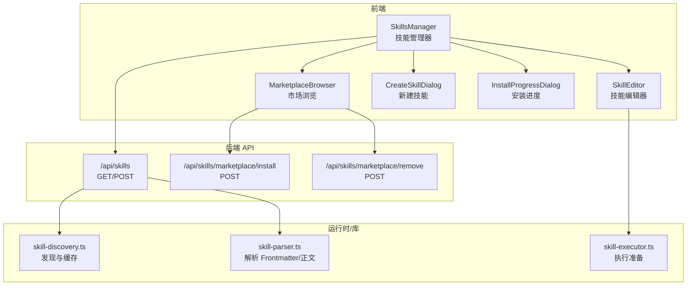

**图表来源**
- [SkillsManager.tsx:1-348](file://src/components/skills/./SkillsManager.tsx#L1-L348)
- [SkillEditor.tsx:1-235](file://src/components/skills/./SkillEditor.tsx#L1-L235)
- [MarketplaceBrowser.tsx:1-141](file://src/components/skills/./MarketplaceBrowser.tsx#L1-L141)
- [CreateSkillDialog.tsx:1-206](file://src/components/skills/./CreateSkillDialog.tsx#L1-L206)
- [InstallProgressDialog.tsx:1-179](file://src/components/skills/./InstallProgressDialog.tsx#L1-L179)
- [skills 路由（GET/POST）:1-491](file://src/app/api/skills/./route.ts#L1-L491)
- [市场安装路由:1-77](file://src/app/api/skills/marketplace/install/./route.ts#L1-L77)
- [市场卸载路由:1-77](file://src/app/api/skills/marketplace/remove/./route.ts#L1-L77)
- [skill-discovery.ts:1-125](file://src/lib/./skill-discovery.ts#L1-L125)
- [skill-parser.ts:1-127](file://src/lib/./skill-parser.ts#L1-L127)
- [skill-executor.ts:1-52](file://src/lib/./skill-executor.ts#L1-L52)

**章节来源**
- [SkillsManager.tsx:1-348](file://src/components/skills/./SkillsManager.tsx#L1-L348)
- [MarketplaceBrowser.tsx:1-141](file://src/components/skills/./MarketplaceBrowser.tsx#L1-L141)
- [skills 路由（GET/POST）:1-491](file://src/app/api/skills/./route.ts#L1-L491)

## 核心组件
- 技能管理器（SkillsManager）
  - 负责加载技能清单、过滤搜索、切换视图（本地/市场）、创建新技能、保存/删除技能、构建 API URL。
- 技能编辑器（SkillEditor）
  - 支持编辑/预览/分屏三种视图；保存草稿、删除确认；显示文件路径与来源标签。
- 市场浏览（MarketplaceBrowser）
  - 搜索市场技能、展示卡片、查看详情、触发安装/卸载流程并刷新状态。
- 新建技能对话框（CreateSkillDialog）
  - 输入名称、选择作用域（项目/全局）、模板选择；校验名称合法性；调用后端创建接口。
- 安装进度对话框（InstallProgressDialog）
  - 通过 SSE 接收安装/卸载输出流，支持取消；成功后回调刷新。
- 技能发现与解析（skill-discovery.ts / skill-parser.ts）
  - 发现多级目录中的 SKILL.md 或 .md 文件，解析 YAML Frontmatter，去重与优先级处理。
- 技能执行准备（skill-executor.ts）
  - 参数替换、内置变量替换、上下文模式（内联/派生子代理）、工具限制。

**章节来源**
- [SkillsManager.tsx:1-348](file://src/components/skills/./SkillsManager.tsx#L1-L348)
- [SkillEditor.tsx:1-235](file://src/components/skills/./SkillEditor.tsx#L1-L235)
- [MarketplaceBrowser.tsx:1-141](file://src/components/skills/./MarketplaceBrowser.tsx#L1-L141)
- [CreateSkillDialog.tsx:1-206](file://src/components/skills/./CreateSkillDialog.tsx#L1-L206)
- [InstallProgressDialog.tsx:1-179](file://src/components/skills/./InstallProgressDialog.tsx#L1-L179)
- [skill-discovery.ts:1-125](file://src/lib/./skill-discovery.ts#L1-L125)
- [skill-parser.ts:1-127](file://src/lib/./skill-parser.ts#L1-L127)
- [skill-executor.ts:1-52](file://src/lib/./skill-executor.ts#L1-L52)

## 架构总览
技能管理的端到端流程包括：前端发起请求 -> 后端扫描与聚合 -> 返回技能清单 -> 前端渲染与交互 -> 可选调用外部 CLI 完成市场安装/卸载。

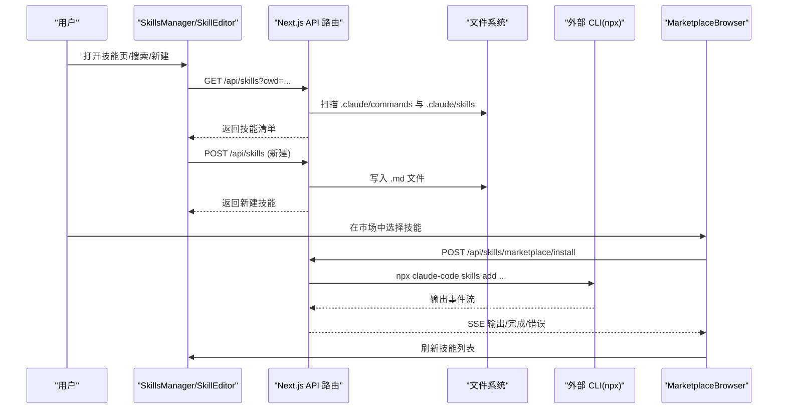

**图表来源**
- [skills 路由（GET/POST）:290-422](file://src/app/api/skills/./route.ts#L290-L422)
- [市场安装路由:1-77](file://src/app/api/skills/marketplace/install/./route.ts#L1-L77)
- [SkillsManager.tsx:30-65](file://src/components/skills/./SkillsManager.tsx#L30-L65)
- [MarketplaceBrowser.tsx:24-66](file://src/components/skills/./MarketplaceBrowser.tsx#L24-L66)

## 详细组件分析

### 组件一：技能管理器（SkillsManager）
职责与行为
- 加载技能：调用 /api/skills，支持 cwd 查询参数；过滤掉 source 为 project 的条目（项目级技能在其他入口管理）。
- 搜索与分类：按名称/描述过滤；按 source 分类（global/installed/plugin）。
- 新建技能：POST /api/skills，支持项目或全局作用域。
- 编辑/保存/删除：PUT 更新内容，DELETE 删除；更新本地列表与选中项。
- 构建 URL：根据 installedSource 与 cwd 动态拼接查询参数。

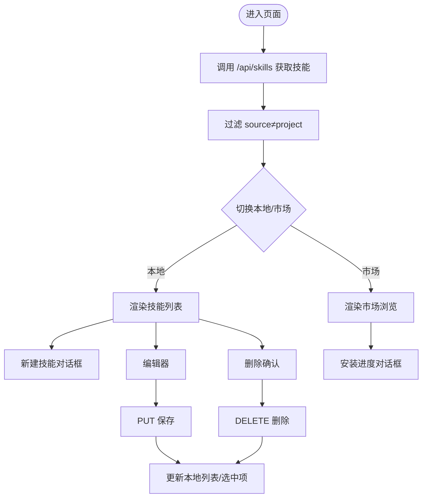

**图表来源**
- [SkillsManager.tsx:30-131](file://src/components/skills/./SkillsManager.tsx#L30-L131)

**章节来源**
- [SkillsManager.tsx:1-348](file://src/components/skills/./SkillsManager.tsx#L1-L348)

### 组件二：技能编辑器（SkillEditor）
职责与行为
- 视图模式：编辑/预览/分屏；保存按钮状态与提示。
- 内容变更检测：dirty 标记；自动保存快捷键透传。
- 删除策略：二次确认，三秒内可撤销。
- 文件路径与来源徽标：显示 filePath 与 source 类型。

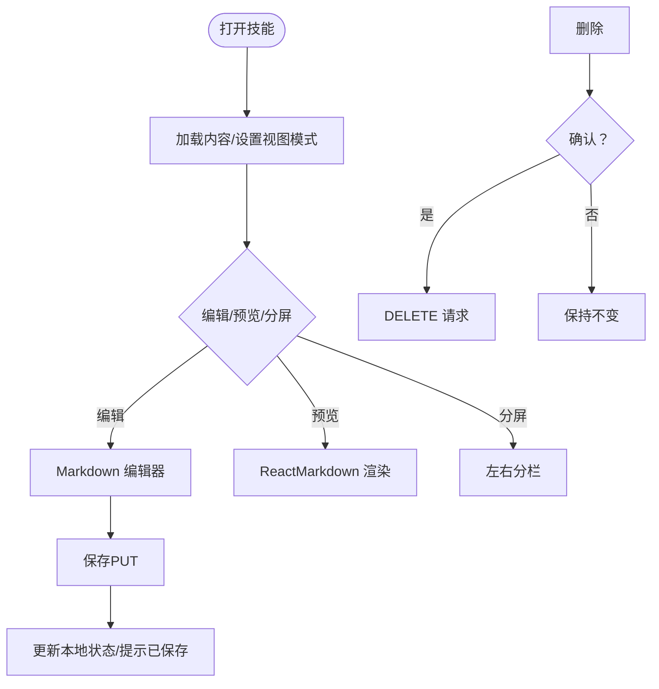

**图表来源**
- [SkillEditor.tsx:36-81](file://src/components/skills/./SkillEditor.tsx#L36-L81)

**章节来源**
- [SkillEditor.tsx:1-235](file://src/components/skills/./SkillEditor.tsx#L1-L235)

### 组件三：市场浏览（MarketplaceBrowser）
职责与行为
- 搜索：防抖 300ms，GET /api/skills/marketplace/search?q=...&limit=20。
- 结果展示：卡片列表与详情面板联动。
- 安装/卸载：调用 /api/skills/marketplace/install 或 remove，SSE 实时输出。
- 刷新：安装完成后重新搜索并回调父组件刷新本地技能列表。

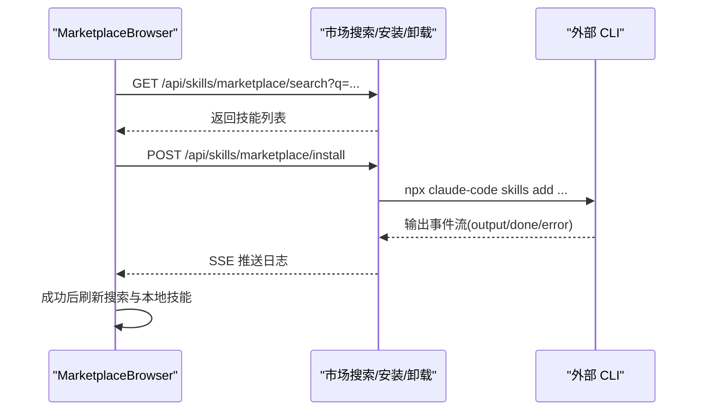

**图表来源**
- [MarketplaceBrowser.tsx:24-66](file://src/components/skills/./MarketplaceBrowser.tsx#L24-L66)
- [市场安装路由:1-77](file://src/app/api/skills/marketplace/install/./route.ts#L1-L77)

**章节来源**
- [MarketplaceBrowser.tsx:1-141](file://src/components/skills/./MarketplaceBrowser.tsx#L1-L141)
- [市场安装路由:1-77](file://src/app/api/skills/marketplace/install/./route.ts#L1-L77)
- [市场卸载路由:1-77](file://src/app/api/skills/marketplace/remove/./route.ts#L1-L77)

### 组件四：新建技能对话框（CreateSkillDialog）
职责与行为
- 名称校验：非空、仅允许字母数字下划线连字符。
- 作用域选择：项目（.claude/commands）或全局（~/.claude/commands）。
- 模板选择：空白、提交助手、代码评审等。
- 创建流程：调用 POST /api/skills，成功后清空表单并关闭。

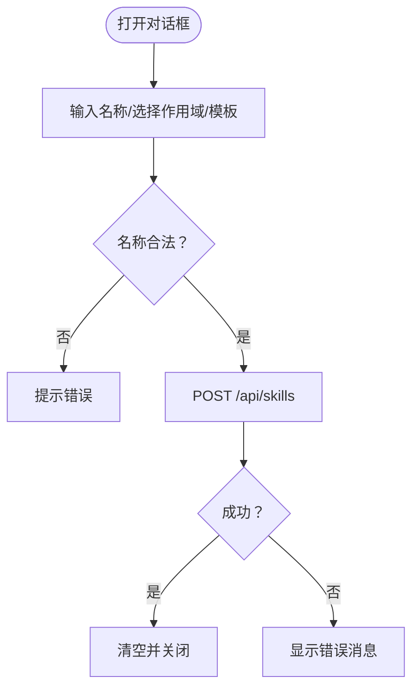

**图表来源**
- [CreateSkillDialog.tsx:68-93](file://src/components/skills/./CreateSkillDialog.tsx#L68-L93)

**章节来源**
- [CreateSkillDialog.tsx:1-206](file://src/components/skills/./CreateSkillDialog.tsx#L1-L206)

### 组件五：安装进度对话框（InstallProgressDialog）
职责与行为
- SSE 接收：安装/卸载过程通过事件流输出，支持 done/error。
- 用户交互：运行中可取消；成功后回调完成。
- 日志滚动：自动滚动到底部，便于观察进度。

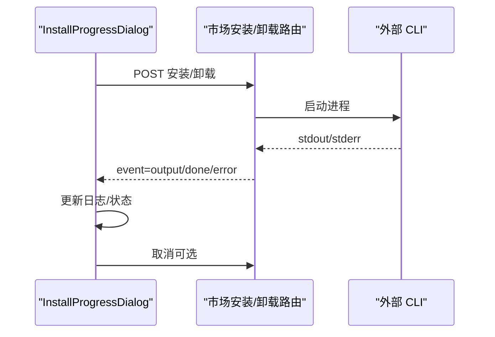

**图表来源**
- [InstallProgressDialog.tsx:40-122](file://src/components/skills/./InstallProgressDialog.tsx#L40-L122)
- [市场安装路由:21-60](file://src/app/api/skills/marketplace/install/./route.ts#L21-L60)
- [市场卸载路由:21-60](file://src/app/api/skills/marketplace/remove/./route.ts#L21-L60)

**章节来源**
- [InstallProgressDialog.tsx:1-179](file://src/components/skills/./InstallProgressDialog.tsx#L1-L179)

### 组件六：技能发现与解析（skill-discovery.ts / skill-parser.ts）
职责与行为
- 发现：扫描项目级与用户级命令与技能目录，支持 .claude/commands 与 .claude/skills，以及 ~/.agents/skills。
- 解析：提取 YAML Frontmatter（name/description/allowed-tools/when_to_use/context/arguments/model/effort/user-invocable），正文作为技能提示体。
- 去重与优先级：项目级覆盖用户级；同名技能按首次出现保留。

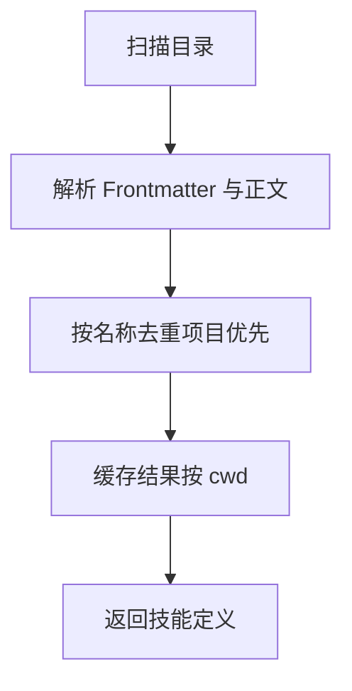

**图表来源**
- [skill-discovery.ts:36-76](file://src/lib/./skill-discovery.ts#L36-L76)
- [skill-parser.ts:43-59](file://src/lib/./skill-parser.ts#L43-L59)

**章节来源**
- [skill-discovery.ts:1-125](file://src/lib/./skill-discovery.ts#L1-L125)
- [skill-parser.ts:1-127](file://src/lib/./skill-parser.ts#L1-L127)

### 组件七：技能执行准备（skill-executor.ts）
职责与行为
- 参数替换：对 $arg 与 ${arg} 进行替换；内置变量替换（如 CLAUDE_SKILL_DIR）。
- 上下文模式：inline 注入对话；fork 启动子代理。
- 工具限制：若定义 allowed-tools，则在 fork 模式下生效。

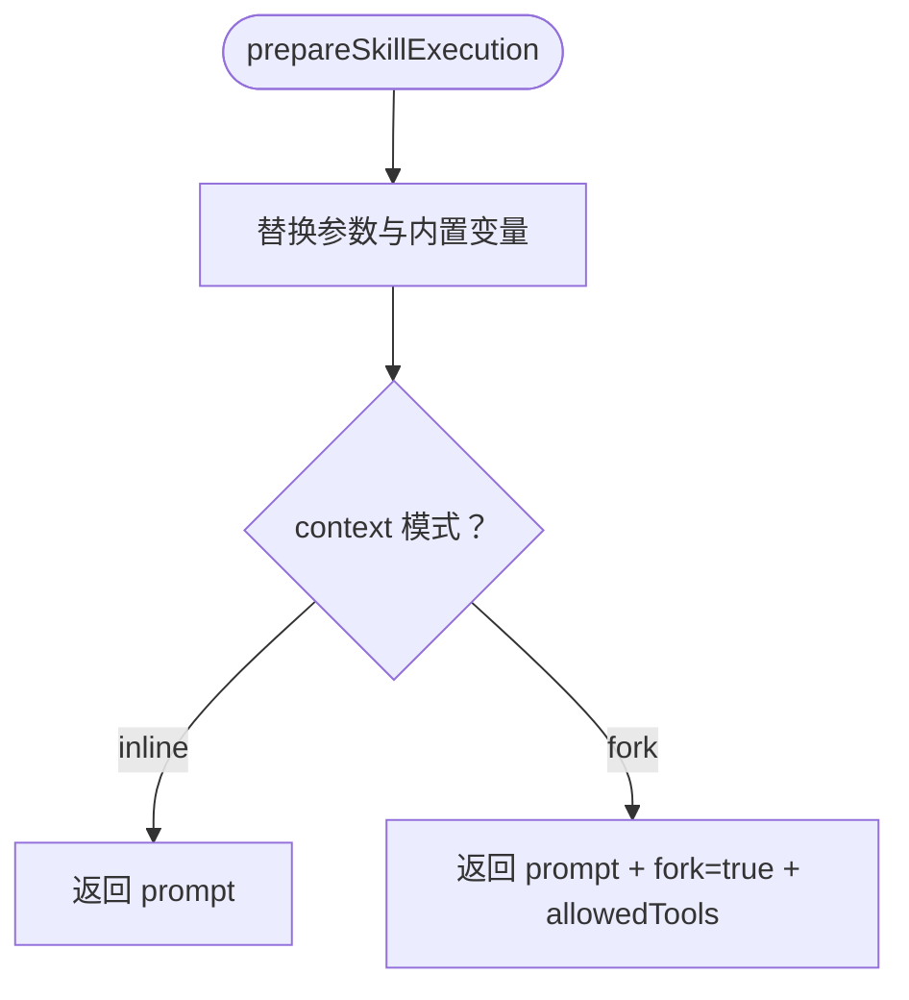

**图表来源**
- [skill-executor.ts:25-44](file://src/lib/./skill-executor.ts#L25-L44)

**章节来源**
- [skill-executor.ts:1-52](file://src/lib/./skill-executor.ts#L1-L52)

## 依赖关系分析
- 前端组件依赖
  - SkillsManager 依赖 SkillEditor、MarketplaceBrowser、CreateSkillDialog、InstallProgressDialog。
  - MarketplaceBrowser 依赖技能市场搜索与安装/卸载 API。
- 后端 API 依赖
  - /api/skills 依赖 skill-discovery.ts 与 skill-parser.ts 进行扫描与解析。
  - 市场安装/卸载依赖外部 CLI（npx claude-code skills add/remove）。
- 运行时依赖
  - skill-executor.ts 用于运行时准备执行上下文。

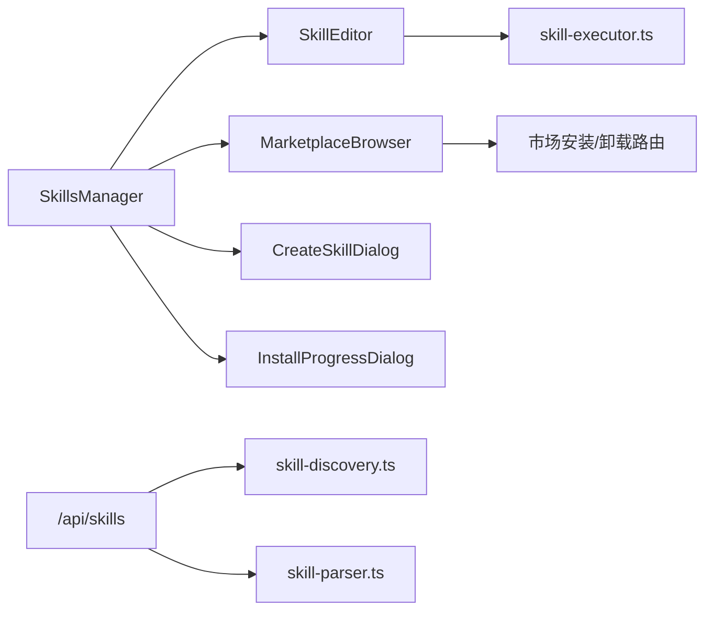

**图表来源**
- [SkillsManager.tsx:1-348](file://src/components/skills/./SkillsManager.tsx#L1-L348)
- [MarketplaceBrowser.tsx:1-141](file://src/components/skills/./MarketplaceBrowser.tsx#L1-L141)
- [skills 路由（GET/POST）:1-491](file://src/app/api/skills/./route.ts#L1-L491)
- [skill-discovery.ts:1-125](file://src/lib/./skill-discovery.ts#L1-L125)
- [skill-parser.ts:1-127](file://src/lib/./skill-parser.ts#L1-L127)
- [skill-executor.ts:1-52](file://src/lib/./skill-executor.ts#L1-L52)

**章节来源**
- [SkillsManager.tsx:1-348](file://src/components/skills/./SkillsManager.tsx#L1-L348)
- [MarketplaceBrowser.tsx:1-141](file://src/components/skills/./MarketplaceBrowser.tsx#L1-L141)
- [skills 路由（GET/POST）:1-491](file://src/app/api/skills/./route.ts#L1-L491)

## 性能考量
- 技能发现缓存：按工作目录缓存发现结果，减少重复扫描与解析成本。
- 前端渲染优化：列表按 source 分组，避免不必要的重渲染；编辑器懒加载 Markdown 编辑器。
- 搜索防抖：市场搜索 300ms 防抖，降低网络请求频率。
- SSE 流式输出：安装/卸载采用事件流，边执行边反馈，提升感知性能。
- 大文件与长列表：建议在项目级与全局目录中合理组织技能，避免单目录过大导致扫描耗时。

[本节为通用指导，不直接分析具体文件]

## 故障排除指南
常见问题与定位
- 技能未显示
  - 检查是否位于受支持的目录（.claude/commands、.claude/skills、~/.claude/commands、~/.claude/skills、~/.agents/skills）。
  - 确认 Frontmatter 是否正确，名称与描述是否可解析。
- 新建失败
  - 名称非法或已存在会返回 4xx/409；检查 CreateSkillDialog 的校验与错误提示。
- 安装/卸载无响应
  - 查看 InstallProgressDialog 的日志与状态；确认外部 CLI 是否可用（npx claude-code）。
- 保存失败
  - 检查 SkillEditor 的保存按钮状态与错误提示；确认后端 PUT 接口返回。
- 权限与来源
  - 全局技能写入 ~/.claude/commands；项目技能写入当前项目 .claude/commands；插件技能来自插件目录。

定位手段
- 前端：查看控制台与网络面板，确认请求与响应。
- 后端：查看 /api/skills 的日志输出（包含扫描目录与计数）。
- 外部 CLI：确认 npx claude-code skills add/remove 命令可用且有足够权限。

**章节来源**
- [SkillsManager.tsx:30-131](file://src/components/skills/./SkillsManager.tsx#L30-L131)
- [SkillEditor.tsx:53-81](file://src/components/skills/./SkillEditor.tsx#L53-L81)
- [CreateSkillDialog.tsx:68-93](file://src/components/skills/./CreateSkillDialog.tsx#L68-L93)
- [InstallProgressDialog.tsx:40-122](file://src/components/skills/./InstallProgressDialog.tsx#L40-L122)
- [skills 路由（GET/POST）:290-422](file://src/app/api/skills/./route.ts#L290-L422)

## 结论
CodePilot 的技能管理与维护体系以“前端 UI + 后端 API + 本地文件系统 + 外部 CLI”协同工作：前端负责交互与展示，后端负责扫描、解析与聚合，本地文件系统承载技能内容，外部 CLI 提供市场安装/卸载能力。通过缓存、防抖、SSE 等手段保障性能与体验；通过严格的校验与错误提示提升可靠性。后续可在“批量操作、导入导出、备份恢复、权限控制细化、版本回滚与兼容性检查”等方面进一步完善。

[本节为总结，不直接分析具体文件]

## 附录

### 技能生命周期与操作矩阵
- 安装
  - 市场安装：POST /api/skills/marketplace/install -> 外部 CLI -> SSE 输出 -> 刷新本地列表
  - 卸载：POST /api/skills/marketplace/remove -> 外部 CLI -> SSE 输出
- 启用/禁用
  - 当前实现以文件存在与否体现“启用/禁用”，可通过移动/重命名文件实现逻辑禁用；建议在 UI 中增加显式的启用/禁用开关并在后端增加对应接口。
- 删除
  - DELETE /api/skills/{name}（由 SkillsManager 调用）；MarketplaceBrowser 支持卸载后刷新。
- 配置管理与参数调整
  - 通过编辑器修改 SKILL.md 内容；Frontmatter 字段用于控制 allowed-tools、context、arguments、model、effort 等。
- 权限控制
  - 作用域区分：项目（仅当前项目可见）与全局（全用户可见）。建议在 UI 中增加来源标识与权限提示。
- 备份与恢复
  - 建议定期备份 ~/.claude/commands 与 ~/.claude/skills 以及项目 .claude/skills 目录；卸载前可先复制备份。
- 批量操作
  - 当前未提供批量导入/导出 UI；可通过文件系统批量移动/复制 SKILL.md 实现。
- 导入/导出
  - 建议新增 /api/skills/export 与 /api/skills/import 接口，支持 ZIP 包含 Frontmatter 与正文。
- 更新机制、版本回滚与兼容性检查
  - 建议在市场安装时记录版本元数据；提供回滚到上一个版本的能力；在解析阶段进行兼容性检查（如新字段不被旧版本识别时给出警告）。

**章节来源**
- [MarketplaceBrowser.tsx:62-66](file://src/components/skills/./MarketplaceBrowser.tsx#L62-L66)
- [skills 路由（GET/POST）:424-490](file://src/app/api/skills/./route.ts#L424-L490)
- [skill-parser.ts:43-59](file://src/lib/./skill-parser.ts#L43-L59)

### 数据模型与类型
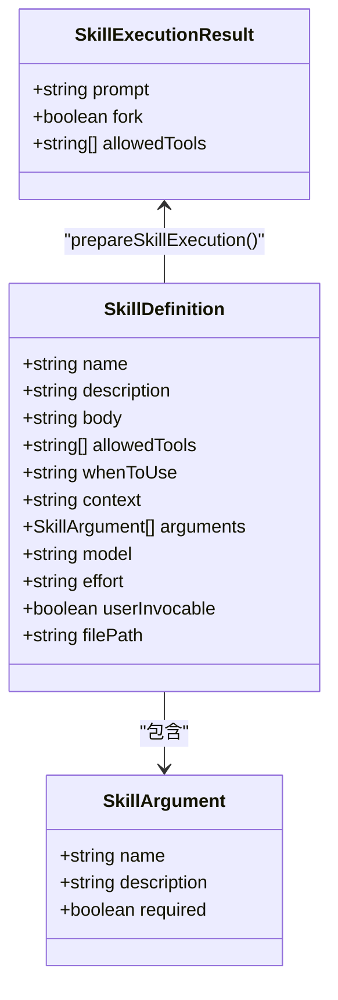

**图表来源**
- [skill-parser.ts:9-38](file://src/lib/./skill-parser.ts#L9-L38)
- [skill-executor.ts:10-17](file://src/lib/./skill-executor.ts#L10-L17)

**章节来源**
- [skill-parser.ts:1-127](file://src/lib/./skill-parser.ts#L1-L127)
- [skill-executor.ts:1-52](file://src/lib/./skill-executor.ts#L1-L52)

### 测试参考
- 单元测试：验证技能类型与行为（例如技能种类、提示词处理等）。
- 端到端测试：覆盖技能创建、编辑、保存、删除、市场安装/卸载等主流程。

**章节来源**
- [技能单元测试](file://src/__tests__/unit/skill-kind.test.ts)
- [技能 E2E 测试](file://src/__tests__/e2e/skills.spec.ts)