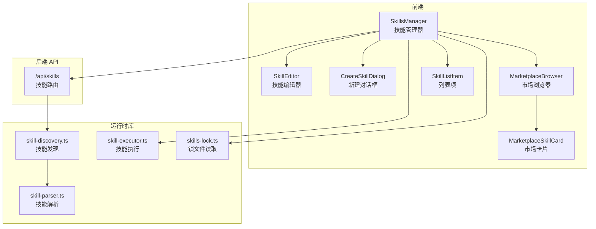
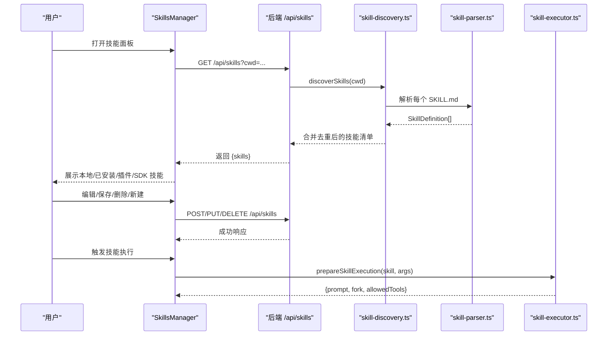
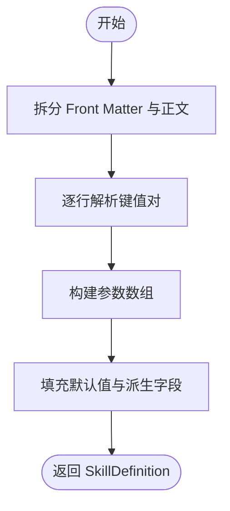
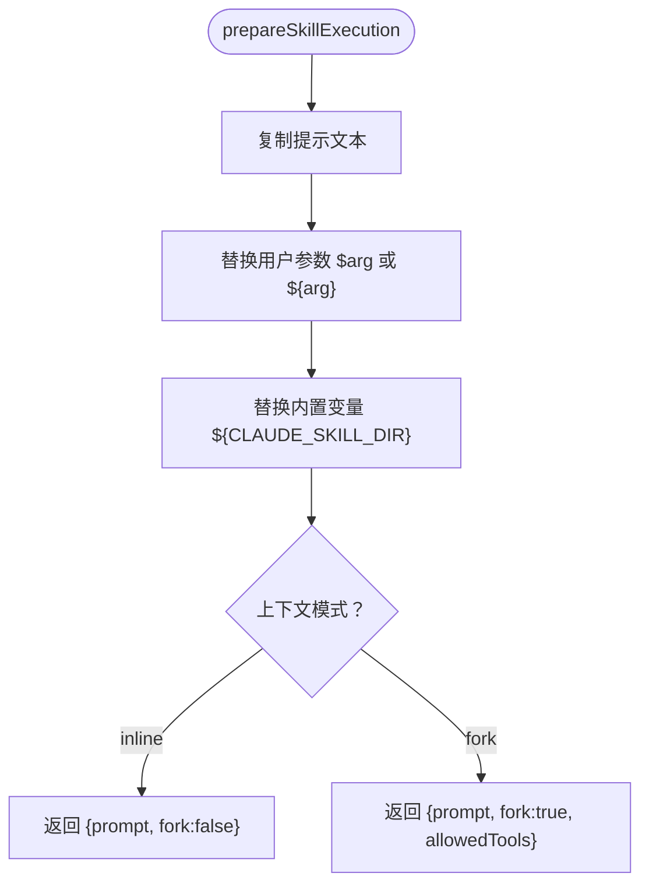
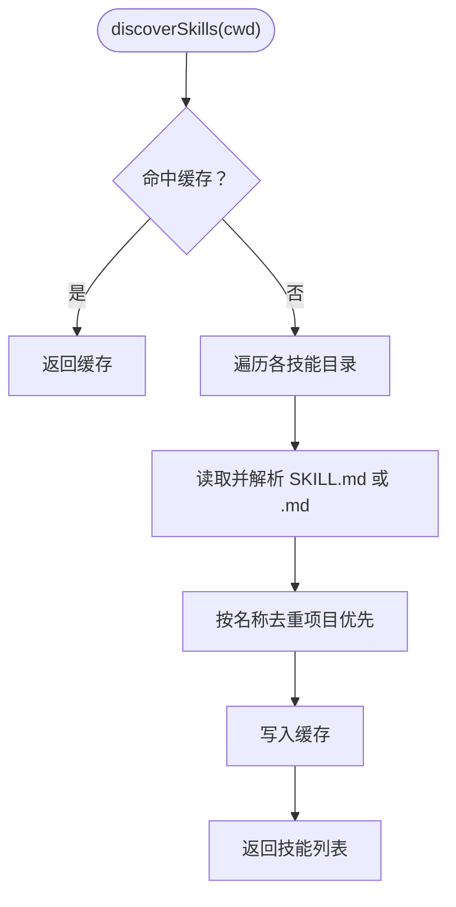
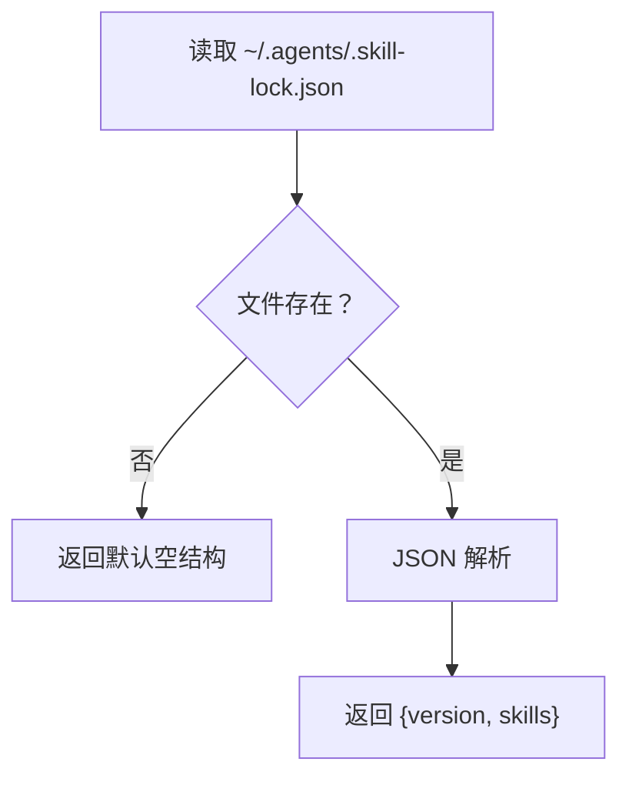
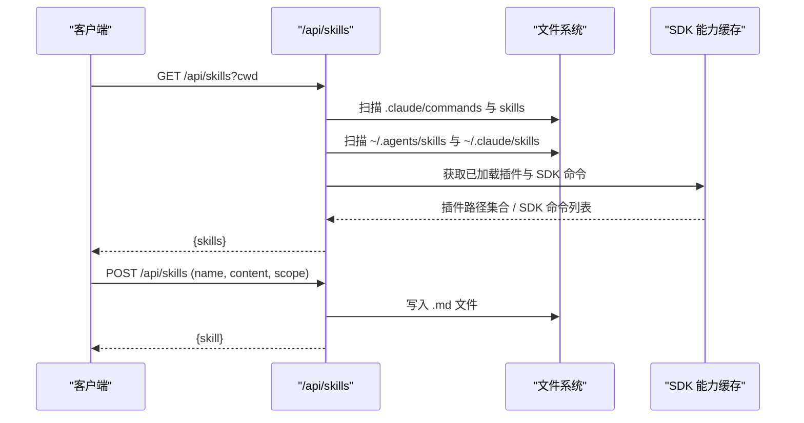
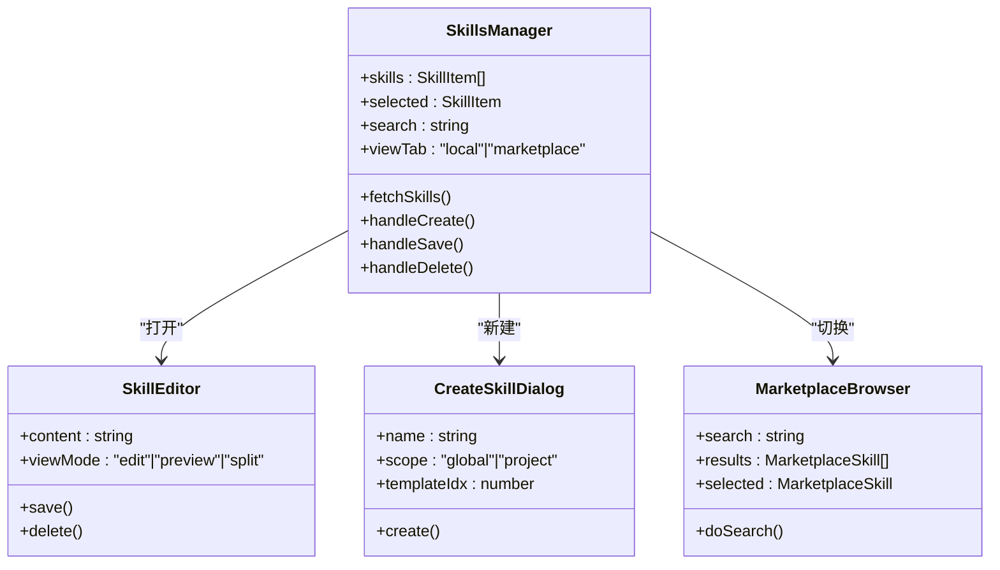
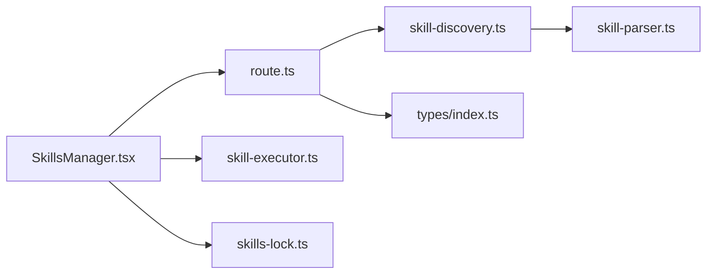
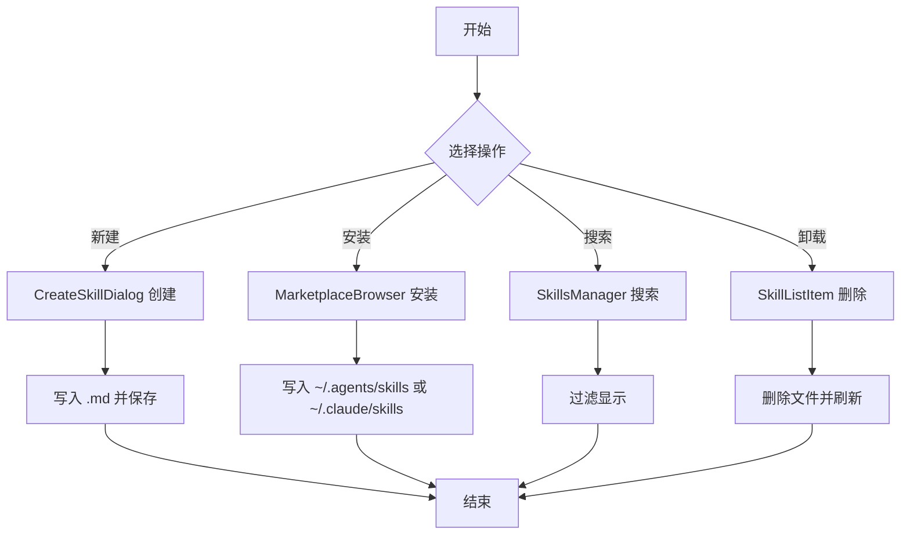

# 技能系统

<cite>
**本文引用的文件**
- [skill-parser.ts](file://src/lib/skill-parser.ts)
- [skill-executor.ts](file://src/lib/skill-executor.ts)
- [skill-discovery.ts](file://src/lib/skill-discovery.ts)
- [skills-lock.ts](file://src/lib/skills-lock.ts)
- [route.ts](file://src/app/api/skills/route.ts)
- [SkillsManager.tsx](file://src/components/skills/ScriptsManager.tsx)
- [SkillEditor.tsx](file://src/components/skills/SkillEditor.tsx)
- [CreateSkillDialog.tsx](file://src/components/skills/CreateSkillDialog.tsx)
- [MarketplaceBrowser.tsx](file://src/components/skills/MarketplaceBrowser.tsx)
- [MarketplaceSkillCard.tsx](file://src/components/skills/MarketplaceSkillCard.tsx)
- [SkillListItem.tsx](file://src/components/skills/SkillListItem.tsx)
- [index.ts](file://src/types/index.ts)
- [image-generation.md](file://public/skills/image-generation.md)
</cite>

## 目录
1. [简介](#简介)
2. [项目结构](#项目结构)
3. [核心组件](#核心组件)
4. [架构总览](#架构总览)
5. [详细组件分析](#详细组件分析)
6. [依赖关系分析](#依赖关系分析)
7. [性能考量](#性能考量)
8. [故障排查指南](#故障排查指南)
9. [结论](#结论)
10. [附录](#附录)

## 简介
本文件系统性阐述 CodePilot 的“技能系统”，包括技能概念、类型（自定义技能、项目技能、全局技能）、技能市场（skills.sh）的使用方法；深入解析技能解析器、执行器与依赖管理机制；提供技能开发教程、模板使用与调试方法，并给出技能安装、卸载、搜索的完整流程说明。

## 项目结构
技能系统围绕“前端 UI + 后端 API + 运行时解析/执行”三层协作：
- 前端组件负责技能的浏览、编辑、创建与市场浏览
- 后端 API 提供技能清单、增删改、市场搜索等能力
- 运行时库负责技能文件解析、发现与执行准备

图表来源
- [SkillsManager.tsx:20-348](file://src/components/skills/ScriptsManager.tsx#L20-L348)
- [SkillEditor.tsx:36-235](file://src/components/skills/SkillEditor.tsx#L36-L235)
- [CreateSkillDialog.tsx:56-206](file://src/components/skills/CreateSkillDialog.tsx#L56-L206)
- [MarketplaceBrowser.tsx:15-141](file://src/components/skills/MarketplaceBrowser.tsx#L15-L141)
- [MarketplaceSkillCard.tsx:15-59](file://src/components/skills/MarketplaceSkillCard.tsx#L15-L59)
- [SkillListItem.tsx:30-94](file://src/components/skills/SkillListItem.tsx#L30-L94)
- [route.ts:290-422](file://src/app/api/skills/route.ts#L290-L422)
- [skill-discovery.ts:36-125](file://src/lib/skill-discovery.ts#L36-L125)
- [skill-parser.ts:43-127](file://src/lib/skill-parser.ts#L43-L127)
- [skill-executor.ts:25-52](file://src/lib/skill-executor.ts#L25-L52)
- [skills-lock.ts:8-23](file://src/lib/skills-lock.ts#L8-L23)

章节来源
- [SkillsManager.tsx:20-348](file://src/components/skills/ScriptsManager.tsx#L20-L348)
- [route.ts:290-422](file://src/app/api/skills/route.ts#L290-L422)

## 核心组件
- 技能解析器：将 SKILL.md 的 YAML Front Matter 与正文解析为结构化定义，提取名称、描述、允许工具、上下文模式、参数、模型/努力等级等元信息。
- 技能执行器：根据技能定义与用户输入参数，生成可注入对话或子代理执行的提示文本，并处理内置变量替换。
- 技能发现器：扫描项目级、用户级、跨代理、插件安装目录，合并去重并缓存结果。
- 技能锁文件：读取 ~/.agents/.skill-lock.json，用于记录已安装技能的来源与版本信息。
- 技能管理 UI：提供本地技能列表、编辑器、新建对话框、市场浏览与搜索。
- 技能 API：提供技能清单、创建、保存、删除、市场搜索等接口。

章节来源
- [skill-parser.ts:9-59](file://src/lib/skill-parser.ts#L9-L59)
- [skill-executor.ts:25-44](file://src/lib/skill-executor.ts#L25-L44)
- [skill-discovery.ts:36-76](file://src/lib/skill-discovery.ts#L36-L76)
- [skills-lock.ts:8-23](file://src/lib/skills-lock.ts#L8-L23)
- [SkillsManager.tsx:20-348](file://src/components/skills/ScriptsManager.tsx#L20-L348)
- [route.ts:290-422](file://src/app/api/skills/route.ts#L290-L422)

## 架构总览
技能系统的关键交互流程如下：

图表来源
- [route.ts:290-422](file://src/app/api/skills/route.ts#L290-L422)
- [skill-discovery.ts:36-125](file://src/lib/skill-discovery.ts#L36-L125)
- [skill-parser.ts:43-127](file://src/lib/skill-parser.ts#L43-L127)
- [skill-executor.ts:25-44](file://src/lib/skill-executor.ts#L25-L44)
- [SkillsManager.tsx:30-131](file://src/components/skills/ScriptsManager.tsx#L30-L131)

## 详细组件分析

### 技能解析器（skill-parser.ts）
职责
- 将 SKILL.md 内容拆分为 YAML Front Matter 与正文
- 解析 name/description/allowed-tools/context/arguments/model/effort/user-invocable 等字段
- 支持数组、布尔、空值与字符串等类型推断
- 从文件名推导默认技能名

复杂度与性能
- 时间复杂度 O(n)，n 为 Front Matter 行数
- 空间复杂度 O(n)，存储解析后的键值对与参数数组

错误处理
- 未找到 Front Matter 时，正文作为纯文本处理
- 参数解析忽略无效条目，保证健壮性

图表来源
- [skill-parser.ts:43-127](file://src/lib/skill-parser.ts#L43-L127)

章节来源
- [skill-parser.ts:9-127](file://src/lib/skill-parser.ts#L9-L127)

### 技能执行器（skill-executor.ts）
职责
- 对内联模式：进行参数替换与内置变量替换，返回可直接注入对话的提示文本
- 对子代理模式：返回 fork 标志与受限工具列表
- 内置变量：如 CLAUDE_SKILL_DIR，指向 SKILL.md 所在目录

复杂度与性能
- 时间复杂度 O(k·m)，k 为参数数量，m 为提示文本中的占位符出现次数
- 空间复杂度 O(m)，复制提示文本

图表来源
- [skill-executor.ts:25-52](file://src/lib/skill-executor.ts#L25-L52)

章节来源
- [skill-executor.ts:10-52](file://src/lib/skill-executor.ts#L10-L52)

### 技能发现器（skill-discovery.ts）
职责
- 扫描多个目录：项目级 .claude/skills 与 .claude/commands、用户级 ~/.claude/skills/commands、~/.agents/skills
- 递归扫描子目录中的 SKILL.md，或扫描 .md 文件作为斜杠命令
- 去重策略：项目级优先于用户级；同名技能仅保留一个
- 缓存：按工作目录缓存，变更后失效

复杂度与性能
- 时间复杂度 O(N)（N 为扫描到的文件数），去重使用集合 O(1) 查找
- 空间复杂度 O(N)

图表来源
- [skill-discovery.ts:36-125](file://src/lib/skill-discovery.ts#L36-L125)

章节来源
- [skill-discovery.ts:18-125](file://src/lib/skill-discovery.ts#L18-L125)

### 技能锁文件（skills-lock.ts）
职责
- 读取 ~/.agents/.skill-lock.json，解析版本与技能条目
- 提供默认空结构，避免异常

图表来源
- [skills-lock.ts:8-23](file://src/lib/skills-lock.ts#L8-L23)

章节来源
- [skills-lock.ts:1-23](file://src/lib/skills-lock.ts#L1-L23)

### 技能 API（/api/skills）
职责
- GET：聚合全局、项目、项目级技能、已安装、插件与 SDK 命令，去重并返回
- POST：在指定作用域（全局/项目）创建新技能 .md 文件
- PUT/DELETE：更新或删除技能（通过构建 URL 参数 source/cwd）

关键实现要点
- 目录扫描与内容哈希计算用于已安装技能的去重与来源标注
- 插件技能加载状态基于 SDK 能力缓存进行交叉引用
- SDK 命令动态注入，避免与本地重复

图表来源
- [route.ts:290-422](file://src/app/api/skills/route.ts#L290-L422)

章节来源
- [route.ts:290-491](file://src/app/api/skills/route.ts#L290-L491)

### 技能管理 UI（SkillsManager、SkillEditor、CreateSkillDialog、MarketplaceBrowser）
职责
- SkillsManager：拉取技能清单、搜索过滤、切换视图（本地/市场）、打开编辑器
- SkillEditor：编辑/预览/分屏查看、保存、删除
- CreateSkillDialog：新建技能（选择作用域与模板）
- MarketplaceBrowser：搜索 skills.sh，展示安装状态，安装完成刷新

图表来源
- [SkillsManager.tsx:20-348](file://src/components/skills/ScriptsManager.tsx#L20-L348)
- [SkillEditor.tsx:36-235](file://src/components/skills/SkillEditor.tsx#L36-L235)
- [CreateSkillDialog.tsx:56-206](file://src/components/skills/CreateSkillDialog.tsx#L56-L206)
- [MarketplaceBrowser.tsx:15-141](file://src/components/skills/MarketplaceBrowser.tsx#L15-L141)

章节来源
- [SkillsManager.tsx:20-348](file://src/components/skills/ScriptsManager.tsx#L20-L348)
- [SkillEditor.tsx:36-235](file://src/components/skills/SkillEditor.tsx#L36-L235)
- [CreateSkillDialog.tsx:56-206](file://src/components/skills/CreateSkillDialog.tsx#L56-L206)
- [MarketplaceBrowser.tsx:15-141](file://src/components/skills/MarketplaceBrowser.tsx#L15-L141)

### 技能类型与来源
- 类型：agent_skill（技能）、slash_command（斜杠命令）、sdk_command（SDK 命令）、codepilot_command（平台命令）
- 来源：global（全局）、project（项目）、plugin（插件）、installed（已安装）、sdk（SDK）
- 列表项属性：name、description、content、source、installedSource、filePath

章节来源
- [index.ts:68-98](file://src/types/index.ts#L68-L98)
- [SkillsManager.tsx:133-141](file://src/components/skills/ScriptsManager.tsx#L133-L141)
- [SkillListItem.tsx:14-21](file://src/components/skills/SkillListItem.tsx#L14-L21)

## 依赖关系分析
- 组件耦合
  - SkillsManager 依赖 API 路由与 UI 子组件
  - API 路由依赖 skill-discovery 与 SDK 能力缓存
  - skill-discovery 依赖 skill-parser
  - skill-executor 依赖 skill-parser 的定义
- 外部依赖
  - 文件系统读写（FS）
  - SDK 能力缓存（用于插件与 SDK 命令识别）
  - 技能锁文件（~/.agents/.skill-lock.json）

图表来源
- [SkillsManager.tsx:20-348](file://src/components/skills/ScriptsManager.tsx#L20-L348)
- [route.ts:290-422](file://src/app/api/skills/route.ts#L290-L422)
- [skill-discovery.ts:36-125](file://src/lib/skill-discovery.ts#L36-L125)
- [skill-parser.ts:43-127](file://src/lib/skill-parser.ts#L43-L127)
- [skill-executor.ts:25-44](file://src/lib/skill-executor.ts#L25-L44)
- [skills-lock.ts:8-23](file://src/lib/skills-lock.ts#L8-L23)
- [index.ts:387-395](file://src/types/index.ts#L387-L395)

章节来源
- [route.ts:351-383](file://src/app/api/skills/route.ts#L351-L383)
- [index.ts:387-410](file://src/types/index.ts#L387-L410)

## 性能考量
- 发现阶段
  - 使用缓存避免重复扫描；当技能文件变化时应调用失效逻辑
  - 去重使用 Set/Map，时间复杂度低
- 解析阶段
  - Front Matter 解析线性扫描，建议控制 Front Matter 字段数量
- 执行阶段
  - 参数替换为字符串替换，注意大量占位符时的性能影响
- UI 交互
  - 市场搜索采用防抖，避免频繁请求

## 故障排查指南
常见问题与定位
- 技能未显示
  - 检查目录是否存在：项目级 .claude/skills/commands、用户级 ~/.claude/skills/commands、~/.agents/skills
  - 确认 SKILL.md 是否位于子目录且命名正确
  - 清理缓存后重试
- 技能解析失败
  - 检查 Front Matter 格式与字段拼写
  - 确认 allowed-tools、context、arguments 等字段格式
- 执行无效果
  - 检查上下文模式（inline/fork）与 allowed-tools 是否正确
  - 确认内置变量 ${CLAUDE_SKILL_DIR} 是否被替换
- 市场搜索失败
  - 检查网络与 /api/skills/marketplace/search 接口可用性
  - 查看前端错误提示与状态码
- 锁文件异常
  - 检查 ~/.agents/.skill-lock.json 是否为合法 JSON 结构

章节来源
- [skill-discovery.ts:36-68](file://src/lib/skill-discovery.ts#L36-L68)
- [skill-parser.ts:67-100](file://src/lib/skill-parser.ts#L67-L100)
- [skill-executor.ts:32-43](file://src/lib/skill-executor.ts#L32-L43)
- [SkillsManager.tsx:20-47](file://src/components/skills/ScriptsManager.tsx#L20-L47)
- [skills-lock.ts:8-23](file://src/lib/skills-lock.ts#L8-L23)

## 结论
CodePilot 的技能系统以“文件即技能”的理念为核心，结合前端 UI、后端 API 与运行时解析/执行模块，实现了从发现、编辑、安装到执行的完整闭环。通过清晰的类型与来源标识、完善的去重与缓存机制、以及可扩展的市场集成，系统既满足个人开发者快速迭代，也便于团队共享与复用。

## 附录

### 技能概念与类型
- 技能（Skill）：以 SKILL.md 为载体的可执行提示模板，支持参数与工具限制
- 斜杠命令（Slash Command）：以 .md 文件形式存在的命令入口，通常位于 .claude/commands 或 ~/.claude/commands
- SDK 命令：由 SDK 动态注入的命令，无需本地文件
- 类型枚举：agent_skill、slash_command、sdk_command、codepilot_command

章节来源
- [index.ts:68-68](file://src/types/index.ts#L68-L68)
- [route.ts:390-412](file://src/app/api/skills/route.ts#L390-L412)

### 技能市场（skills.sh）使用方法
- 浏览与搜索：在技能面板切换至“市场”，输入关键词搜索
- 安装流程：选择技能后进入详情页，点击安装；安装完成后刷新列表可见“已安装”
- 更新与去重：系统会根据名称与内容哈希进行去重，优先保留最新版本

章节来源
- [MarketplaceBrowser.tsx:15-141](file://src/components/skills/MarketplaceBrowser.tsx#L15-L141)
- [MarketplaceSkillCard.tsx:15-59](file://src/components/skills/MarketplaceSkillCard.tsx#L15-L59)
- [route.ts:330-349](file://src/app/api/skills/route.ts#L330-L349)

### 技能开发教程
- 新建技能
  - 在“我的技能”中点击“新建”，选择作用域（项目/全局）与模板
  - 填写名称与描述，编辑正文与 Front Matter
- 编辑与保存
  - 支持编辑/预览/分屏三种视图；修改后自动保存
- 参数与工具
  - 在 Front Matter 中声明 arguments、allowed-tools、context 等
  - 上下文可选 inline（注入对话）或 fork（子代理）
- 内置变量
  - ${CLAUDE_SKILL_DIR} 可在提示中引用技能所在目录

章节来源
- [CreateSkillDialog.tsx:56-206](file://src/components/skills/CreateSkillDialog.tsx#L56-L206)
- [SkillEditor.tsx:36-235](file://src/components/skills/SkillEditor.tsx#L36-L235)
- [skill-executor.ts:32-43](file://src/lib/skill-executor.ts#L32-L43)
- [image-generation.md:1-62](file://public/skills/image-generation.md#L1-L62)

### 调试方法
- 日志与错误
  - 后端扫描与聚合过程包含日志输出，便于定位目录与权限问题
  - 前端错误统一通过状态码与消息提示反馈
- 缓存与失效
  - 修改技能文件后，确保调用缓存失效逻辑，避免旧结果干扰
- 锁文件
  - 若安装来源异常，检查 ~/.agents/.skill-lock.json 的结构与字段

章节来源
- [route.ts:311-344](file://src/app/api/skills/route.ts#L311-L344)
- [skill-discovery.ts:65-68](file://src/lib/skill-discovery.ts#L65-L68)
- [skills-lock.ts:8-23](file://src/lib/skills-lock.ts#L8-L23)

### 技能安装、卸载、搜索流程
- 安装
  - 本地：在“我的技能”中新建或从市场安装
  - 插件：安装插件后其 commands 目录下的 .md 即成为技能
- 卸载
  - 在技能列表中选择对应技能，确认删除
- 搜索
  - 本地：在“我的技能”中输入关键词
  - 市场：在“市场”标签页输入关键词，查看安装状态

图表来源
- [CreateSkillDialog.tsx:56-206](file://src/components/skills/CreateSkillDialog.tsx#L56-L206)
- [MarketplaceBrowser.tsx:15-141](file://src/components/skills/MarketplaceBrowser.tsx#L15-L141)
- [SkillsManager.tsx:133-137](file://src/components/skills/ScriptsManager.tsx#L133-L137)
- [SkillListItem.tsx:40-50](file://src/components/skills/SkillListItem.tsx#L40-L50)
- [route.ts:424-491](file://src/app/api/skills/route.ts#L424-L491)