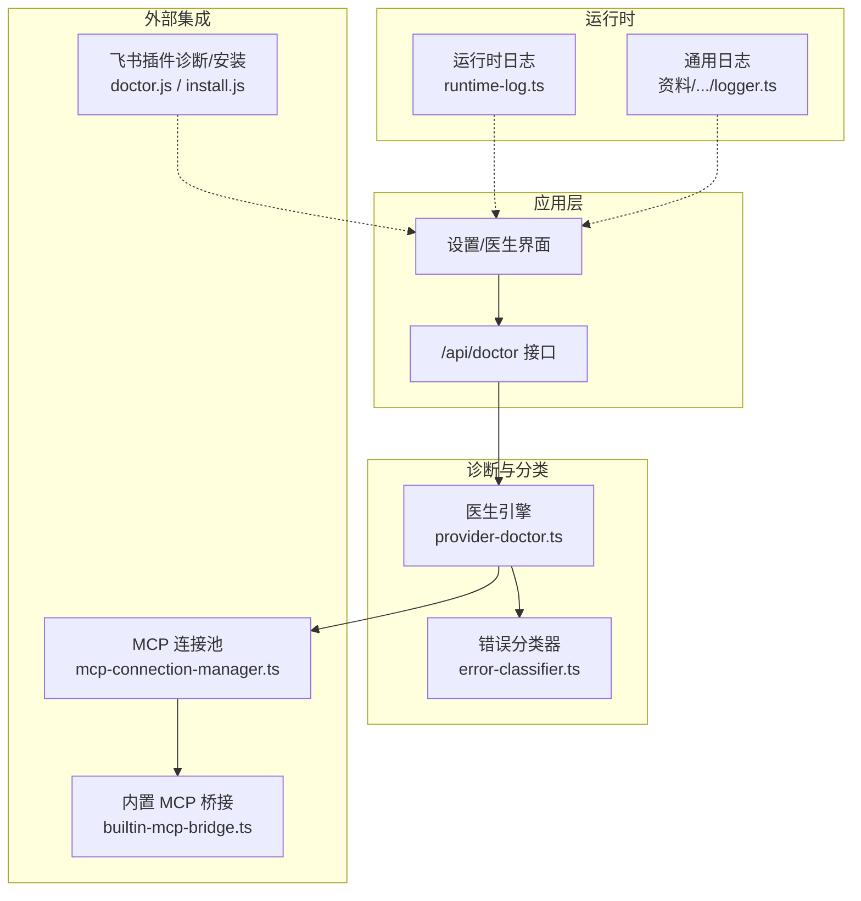
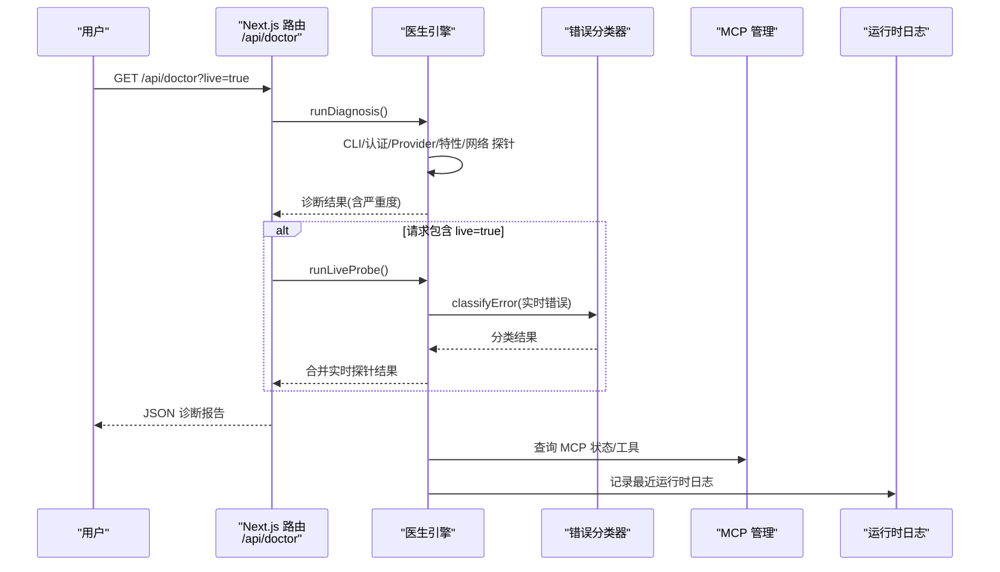
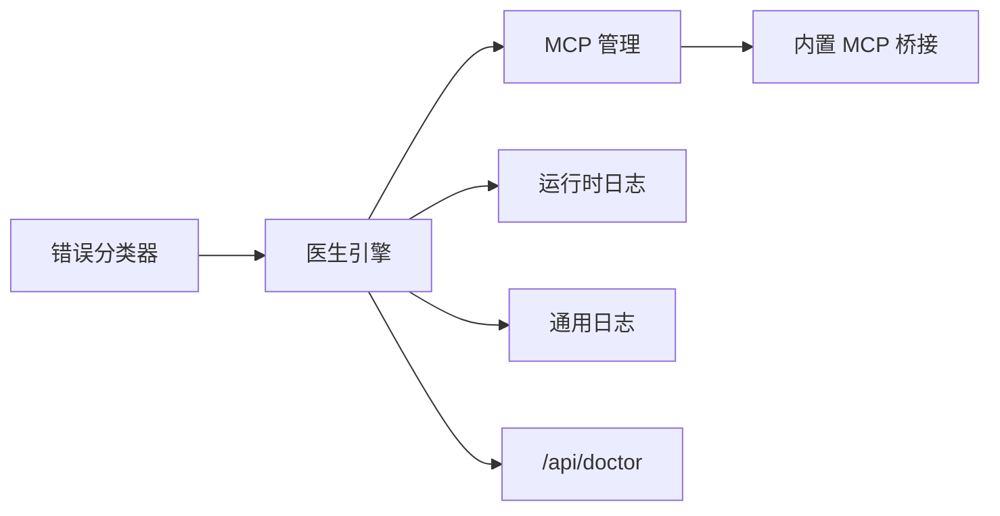

# 故障排除

<cite>
**本文引用的文件**
- [error-classifier.ts](file://src/lib/error-classifier.ts)
- [provider-doctor.ts](file://src/lib/provider-doctor.ts)
- [route.ts](file://src/app/api/doctor/route.ts)
- [mcp-connection-manager.ts](file://src/lib/mcp-connection-manager.ts)
- [builtin-mcp-bridge.ts](file://src/lib/builtin-mcp-bridge.ts)
- [runtime-log.ts](file://src/lib/runtime-log.ts)
- [logger.ts](file://资料/weixin-openclaw-package/package/src/util/logger.ts)
- [session-guard.ts](file://资料/weixin-openclaw-package/package/src/api/session-guard.ts)
- [shared.js](file://资料/feishu-openclaw-plugin/package/src/tools/mcp/shared.js)
- [doctor.js](file://资料/package/dist/commands/doctor.js)
- [install.js](file://资料/package/dist/commands/install.js)
</cite>

## 目录
1. [简介](#简介)
2. [项目结构与定位](#项目结构与定位)
3. [核心组件与职责](#核心组件与职责)
4. [架构总览](#架构总览)
5. [详细故障分类与排障指南](#详细故障分类与排障指南)
6. [依赖关系分析](#依赖关系分析)
7. [性能考量与优化建议](#性能考量与优化建议)
8. [故障排除工具与使用方法](#故障排除工具与使用方法)
9. [结论](#结论)
10. [附录：常见错误代码与含义](#附录常见错误代码与含义)

## 简介
本指南面向使用者与运维人员，系统化梳理 CodePilot 在连接、性能、功能等方面常见问题的诊断与修复路径。内容覆盖网络连接、API 密钥、MCP 服务器连接、桥接通道、会话状态与日志分析等主题，并提供可操作的预防性维护与性能优化建议。

## 项目结构与定位
- 诊断与分类：通过统一的错误分类器与“医生”诊断引擎，对 CLI/Provider/MCP 等多来源错误进行结构化解析与可操作提示。
- 实时运行时日志：拦截控制台输出，形成环形缓冲，便于前端或导出查看最近错误与警告。
- MCP 管理：集中管理 MCP 服务器连接、工具发现与调用，支持 stdio/sse/http 传输。
- 外部桥接与插件：提供第三方渠道（如飞书）的安装与诊断命令，辅助桥接通道健康检查。

图表来源
- [route.ts:1-38](file://src/app/api/doctor/route.ts#L1-L38)
- [provider-doctor.ts:1-800](file://src/lib/provider-doctor.ts#L1-L800)
- [error-classifier.ts:1-522](file://src/lib/error-classifier.ts#L1-L522)
- [runtime-log.ts:1-115](file://src/lib/runtime-log.ts#L1-L115)
- [logger.ts:67-143](file://资料/weixin-openclaw-package/package/src/util/logger.ts#L67-L143)
- [mcp-connection-manager.ts:1-221](file://src/lib/mcp-connection-manager.ts#L1-L221)
- [builtin-mcp-bridge.ts:1-84](file://src/lib/builtin-mcp-bridge.ts#L1-L84)
- [doctor.js:105-172](file://资料/package/dist/commands/doctor.js#L105-L172)
- [install.js:59-98](file://资料/package/dist/commands/install.js#L59-L98)

章节来源
- [route.ts:1-38](file://src/app/api/doctor/route.ts#L1-L38)
- [provider-doctor.ts:1-800](file://src/lib/provider-doctor.ts#L1-L800)

## 核心组件与职责
- 错误分类器：基于模式匹配与错误码，输出用户可读消息、可执行修复动作与是否可重试。
- 医生引擎：对 CLI、认证、Provider、特性兼容、网络与实时运行时进行探针检查，生成整体严重度与修复建议。
- 运行时日志：拦截 console.error/warn，清洗敏感信息后写入环形缓冲，支持导出。
- MCP 管理：连接 MCP 服务器、发现工具、调用工具、状态查询与重连；支持多种传输。
- 通用日志：结构化日志写入本地文件，带时间戳与运行时元数据。
- 会话守卫：在特定错误码下暂停会话一段时间，避免雪崩式重试。
- 飞书插件诊断/安装：自动配置与修复第三方桥接通道。

章节来源
- [error-classifier.ts:55-136](file://src/lib/error-classifier.ts#L55-L136)
- [provider-doctor.ts:39-80](file://src/lib/provider-doctor.ts#L39-L80)
- [runtime-log.ts:7-21](file://src/lib/runtime-log.ts#L7-L21)
- [mcp-connection-manager.ts:15-35](file://src/lib/mcp-connection-manager.ts#L15-L35)
- [logger.ts:67-77](file://资料/weixin-openclaw-package/package/src/util/logger.ts#L67-L77)
- [session-guard.ts:1-58](file://资料/weixin-openclaw-package/package/src/api/session-guard.ts#L1-L58)
- [doctor.js:105-172](file://资料/package/dist/commands/doctor.js#L105-L172)
- [install.js:59-98](file://资料/package/dist/commands/install.js#L59-L98)

## 架构总览

图表来源
- [route.ts:12-27](file://src/app/api/doctor/route.ts#L12-L27)
- [provider-doctor.ts:747-807](file://src/lib/provider-doctor.ts#L747-L807)
- [error-classifier.ts:360-421](file://src/lib/error-classifier.ts#L360-L421)
- [mcp-connection-manager.ts:158-168](file://src/lib/mcp-connection-manager.ts#L158-L168)
- [runtime-log.ts:85-100](file://src/lib/runtime-log.ts#L85-L100)

## 详细故障分类与排障指南

### 一、连接问题（网络/代理/端点）
- 症状
  - 无法访问 Provider 基础地址或官方 API
  - DNS 解析失败、超时、被拒绝
- 诊断要点
  - 使用医生网络探针检查各 Provider 的 origin 是否可达
  - 对环境直连模式与 Provider 模式分别验证
- 常见原因
  - 企业防火墙/代理未放行
  - Base URL 错误或缺少路径
  - 本地 DNS 或 hosts 配置异常
- 修复步骤
  - 核对 Provider 的 base_url 与协议
  - 尝试更换网络或使用代理白名单
  - 使用 HEAD 请求验证端点可用性
- 参考实现
  - 网络探针与 URL 收集逻辑
  - 错误分类中的网络不可达与超时模式

章节来源
- [provider-doctor.ts:612-687](file://src/lib/provider-doctor.ts#L612-L687)
- [error-classifier.ts:266-274](file://src/lib/error-classifier.ts#L266-L274)

### 二、API 密钥与认证问题
- 症状
  - 401/403、鉴权失败、权限不足
  - 环境变量与数据库存储冲突
- 诊断要点
  - 检查环境变量与数据库中存储的密钥
  - 确认解析到的 Provider 是否有可用凭据
  - 检查 Provider 层 auth style 是否与实际一致
- 常见原因
  - 同时设置了 API Key 与 Auth Token，导致样式冲突
  - Provider 未配置密钥或已过期
  - 第三方 Provider 的鉴权头风格不匹配
- 修复步骤
  - 清理冗余环境变量，仅保留一种风格
  - 在设置中补全 Provider 密钥或切换到 OAuth
  - 根据错误提示切换 API Key/Auth Token 风格
- 参考实现
  - 认证探针与解析逻辑
  - 错误分类中的认证相关模式

章节来源
- [provider-doctor.ts:172-307](file://src/lib/provider-doctor.ts#L172-L307)
- [error-classifier.ts:194-219](file://src/lib/error-classifier.ts#L194-L219)

### 三、MCP 服务器连接问题
- 症状
  - MCP 工具不可用、调用报“未连接”
  - 连接失败、无工具列表、传输类型不支持
- 诊断要点
  - 检查 MCP 服务器状态与工具数量
  - 确认传输类型（stdio/sse/http）与配置正确
  - 触发重连或断开重连流程
- 常见原因
  - 服务器进程未启动或崩溃
  - 端口占用、URL 不可达
  - 传输类型与服务端不匹配
- 修复步骤
  - 重启 MCP 服务器
  - 校验命令/URL/参数
  - 切换传输类型或调整端口
- 参考实现
  - 连接池同步、连接/断开、调用工具、状态查询
  - 传输创建与错误处理

章节来源
- [mcp-connection-manager.ts:45-108](file://src/lib/mcp-connection-manager.ts#L45-L108)
- [mcp-connection-manager.ts:173-178](file://src/lib/mcp-connection-manager.ts#L173-L178)
- [mcp-connection-manager.ts:191-220](file://src/lib/mcp-connection-manager.ts#L191-L220)

### 四、桥接通道故障（以飞书为例）
- 症状
  - 飞书机器人无法接收/发送消息
  - App ID/Secret 缺失或不匹配
- 诊断要点
  - 检查配置文件中 channels.feishu 的 appId/appSecret
  - 使用诊断命令自动修复缺失项
- 常见原因
  - 未配置或配置不完整
  - 更换 App ID 后未清理旧 Secret
- 修复步骤
  - 使用诊断命令自动补齐默认值
  - 重新输入正确的 App ID/Secret
- 参考实现
  - 安装命令的默认配置与交互
  - 诊断命令的校验与修复流程

章节来源
- [install.js:66-98](file://资料/package/dist/commands/install.js#L66-L98)
- [doctor.js:105-136](file://资料/package/dist/commands/doctor.js#L105-L136)
- [doctor.js:161-172](file://资料/package/dist/commands/doctor.js#L161-L172)

### 五、会话状态与恢复问题
- 症状
  - 会话恢复失败、会话过期、长时间无响应
- 诊断要点
  - 检查会话暂停状态与剩余时间
  - 观察会话守卫抛出的错误码
- 常见原因
  - 服务端判定会话过期，触发冷却
  - 本地存储的会话 ID 已过期
- 修复步骤
  - 等待冷却结束或手动清理会话
  - 新建对话或重试
- 参考实现
  - 会话暂停/剩余时间/断言逻辑

章节来源
- [session-guard.ts:1-58](file://资料/weixin-openclaw-package/package/src/api/session-guard.ts#L1-L58)

### 六、MCP 工具返回格式异常
- 症状
  - MCP 返回嵌套 JSON-RPC envelope，导致解析错误
- 诊断要点
  - 对返回结果进行递归解包，提取纯 result
- 修复步骤
  - 使用统一解包函数处理返回值
- 参考实现
  - 结果解包与错误提取

章节来源
- [shared.js:43-65](file://资料/feishu-openclaw-plugin/package/src/tools/mcp/shared.js#L43-L65)

### 七、未知错误与崩溃
- 症状
  - 进程退出、无响应、错误信息模糊
- 诊断要点
  - 使用错误分类器进行模式匹配与细化
  - 若为会话相关崩溃，优先考虑会话状态问题
- 修复步骤
  - 根据分类器建议打开设置、重试或新建会话
  - 运行医生实时探针获取更精确的错误上下文
- 参考实现
  - 错误分类与实时探针

章节来源
- [error-classifier.ts:327-421](file://src/lib/error-classifier.ts#L327-L421)
- [provider-doctor.ts:747-807](file://src/lib/provider-doctor.ts#L747-L807)

## 依赖关系分析

图表来源
- [error-classifier.ts:1-522](file://src/lib/error-classifier.ts#L1-L522)
- [provider-doctor.ts:1-800](file://src/lib/provider-doctor.ts#L1-L800)
- [mcp-connection-manager.ts:1-221](file://src/lib/mcp-connection-manager.ts#L1-L221)
- [builtin-mcp-bridge.ts:1-84](file://src/lib/builtin-mcp-bridge.ts#L1-L84)
- [runtime-log.ts:1-115](file://src/lib/runtime-log.ts#L1-L115)
- [logger.ts:67-143](file://资料/weixin-openclaw-package/package/src/util/logger.ts#L67-L143)
- [route.ts:1-38](file://src/app/api/doctor/route.ts#L1-L38)

## 性能考量与优化建议
- 降低医生探针开销
  - 默认仅运行快速静态探针；需要时再开启实时探针
  - 合理设置网络请求超时与并发
- 减少日志噪声
  - 运行时日志启用敏感信息清洗，避免泄露
  - 通用日志按天切分文件，定期清理
- MCP 连接复用
  - 合理复用连接，避免频繁断开重连
  - 选择合适的传输类型（stdio/sse/http），根据场景权衡延迟与稳定性

[本节为通用建议，无需列出章节来源]

## 故障排除工具与使用方法

### 1) 医生接口（/api/doctor）
- 功能
  - 快速诊断：CLI/认证/Provider/特性/网络探针
  - 可选实时探针：最小化 CLI 子进程运行，验证真实可用性
- 使用方式
  - GET /api/doctor：仅静态探针
  - GET /api/doctor?live=true：包含实时探针（约 15 秒）
- 输出
  - 整体严重度、探针明细、修复建议、耗时
- 参考实现
  - 路由与实时探针合并逻辑

章节来源
- [route.ts:12-27](file://src/app/api/doctor/route.ts#L12-L27)
- [provider-doctor.ts:689-707](file://src/lib/provider-doctor.ts#L689-L707)

### 2) 运行时日志（前端/导出）
- 功能
  - 拦截 console.error/warn，清洗敏感信息，保存最近 200 条
  - 提供获取与清空接口，便于导出与排查
- 使用方式
  - 初始化后自动拦截
  - 在 UI 中查看或导出最近日志
- 参考实现
  - 环形缓冲与清洗策略

章节来源
- [runtime-log.ts:85-115](file://src/lib/runtime-log.ts#L85-L115)

### 3) 通用日志（本地文件）
- 功能
  - 结构化 JSON 日志写入本地文件，按日期切分
  - 包含运行时版本、主机名、日志级别等元数据
- 使用方式
  - 查看主日志文件路径，定位错误发生时间线
- 参考实现
  - 日志写入与文件路径解析

章节来源
- [logger.ts:67-143](file://资料/weixin-openclaw-package/package/src/util/logger.ts#L67-L143)

### 4) 飞书插件诊断与安装
- 功能
  - 自动补齐飞书通道配置（appId/appSecret 等）
  - 交互式引导修复缺失项
- 使用方式
  - 执行诊断命令自动修复
  - 安装命令初始化默认配置
- 参考实现
  - 诊断与安装命令逻辑

章节来源
- [doctor.js:105-172](file://资料/package/dist/commands/doctor.js#L105-L172)
- [install.js:66-98](file://资料/package/dist/commands/install.js#L66-L98)

## 结论
通过统一的错误分类与医生诊断体系，结合运行时日志与 MCP 管理能力，CodePilot 能够对连接、认证、MCP、桥接通道与会话状态等问题进行快速定位与修复。建议在日常运维中：
- 定期运行医生静态探针，及时发现配置与网络问题
- 需要时启用实时探针，获取更准确的可用性反馈
- 使用运行时日志与通用日志交叉比对，还原问题现场
- 对第三方桥接通道保持关注，利用诊断/安装命令自动化修复

[本节为总结，无需列出章节来源]

## 附录：常见错误代码与含义
- 会话过期/暂停
  - 错误码：-14
  - 含义：会话暂停（通常为 1 小时），期间禁止请求
  - 处理：等待剩余时间结束或清理会话后重试
- 网络不可达/超时
  - 错误码：ECONNREFUSED/ECONNRESET/ETIMEDOUT/ENOTFOUND
  - 含义：目标主机拒绝/重置/超时/域名不可解析
  - 处理：检查网络、代理、DNS、防火墙与 Provider 基础地址
- 401/403
  - 含义：认证失败/权限不足
  - 处理：核对 API Key/Auth Token、权限范围与提供商策略
- 404
  - 含义：端点不存在
  - 处理：确认 base_url 是否包含正确路径（如 /v1）

章节来源
- [session-guard.ts:5-49](file://资料/weixin-openclaw-package/package/src/api/session-guard.ts#L5-L49)
- [error-classifier.ts:266-283](file://src/lib/error-classifier.ts#L266-L283)