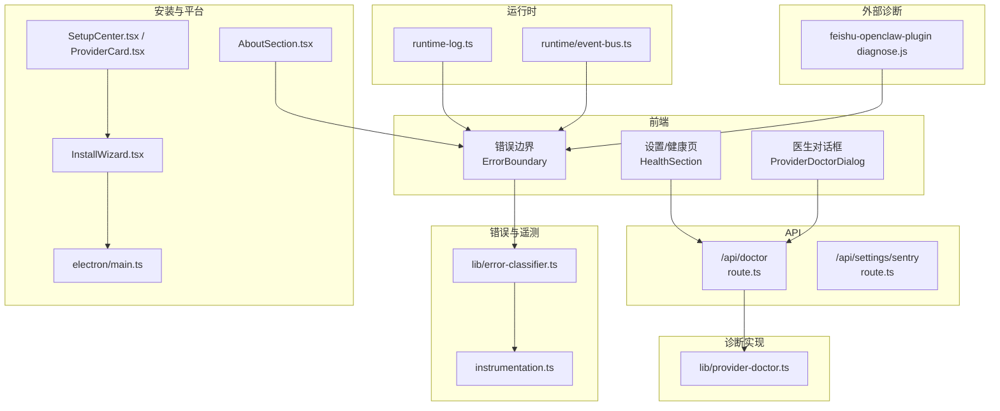
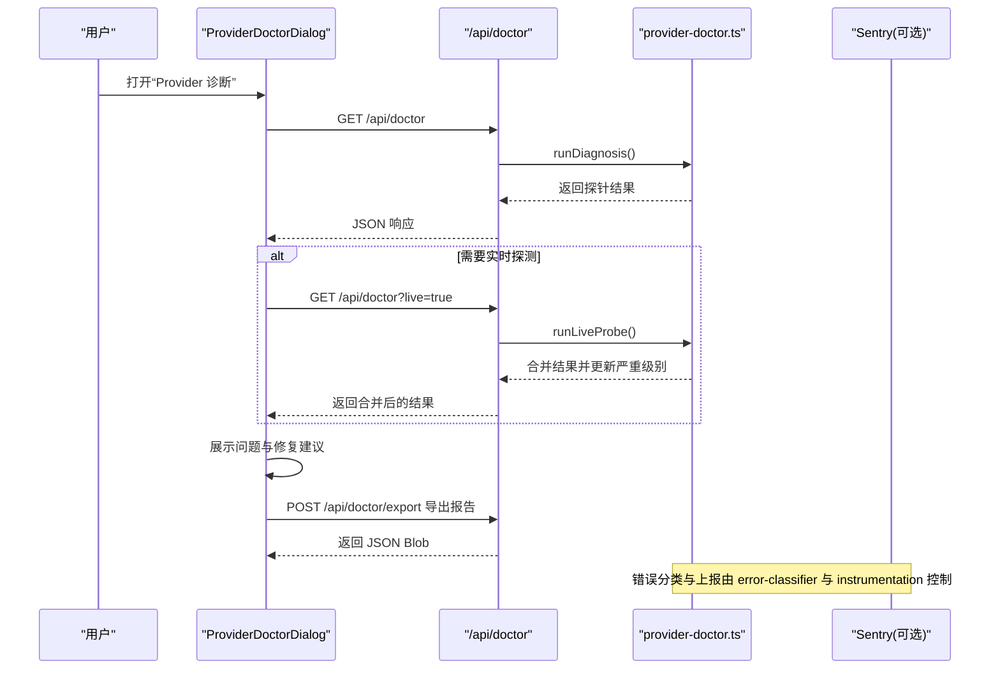
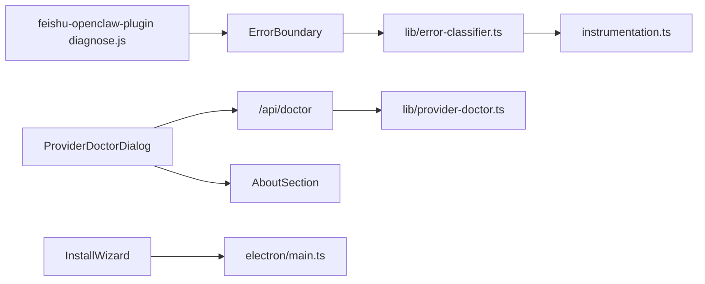
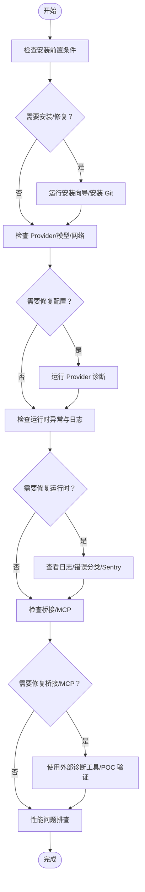

# 故障排除

<cite>
**本文引用的文件**
- [src/app/api/doctor/route.ts](file://src/app/api/doctor/route.ts)
- [src/components/settings/ProviderDoctorDialog.tsx](file://src/components/settings/ProviderDoctorDialog.tsx)
- [src/components/settings/HealthSection.tsx](file://src/components/settings/HealthSection.tsx)
- [src/lib/provider-doctor.ts](file://src/lib/provider-doctor.ts)
- [src/lib/error-classifier.ts](file://src/lib/error-classifier.ts)
- [src/instrumentation.ts](file://src/instrumentation.ts)
- [src/app/api/settings/sentry/route.ts](file://src/app/api/settings/sentry/route.ts)
- [src/components/layout/ErrorBoundary.tsx](file://src/components/layout/ErrorBoundary.tsx)
- [src/lib/runtime-log.ts](file://src/lib/runtime-log.ts)
- [src/lib/runtime/event-bus.ts](file://src/lib/runtime/event-bus.ts)
- [src/components/layout/InstallWizard.tsx](file://src/components/layout/InstallWizard.tsx)
- [electron/main.ts](file://electron/main.ts)
- [src/components/setup/SetupCenter.tsx](file://src/components/setup/SetupCenter.tsx)
- [src/components/setup/ProviderCard.tsx](file://src/components/setup/ProviderCard.tsx)
- [src/components/settings/AboutSection.tsx](file://src/components/settings/AboutSection.tsx)
- [资料/feishu-openclaw-plugin/package/src/commands/diagnose.js](file://资料/feishu-openclaw-plugin/package/src/commands/diagnose.js)
- [资料/feishu-openclaw-plugin/package/src/commands/diagnose.d.ts](file://资料/feishu-openclaw-plugin/package/src/commands/diagnose.d.ts)
- [docs/research/codex-mcp-injection-poc/integration-phase-1-3.mjs](file://docs/research/codex-mcp-injection-poc/integration-phase-1-3.mjs)
- [docs/research/issue-analysis-2026-04-02.md](file://docs/research/issue-analysis-2026-04-02.md)
- [docs/insights/user-audience-analysis.md](file://docs/insights/user-audience-analysis.md)
</cite>

## 目录
1. [简介](#简介)
2. [项目结构](#项目结构)
3. [核心组件](#核心组件)
4. [架构总览](#架构总览)
5. [详细组件分析](#详细组件分析)
6. [依赖关系分析](#依赖关系分析)
7. [性能考虑](#性能考虑)
8. [故障排除指南](#故障排除指南)
9. [结论](#结论)
10. [附录](#附录)

## 简介
本指南面向使用 CodePilot 的用户与维护者，系统化梳理安装、配置、运行时异常、日志与错误分析、性能问题排查与优化建议，并提供社区支持与问题反馈流程。文档基于仓库中的实际实现与文档进行归纳，确保可操作性与时效性。

## 项目结构
围绕“故障排除”的关键模块与文件：
- 诊断与健康检查：/api/doctor、ProviderDoctorDialog、HealthSection、provider-doctor
- 错误与日志：ErrorBoundary、runtime-log、error-classifier、instrumentation、Sentry 开关
- 安装与前置条件：InstallWizard、SetupCenter、ProviderCard、Electron main
- 平台与环境：AboutSection、platform 信息
- MCP/桥接诊断：feishu-openclaw-plugin diagnose、codex-mcp 注入 POC
- 用户与问题背景：issue-analysis、user-audience

图表来源
- [src/app/api/doctor/route.ts:1-37](file://src/app/api/doctor/route.ts#L1-L37)
- [src/components/settings/ProviderDoctorDialog.tsx:56-322](file://src/components/settings/ProviderDoctorDialog.tsx#L56-L322)
- [src/components/settings/HealthSection.tsx:107-140](file://src/components/settings/HealthSection.tsx#L107-L140)
- [src/lib/provider-doctor.ts](file://src/lib/provider-doctor.ts)
- [src/lib/error-classifier.ts:26-57](file://src/lib/error-classifier.ts#L26-L57)
- [src/instrumentation.ts:25-54](file://src/instrumentation.ts#L25-L54)
- [src/app/api/settings/sentry/route.ts:1-34](file://src/app/api/settings/sentry/route.ts#L1-L34)
- [src/components/layout/ErrorBoundary.tsx:45-139](file://src/components/layout/ErrorBoundary.tsx#L45-L139)
- [src/lib/runtime-log.ts:83-114](file://src/lib/runtime-log.ts#L83-L114)
- [src/lib/runtime/event-bus.ts:46-75](file://src/lib/runtime/event-bus.ts#L46-L75)
- [src/components/layout/InstallWizard.tsx:300-488](file://src/components/layout/InstallWizard.tsx#L300-L488)
- [electron/main.ts:1633-1670](file://electron/main.ts#L1633-L1670)
- [src/components/setup/SetupCenter.tsx:87-119](file://src/components/setup/SetupCenter.tsx#L87-L119)
- [src/components/setup/ProviderCard.tsx:150-183](file://src/components/setup/ProviderCard.tsx#L150-L183)
- [src/components/settings/AboutSection.tsx:272-303](file://src/components/settings/AboutSection.tsx#L272-L303)
- [资料/feishu-openclaw-plugin/package/src/commands/diagnose.js:386-428](file://资料/feishu-openclaw-plugin/package/src/commands/diagnose.js#L386-L428)
- [资料/feishu-openclaw-plugin/package/src/commands/diagnose.d.ts:45-70](file://资料/feishu-openclaw-plugin/package/src/commands/diagnose.d.ts#L45-L70)

章节来源
- [src/app/api/doctor/route.ts:1-37](file://src/app/api/doctor/route.ts#L1-L37)
- [src/components/settings/HealthSection.tsx:107-140](file://src/components/settings/HealthSection.tsx#L107-L140)

## 核心组件
- 诊断与健康页：HealthSection 展示 Provider 连接状态与引导跳转；ProviderDoctorDialog 提供一键诊断与导出报告。
- 诊断 API：/api/doctor 支持快速探测与可选的实时探测，返回整体严重级别与各探针详情。
- 错误边界与日志：ErrorBoundary 捕获前端异常并提供重试/刷新；runtime-log 缓冲最近日志；event-bus 安全分发事件。
- 错误分类与 Sentry：error-classifier 将错误分类并上报；instrumentation.ts 控制 Sentry 初始化与屏蔽列表；/api/settings/sentry 切换 opt-out。
- 安装与前置条件：InstallWizard 与 electron/main 协助安装 Git（Windows）与 CLI；SetupCenter/ProviderCard 引导配置。
- 平台信息：AboutSection 展示 OS、通道、版本，便于问题反馈。

章节来源
- [src/components/settings/HealthSection.tsx:107-140](file://src/components/settings/HealthSection.tsx#L107-L140)
- [src/components/settings/ProviderDoctorDialog.tsx:56-322](file://src/components/settings/ProviderDoctorDialog.tsx#L56-L322)
- [src/app/api/doctor/route.ts:1-37](file://src/app/api/doctor/route.ts#L1-L37)
- [src/lib/error-classifier.ts:26-57](file://src/lib/error-classifier.ts#L26-L57)
- [src/instrumentation.ts:25-54](file://src/instrumentation.ts#L25-L54)
- [src/app/api/settings/sentry/route.ts:1-34](file://src/app/api/settings/sentry/route.ts#L1-L34)
- [src/components/layout/ErrorBoundary.tsx:45-139](file://src/components/layout/ErrorBoundary.tsx#L45-L139)
- [src/lib/runtime-log.ts:83-114](file://src/lib/runtime-log.ts#L83-L114)
- [src/lib/runtime/event-bus.ts:46-75](file://src/lib/runtime/event-bus.ts#L46-L75)
- [src/components/layout/InstallWizard.tsx:300-488](file://src/components/layout/InstallWizard.tsx#L300-L488)
- [electron/main.ts:1633-1670](file://electron/main.ts#L1633-L1670)
- [src/components/setup/SetupCenter.tsx:87-119](file://src/components/setup/SetupCenter.tsx#L87-L119)
- [src/components/setup/ProviderCard.tsx:150-183](file://src/components/setup/ProviderCard.tsx#L150-L183)
- [src/components/settings/AboutSection.tsx:272-303](file://src/components/settings/AboutSection.tsx#L272-L303)

## 架构总览
以下序列图展示“Provider 诊断”从 UI 到 API 再到实现的整体流程。

图表来源
- [src/components/settings/ProviderDoctorDialog.tsx:182-214](file://src/components/settings/ProviderDoctorDialog.tsx#L182-L214)
- [src/app/api/doctor/route.ts:12-27](file://src/app/api/doctor/route.ts#L12-L27)
- [src/lib/provider-doctor.ts](file://src/lib/provider-doctor.ts)
- [src/lib/error-classifier.ts:26-57](file://src/lib/error-classifier.ts#L26-L57)
- [src/instrumentation.ts:25-54](file://src/instrumentation.ts#L25-L54)

## 详细组件分析

### 诊断与健康页（HealthSection）
- 功能要点：检测已配置 Provider 数量，给出严重级别与引导按钮（跳转至 Providers 设置）。
- 常见问题定位：0 个 Provider 会导致聊天无法发送；应优先在此页面点击“查看 Providers”。

章节来源
- [src/components/settings/HealthSection.tsx:107-140](file://src/components/settings/HealthSection.tsx#L107-L140)

### Provider 诊断对话框（ProviderDoctorDialog）
- 功能要点：快速探针（约 1 秒）+ 可选实时探针（最多约 15 秒）；支持导出诊断报告为 JSON。
- UI 行为：根据探针结果自动展开有问题的探针；支持“运行实时探测”与“导出报告”。
- 适用场景：CLI 健康、鉴权来源、模型兼容性、网络/端点、实际连通测试。

章节来源
- [src/components/settings/ProviderDoctorDialog.tsx:56-322](file://src/components/settings/ProviderDoctorDialog.tsx#L56-L322)
- [src/app/api/doctor/route.ts:1-37](file://src/app/api/doctor/route.ts#L1-L37)

### 诊断 API（/api/doctor）
- GET /api/doctor：运行静态诊断；可选参数 live=true 运行实时探测并更新整体严重级别。
- 错误处理：捕获异常并返回 500 与错误信息，便于前端展示与日志定位。

章节来源
- [src/app/api/doctor/route.ts:12-37](file://src/app/api/doctor/route.ts#L12-L37)

### 错误边界与日志（ErrorBoundary 与 runtime-log）
- ErrorBoundary：捕获前端异常，提供“显示/隐藏详情”、“重试”、“刷新应用”等操作；必要时上报 Sentry。
- runtime-log：拦截 console.error/warn，缓冲最近日志条目，支持清空与获取，便于前端/后端调试。

章节来源
- [src/components/layout/ErrorBoundary.tsx:45-139](file://src/components/layout/ErrorBoundary.tsx#L45-L139)
- [src/lib/runtime-log.ts:83-114](file://src/lib/runtime-log.ts#L83-L114)

### 错误分类与 Sentry（error-classifier 与 instrumentation）
- error-classifier：按类别与上下文标签上报错误；跳过用户主动取消（abort/cancel）；异步导入 Sentry，避免阻塞。
- instrumentation：服务端初始化 Sentry，读取 ~/.codepilot/sentry-disabled 标记文件；忽略特定已知错误类型。
- Sentry 开关：/api/settings/sentry 提供读取与写入 opt-out 状态，写入同时创建目录与文件。

章节来源
- [src/lib/error-classifier.ts:26-57](file://src/lib/error-classifier.ts#L26-L57)
- [src/instrumentation.ts:25-54](file://src/instrumentation.ts#L25-L54)
- [src/app/api/settings/sentry/route.ts:1-34](file://src/app/api/settings/sentry/route.ts#L1-L34)

### 安装与前置条件（InstallWizard 与 electron/main）
- InstallWizard：检查前置条件（如 Windows 需要 Git），提供“重新检查”“安装”“取消”“重试”“完成”等阶段与按钮。
- electron/main：Windows 场景通过 winget 安装 Git for Windows；安装过程输出日志并支持取消。

章节来源
- [src/components/layout/InstallWizard.tsx:300-488](file://src/components/layout/InstallWizard.tsx#L300-L488)
- [electron/main.ts:1633-1670](file://electron/main.ts#L1633-L1670)

### SetupCenter 与 ProviderCard
- SetupCenter：固定遮罩层内的设置中心，滚动到初始卡片，显示进度与“跳过并进入”。
- ProviderCard：根据环境变量检测或引导添加 Provider；支持“使用环境变量”“打开设置”等动作。

章节来源
- [src/components/setup/SetupCenter.tsx:87-119](file://src/components/setup/SetupCenter.tsx#L87-L119)
- [src/components/setup/ProviderCard.tsx:150-183](file://src/components/setup/ProviderCard.tsx#L150-L183)

### AboutSection（平台信息）
- 展示 OS、通道、应用版本等信息，便于问题反馈时提供准确构建信息。

章节来源
- [src/components/settings/AboutSection.tsx:272-303](file://src/components/settings/AboutSection.tsx#L272-L303)

### 外部诊断（feishu-openclaw-plugin）
- diagnose.js：从 gateway.log 提取特定 message_id 的日志片段，格式化输出与分析；支持 traceByMessageId、formatTraceOutput、analyzeTrace。
- 用途：定位桥接/网关层问题，辅助 MCP/CLI 交互诊断。

章节来源
- [资料/feishu-openclaw-plugin/package/src/commands/diagnose.js:386-428](file://资料/feishu-openclaw-plugin/package/src/commands/diagnose.js#L386-L428)
- [资料/feishu-openclaw-plugin/package/src/commands/diagnose.d.ts:45-70](file://资料/feishu-openclaw-plugin/package/src/commands/diagnose.d.ts#L45-L70)

### MCP/桥接诊断（codex-mcp 注入 POC）
- integration-phase-1-3.mjs：演示 thread/start 注入 Memory MCP（HTTP route），随后调用 codepilot_memory_recent/search，验证启动状态与工具调用。
- 用途：验证 MCP 注入链路、工具可用性与错误处理。

章节来源
- [docs/research/codex-mcp-injection-poc/integration-phase-1-3.mjs:79-91](file://docs/research/codex-mcp-injection-poc/integration-phase-1-3.mjs#L79-L91)

## 依赖关系分析
- ProviderDoctorDialog 依赖 /api/doctor；/api/doctor 依赖 provider-doctor 实现。
- 错误分类与上报依赖 instrumentation（Sentry 初始化）与 error-classifier（分类与标签）。
- InstallWizard 与 electron/main 共同保障安装前置条件（Windows Git）。
- AboutSection 为问题反馈提供平台与版本信息。

图表来源
- [src/components/settings/ProviderDoctorDialog.tsx:182-214](file://src/components/settings/ProviderDoctorDialog.tsx#L182-L214)
- [src/app/api/doctor/route.ts:12-27](file://src/app/api/doctor/route.ts#L12-L27)
- [src/lib/provider-doctor.ts](file://src/lib/provider-doctor.ts)
- [src/lib/error-classifier.ts:26-57](file://src/lib/error-classifier.ts#L26-L57)
- [src/instrumentation.ts:25-54](file://src/instrumentation.ts#L25-L54)
- [src/components/layout/InstallWizard.tsx:300-488](file://src/components/layout/InstallWizard.tsx#L300-L488)
- [electron/main.ts:1633-1670](file://electron/main.ts#L1633-L1670)
- [src/components/settings/AboutSection.tsx:272-303](file://src/components/settings/AboutSection.tsx#L272-L303)
- [资料/feishu-openclaw-plugin/package/src/commands/diagnose.js:386-428](file://资料/feishu-openclaw-plugin/package/src/commands/diagnose.js#L386-L428)

## 性能考虑
- 诊断响应时间：快速探针约 1 秒；实时探针（live=true）可能达 15 秒，建议在需要时再触发。
- Sentry 初始化：开发环境有保护，生产环境才初始化，避免不必要的性能开销。
- 事件总线：emit 为异步、错误被捕获并记录，避免阻塞调用方。
- MCP 注入：Codex 场景采用 HTTP route 复用现有服务器，减少 stdio 子进程开销与打包差异带来的额外成本。

章节来源
- [src/app/api/doctor/route.ts:12-27](file://src/app/api/doctor/route.ts#L12-L27)
- [src/instrumentation.ts:25-54](file://src/instrumentation.ts#L25-L54)
- [src/lib/runtime/event-bus.ts:46-75](file://src/lib/runtime/event-bus.ts#L46-L75)
- [docs/research/codex-mcp-injection-poc/integration-phase-1-3.mjs:79-91](file://docs/research/codex-mcp-injection-poc/integration-phase-1-3.mjs#L79-L91)

## 故障排除指南

### 一、安装与前置条件
- 症状：Windows 启动失败或 CLI 工具缺失导致退出码 1。
- 诊断：InstallWizard 与 electron/main 会提示缺少 Git 并提供安装与重检流程。
- 处理：
  - 在 InstallWizard 中点击“重新检查”，确认 Git 安装状态。
  - Windows 场景由 electron/main 通过 winget 安装 Git for Windows，等待安装完成或取消后重试。
  - 如需手动安装，参考安装命令提示并完成安装后重试。

章节来源
- [src/components/layout/InstallWizard.tsx:300-488](file://src/components/layout/InstallWizard.tsx#L300-L488)
- [electron/main.ts:1633-1670](file://electron/main.ts#L1633-L1670)

### 二、配置错误（Provider/模型/网络）
- 症状：聊天无法发送、Provider 未配置、鉴权失败或模型不可用。
- 诊断：
  - 在“设置 > 健康”查看 Provider 连接状态；若为 0 个，点击“查看 Providers”进行配置。
  - 使用“Provider 诊断”进行快速/实时探测，查看探针结果与修复建议。
- 处理：
  - 添加至少一个 Provider 并完成鉴权。
  - 根据诊断建议修正网络/端点、模型选择或权限范围。
  - 导出诊断报告用于问题反馈。

章节来源
- [src/components/settings/HealthSection.tsx:107-140](file://src/components/settings/HealthSection.tsx#L107-L140)
- [src/components/settings/ProviderDoctorDialog.tsx:56-322](file://src/components/settings/ProviderDoctorDialog.tsx#L56-L322)
- [src/app/api/doctor/route.ts:12-27](file://src/app/api/doctor/route.ts#L12-L27)

### 三、运行时异常与错误分析
- 前端异常：
  - ErrorBoundary 捕获异常，提供“显示/隐藏详情”“重试”“刷新应用”；必要时上报 Sentry。
  - 建议：复制“详情”中的 message/stack，结合最近日志定位。
- 日志分析：
  - 使用 runtime-log 获取最近缓冲日志，清理后重现场景复现，再次获取日志。
  - 在“设置 > 关于”复制 OS/通道/版本信息，便于问题反馈。
- 错误分类与上报：
  - error-classifier 会按类别与上下文标签上报；Sentry 初始化受 instrumentation 控制。
  - 如需关闭上报，通过 /api/settings/sentry 切换 opt-out，并重启应用生效。

章节来源
- [src/components/layout/ErrorBoundary.tsx:45-139](file://src/components/layout/ErrorBoundary.tsx#L45-L139)
- [src/lib/runtime-log.ts:83-114](file://src/lib/runtime-log.ts#L83-L114)
- [src/lib/error-classifier.ts:26-57](file://src/lib/error-classifier.ts#L26-L57)
- [src/instrumentation.ts:25-54](file://src/instrumentation.ts#L25-L54)
- [src/app/api/settings/sentry/route.ts:1-34](file://src/app/api/settings/sentry/route.ts#L1-L34)
- [src/components/settings/AboutSection.tsx:272-303](file://src/components/settings/AboutSection.tsx#L272-L303)

### 四、桥接与 MCP 问题
- 症状：MCP 连接异常、工具调用失败（如“tool not found”）。
- 诊断：
  - 使用 feishu-openclaw-plugin 的 diagnose 工具提取特定 message_id 的日志，格式化输出并分析。
  - 参考 MCP 注入 POC，验证 thread/start 注入与工具调用链路。
- 处理：
  - 确认 MCP 服务器已正确注入并处于 ready 状态。
  - 检查工具名称与参数是否匹配；必要时调整注入配置或权限策略。

章节来源
- [资料/feishu-openclaw-plugin/package/src/commands/diagnose.js:386-428](file://资料/feishu-openclaw-plugin/package/src/commands/diagnose.js#L386-L428)
- [资料/feishu-openclaw-plugin/package/src/commands/diagnose.d.ts:45-70](file://资料/feishu-openclaw-plugin/package/src/commands/diagnose.d.ts#L45-L70)
- [docs/research/codex-mcp-injection-poc/integration-phase-1-3.mjs:79-91](file://docs/research/codex-mcp-injection-poc/integration-phase-1-3.mjs#L79-L91)

### 五、性能问题排查
- 症状：卡顿、内存占用高、响应慢。
- 诊断与建议：
  - 使用“Provider 诊断”的实时探针（live=true）观察网络/端点与实际连通耗时。
  - 检查 Sentry 上报与忽略列表，避免误报干扰。
  - 关注事件总线的异步处理与错误捕获，避免阻塞。
  - MCP 注入采用 HTTP route 复用现有服务器，减少额外开销。

章节来源
- [src/app/api/doctor/route.ts:12-27](file://src/app/api/doctor/route.ts#L12-L27)
- [src/instrumentation.ts:25-54](file://src/instrumentation.ts#L25-L54)
- [src/lib/runtime/event-bus.ts:46-75](file://src/lib/runtime/event-bus.ts#L46-L75)
- [docs/research/codex-mcp-injection-poc/integration-phase-1-3.mjs:79-91](file://docs/research/codex-mcp-injection-poc/integration-phase-1-3.mjs#L79-L91)

### 六、问题分类体系与定位策略
- 安装与前置条件：Windows 缺失 Git、CLI 未就绪。
- 配置错误：Provider 未配置、鉴权失败、模型不可用、网络/端点异常。
- 运行时异常：前端异常、日志与错误分类、Sentry 上报。
- 桥接与 MCP：MCP 注入、工具调用、权限与审批。
- 性能问题：诊断耗时、事件总线与 MCP 注入优化。

章节来源
- [src/components/layout/InstallWizard.tsx:300-488](file://src/components/layout/InstallWizard.tsx#L300-L488)
- [src/components/settings/HealthSection.tsx:107-140](file://src/components/settings/HealthSection.tsx#L107-L140)
- [src/components/layout/ErrorBoundary.tsx:45-139](file://src/components/layout/ErrorBoundary.tsx#L45-L139)
- [资料/feishu-openclaw-plugin/package/src/commands/diagnose.js:386-428](file://资料/feishu-openclaw-plugin/package/src/commands/diagnose.js#L386-L428)
- [src/app/api/doctor/route.ts:12-27](file://src/app/api/doctor/route.ts#L12-L27)

### 七、社区支持与问题反馈流程
- 平台与版本信息：在“设置 > 关于”复制 OS、通道、应用版本，便于问题反馈。
- 诊断报告：在“Provider 诊断”中导出 JSON 报告，附带到问题反馈中。
- 用户画像与问题背景：可参考 issue-analysis 与 user-audience，了解高频问题与用户分布，有助于定位与复现。

章节来源
- [src/components/settings/AboutSection.tsx:272-303](file://src/components/settings/AboutSection.tsx#L272-L303)
- [src/components/settings/ProviderDoctorDialog.tsx:288-304](file://src/components/settings/ProviderDoctorDialog.tsx#L288-L304)
- [docs/research/issue-analysis-2026-04-02.md:135-170](file://docs/research/issue-analysis-2026-04-02.md#L135-L170)
- [docs/insights/user-audience-analysis.md:1-106](file://docs/insights/user-audience-analysis.md#L1-L106)

## 结论
通过“安装前置条件检查—配置健康诊断—运行时异常与日志—桥接/MCP 诊断—性能优化”的系统化流程，可高效定位并解决 CodePilot 使用中的大多数问题。配合 Sentry 上报与诊断报告导出，问题反馈将更具针对性与可复现性。

## 附录

### A. 常见错误代码与含义（示例）
- “tool not found”：MCP 工具未找到或未注入，检查工具名称与注入配置。
- “未找到消息追踪日志”：gateway.log 未包含目标 message_id，可能消息尚未处理或日志轮转。

章节来源
- [资料/feishu-openclaw-plugin/package/src/commands/diagnose.js:415-428](file://资料/feishu-openclaw-plugin/package/src/commands/diagnose.js#L415-L428)

### B. 诊断流程图（概念）

[此图为概念流程，不直接映射具体源文件，故不提供图表来源]