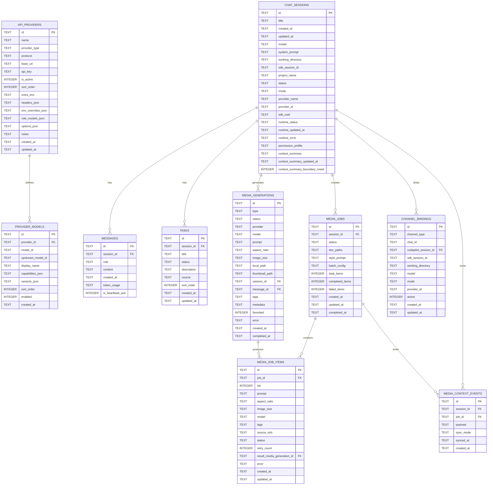
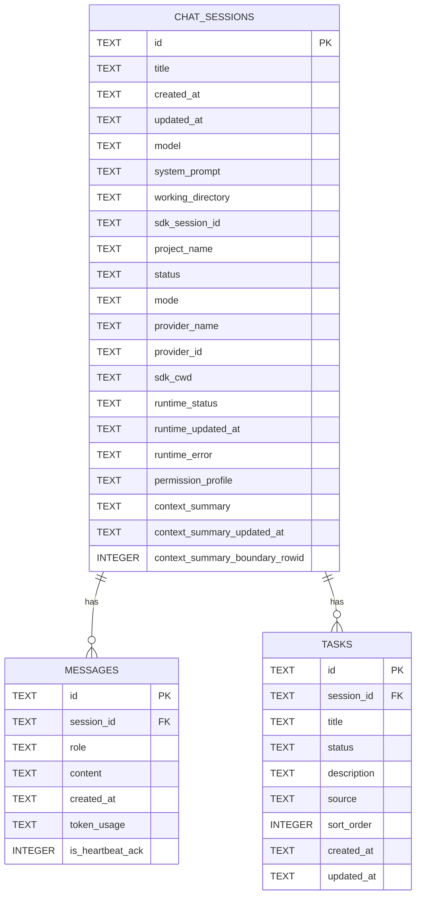
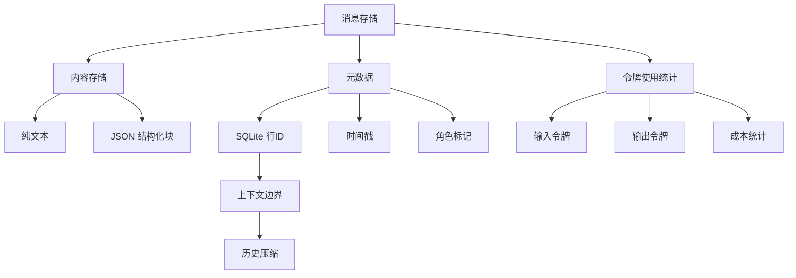
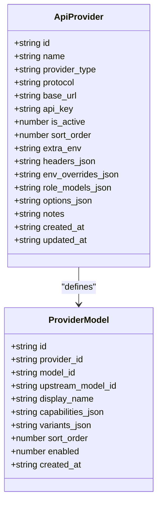
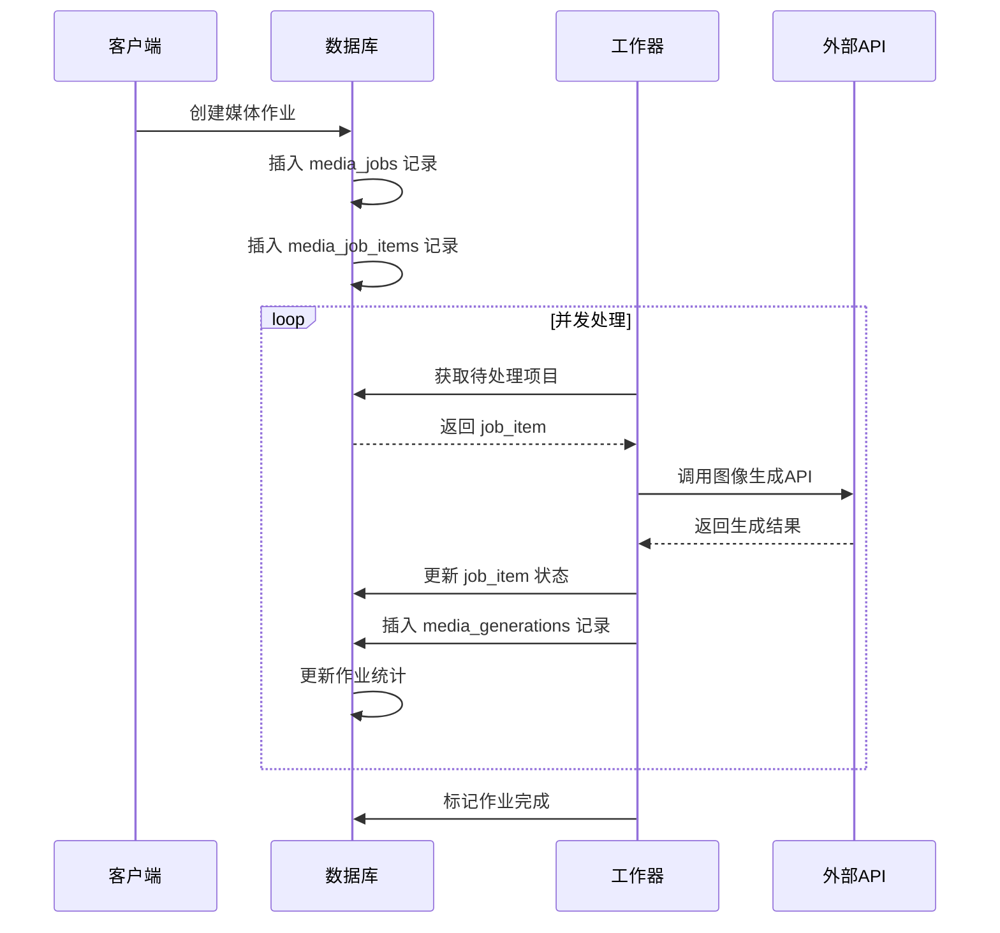
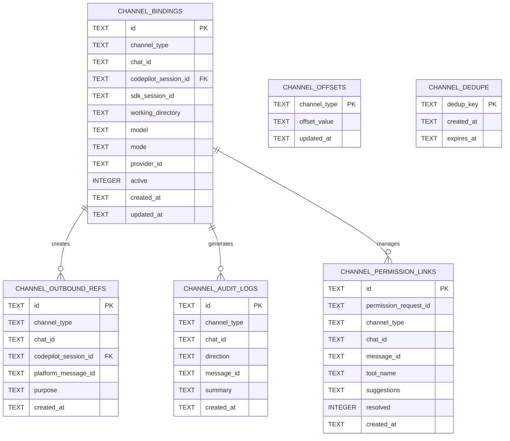
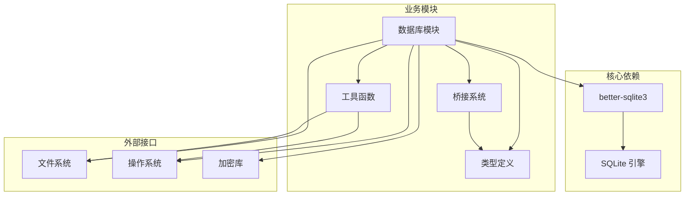
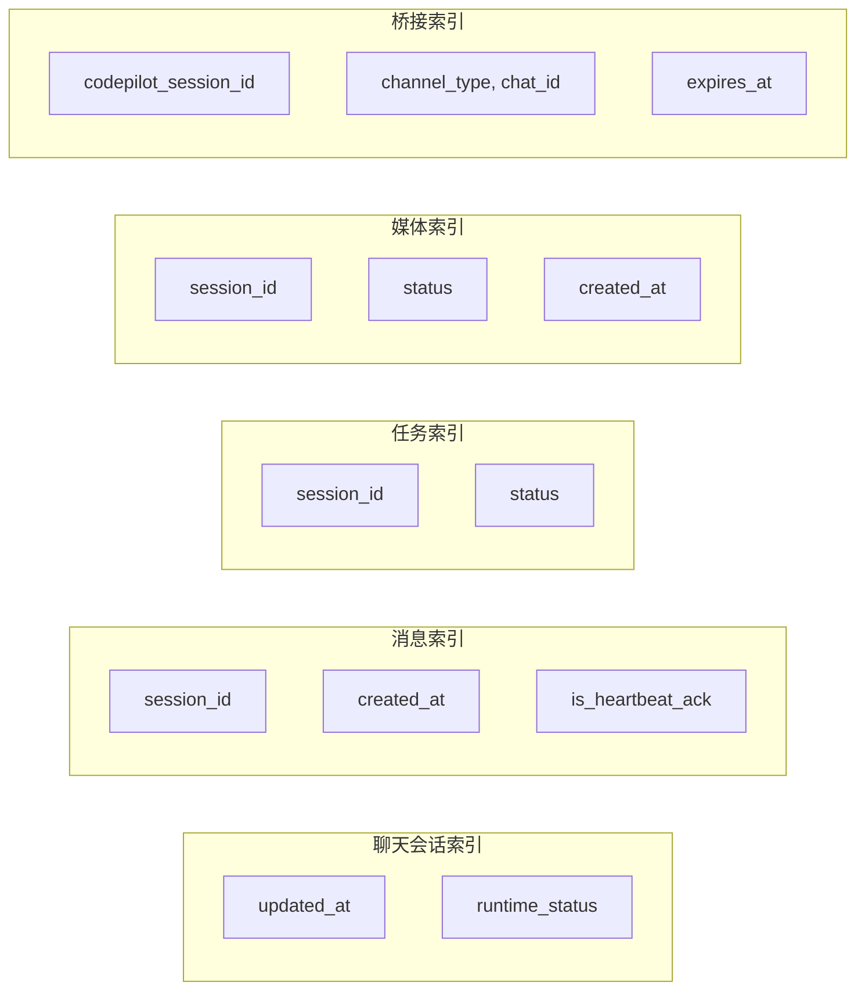

# 数据库架构

<cite>
**本文档引用的文件**
- [db.ts](file://src/lib/db.ts)
- [types/index.ts](file://src/types/index.ts)
- [bridge/types.ts](file://src/lib/bridge/types.ts)
- [utils.ts](file://src/lib/utils.ts)
</cite>

## 目录
1. [简介](#简介)
2. [项目结构](#项目结构)
3. [核心组件](#核心组件)
4. [架构概览](#架构概览)
5. [详细组件分析](#详细组件分析)
6. [依赖关系分析](#依赖关系分析)
7. [性能考虑](#性能考虑)
8. [故障排除指南](#故障排除指南)
9. [结论](#结论)

## 简介

CodePilot 采用 SQLite 作为其核心数据库引擎，通过 better-sqlite3 库提供高性能的本地数据存储解决方案。该数据库架构专为 AI 助手应用设计，支持聊天会话管理、消息持久化、API 提供商配置、媒体生成任务、桥接系统等功能。

数据库采用 WAL（Write-Ahead Logging）模式，确保高并发读写场景下的数据一致性和性能表现。整个架构设计遵循 ACID 原则，提供可靠的数据持久化能力。

## 项目结构

```mermaid
graph TB
subgraph "数据库层"
DB[SQLite 数据库]
WAL[WAL 模式]
PRAGMAS[数据库参数]
end
subgraph "核心表"
SESSIONS[chat_sessions]
MESSAGES[messages]
SETTINGS[settings]
TASKS[tasks]
PROVIDERS[api_providers]
end
subgraph "扩展功能表"
MEDIA[media_generations]
JOBS[media_jobs]
JOB_ITEMS[media_job_items]
CONTEXT[media_context_events]
BRIDGE[channel_bindings]
end
subgraph "桥接系统"
BINDINGS[channel_bindings]
OFFSETS[channel_offsets]
DEDUP[channel_dedupe]
OUTBOUND[channel_outbound_refs]
AUDIT[channel_audit_logs]
PERM[channel_permission_links]
end
DB --> WAL
DB --> PRAGMAS
DB --> SESSIONS
DB --> MESSAGES
DB --> SETTINGS
DB --> TASKS
DB --> PROVIDERS
DB --> MEDIA
DB --> JOBS
DB --> JOB_ITEMS
DB --> CONTEXT
DB --> BINDINGS
DB --> OFFSETS
DB --> DEDUP
DB --> OUTBOUND
DB --> AUDIT
DB --> PERM
```

**图表来源**
- [db.ts:98-320](file://src/lib/db.ts#L98-L320)
- [db.ts:332-945](file://src/lib/db.ts#L332-L945)

## 核心组件

### 数据库初始化与配置

数据库在首次访问时自动初始化，包含以下关键配置：

- **WAL 模式启用**：`db.pragma('journal_mode = WAL')`
- **超时设置**：`db.pragma('busy_timeout = 5000')`
- **外键约束**：`db.pragma('foreign_keys = ON')`
- **数据目录**：默认位于用户主目录下的 `.codepilot` 文件夹

### 数据库迁移机制

系统内置完整的数据库迁移框架，支持向后兼容：

- **列添加保护**：`safeAddColumn` 函数处理并发迁移冲突
- **历史数据回填**：自动迁移旧版本数据到新结构
- **索引维护**：确保迁移后索引完整性

**章节来源**
- [db.ts:11-96](file://src/lib/db.ts#L11-L96)
- [db.ts:322-330](file://src/lib/db.ts#L322-L330)

## 架构概览

**图表来源**
- [db.ts:98-320](file://src/lib/db.ts#L98-L320)
- [types/index.ts:5-27](file://src/types/index.ts#L5-L27)
- [types/index.ts:143-158](file://src/types/index.ts#L143-L158)
- [types/index.ts:130-141](file://src/types/index.ts#L130-L141)
- [types/index.ts:198-220](file://src/types/index.ts#L198-L220)
- [types/index.ts:242-253](file://src/types/index.ts#L242-L253)
- [types/index.ts:847-860](file://src/types/index.ts#L847-L860)
- [types/index.ts:862-878](file://src/types/index.ts#L862-L878)
- [types/index.ts:880-888](file://src/types/index.ts#L880-L888)
- [types/index.ts:826-838](file://src/types/index.ts#L826-L838)

## 详细组件分析

### 聊天会话管理系统

#### 表结构设计

**图表来源**
- [db.ts:100-136](file://src/lib/db.ts#L100-L136)
- [types/index.ts:5-27](file://src/types/index.ts#L5-L27)
- [types/index.ts:143-158](file://src/types/index.ts#L143-L158)
- [types/index.ts:130-141](file://src/types/index.ts#L130-L141)

#### 关键特性

1. **上下文压缩支持**：
   - `context_summary_boundary_rowid` 字段使用 SQLite rowid 作为精确边界标识
   - 避免秒级时间戳精度不足导致的历史消息过滤问题

2. **运行时状态跟踪**：
   - 支持会话运行状态监控（running、waiting_permission、idle）
   - 错误信息持久化和恢复机制

3. **多模式支持**：
   - code、plan、ask 三种聊天模式
   - 权限配置文件支持

**章节来源**
- [db.ts:971-1012](file://src/lib/db.ts#L971-L1012)
- [db.ts:1014-1084](file://src/lib/db.ts#L1014-L1084)

### 消息管理系统

#### 存储结构

**图表来源**
- [db.ts:1126-1156](file://src/lib/db.ts#L1126-L1156)
- [db.ts:1158-1175](file://src/lib/db.ts#L1158-L1175)
- [types/index.ts:143-158](file://src/types/index.ts#L143-L158)

#### 查询优化

1. **游标分页**：
   - 使用 `rowid` 进行高效分页
   - 支持 `beforeRowId` 参数实现无限滚动

2. **全文搜索**：
   - LIKE 操作符进行模糊匹配
   - 心跳确认消息过滤

3. **令牌统计**：
   - JSON 格式存储详细使用统计
   - 支持按日期聚合分析

**章节来源**
- [db.ts:1269-1333](file://src/lib/db.ts#L1269-L1333)
- [db.ts:1711-1812](file://src/lib/db.ts#L1711-L1812)

### API 提供商管理系统

#### 数据模型

**图表来源**
- [types/index.ts:198-220](file://src/types/index.ts#L198-L220)
- [types/index.ts:242-253](file://src/types/index.ts#L242-L253)

#### 协议支持

系统支持多种 AI 模型协议：

- **Anthropic Claude**：默认协议
- **OpenAI 兼容**：通过协议字段识别
- **Google Gemini**：图像生成专用
- **自定义协议**：支持第三方服务

**章节来源**
- [db.ts:1499-1580](file://src/lib/db.ts#L1499-L1580)
- [db.ts:1639-1687](file://src/lib/db.ts#L1639-L1687)

### 媒体生成系统

#### 批处理架构

**图表来源**
- [db.ts:1824-1852](file://src/lib/db.ts#L1824-L1852)
- [db.ts:1901-1937](file://src/lib/db.ts#L1901-L1937)
- [db.ts:1879-1889](file://src/lib/db.ts#L1879-L1889)

#### 作业管理

1. **批处理配置**：
   - 并发数控制
   - 重试机制
   - 指数退避延迟

2. **状态跟踪**：
   - draft、planning、planned、running、paused、completed、cancelled、failed
   - 实时进度统计

3. **错误处理**：
   - 单项重试
   - 失败计数
   - 错误信息持久化

**章节来源**
- [db.ts:1818-1822](file://src/lib/db.ts#L1818-L1822)
- [db.ts:1864-1867](file://src/lib/db.ts#L1864-L1867)
- [db.ts:1949-1956](file://src/lib/db.ts#L1949-L1956)

### 桥接系统

#### 通道绑定管理

**图表来源**
- [db.ts:245-289](file://src/lib/db.ts#L245-L289)
- [db.ts:264-268](file://src/lib/db.ts#L264-L268)
- [db.ts:271-276](file://src/lib/db.ts#L271-L276)
- [db.ts:279-288](file://src/lib/db.ts#L279-L288)
- [db.ts:291-301](file://src/lib/db.ts#L291-L301)
- [db.ts:304-315](file://src/lib/db.ts#L304-L315)

#### 消息去重机制

系统实现智能去重，防止重复消息处理：

- **去重键生成**：基于消息特征生成唯一键
- **过期管理**：自动清理过期去重记录
- **审计日志**：记录去重事件便于调试

**章节来源**
- [db.ts:2371-2391](file://src/lib/db.ts#L2371-L2391)

## 依赖关系分析

**图表来源**
- [db.ts:1-10](file://src/lib/db.ts#L1-L10)
- [utils.ts:1-67](file://src/lib/utils.ts#L1-L67)

### 数据访问模式

系统采用多种数据访问模式：

1. **单表查询模式**：直接查询特定表获取数据
2. **关联查询模式**：通过 JOIN 操作获取关联数据
3. **事务模式**：使用事务确保数据一致性
4. **批量操作模式**：支持批量插入和更新

**章节来源**
- [db.ts:1048-1052](file://src/lib/db.ts#L1048-L1052)
- [db.ts:1478-1492](file://src/lib/db.ts#L1478-L1492)

## 性能考虑

### WAL 模式优势

CodePilot 采用 SQLite WAL 模式的主要优势：

1. **高并发读写**：
   - 读操作不阻塞写操作
   - 写操作不影响其他连接的读取

2. **数据安全性**：
   - 历史版本保留机制
   - 故障恢复能力增强

3. **性能提升**：
   - 减少锁竞争
   - 提高整体吞吐量

### 索引策略

系统建立了完善的索引体系：

**图表来源**
- [db.ts:231-242](file://src/lib/db.ts#L231-L242)
- [db.ts:410](file://src/lib/db.ts#L410)
- [db.ts:639](file://src/lib/db.ts#L639)
- [db.ts:260-261](file://src/lib/db.ts#L260-L261)
- [db.ts:276](file://src/lib/db.ts#L276)

### 查询优化建议

1. **使用合适的索引**：
   - 频繁查询的字段建立索引
   - 复合索引优化复杂查询

2. **避免全表扫描**：
   - 使用 WHERE 条件限制查询范围
   - 利用索引进行快速查找

3. **批量操作优化**：
   - 使用事务减少锁开销
   - 合理控制批量大小

## 故障排除指南

### 常见问题及解决方案

#### 数据库锁定问题

**症状**：操作超时或死锁
**原因**：长时间持有数据库锁
**解决方案**：
- 检查长事务操作
- 使用适当的超时设置
- 优化查询语句

#### 迁移失败

**症状**：启动时报错，数据库结构异常
**原因**：并发迁移冲突
**解决方案**：
- 检查迁移锁文件
- 重启应用重试
- 手动修复数据库结构

#### 内存使用过高

**症状**：内存占用持续增长
**原因**：大量数据加载到内存
**解决方案**：
- 使用分页查询
- 及时释放数据库连接
- 优化查询结果集大小

**章节来源**
- [db.ts:18-50](file://src/lib/db.ts#L18-L50)
- [db.ts:1711-1812](file://src/lib/db.ts#L1711-L1812)

### 数据备份与恢复

#### 备份策略

1. **完整备份**：
   - 备份 `.codepilot` 目录
   - 包含主数据库文件和 WAL 文件

2. **增量备份**：
   - 定期备份数据库文件
   - 使用 WAL 文件进行增量同步

#### 恢复流程

1. **停止应用**：确保数据库文件未被占用
2. **替换文件**：将备份文件复制到原位置
3. **验证数据**：启动应用检查数据完整性
4. **清理缓存**：删除临时文件重新启动

## 结论

CodePilot 的数据库架构设计充分考虑了 AI 助手应用的特殊需求，通过 SQLite + WAL 的组合实现了高性能、高可靠性的数据存储方案。系统具备完善的迁移机制、丰富的索引策略和灵活的数据访问模式，能够有效支持聊天会话管理、消息持久化、API 提供商配置、媒体生成任务等多种功能。

架构设计的关键优势包括：
- **高并发支持**：WAL 模式确保读写分离
- **数据一致性**：ACID 属性保证数据可靠性
- **可扩展性**：模块化设计支持功能扩展
- **易维护性**：完善的迁移和备份机制

未来可以考虑的改进方向：
- 添加更多高级查询优化
- 实现更精细的权限控制
- 增强数据压缩和存储优化
- 扩展分布式部署支持