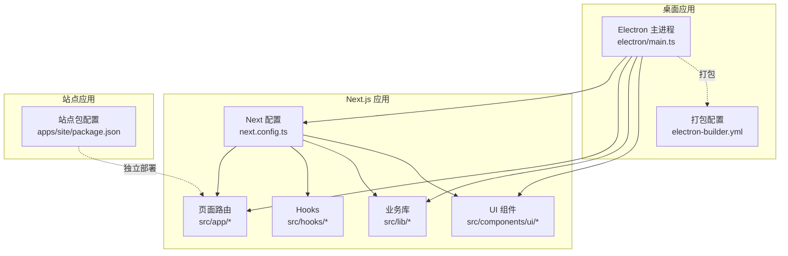
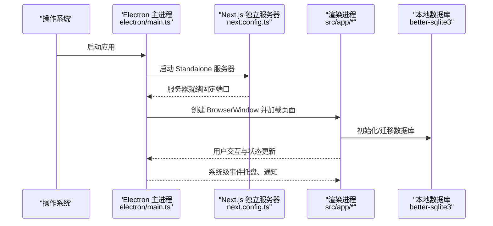
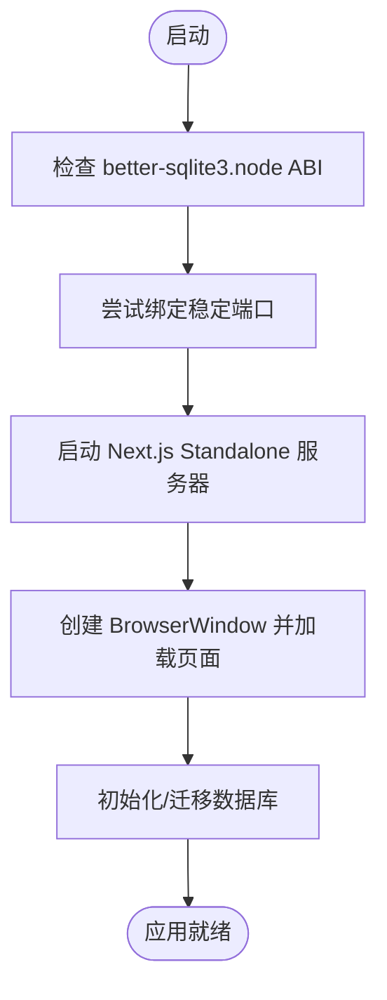
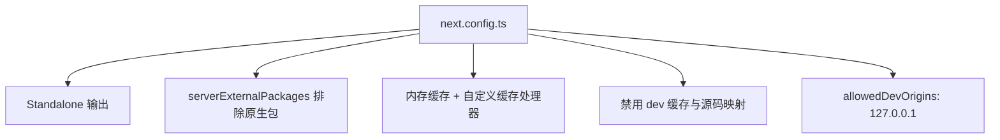
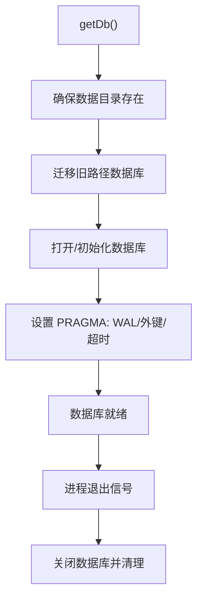
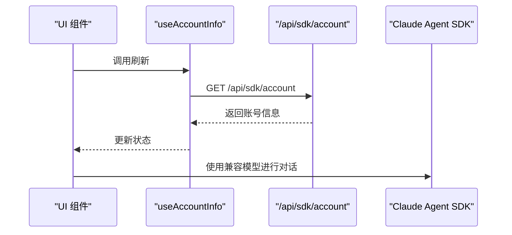
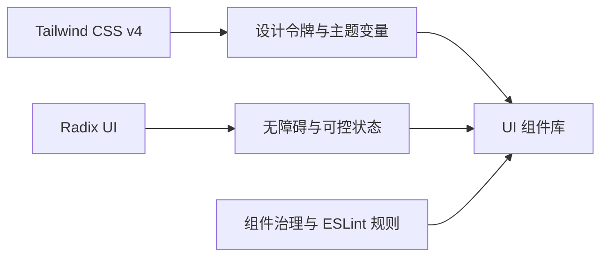
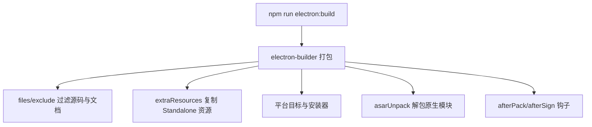
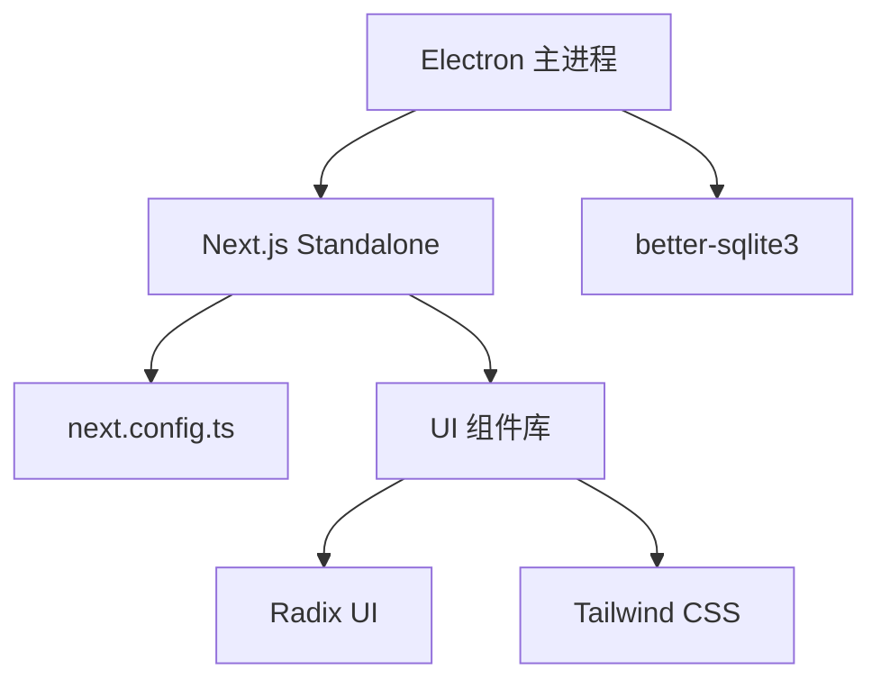

# 技术栈选择

<cite>
**本文档引用的文件**
- [package.json](file://package.json)
- [next.config.ts](file://next.config.ts)
- [electron-builder.yml](file://electron-builder.yml)
- [electron/main.ts](file://electron/main.ts)
- [src/lib/db.ts](file://src/lib/db.ts)
- [apps/site/package.json](file://apps/site/package.json)
- [components.json](file://components.json)
- [src/lib/claude-code-compat/index.ts](file://src/lib/claude-code-compat/index.ts)
- [src/app/api/claude-auth/](file://src/app/api/claude-auth/route.ts)
- [src/hooks/useAccountInfo.ts](file://src/hooks/useAccountInfo.ts)
- [src/components/ui/tooltip.tsx](file://src/components/ui/tooltip.tsx)
- [src/components/ui/button-group.tsx](file://src/components/ui/button-group.tsx)
- [src/components/ui/badge.tsx](file://src/components/ui/badge.tsx)
- [src/components/ui/select.tsx](file://src/components/ui/select.tsx)
- [src/lib/widget-css-bridge.ts](file://src/lib/widget-css-bridge.ts)
</cite>

## 目录
1. [简介](#简介)
2. [项目结构](#项目结构)
3. [核心组件](#核心组件)
4. [架构总览](#架构总览)
5. [详细组件分析](#详细组件分析)
6. [依赖关系分析](#依赖关系分析)
7. [性能考量](#性能考量)
8. [故障排查指南](#故障排查指南)
9. [结论](#结论)
10. [附录](#附录)

## 简介
本文件系统性阐述 CodePilot 的技术栈选择与取舍，重点覆盖：
- 桌面应用框架：Electron 40 的稳定性与原生集成能力
- 前端框架：Next.js 16 App Router 的现代化特性与构建优化
- 组件化开发：React 19 的并发与生态协同
- 数据库：better-sqlite3 的本地存储与性能优势
- AI 集成：Claude Agent SDK 与多 Provider 支持策略
- 样式体系：Tailwind CSS 与 Radix UI 的组合优势
- 构建打包：electron-builder 的产物控制与平台适配

通过对关键实现文件的深入分析，解释每项技术选型的动机、权衡与收益，并提供对比视角以突出当前技术栈在性能与开发效率上的优势。

## 项目结构
CodePilot 采用多包工作区布局，核心应用位于根目录，站点应用独立于主应用。整体结构围绕“桌面应用 + Web 前端 + 本地数据库”的模式组织，便于 Electron 主进程与 Next.js 渲染进程的协作。

**图表来源**
- [electron/main.ts:1-120](file://electron/main.ts#L1-L120)
- [next.config.ts:1-101](file://next.config.ts#L1-L101)
- [apps/site/package.json:1-40](file://apps/site/package.json#L1-L40)

**章节来源**
- [package.json:1-157](file://package.json#L1-L157)
- [next.config.ts:1-101](file://next.config.ts#L1-L101)
- [electron-builder.yml:1-95](file://electron-builder.yml#L1-L95)

## 核心组件
- 桌面框架：Electron 40 作为宿主，负责窗口生命周期、系统托盘、通知、子进程与原生模块加载。
- 前端框架：Next.js 16 App Router，启用 Standalone 输出、内存缓存与外部原生包，适配桌面环境。
- 组件化：React 19，配合 Hooks 与自研 UI 组件库，实现高复用与一致性的交互体验。
- 数据层：better-sqlite3，WAL 模式、外键与锁机制保障数据一致性与可靠性。
- AI 集成：Claude Agent SDK 与多 Provider 适配，统一模型调用接口。
- 样式体系：Tailwind CSS v4 + Radix UI，提供原子化样式与无障碍基础组件。
- 构建打包：electron-builder，精细化资源过滤与平台目标配置。

**章节来源**
- [package.json:48-117](file://package.json#L48-L117)
- [electron/main.ts:1-120](file://electron/main.ts#L1-L120)
- [next.config.ts:48-98](file://next.config.ts#L48-L98)
- [src/lib/db.ts:1-104](file://src/lib/db.ts#L1-L104)

## 架构总览
下图展示了桌面应用启动到渲染的关键流程，以及 Next.js 服务与 Electron 主进程的协作方式。

**图表来源**
- [electron/main.ts:750-795](file://electron/main.ts#L750-L795)
- [next.config.ts:5-16](file://next.config.ts#L5-L16)
- [src/lib/db.ts:52-104](file://src/lib/db.ts#L52-L104)

## 详细组件分析

### 桌面应用框架：Electron 40
- 稳定端口绑定：通过稳定端口范围避免每次重启 localStorage origin 变更导致的状态丢失。
- 原生模块兼容：在打包阶段对 better-sqlite3.node 进行 ABI 兼容性检查，降低运行期崩溃风险。
- 子进程与代理：支持系统代理解析与 Shell 环境注入，确保 CLI 与工具链可用。
- 通知与托盘：后台轮询通知队列，窗口隐藏时仍能通过系统通知触达用户。

**图表来源**
- [electron/main.ts:507-555](file://electron/main.ts#L507-L555)
- [electron/main.ts:717-795](file://electron/main.ts#L717-L795)
- [src/lib/db.ts:52-104](file://src/lib/db.ts#L52-L104)

**章节来源**
- [electron/main.ts:507-555](file://electron/main.ts#L507-L555)
- [electron/main.ts:717-795](file://electron/main.ts#L717-L795)
- [electron/main.ts:388-492](file://electron/main.ts#L388-L492)

### 前端框架：Next.js 16 App Router
- Standalone 输出：打包后独立运行，避免写入只读安装目录，结合内存缓存处理 ISR 场景。
- 外部原生包：将 better-sqlite3、discord.js、Claude Agent SDK 等标记为外部，避免打包问题。
- 开发体验：禁用 dev 文件系统缓存与源码映射，降低内存压力与编译成本。
- 跨域资源：允许 Electron 开发时从 127.0.0.1 加载资源，解决 HMR 与字体跨域限制。

**图表来源**
- [next.config.ts:5-16](file://next.config.ts#L5-L16)
- [next.config.ts:48-57](file://next.config.ts#L48-L57)
- [next.config.ts:35-47](file://next.config.ts#L35-L47)
- [next.config.ts:31-34](file://next.config.ts#L31-L34)

**章节来源**
- [next.config.ts:5-16](file://next.config.ts#L5-L16)
- [next.config.ts:48-57](file://next.config.ts#L48-L57)
- [next.config.ts:35-47](file://next.config.ts#L35-L47)
- [next.config.ts:31-34](file://next.config.ts#L31-L34)

### 组件化开发：React 19
- 生态协同：与 Next.js 16 App Router、Hooks、UI 组件库形成高效开发闭环。
- 可维护性：通过 UI primitives、Patterns 与业务组件分层，降低耦合度与复杂度。

**章节来源**
- [package.json:101-102](file://package.json#L101-L102)
- [apps/site/package.json:23-25](file://apps/site/package.json#L23-L25)

### 数据库：better-sqlite3
- 文件锁定与迁移：通过文件级锁避免多构建进程并发迁移，确保数据库一致性。
- WAL 模式与外键：开启 WAL 与外键约束，提升并发写入与引用完整性。
- 关闭与清理：注册进程退出信号，优雅关闭数据库并触发 WAL checkpoint，避免数据损坏。

**图表来源**
- [src/lib/db.ts:52-104](file://src/lib/db.ts#L52-L104)
- [src/lib/db.ts:97-101](file://src/lib/db.ts#L97-L101)
- [src/lib/db.ts:4093-4123](file://src/lib/db.ts#L4093-L4123)

**章节来源**
- [src/lib/db.ts:11-104](file://src/lib/db.ts#L11-L104)
- [src/lib/db.ts:97-101](file://src/lib/db.ts#L97-L101)
- [src/lib/db.ts:4093-4123](file://src/lib/db.ts#L4093-L4123)

### AI 集成：Claude Agent SDK 与多 Provider 支持
- 代理适配：提供 Claude Code 兼容模型工厂，统一 Wire 协议与 Beta 能力。
- 账号信息：通过 API 获取 SDK 账号信息，驱动 UI 与权限展示。
- 认证状态：读取 Claude Code 凭据文件，判断登录状态与账户类型。

**图表来源**
- [src/hooks/useAccountInfo.ts:20-34](file://src/hooks/useAccountInfo.ts#L20-L34)
- [src/lib/claude-code-compat/index.ts:19-21](file://src/lib/claude-code-compat/index.ts#L19-L21)

**章节来源**
- [src/lib/claude-code-compat/index.ts:1-21](file://src/lib/claude-code-compat/index.ts#L1-L21)
- [src/app/api/claude-auth/route.ts:1-38](file://src/app/api/claude-auth/route.ts#L1-L38)
- [src/hooks/useAccountInfo.ts:1-41](file://src/hooks/useAccountInfo.ts#L1-L41)

### 样式框架：Tailwind CSS 与 Radix UI
- Tailwind CSS v4：提供原子化样式与主题变量桥接，支持设计令牌与动态主题。
- Radix UI：提供无障碍基础组件与可控状态，保证交互一致性与可访问性。
- 组件治理：通过组件分层与 ESLint 规则，统一图标、颜色与组件使用规范。

**图表来源**
- [components.json:1-23](file://components.json#L1-L23)
- [src/components/ui/tooltip.tsx:1-44](file://src/components/ui/tooltip.tsx#L1-L44)
- [src/components/ui/button-group.tsx:1-43](file://src/components/ui/button-group.tsx#L1-L43)
- [src/components/ui/badge.tsx:1-30](file://src/components/ui/badge.tsx#L1-L30)
- [src/components/ui/select.tsx:1-39](file://src/components/ui/select.tsx#L1-L39)
- [src/lib/widget-css-bridge.ts:1-78](file://src/lib/widget-css-bridge.ts#L1-L78)

**章节来源**
- [components.json:1-23](file://components.json#L1-L23)
- [src/components/ui/tooltip.tsx:1-44](file://src/components/ui/tooltip.tsx#L1-L44)
- [src/components/ui/button-group.tsx:1-43](file://src/components/ui/button-group.tsx#L1-L43)
- [src/components/ui/badge.tsx:1-30](file://src/components/ui/badge.tsx#L1-L30)
- [src/components/ui/select.tsx:1-39](file://src/components/ui/select.tsx#L1-L39)
- [src/lib/widget-css-bridge.ts:1-78](file://src/lib/widget-css-bridge.ts#L1-L78)

### 构建工具：electron-builder
- 产物控制：仅打包 dist-electron 与 Next Standalone 资源，过滤源码与文档，减少体积。
- 平台目标：macOS DMG/ZIP、Windows NSIS、Linux AppImage/Deb/RPM，按 CI 参数选择架构。
- 原生模块：配置 asarUnpack 对 better-sqlite3.node 与 *.node 进行解包，确保运行时加载。
- 后置脚本：afterPack/afterSign 钩子用于签名与资源后处理。

**图表来源**
- [electron-builder.yml:1-95](file://electron-builder.yml#L1-L95)
- [package.json:35-38](file://package.json#L35-L38)

**章节来源**
- [electron-builder.yml:1-95](file://electron-builder.yml#L1-L95)
- [package.json:35-38](file://package.json#L35-L38)

## 依赖关系分析
- Electron 主进程依赖 Next.js Standalone 服务器，通过固定端口通信。
- Next 配置对外部原生包进行白名单，避免打包冲突。
- better-sqlite3 在主进程与渲染进程共享，通过文件锁与 WAL 保障并发安全。
- UI 组件依赖 Radix UI 与 Tailwind CSS，遵循组件治理规则。

**图表来源**
- [electron/main.ts:750-795](file://electron/main.ts#L750-L795)
- [next.config.ts:48-57](file://next.config.ts#L48-L57)
- [src/lib/db.ts:52-104](file://src/lib/db.ts#L52-L104)
- [components.json:1-23](file://components.json#L1-L23)

**章节来源**
- [electron/main.ts:750-795](file://electron/main.ts#L750-L795)
- [next.config.ts:48-57](file://next.config.ts#L48-L57)
- [src/lib/db.ts:52-104](file://src/lib/db.ts#L52-L104)
- [components.json:1-23](file://components.json#L1-L23)

## 性能考量
- 桌面端性能
  - 固定端口避免 localStorage origin 变更带来的状态重置开销。
  - 内存缓存与自定义缓存处理器减少磁盘写入，提升启动与热更新速度。
  - better-sqlite3 WAL 模式与外键约束在保证一致性的同时提升并发写入性能。
- 开发效率
  - 外部原生包与禁用 dev 缓存降低编译时间与内存占用。
  - 组件分层与 ESLint 规则减少重构成本与回归风险。
- 构建体积
  - 精细化过滤与 asarUnpack 解包策略平衡体积与运行时可用性。

[本节为通用性能讨论，无需具体文件分析]

## 故障排查指南
- better-sqlite3 ABI 不匹配
  - 现象：应用启动时报模块版本不匹配错误。
  - 处理：确认构建过程正确为目标 Electron 版本重新编译原生模块；运行时会弹窗提示并退出。
- 端口占用导致启动失败
  - 现象：稳定端口被占用或绑定失败。
  - 处理：系统会尝试下一个稳定端口；若全部失败则回落到随机端口，但会导致 localStorage origin 变化。
- 数据库迁移卡住
  - 现象：多构建进程同时迁移导致锁等待。
  - 处理：文件锁会在超时后强制移除并重试，确保迁移最终完成。
- 通知未显示
  - 现象：窗口隐藏时无系统通知。
  - 处理：后台轮询器会持续尝试发送通知，检查权限与网络代理配置。

**章节来源**
- [electron/main.ts:507-555](file://electron/main.ts#L507-L555)
- [electron/main.ts:717-795](file://electron/main.ts#L717-L795)
- [src/lib/db.ts:18-50](file://src/lib/db.ts#L18-L50)
- [electron/main.ts:388-492](file://electron/main.ts#L388-L492)

## 结论
CodePilot 的技术栈围绕“桌面原生 + Web 前端 + 本地数据库”展开，通过 Electron 40 的稳定与原生能力、Next.js 16 的现代化与构建优化、React 19 的生态协同、better-sqlite3 的高性能本地存储、Claude Agent SDK 与多 Provider 的灵活集成、Tailwind CSS 与 Radix UI 的一致体验，以及 electron-builder 的精细打包策略，实现了在性能与开发效率上的双重提升。各项技术选型均以实际工程问题为导向，辅以严格的配置与治理规则，确保系统在长期演进中的稳定性与可维护性。

[本节为总结性内容，无需具体文件分析]

## 附录
- 与替代方案对比要点
  - 桌面框架：相比 Tauri，Electron 在生态成熟度与原生模块支持上具备优势；相比 WebView，Electron 更易集成系统级能力。
  - 前端框架：相比 Vite/Remix，Next.js 16 的 App Router 在 SSR/ISR 与 Standalone 输出方面更适合桌面应用场景。
  - 数据库：相比 IndexedDB/SQLite.js，better-sqlite3 在本地文件系统上具备更低延迟与更强一致性。
  - 样式体系：Tailwind CSS v4 + Radix UI 的组合在可定制性与无障碍支持上优于传统 UI 库。
  - 构建工具：electron-builder 的 asarUnpack 与资源过滤策略在原生模块与体积控制之间取得平衡。

[本节为概念性对比，无需具体文件分析]