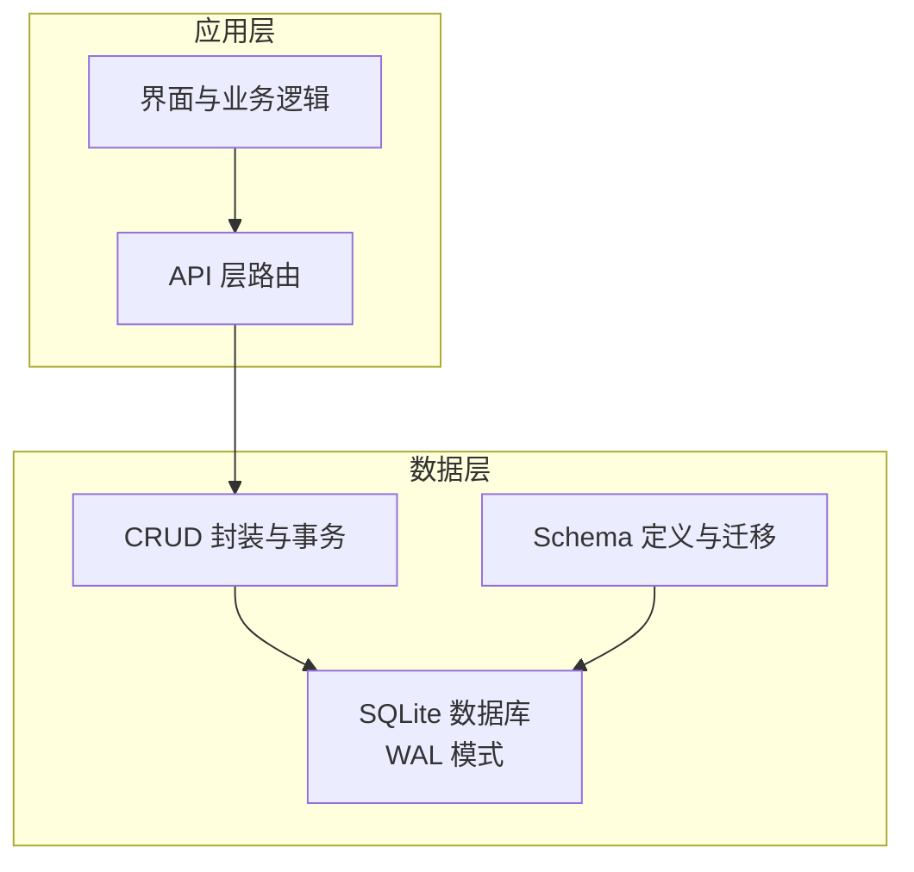
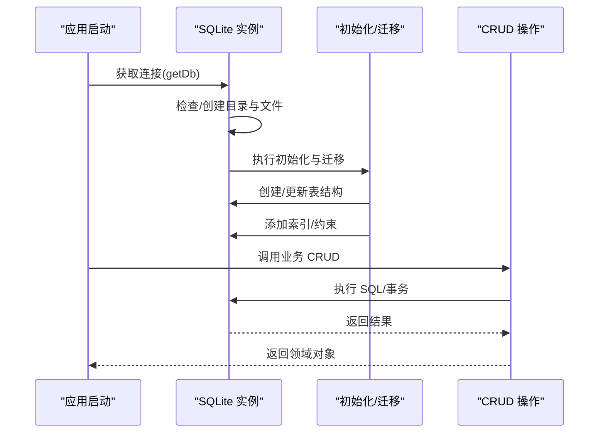
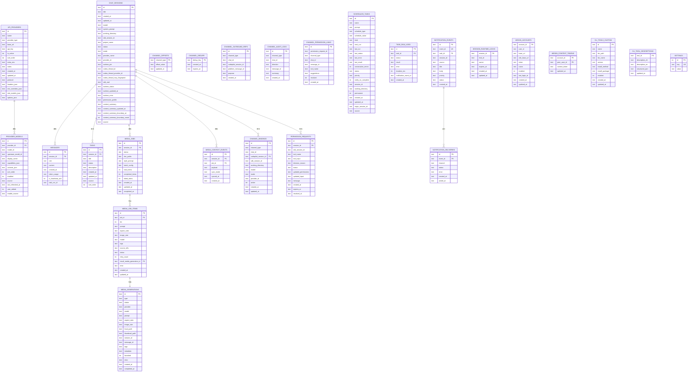
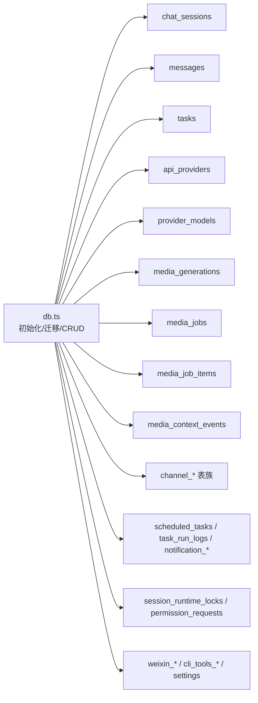

# 数据架构设计

<cite>
**本文引用的文件**
- [db.ts](file://src/lib/db.ts)
- [db-shutdown.test.ts](file://src/__tests__/unit/db-shutdown.test.ts)
</cite>

## 目录
1. [简介](#简介)
2. [项目结构](#项目结构)
3. [核心组件](#核心组件)
4. [架构总览](#架构总览)
5. [详细组件分析](#详细组件分析)
6. [依赖关系分析](#依赖关系分析)
7. [性能考量](#性能考量)
8. [故障排查指南](#故障排查指南)
9. [结论](#结论)
10. [附录](#附录)

## 简介
本文件面向开发者与架构师，系统性阐述 CodePilot 本地 SQLite 数据库的整体设计与实现。重点覆盖：
- 12 张核心表的设计理念、字段定义与约束
- 数据库模式的演进历史与版本管理策略
- 数据访问层的设计模式（CRUD 封装、事务管理）
- 数据一致性保障机制（外键约束、WAL 模式）
- 数据库 Schema 图与表关系图
- 性能优化与运维建议

## 项目结构
数据库核心位于 src/lib/db.ts，采用单文件集中式初始化、迁移与 CRUD 实现，配合 WAL 模式与索引优化，满足桌面应用对离线与并发读取的需求。

图表来源
- [db.ts:106-328](file://src/lib/db.ts#L106-L328)

章节来源
- [db.ts:106-328](file://src/lib/db.ts#L106-L328)

## 核心组件
- 初始化与连接管理：延迟初始化、自动迁移、文件锁防并发冲突、WAL/超时/外键等 PRAGMA 设置
- Schema 定义与迁移：首次创建与增量迁移，兼容旧版本数据
- CRUD 封装：按领域分组（会话、消息、任务、提供商、媒体、桥接通道等）
- 事务管理：显式事务包裹级联删除与批量写入
- 运维与关闭：进程退出钩子安全关闭数据库，避免 WAL 文件堆积

章节来源
- [db.ts:14-104](file://src/lib/db.ts#L14-L104)
- [db.ts:326-328](file://src/lib/db.ts#L326-L328)
- [db.ts:4079-4125](file://src/lib/db.ts#L4079-L4125)

## 架构总览
下图展示数据库初始化、Schema 与迁移、CRUD 访问层之间的关系：

图表来源
- [db.ts:52-104](file://src/lib/db.ts#L52-L104)
- [db.ts:106-328](file://src/lib/db.ts#L106-L328)

## 详细组件分析

### 1) 数据库初始化与一致性保障
- 文件锁与并发迁移：使用文件锁防止多个构建/进程同时执行迁移
- WAL 模式：提升并发读取性能，减少写放大
- PRAGMA 设置：busy_timeout、foreign_keys、journal_mode
- 迁移锁：迁移期间阻塞其他进程，确保模式演进原子性

章节来源
- [db.ts:16-50](file://src/lib/db.ts#L16-L50)
- [db.ts:97-101](file://src/lib/db.ts#L97-L101)
- [db.ts:326-328](file://src/lib/db.ts#L326-L328)

### 2) 核心表设计与关系

#### chat_sessions（会话）
- 设计理念：承载会话元数据，支持运行态状态、权限配置、工作目录、模型绑定、来源标记等
- 主键：id（TEXT）
- 外键：无
- 约束：默认值、枚举字段（如 mode、status）
- 索引：updated_at、runtime_status
- 典型用途：列表排序、活跃会话筛选、任务执行会话隔离

章节来源
- [db.ts:108-117](file://src/lib/db.ts#L108-L117)
- [db.ts:455](file://src/lib/db.ts#L455)

#### messages（消息）
- 设计理念：记录对话内容与令牌用量，支持心跳 ACK 过滤、按游标分页
- 主键：id（TEXT）
- 外键：session_id -> chat_sessions(id)（CASCADE 删除）
- 约束：role 枚举、token_usage JSON 字段
- 索引：session_id、created_at、rowid 辅助分页
- 典型用途：历史检索、上下文压缩边界 rowid

章节来源
- [db.ts:119-127](file://src/lib/db.ts#L119-L127)
- [db.ts:239-240](file://src/lib/db.ts#L239-L240)

#### tasks（任务）
- 设计理念：任务清单与来源区分（用户/SDK），支持排序与状态机
- 主键：id（TEXT）
- 外键：session_id -> chat_sessions(id)（CASCADE 删除）
- 约束：status 枚举、source 枚举
- 索引：session_id
- 典型用途：任务同步、排序、状态更新

章节来源
- [db.ts:135-144](file://src/lib/db.ts#L135-L144)
- [db.ts:480-492](file://src/lib/db.ts#L480-L492)

#### api_providers（API 提供商）
- 设计理念：统一管理外部模型提供商（含协议、头部、环境覆盖、角色模型映射）
- 主键：id（TEXT）
- 外键：无
- 约束：provider_type、protocol、is_active
- 索引：无（按 id/名称查询为主）
- 典型用途：默认提供商选择、模型能力映射

章节来源
- [db.ts:146-158](file://src/lib/db.ts#L146-L158)
- [db.ts:504-520](file://src/lib/db.ts#L504-L520)

#### provider_models（提供商模型）
- 设计理念：模型白名单/黑名单与来源追踪（catalog/manual/api/discovered/recommended）
- 主键：id（TEXT）
- 外键：provider_id -> api_providers(id)（CASCADE 删除）
- 约束：enabled、enable_source、user_edited
- 索引：provider_id、唯一(provider_id, model_id)
- 典型用途：刷新/对齐/隐藏推荐模型

章节来源
- [db.ts:542-563](file://src/lib/db.ts#L542-L563)
- [db.ts:569-591](file://src/lib/db.ts#L569-L591)

#### media_generations（媒体生成）
- 设计理念：图片/媒体生成记录，支持标签、收藏、错误信息、完成时间
- 主键：id（TEXT）
- 外键：session_id -> chat_sessions(id)（可空），message_id -> messages(id)（可空）
- 约束：type、status、favorited
- 索引：created_at、session_id、status
- 典型用途：媒体库、生成结果回溯

章节来源
- [db.ts:160-179](file://src/lib/db.ts#L160-L179)
- [db.ts:628-626](file://src/lib/db.ts#L628-L626)

#### media_jobs / media_job_items（媒体作业与条目）
- 设计理念：批处理作业与条目，支持并发、重试、状态统计
- 主键：id（TEXT）
- 外键：job_id -> media_jobs(id)（CASCADE 删除），result_media_generation_id -> media_generations(id)（SET NULL）
- 约束：status 枚举、retry_count
- 索引：job_id、status
- 典型用途：批量生成调度、进度统计

章节来源
- [db.ts:188-224](file://src/lib/db.ts#L188-L224)
- [db.ts:628-686](file://src/lib/db.ts#L628-L686)

#### media_context_events（媒体上下文事件）
- 设计理念：作业与会话的上下文事件记录，支持手动/自动批同步
- 主键：id（TEXT）
- 外键：session_id -> chat_sessions(id)（CASCADE 删除），job_id -> media_jobs(id)（CASCADE 删除）
- 约引：job_id
- 典型用途：生成触发溯源、同步审计

章节来源
- [db.ts:226-237](file://src/lib/db.ts#L226-L237)
- [db.ts:670-686](file://src/lib/db.ts#L670-L686)

#### settings（设置）
- 设计理念：键值设置，用于全局配置与默认提供商迁移
- 主键：id（INTEGER 自增）
- 唯一：key
- 典型用途：默认模型/提供商、全局模式

章节来源
- [db.ts:129-133](file://src/lib/db.ts#L129-L133)
- [db.ts:457-466](file://src/lib/db.ts#L457-L466)

#### channel_bindings / channel_offsets / channel_dedupe / channel_outbound_refs / channel_audit_logs / channel_permission_links（桥接通道）
- 设计理念：远程桥接（Telegram/Feishu/WeChat 等）的绑定、偏移、去重、出站引用、审计与权限链接
- 主键：id（TEXT）
- 外键：channel_bindings.codepilot_session_id -> chat_sessions(id)（CASCADE 删除）
- 约束：mode 枚举、direction 枚举、status 枚举
- 索引：多处复合/单列索引
- 典型用途：跨平台消息桥接、幂等处理、权限链路追踪

章节来源
- [db.ts:253-323](file://src/lib/db.ts#L253-L323)
- [db.ts:772-840](file://src/lib/db.ts#L772-L840)

#### scheduled_tasks（计划任务）
- 设计理念：定时/周期/一次性任务，支持优先级、通知、永久任务标记
- 主键：id（TEXT）
- 外键：session_id -> chat_sessions(id)（可空）
- 约束：schedule_type、kind、status、priority
- 索引：status、next_run
- 典型用途：提醒与 AI 任务调度

章节来源
- [db.ts:973-999](file://src/lib/db.ts#L973-L999)
- [db.ts:1001-1030](file://src/lib/db.ts#L1001-L1030)

#### task_run_logs / notification_events / notification_deliveries（任务执行与通知）
- 设计理念：任务执行日志、通知事件与交付记录，支持每事件多通道交付与幂等
- 主键：id（TEXT）
- 外键：task_run_logs.task_id -> scheduled_tasks(id)（CASCADE 删除）
- 约束：UNIQUE(event_id, channel)
- 索引：task_id、created_at
- 典型用途：任务执行追踪、跨渠道通知投递

章节来源
- [db.ts:1077-1090](file://src/lib/db.ts#L1077-L1090)
- [db.ts:1100-1128](file://src/lib/db.ts#L1100-L1128)

#### session_runtime_locks（会话运行时锁）
- 设计理念：基于主键冲突的互斥锁，支持 TTL 与续期
- 主键：session_id（TEXT）
- 外键：session_id -> chat_sessions(id)（CASCADE 删除）
- 典型用途：运行时独占控制

章节来源
- [db.ts:705-717](file://src/lib/db.ts#L705-L717)

#### permission_requests（权限请求）
- 设计理念：工具调用权限请求与决策，支持过期与解析
- 主键：id（TEXT）
- 外键：session_id -> chat_sessions(id)（CASCADE 删除）
- 约束：status 枚举
- 索引：session_id、expires_at
- 典型用途：权限弹窗与审计

章节来源
- [db.ts:719-739](file://src/lib/db.ts#L719-L739)

#### weixin_accounts / weixin_context_tokens（微信账户与上下文令牌）
- 设计理念：多账号支持与上下文令牌持久化
- 主键：weixin_accounts.account_id（TEXT），weixin_context_tokens(account_id, peer_user_id)
- 典型用途：微信桥接与上下文恢复

章节来源
- [db.ts:874-899](file://src/lib/db.ts#L874-L899)

#### cli_tools_custom / cli_tool_descriptions（CLI 工具）
- 设计理念：自定义 CLI 工具与描述（含结构化 JSON）
- 主键：id（TEXT）
- 典型用途：工具注册与描述持久化

章节来源
- [db.ts:901-945](file://src/lib/db.ts#L901-L945)

### 3) 数据访问层设计模式
- 延迟初始化与连接池：单实例、懒加载、进程内共享
- 事务封装：deleteSession、syncSdkTasks、acquireSessionLock 等使用事务保证一致性
- 参数化查询：防止 SQL 注入，提升可维护性
- 幂等写入：ON CONFLICT/UPSERT 语义，避免重复键冲突
- 索引策略：按查询模式建立复合/单列索引，平衡写入与查询成本

章节来源
- [db.ts:1134-1288](file://src/lib/db.ts#L1134-L1288)
- [db.ts:1692-1779](file://src/lib/db.ts#L1692-L1779)
- [db.ts:1782-1866](file://src/lib/db.ts#L1782-L1866)
- [db.ts:2613-2693](file://src/lib/db.ts#L2613-L2693)
- [db.ts:2836-2914](file://src/lib/db.ts#L2836-L2914)
- [db.ts:2917-2990](file://src/lib/db.ts#L2917-L2990)
- [db.ts:3014-3348](file://src/lib/db.ts#L3014-L3348)
- [db.ts:3351-3454](file://src/lib/db.ts#L3351-L3454)
- [db.ts:3457-3500](file://src/lib/db.ts#L3457-L3500)

### 4) 数据一致性与外键约束
- 外键约束：messages.session_id、tasks.session_id、media_jobs.session_id、media_job_items.job_id、media_context_events.session_id/job_id、channel_bindings.codepilot_session_id、permission_requests.session_id 等
- 级联行为：CASCADE 删除用于会话与其子资源；SET NULL 用于可选关联
- 事务保证：删除会话时先清理无外键 CASCADE 的表，再删除会话，避免 FK 冲突
- 数据校验：CHECK 约束限制枚举字段取值；JSON 字段使用 json_valid 校验

章节来源
- [db.ts:119-127](file://src/lib/db.ts#L119-L127)
- [db.ts:135-144](file://src/lib/db.ts#L135-L144)
- [db.ts:188-224](file://src/lib/db.ts#L188-L224)
- [db.ts:226-237](file://src/lib/db.ts#L226-L237)
- [db.ts:253-267](file://src/lib/db.ts#L253-L267)
- [db.ts:1283-1287](file://src/lib/db.ts#L1283-L1287)

### 5) WAL 模式与性能优势
- 开启 WAL：提升并发读取吞吐，降低写放大
- 事务提交：更平滑的写入节奏，适合桌面应用高频小事务
- 进程退出钩子：确保 WAL/SHM 正常落盘，避免数据丢失

章节来源
- [db.ts:98](file://src/lib/db.ts#L98)
- [db.ts:4091-4123](file://src/lib/db.ts#L4091-L4123)

### 6) 数据库模式演进与版本管理
- 首次创建：CREATE TABLE IF NOT EXISTS + 索引
- 增量迁移：逐版本添加列、回填默认值、索引补建、表补齐
- 兼容策略：safeAddColumn 忽略重复列错误；PRAGMA table_info 动态探测列存在性
- 启动恢复：进程重启后重置运行态、回收锁、中止过期权限请求
- 典型迁移点：chat_sessions 新增 model/system_prompt/sdk_session_id/project_name/status/mode/provider_name/provider_id/runtime_pin/codex_thread_id 等；messages 新增 token_usage/is_heartbeat_ack；tasks 新增 source/sort_order；provider_models 新增 source/last_refreshed_at/user_edited/enable_source；media_generations 新增 favorited；scheduled_tasks 新增 permanent/kind/source/origin_session_id；messages 新增 task_run_id；settings 默认面板等

章节来源
- [db.ts:340-771](file://src/lib/db.ts#L340-L771)
- [db.ts:973-1031](file://src/lib/db.ts#L973-L1031)
- [db.ts:1047-1051](file://src/lib/db.ts#L1047-L1051)
- [db.ts:1053-1070](file://src/lib/db.ts#L1053-L1070)
- [db.ts:1077-1094](file://src/lib/db.ts#L1077-L1094)
- [db.ts:1100-1128](file://src/lib/db.ts#L1100-L1128)

### 7) Schema 图与表关系图

图表来源
- [db.ts:108-323](file://src/lib/db.ts#L108-L323)
- [db.ts:542-686](file://src/lib/db.ts#L542-L686)
- [db.ts:705-739](file://src/lib/db.ts#L705-L739)
- [db.ts:973-1128](file://src/lib/db.ts#L973-L1128)

## 依赖关系分析

图表来源
- [db.ts:106-328](file://src/lib/db.ts#L106-L328)

章节来源
- [db.ts:106-328](file://src/lib/db.ts#L106-L328)

## 性能考量
- WAL 模式：提升并发读取性能，适合桌面应用场景
- 索引策略：按查询热点建立索引，兼顾写入成本
- 事务批处理：批量插入/更新使用事务，减少提交次数
- JSON 字段：token_usage 与多处 JSON 字段使用 json_valid 校验，避免无效数据影响统计
- 进程退出钩子：确保 WAL/SHM 正常落盘，避免数据丢失

## 故障排查指南
- 数据库关闭与重启
  - 使用进程退出钩子安全关闭数据库，避免 WAL 文件累积
  - 单元测试验证 closeDb 可多次调用且可重新打开
- 迁移冲突
  - 使用迁移锁避免并发迁移；若锁超时，等待或清理 stale lock 后重试
- 外键冲突
  - 删除会话前先清理无外键 CASCADE 的表，再删除会话
- 权限请求过期
  - 定期调用 expirePermissionRequests 清理过期请求
- 通知交付幂等
  - UNIQUE(event_id, channel) 约束防止重复交付

章节来源
- [db.ts:4079-4125](file://src/lib/db.ts#L4079-L4125)
- [db-shutdown.test.ts:1-43](file://src/__tests__/unit/db-shutdown.test.ts#L1-L43)
- [db.ts:1283-1287](file://src/lib/db.ts#L1283-L1287)
- [db.ts:2978-2989](file://src/lib/db.ts#L2978-L2989)
- [db.ts:1124](file://src/lib/db.ts#L1124)

## 结论
该数据库设计以 WAL 模式为基础，结合严格的外键约束与事务封装，实现了会话、消息、任务、提供商、媒体与桥接通道等核心领域的数据一致性与可演进性。通过索引与查询优化，满足桌面应用对离线与高性能并发读取的需求。迁移策略与进程退出钩子进一步提升了系统的稳定性与可维护性。

## 附录
- 运行态状态字段：runtime_status/runtime_updated_at/runtime_error 用于运行时状态跟踪
- 来源字段：chat_sessions.source 与 tasks.source 用于区分用户会话与任务执行会话
- 统计与报表：token_usage JSON 字段支持按日聚合统计