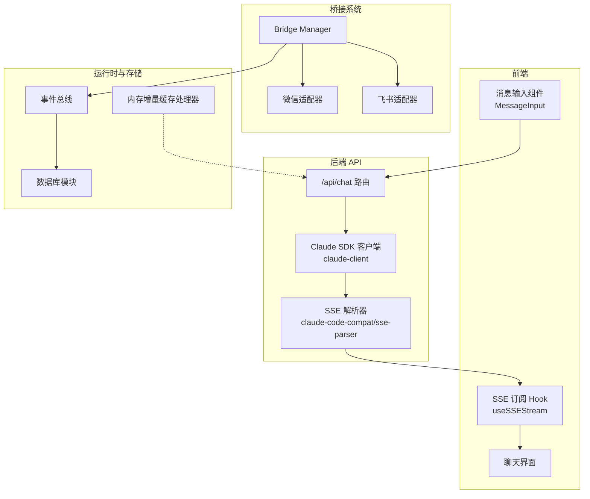
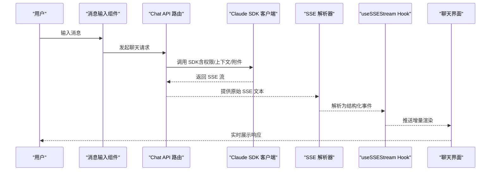
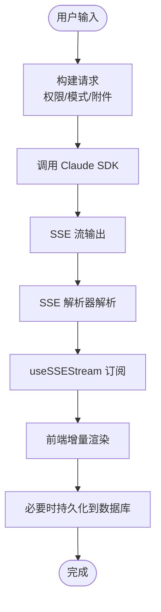
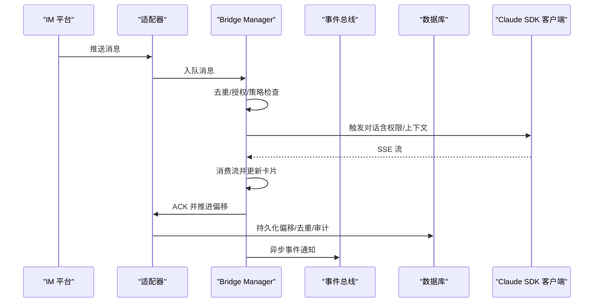
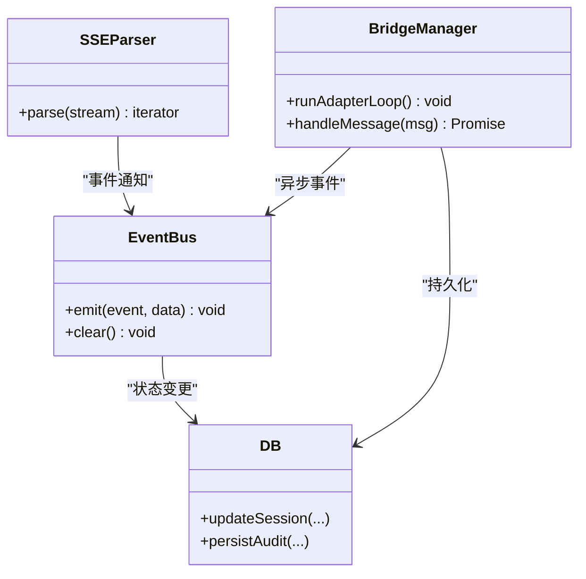
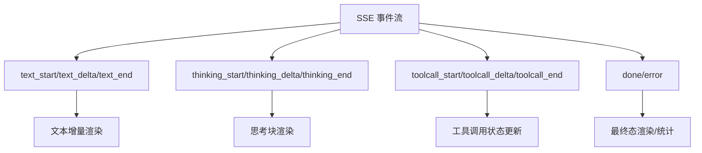
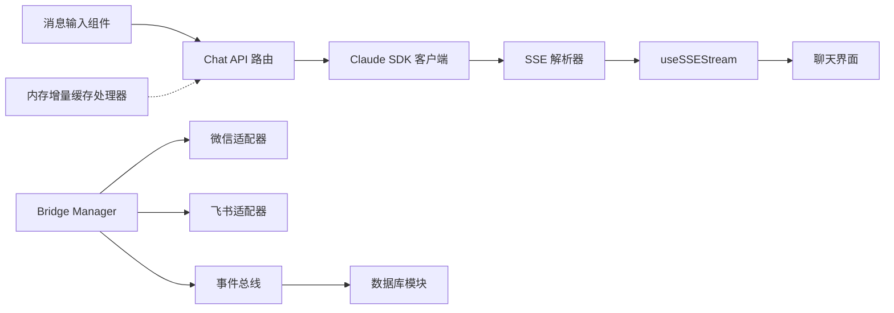

# 数据流设计

<cite>
**本文引用的文件**
- [src/app/api/chat/route.ts](file://src/app/api/chat/route.ts)
- [src/lib/claude-client.ts](file://src/lib/claude-client.ts)
- [src/hooks/useSSEStream.ts](file://src/hooks/useSSEStream.ts)
- [src/components/chat/message-input.tsx](file://src/components/chat/message-input.tsx)
- [src/lib/bridge/bridge-manager.ts](file://src/lib/bridge/bridge-manager.ts)
- [src/app/api/bridge/route.ts](file://src/app/api/bridge/route.ts)
- [src/lib/bridge/wechat-adapter.ts](file://src/lib/bridge/wechat-adapter.ts)
- [src/lib/bridge/feishu-adapter.ts](file://src/lib/bridge/feishu-adapter.ts)
- [src/lib/runtime/event-bus.ts](file://src/lib/runtime/event-bus.ts)
- [src/lib/claude-code-compat/sse-parser.ts](file://src/lib/claude-code-compat/sse-parser.ts)
- [src/lib/db.ts](file://src/lib/db.ts)
- [cache-handler.js](file://cache-handler.js)
- [docs/handover/bridge-system.md](file://docs/handover/bridge-system.md)
- [docs/research/pi-framework-analysis.md](file://docs/research/pi-framework-analysis.md)
</cite>

## 目录
1. [引言](#引言)
2. [项目结构](#项目结构)
3. [核心组件](#核心组件)
4. [架构总览](#架构总览)
5. [详细组件分析](#详细组件分析)
6. [依赖关系分析](#依赖关系分析)
7. [性能考虑](#性能考虑)
8. [故障排查指南](#故障排查指南)
9. [结论](#结论)
10. [附录](#附录)

## 引言
本设计文档聚焦 CodePilot 的数据流与处理机制，覆盖从用户输入到 AI 响应的完整链路，以及 Bridge 子系统的远程控制数据流。文档以事件驱动架构为主线，解释流式数据处理、异步事件管理与状态更新，并给出数据缓存策略、性能优化与错误处理建议。同时提供多幅时序图与类图，帮助开发者快速理解复杂异步数据处理逻辑。

## 项目结构
- 前端层：Next.js 应用，包含聊天界面、消息输入组件、SSE 订阅 Hook 等。
- 后端 API 层：Next.js App Router API，负责路由、权限与会话管理、调用 Claude SDK、返回 SSE。
- 代理桥接层：Bridge Manager 与各适配器（如微信、飞书）协同工作，实现 IM 消息的接收、路由、SDK 调用与响应分发。
- 运行时与事件总线：事件总线负责异步事件派发与容错；SSE 解析器负责将流式数据转换为前端事件。
- 数据持久化：数据库模块负责会话、消息与桥接相关元数据的持久化。
- 缓存：桌面打包场景下的内存增量缓存处理器，避免写入只读安装目录。

图表来源
- [src/components/chat/message-input.tsx](file://src/components/chat/message-input.tsx)
- [src/app/api/chat/route.ts](file://src/app/api/chat/route.ts)
- [src/lib/claude-client.ts](file://src/lib/claude-client.ts)
- [src/lib/claude-code-compat/sse-parser.ts](file://src/lib/claude-code-compat/sse-parser.ts)
- [src/hooks/useSSEStream.ts](file://src/hooks/useSSEStream.ts)
- [src/lib/bridge/bridge-manager.ts](file://src/lib/bridge/bridge-manager.ts)
- [src/lib/bridge/wechat-adapter.ts](file://src/lib/bridge/wechat-adapter.ts)
- [src/lib/bridge/feishu-adapter.ts](file://src/lib/bridge/feishu-adapter.ts)
- [src/lib/runtime/event-bus.ts](file://src/lib/runtime/event-bus.ts)
- [src/lib/db.ts](file://src/lib/db.ts)
- [cache-handler.js](file://cache-handler.js)

章节来源
- [src/app/api/chat/route.ts](file://src/app/api/chat/route.ts)
- [src/lib/claude-client.ts](file://src/lib/claude-client.ts)
- [src/hooks/useSSEStream.ts](file://src/hooks/useSSEStream.ts)
- [src/lib/bridge/bridge-manager.ts](file://src/lib/bridge/bridge-manager.ts)
- [src/lib/runtime/event-bus.ts](file://src/lib/runtime/event-bus.ts)
- [src/lib/db.ts](file://src/lib/db.ts)
- [cache-handler.js](file://cache-handler.js)

## 核心组件
- 消息输入与 UI：负责收集用户输入、触发聊天请求、渲染流式响应。
- Chat API 路由：统一入口，解析请求、权限校验、文件附件处理、调用 Claude SDK、建立 SSE 流并返回给前端。
- Claude SDK 客户端：封装 SDK 调用、上下文压缩与重试、流式事件格式化。
- SSE 解析器：将原始 SSE 文本解析为结构化事件，供前端 Hook 消费。
- Bridge Manager：桥接系统的核心调度器，负责适配器循环、消息处理、ACK 与偏移推进、错误恢复。
- 适配器：针对不同 IM 平台（如微信、飞书）的消息收发与回调处理。
- 事件总线：全局异步事件派发与容错，确保不阻塞调用方。
- 数据库模块：会话、消息、桥接元数据的持久化。
- 内存增量缓存处理器：桌面打包场景下避免写入只读安装目录。

章节来源
- [src/components/chat/message-input.tsx](file://src/components/chat/message-input.tsx)
- [src/app/api/chat/route.ts](file://src/app/api/chat/route.ts)
- [src/lib/claude-client.ts](file://src/lib/claude-client.ts)
- [src/lib/claude-code-compat/sse-parser.ts](file://src/lib/claude-code-compat/sse-parser.ts)
- [src/lib/bridge/bridge-manager.ts](file://src/lib/bridge/bridge-manager.ts)
- [src/lib/runtime/event-bus.ts](file://src/lib/runtime/event-bus.ts)
- [src/lib/db.ts](file://src/lib/db.ts)
- [cache-handler.js](file://cache-handler.js)

## 架构总览
本系统采用“前端事件驱动 + 后端流式 SSE + 桥接适配器”的混合架构：
- 前端通过消息输入组件发起请求，后端 Chat API 路由统一接入，调用 Claude SDK 并返回 SSE。
- SSE 解析器将流式事件转换为前端可订阅的事件，前端 Hook 实时渲染。
- Bridge Manager 作为桥接中枢，持续拉取 IM 平台消息，经适配器处理后进入 SDK 流程，最终回传至 IM。
- 事件总线贯穿系统，确保异步事件不阻塞、错误可捕获与记录。
- 数据库模块负责会话与桥接元数据持久化，内存缓存避免桌面打包场景下的磁盘写入问题。

图表来源
- [src/components/chat/message-input.tsx](file://src/components/chat/message-input.tsx)
- [src/app/api/chat/route.ts](file://src/app/api/chat/route.ts)
- [src/lib/claude-client.ts](file://src/lib/claude-client.ts)
- [src/lib/claude-code-compat/sse-parser.ts](file://src/lib/claude-code-compat/sse-parser.ts)
- [src/hooks/useSSEStream.ts](file://src/hooks/useSSEStream.ts)

## 详细组件分析

### 组件一：消息输入到 SSE 渲染的完整数据流
- 用户输入由消息输入组件收集，随后通过 Chat API 路由发起请求。
- 路由根据请求体解析权限模式、会话信息与附件，建立中止控制器以支持断开连接。
- 调用 Claude SDK 客户端，客户端内部进行上下文压缩与重试（如上下文过长时自动压缩并重试），并在流中注入状态事件。
- SSE 解析器将原始文本流解析为结构化事件，前端 Hook 订阅并驱动 UI 渲染。
- 数据库模块在必要时更新会话与消息记录，确保状态一致性。

图表来源
- [src/app/api/chat/route.ts](file://src/app/api/chat/route.ts)
- [src/lib/claude-client.ts](file://src/lib/claude-client.ts)
- [src/lib/claude-code-compat/sse-parser.ts](file://src/lib/claude-code-compat/sse-parser.ts)
- [src/hooks/useSSEStream.ts](file://src/hooks/useSSEStream.ts)
- [src/lib/db.ts](file://src/lib/db.ts)

章节来源
- [src/app/api/chat/route.ts](file://src/app/api/chat/route.ts)
- [src/lib/claude-client.ts](file://src/lib/claude-client.ts)
- [src/lib/claude-code-compat/sse-parser.ts](file://src/lib/claude-code-compat/sse-parser.ts)
- [src/hooks/useSSEStream.ts](file://src/hooks/useSSEStream.ts)
- [src/lib/db.ts](file://src/lib/db.ts)

### 组件二：Bridge 子系统的远程控制数据流
- Bridge Manager 启动适配器循环，持续监听 IM 平台消息。
- 消息到达后，按平台规则去重、授权检查、群策略过滤与 @ 提及检查，然后入队。
- 对于普通消息，进入消息处理流程：创建流式卡片控制器、消费 SSE、实时更新卡片内容与工具调用状态；对于回调消息，分别处理权限与工作目录回调；对于命令消息，触发相应命令处理。
- 处理完成后推进已确认偏移并持久化，确保消息处理的连续性与幂等性。
- 事件总线用于跨模块异步通知，避免阻塞主流程。

图表来源
- [src/lib/bridge/bridge-manager.ts](file://src/lib/bridge/bridge-manager.ts)
- [src/lib/bridge/wechat-adapter.ts](file://src/lib/bridge/wechat-adapter.ts)
- [src/lib/bridge/feishu-adapter.ts](file://src/lib/bridge/feishu-adapter.ts)
- [src/lib/runtime/event-bus.ts](file://src/lib/runtime/event-bus.ts)
- [src/lib/db.ts](file://src/lib/db.ts)
- [src/lib/claude-client.ts](file://src/lib/claude-client.ts)

章节来源
- [src/lib/bridge/bridge-manager.ts](file://src/lib/bridge/bridge-manager.ts)
- [src/lib/bridge/wechat-adapter.ts](file://src/lib/bridge/wechat-adapter.ts)
- [src/lib/bridge/feishu-adapter.ts](file://src/lib/bridge/feishu-adapter.ts)
- [src/lib/runtime/event-bus.ts](file://src/lib/runtime/event-bus.ts)
- [src/lib/db.ts](file://src/lib/db.ts)
- [src/lib/claude-client.ts](file://src/lib/claude-client.ts)
- [docs/handover/bridge-system.md](file://docs/handover/bridge-system.md)

### 组件三：事件驱动架构与异步事件管理
- 事件总线提供 emit 接口，异步执行监听器，捕获并记录异常，确保不阻塞调用方。
- SSE 解析器与前端 Hook 协作，将流式事件映射为 UI 更新信号。
- Bridge Manager 在适配器循环中捕获异常并延迟重试，避免紧循环导致资源浪费。
- 数据库模块通过事件总线进行跨模块通知，例如会话状态变更或审计记录。

图表来源
- [src/lib/runtime/event-bus.ts](file://src/lib/runtime/event-bus.ts)
- [src/lib/claude-code-compat/sse-parser.ts](file://src/lib/claude-code-compat/sse-parser.ts)
- [src/lib/bridge/bridge-manager.ts](file://src/lib/bridge/bridge-manager.ts)
- [src/lib/db.ts](file://src/lib/db.ts)

章节来源
- [src/lib/runtime/event-bus.ts](file://src/lib/runtime/event-bus.ts)
- [src/lib/claude-code-compat/sse-parser.ts](file://src/lib/claude-code-compat/sse-parser.ts)
- [src/lib/bridge/bridge-manager.ts](file://src/lib/bridge/bridge-manager.ts)
- [src/lib/db.ts](file://src/lib/db.ts)

### 组件四：流式数据处理与状态更新机制
- SSE 事件协议定义了多种事件类型（如文本块、思考块、工具调用、完成与错误），前端 Hook 依据事件类型更新 UI。
- 流式卡片控制器在 Bridge 场景中负责增量渲染与工具调用状态追踪，确保 IM 卡片实时更新。
- 事件描述器契约测试确保每个 SSE 事件类型都能在前端解析器中找到对应分支，避免遗漏。

图表来源
- [docs/research/pi-framework-analysis.md](file://docs/research/pi-framework-analysis.md)
- [src/lib/claude-code-compat/sse-parser.ts](file://src/lib/claude-code-compat/sse-parser.ts)
- [src/hooks/useSSEStream.ts](file://src/hooks/useSSEStream.ts)

章节来源
- [docs/research/pi-framework-analysis.md](file://docs/research/pi-framework-analysis.md)
- [src/lib/claude-code-compat/sse-parser.ts](file://src/lib/claude-code-compat/sse-parser.ts)
- [src/hooks/useSSEStream.ts](file://src/hooks/useSSEStream.ts)

### 组件五：错误处理与恢复机制
- Chat API 路由监听客户端断开，及时中止后端请求，避免资源浪费。
- Claude SDK 客户端在上下文过长时自动压缩并重试，同时注入状态事件提示用户。
- Bridge Manager 在适配器循环中捕获异常并延迟重试，记录最后错误时间，避免紧循环。
- 事件总线在监听器抛错时捕获并记录，不影响其他监听器执行。

章节来源
- [src/app/api/chat/route.ts](file://src/app/api/chat/route.ts)
- [src/lib/claude-client.ts](file://src/lib/claude-client.ts)
- [src/lib/bridge/bridge-manager.ts](file://src/lib/bridge/bridge-manager.ts)
- [src/lib/runtime/event-bus.ts](file://src/lib/runtime/event-bus.ts)

## 依赖关系分析
- 前端依赖：消息输入组件依赖 Chat API 路由；SSE 解析器与 Hook 共同驱动 UI 渲染。
- 后端依赖：Chat API 路由依赖 Claude SDK 客户端；Claude SDK 客户端依赖上下文压缩与数据库模块。
- 桥接依赖：Bridge Manager 依赖适配器（微信/飞书）与事件总线；适配器依赖平台 WebSocket/HTTP 接口。
- 存储依赖：数据库模块被 Chat API 与 Bridge Manager 调用，用于会话与桥接元数据持久化。
- 缓存依赖：内存增量缓存处理器被 Next.js 配置启用，避免写入只读安装目录。

图表来源
- [src/components/chat/message-input.tsx](file://src/components/chat/message-input.tsx)
- [src/app/api/chat/route.ts](file://src/app/api/chat/route.ts)
- [src/lib/claude-client.ts](file://src/lib/claude-client.ts)
- [src/lib/claude-code-compat/sse-parser.ts](file://src/lib/claude-code-compat/sse-parser.ts)
- [src/hooks/useSSEStream.ts](file://src/hooks/useSSEStream.ts)
- [src/lib/bridge/bridge-manager.ts](file://src/lib/bridge/bridge-manager.ts)
- [src/lib/bridge/wechat-adapter.ts](file://src/lib/bridge/wechat-adapter.ts)
- [src/lib/bridge/feishu-adapter.ts](file://src/lib/bridge/feishu-adapter.ts)
- [src/lib/runtime/event-bus.ts](file://src/lib/runtime/event-bus.ts)
- [src/lib/db.ts](file://src/lib/db.ts)
- [cache-handler.js](file://cache-handler.js)

章节来源
- [src/components/chat/message-input.tsx](file://src/components/chat/message-input.tsx)
- [src/app/api/chat/route.ts](file://src/app/api/chat/route.ts)
- [src/lib/claude-client.ts](file://src/lib/claude-client.ts)
- [src/lib/claude-code-compat/sse-parser.ts](file://src/lib/claude-code-compat/sse-parser.ts)
- [src/hooks/useSSEStream.ts](file://src/hooks/useSSEStream.ts)
- [src/lib/bridge/bridge-manager.ts](file://src/lib/bridge/bridge-manager.ts)
- [src/lib/bridge/wechat-adapter.ts](file://src/lib/bridge/wechat-adapter.ts)
- [src/lib/bridge/feishu-adapter.ts](file://src/lib/bridge/feishu-adapter.ts)
- [src/lib/runtime/event-bus.ts](file://src/lib/runtime/event-bus.ts)
- [src/lib/db.ts](file://src/lib/db.ts)
- [cache-handler.js](file://cache-handler.js)

## 性能考虑
- 流式渲染：SSE 事件逐段推送，前端增量渲染，降低首帧延迟与内存占用。
- 上下文压缩与重试：在上下文过长时自动压缩并重试，减少失败重试次数与网络往返。
- 内存增量缓存：桌面打包场景下使用内存缓存，避免写入只读安装目录，提升启动与运行稳定性。
- 适配器循环节流：异常时延迟重试，防止 CPU 空转与资源争用。
- 偏移推进与连续水位：Bridge 系统采用 fetchOffset 与 committedOffset 分离，连续推进以避免跳过仍在缓冲区中的更新。

章节来源
- [src/lib/claude-client.ts](file://src/lib/claude-client.ts)
- [cache-handler.js](file://cache-handler.js)
- [src/lib/bridge/bridge-manager.ts](file://src/lib/bridge/bridge-manager.ts)
- [docs/handover/bridge-system.md](file://docs/handover/bridge-system.md)

## 故障排查指南
- Chat API 断开连接：确认前端断开信号是否正确传递到后端中止控制器，避免僵尸请求。
- 上下文过长：关注 SDK 注入的状态事件，确认自动压缩与重试是否生效。
- Bridge 适配器异常：查看适配器循环中的错误日志与最后错误时间，确认延迟重试是否正常。
- SSE 解析异常：核对事件类型是否在前端解析器中有对应分支，避免事件丢失。
- 数据持久化：检查数据库模块的更新与审计记录，确保会话与桥接元数据一致。

章节来源
- [src/app/api/chat/route.ts](file://src/app/api/chat/route.ts)
- [src/lib/claude-client.ts](file://src/lib/claude-client.ts)
- [src/lib/bridge/bridge-manager.ts](file://src/lib/bridge/bridge-manager.ts)
- [src/lib/claude-code-compat/sse-parser.ts](file://src/lib/claude-code-compat/sse-parser.ts)
- [src/lib/db.ts](file://src/lib/db.ts)

## 结论
CodePilot 的数据流设计以事件驱动为核心，结合流式 SSE 与桥接适配器，实现了从前端输入到 AI 响应与 IM 消息双向流转的高效闭环。通过上下文压缩、内存缓存与连续偏移推进等技术，系统在性能与可靠性方面具备良好表现。建议在后续迭代中进一步完善事件契约测试与监控告警，以增强可观测性与可维护性。

## 附录
- API 路由与 SDK 调用的关键路径参考：[src/app/api/chat/route.ts](file://src/app/api/chat/route.ts)
- SSE 解析与前端 Hook 的协作参考：[src/lib/claude-code-compat/sse-parser.ts](file://src/lib/claude-code-compat/sse-parser.ts), [src/hooks/useSSEStream.ts](file://src/hooks/useSSEStream.ts)
- Bridge 管理与适配器的协作参考：[src/lib/bridge/bridge-manager.ts](file://src/lib/bridge/bridge-manager.ts), [src/lib/bridge/wechat-adapter.ts](file://src/lib/bridge/wechat-adapter.ts), [src/lib/bridge/feishu-adapter.ts](file://src/lib/bridge/feishu-adapter.ts)
- 事件总线与数据库模块的集成参考：[src/lib/runtime/event-bus.ts](file://src/lib/runtime/event-bus.ts), [src/lib/db.ts](file://src/lib/db.ts)
- 桌面内存缓存处理器参考：[cache-handler.js](file://cache-handler.js)
- 桥接系统设计文档参考：[docs/handover/bridge-system.md](file://docs/handover/bridge-system.md)
- 事件协议与 Agent Loop 参考：[docs/research/pi-framework-analysis.md](file://docs/research/pi-framework-analysis.md)