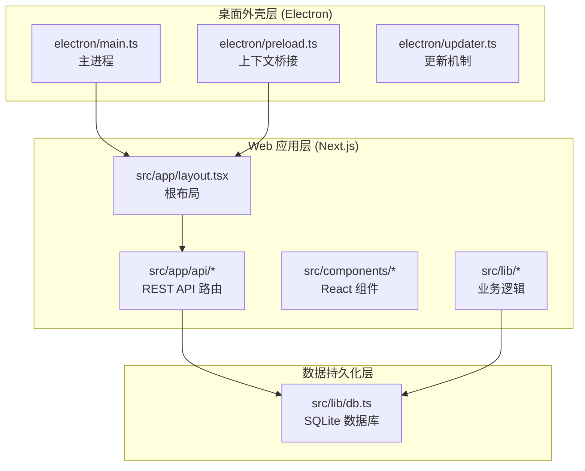
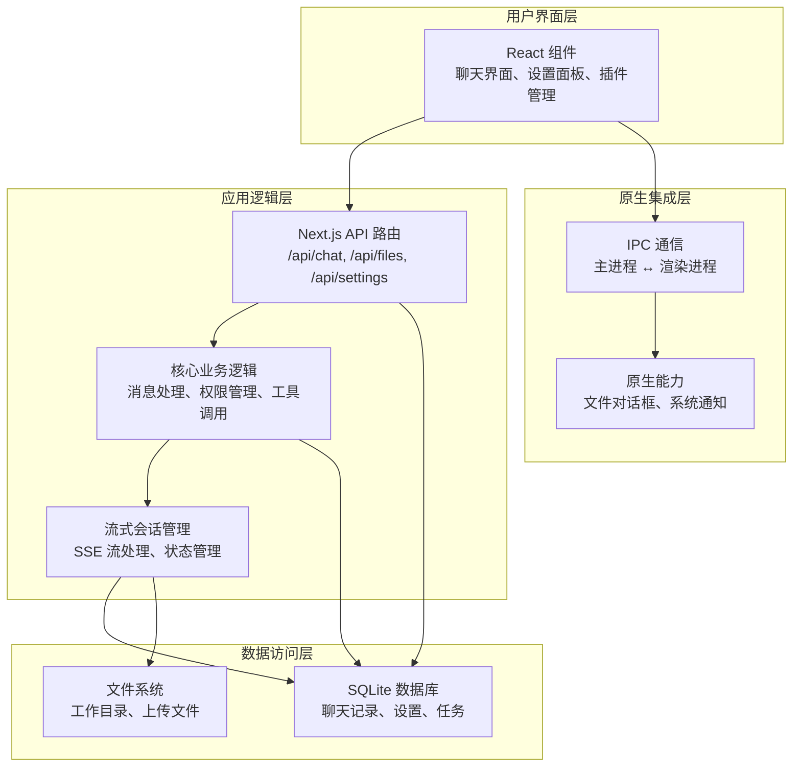
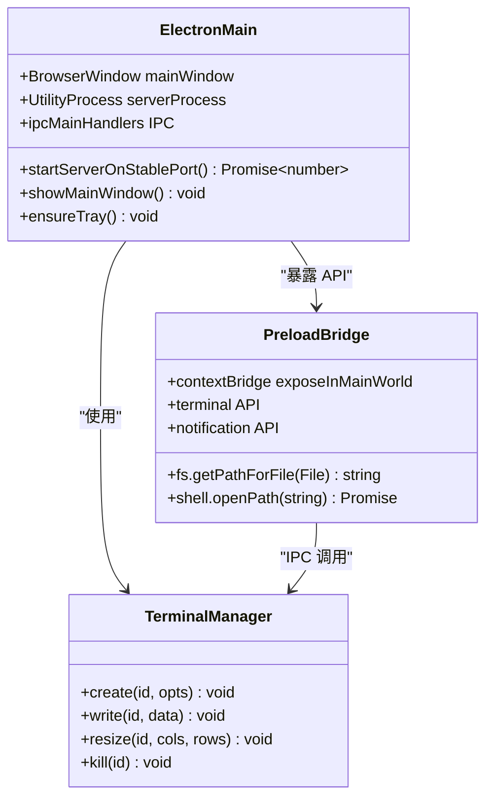
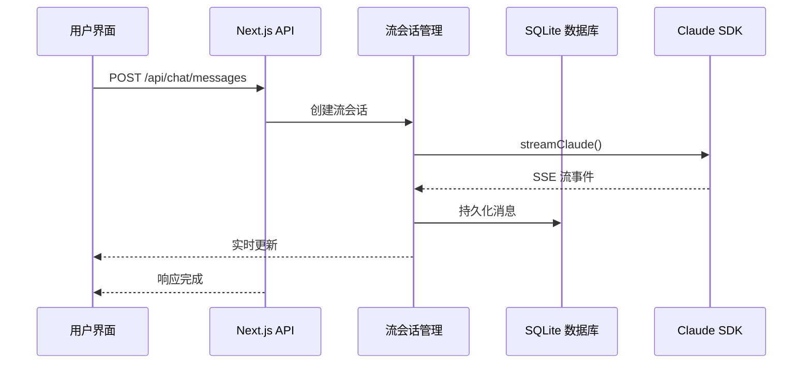
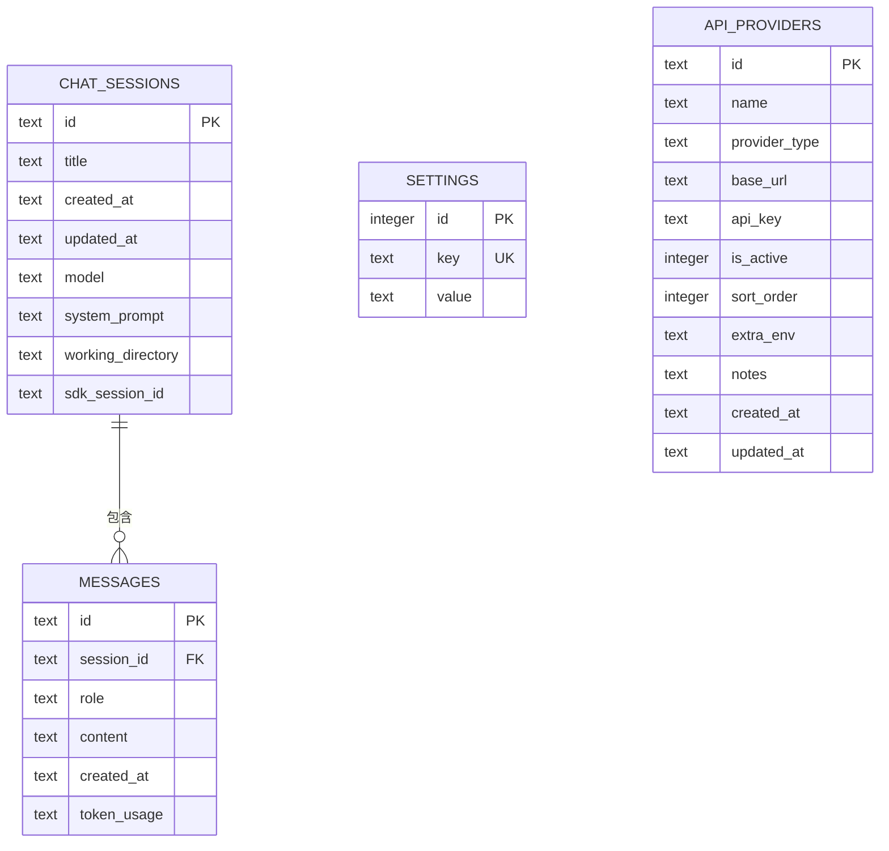
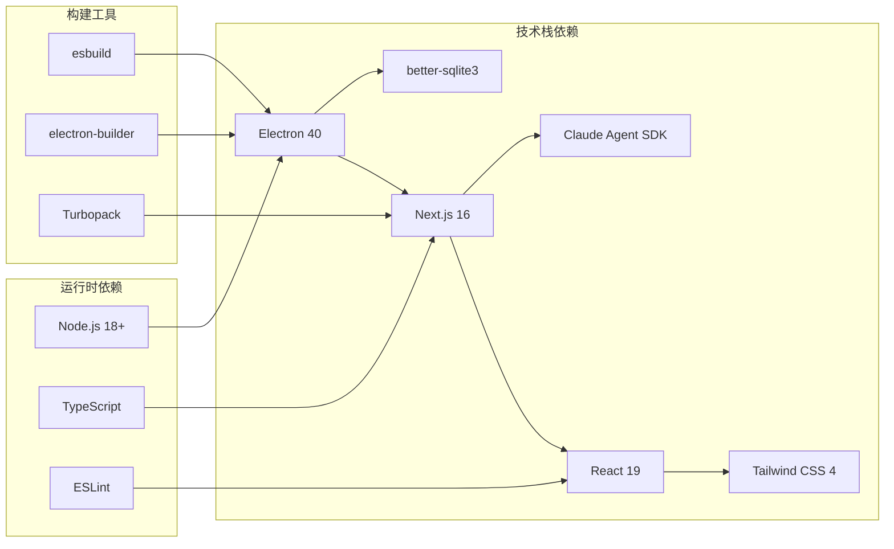

# 整体架构概览

<cite>
**本文档引用的文件**
- [ARCHITECTURE.md](file://ARCHITECTURE.md)
- [README.md](file://README.md)
- [package.json](file://package.json)
- [next.config.ts](file://next.config.ts)
- [electron/main.ts](file://electron/main.ts)
- [electron/preload.ts](file://electron/preload.ts)
- [src/lib/db.ts](file://src/lib/db.ts)
- [src/lib/claude-client.ts](file://src/lib/claude-client.ts)
- [src/lib/stream-session-manager.ts](file://src/lib/stream-session-manager.ts)
- [src/app/layout.tsx](file://src/app/layout.tsx)
- [src/app/api/chat/messages/route.ts](file://src/app/api/chat/messages/route.ts)
</cite>

## 目录
1. [简介](#简介)
2. [项目结构](#项目结构)
3. [核心组件](#核心组件)
4. [架构总览](#架构总览)
5. [详细组件分析](#详细组件分析)
6. [依赖关系分析](#依赖关系分析)
7. [性能考虑](#性能考虑)
8. [故障排除指南](#故障排除指南)
9. [结论](#结论)

## 简介

CodePilot 是一个多模型 AI Agent 桌面客户端，采用 Electron + Next.js 混合架构设计。该架构通过桌面外壳层（Electron）承载应用窗口、系统集成和原生能力，通过 Web 应用层（Next.js App Router + React）提供现代化的用户界面和 API 能力，通过本地数据库层（SQLite）实现数据持久化和离线体验。

该系统的核心优势在于：
- **统一开发体验**：一套代码同时支持浏览器模式和桌面应用模式
- **强大的原生集成**：文件系统访问、系统通知、托盘菜单等原生能力
- **高性能实时通信**：基于 SSE 的流式响应处理
- **灵活的数据持久化**：本地 SQLite 数据库确保数据安全和离线可用性

## 项目结构

**图表来源**
- [electron/main.ts:1-800](file://electron/main.ts#L1-L800)
- [electron/preload.ts:1-118](file://electron/preload.ts#L1-L118)
- [src/app/layout.tsx:1-96](file://src/app/layout.tsx#L1-L96)
- [src/lib/db.ts:1-800](file://src/lib/db.ts#L1-L800)

**章节来源**
- [ARCHITECTURE.md:5-53](file://ARCHITECTURE.md#L5-L53)
- [README.md:181-202](file://README.md#L181-L202)

## 核心组件

### 桌面外壳层 (Electron)

桌面外壳层负责应用的原生宿主环境，提供窗口管理、系统集成和安全沙箱。主要职责包括：

- **应用生命周期管理**：启动、关闭、最小化到托盘等功能
- **原生 API 暴露**：通过 contextBridge 暴露受限的原生能力
- **系统集成**：文件系统访问、系统通知、托盘菜单
- **进程间通信**：IPC 通道实现主进程与渲染进程的通信

### Web 应用层 (Next.js)

Web 应用层提供完整的前端框架和 API 能力：

- **App Router 架构**：基于 Next.js App Router 的现代路由系统
- **React 组件体系**：模块化的 UI 组件设计
- **API 路由系统**：52 个 REST 端点覆盖聊天、媒体、文件、插件、设置等功能
- **国际化支持**：双语界面支持

### 数据持久化层

数据持久化层采用 SQLite 本地数据库：

- **12 张核心表**：涵盖聊天会话、消息、设置、任务、API 提供商等
- **WAL 模式**：提高并发读取性能
- **外键约束**：确保数据一致性
- **自动迁移**：支持数据库结构演进

**章节来源**
- [ARCHITECTURE.md:79-99](file://ARCHITECTURE.md#L79-L99)
- [ARCHITECTURE.md:169-183](file://ARCHITECTURE.md#L169-L183)

## 架构总览

**图表来源**
- [src/app/layout.tsx:28-96](file://src/app/layout.tsx#L28-L96)
- [src/lib/stream-session-manager.ts:1-800](file://src/lib/stream-session-manager.ts#L1-L800)
- [src/lib/db.ts:106-328](file://src/lib/db.ts#L106-L328)

## 详细组件分析

### 桌面外壳组件分析

**图表来源**
- [electron/main.ts:50-800](file://electron/main.ts#L50-L800)
- [electron/preload.ts:1-118](file://electron/preload.ts#L1-L118)

#### 桌面外壳职责分工

- **主进程 (main.ts)**：负责应用生命周期、窗口管理和原生系统集成
- **预加载脚本 (preload.ts)**：通过 contextBridge 暴露受限的原生 API
- **终端管理器**：提供终端创建、写入、调整大小和销毁功能

**章节来源**
- [electron/main.ts:1-800](file://electron/main.ts#L1-L800)
- [electron/preload.ts:1-118](file://electron/preload.ts#L1-L118)

### Web 应用组件分析

**图表来源**
- [src/app/api/chat/messages/route.ts:11-39](file://src/app/api/chat/messages/route.ts#L11-L39)
- [src/lib/stream-session-manager.ts:325-380](file://src/lib/stream-session-manager.ts#L325-L380)
- [src/lib/claude-client.ts:470-668](file://src/lib/claude-client.ts#L470-L668)

#### Web 应用职责分工

- **API 路由层**：处理 HTTP 请求，验证参数，协调业务逻辑
- **流会话管理层**：管理 SSE 流的生命周期，处理实时事件
- **业务逻辑层**：封装 Claude SDK 调用，处理消息持久化
- **数据访问层**：通过 SQLite 实现数据的增删改查

**章节来源**
- [src/app/api/chat/messages/route.ts:1-99](file://src/app/api/chat/messages/route.ts#L1-L99)
- [src/lib/stream-session-manager.ts:1-800](file://src/lib/stream-session-manager.ts#L1-L800)
- [src/lib/claude-client.ts:1-800](file://src/lib/claude-client.ts#L1-L800)

### 数据持久化组件分析

**图表来源**
- [src/lib/db.ts:106-328](file://src/lib/db.ts#L106-L328)

#### 数据库设计特点

- **会话管理**：支持多会话并行，每个会话独立的状态管理
- **消息持久化**：支持文本、思维过程、工具调用等多种内容块
- **提供商标识**：支持多种 AI 提供商的配置和切换
- **索引优化**：针对常用查询场景建立索引提升性能

**章节来源**
- [src/lib/db.ts:106-328](file://src/lib/db.ts#L106-L328)

## 依赖关系分析

**图表来源**
- [package.json:48-117](file://package.json#L48-L117)
- [next.config.ts:5-101](file://next.config.ts#L5-L101)

### 技术选型决策依据

#### Electron 作为桌面外壳

- **跨平台兼容性**：支持 macOS、Windows、Linux 三大主流操作系统
- **原生能力集成**：文件系统访问、系统通知、托盘菜单等原生功能
- **开发效率**：一套代码同时支持桌面和浏览器两种运行模式
- **性能考虑**：通过稳定端口绑定避免 localStorage 丢失问题

#### Next.js 作为前端框架

- **现代开发体验**：App Router 提供更好的路由和数据获取模式
- **SSR/ISR 支持**：静态生成和增量静态再生能力
- **类型安全**：TypeScript 原生支持，强类型保障
- **生态丰富**：庞大的第三方包生态系统

#### SQLite 作为本地数据库

- **零配置部署**：无需额外数据库服务，简化部署流程
- **ACID 特性**：保证数据一致性和可靠性
- **性能表现**：WAL 模式提供更好的并发读取性能
- **便携性**：单文件数据库便于备份和迁移

**章节来源**
- [package.json:48-117](file://package.json#L48-L117)
- [next.config.ts:5-101](file://next.config.ts#L5-L101)
- [ARCHITECTURE.md:169-183](file://ARCHITECTURE.md#L169-L183)

## 性能考虑

### 流式处理优化

系统采用 SSE（Server-Sent Events）实现实时流式响应处理：

- **增量渲染**：支持思维过程、文本内容、工具结果的增量更新
- **内存管理**：流会话管理器独立于组件生命周期，避免内存泄漏
- **超时处理**：智能的空闲超时检测和自动清理机制

### 数据库性能优化

- **WAL 模式**：提高并发读取性能，支持多进程共享
- **索引策略**：为常用查询字段建立索引，优化查询性能
- **事务管理**：合理使用事务确保数据一致性

### 原生集成优化

- **端口稳定性**：固定端口范围避免 localStorage 丢失
- **进程隔离**：主进程和渲染进程分离，提高系统稳定性
- **资源管理**：及时清理临时文件和进程资源

## 故障排除指南

### 常见问题诊断

#### Electron 应用启动问题

- **ABI 不匹配**：检查 better-sqlite3 原生模块与 Electron 版本兼容性
- **端口冲突**：确认 47823-47830 端口范围内无其他应用占用
- **单实例锁**：确保应用正确获取单实例锁，避免重复启动

#### 数据库连接问题

- **文件锁定**：检查是否有多个进程同时访问数据库文件
- **权限问题**：确认应用对 `~/.codepilot/` 目录具有读写权限
- **迁移失败**：查看数据库迁移日志，确认迁移脚本执行状态

#### 流式处理异常

- **SSE 连接中断**：检查网络连接和服务器可达性
- **超时处理**：监控空闲超时和强制中断机制
- **内存泄漏**：定期检查流会话管理器的垃圾回收状态

**章节来源**
- [electron/main.ts:507-555](file://electron/main.ts#L507-L555)
- [src/lib/db.ts:16-50](file://src/lib/db.ts#L16-L50)
- [src/lib/stream-session-manager.ts:113-120](file://src/lib/stream-session-manager.ts#L113-L120)

## 结论

CodePilot 的 Electron + Next.js 混合架构设计充分体现了现代桌面应用开发的最佳实践。通过清晰的分层架构、合理的职责划分和技术选型，系统实现了高性能、可维护性和良好用户体验的平衡。

该架构的主要优势包括：
- **开发效率**：一套代码支持多种运行环境
- **扩展性**：模块化设计便于功能扩展和维护
- **性能表现**：优化的流式处理和数据库访问机制
- **可靠性**：完善的错误处理和故障恢复机制

未来的发展方向可以关注：
- 进一步优化流式处理的性能表现
- 增强插件系统的扩展能力
- 完善云端同步和多设备协同功能
- 提升 AI 集成的智能化程度