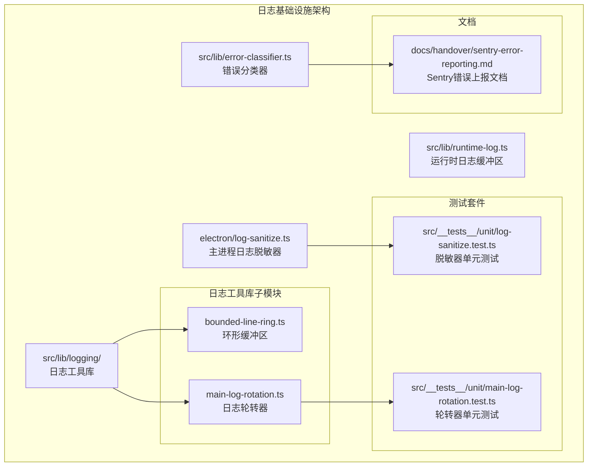
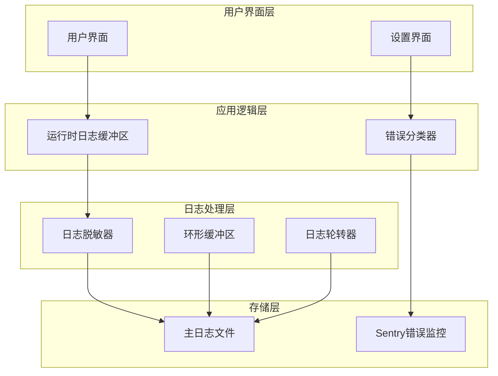
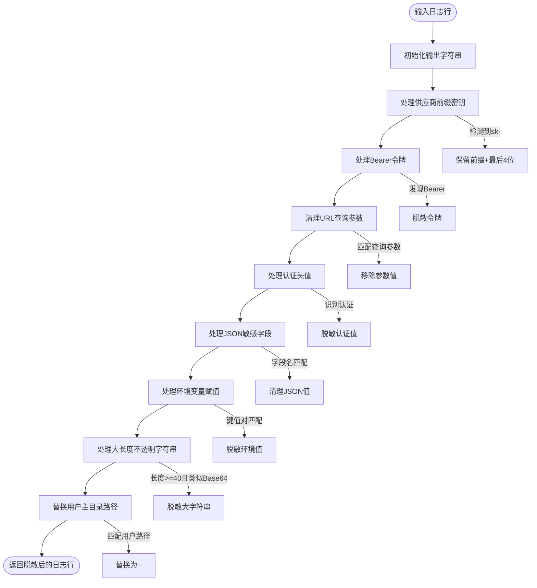
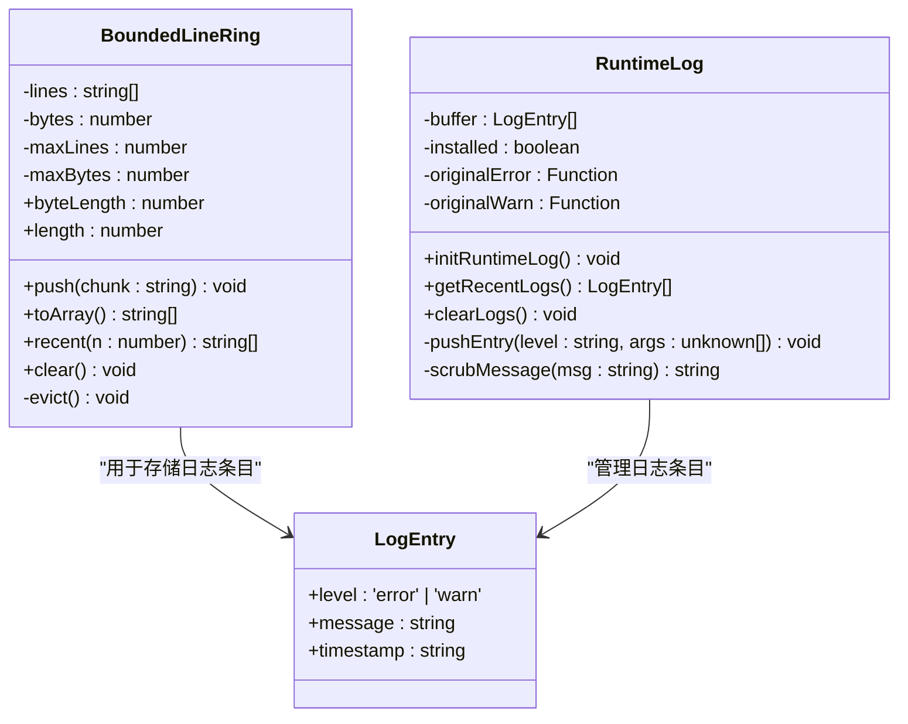
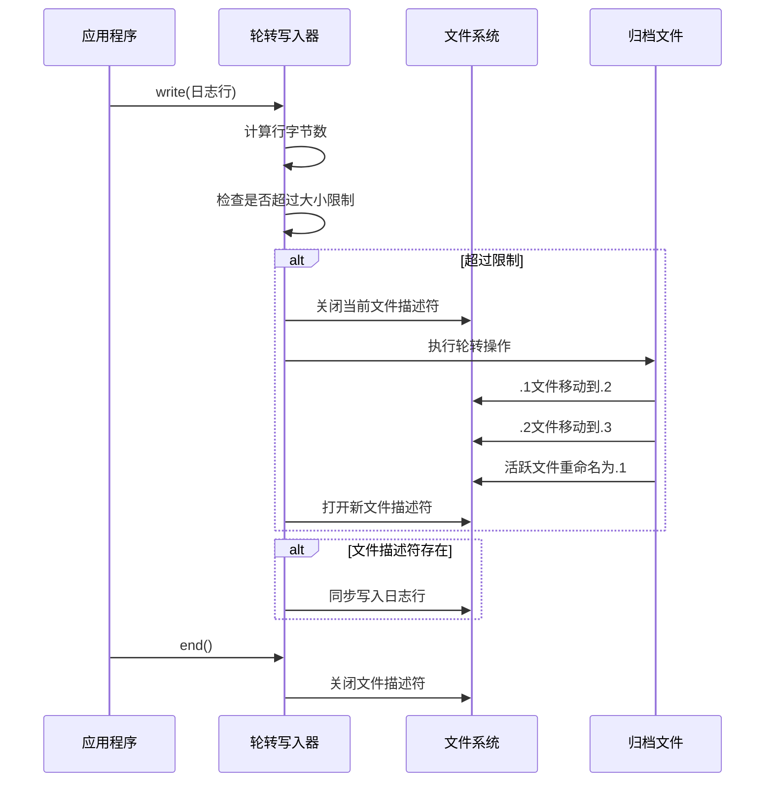
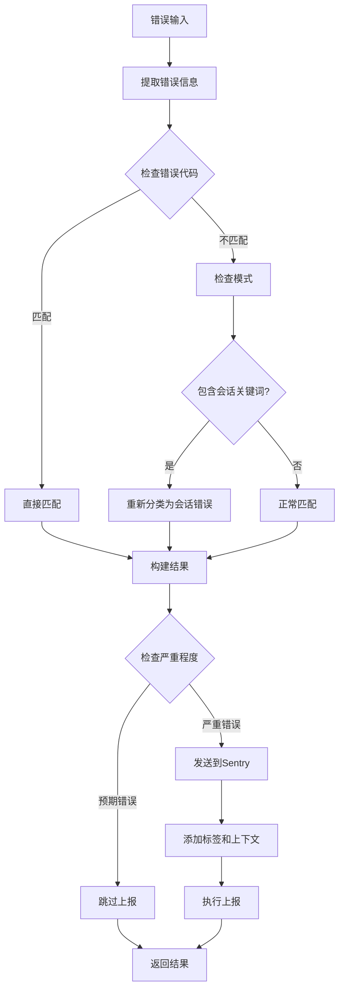

# 日志基础设施

<cite>
**本文档引用的文件**
- [electron/log-sanitize.ts](file://electron/log-sanitize.ts)
- [src/lib/logging/bounded-line-ring.ts](file://src/lib/logging/bounded-line-ring.ts)
- [src/lib/logging/main-log-rotation.ts](file://src/lib/logging/main-log-rotation.ts)
- [src/lib/runtime-log.ts](file://src/lib/runtime-log.ts)
- [src/lib/error-classifier.ts](file://src/lib/error-classifier.ts)
- [src/__tests__/unit/log-sanitize.test.ts](file://src/__tests__/unit/log-sanitize.test.ts)
- [src/__tests__/unit/main-log-rotation.test.ts](file://src/__tests__/unit/main-log-rotation.test.ts)
- [docs/handover/sentry-error-reporting.md](file://docs/handover/sentry-error-reporting.md)
</cite>

## 目录
1. [简介](#简介)
2. [项目结构](#项目结构)
3. [核心组件](#核心组件)
4. [架构概览](#架构概览)
5. [详细组件分析](#详细组件分析)
6. [依赖关系分析](#依赖关系分析)
7. [性能考虑](#性能考虑)
8. [故障排除指南](#故障排除指南)
9. [结论](#结论)

## 简介

CodePilot 项目的日志基础设施是一个多层次、多维度的日志管理系统，旨在提供全面的问题诊断能力、用户支持功能和错误监控。该系统包含三个主要层面：

- **持久化主日志**：记录应用程序运行期间的关键信息，支持敏感数据脱敏和文件轮转
- **运行时日志缓冲区**：拦截并缓冲控制台错误和警告消息
- **错误分类与上报**：智能识别严重错误并进行结构化上报

该基础设施的设计重点在于安全性、性能和用户体验，确保既能提供足够的调试信息，又能保护用户的隐私和安全。

## 项目结构

日志基础设施分布在项目的多个目录中，形成了清晰的分层架构：



**图表来源**
- [electron/log-sanitize.ts:1-200](file://electron/log-sanitize.ts#L1-L200)
- [src/lib/logging/bounded-line-ring.ts:1-70](file://src/lib/logging/bounded-line-ring.ts#L1-L70)
- [src/lib/logging/main-log-rotation.ts:1-122](file://src/lib/logging/main-log-rotation.ts#L1-L122)
- [src/lib/runtime-log.ts:1-115](file://src/lib/runtime-log.ts#L1-L115)
- [src/lib/error-classifier.ts:1-532](file://src/lib/error-classifier.ts#L1-L532)

**章节来源**
- [electron/log-sanitize.ts:1-200](file://electron/log-sanitize.ts#L1-L200)
- [src/lib/logging/bounded-line-ring.ts:1-70](file://src/lib/logging/bounded-line-ring.ts#L1-L70)
- [src/lib/logging/main-log-rotation.ts:1-122](file://src/lib/logging/main-log-rotation.ts#L1-L122)
- [src/lib/runtime-log.ts:1-115](file://src/lib/runtime-log.ts#L1-L115)
- [src/lib/error-classifier.ts:1-532](file://src/lib/error-classifier.ts#L1-L532)

## 核心组件

### 1. 敏感数据脱敏器 (Log Sanitizer)

负责清理日志文件中的敏感信息，确保用户隐私和安全：

- **API密钥脱敏**：支持多种供应商前缀格式（sk-、ghp_、hf_等）
- **Bearer令牌处理**：标准化脱敏格式
- **URL查询参数清理**：移除敏感查询参数值
- **JSON字段脱敏**：基于字段名称识别敏感信息
- **路径替换**：将用户主目录替换为~

### 2. 环形缓冲区 (Bounded Line Ring)

内存中的日志缓冲机制，防止内存泄漏：

- **固定容量限制**：同时限制行数和字节数
- **自动驱逐机制**：超出限制时自动移除最旧条目
- **纯内存操作**：便于单元测试和性能优化

### 3. 日志轮转器 (Rotating Log Writer)

文件系统级别的日志管理：

- **大小限制**：防止单个日志文件无限增长
- **归档管理**：维护固定数量的历史文件
- **同步写入**：确保数据完整性和一致性

### 4. 运行时日志缓冲区

拦截和缓冲控制台输出：

- **全局状态管理**：使用globalThis模式避免HMR重载丢失
- **双级别缓冲**：区分error和warn级别
- **消息脱敏**：对缓冲的消息进行敏感信息清理

### 5. 错误分类系统

智能错误识别和上报机制：

- **严重错误分类**：定义可上报的错误类型集合
- **上下文信息提取**：从错误中提取有用诊断信息
- **结构化上报**：向Sentry发送结构化的错误报告

**章节来源**
- [electron/log-sanitize.ts:155-199](file://electron/log-sanitize.ts#L155-L199)
- [src/lib/logging/bounded-line-ring.ts:16-69](file://src/lib/logging/bounded-line-ring.ts#L16-L69)
- [src/lib/logging/main-log-rotation.ts:69-121](file://src/lib/logging/main-log-rotation.ts#L69-L121)
- [src/lib/runtime-log.ts:23-114](file://src/lib/runtime-log.ts#L23-L114)
- [src/lib/error-classifier.ts:10-51](file://src/lib/error-classifier.ts#L10-L51)

## 架构概览

日志基础设施采用分层设计，每层都有明确的职责和边界：



**图表来源**
- [src/lib/runtime-log.ts:85-114](file://src/lib/runtime-log.ts#L85-L114)
- [src/lib/error-classifier.ts:18-51](file://src/lib/error-classifier.ts#L18-L51)
- [electron/log-sanitize.ts:155-199](file://electron/log-sanitize.ts#L155-L199)
- [src/lib/logging/bounded-line-ring.ts:16-69](file://src/lib/logging/bounded-line-ring.ts#L16-L69)
- [src/lib/logging/main-log-rotation.ts:69-121](file://src/lib/logging/main-log-rotation.ts#L69-L121)

## 详细组件分析

### 敏感数据脱敏器详细分析

脱敏器实现了多层次的安全防护机制：



**图表来源**
- [electron/log-sanitize.ts:155-199](file://electron/log-sanitize.ts#L155-L199)

脱敏规则优先级和处理流程：

1. **供应商前缀密钥**：首先处理已知的API密钥格式
2. **Bearer令牌**：标准化处理Bearer类型的访问令牌
3. **URL查询参数**：清理可能泄露的查询字符串参数
4. **认证头值**：处理HTTP请求头中的认证信息
5. **JSON敏感字段**：基于字段名称识别敏感数据
6. **环境变量赋值**：处理命令行或配置文件中的敏感设置
7. **大长度不透明字符串**：使用启发式算法识别潜在的令牌
8. **用户路径**：替换系统特定的用户路径信息

**章节来源**
- [electron/log-sanitize.ts:12-33](file://electron/log-sanitize.ts#L12-L33)
- [electron/log-sanitize.ts:61-76](file://electron/log-sanitize.ts#L61-L76)
- [electron/log-sanitize.ts:97-106](file://electron/log-sanitize.ts#L97-L106)
- [electron/log-sanitize.ts:155-199](file://electron/log-sanitize.ts#L155-L199)

### 环形缓冲区组件分析

环形缓冲区提供了高效的内存日志管理：



**图表来源**
- [src/lib/logging/bounded-line-ring.ts:16-69](file://src/lib/logging/bounded-line-ring.ts#L16-L69)
- [src/lib/runtime-log.ts:7-21](file://src/lib/runtime-log.ts#L7-L21)
- [src/lib/runtime-log.ts:58-79](file://src/lib/runtime-log.ts#L58-L79)

环形缓冲区的核心特性：

- **双重限制**：同时限制最大行数和最大字节数
- **自动驱逐**：超出任一限制时自动移除最旧条目
- **内存效率**：纯内存操作，便于单元测试
- **线程安全**：适合在单线程环境中使用

**章节来源**
- [src/lib/logging/bounded-line-ring.ts:16-69](file://src/lib/logging/bounded-line-ring.ts#L16-L69)
- [src/lib/runtime-log.ts:13-34](file://src/lib/runtime-log.ts#L13-L34)

### 日志轮转器组件分析

日志轮转器确保日志文件不会无限增长：



**图表来源**
- [src/lib/logging/main-log-rotation.ts:69-121](file://src/lib/logging/main-log-rotation.ts#L69-L121)

轮转器的关键设计决策：

- **同步写入**：使用同步文件操作确保数据完整性
- **最佳努力策略**：即使轮转失败也不影响日志记录
- **Windows兼容性**：先关闭文件句柄再重命名，避免锁定问题
- **即时轮转**：对于已超过限制的遗留文件立即轮转

**章节来源**
- [src/lib/logging/main-log-rotation.ts:20-33](file://src/lib/logging/main-log-rotation.ts#L20-L33)
- [src/lib/logging/main-log-rotation.ts:69-121](file://src/lib/logging/main-log-rotation.ts#L69-L121)

### 错误分类系统详细分析

错误分类系统提供了智能的错误识别和处理机制：



**图表来源**
- [src/lib/error-classifier.ts:370-431](file://src/lib/error-classifier.ts#L370-L431)
- [src/lib/error-classifier.ts:18-51](file://src/lib/error-classifier.ts#L18-L51)

错误分类的关键特性：

- **多层匹配**：优先检查错误代码，然后检查文本模式
- **智能重新分类**：根据stderr内容重新评估PROCESS_CRASH错误
- **选择性上报**：只上报严重和意外的错误
- **结构化上下文**：为Sentry提供丰富的错误上下文信息

**章节来源**
- [src/lib/error-classifier.ts:10-16](file://src/lib/error-classifier.ts#L10-L16)
- [src/lib/error-classifier.ts:356-362](file://src/lib/error-classifier.ts#L356-L362)
- [src/lib/error-classifier.ts:370-431](file://src/lib/error-classifier.ts#L370-L431)

## 依赖关系分析

日志基础设施各组件之间的依赖关系清晰且层次分明：

```mermaid
graph TB
subgraph "外部依赖"
NodeFS[node:fs]
Sentry[@sentry/*]
Console[console对象]
end
subgraph "内部组件"
Sanitizer[log-sanitize.ts]
RingBuffer[bounded-line-ring.ts]
Rotator[main-log-rotation.ts]
RuntimeLog[runtime-log.ts]
ErrorClassifier[error-classifier.ts]
end
subgraph "测试组件"
SanitizeTest[log-sanitize.test.ts]
RotationTest[main-log-rotation.test.ts]
end
NodeFS --> Rotator
Console --> RuntimeLog
Sanitizer --> SanitizeTest
Rotator --> RotationTest
Sanitizer -.->|数据脱敏| RuntimeLog
RingBuffer -.->|内存缓冲| RuntimeLog
Rotator -.->|文件轮转| Sanitizer
ErrorClassifier -.->|错误上报| Sentry
```

**图表来源**
- [electron/log-sanitize.ts:35](file://electron/log-sanitize.ts#L35)
- [src/lib/logging/main-log-rotation.ts:13](file://src/lib/logging/main-log-rotation.ts#L13)
- [src/lib/runtime-log.ts:85-100](file://src/lib/runtime-log.ts#L85-L100)
- [src/lib/error-classifier.ts:34-49](file://src/lib/error-classifier.ts#L34-L49)

依赖关系特点：

- **单向依赖**：日志处理组件之间保持单向依赖，避免循环引用
- **最小依赖**：每个组件只依赖必要的外部库
- **测试隔离**：测试文件独立于生产代码，便于单元测试
- **渐进式初始化**：组件按需初始化，不影响启动性能

**章节来源**
- [electron/log-sanitize.ts:35-41](file://electron/log-sanitize.ts#L35-L41)
- [src/lib/logging/main-log-rotation.ts:13](file://src/lib/logging/main-log-rotation.ts#L13)
- [src/lib/runtime-log.ts:85-100](file://src/lib/runtime-log.ts#L85-L100)

## 性能考虑

日志基础设施在设计时充分考虑了性能影响：

### 内存管理
- **环形缓冲区**：固定内存占用，避免内存泄漏
- **字节限制**：双重约束防止内存过度使用
- **及时清理**：超出限制时立即驱逐最旧条目

### I/O优化
- **同步写入**：确保数据完整性的同时减少缓冲开销
- **文件描述符复用**：避免频繁的文件句柄创建/销毁
- **轮转最佳努力**：即使失败也不阻塞日志记录

### 处理效率
- **正则表达式预编译**：提高匹配性能
- **启发式算法**：快速识别潜在的敏感信息
- **延迟初始化**：按需加载Sentry等第三方库

### 并发安全
- **单线程设计**：避免锁竞争和死锁
- **不可变数据**：减少数据竞争风险
- **原子操作**：确保状态一致性

## 故障排除指南

### 常见问题及解决方案

#### 1. 日志文件过大
**症状**：应用程序启动缓慢或磁盘空间不足
**原因**：日志文件未正确轮转
**解决方法**：
- 检查轮转配置是否正确
- 验证文件权限设置
- 手动触发轮转操作

#### 2. 敏感信息泄露
**症状**：日志中包含API密钥或个人数据
**原因**：新的敏感信息格式未被识别
**解决方法**：
- 更新脱敏规则
- 添加相应的测试用例
- 重新部署应用

#### 3. 内存使用过高
**症状**：应用程序内存持续增长
**原因**：环形缓冲区配置不当
**解决方法**：
- 调整缓冲区大小限制
- 检查是否有内存泄漏
- 优化日志记录频率

#### 4. 错误上报异常
**症状**：错误没有正确上报到Sentry
**原因**：Sentry配置问题或网络连接异常
**解决方法**：
- 检查DSN配置
- 验证网络连接
- 查看Sentry错误日志

**章节来源**
- [src/__tests__/unit/main-log-rotation.test.ts:28-52](file://src/__tests__/unit/main-log-rotation.test.ts#L28-L52)
- [src/__tests__/unit/log-sanitize.test.ts:18-41](file://src/__tests__/unit/log-sanitize.test.ts#L18-L41)

### 调试技巧

#### 1. 启用详细日志
- 在开发环境中增加日志级别
- 使用条件断点定位问题
- 分析日志时间戳序列

#### 2. 测试覆盖验证
- 运行完整的单元测试套件
- 验证脱敏规则的准确性
- 检查边界条件处理

#### 3. 性能监控
- 监控内存使用情况
- 分析I/O操作频率
- 评估CPU使用率

**章节来源**
- [src/__tests__/unit/log-sanitize.test.ts:212-220](file://src/__tests__/unit/log-sanitize.test.ts#L212-L220)
- [src/__tests__/unit/main-log-rotation.test.ts:18-25](file://src/__tests__/unit/main-log-rotation.test.ts#L18-L25)

## 结论

CodePilot项目的日志基础设施展现了现代应用程序日志管理的最佳实践。通过多层次的设计和精心的实现，该系统在保证功能完整性的同时，充分考虑了安全性、性能和用户体验。

### 主要优势

1. **全面的安全保障**：多层次的敏感信息脱敏机制确保用户隐私安全
2. **高效的资源管理**：智能的内存和磁盘使用策略防止资源浪费
3. **可靠的错误监控**：结构化的错误分类和上报机制提升问题诊断效率
4. **良好的扩展性**：模块化设计便于功能扩展和维护

### 技术亮点

- **双层轮转机制**：既保证了日志的完整性，又防止了资源滥用
- **智能错误分类**：能够准确识别严重错误并进行选择性上报
- **内存友好的设计**：环形缓冲区有效防止内存泄漏
- **严格的测试覆盖**：完善的单元测试确保代码质量

### 改进建议

1. **增强实时监控**：可以考虑添加实时日志流功能
2. **优化性能指标**：增加更详细的性能监控和分析
3. **扩展告警机制**：添加更灵活的告警和通知功能
4. **增强可视化**：提供更好的日志查看和分析界面

该日志基础设施为CodePilot项目提供了坚实的技术基础，能够有效支持日常开发、问题诊断和用户支持工作。