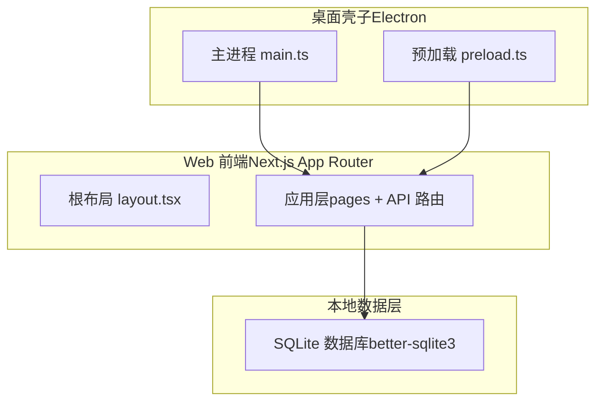
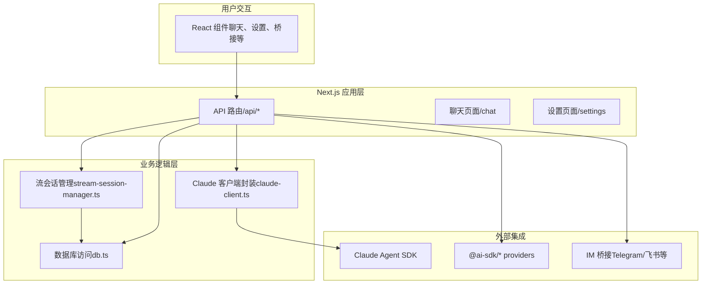
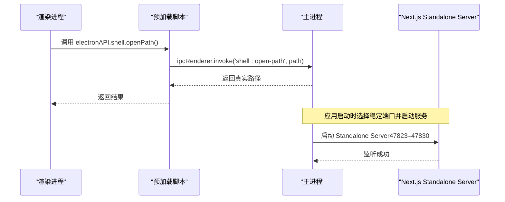
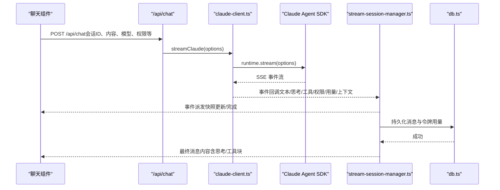
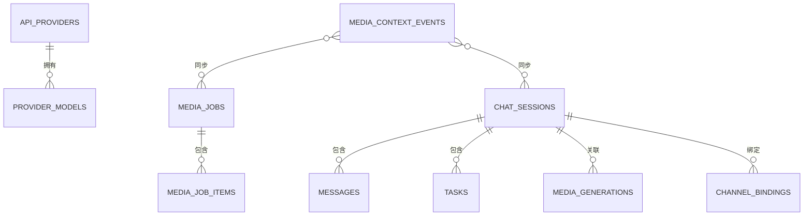
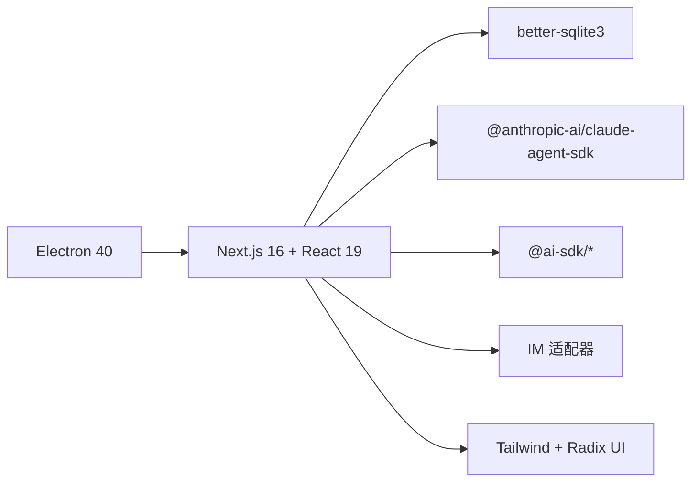

# 架构设计

<cite>
**本文引用的文件**
- [ARCHITECTURE.md](file://ARCHITECTURE.md)
- [README.md](file://README.md)
- [package.json](file://package.json)
- [electron/main.ts](file://electron/main.ts)
- [electron/preload.ts](file://electron/preload.ts)
- [src/app/layout.tsx](file://src/app/layout.tsx)
- [src/lib/db.ts](file://src/lib/db.ts)
- [src/lib/claude-client.ts](file://src/lib/claude-client.ts)
- [src/lib/stream-session-manager.ts](file://src/lib/stream-session-manager.ts)
- [src/types/index.ts](file://src/types/index.ts)
</cite>

## 目录
1. [简介](#简介)
2. [项目结构](#项目结构)
3. [核心组件](#核心组件)
4. [架构总览](#架构总览)
5. [详细组件分析](#详细组件分析)
6. [依赖关系分析](#依赖关系分析)
7. [性能考量](#性能考量)
8. [故障排查指南](#故障排查指南)
9. [结论](#结论)
10. [附录](#附录)

## 简介
本架构设计文档面向 CodePilot 的混合桌面应用（Electron + Next.js App Router）进行系统性梳理，重点阐述：
- 整体系统架构与技术选型
- 分层架构、模块化与组件化组织
- 数据流与状态管理、事件驱动机制
- 系统边界、组件交互与数据流向
- 技术决策权衡、性能优化与可扩展性
- 架构演进背景与未来规划

## 项目结构
CodePilot 采用“桌面壳子 + Web 前端 + 本地数据库”的三层组合：
- 桌面壳子（Electron 主进程与预加载脚本）
- Web 前端（Next.js App Router + React 19）
- 本地持久化（better-sqlite3 + WAL）

图表来源
- [electron/main.ts:1-2389](file://electron/main.ts#L1-L2389)
- [electron/preload.ts:1-118](file://electron/preload.ts#L1-L118)
- [src/app/layout.tsx:1-96](file://src/app/layout.tsx#L1-L96)
- [src/lib/db.ts:1-4126](file://src/lib/db.ts#L1-L4126)

章节来源
- [ARCHITECTURE.md:1-183](file://ARCHITECTURE.md#L1-L183)
- [README.md:1-289](file://README.md#L1-L289)
- [package.json:1-157](file://package.json#L1-L157)

## 核心组件
- 桌面壳子（Electron）
  - 主进程负责窗口生命周期、系统托盘、通知、子进程（Next.js Standalone Server）、原生能力暴露等。
  - 预加载脚本通过 contextBridge 暴露受限 API 至渲染进程，包括文件系统、对话框、终端、通知等。
- Web 前端（Next.js App Router）
  - 根布局负责主题、国际化、图标、平台检测与 AppShell 包裹。
  - 应用层包含页面与 API 路由，统一对外提供 REST 接口。
- 本地数据层（SQLite）
  - better-sqlite3 + WAL 模式，提供聊天会话、消息、任务、媒体、桥接通道等多张表。

章节来源
- [electron/main.ts:1-2389](file://electron/main.ts#L1-L2389)
- [electron/preload.ts:1-118](file://electron/preload.ts#L1-L118)
- [src/app/layout.tsx:1-96](file://src/app/layout.tsx#L1-L96)
- [src/lib/db.ts:1-4126](file://src/lib/db.ts#L1-L4126)

## 架构总览
混合架构优势：
- Electron 提供原生窗口、托盘、通知、系统集成与安全沙箱。
- Next.js App Router 提供现代 Web 开发体验、SSR/Streaming、API 路由与强类型路由。
- 本地 SQLite 保障数据隐私与离线可用性。

图表来源
- [src/lib/claude-client.ts:1-2578](file://src/lib/claude-client.ts#L1-L2578)
- [src/lib/stream-session-manager.ts:1-1164](file://src/lib/stream-session-manager.ts#L1-L1164)
- [src/lib/db.ts:1-4126](file://src/lib/db.ts#L1-L4126)
- [src/app/layout.tsx:1-96](file://src/app/layout.tsx#L1-L96)

章节来源
- [ARCHITECTURE.md:55-183](file://ARCHITECTURE.md#L55-L183)

## 详细组件分析

### 1) Electron 主进程与预加载
- 主进程职责
  - 窗口生命周期与托盘菜单
  - 启动/停止内置的 Next.js Standalone Server（稳定端口策略）
  - 本地通知轮询（窗口隐藏时）
  - 原生模块 ABI 兼容性检查
  - 子进程环境注入与代理解析
- 预加载脚本职责
  - 通过 contextBridge 暴露受限 API（文件路径解析、打开文件夹、日志路径、安装流程、通知、终端、小部件导出等）
  - 与主进程通过 IPC 通信

图表来源
- [electron/preload.ts:1-118](file://electron/preload.ts#L1-L118)
- [electron/main.ts:1-2389](file://electron/main.ts#L1-L2389)

章节来源
- [electron/main.ts:1-2389](file://electron/main.ts#L1-L2389)
- [electron/preload.ts:1-118](file://electron/preload.ts#L1-L118)

### 2) Next.js 根布局与主题/国际化
- 根布局负责：
  - 平台检测（浏览器/桌面壳子）与样式层注入
  - 主题家族与主题模式持久化（DB 与 localStorage 双向）
  - 国际化提供者、图标提供者、AppShell 包裹
- 通过脚本在首屏注入 data-* 属性，避免 FOUC

章节来源
- [src/app/layout.tsx:1-96](file://src/app/layout.tsx#L1-L96)

### 3) 聊天数据流与状态管理
- 用户输入 → API 路由 → Claude 客户端封装 → Agent SDK 流 → 流会话管理器 → SSE 订阅 → 组件渲染 → 数据库持久化
- 流会话管理器以全局单例形式维持 SSE 流状态，独立于组件生命周期；支持思考内容、工具调用、权限请求、令牌用量、上下文压缩等事件

图表来源
- [src/lib/claude-client.ts:1-2578](file://src/lib/claude-client.ts#L1-L2578)
- [src/lib/stream-session-manager.ts:1-1164](file://src/lib/stream-session-manager.ts#L1-L1164)
- [src/lib/db.ts:1-4126](file://src/lib/db.ts#L1-L4126)

章节来源
- [ARCHITECTURE.md:55-77](file://ARCHITECTURE.md#L55-L77)
- [src/lib/claude-client.ts:1-2578](file://src/lib/claude-client.ts#L1-L2578)
- [src/lib/stream-session-manager.ts:1-1164](file://src/lib/stream-session-manager.ts#L1-L1164)

### 4) 数据库与类型系统
- 数据库
  - better-sqlite3 + WAL 模式，外键约束开启，支持聊天会话、消息、任务、媒体、桥接通道等
  - 启动时自动迁移与锁机制，避免构建并发冲突
- 类型系统
  - 统一定义聊天会话、消息、任务、媒体、令牌用量、Provider、模型等核心类型
  - 支持运行时兼容矩阵（不同 Runtime 对模型的支持情况）

图表来源
- [src/lib/db.ts:106-328](file://src/lib/db.ts#L106-L328)
- [src/types/index.ts:17-273](file://src/types/index.ts#L17-L273)

章节来源
- [ARCHITECTURE.md:79-99](file://ARCHITECTURE.md#L79-L99)
- [src/lib/db.ts:1-4126](file://src/lib/db.ts#L1-L4126)
- [src/types/index.ts:1-800](file://src/types/index.ts#L1-L800)

### 5) 桥接系统（远程 IM 控制）
- 核心组件
  - 适配器抽象与注册工厂、消息路由、会话消费与保存、权限请求桥接、消息分片与速率限制、交付层
  - Channel Plugin 层（飞书等）提供模块化插件合约
- 数据流
  - IM 消息 → 适配器接收 → 路由到 CodePilot 会话 → SDK SSE 响应 → 交付层格式化与分片 → IM 发送

章节来源
- [ARCHITECTURE.md:100-141](file://ARCHITECTURE.md#L100-L141)

## 依赖关系分析
- 技术栈概览
  - 桌面壳子：Electron 40
  - 前端框架：Next.js 16（App Router）+ React 19
  - 样式：Tailwind CSS 4 + Radix UI
  - 数据库：better-sqlite3（WAL）
  - AI 集成：Claude Agent SDK、@ai-sdk/* providers
  - IM 集成：Telegram Bot API、飞书 SDK
  - 打包：electron-builder
  - 测试：Playwright（E2E）、tsx + node:test（单元）

图表来源
- [package.json:48-117](file://package.json#L48-L117)
- [ARCHITECTURE.md:169-183](file://ARCHITECTURE.md#L169-L183)

章节来源
- [package.json:1-157](file://package.json#L1-L157)
- [ARCHITECTURE.md:169-183](file://ARCHITECTURE.md#L169-L183)

## 性能考量
- 端口稳定性与 localStorage 一致性
  - 使用稳定端口范围（47823–47830）避免每次重启导致 localStorage origin 变更，减少 UI 状态丢失风险
- 流式渲染节流
  - 文本输出采用节流策略，降低频繁重渲染带来的性能压力
- 数据库 WAL 与索引
  - WAL 模式提升并发读取性能；合理索引覆盖高频查询（消息、会话、媒体、桥接）
- 进程与 ABI 兼容
  - 主进程在打包后检查 native 模块 ABI 兼容性，避免运行时崩溃
- 代理与环境变量
  - 通过系统代理解析与用户 shell 环境合并，确保子进程具备完整凭据与网络配置

章节来源
- [electron/main.ts:717-795](file://electron/main.ts#L717-L795)
- [src/lib/stream-session-manager.ts:401-428](file://src/lib/stream-session-manager.ts#L401-L428)
- [src/lib/db.ts:97-104](file://src/lib/db.ts#L97-L104)
- [electron/main.ts:507-555](file://electron/main.ts#L507-L555)
- [electron/main.ts:598-630](file://electron/main.ts#L598-L630)

## 故障排查指南
- 本地通知未显示
  - 主进程在窗口隐藏时轮询后台通知队列并通过原生通知展示；若未显示，检查系统通知权限与主进程日志
- ABI 不匹配导致崩溃
  - 打包后主进程会尝试加载 native 模块并校验 ABI，不匹配时弹窗提示并退出
- 端口占用导致启动失败
  - 主进程使用稳定端口策略，若全部占用则回落至动态端口；动态端口会导致 localStorage origin 变化
- Provider 未生效或模型不可用
  - 使用内置诊断工具检查连通性与凭据有效性；必要时切换默认 Provider 或刷新模型列表
- 桥接通道异常
  - 检查通道绑定、轮询偏移、去重表与审计日志；确认适配器与交付层配置正确

章节来源
- [electron/main.ts:388-492](file://electron/main.ts#L388-L492)
- [electron/main.ts:507-555](file://electron/main.ts#L507-L555)
- [electron/main.ts:717-795](file://electron/main.ts#L717-L795)
- [ARCHITECTURE.md:167-168](file://ARCHITECTURE.md#L167-L168)

## 结论
CodePilot 的混合架构在保证 Web 开发体验的同时，借助 Electron 提供原生能力与系统集成，结合本地 SQLite 实现数据隐私与离线可用。通过分层设计（壳子/前端/数据层）、模块化组织与事件驱动的状态管理，系统在可扩展性、性能与可维护性之间取得平衡。未来可在运行时兼容矩阵、桥接通道标准化与跨平台打包优化方面持续演进。

## 附录
- 新增功能标准触及点
  - 类型定义、数据库、API 路由、页面、组件、Hook、国际化、桥接等
- 关键文档索引
  - 桥接系统、Agent 工具集成、SDK 集成调研、上下文存储迁移、技术债务等

章节来源
- [ARCHITECTURE.md:142-168](file://ARCHITECTURE.md#L142-L168)