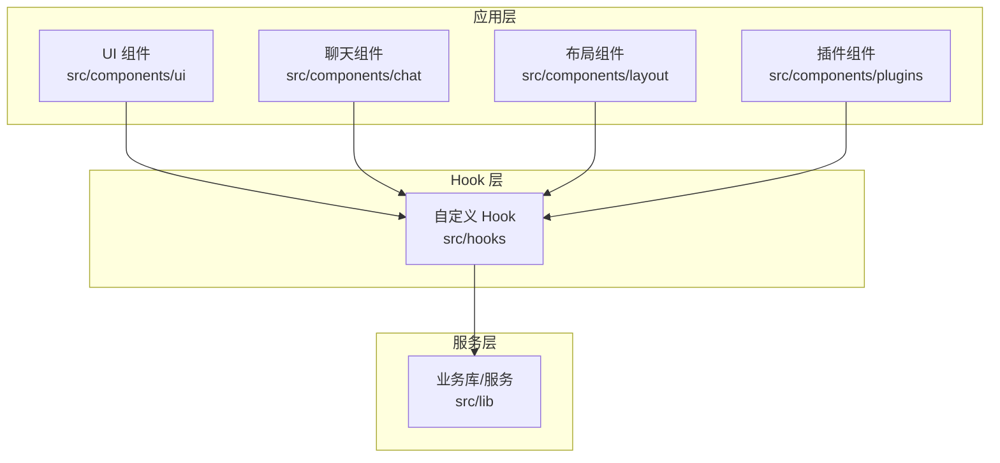
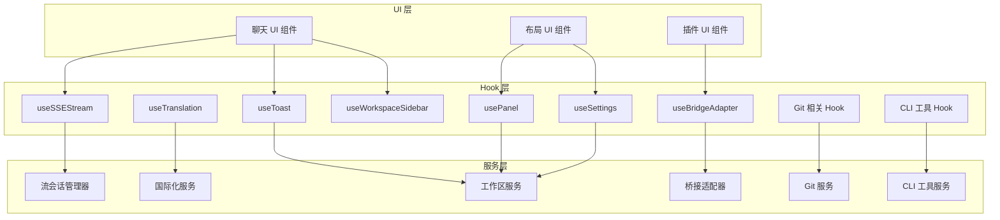
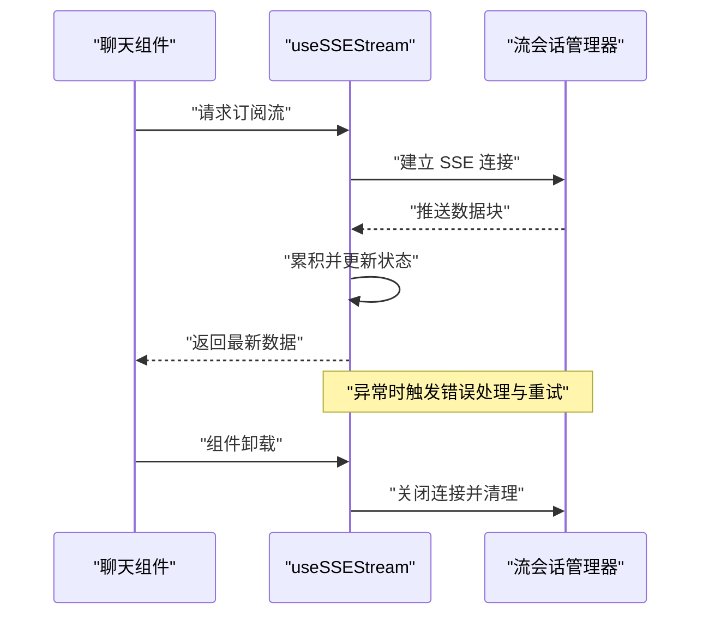
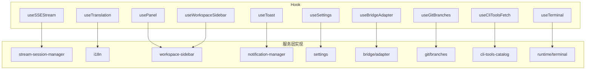

# 组件设计模式

<cite>
**本文引用的文件**
- [README.md](file://README.md)
- [ARCHITECTURE.md](file://ARCHITECTURE.md)
- [ui 组件入口](file://src/components/ui/index.tsx)
- [聊天组件入口](file://src/components/chat/index.tsx)
- [布局组件入口](file://src/components/layout/index.tsx)
- [插件组件入口](file://src/components/plugins/index.tsx)
- [useSSEStream 钩子](file://src/hooks/useSSEStream.ts)
- [useTranslation 钩子](file://src/hooks/useTranslation.ts)
- [usePanel 钩子](file://src/hooks/usePanel.ts)
- [useStreamSubscription 钩子](file://src/hooks/useStreamSubscription.ts)
- [useToast 钩子](file://src/hooks/useToast.ts)
- [useSettings 钩子](file://src/hooks/useSettings.ts)
- [useWorkspaceSidebar 钩子](file://src/hooks/useWorkspaceSidebar.tsx)
- [useAssistantWorkspace 钩子](file://src/hooks/useAssistantWorkspace.ts)
- [useBridgeStatus 钩子](file://src/hooks/useBridgeStatus.ts)
- [useClaudeStatus 钩子](file://src/hooks/useClaudeStatus.ts)
- [useTerminal 钩子](file://src/hooks/useTerminal.ts)
- [usePopoverState 钩子](file://src/hooks/usePopoverState.ts)
- [useSplit 钩子](file://src/hooks/useSplit.ts)
- [useTabFromHash 钩子](file://src/hooks/useTabFromHash.ts)
- [useNotificationPoll 钩子](file://src/hooks/useNotificationPoll.ts)
- [useNotificationClickRoute 钩子](file://src/hooks/useNotificationClickRoute.ts)
- [useClientPlatform 钩子](file://src/hooks/useClientPlatform.ts)
- [useGlobalSearchShortcut 钩子](file://src/hooks/useGlobalSearchShortcut.ts)
- [useProviderModels 钩子](file://src/hooks/useProviderModels.ts)
- [useMentionTokenEstimate 钩子](file://src/hooks/useMentionTokenEstimate.ts)
- [useNativeFolderPicker 钩子](file://src/hooks/useNativeFolderPicker.ts)
- [useGitBranches 钩子](file://src/hooks/useGitBranches.ts)
- [useGitLog 钩子](file://src/hooks/useGitLog.ts)
- [useGitStatus 钩子](file://src/hooks/useGitStatus.ts)
- [useGitWorktrees 钩子](file://src/hooks/useGitWorktrees.ts)
- [useCliToolsFetch 钩子](file://src/hooks/useCliToolsFetch.ts)
- [useCommandBadge 钩子](file://src/hooks/useCommandBadge.ts)
- [useSlashCommands 钩子](file://src/hooks/useSlashCommands.ts)
- [useChatCommands 钩子](file://src/hooks/useChatCommands.ts)
- [useAssistantTrigger 钩子](file://src/hooks/useAssistantTrigger.ts)
- [useBatchImageGen 钩子](file://src/hooks/useBatchImageGen.ts)
- [useUpdateChecker 钩子](file://src/hooks/useUpdateChecker.ts)
- [useUpdate 钩子](file://src/hooks/useUpdate.ts)
- [useAccountInfo 钩子](file://src/hooks/useAccountInfo.ts)
- [useAppTheme 钩子](file://src/hooks/useAppTheme.ts)
- [useContextUsage 钩子](file://src/hooks/useContextUsage.ts)
- [useTerminal 组件](file://src/components/terminal/index.tsx)
- [useTerminal 命令处理逻辑](file://src/lib/runtime/terminal.ts)
- [useBridgeAdapter 钩子](file://src/hooks/useBridgeAdapter.ts)
- [useBridgeAdapter 实现](file://src/lib/bridge/adapter.ts)
- [useGlobalAgentRuntime 钩子](file://src/hooks/useGlobalAgentRuntime.ts)
- [useGlobalAgentRuntime 实现](file://src/lib/runtime/global-agent.ts)
- [useAssistantWorkspace 实现](file://src/lib/assistant-workspace.ts)
- [useWorkspaceSidebar 实现](file://src/lib/workspace-sidebar.ts)
- [useSSEStream 实现](file://src/lib/stream-session-manager.ts)
- [useTranslation 实现](file://src/i18n/index.ts)
- [usePanel 实现](file://src/lib/workspace-sidebar.ts)
- [useStreamSubscription 实现](file://src/lib/stream-session-manager.ts)
- [useToast 实现](file://src/lib/notification-manager.ts)
- [useSettings 实现](file://src/lib/settings.ts)
- [useNotificationPoll 实现](file://src/lib/notification-manager.ts)
- [useNotificationClickRoute 实现](file://src/lib/notification-manager.ts)
- [useClientPlatform 实现](file://src/lib/platform.ts)
- [useGlobalSearchShortcut 实现](file://src/lib/runtime/global-agent.ts)
- [useProviderModels 实现](file://src/lib/provider-resolver.ts)
- [useMentionTokenEstimate 实现](file://src/lib/context-usage-walk.ts)
- [useNativeFolderPicker 实现](file://src/lib/file-utils.ts)
- [useGitBranches 实现](file://src/lib/git/branches.ts)
- [useGitLog 实现](file://src/lib/git/log.ts)
- [useGitStatus 实现](file://src/lib/git/status.ts)
- [useGitWorktrees 实现](file://src/lib/git/worktrees.ts)
- [useCliToolsFetch 实现](file://src/lib/cli-tools-catalog.ts)
- [useCommandBadge 实现](file://src/lib/agent-loop.ts)
- [useSlashCommands 实现](file://src/lib/agent-loop.ts)
- [useChatCommands 实现](file://src/lib/agent-loop.ts)
- [useAssistantTrigger 实现](file://src/lib/agent-loop.ts)
- [useBatchImageGen 实现](file://src/lib/image-generator.ts)
- [useUpdateChecker 实现](file://src/lib/update-release.ts)
- [useUpdate 实现](file://src/lib/update-release.ts)
- [useAccountInfo 实现](file://src/lib/claude-settings.ts)
- [useAppTheme 实现](file://src/lib/theme/index.ts)
- [useContextUsage 实现](file://src/lib/context-usage-walk.ts)
</cite>

## 目录
1. [引言](#引言)
2. [项目结构](#项目结构)
3. [核心组件](#核心组件)
4. [架构总览](#架构总览)
5. [详细组件分析](#详细组件分析)
6. [依赖关系分析](#依赖关系分析)
7. [性能考量](#性能考量)
8. [故障排查指南](#故障排查指南)
9. [结论](#结论)
10. [附录](#附录)

## 引言
本文件系统性梳理 CodePilot 的组件化架构与开发模式，重点覆盖以下方面：
- 按功能域划分的组件组织：ui、chat、layout、plugins 等目录的职责边界与协作方式
- React 组件设计原则：函数组件优先、Hook 使用模式、Props 设计规范
- 自定义 Hook 的设计模式：useSSEStream、useTranslation、usePanel 等的实现思路与适用场景
- 组件复用策略、状态管理模式与事件处理机制
- 组件层次结构图与典型组件示例，展示最佳实践与设计模式的应用

## 项目结构
CodePilot 采用“按功能域分层”的组件组织方式，核心目录如下：
- src/components/ui：通用 UI 基础组件（按钮、输入框、卡片等）
- src/components/chat：聊天相关组件（消息列表、输入框、工具调用面板等）
- src/components/layout：页面布局组件（侧边栏、主内容区、分割面板等）
- src/components/plugins：插件生态相关组件（插件市场、桥接适配器等）
- src/hooks：自定义 Hook 库，封装跨组件的状态与副作用逻辑
- src/lib：业务库与服务层，承载数据流、状态管理、工具集与运行时能力

图表来源
- [ui 组件入口](file://src/components/ui/index.tsx)
- [聊天组件入口](file://src/components/chat/index.tsx)
- [布局组件入口](file://src/components/layout/index.tsx)
- [插件组件入口](file://src/components/plugins/index.tsx)
- [useSSEStream 钩子](file://src/hooks/useSSEStream.ts)
- [useTranslation 钩子](file://src/hooks/useTranslation.ts)
- [usePanel 钩子](file://src/hooks/usePanel.ts)

章节来源
- [README.md](file://README.md)
- [ARCHITECTURE.md](file://ARCHITECTURE.md)

## 核心组件
本节聚焦于四大功能域组件的职责与协作：
- ui：提供可复用的基础 UI 元素，遵循“最小可用接口”原则，Props 设计以“必要且明确”为准则
- chat：围绕对话生命周期构建，包含消息渲染、输入处理、工具调用、流式输出等
- layout：负责页面骨架与区域划分，强调响应式与可配置性
- plugins：承载插件桥接、MCP 通信、工具发现与调用等扩展能力

章节来源
- [ui 组件入口](file://src/components/ui/index.tsx)
- [聊天组件入口](file://src/components/chat/index.tsx)
- [布局组件入口](file://src/components/layout/index.tsx)
- [插件组件入口](file://src/components/plugins/index.tsx)

## 架构总览
下图展示了从 UI 到服务层的典型调用链路，以及 Hook 在其中的解耦作用：

图表来源
- [useSSEStream 钩子](file://src/hooks/useSSEStream.ts)
- [useTranslation 钩子](file://src/hooks/useTranslation.ts)
- [usePanel 钩子](file://src/hooks/usePanel.ts)
- [useToast 钩子](file://src/hooks/useToast.ts)
- [useSettings 钩子](file://src/hooks/useSettings.ts)
- [useWorkspaceSidebar 钩子](file://src/hooks/useWorkspaceSidebar.tsx)
- [useBridgeAdapter 钩子](file://src/hooks/useBridgeAdapter.ts)
- [useGitBranches 钩子](file://src/hooks/useGitBranches.ts)
- [useCliToolsFetch 钩子](file://src/hooks/useCliToolsFetch.ts)
- [useSSEStream 实现](file://src/lib/stream-session-manager.ts)
- [useTranslation 实现](file://src/i18n/index.ts)
- [usePanel 实现](file://src/lib/workspace-sidebar.ts)
- [useToast 实现](file://src/lib/notification-manager.ts)
- [useSettings 实现](file://src/lib/settings.ts)
- [useWorkspaceSidebar 实现](file://src/lib/workspace-sidebar.ts)
- [useBridgeAdapter 实现](file://src/lib/bridge/adapter.ts)
- [useGitBranches 实现](file://src/lib/git/branches.ts)
- [useCliToolsFetch 实现](file://src/lib/cli-tools-catalog.ts)

## 详细组件分析

### React 组件设计原则
- 函数组件优先：所有新组件以函数组件形式编写，利用 Hooks 管理状态与副作用
- Props 设计规范：
  - 必需参数通过类型约束保证，可选参数提供默认值或空对象
  - 将复杂对象拆分为多个简单 Props，避免“巨无霸”接口
  - 回调函数命名清晰，参数语义明确，避免隐式依赖
- 渲染优化：合理使用 memo、useMemo、useCallback，减少不必要重渲染
- 可测试性：保持纯度与可注入性，便于单元测试与快照测试

### 自定义 Hook 设计模式

#### useSSEStream：流式数据订阅与错误处理
- 设计目标：统一管理 SSE 流式数据订阅、断线重连、错误传播与清理
- 关键行为：
  - 订阅阶段建立连接，接收数据块并累积到状态
  - 错误时触发通知与回退策略
  - 组件卸载时自动清理资源
- 适用场景：聊天消息流、实时日志、工具调用结果增量返回

图表来源
- [useSSEStream 钩子](file://src/hooks/useSSEStream.ts)
- [useSSEStream 实现](file://src/lib/stream-session-manager.ts)

章节来源
- [useSSEStream 钩子](file://src/hooks/useSSEStream.ts)
- [useSSEStream 实现](file://src/lib/stream-session-manager.ts)

#### useTranslation：国际化 Hook
- 设计目标：提供简洁的翻译函数与语言切换能力，支持动态加载与回退
- 关键行为：
  - 暴露翻译函数与当前语言状态
  - 支持命名空间与键路径组合
  - 语言变更时自动刷新依赖组件
- 适用场景：多语言界面、文案本地化、动态标题与提示

章节来源
- [useTranslation 钩子](file://src/hooks/useTranslation.ts)
- [useTranslation 实现](file://src/i18n/index.ts)

#### usePanel：面板状态与交互
- 设计目标：统一管理面板打开/关闭、尺寸调整、位置记忆与动画
- 关键行为：
  - 提供开关控制与尺寸状态
  - 结合 useWorkspaceSidebar 实现与侧边栏联动
  - 支持键盘快捷键与手势操作
- 适用场景：设置面板、预览面板、工具箱面板

章节来源
- [usePanel 钩子](file://src/hooks/usePanel.ts)
- [usePanel 实现](file://src/lib/workspace-sidebar.ts)

#### useStreamSubscription：订阅型状态管理
- 设计目标：抽象订阅类 Hook 的生命周期与状态同步
- 关键行为：
  - 初始化订阅、处理增量更新、错误恢复
  - 提供暂停/恢复与手动刷新能力
- 适用场景：实时数据、长连接、轮询数据

章节来源
- [useStreamSubscription 钩子](file://src/hooks/useStreamSubscription.ts)
- [useStreamSubscription 实现](file://src/lib/stream-session-manager.ts)

#### useToast：通知与反馈
- 设计目标：集中管理通知队列、类型区分与自动消失
- 关键行为：
  - 提供成功/失败/警告/信息等类型
  - 支持手动关闭与定时关闭
  - 与通知轮询 Hook 协作实现持久化提醒
- 适用场景：操作反馈、错误提示、任务进度

章节来源
- [useToast 钩子](file://src/hooks/useToast.ts)
- [useToast 实现](file://src/lib/notification-manager.ts)

#### useSettings：全局设置管理
- 设计目标：提供设置读写、变更监听与默认值合并
- 关键行为：
  - 分离用户设置与默认设置
  - 支持热更新与持久化
- 适用场景：主题切换、语言设置、功能开关

章节来源
- [useSettings 钩子](file://src/hooks/useSettings.ts)
- [useSettings 实现](file://src/lib/settings.ts)

#### useWorkspaceSidebar：工作区侧边栏
- 设计目标：管理侧边栏状态、标签页与路由联动
- 关键行为：
  - 维护展开/收起、宽度、活动项
  - 与 usePanel 协同控制面板联动
- 适用场景：项目导航、文件树、聊天历史

章节来源
- [useWorkspaceSidebar 钩子](file://src/hooks/useWorkspaceSidebar.tsx)
- [useWorkspaceSidebar 实现](file://src/lib/workspace-sidebar.ts)

#### useBridgeAdapter：桥接适配
- 设计目标：抽象桥接层差异，统一对外接口
- 关键行为：
  - 暴露统一的桥接方法与状态查询
  - 处理桥接异常与降级策略
- 适用场景：MCP 适配、外部服务集成

章节来源
- [useBridgeAdapter 钩子](file://src/hooks/useBridgeAdapter.ts)
- [useBridgeAdapter 实现](file://src/lib/bridge/adapter.ts)

#### Git/CLI/终端等工具 Hook：领域专用 Hook
- 设计目标：将工具能力封装为可复用 Hook，降低 UI 组件复杂度
- 关键行为：
  - 提供查询、执行、监听与错误处理
  - 与对应服务层对接
- 适用场景：版本控制、命令行工具、终端会话

章节来源
- [useGitBranches 钩子](file://src/hooks/useGitBranches.ts)
- [useGitLog 钩子](file://src/hooks/useGitLog.ts)
- [useGitStatus 钩子](file://src/hooks/useGitStatus.ts)
- [useGitWorktrees 钩子](file://src/hooks/useGitWorktrees.ts)
- [useCliToolsFetch 钩子](file://src/hooks/useCliToolsFetch.ts)
- [useTerminal 钩子](file://src/hooks/useTerminal.ts)
- [useTerminal 组件](file://src/components/terminal/index.tsx)
- [useTerminal 实现](file://src/lib/runtime/terminal.ts)

### 组件复用策略
- 抽象通用能力：将跨组件的逻辑抽取为 Hook 或工具函数
- 组合优于继承：通过 Props 与 children 组合不同 UI 片段
- 类型驱动：以 TypeScript 接口约束组件契约，提升可维护性
- 低耦合高内聚：每个组件聚焦单一职责，通过 Hook 解耦状态与副作用

### 状态管理模式
- 本地状态：组件内部小范围状态，如表单字段、临时 UI 状态
- 全局状态：通过 Hook 管理共享状态，如设置、通知、工作区
- 服务层状态：复杂业务状态由 lib 层服务统一管理，Hook 仅做薄封装

### 事件处理机制
- 事件冒泡控制：在需要时阻止冒泡，避免意外触发
- 键盘快捷键：集中定义快捷键映射，提供可访问性支持
- 异步事件：使用 Promise/回调或事件总线，确保顺序与一致性

## 依赖关系分析
下图展示关键 Hook 与其服务层实现之间的依赖关系，体现“Hook 薄封装、服务层厚实现”的设计原则：

图表来源
- [useSSEStream 钩子](file://src/hooks/useSSEStream.ts)
- [useTranslation 钩子](file://src/hooks/useTranslation.ts)
- [usePanel 钩子](file://src/hooks/usePanel.ts)
- [useToast 钩子](file://src/hooks/useToast.ts)
- [useSettings 钩子](file://src/hooks/useSettings.ts)
- [useWorkspaceSidebar 钩子](file://src/hooks/useWorkspaceSidebar.tsx)
- [useBridgeAdapter 钩子](file://src/hooks/useBridgeAdapter.ts)
- [useGitBranches 钩子](file://src/hooks/useGitBranches.ts)
- [useCliToolsFetch 钩子](file://src/hooks/useCliToolsFetch.ts)
- [useTerminal 钩子](file://src/hooks/useTerminal.ts)
- [useSSEStream 实现](file://src/lib/stream-session-manager.ts)
- [useTranslation 实现](file://src/i18n/index.ts)
- [usePanel 实现](file://src/lib/workspace-sidebar.ts)
- [useToast 实现](file://src/lib/notification-manager.ts)
- [useSettings 实现](file://src/lib/settings.ts)
- [useWorkspaceSidebar 实现](file://src/lib/workspace-sidebar.ts)
- [useBridgeAdapter 实现](file://src/lib/bridge/adapter.ts)
- [useGitBranches 实现](file://src/lib/git/branches.ts)
- [useCliToolsFetch 实现](file://src/lib/cli-tools-catalog.ts)
- [useTerminal 实现](file://src/lib/runtime/terminal.ts)

章节来源
- [useSSEStream 钩子](file://src/hooks/useSSEStream.ts)
- [useTranslation 钩子](file://src/hooks/useTranslation.ts)
- [usePanel 钩子](file://src/hooks/usePanel.ts)
- [useToast 钩子](file://src/hooks/useToast.ts)
- [useSettings 钩子](file://src/hooks/useSettings.ts)
- [useWorkspaceSidebar 钩子](file://src/hooks/useWorkspaceSidebar.tsx)
- [useBridgeAdapter 钩子](file://src/hooks/useBridgeAdapter.ts)
- [useGitBranches 钩子](file://src/hooks/useGitBranches.ts)
- [useCliToolsFetch 钩子](file://src/hooks/useCliToolsFetch.ts)
- [useTerminal 钩子](file://src/hooks/useTerminal.ts)

## 性能考量
- 渲染优化：对高频组件使用 memo 包装；对复杂计算使用 useMemo/useCallback
- 数据缓存：对昂贵的计算或网络请求进行缓存，结合失效策略
- 异步处理：合理拆分异步任务，避免阻塞主线程；使用并发与取消机制
- 资源释放：在组件卸载时清理定时器、订阅与事件监听器
- 图标与媒体：延迟加载与懒加载策略，减少首屏压力

## 故障排查指南
- 流式数据异常：检查 useSSEStream 的错误回调与重试逻辑，确认服务端 SSE 端点可用
- 国际化缺失：核对 useTranslation 的命名空间与键路径，确认 i18n 文件加载完成
- 通知不显示：检查 useToast 的队列与自动消失时间，确认通知轮询 Hook 正常运行
- 设置不生效：验证 useSettings 的持久化存储与默认值合并逻辑
- 桥接适配失败：查看 useBridgeAdapter 的状态与错误码，确认桥接服务可用
- Git/CLI 工具异常：核对对应 Hook 的查询参数与权限，检查服务层日志

章节来源
- [useSSEStream 钩子](file://src/hooks/useSSEStream.ts)
- [useTranslation 钩子](file://src/hooks/useTranslation.ts)
- [useToast 钩子](file://src/hooks/useToast.ts)
- [useSettings 钩子](file://src/hooks/useSettings.ts)
- [useBridgeAdapter 钩子](file://src/hooks/useBridgeAdapter.ts)
- [useGitBranches 钩子](file://src/hooks/useGitBranches.ts)
- [useCliToolsFetch 钩子](file://src/hooks/useCliToolsFetch.ts)
- [useTerminal 钩子](file://src/hooks/useTerminal.ts)

## 结论
CodePilot 的组件设计以“功能域分层 + Hook 解耦”为核心，通过清晰的职责边界与标准化的 Hook 模式，实现了高内聚、低耦合与强复用的前端架构。建议在后续迭代中持续完善：
- 补充更多领域专用 Hook 的单元测试
- 优化大型组件的拆分与组合策略
- 加强错误边界与降级策略的一致性

## 附录
- 组件层次结构参考：ui → chat → layout → plugins 的层级关系与职责边界
- 典型组件示例：聊天消息渲染、侧边栏折叠、插件桥接面板等