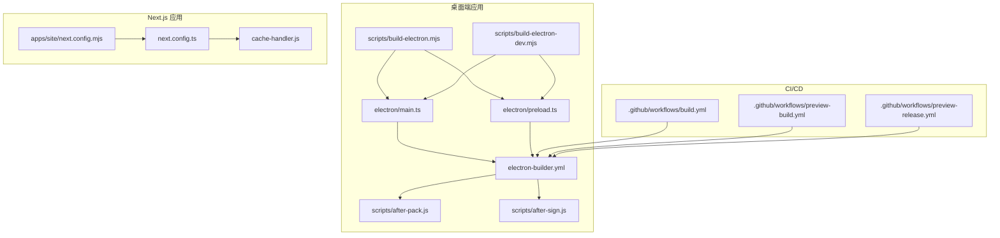
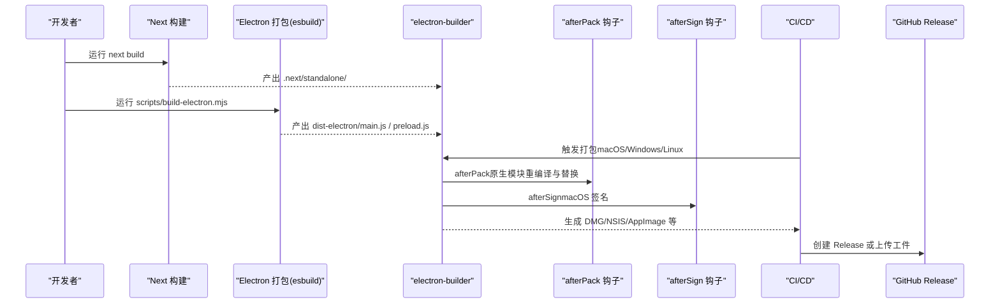
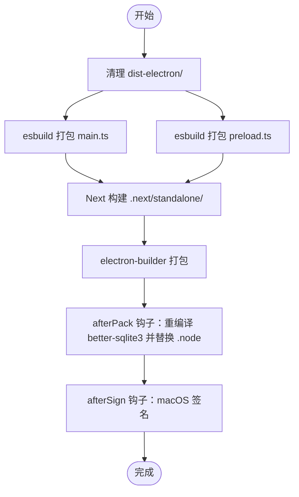
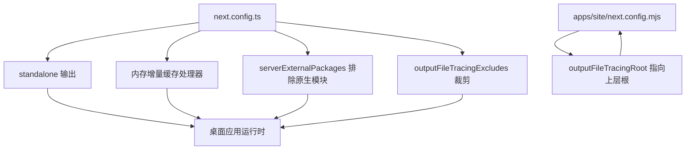
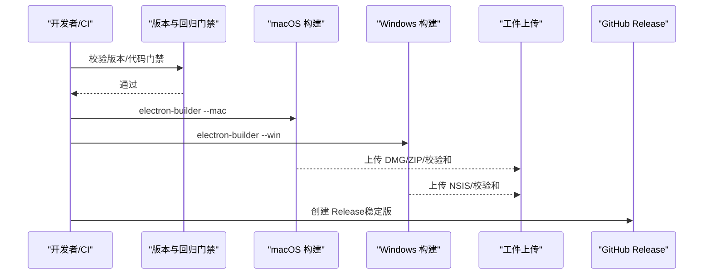
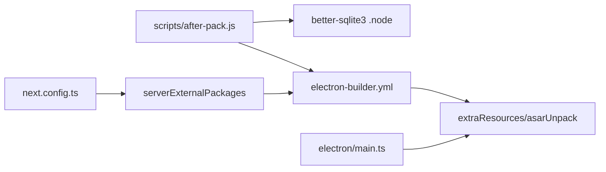

# 部署架构

<cite>
**本文引用的文件**
- [package.json](file://package.json)
- [next.config.ts](file://next.config.ts)
- [electron-builder.yml](file://electron-builder.yml)
- [scripts/build-electron.mjs](file://scripts/build-electron.mjs)
- [scripts/build-electron-dev.mjs](file://scripts/build-electron-dev.mjs)
- [scripts/after-pack.js](file://scripts/after-pack.js)
- [scripts/after-sign.js](file://scripts/after-sign.js)
- [.github/workflows/build.yml](file://.github/workflows/build.yml)
- [.github/workflows/preview-build.yml](file://.github/workflows/preview-build.yml)
- [.github/workflows/preview-release.yml](file://.github/workflows/preview-release.yml)
- [electron/main.ts](file://electron/main.ts)
- [electron/preload.ts](file://electron/preload.ts)
- [cache-handler.js](file://cache-handler.js)
- [apps/site/next.config.mjs](file://apps/site/next.config.mjs)
- [apps/site/package.json](file://apps/site/package.json)
</cite>

## 目录
1. [简介](#简介)
2. [项目结构](#项目结构)
3. [核心组件](#核心组件)
4. [架构总览](#架构总览)
5. [详细组件分析](#详细组件分析)
6. [依赖关系分析](#依赖关系分析)
7. [性能考量](#性能考量)
8. [故障排查指南](#故障排查指南)
9. [结论](#结论)
10. [附录](#附录)

## 简介
本文件面向运维与开发团队，系统化梳理 CodePilot 的部署架构与构建流程，覆盖以下关键主题：
- Electron 应用的打包策略：主进程、渲染进程、预加载脚本的分离与优化
- Next.js 应用的构建配置：静态资源处理、输出追踪裁剪、内存缓存策略
- 跨平台部署：macOS DMG、Windows NSIS 安装包的生成与验证
- CI/CD 流程与自动化：稳定版与预览版流水线、版本一致性校验、原生模块 ABI 校验
- 应用签名、公证与发布：macOS 自动签名与公证策略、GitHub Release 发布
- 架构图与流程图：帮助理解与维护部署系统

## 项目结构
CodePilot 采用多包工作区（monorepo）组织，包含桌面端 Electron 应用、主站 Next.js 站点等子项目。核心目录与职责概览：
- electron：Electron 主进程与预加载脚本源码
- scripts：构建与打包钩子脚本（esbuild 打包、electron-builder 后置钩子）
- apps/site：独立的文档站点（Next.js），用于展示与营销
- .github/workflows：CI/CD 工作流，负责稳定版与预览版打包、发布
- 顶层配置：package.json、next.config.ts、electron-builder.yml 等

图表来源
- [electron/main.ts](file://electron/main.ts)
- [electron/preload.ts](file://electron/preload.ts)
- [electron-builder.yml](file://electron-builder.yml)
- [scripts/after-pack.js](file://scripts/after-pack.js)
- [scripts/after-sign.js](file://scripts/after-sign.js)
- [scripts/build-electron.mjs](file://scripts/build-electron.mjs)
- [scripts/build-electron-dev.mjs](file://scripts/build-electron-dev.mjs)
- [next.config.ts](file://next.config.ts)
- [cache-handler.js](file://cache-handler.js)
- [apps/site/next.config.mjs](file://apps/site/next.config.mjs)
- [.github/workflows/build.yml](file://.github/workflows/build.yml)
- [.github/workflows/preview-build.yml](file://.github/workflows/preview-build.yml)
- [.github/workflows/preview-release.yml](file://.github/workflows/preview-release.yml)

章节来源
- [package.json](file://package.json)
- [next.config.ts](file://next.config.ts)
- [electron-builder.yml](file://electron-builder.yml)
- [scripts/build-electron.mjs](file://scripts/build-electron.mjs)
- [scripts/build-electron-dev.mjs](file://scripts/build-electron-dev.mjs)
- [scripts/after-pack.js](file://scripts/after-pack.js)
- [scripts/after-sign.js](file://scripts/after-sign.js)
- [.github/workflows/build.yml](file://.github/workflows/build.yml)
- [.github/workflows/preview-build.yml](file://.github/workflows/preview-build.yml)
- [.github/workflows/preview-release.yml](file://.github/workflows/preview-release.yml)
- [apps/site/next.config.mjs](file://apps/site/next.config.mjs)

## 核心组件
- Electron 主进程（electron/main.ts）
  - 负责应用生命周期、窗口管理、托盘、通知、系统代理解析、嵌入式 Next.js 服务器启动与端口选择、原生模块 ABI 校验、安装器协调等
- 预加载脚本（electron/preload.ts）
  - 通过 contextBridge 暴露受控 API 至渲染进程，封装文件系统路径解析、对话框、安装器、终端、通知等能力
- Next.js 构建配置（next.config.ts）
  - standalone 输出、内存增量缓存处理器、禁用开发缓存、外部化原生模块、输出追踪裁剪等
- 打包与签名脚本
  - esbuild 构建主进程与预加载脚本
  - electron-builder 配置与后置钩子：原生模块重编译与替换、macOS 自动签名与公证
- CI/CD 工作流
  - 稳定版：按标签触发，构建 macOS（arm64+x64）与 Windows，创建 GitHub Release
  - 预览版：手动触发或按预览标签触发，产物仅上传为工件，不创建稳定发布

章节来源
- [electron/main.ts](file://electron/main.ts)
- [electron/preload.ts](file://electron/preload.ts)
- [next.config.ts](file://next.config.ts)
- [scripts/build-electron.mjs](file://scripts/build-electron.mjs)
- [scripts/after-pack.js](file://scripts/after-pack.js)
- [scripts/after-sign.js](file://scripts/after-sign.js)
- [.github/workflows/build.yml](file://.github/workflows/build.yml)
- [.github/workflows/preview-build.yml](file://.github/workflows/preview-build.yml)
- [.github/workflows/preview-release.yml](file://.github/workflows/preview-release.yml)

## 架构总览
下图展示了从源码到最终安装包的关键路径：Next.js 构建、Electron 主进程与预加载脚本打包、electron-builder 组装资源、原生模块重编译与签名、CI/CD 产物发布。

图表来源
- [scripts/build-electron.mjs](file://scripts/build-electron.mjs)
- [electron-builder.yml](file://electron-builder.yml)
- [scripts/after-pack.js](file://scripts/after-pack.js)
- [scripts/after-sign.js](file://scripts/after-sign.js)
- [.github/workflows/build.yml](file://.github/workflows/build.yml)
- [.github/workflows/preview-build.yml](file://.github/workflows/preview-build.yml)
- [.github/workflows/preview-release.yml](file://.github/workflows/preview-release.yml)

## 详细组件分析

### Electron 应用打包策略
- 主进程与预加载脚本分离
  - 使用 esbuild 将 electron/main.ts 与 electron/preload.ts 分别打包为 dist-electron/main.js 与 dist-electron/preload.js
  - 预加载脚本通过 contextBridge 暴露最小 API 面，避免直接暴露 Node/Electron 全部能力
- 清理与重建
  - 构建前清理 dist-electron 目录，防止旧产物污染 asar
  - 在 Next 构建完成后执行符号链接解析，确保 standalone 可被 electron-builder 正确打包
- 原生模块 ABI 兼容性
  - afterPack 钩子在打包后针对目标 Electron 版本与架构重新编译 better-sqlite3，并替换 standalone 中所有匹配的 .node 文件
  - 主进程启动时进行 ABI 校验，若不兼容则弹窗并退出，避免运行时崩溃

图表来源
- [scripts/build-electron.mjs](file://scripts/build-electron.mjs)
- [scripts/after-pack.js](file://scripts/after-pack.js)
- [scripts/after-sign.js](file://scripts/after-sign.js)
- [electron-builder.yml](file://electron-builder.yml)

章节来源
- [scripts/build-electron.mjs](file://scripts/build-electron.mjs)
- [scripts/build-electron-dev.mjs](file://scripts/build-electron-dev.mjs)
- [scripts/after-pack.js](file://scripts/after-pack.js)
- [scripts/after-sign.js](file://scripts/after-sign.js)
- [electron-builder.yml](file://electron-builder.yml)
- [electron/main.ts](file://electron/main.ts)
- [electron/preload.ts](file://electron/preload.ts)

### Next.js 应用构建配置
- Standalone 输出与只读安装目录
  - output: 'standalone'，打包后的 Next 服务以 standalone 形式运行，适合桌面应用分发
  - cacheHandler 指向自定义内存缓存处理器，避免写入只读安装目录导致权限错误
  - cacheMaxMemorySize: 0，禁用 Next 默认的额外 LRU 层，统一由内存缓存管理
- 开发体验优化
  - 禁用 Turbopack 文件系统缓存（dev），限制内存上限，关闭源码映射，降低大型路由图带来的内存压力
  - allowedDevOrigins 显式允许 127.0.0.1（Electron 开发模式）
- 外部化原生模块
  - serverExternalPackages 排除 better-sqlite3、zlib-sync、discord.js、@anthropic-ai/claude-agent-sdk 等无法打包的模块
- 输出追踪裁剪
  - outputFileTracingExcludes 排除大量非必要目录与文件，减少 NFT 清单体积，避免误报“意外追踪”警告
- 文档站点（apps/site）
  - 独立的 Next.js 站点，使用 MDX 支持，outputFileTracingRoot 指向上层根目录，便于共享工具链

图表来源
- [next.config.ts](file://next.config.ts)
- [cache-handler.js](file://cache-handler.js)
- [apps/site/next.config.mjs](file://apps/site/next.config.mjs)

章节来源
- [next.config.ts](file://next.config.ts)
- [cache-handler.js](file://cache-handler.js)
- [apps/site/next.config.mjs](file://apps/site/next.config.mjs)
- [apps/site/package.json](file://apps/site/package.json)

### 跨平台部署与安装包生成
- macOS
  - 产物：DMG 与 ZIP；启用 Hardened Runtime、entitlements.plist；支持 notarize（当前为关闭状态）
  - 托盘图标与 Dock 图标资源放置于 resourcesPath 根目录，确保菜单栏可见
- Windows
  - 产物：NSIS 安装器；允许用户选择安装路径、创建桌面/开始菜单快捷方式
- Linux
  - 产物：AppImage、deb、rpm；桌面入口信息配置在 linux.desktop 字段
- electron-builder 配置要点
  - files 与 extraResources 控制打包内容与资源复制
  - asarUnpack 配合原生模块路径，确保 .node 文件可被替换
  - afterPack 与 afterSign 钩子分别处理原生模块与签名

章节来源
- [electron-builder.yml](file://electron-builder.yml)

### CI/CD 流程与自动化
- 稳定版（build.yml）
  - 触发条件：推送 v* 标签；校验 package.json 版本与标签一致、Codex 不再传入 --listen、ClaudeCode 对 bare sonnet 的规范、P0 启动回归
  - 并行构建 macOS（arm64+x64）与 Windows（x64），产物上传为工件，最后创建 GitHub Release 并附带校验和
- 预览版（preview-build.yml）
  - 触发方式：workflow_dispatch；手动输入 preview_version（必须 > 0.54.0）、选择平台
  - 单一来源版本变更：通过 npm version 修改 package.json 与 lockfile，不使用 electron-builder extraMetadata
  - macOS 仅 arm64（Apple Silicon），Windows 仅 x64（Windows runner）
  - 产物上传为工件，不创建 Release
- 预览发布（preview-release.yml）
  - 触发方式：推送 preview-* 标签；校验标签与 package.json 版本一致且 > 0.54.0
  - 构建 macOS（arm64）与 Windows（x64），创建 GitHub prerelease（非 latest）

图表来源
- [.github/workflows/build.yml](file://.github/workflows/build.yml)
- [.github/workflows/preview-build.yml](file://.github/workflows/preview-build.yml)
- [.github/workflows/preview-release.yml](file://.github/workflows/preview-release.yml)

章节来源
- [.github/workflows/build.yml](file://.github/workflows/build.yml)
- [.github/workflows/preview-build.yml](file://.github/workflows/preview-build.yml)
- [.github/workflows/preview-release.yml](file://.github/workflows/preview-release.yml)

### 应用签名、公证与发布
- macOS 签名与公证
  - afterSign 钩子：若检测到真实证书（CSC_LINK/CSC_NAME 或 Keychain 中 Developer ID），则跳过 ad-hoc 签名并验证；否则执行逐级 ad-hoc 签名（.node/.dylib/.so → Helpers → Frameworks → Helper Apps → 主 .app），最后深度验证
  - notarize 当前关闭；如需开启可在配置中启用
- Windows 发布
  - NSIS 安装器由 electron-builder 生成，CI 中直接上传工件或创建 Release
- 发布渠道
  - 稳定版：GitHub Release（latest=true）
  - 预览版：GitHub prerelease（latest=false），避免影响正式用户升级

章节来源
- [scripts/after-sign.js](file://scripts/after-sign.js)
- [electron-builder.yml](file://electron-builder.yml)
- [.github/workflows/build.yml](file://.github/workflows/build.yml)
- [.github/workflows/preview-release.yml](file://.github/workflows/preview-release.yml)

## 依赖关系分析
- 组件耦合
  - electron/main.ts 依赖 electron-builder 的资源布局（standalone、public、themes 等），确保运行时可访问静态资源
  - scripts/after-pack.js 与 electron-builder.yml 的 asarUnpack/extraResources 密切相关，保证 .node 替换生效
  - next.config.ts 的 serverExternalPackages 与 electron-builder 的 extraResources 决定哪些原生模块被打包进 standalone
- 外部依赖
  - electron-builder 作为打包核心，依赖 Node 版本与目标平台原生模块 ABI
  - Sentry 初始化在主进程早期进行，确保捕获早期崩溃

图表来源
- [electron-builder.yml](file://electron-builder.yml)
- [scripts/after-pack.js](file://scripts/after-pack.js)
- [next.config.ts](file://next.config.ts)
- [electron/main.ts](file://electron/main.ts)

章节来源
- [electron-builder.yml](file://electron-builder.yml)
- [scripts/after-pack.js](file://scripts/after-pack.js)
- [next.config.ts](file://next.config.ts)
- [electron/main.ts](file://electron/main.ts)

## 性能考量
- Next.js 缓存策略
  - 内存增量缓存处理器避免磁盘写入，降低只读安装目录下的权限问题风险
  - 禁用 Turbopack 文件系统缓存与源码映射，减少大型路由图的内存占用
- Electron 构建
  - esbuild 仅打包主进程与预加载脚本，避免不必要的依赖进入 asar
  - afterPack 钩子确保原生模块 ABI 与 Electron 匹配，避免运行时加载失败
- CI 任务并行
  - macOS 与 Windows 并行构建，缩短整体构建时间

## 故障排查指南
- better-sqlite3 ABI 不匹配
  - 现象：应用启动时报 NODE_MODULE_VERSION 错误或直接崩溃
  - 排查：确认 afterPack 钩子已执行并替换 .node；检查 Electron 版本与 Node ABI 是否一致
  - 参考：主进程中的 ABI 校验逻辑与 afterPack 钩子
- Next.js 缓存写入失败（只读安装目录）
  - 现象：首次 ISR/fetch 写缓存时报错（EPERM）
  - 解决：确认 cacheHandler 指向内存处理器，且 cacheMaxMemorySize: 0
- 原生模块未随 standalone 打包
  - 现象：打包后找不到某些 .node 文件
  - 解决：在 next.config.ts 的 serverExternalPackages 中排除该模块；在 electron-builder.yml 的 extraResources 中显式复制
- CI 构建失败（版本不一致）
  - 现象：稳定版/预览版校验失败
  - 解决：确保标签版本与 package.json 一致；预览版使用 workflow_dispatch 输入或 preview-* 标签

章节来源
- [electron/main.ts](file://electron/main.ts)
- [scripts/after-pack.js](file://scripts/after-pack.js)
- [next.config.ts](file://next.config.ts)
- [.github/workflows/build.yml](file://.github/workflows/build.yml)
- [.github/workflows/preview-build.yml](file://.github/workflows/preview-build.yml)
- [.github/workflows/preview-release.yml](file://.github/workflows/preview-release.yml)

## 结论
CodePilot 的部署架构围绕“Next.js standalone + Electron 主进程”的组合展开，通过严格的构建配置与 CI/CD 流水线保障跨平台安装包质量。核心优势包括：
- 明确的主/渲染/预加载分离与最小 API 暴露
- 针对只读安装目录的内存缓存策略
- 原生模块 ABI 的自动重编译与替换
- 稳定版与预览版双通道发布，兼顾质量与效率

建议持续关注：
- macOS notarize 的启用与配置
- 原生模块生态变化对 serverExternalPackages 的影响
- CI Runner 环境更新对 electron-builder 的兼容性

## 附录
- 关键命令
  - 开发：npm run electron:dev（同时启动 Next 开发服务器与 Electron）
  - 生产构建：npm run electron:build（先 Next 构建，再 esbuild 打包 Electron）
  - 打包：npm run electron:pack（根据平台参数选择 --mac/--win/--linux）
- 版本与发布
  - 稳定版：推送 v* 标签触发
  - 预览版：workflow_dispatch 或 preview-* 标签触发