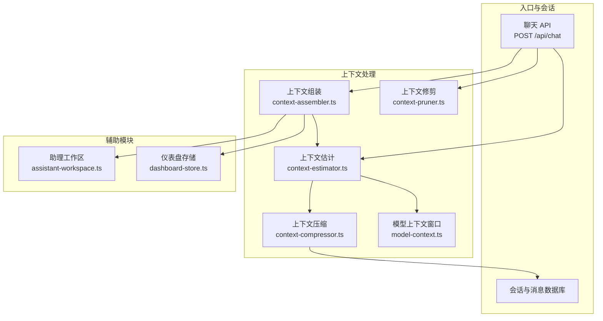
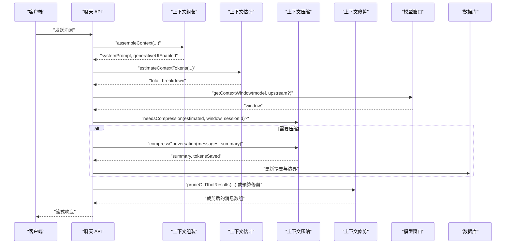
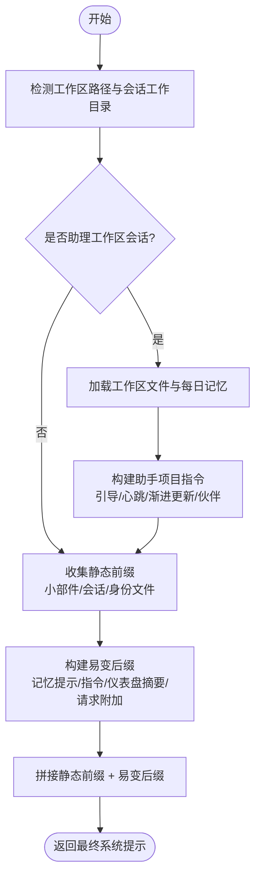
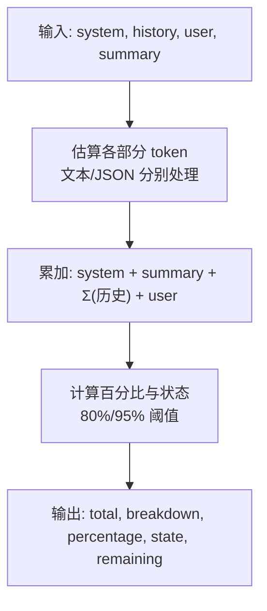
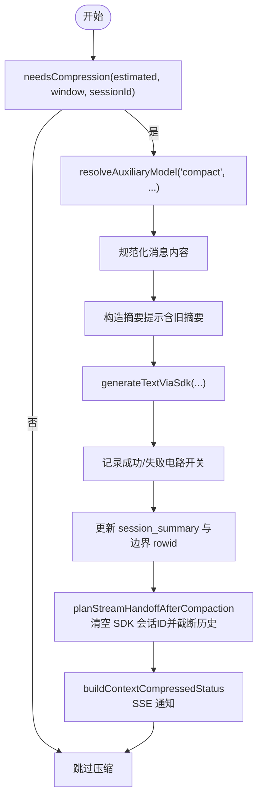
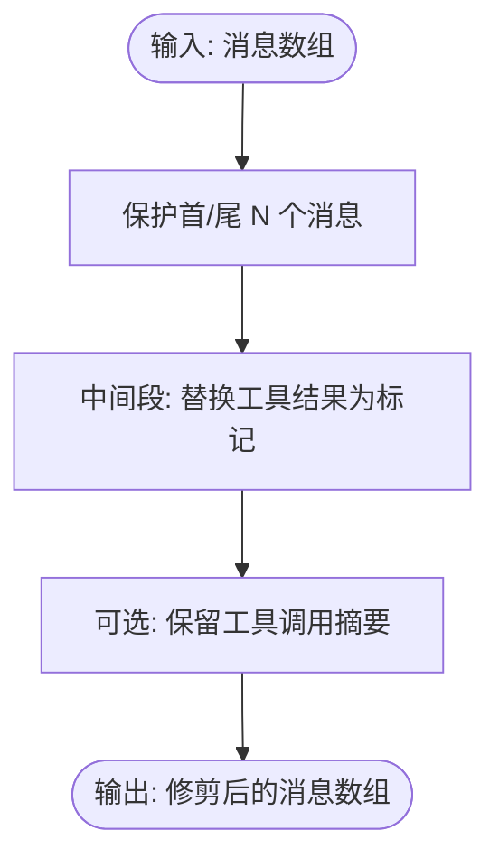
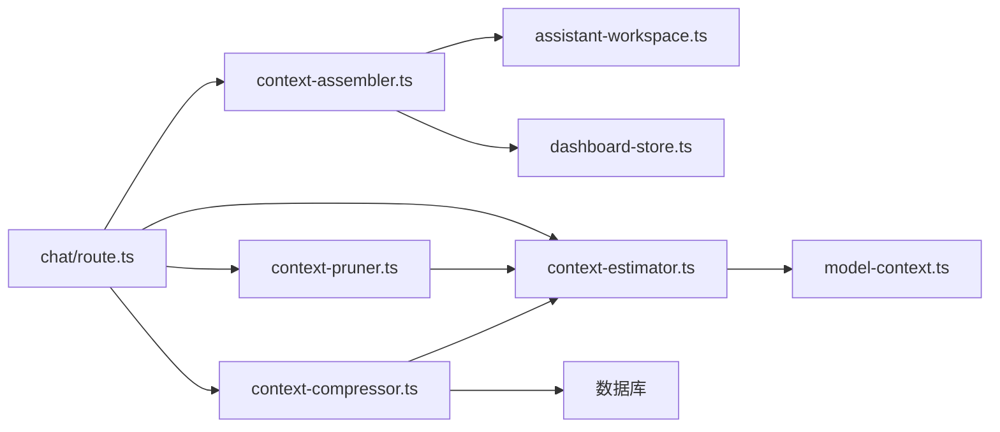

# 上下文处理系统

<cite>
**本文引用的文件**
- [context-assembler.ts](file://src/lib/context-assembler.ts)
- [context-estimator.ts](file://src/lib/context-estimator.ts)
- [context-compressor.ts](file://src/lib/context-compressor.ts)
- [context-pruner.ts](file://src/lib/context-pruner.ts)
- [model-context.ts](file://src/lib/model-context.ts)
- [route.ts](file://src/app/api/chat/route.ts)
- [assistant-workspace.ts](file://src/lib/assistant-workspace.ts)
- [dashboard-store.ts](file://src/lib/dashboard-store.ts)
- [context-assembler.test.ts](file://src/__tests__/unit/context-assembler.test.ts)
- [context-estimator.test.ts](file://src/__tests__/unit/context-estimator.test.ts)
- [context-pruner.test.ts](file://src/__tests__/unit/context-pruner.test.ts)
- [context-compressor-handoff.test.ts](file://src/__tests__/unit/context-compressor-handoff.test.ts)
</cite>

## 目录
1. [简介](#简介)
2. [项目结构](#项目结构)
3. [核心组件](#核心组件)
4. [架构总览](#架构总览)
5. [详细组件分析](#详细组件分析)
6. [依赖关系分析](#依赖关系分析)
7. [性能考量](#性能考量)
8. [故障排查指南](#故障排查指南)
9. [结论](#结论)
10. [附录](#附录)

## 简介
本文件系统性阐述 CodePilot 的上下文处理体系，覆盖上下文组装、压缩、估计与修剪的完整流程。重点包括：
- 上下文窗口管理与阈值策略
- token 计数算法与预估模型
- 智能压缩策略与边界维护
- 上下文修剪规则与微压缩路径
- 面向不同模型的优化策略与动态调整机制
- 使用示例与最佳实践

## 项目结构
上下文处理系统由“组装层”“估计层”“压缩层”“修剪层”四部分组成，并与会话数据库、工作区与仪表盘等模块协同：
- 组装层：统一系统提示拼装，按入口点注入桌面/桥接差异化内容
- 估计层：无 API 调用的粗略 token 估算，用于预检与前端展示
- 压缩层：基于 LLM 的宏观摘要压缩，维护摘要边界与回退上下文
- 修剪层：每步微修剪，保留近期回合并裁剪旧工具结果，保障配对一致性

图表来源
- [route.ts](file://src/app/api/chat/route.ts)
- [context-assembler.ts](file://src/lib/context-assembler.ts)
- [context-estimator.ts](file://src/lib/context-estimator.ts)
- [context-compressor.ts](file://src/lib/context-compressor.ts)
- [context-pruner.ts](file://src/lib/context-pruner.ts)
- [model-context.ts](file://src/lib/model-context.ts)
- [assistant-workspace.ts](file://src/lib/assistant-workspace.ts)
- [dashboard-store.ts](file://src/lib/dashboard-store.ts)

章节来源
- [route.ts](file://src/app/api/chat/route.ts)
- [context-assembler.ts](file://src/lib/context-assembler.ts)
- [context-estimator.ts](file://src/lib/context-estimator.ts)
- [context-compressor.ts](file://src/lib/context-compressor.ts)
- [context-pruner.ts](file://src/lib/context-pruner.ts)
- [model-context.ts](file://src/lib/model-context.ts)
- [assistant-workspace.ts](file://src/lib/assistant-workspace.ts)
- [dashboard-store.ts](file://src/lib/dashboard-store.ts)

## 核心组件
- 上下文组装器：按入口点（桌面/桥接）拼装系统提示，注入工作区身份、助手项目指令、仪表盘摘要与请求级附加内容；保证静态前缀与易变后缀的缓存友好顺序
- 上下文估计器：提供无 API 的粗略 token 估算，支持消息级 JSON 自动识别、历史累计与状态预警
- 上下文压缩器：当预估使用超过窗口 80% 时触发，使用辅助模型生成摘要并维护 rowid 边界，避免重复计算与回放旧历史
- 上下文修剪器：每步微修剪，保护最近 N 回合并保留工具调用配对信息，必要时进行预算驱动的中间段裁剪

章节来源
- [context-assembler.ts](file://src/lib/context-assembler.ts)
- [context-estimator.ts](file://src/lib/context-estimator.ts)
- [context-compressor.ts](file://src/lib/context-compressor.ts)
- [context-pruner.ts](file://src/lib/context-pruner.ts)

## 架构总览
整体流程：API 接收请求 → 组装系统提示 → 估计上下文 → 若需压缩则压缩 → 修剪工具结果 → 发送流式请求。

图表来源
- [route.ts](file://src/app/api/chat/route.ts)
- [context-assembler.ts](file://src/lib/context-assembler.ts)
- [context-estimator.ts](file://src/lib/context-estimator.ts)
- [context-compressor.ts](file://src/lib/context-compressor.ts)
- [context-pruner.ts](file://src/lib/context-pruner.ts)
- [model-context.ts](file://src/lib/model-context.ts)

## 详细组件分析

### 上下文组装（context-assembler）
职责与要点
- 统一系统提示拼装，确保桌面与桥接入口的一致性
- 注入层序：桌面端可注入“小部件系统提示”，会话系统提示，工作区身份文件，每日记忆提示，助手项目指令，桌面仪表盘摘要，请求级附加内容
- 对易变内容采用“静态前缀 + 易变后缀”的顺序，提升缓存命中率
- 助手工作区：仅在工作区会话中加载身份文件与每日记忆提示；根据引导状态与心跳策略注入不同指令
- 仪表盘摘要：桌面端读取项目仪表盘配置，拼接摘要字符串并截断至合理长度

图表来源
- [context-assembler.ts](file://src/lib/context-assembler.ts)
- [assistant-workspace.ts](file://src/lib/assistant-workspace.ts)
- [dashboard-store.ts](file://src/lib/dashboard-store.ts)

章节来源
- [context-assembler.ts](file://src/lib/context-assembler.ts)
- [assistant-workspace.ts](file://src/lib/assistant-workspace.ts)
- [dashboard-store.ts](file://src/lib/dashboard-store.ts)
- [context-assembler.test.ts](file://src/__tests__/unit/context-assembler.test.ts)

### 上下文估计（context-estimator）
职责与要点
- 提供无 API 的粗略 token 估算：默认 4 字节/token，JSON 密集内容 2 字节/ token
- 单条消息估算：自动识别 JSON 并采用更高密度比率
- 总体估算：累加系统提示、摘要、历史消息与用户消息的 token，并为每个消息额外计入角色标签开销
- 百分比与状态：根据阈值（80%/95%）判定正常/警告/严重，并给出剩余 token 数

图表来源
- [context-estimator.ts](file://src/lib/context-estimator.ts)

章节来源
- [context-estimator.ts](file://src/lib/context-estimator.ts)
- [context-estimator.test.ts](file://src/__tests__/unit/context-estimator.test.ts)

### 上下文压缩（context-compressor）
职责与要点
- 触发条件：预估 token 占比达到 80% 且电路开关允许（失败次数未达上限）
- 压缩策略：使用辅助模型生成摘要，保留关键决策、代码引用、任务项与用户偏好；对旧摘要进行增量拼接
- 边界维护：使用 SQLite rowid 作为覆盖边界，严格大于语义，避免同秒写入误判；支持反应式压缩边界解析
- 手递交接：压缩成功后清空 SDK 会话 ID 并截断回退历史，防止 SDK 重放旧转录导致摘要失效
- 状态事件：通过 SSE 事件通知前端“上下文已压缩”，携带压缩条数与估算节省 token 数

图表来源
- [context-compressor.ts](file://src/lib/context-compressor.ts)
- [route.ts](file://src/app/api/chat/route.ts)

章节来源
- [context-compressor.ts](file://src/lib/context-compressor.ts)
- [context-compressor-handoff.test.ts](file://src/__tests__/unit/context-compressor-handoff.test.ts)
- [route.ts](file://src/app/api/chat/route.ts)

### 上下文修剪（context-pruner）
职责与要点
- 微压缩：每步修剪旧工具结果，保留最近 16 回合并保留工具调用配对；旧工具结果替换为带工具名与摘要的标记，避免模型丢失配对而自造结果
- 预算修剪：在头部与尾部保护策略下，按预算逐步裁剪中间段工具结果，可选择保留工具调用摘要以增强上下文
- 估计函数：对混合内容（文本/JSON）进行字符级估算，提供近似 token 数

图表来源
- [context-pruner.ts](file://src/lib/context-pruner.ts)

章节来源
- [context-pruner.ts](file://src/lib/context-pruner.ts)
- [context-pruner.test.ts](file://src/__tests__/unit/context-pruner.test.ts)

### 模型上下文窗口（model-context）
职责与要点
- 预置模型窗口：内置多模型窗口映射（如 sonnet/opus/haiku 等），支持上游模型精确匹配与“1M 上下文”开关
- 解析策略：优先上游模型 ID，其次别名；长串包含优先匹配，避免短别名误伤
- 动态调整：根据上游模型与开关决定最终窗口，确保跨供应商与版本差异下的正确预算

章节来源
- [model-context.ts](file://src/lib/model-context.ts)

## 依赖关系分析
- 组装层依赖工作区与仪表盘模块，以注入身份与摘要
- 估计层依赖模型窗口映射，结合历史与请求内容进行预算
- 压缩层依赖提供者解析与 SDK 文本生成，同时与数据库交互维护摘要与边界
- 修剪层在每步 Agent 循环中运行，与估计层互补，避免单点过载

图表来源
- [context-assembler.ts](file://src/lib/context-assembler.ts)
- [context-estimator.ts](file://src/lib/context-estimator.ts)
- [context-compressor.ts](file://src/lib/context-compressor.ts)
- [context-pruner.ts](file://src/lib/context-pruner.ts)
- [model-context.ts](file://src/lib/model-context.ts)
- [assistant-workspace.ts](file://src/lib/assistant-workspace.ts)
- [dashboard-store.ts](file://src/lib/dashboard-store.ts)
- [route.ts](file://src/app/api/chat/route.ts)

章节来源
- [route.ts](file://src/app/api/chat/route.ts)
- [context-assembler.ts](file://src/lib/context-assembler.ts)
- [context-estimator.ts](file://src/lib/context-estimator.ts)
- [context-compressor.ts](file://src/lib/context-compressor.ts)
- [context-pruner.ts](file://src/lib/context-pruner.ts)
- [model-context.ts](file://src/lib/model-context.ts)
- [assistant-workspace.ts](file://src/lib/assistant-workspace.ts)
- [dashboard-store.ts](file://src/lib/dashboard-store.ts)

## 性能考量
- 估计成本低：全部基于字符长度与启发式比率，避免昂贵的 API 调用
- 缓存友好：静态前缀与易变后缀分离，减少缓存失效
- 压缩阈值：80% 阈值兼顾吞吐与稳定性；电路开关防止反复失败放大
- 行 ID 边界：rowid 单调递增，避免时间戳秒级冲突导致的错误过滤
- 微压缩：每步修剪降低工具结果膨胀，配合宏观摘要形成双层防护
- 模型窗口：按上游模型精确预算，避免过度或不足估计

## 故障排查指南
常见问题与定位
- 压缩失败频繁：检查电路开关与失败计数，确认辅助模型可用性与配置
- 压缩后仍超限：确认 SDK 会话 ID 是否被清空，回退历史是否被截断
- 工具结果配对丢失：检查微修剪是否保留工具调用摘要与工具名
- 边界回退：若出现重复上下文，检查边界 rowid 是否前进，或历史是否被错误 passthrough
- 估计偏差：核对 JSON 自动识别与角色标签开销是否计入

章节来源
- [context-compressor-handoff.test.ts](file://src/__tests__/unit/context-compressor-handoff.test.ts)
- [context-pruner.test.ts](file://src/__tests__/unit/context-pruner.test.ts)
- [context-estimator.test.ts](file://src/__tests__/unit/context-estimator.test.ts)

## 结论
CodePilot 的上下文处理系统通过“静态前缀 + 易变后缀”的组装策略、无 API 的粗略估计、LLM 驱动的摘要压缩与每步微修剪，实现了高效率与高质量的上下文管理。配合 rowid 边界与电路开关，系统在不同模型与供应商环境下具备良好的稳定性与可扩展性。建议在实际部署中：
- 为辅助压缩模型配置合理的跨提供者回退链
- 根据业务负载调优微修剪保护窗口与预算
- 在多供应商场景下启用上游模型精确匹配
- 结合前端展示上下文百分比与状态，提升可观测性

## 附录

### 使用示例（路径指引）
- 组装系统提示：[assembleContext](file://src/lib/context-assembler.ts)
- 估计上下文：[estimateContextTokens](file://src/lib/context-estimator.ts)
- 判断是否压缩：[needsCompression](file://src/lib/context-compressor.ts)
- 执行压缩：[compressConversation](file://src/lib/context-compressor.ts)
- 微修剪工具结果：[pruneOldToolResults](file://src/lib/context-pruner.ts)
- 预算修剪：[pruneOldToolResultsByBudget](file://src/lib/context-pruner.ts)
- 解析模型窗口：[getContextWindow](file://src/lib/model-context.ts)

章节来源
- [context-assembler.ts](file://src/lib/context-assembler.ts)
- [context-estimator.ts](file://src/lib/context-estimator.ts)
- [context-compressor.ts](file://src/lib/context-compressor.ts)
- [context-pruner.ts](file://src/lib/context-pruner.ts)
- [model-context.ts](file://src/lib/model-context.ts)