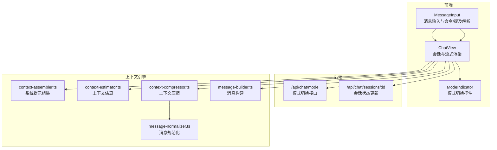
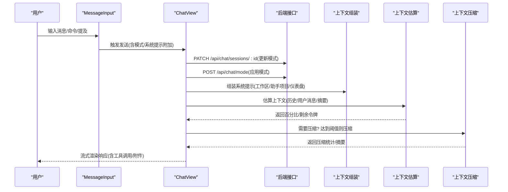
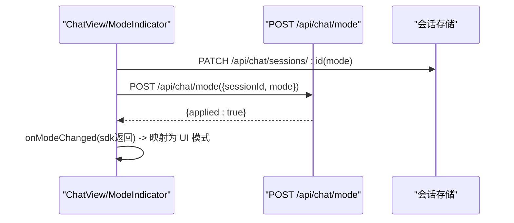
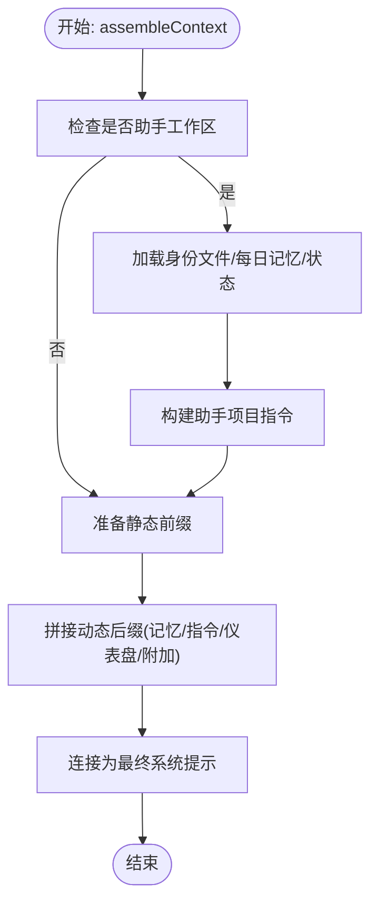
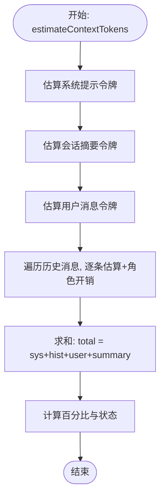
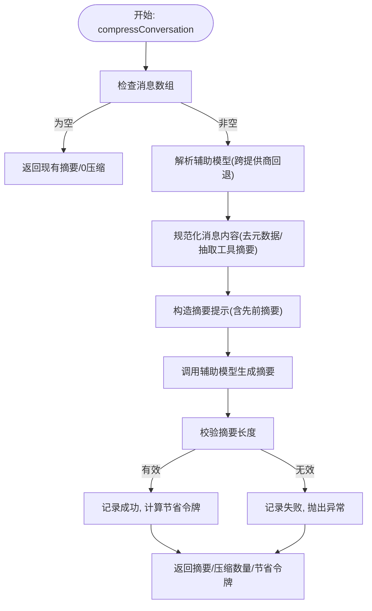
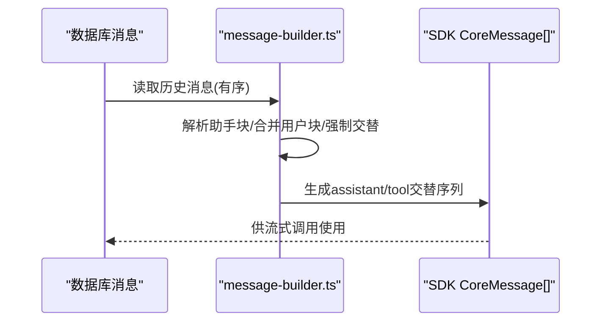
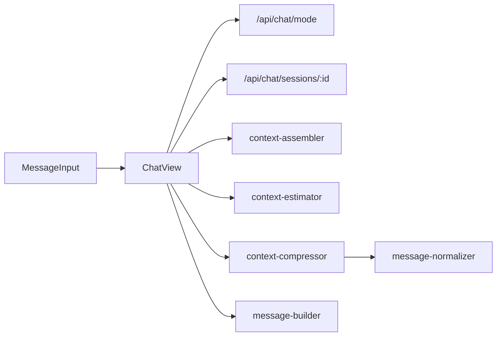

# 交互模式系统

<cite>
**本文档引用的文件**
- [src/app/api/chat/mode/route.ts](file://src/app/api/chat/mode/route.ts)
- [src/components/chat/ModeIndicator.tsx](file://src/components/chat/ModeIndicator.tsx)
- [src/components/chat/ChatView.tsx](file://src/components/chat/ChatView.tsx)
- [src/lib/context-assembler.ts](file://src/lib/context-assembler.ts)
- [src/lib/context-compressor.ts](file://src/lib/context-compressor.ts)
- [src/lib/context-estimator.ts](file://src/lib/context-estimator.ts)
- [src/lib/message-builder.ts](file://src/lib/message-builder.ts)
- [src/lib/message-normalizer.ts](file://src/lib/message-normalizer.ts)
- [src/components/chat/MessageInput.tsx](file://src/components/chat/MessageInput.tsx)
</cite>

## 目录
1. [简介](#简介)
2. [项目结构](#项目结构)
3. [核心组件](#核心组件)
4. [架构总览](#架构总览)
5. [详细组件分析](#详细组件分析)
6. [依赖关系分析](#依赖关系分析)
7. [性能考量](#性能考量)
8. [故障排查指南](#故障排查指南)
9. [结论](#结论)
10. [附录](#附录)

## 简介
本文件系统性阐述 CodePilot 的交互模式系统，聚焦三种核心模式：Code（编码）、Plan（规划）、Ask（问答）。文档覆盖模式设计理念、上下文组装策略、消息处理流程、输出格式化规则、模式切换逻辑、上下文压缩算法、模式特定的提示工程与输出渲染机制，并提供典型使用场景与最佳实践，帮助开发者与使用者高效选择与组合不同模式。

## 项目结构
交互模式系统由前端 UI 组件、后端 API、上下文组装与压缩引擎、消息构建与规范化工具共同构成。关键路径如下：
- 前端交互入口：消息输入组件与模式指示器负责用户交互与模式状态管理
- 会话与模式持久化：通过会话 PATCH 与模式切换 API 实现状态同步
- 上下文组装：统一装配系统提示，注入工作区、助手项目、仪表盘等上下文
- 上下文压缩：基于阈值的自动压缩与回退路径，保障长对话上下文稳定
- 消息构建：将数据库消息转换为 SDK 所需的多模态消息序列

图表来源
- [src/components/chat/MessageInput.tsx:103-533](file://src/components/chat/MessageInput.tsx#L103-L533)
- [src/components/chat/ChatView.tsx:66-805](file://src/components/chat/ChatView.tsx#L66-L805)
- [src/components/chat/ModeIndicator.tsx:13-30](file://src/components/chat/ModeIndicator.tsx#L13-L30)
- [src/app/api/chat/mode/route.ts:13-28](file://src/app/api/chat/mode/route.ts#L13-L28)
- [src/lib/context-assembler.ts:49-251](file://src/lib/context-assembler.ts#L49-L251)
- [src/lib/context-estimator.ts:60-80](file://src/lib/context-estimator.ts#L60-L80)
- [src/lib/context-compressor.ts:260-360](file://src/lib/context-compressor.ts#L260-L360)
- [src/lib/message-normalizer.ts:25-65](file://src/lib/message-normalizer.ts#L25-L65)
- [src/lib/message-builder.ts:74-94](file://src/lib/message-builder.ts#L74-L94)

章节来源
- [src/components/chat/MessageInput.tsx:103-533](file://src/components/chat/MessageInput.tsx#L103-L533)
- [src/components/chat/ChatView.tsx:66-805](file://src/components/chat/ChatView.tsx#L66-L805)
- [src/components/chat/ModeIndicator.tsx:13-30](file://src/components/chat/ModeIndicator.tsx#L13-L30)
- [src/app/api/chat/mode/route.ts:13-28](file://src/app/api/chat/mode/route.ts#L13-L28)
- [src/lib/context-assembler.ts:49-251](file://src/lib/context-assembler.ts#L49-L251)
- [src/lib/context-estimator.ts:60-80](file://src/lib/context-estimator.ts#L60-L80)
- [src/lib/context-compressor.ts:260-360](file://src/lib/context-compressor.ts#L260-L360)
- [src/lib/message-normalizer.ts:25-65](file://src/lib/message-normalizer.ts#L25-L65)
- [src/lib/message-builder.ts:74-94](file://src/lib/message-builder.ts#L74-L94)

## 核心组件
- 模式切换接口：接收 sessionId 与 mode，持久化至会话后立即生效，无需运行时额外动作
- 模式指示器：提供 Code/Plan 切换 UI，绑定 ChatView 的模式状态
- ChatView：承载消息队列、流式渲染、上下文压缩检测、终端动作处理、模式回调
- 上下文组装：按层注入工作区、助手项目、仪表盘、动态提示等，形成最终系统提示
- 上下文估算：对历史、用户消息、系统提示、摘要进行粗略令牌估算
- 上下文压缩：当达到阈值时自动压缩旧消息，支持回退路径与手递手优化
- 消息构建：将数据库消息转换为 SDK 所需的交替结构，处理多模态附件
- 消息规范化：清理内部元数据、抽取思考/工具摘要，支持微压缩

章节来源
- [src/app/api/chat/mode/route.ts:13-28](file://src/app/api/chat/mode/route.ts#L13-L28)
- [src/components/chat/ModeIndicator.tsx:13-30](file://src/components/chat/ModeIndicator.tsx#L13-L30)
- [src/components/chat/ChatView.tsx:128-254](file://src/components/chat/ChatView.tsx#L128-L254)
- [src/lib/context-assembler.ts:49-251](file://src/lib/context-assembler.ts#L49-L251)
- [src/lib/context-estimator.ts:60-80](file://src/lib/context-estimator.ts#L60-L80)
- [src/lib/context-compressor.ts:260-360](file://src/lib/context-compressor.ts#L260-L360)
- [src/lib/message-builder.ts:74-94](file://src/lib/message-builder.ts#L74-L94)
- [src/lib/message-normalizer.ts:25-65](file://src/lib/message-normalizer.ts#L25-L65)

## 架构总览
交互模式系统采用“前端驱动 + 后端协同”的架构。前端负责用户交互与模式状态管理，后端负责会话持久化与模式切换接口；上下文引擎贯穿请求前与请求中，确保系统提示一致、上下文可控、长对话可压缩。

图表来源
- [src/components/chat/MessageInput.tsx:414-533](file://src/components/chat/MessageInput.tsx#L414-L533)
- [src/components/chat/ChatView.tsx:237-254](file://src/components/chat/ChatView.tsx#L237-L254)
- [src/app/api/chat/mode/route.ts:13-28](file://src/app/api/chat/mode/route.ts#L13-L28)
- [src/lib/context-assembler.ts:49-251](file://src/lib/context-assembler.ts#L49-L251)
- [src/lib/context-estimator.ts:60-80](file://src/lib/context-estimator.ts#L60-L80)
- [src/lib/context-compressor.ts:242-250](file://src/lib/context-compressor.ts#L242-L250)

## 详细组件分析

### 模式切换与会话状态
- 切换流程：前端先 PATCH 会话更新模式，再调用 POST /api/chat/mode 应用；后端仅校验必填参数并返回应用结果
- 模式回调：流式启动时监听 SDK 返回的模式变更，映射为 UI 模式（plan→plan，非 plan→code）
- 终端动作：支持压缩并重试、仅压缩、启用 1M 上下文、切换模型等一键操作

图表来源
- [src/components/chat/ModeIndicator.tsx:13-30](file://src/components/chat/ModeIndicator.tsx#L13-L30)
- [src/components/chat/ChatView.tsx:237-254](file://src/components/chat/ChatView.tsx#L237-L254)
- [src/app/api/chat/mode/route.ts:13-28](file://src/app/api/chat/mode/route.ts#L13-L28)

章节来源
- [src/components/chat/ModeIndicator.tsx:13-30](file://src/components/chat/ModeIndicator.tsx#L13-L30)
- [src/components/chat/ChatView.tsx:237-254](file://src/components/chat/ChatView.tsx#L237-L254)
- [src/app/api/chat/mode/route.ts:13-28](file://src/app/api/chat/mode/route.ts#L13-L28)

### 上下文组装策略（Code/Plan/Ask）
- 统一入口：assembleContext 接收会话、入口点、用户提示、系统提示附加、对话历史等，输出最终系统提示、生成式 UI 状态、助手项目指令、是否助手工作区
- 层次化注入：
  - 助手工作区层：当工作目录匹配助手工作区路径时，加载身份文件、每日记忆提示、状态与引导指令
  - 静态前缀 + 动态后缀：静态部分（小部件系统提示、会话系统提示、工作区身份）优先，动态部分（记忆提示、助手指令、仪表盘摘要、请求附加）后置
  - 生成式 UI：桌面入口注入小部件系统提示，桥接入口不注入
  - 仪表盘摘要：桌面入口读取项目看板，拼接摘要
- 模式影响：
  - Code：强调可执行性与工具调用，系统提示偏向“如何编码”
  - Plan：强调结构化规划与步骤分解，系统提示偏向“如何制定计划”
  - Ask：强调问答与推理，系统提示偏向“如何回答”

图表来源
- [src/lib/context-assembler.ts:49-251](file://src/lib/context-assembler.ts#L49-L251)

章节来源
- [src/lib/context-assembler.ts:49-251](file://src/lib/context-assembler.ts#L49-L251)

### 上下文估算与阈值控制
- 估算方法：按字节长度除以字节/令牌比率（默认 4，JSON 密集 2）估算令牌数；历史消息额外加角色标签开销
- 百分比计算：根据估计总量与上下文窗口计算百分比与告警状态（正常/预警/危险）
- 阈值触发：达到 80% 触发压缩；95% 触发严重告警

图表来源
- [src/lib/context-estimator.ts:60-114](file://src/lib/context-estimator.ts#L60-L114)

章节来源
- [src/lib/context-estimator.ts:60-114](file://src/lib/context-estimator.ts#L60-L114)

### 上下文压缩算法与回退路径
- 自动压缩：当估算占比≥80%，使用辅助模型（支持跨提供商标配）将旧消息摘要化，保留最近消息与摘要
- 回退路径：当模型返回上下文过长时，触发反应式压缩，同样使用辅助模型生成摘要
- 手递手优化：压缩后清空 SDK 会话 ID，截断历史为“摘要 + 最近消息”，避免重复计数
- 边界过滤：基于 SQLite rowid 过滤已覆盖消息，保证边界单调前进

图表来源
- [src/lib/context-compressor.ts:260-360](file://src/lib/context-compressor.ts#L260-L360)

章节来源
- [src/lib/context-compressor.ts:242-250](file://src/lib/context-compressor.ts#L242-L250)
- [src/lib/context-compressor.ts:260-360](file://src/lib/context-compressor.ts#L260-L360)
- [src/lib/context-compressor.ts:85-104](file://src/lib/context-compressor.ts#L85-L104)
- [src/lib/context-compressor.ts:143-151](file://src/lib/context-compressor.ts#L143-L151)
- [src/lib/context-compressor.ts:190-202](file://src/lib/context-compressor.ts#L190-L202)

### 消息处理与输出格式化
- 数据库消息到 SDK 结构：将单条助手记录拆分为交替的 assistant → tool → assistant 结构，合并连续用户消息
- 多模态附件：用户消息中的文件元数据剥离后，图像文件以二进制形式内联，文本类文件内联片段，二进制文件仅保留引用
- 工具调用：将工具使用块转换为 SDK 的 tool-call 部分，工具结果块转换为 tool 部分
- 思考块：Anthropic 的 thinking 块在构建时被跳过（不回传给模型）

图表来源
- [src/lib/message-builder.ts:74-94](file://src/lib/message-builder.ts#L74-L94)
- [src/lib/message-builder.ts:231-327](file://src/lib/message-builder.ts#L231-L327)

章节来源
- [src/lib/message-builder.ts:74-94](file://src/lib/message-builder.ts#L74-L94)
- [src/lib/message-builder.ts:231-327](file://src/lib/message-builder.ts#L231-L327)

### 模式特定的提示工程与输出渲染
- Code 模式：强调可执行性、工具调用、安全与可验证性；系统提示引导模型逐步编码、解释与确认
- Plan 模式：强调结构化规划、步骤分解、风险评估与回退策略；系统提示引导模型输出可执行的计划
- Ask 模式：强调推理、证据引用与不确定性表达；系统提示引导模型给出清晰、可追溯的答案
- 输出渲染：ChatView 负责流式渲染、工具调用结果、附件显示、终端动作提示与上下文压缩检测

章节来源
- [src/components/chat/ChatView.tsx:297-332](file://src/components/chat/ChatView.tsx#L297-L332)
- [src/components/chat/ChatView.tsx:622-660](file://src/components/chat/ChatView.tsx#L622-L660)

## 依赖关系分析
- 前端依赖后端接口：会话 PATCH 与模式切换
- ChatView 依赖上下文引擎：assembleContext、estimateContextTokens、compressConversation
- 压缩依赖规范化：normalizeMessageContent 用于摘要生成与回退路径
- 消息构建依赖类型解析：parseMessageContent 与文件系统读取

图表来源
- [src/components/chat/MessageInput.tsx:414-533](file://src/components/chat/MessageInput.tsx#L414-L533)
- [src/components/chat/ChatView.tsx:622-660](file://src/components/chat/ChatView.tsx#L622-L660)
- [src/app/api/chat/mode/route.ts:13-28](file://src/app/api/chat/mode/route.ts#L13-L28)
- [src/lib/context-assembler.ts:49-251](file://src/lib/context-assembler.ts#L49-L251)
- [src/lib/context-estimator.ts:60-80](file://src/lib/context-estimator.ts#L60-L80)
- [src/lib/context-compressor.ts:260-360](file://src/lib/context-compressor.ts#L260-L360)
- [src/lib/message-normalizer.ts:25-65](file://src/lib/message-normalizer.ts#L25-L65)
- [src/lib/message-builder.ts:74-94](file://src/lib/message-builder.ts#L74-L94)

章节来源
- [src/components/chat/MessageInput.tsx:414-533](file://src/components/chat/MessageInput.tsx#L414-L533)
- [src/components/chat/ChatView.tsx:622-660](file://src/components/chat/ChatView.tsx#L622-L660)
- [src/app/api/chat/mode/route.ts:13-28](file://src/app/api/chat/mode/route.ts#L13-L28)
- [src/lib/context-assembler.ts:49-251](file://src/lib/context-assembler.ts#L49-L251)
- [src/lib/context-estimator.ts:60-80](file://src/lib/context-estimator.ts#L60-L80)
- [src/lib/context-compressor.ts:260-360](file://src/lib/context-compressor.ts#L260-L360)
- [src/lib/message-normalizer.ts:25-65](file://src/lib/message-normalizer.ts#L25-L65)
- [src/lib/message-builder.ts:74-94](file://src/lib/message-builder.ts#L74-L94)

## 性能考量
- 上下文估算：使用粗略估算避免额外 API 调用，前端可预估并提示用户
- 压缩阈值：80% 触发压缩，95% 触发严重告警，平衡性能与稳定性
- 微压缩：对旧消息进行年龄感知的头部尾部截断，减少令牌浪费
- 会话手递手：压缩后清空 SDK 会话 ID 并截断历史，避免重复计数与二次压缩
- 文件内联策略：图像二进制内联，文本类文件片段内联，二进制文件仅引用，降低令牌与内存占用

## 故障排查指南
- 模式切换未生效：检查 PATCH 与 POST /api/chat/mode 是否成功返回；确认前端 onModeChanged 回调是否触发
- 上下文过长：观察终端动作提示，尝试“压缩并重试”或“启用 1M 上下文”；若仍失败，考虑切换模型
- 压缩失败：检查辅助模型解析与可用性；关注压缩电路开关与失败次数上限
- 附件显示异常：确认文件 MIME 类型与大小限制；二进制文件不会内联，仅保留引用
- 仪表盘摘要缺失：检查桌面入口与工作区路径匹配；确认项目看板存在有效小部件

章节来源
- [src/components/chat/ChatView.tsx:382-457](file://src/components/chat/ChatView.tsx#L382-L457)
- [src/lib/context-compressor.ts:218-233](file://src/lib/context-compressor.ts#L218-L233)
- [src/lib/message-builder.ts:149-211](file://src/lib/message-builder.ts#L149-L211)

## 结论
CodePilot 的交互模式系统通过“统一上下文组装 + 智能上下文压缩 + 结构化消息构建”的设计，在保证长对话稳定性的同时，提供了灵活的 Code/Plan/Ask 模式选择。前端模式切换与后端会话持久化无缝衔接，配合上下文引擎的阈值控制与回退路径，使系统在复杂任务与多轮对话中保持高效与可靠。

## 附录
- 使用场景建议
  - 编码任务：优先 Code 模式，结合工具调用与附件内联，提升可执行性
  - 规划任务：优先 Plan 模式，强调步骤分解与回退策略
  - 问答任务：优先 Ask 模式，强调推理与证据引用
- 模式间转换与兼容性
  - 切换即时生效，无需重启会话
  - 压缩后会话手递手优化，避免重复计数
  - 仪表盘与助手项目指令按入口注入，桌面入口更强