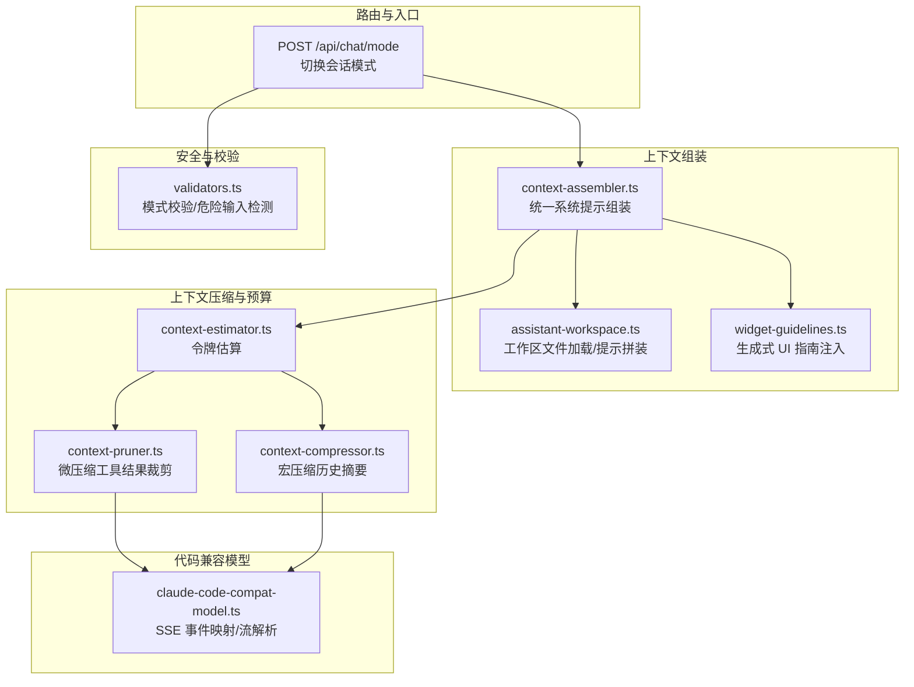
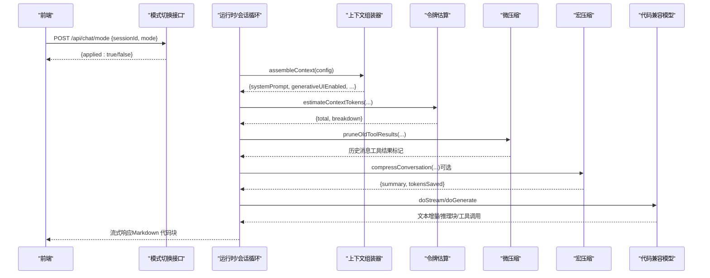
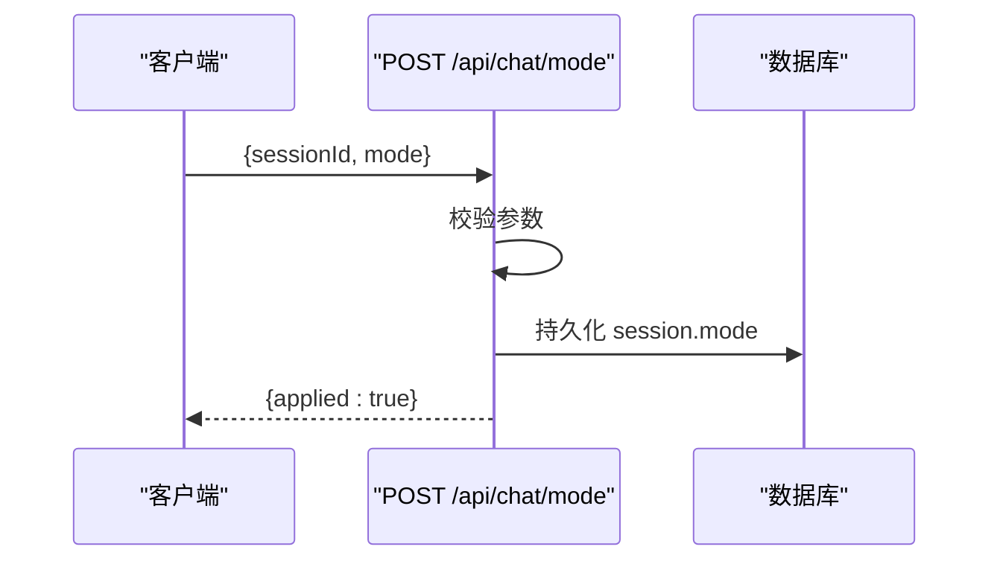
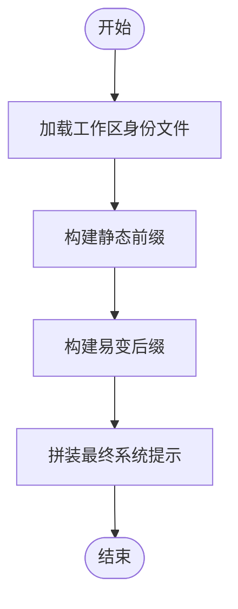
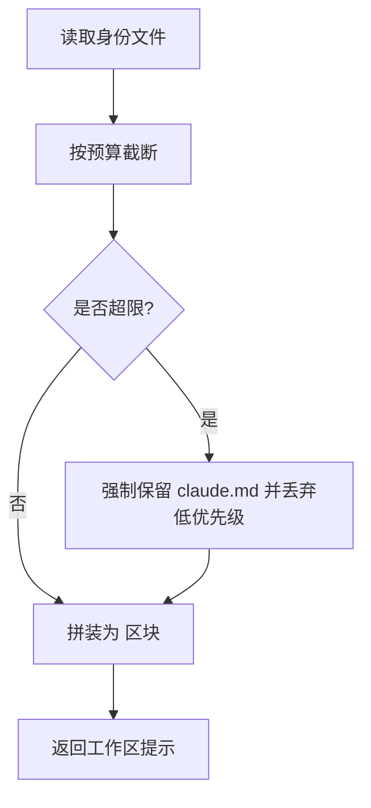
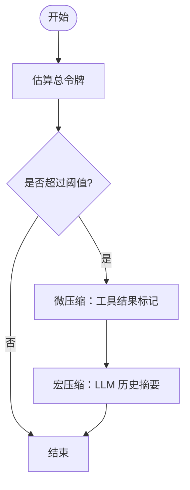
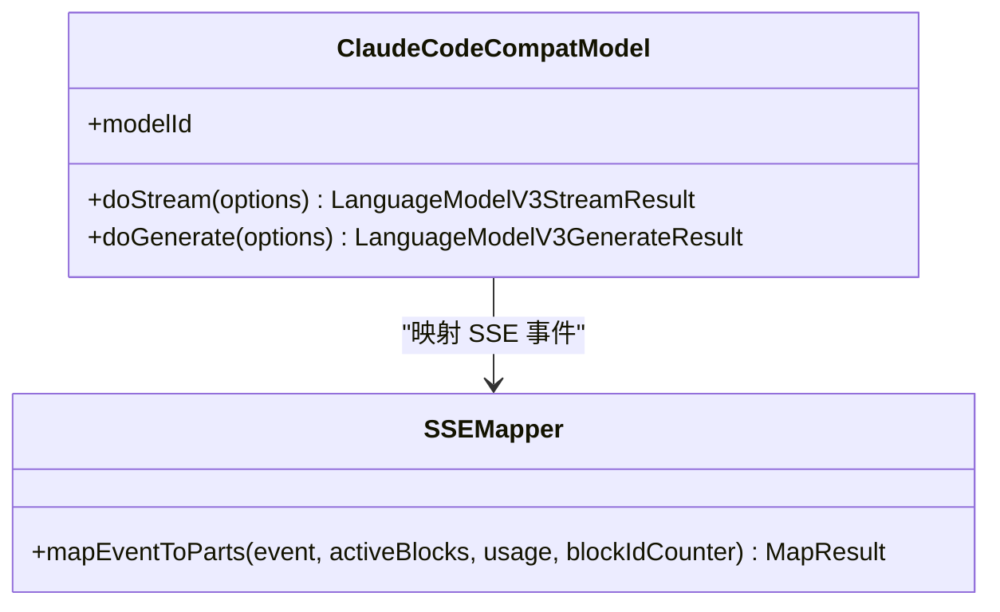
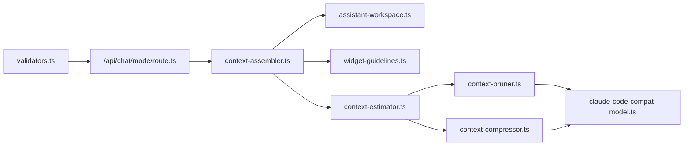

# 代码模式 (Code)

<cite>
**本文档引用的文件**
- [src/app/api/chat/mode/route.ts](file://src/app/api/chat/mode/route.ts)
- [src/lib/context-assembler.ts](file://src/lib/context-assembler.ts)
- [src/lib/context-compressor.ts](file://src/lib/context-compressor.ts)
- [src/lib/context-estimator.ts](file://src/lib/context-estimator.ts)
- [src/lib/context-pruner.ts](file://src/lib/context-pruner.ts)
- [src/lib/assistant-workspace.ts](file://src/lib/assistant-workspace.ts)
- [src/lib/widget-guidelines.ts](file://src/lib/widget-guidelines.ts)
- [src/lib/claude-code-compat/claude-code-compat-model.ts](file://src/lib/claude-code-compat/claude-code-compat-model.ts)
- [src/lib/bridge/security/validators.ts](file://src/lib/bridge/security/validators.ts)
</cite>

## 目录
1. [简介](#简介)
2. [项目结构](#项目结构)
3. [核心组件](#核心组件)
4. [架构总览](#架构总览)
5. [详细组件分析](#详细组件分析)
6. [依赖关系分析](#依赖关系分析)
7. [性能考量](#性能考量)
8. [故障排查指南](#故障排查指南)
9. [结论](#结论)
10. [附录](#附录)

## 简介
本文件系统性阐述 CodePilot 的“代码模式”设计与实现。代码模式聚焦于以代码为中心的对话体验，强调：
- 上下文组装策略：按层注入静态与动态内容，确保提示词稳定与高效。
- 代码片段提取与呈现：通过工作区文件与检索工具提供代码上下文，避免一次性塞入全文。
- 语法高亮与 Markdown 代码块输出：统一的代码块格式，便于编辑器渲染与复制。
- 消息处理与输出格式：在不同入口（桌面/桥接）下保持一致的系统提示与交互。
- 错误处理与安全校验：输入验证、危险模式检测与压缩失败保护。

## 项目结构
与代码模式直接相关的模块分布如下：
- 路由与入口
  - 会话模式切换接口：/api/chat/mode
- 上下文组装
  - 统一系统提示组装器：context-assembler
  - 助理工作区文件加载与提示拼装：assistant-workspace
  - 生成式 UI 指南注入：widget-guidelines
- 上下文压缩与预算
  - 令牌估算：context-estimator
  - 微压缩（工具结果裁剪）：context-pruner
  - 宏压缩（历史摘要）：context-compressor
- 代码兼容模型
  - Claude Code 兼容模型（SSE 流解析与事件映射）：claude-code-compat-model
- 安全与校验
  - 模式参数校验与危险输入检测：bridge/security/validators

图表来源
- [src/app/api/chat/mode/route.ts:1-30](file://src/app/api/chat/mode/route.ts#L1-L30)
- [src/lib/context-assembler.ts:49-251](file://src/lib/context-assembler.ts#L49-L251)
- [src/lib/assistant-workspace.ts:462-511](file://src/lib/assistant-workspace.ts#L462-L511)
- [src/lib/widget-guidelines.ts:17-44](file://src/lib/widget-guidelines.ts#L17-L44)
- [src/lib/context-estimator.ts:60-80](file://src/lib/context-estimator.ts#L60-L80)
- [src/lib/context-pruner.ts:42-82](file://src/lib/context-pruner.ts#L42-L82)
- [src/lib/context-compressor.ts:260-360](file://src/lib/context-compressor.ts#L260-L360)
- [src/lib/claude-code-compat/claude-code-compat-model.ts:54-194](file://src/lib/claude-code-compat/claude-code-compat-model.ts#L54-L194)
- [src/lib/bridge/security/validators.ts:125-127](file://src/lib/bridge/security/validators.ts#L125-L127)

章节来源
- [src/app/api/chat/mode/route.ts:1-30](file://src/app/api/chat/mode/route.ts#L1-L30)
- [src/lib/context-assembler.ts:49-251](file://src/lib/context-assembler.ts#L49-L251)
- [src/lib/assistant-workspace.ts:462-511](file://src/lib/assistant-workspace.ts#L462-L511)
- [src/lib/widget-guidelines.ts:17-44](file://src/lib/widget-guidelines.ts#L17-L44)
- [src/lib/context-estimator.ts:60-80](file://src/lib/context-estimator.ts#L60-L80)
- [src/lib/context-pruner.ts:42-82](file://src/lib/context-pruner.ts#L42-L82)
- [src/lib/context-compressor.ts:260-360](file://src/lib/context-compressor.ts#L260-L360)
- [src/lib/claude-code-compat/claude-code-compat-model.ts:54-194](file://src/lib/claude-code-compat/claude-code-compat-model.ts#L54-L194)
- [src/lib/bridge/security/validators.ts:125-127](file://src/lib/bridge/security/validators.ts#L125-L127)

## 核心组件
- 会话模式切换接口
  - 提供在会话中动态切换模式（code/plan/ask）的能力，前端持久化后由运行时读取生效。
- 统一系统提示组装器
  - 将静态前缀（编译时常量、会话系统提示、工作区身份文件）与易变后缀（记忆提示、助手指令、仪表盘摘要、请求附加）有序拼装，最大化缓存命中并保证上下文稳定性。
- 助理工作区
  - 加载工作区身份文件（claude/user/soul），按预算截断拼装，避免超限；同时提供每日记忆与心跳检查等状态注入。
- 生成式 UI 指南
  - 注入最小能力声明与模块化设计规范，支持按需加载详细指南，减少系统提示开销。
- 令牌估算与压缩
  - 估算消息与历史的令牌占用，触发微压缩（近期窗口内工具结果标记）与宏压缩（LLM 历史摘要），并提供压缩统计事件。
- 代码兼容模型
  - 将 Claude Code 兼容代理的 SSE 事件映射为统一流部件，保障文本增量、推理块与工具调用的正确传递。
- 安全校验
  - 对模式参数进行白名单校验，防止越权或危险输入。

章节来源
- [src/app/api/chat/mode/route.ts:13-28](file://src/app/api/chat/mode/route.ts#L13-L28)
- [src/lib/context-assembler.ts:49-251](file://src/lib/context-assembler.ts#L49-L251)
- [src/lib/assistant-workspace.ts:462-511](file://src/lib/assistant-workspace.ts#L462-L511)
- [src/lib/widget-guidelines.ts:17-44](file://src/lib/widget-guidelines.ts#L17-L44)
- [src/lib/context-estimator.ts:60-80](file://src/lib/context-estimator.ts#L60-L80)
- [src/lib/context-pruner.ts:42-82](file://src/lib/context-pruner.ts#L42-L82)
- [src/lib/context-compressor.ts:260-360](file://src/lib/context-compressor.ts#L260-L360)
- [src/lib/claude-code-compat/claude-code-compat-model.ts:54-194](file://src/lib/claude-code-compat/claude-code-compat-model.ts#L54-L194)
- [src/lib/bridge/security/validators.ts:125-127](file://src/lib/bridge/security/validators.ts#L125-L127)

## 架构总览
代码模式的端到端流程如下：
- 前端调用 /api/chat/mode 切换模式，后端仅持久化，下次会话循环读取。
- 统一系统提示组装器按层拼装静态与动态内容，注入工作区身份与助手指令。
- 令牌估算决定是否触发微/宏压缩，确保上下文不超窗。
- 通过代码兼容模型发送消息，接收 SSE 流并映射为统一部件。
- 输出采用 Markdown 代码块格式，便于编辑器高亮与复制。

图表来源
- [src/app/api/chat/mode/route.ts:13-28](file://src/app/api/chat/mode/route.ts#L13-L28)
- [src/lib/context-assembler.ts:49-251](file://src/lib/context-assembler.ts#L49-L251)
- [src/lib/context-estimator.ts:60-80](file://src/lib/context-estimator.ts#L60-L80)
- [src/lib/context-pruner.ts:42-82](file://src/lib/context-pruner.ts#L42-L82)
- [src/lib/context-compressor.ts:260-360](file://src/lib/context-compressor.ts#L260-L360)
- [src/lib/claude-code-compat/claude-code-compat-model.ts:54-194](file://src/lib/claude-code-compat/claude-code-compat-model.ts#L54-L194)

## 详细组件分析

### 组件：会话模式切换接口
- 设计要点
  - 仅持久化模式，运行时在下一轮会话循环读取，避免在该接口内执行重逻辑。
  - 参数校验：sessionId 与 mode 必填，mode 白名单校验。
- 使用场景
  - 在对话中临时切换到代码模式，聚焦代码相关任务；或在调试/重构阶段强制使用 plan/ask 模式。

图表来源
- [src/app/api/chat/mode/route.ts:13-28](file://src/app/api/chat/mode/route.ts#L13-L28)
- [src/lib/bridge/security/validators.ts:125-127](file://src/lib/bridge/security/validators.ts#L125-L127)

章节来源
- [src/app/api/chat/mode/route.ts:13-28](file://src/app/api/chat/mode/route.ts#L13-L28)
- [src/lib/bridge/security/validators.ts:125-127](file://src/lib/bridge/security/validators.ts#L125-L127)

### 组件：统一系统提示组装器
- 设计要点
  - 分层注入：桌面入口额外注入生成式 UI 指南；桥接入口不注入。
  - 静态前缀优先：编译时常量、会话系统提示、工作区身份文件，提升缓存命中。
  - 易变后缀：记忆提示、助手指令、仪表盘摘要、请求附加，随每次会话变化。
- 代码模式适配
  - 通过 session.mode 与入口类型控制注入内容，确保代码模式下的系统提示稳定且高效。

图表来源
- [src/lib/context-assembler.ts:49-251](file://src/lib/context-assembler.ts#L49-L251)
- [src/lib/assistant-workspace.ts:462-511](file://src/lib/assistant-workspace.ts#L462-L511)
- [src/lib/widget-guidelines.ts:17-44](file://src/lib/widget-guidelines.ts#L17-L44)

章节来源
- [src/lib/context-assembler.ts:49-251](file://src/lib/context-assembler.ts#L49-L251)
- [src/lib/assistant-workspace.ts:462-511](file://src/lib/assistant-workspace.ts#L462-L511)
- [src/lib/widget-guidelines.ts:17-44](file://src/lib/widget-guidelines.ts#L17-L44)

### 组件：助理工作区（代码上下文）
- 设计要点
  - 仅加载身份文件（claude/soul/user），避免将大体量记忆/日志直接拼入系统提示。
  - 截断策略：按预算截断，优先保留头部与尾部关键信息。
  - 每日记忆与心跳状态注入，增强上下文相关性。
- 代码模式适配
  - 通过 MCP 工具检索记忆与日志，而非一次性塞入全文，降低令牌占用。

图表来源
- [src/lib/assistant-workspace.ts:418-449](file://src/lib/assistant-workspace.ts#L418-L449)
- [src/lib/assistant-workspace.ts:462-511](file://src/lib/assistant-workspace.ts#L462-L511)

章节来源
- [src/lib/assistant-workspace.ts:418-449](file://src/lib/assistant-workspace.ts#L418-L449)
- [src/lib/assistant-workspace.ts:462-511](file://src/lib/assistant-workspace.ts#L462-L511)

### 组件：令牌估算与压缩
- 令牌估算
  - 默认按 4 字节/令牌估算，JSON 密集内容按 2 字节/令牌估算；对历史消息逐条计算并叠加角色标签开销。
- 微压缩（工具结果裁剪）
  - 保留最近若干轮完整消息，对更早的工具结果替换为固定标记，保留工具名与少量摘要，避免模型丢失配对。
- 宏压缩（历史摘要）
  - 当估算使用率超过阈值时，使用辅助模型生成摘要，替换早期历史，显著节省令牌。

图表来源
- [src/lib/context-estimator.ts:60-80](file://src/lib/context-estimator.ts#L60-L80)
- [src/lib/context-pruner.ts:42-82](file://src/lib/context-pruner.ts#L42-L82)
- [src/lib/context-compressor.ts:242-250](file://src/lib/context-compressor.ts#L242-L250)
- [src/lib/context-compressor.ts:260-360](file://src/lib/context-compressor.ts#L260-L360)

章节来源
- [src/lib/context-estimator.ts:60-80](file://src/lib/context-estimator.ts#L60-L80)
- [src/lib/context-pruner.ts:42-82](file://src/lib/context-pruner.ts#L42-L82)
- [src/lib/context-compressor.ts:242-250](file://src/lib/context-compressor.ts#L242-L250)
- [src/lib/context-compressor.ts:260-360](file://src/lib/context-compressor.ts#L260-L360)

### 组件：代码兼容模型（SSE 映射）
- 设计要点
  - 将代理返回的 SSE 事件映射为统一的流部件：文本增量、推理块、工具输入增量与完成事件。
  - 正确聚合工具输入 JSON，发出完整工具调用事件。
- 代码模式适配
  - 保证代码模式下的流式输出与工具调用配对正确，便于后续处理与渲染。

图表来源
- [src/lib/claude-code-compat/claude-code-compat-model.ts:41-194](file://src/lib/claude-code-compat/claude-code-compat-model.ts#L41-L194)

章节来源
- [src/lib/claude-code-compat/claude-code-compat-model.ts:41-194](file://src/lib/claude-code-compat/claude-code-compat-model.ts#L41-L194)

### 组件：安全与校验
- 模式参数校验
  - 仅允许 plan/code/ask 三值，防止越权。
- 危险输入检测
  - 检测路径穿越、命令注入等危险模式，保障系统安全。

章节来源
- [src/lib/bridge/security/validators.ts:125-127](file://src/lib/bridge/security/validators.ts#L125-L127)

## 依赖关系分析
- 组件耦合
  - 上下文组装器依赖工作区与生成式 UI 指南；令牌估算与压缩共同作用于历史消息；代码兼容模型独立负责流映射。
- 外部依赖
  - 通过 MCP 工具检索工作区记忆与日志，避免将大体量内容直接拼入系统提示。
- 潜在环路
  - 未见循环依赖；各模块职责清晰，接口稳定。

图表来源
- [src/lib/context-assembler.ts:49-251](file://src/lib/context-assembler.ts#L49-L251)
- [src/lib/assistant-workspace.ts:462-511](file://src/lib/assistant-workspace.ts#L462-L511)
- [src/lib/widget-guidelines.ts:17-44](file://src/lib/widget-guidelines.ts#L17-L44)
- [src/lib/context-estimator.ts:60-80](file://src/lib/context-estimator.ts#L60-L80)
- [src/lib/context-pruner.ts:42-82](file://src/lib/context-pruner.ts#L42-L82)
- [src/lib/context-compressor.ts:260-360](file://src/lib/context-compressor.ts#L260-L360)
- [src/lib/claude-code-compat/claude-code-compat-model.ts:54-194](file://src/lib/claude-code-compat/claude-code-compat-model.ts#L54-L194)
- [src/app/api/chat/mode/route.ts:13-28](file://src/app/api/chat/mode/route.ts#L13-L28)
- [src/lib/bridge/security/validators.ts:125-127](file://src/lib/bridge/security/validators.ts#L125-L127)

章节来源
- [src/lib/context-assembler.ts:49-251](file://src/lib/context-assembler.ts#L49-L251)
- [src/lib/context-estimator.ts:60-80](file://src/lib/context-estimator.ts#L60-L80)
- [src/lib/context-pruner.ts:42-82](file://src/lib/context-pruner.ts#L42-L82)
- [src/lib/context-compressor.ts:260-360](file://src/lib/context-compressor.ts#L260-L360)
- [src/lib/claude-code-compat/claude-code-compat-model.ts:54-194](file://src/lib/claude-code-compat/claude-code-compat-model.ts#L54-L194)
- [src/app/api/chat/mode/route.ts:13-28](file://src/app/api/chat/mode/route.ts#L13-L28)
- [src/lib/bridge/security/validators.ts:125-127](file://src/lib/bridge/security/validators.ts#L125-L127)

## 性能考量
- 令牌估算
  - 估算成本低，避免频繁 API 调用；对 JSON 内容采用更高密度估算，贴近实际。
- 微压缩
  - 保留最近若干轮完整消息，兼顾模型理解与令牌节省；工具结果标记避免模型自造工具调用。
- 宏压缩
  - 辅助模型摘要历史，显著降低令牌占用；失败次数熔断，避免反复失败影响体验。
- 流式映射
  - SSE 事件映射为统一部件，减少上层适配复杂度，提升渲染效率。

## 故障排查指南
- 模式切换无效
  - 检查 /api/chat/mode 请求体是否包含 sessionId 与 mode；确认模式值在白名单内。
- 上下文超窗导致报错
  - 观察是否触发宏压缩；若失败，检查辅助模型可用性与配置。
- 工具调用配对异常
  - 检查微压缩是否过度裁剪工具结果；必要时调整保护轮数或禁用增强版裁剪。
- 代码块渲染异常
  - 确保输出遵循 Markdown 代码块格式；编辑器侧需启用语法高亮。

章节来源
- [src/app/api/chat/mode/route.ts:13-28](file://src/app/api/chat/mode/route.ts#L13-L28)
- [src/lib/bridge/security/validators.ts:125-127](file://src/lib/bridge/security/validators.ts#L125-L127)
- [src/lib/context-compressor.ts:218-233](file://src/lib/context-compressor.ts#L218-L233)
- [src/lib/context-pruner.ts:42-82](file://src/lib/context-pruner.ts#L42-L82)

## 结论
代码模式通过“稳定前缀 + 易变后缀”的系统提示策略、预算感知的上下文组装与压缩机制，以及统一的流式事件映射，实现了高效、稳定且可扩展的代码对话体验。配合工作区身份文件与 MCP 检索工具，既保证上下文质量，又避免令牌超限与性能退化。

## 附录
- 使用场景与最佳实践
  - 编写：聚焦代码模式，系统提示包含工作区身份与助手指令，便于模型理解项目风格与约束。
  - 调试：结合宏压缩与工具结果标记，快速定位问题并复现。
  - 重构：利用工作区检索与摘要机制，评估影响范围与风险点。
- 编辑器集成建议
  - 启用 Markdown 代码块高亮与复制；对生成式 UI Widget 采用统一容器与样式变量桥接。
  - 在工具调用处提供快捷跳转与参数预览，提升交互效率。