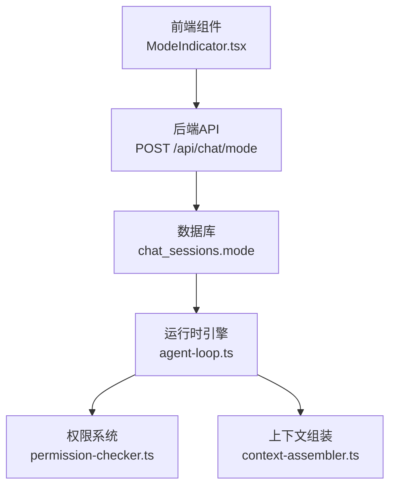
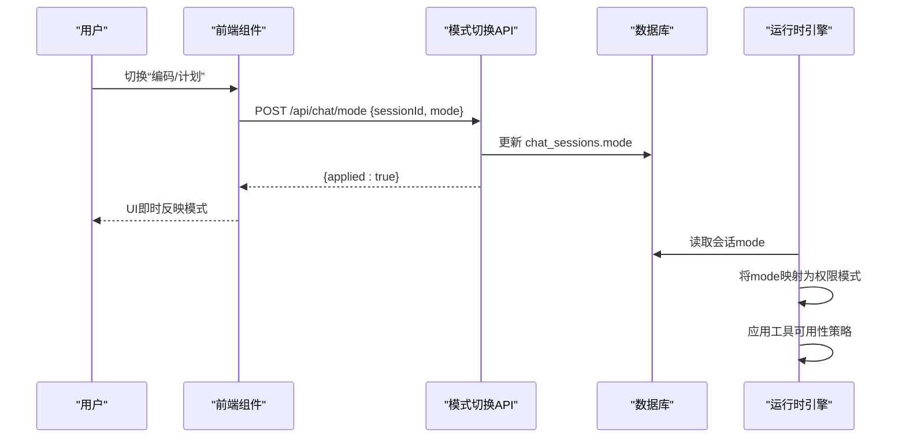
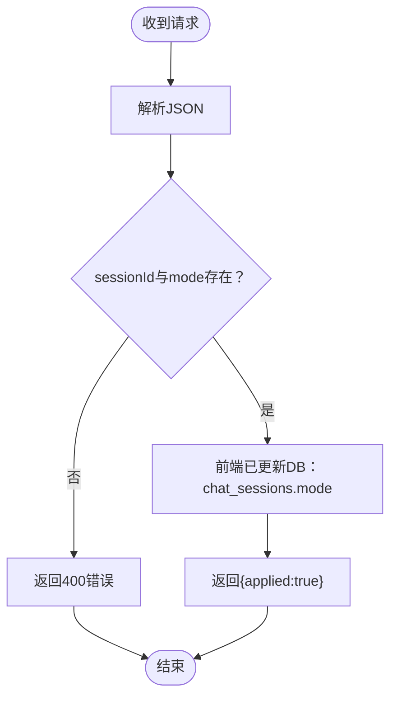
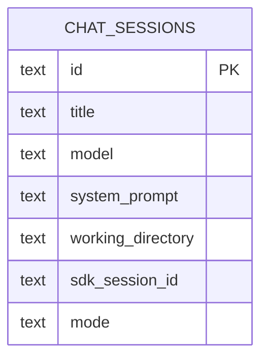
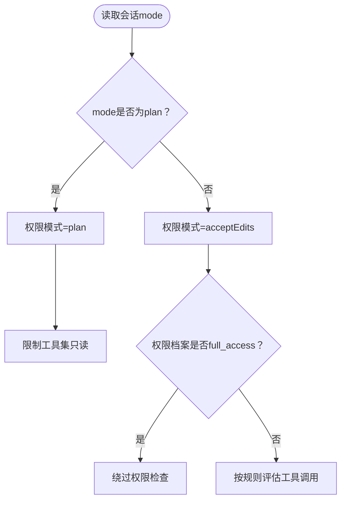
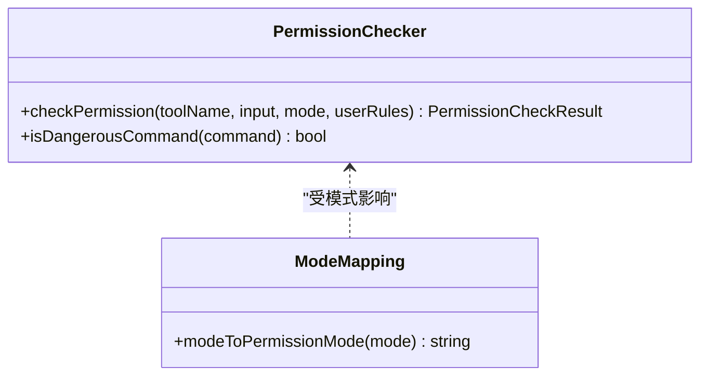
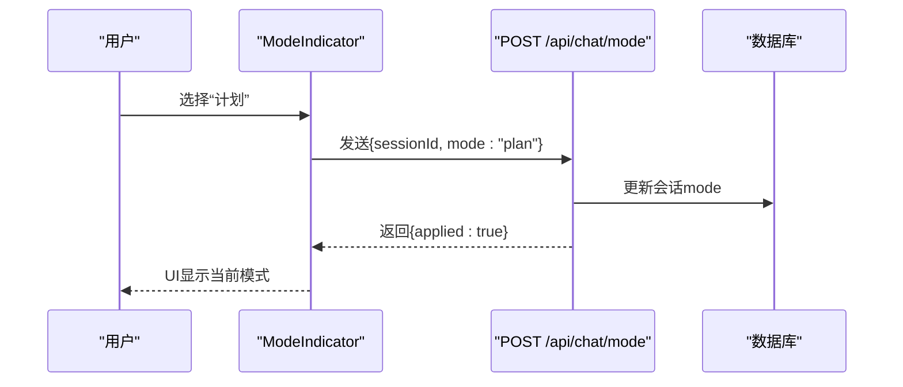
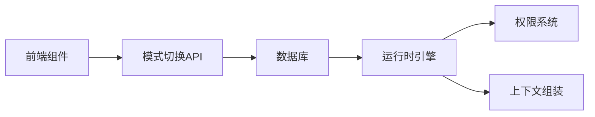

# 模式切换机制

<cite>
**本文档引用的文件**
- [src/app/api/chat/mode/route.ts](file://src/app/api/chat/mode/route.ts)
- [src/app/api/chat/route.ts](file://src/app/api/chat/route.ts)
- [src/lib/agent-loop.ts](file://src/lib/agent-loop.ts)
- [src/lib/context-assembler.ts](file://src/lib/context-assembler.ts)
- [src/lib/permission-checker.ts](file://src/lib/permission-checker.ts)
- [src/components/chat/ModeIndicator.tsx](file://src/components/chat/ModeIndicator.tsx)
- [src/lib/db.ts](file://src/lib/db.ts)
</cite>

## 目录
1. [简介](#简介)
2. [项目结构](#项目结构)
3. [核心组件](#核心组件)
4. [架构总览](#架构总览)
5. [详细组件分析](#详细组件分析)
6. [依赖关系分析](#依赖关系分析)
7. [性能考量](#性能考量)
8. [故障排查指南](#故障排查指南)
9. [结论](#结论)

## 简介
本文件系统性阐述 CodePilot 的“模式切换”机制，覆盖触发条件、切换逻辑、状态管理、API 实现、参数校验、状态持久化、用户体验设计、状态保持策略与上下文迁移机制，并提供典型使用场景与错误恢复策略。模式切换允许用户在“编码模式（code）”与“计划模式（plan）”之间即时切换，影响工具可用性与权限策略，同时保证会话上下文与历史记录的连续性。

## 项目结构
与模式切换直接相关的代码分布在三层：
- 前端 UI 组件：提供模式选择控件与交互反馈
- 后端 API：接收切换请求并持久化会话模式
- 运行时引擎：在每次推理循环中读取会话模式并应用权限策略

图表来源
- [src/components/chat/ModeIndicator.tsx:13-30](file://src/components/chat/ModeIndicator.tsx#L13-L30)
- [src/app/api/chat/mode/route.ts:13-28](file://src/app/api/chat/mode/route.ts#L13-L28)
- [src/lib/db.ts:100-109](file://src/lib/db.ts#L100-L109)
- [src/lib/agent-loop.ts:88-110](file://src/lib/agent-loop.ts#L88-L110)
- [src/lib/permission-checker.ts:127-168](file://src/lib/permission-checker.ts#L127-L168)
- [src/lib/context-assembler.ts:49-50](file://src/lib/context-assembler.ts#L49-L50)

章节来源
- [src/components/chat/ModeIndicator.tsx:13-30](file://src/components/chat/ModeIndicator.tsx#L13-L30)
- [src/app/api/chat/mode/route.ts:13-28](file://src/app/api/chat/mode/route.ts#L13-L28)
- [src/lib/db.ts:100-109](file://src/lib/db.ts#L100-L109)

## 核心组件
- 模式指示器（前端）：提供“编码/计划”双选项卡，触发切换事件
- 模式切换 API：接收 sessionId 与 mode，校验必填项并返回应用结果
- 会话持久化：将 mode 写入 chat_sessions 表
- 运行时引擎：在每次推理前读取会话 mode，转换为权限模式
- 权限系统：根据 mode 应用不同的工具可用性策略
- 上下文组装：在不同模式下维持一致的历史与系统提示

章节来源
- [src/components/chat/ModeIndicator.tsx:13-30](file://src/components/chat/ModeIndicator.tsx#L13-L30)
- [src/app/api/chat/mode/route.ts:13-28](file://src/app/api/chat/mode/route.ts#L13-L28)
- [src/lib/db.ts:100-109](file://src/lib/db.ts#L100-L109)
- [src/lib/agent-loop.ts:88-110](file://src/lib/agent-loop.ts#L88-L110)
- [src/lib/permission-checker.ts:127-168](file://src/lib/permission-checker.ts#L127-L168)
- [src/lib/context-assembler.ts:49-50](file://src/lib/context-assembler.ts#L49-L50)

## 架构总览
模式切换贯穿“前端交互 → API 处理 → 数据持久化 → 运行时读取 → 权限生效”的闭环。其关键特性：
- 即时生效：前端先更新会话再调用 API；API 不做运行时动作，仅确认持久化
- 权限降级：计划模式下限制工具集，避免意外执行
- 上下文连续：切换不影响历史消息与系统提示，仅改变工具可用性

图表来源
- [src/components/chat/ModeIndicator.tsx:13-30](file://src/components/chat/ModeIndicator.tsx#L13-L30)
- [src/app/api/chat/mode/route.ts:13-28](file://src/app/api/chat/mode/route.ts#L13-L28)
- [src/lib/db.ts:100-109](file://src/lib/db.ts#L100-L109)
- [src/lib/agent-loop.ts:88-110](file://src/lib/agent-loop.ts#L88-L110)

## 详细组件分析

### 模式切换 API（后端）
- 端点：POST /api/chat/mode
- 请求体：{ sessionId, mode }
- 参数校验：必需字段缺失返回 400
- 处理逻辑：仅校验并返回“已应用”，实际持久化由前端在调用此 API 前完成
- 错误处理：捕获异常并返回错误信息

图表来源
- [src/app/api/chat/mode/route.ts:13-28](file://src/app/api/chat/mode/route.ts#L13-L28)

章节来源
- [src/app/api/chat/mode/route.ts:13-28](file://src/app/api/chat/mode/route.ts#L13-L28)

### 会话模式持久化（数据库）
- 表结构：chat_sessions 包含 mode 字段
- 更新时机：前端在调用 /api/chat/mode 之前，先发起 PATCH /api/chat/sessions/:id 更新 mode
- 读取时机：运行时引擎在每次推理开始时从会话记录读取

图表来源
- [src/lib/db.ts:100-109](file://src/lib/db.ts#L100-L109)

章节来源
- [src/lib/db.ts:100-109](file://src/lib/db.ts#L100-L109)

### 运行时模式读取与权限映射
- 读取位置：运行时引擎在启动推理循环时读取会话 mode
- 映射规则：mode → 权限模式
  - plan → plan（计划模式）
  - 其他 → acceptEdits（接受编辑）
- 工具可用性：计划模式下仅启用只读工具集合，避免危险操作
- 兼容性：若会话权限档案为 full_access 且非 plan，则绕过权限检查

图表来源
- [src/app/api/chat/route.ts:276-286](file://src/app/api/chat/route.ts#L276-L286)
- [src/lib/agent-loop.ts:349-357](file://src/lib/agent-loop.ts#L349-L357)
- [src/lib/permission-checker.ts:127-168](file://src/lib/permission-checker.ts#L127-L168)

章节来源
- [src/app/api/chat/route.ts:276-286](file://src/app/api/chat/route.ts#L276-L286)
- [src/lib/agent-loop.ts:349-357](file://src/lib/agent-loop.ts#L349-L357)
- [src/lib/permission-checker.ts:127-168](file://src/lib/permission-checker.ts#L127-L168)

### 权限系统（模式驱动）
- 三档模式：
  - explore：只读，禁止写与危险命令
  - normal：默认，自动允许常见读写与编辑，bash 需确认
  - trust：全权，自动放行
- 模式到规则映射：每档内置规则集，支持用户自定义规则叠加
- 危险命令：无论模式均需确认（如 rm -rf、git push --force 等）

图表来源
- [src/lib/permission-checker.ts:127-168](file://src/lib/permission-checker.ts#L127-L168)
- [src/lib/permission-checker.ts:179-186](file://src/lib/permission-checker.ts#L179-L186)

章节来源
- [src/lib/permission-checker.ts:127-168](file://src/lib/permission-checker.ts#L127-L168)
- [src/lib/permission-checker.ts:179-186](file://src/lib/permission-checker.ts#L179-L186)

### 前端模式指示器（用户体验）
- 组件：ModeIndicator（双选项卡：编码/计划）
- 交互：onValueChange 回调触发切换
- 禁用态：可禁用以避免在不可用状态下误操作
- 文案：国际化键值 messageInput.modeCode / messageInput.modePlan

图表来源
- [src/components/chat/ModeIndicator.tsx:13-30](file://src/components/chat/ModeIndicator.tsx#L13-L30)
- [src/app/api/chat/mode/route.ts:13-28](file://src/app/api/chat/mode/route.ts#L13-L28)

章节来源
- [src/components/chat/ModeIndicator.tsx:13-30](file://src/components/chat/ModeIndicator.tsx#L13-L30)

### 上下文迁移与状态保持
- 历史保留：切换不删除历史消息，仅改变工具可用性
- 系统提示：通过上下文组装模块统一注入静态前缀与易变后缀，确保模式切换不影响系统提示一致性
- 会话摘要：压缩与边界过滤逻辑不受模式影响，保障长对话稳定性

章节来源
- [src/lib/context-assembler.ts:49-50](file://src/lib/context-assembler.ts#L49-L50)
- [src/app/api/chat/route.ts:312-344](file://src/app/api/chat/route.ts#L312-L344)

## 依赖关系分析
- 前端依赖后端 API 提供的切换接口
- 后端依赖数据库持久化会话模式
- 运行时依赖会话模式进行权限映射与工具集裁剪
- 权限系统独立于模式，但受模式影响最终的工具可用性

图表来源
- [src/components/chat/ModeIndicator.tsx:13-30](file://src/components/chat/ModeIndicator.tsx#L13-L30)
- [src/app/api/chat/mode/route.ts:13-28](file://src/app/api/chat/mode/route.ts#L13-L28)
- [src/lib/db.ts:100-109](file://src/lib/db.ts#L100-L109)
- [src/lib/agent-loop.ts:88-110](file://src/lib/agent-loop.ts#L88-L110)
- [src/lib/permission-checker.ts:127-168](file://src/lib/permission-checker.ts#L127-L168)
- [src/lib/context-assembler.ts:49-50](file://src/lib/context-assembler.ts#L49-L50)

章节来源
- [src/components/chat/ModeIndicator.tsx:13-30](file://src/components/chat/ModeIndicator.tsx#L13-L30)
- [src/app/api/chat/mode/route.ts:13-28](file://src/app/api/chat/mode/route.ts#L13-L28)
- [src/lib/db.ts:100-109](file://src/lib/db.ts#L100-L109)
- [src/lib/agent-loop.ts:88-110](file://src/lib/agent-loop.ts#L88-L110)
- [src/lib/permission-checker.ts:127-168](file://src/lib/permission-checker.ts#L127-L168)
- [src/lib/context-assembler.ts:49-50](file://src/lib/context-assembler.ts#L49-L50)

## 性能考量
- 模式切换本身无运行时开销：API 仅返回“已应用”，实际持久化由前端完成
- 权限检查在运行时进行，采用规则匹配与缓存策略，复杂度与规则数量线性相关
- 上下文组装与历史保留对性能影响主要来自消息数量与系统提示长度，与模式无关

## 故障排查指南
- 切换无效
  - 检查前端是否先更新会话模式再调用 /api/chat/mode
  - 确认请求体包含 sessionId 与 mode
  - 查看后端日志与返回值 {applied:true/false}
- 权限未生效
  - 确认会话 mode 已正确写入数据库
  - 检查运行时是否读取到最新值
  - 若权限档案为 full_access 且非 plan，将绕过权限检查
- 工具仍可执行
  - 计划模式下仅启用只读工具集合，确认工具名称是否在只读名单内
  - 危险命令始终需要确认，即使在 trust 模式

章节来源
- [src/app/api/chat/mode/route.ts:13-28](file://src/app/api/chat/mode/route.ts#L13-L28)
- [src/lib/db.ts:100-109](file://src/lib/db.ts#L100-L109)
- [src/lib/permission-checker.ts:127-168](file://src/lib/permission-checker.ts#L127-L168)

## 结论
CodePilot 的模式切换机制以“前端先持久化、后端仅确认”的设计实现了低耦合与高可靠性。通过将模式映射为权限模式并在运行时裁剪工具集，系统在保证安全性的前提下提供了灵活的用户体验。配合上下文组装与历史保留策略，模式切换在语义与交互上均保持平滑与一致。