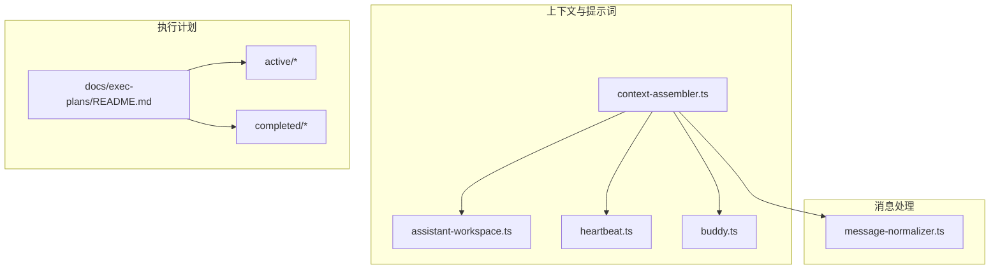
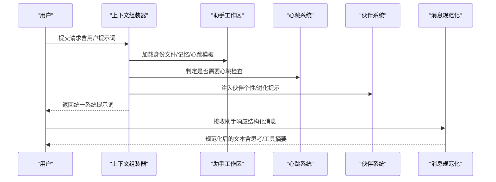
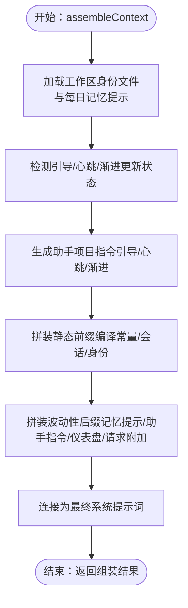
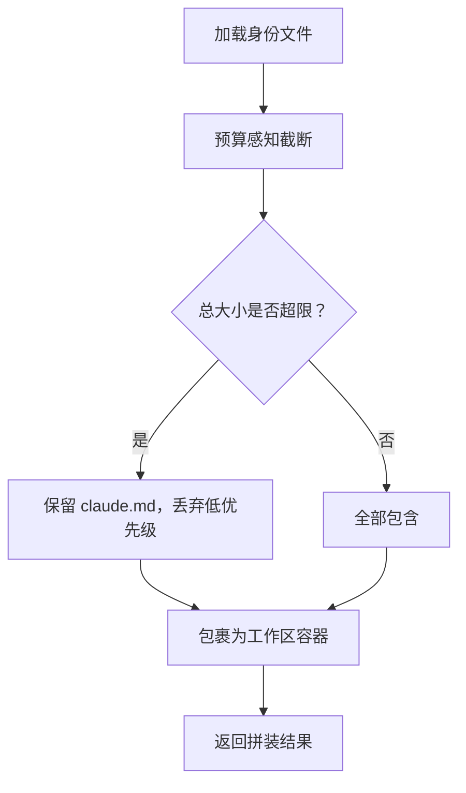
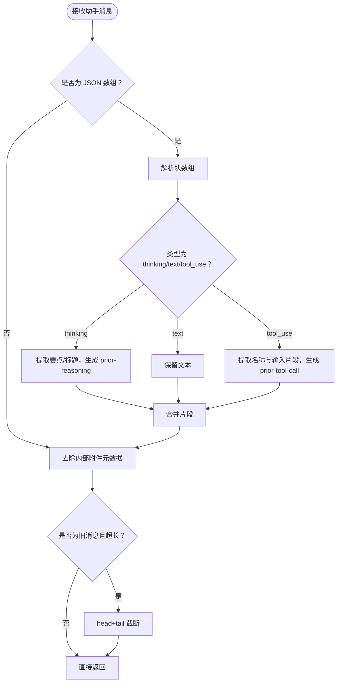
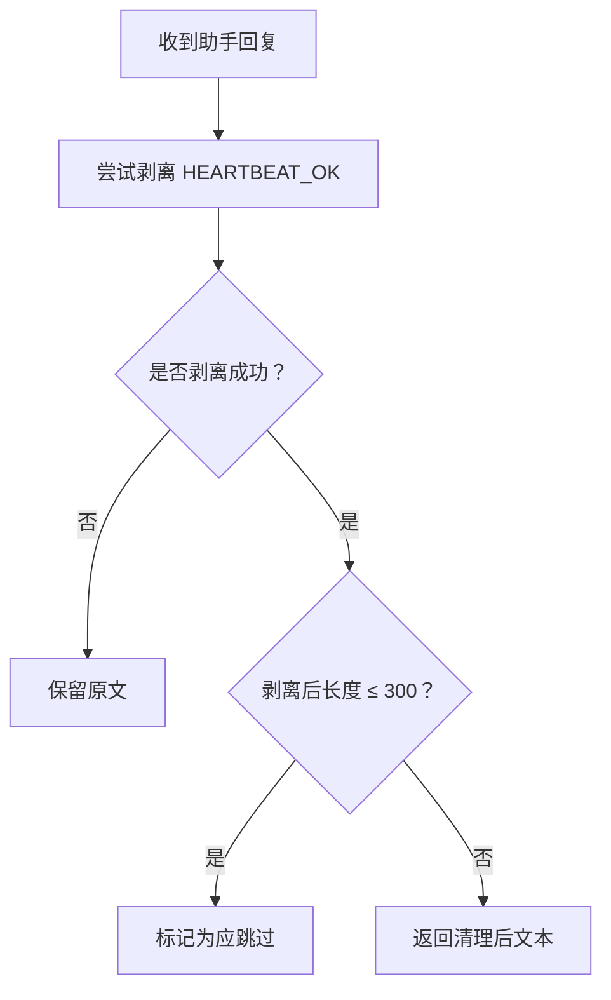
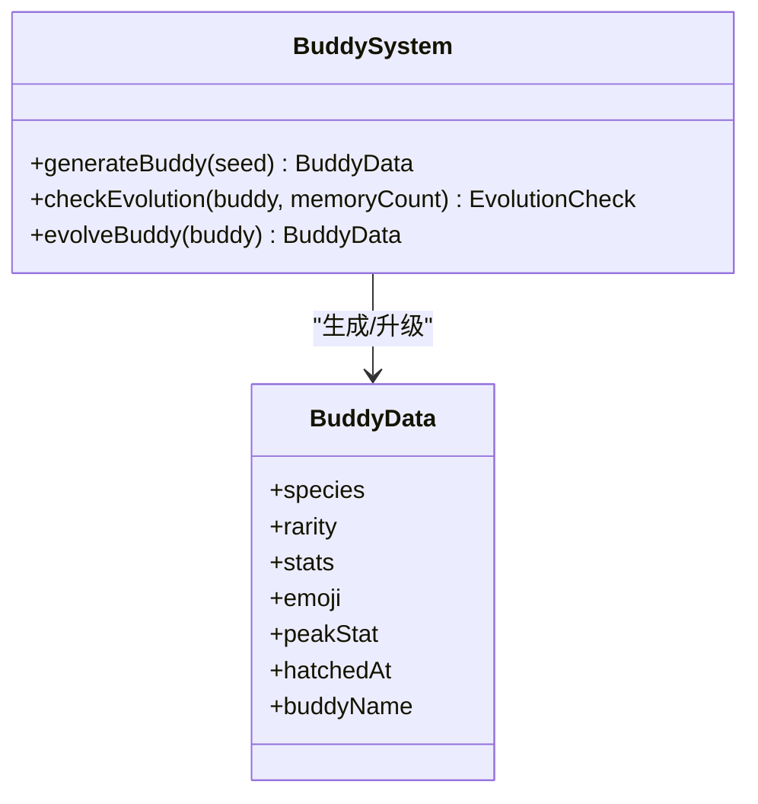
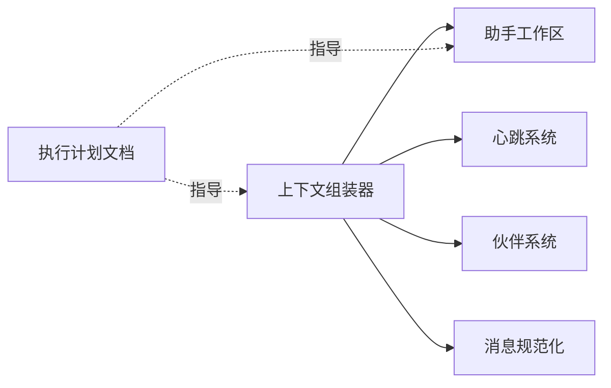

# 规划模式 (Plan)

<cite>
**本文引用的文件**
- [context-assembler.ts](file://src/lib/context-assembler.ts)
- [assistant-workspace.ts](file://src/lib/assistant-workspace.ts)
- [message-normalizer.ts](file://src/lib/message-normalizer.ts)
- [heartbeat.ts](file://src/lib/heartbeat.ts)
- [buddy.ts](file://src/lib/buddy.ts)
- [README.md（执行计划索引）](file://docs/exec-plans/README.md)
- [exec-plans 索引与样例](file://docs/exec-plans/active/unified-context-layer.md)
- [exec-plans 索引与样例](file://docs/exec-plans/active/opus-4-7-upgrade.md)
- [exec-plans 索引与样例](file://docs/exec-plans/active/provider-governance.md)
- [exec-plans 索引与样例](file://docs/exec-plans/active/decouple-claude-code.md)
- [exec-plans 索引与样例](file://docs/exec-plans/active/scheduled-tasks-notifications.md)
- [exec-plans 索引与样例](file://docs/exec-plans/active/agent-sdk-0-2-111-adoption.md)
- [exec-plans 索引与样例](file://docs/exec-plans/completed/markdown-artifact-overhaul.md)
- [exec-plans 索引与样例](file://docs/exec-plans/completed/hermes-inspired-runtime-upgrade.md)
</cite>

## 目录
1. [简介](#简介)
2. [项目结构](#项目结构)
3. [核心组件](#核心组件)
4. [架构总览](#架构总览)
5. [详细组件分析](#详细组件分析)
6. [依赖分析](#依赖分析)
7. [性能考量](#性能考量)
8. [故障排查指南](#故障排查指南)
9. [结论](#结论)
10. [附录](#附录)

## 简介
本文件系统化阐述 CodePilot 的“规划模式（Plan）”设计与实现，聚焦以下方面：
- 设计理念：以“可执行的计划”为载体，将复杂任务分解为阶段目标、步骤与依赖，并通过上下文组装与消息规范化确保计划在不同入口（桌面/桥接）一致生效。
- 适用场景：跨模块、数据库变更、分阶段交付的大中型功能，以及需要阶段性评审与决策记录的工程实践。
- 实现机制：基于统一的上下文组装器（Context Assembler）注入工作区身份与助手指令，结合消息规范化与心跳/伙伴系统，形成稳定的计划执行与反馈闭环。

## 项目结构
围绕规划模式的关键代码与文档分布如下：
- 上下文组装与提示词装配：src/lib/context-assembler.ts、src/lib/assistant-workspace.ts
- 消息规范化与压缩：src/lib/message-normalizer.ts
- 心跳与状态判定：src/lib/heartbeat.ts
- 助理伙伴与个性化：src/lib/buddy.ts
- 执行计划文档：docs/exec-plans/README.md 及各 active/completed 计划

图表来源
- [context-assembler.ts:1-251](file://src/lib/context-assembler.ts#L1-L251)
- [assistant-workspace.ts:462-511](file://src/lib/assistant-workspace.ts#L462-L511)
- [message-normalizer.ts:25-106](file://src/lib/message-normalizer.ts#L25-L106)
- [heartbeat.ts:1-140](file://src/lib/heartbeat.ts#L1-L140)
- [buddy.ts:1-412](file://src/lib/buddy.ts#L1-L412)
- [README.md（执行计划索引）:1-66](file://docs/exec-plans/README.md#L1-L66)

章节来源
- [context-assembler.ts:1-251](file://src/lib/context-assembler.ts#L1-L251)
- [assistant-workspace.ts:462-511](file://src/lib/assistant-workspace.ts#L462-L511)
- [message-normalizer.ts:25-106](file://src/lib/message-normalizer.ts#L25-L106)
- [heartbeat.ts:1-140](file://src/lib/heartbeat.ts#L1-L140)
- [buddy.ts:1-412](file://src/lib/buddy.ts#L1-L412)
- [README.md（执行计划索引）:1-66](file://docs/exec-plans/README.md#L1-L66)

## 核心组件
- 上下文组装器（Context Assembler）
  - 统一入口的系统提示词装配，支持桌面/桥接两种入口层注入策略，保证不同入口的一致性。
  - 关键职责：工作区身份层注入、波动性指令拼接、桌面端仪表盘摘要、请求级附加提示。
- 助手工作区（Assistant Workspace）
  - 工作区身份文件（soul/user/claude）预算感知拼装，避免溢出；提供每日记忆与心跳模板。
- 消息规范化（Message Normalizer）
  - 对助手消息进行结构化摘要与工具调用标记抽取，同时对旧消息进行年龄加权截断，降低上下文负担。
- 心跳系统（Heartbeat）
  - 提供 HEARTBEAT_OK 协议、活跃时段校验、去重逻辑，支撑计划执行中的周期性检查与反馈。
- 助理伙伴（Buddy）
  - 基于种子的确定性伙伴生成，提供稀有度、属性与进化机制，增强长期交互体验与计划执行的陪伴感。

章节来源
- [context-assembler.ts:49-251](file://src/lib/context-assembler.ts#L49-L251)
- [assistant-workspace.ts:462-511](file://src/lib/assistant-workspace.ts#L462-L511)
- [message-normalizer.ts:25-106](file://src/lib/message-normalizer.ts#L25-L106)
- [heartbeat.ts:13-140](file://src/lib/heartbeat.ts#L13-L140)
- [buddy.ts:204-221](file://src/lib/buddy.ts#L204-L221)

## 架构总览
规划模式的运行时由“上下文组装 → 模型推理 → 消息规范化 → 计划落地”构成闭环。桌面与桥接入口通过统一的上下文组装器注入工作区身份与助手指令，随后由消息规范化保障历史与工具调用信息的高效呈现。

图表来源
- [context-assembler.ts:49-251](file://src/lib/context-assembler.ts#L49-L251)
- [assistant-workspace.ts:462-511](file://src/lib/assistant-workspace.ts#L462-L511)
- [heartbeat.ts:567-589](file://src/lib/heartbeat.ts#L567-L589)
- [buddy.ts:349-386](file://src/lib/buddy.ts#L349-L386)
- [message-normalizer.ts:25-106](file://src/lib/message-normalizer.ts#L25-L106)

## 详细组件分析

### 上下文组装器（Context Assembly）
- 分层策略
  - 静态前缀：编译时常量、会话系统提示、工作区身份文件（仅身份，不含波动性内容）。
  - 波动性后缀：内存可用性提示、助手项目指令（引导/心跳/渐进更新）、桌面端活动仪表盘摘要、请求级附加提示。
- 入口差异
  - 桌面入口：注入生成式 UI 指令与仪表盘摘要。
  - 桥接入口：不注入仪表盘摘要，避免非本地环境干扰。
- 优化点
  - 静态前缀优先，最大化缓存命中；波动性内容后置，减少重复计算。
  - 工作区增量索引与超时保护，避免大规模工作区阻塞。

图表来源
- [context-assembler.ts:49-251](file://src/lib/context-assembler.ts#L49-L251)

章节来源
- [context-assembler.ts:49-251](file://src/lib/context-assembler.ts#L49-L251)

### 助手工作区（Assistant Workspace）
- 身份文件预算拼装
  - 严格限制单文件大小与总提示上限，优先保留 claude.md，溢出时丢弃低优先级文件。
- 日常记忆与根目录文档
  - 日常记忆与根目录概览通过 MCP 工具检索，不再直接拼入系统提示，降低上下文成本。
- 心跳模板与状态
  - 提供默认心跳清单模板与状态迁移逻辑，确保跨版本兼容。

图表来源
- [assistant-workspace.ts:462-511](file://src/lib/assistant-workspace.ts#L462-L511)

章节来源
- [assistant-workspace.ts:462-511](file://src/lib/assistant-workspace.ts#L462-L511)

### 消息规范化（Message Normalizer）
- 结构化助手消息摘要
  - 提取思考标题/粗体要点，生成简洁的 prior-reasoning 标记；提取工具调用名称与输入片段，生成 prior-tool-call 标记。
- 旧消息年龄加权截断
  - 对超过阈值回合的历史消息采用 head+tail 截断策略，保留两端上下文，显著降低上下文长度。

图表来源
- [message-normalizer.ts:25-106](file://src/lib/message-normalizer.ts#L25-L106)

章节来源
- [message-normalizer.ts:25-106](file://src/lib/message-normalizer.ts#L25-L106)

### 心跳系统（Heartbeat）
- HEARTBEAT_OK 协议
  - 支持 HTML/Markdown 包裹的令牌剥离，若剥离后为空或极短则判定为“仅心跳确认”，可被上层逻辑跳过。
- 活跃时段与去重
  - 支持配置起止时间窗口；同内容 24 小时内去重，避免重复打扰。
- 心跳模板
  - 默认清单包含日常回顾、截止日期提醒、长时间无互动问候等。

图表来源
- [heartbeat.ts:13-64](file://src/lib/heartbeat.ts#L13-L64)

章节来源
- [heartbeat.ts:13-64](file://src/lib/heartbeat.ts#L13-L64)

### 助理伙伴（Buddy）
- 确定性生成
  - 基于种子哈希的 Mulberry32 伪随机，保证相同工作区与创建时间生成相同伙伴。
- 稀有度与属性
  - 常见/稀有/精良/史诗/传说五档权重与属性下限，峰值属性决定个性提示。
- 进化机制
  - 基于记忆数、活跃天数与对话次数的阈值判定，达到条件后提升稀有度并强化属性。

图表来源
- [buddy.ts:126-221](file://src/lib/buddy.ts#L126-L221)
- [buddy.ts:323-386](file://src/lib/buddy.ts#L323-L386)

章节来源
- [buddy.ts:126-221](file://src/lib/buddy.ts#L126-L221)
- [buddy.ts:323-386](file://src/lib/buddy.ts#L323-L386)

## 依赖分析
- 组件耦合
  - 上下文组装器依赖助手工作区（身份文件与心跳模板）、心跳系统（状态判定）、伙伴系统（个性化提示）。
  - 消息规范化独立于上下文组装器，但共同服务于计划执行的可见性与稳定性。
- 外部集成
  - 执行计划文档（docs/exec-plans）为规划模式的“外部契约”，定义何时需要计划、如何拆分阶段与记录决策。

图表来源
- [context-assembler.ts:49-251](file://src/lib/context-assembler.ts#L49-L251)
- [assistant-workspace.ts:462-511](file://src/lib/assistant-workspace.ts#L462-L511)
- [heartbeat.ts:567-589](file://src/lib/heartbeat.ts#L567-L589)
- [buddy.ts:349-386](file://src/lib/buddy.ts#L349-L386)
- [README.md（执行计划索引）:11-17](file://docs/exec-plans/README.md#L11-L17)

章节来源
- [README.md（执行计划索引）:11-17](file://docs/exec-plans/README.md#L11-L17)

## 性能考量
- 上下文组装
  - 静态前缀优先，波动性内容后置，减少缓存失效；工作区索引超时保护，避免阻塞。
- 消息处理
  - 结构化摘要与年龄加权截断显著降低历史消息上下文长度，提高吞吐。
- 执行计划
  - 分阶段交付与评审机制，降低单次变更风险与回滚成本。

## 故障排查指南
- 心跳仅返回 HEARTBEAT_OK
  - 确认助手回复是否被剥离为极短文本；检查活跃时段配置与去重逻辑。
- 仪表盘摘要缺失
  - 桌面入口才注入仪表盘摘要；桥接入口不会注入。
- 计划未按时执行
  - 检查执行计划文档的阶段状态与决策日志；核对跨模块依赖是否满足。
- 上下文过长导致性能下降
  - 使用消息规范化策略；必要时减少波动性后缀长度或延迟注入。

章节来源
- [heartbeat.ts:13-64](file://src/lib/heartbeat.ts#L13-L64)
- [context-assembler.ts:182-237](file://src/lib/context-assembler.ts#L182-L237)
- [README.md（执行计划索引）:11-17](file://docs/exec-plans/README.md#L11-L17)

## 结论
规划模式通过“统一上下文组装 + 结构化消息处理 + 心跳与伙伴机制”的协同，实现了复杂任务在多入口、多阶段下的稳定执行与反馈闭环。配合执行计划文档的阶段化管理与决策记录，能够有效降低跨模块变更的风险，提升交付质量与可追溯性。

## 附录
- 执行计划索引与模板
  - 何时需要执行计划：涉及数据库 schema 变更、跨 3 个以上模块的功能、需要分阶段交付的中大型功能、重构或迁移类任务。
  - 模板字段：阶段、内容、状态、备注、决策日志、详细设计（目标、技术方案、拆分步骤、依赖项、验收标准）。
- 示例计划
  - 统一上下文层：分阶段交付与架构演进。
  - Opus 4.7 升级：双 SDK 升级与预算复核。
  - 服务商治理：Preset 校验、连通性验证、错误治理。
  - 脱离 Claude Code 依赖：自建 Agent Runtime 的全栈能力。
  - 计划任务与通知：一次性交付方案。
  - Agent SDK 0.2.111 能力采纳：分层推进与阶段目标。
  - 已完成案例：Markdown 渲染/编辑 × Artifact 预览扩展、Hermes Runtime 能力升级。

章节来源
- [README.md（执行计划索引）:11-39](file://docs/exec-plans/README.md#L11-L39)
- [exec-plans 索引与样例](file://docs/exec-plans/active/unified-context-layer.md)
- [exec-plans 索引与样例](file://docs/exec-plans/active/opus-4-7-upgrade.md)
- [exec-plans 索引与样例](file://docs/exec-plans/active/provider-governance.md)
- [exec-plans 索引与样例](file://docs/exec-plans/active/decouple-claude-code.md)
- [exec-plans 索引与样例](file://docs/exec-plans/active/scheduled-tasks-notifications.md)
- [exec-plans 索引与样例](file://docs/exec-plans/active/agent-sdk-0-2-111-adoption.md)
- [exec-plans 索引与样例](file://docs/exec-plans/completed/markdown-artifact-overhaul.md)
- [exec-plans 索引与样例](file://docs/exec-plans/completed/hermes-inspired-runtime-upgrade.md)