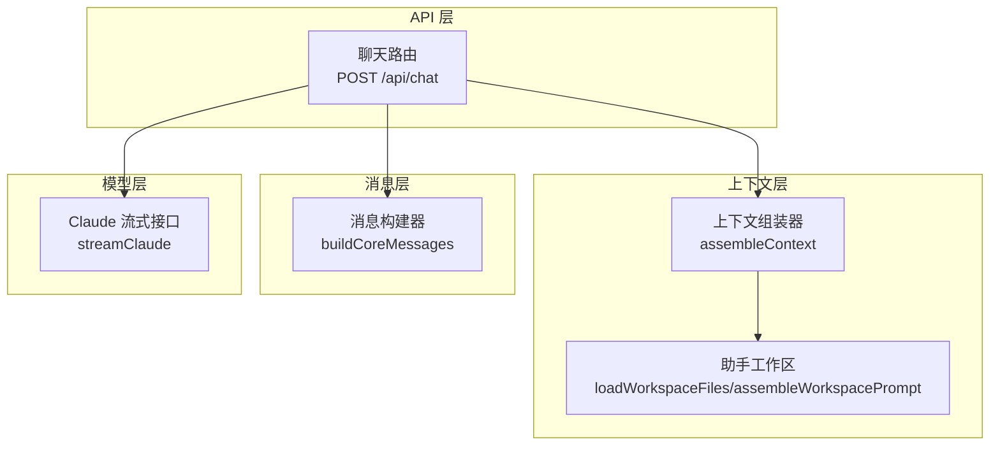
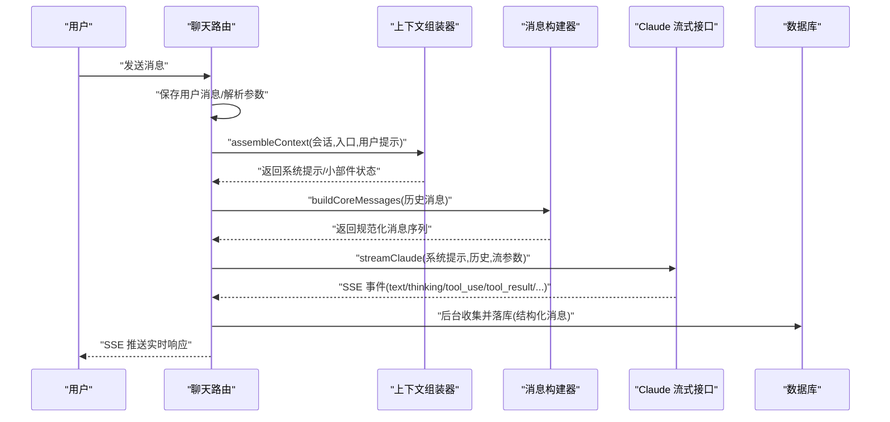
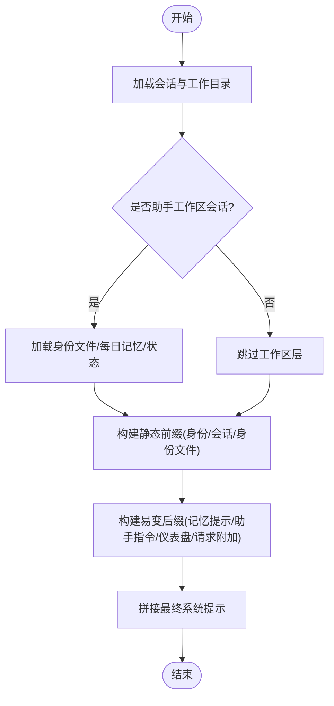
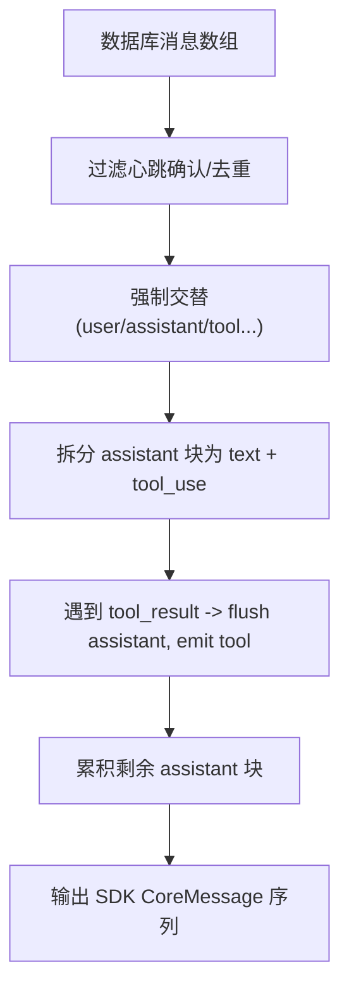
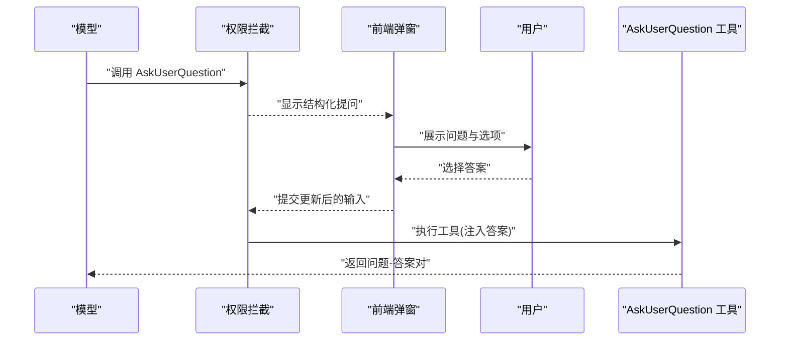
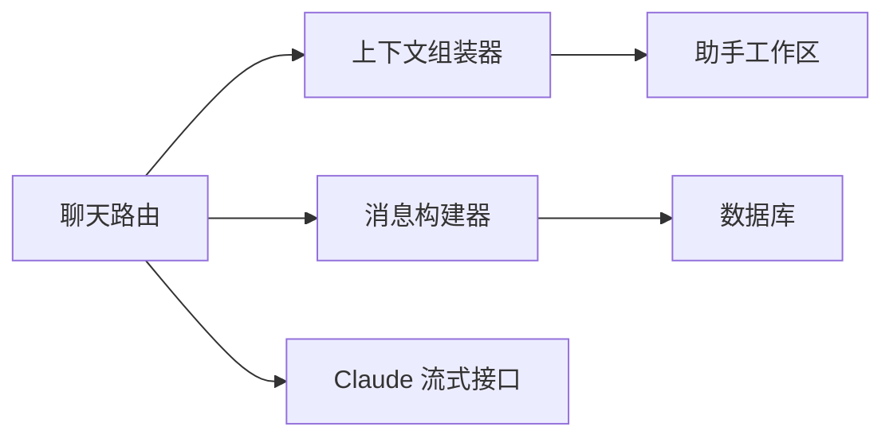

# 问答模式（Ask）

<cite>
**本文引用的文件**
- [src/app/api/chat/route.ts](file://src/app/api/chat/route.ts)
- [src/lib/context-assembler.ts](file://src/lib/context-assembler.ts)
- [src/lib/message-builder.ts](file://src/lib/message-builder.ts)
- [src/lib/agent-system-prompt.ts](file://src/lib/agent-system-prompt.ts)
- [src/lib/assistant-workspace.ts](file://src/lib/assistant-workspace.ts)
- [src/lib/builtin-tools/ask-user-question.ts](file://src/lib/builtin-tools/ask-user-question.ts)
</cite>

## 目录
1. [引言](#引言)
2. [项目结构](#项目结构)
3. [核心组件](#核心组件)
4. [架构总览](#架构总览)
5. [详细组件分析](#详细组件分析)
6. [依赖关系分析](#依赖关系分析)
7. [性能考量](#性能考量)
8. [故障排查指南](#故障排查指南)
9. [结论](#结论)
10. [附录](#附录)

## 引言
本文件系统性阐述 CodePilot 的“问答模式（Ask）”设计与实现，聚焦以下要点：
- 设计理念：以“问题识别—相关性分析—背景组装—消息流—输出格式化—推理链构建”为主线，确保在复杂与模糊问题下仍能稳定输出可溯源、可解释的答案。
- 适用场景：知识查询、概念解释、技术咨询、跨文件检索、多轮澄清与确认等。
- 实现机制：统一上下文组装（桌面端/桥接端一致）、消息结构规范化、流式响应收集与持久化、可选的“提问澄清”工具链路。

## 项目结构
问答模式贯穿三层：
- API 层：接收用户消息，解析参数，触发上下文组装与模型流式输出。
- 上下文层：按入口类型注入工作区、会话、助手指令、CLI 工具、小部件等提示。
- 消息层：将数据库消息转换为 SDK 所需的交替结构，支持工具调用与结果回传。

图表来源
- [src/app/api/chat/route.ts:27-630](file://src/app/api/chat/route.ts#L27-L630)
- [src/lib/context-assembler.ts:49-251](file://src/lib/context-assembler.ts#L49-L251)
- [src/lib/message-builder.ts:74-94](file://src/lib/message-builder.ts#L74-L94)

章节来源
- [src/app/api/chat/route.ts:27-630](file://src/app/api/chat/route.ts#L27-L630)
- [src/lib/context-assembler.ts:49-251](file://src/lib/context-assembler.ts#L49-L251)
- [src/lib/message-builder.ts:74-94](file://src/lib/message-builder.ts#L74-L94)

## 核心组件
- 统一上下文组装器：负责按入口类型（桌面/桥接）注入工作区、会话、助手指令、CLI 工具、小部件等，形成最终系统提示。
- 助手工作区：加载身份文件（claude/user/soul）、每日记忆提示、进度更新指引等，参与系统提示拼装。
- 消息构建器：将数据库消息转换为 SDK 所需的交替结构（user/assistant/tool），并合并/裁剪历史消息，保证模型输入合法。
- Agent 系统提示模板：提供任务、动作、工具、语气、输出效率等模块化提示，作为系统提示的一部分。
- 问答模式专用工具：AskUserQuestion 提供“结构化提问—用户选择—答案回填”的闭环，用于复杂问题的逐步澄清。

章节来源
- [src/lib/context-assembler.ts:49-251](file://src/lib/context-assembler.ts#L49-L251)
- [src/lib/assistant-workspace.ts:425-511](file://src/lib/assistant-workspace.ts#L425-L511)
- [src/lib/message-builder.ts:74-328](file://src/lib/message-builder.ts#L74-L328)
- [src/lib/agent-system-prompt.ts:101-140](file://src/lib/agent-system-prompt.ts#L101-L140)
- [src/lib/builtin-tools/ask-user-question.ts:62-94](file://src/lib/builtin-tools/ask-user-question.ts#L62-L94)

## 架构总览
问答模式的关键流程如下：
- 请求进入：校验会话与提供方，保存用户消息，解析权限模式与模型。
- 上下文组装：按入口类型注入工作区、会话系统提示、助手指令、小部件与请求附加提示。
- 历史与预算：估算上下文占用，必要时进行压缩；准备会话摘要与历史片段。
- 流式生成：调用模型流式接口，同时收集思考、工具调用与结果，后台异步落库。
- 结果落库：将结构化消息（含思考/工具调用/结果）写入数据库，触发后续处理（如心跳、内存抽取、通知）。

图表来源
- [src/app/api/chat/route.ts:27-630](file://src/app/api/chat/route.ts#L27-L630)
- [src/lib/context-assembler.ts:49-251](file://src/lib/context-assembler.ts#L49-L251)
- [src/lib/message-builder.ts:74-94](file://src/lib/message-builder.ts#L74-L94)

## 详细组件分析

### 组件一：上下文组装策略（问题识别、相关性分析、背景提取）
- 问题识别与关键词检测：通过用户提示与会话历史，结合助手工作区的“渐进更新指引”“软心跳提示”等，识别是否需要记忆/文件更新、是否处于助手项目会话。
- 相关性分析：基于会话摘要（压缩后的摘要）与历史片段，仅保留近期高价值上下文，避免无关历史污染。
- 背景提取：
  - 工作区身份层：claude/user/soul 身份文件，严格限制大小并截断。
  - 每日记忆提示：动态注入“最近可用的记忆日期”，引导 AI 使用 MCP 工具检索。
  - 助手指令：根据 onboarding/heartbeat 状态注入不同阶段的指导语。
  - 小部件与仪表盘：桌面端注入小部件系统提示与已挂载的小部件清单。
  - 请求附加提示：如图像生成等技能注入的系统提示追加。

图表来源
- [src/lib/context-assembler.ts:49-251](file://src/lib/context-assembler.ts#L49-L251)
- [src/lib/assistant-workspace.ts:425-511](file://src/lib/assistant-workspace.ts#L425-L511)

章节来源
- [src/lib/context-assembler.ts:49-251](file://src/lib/context-assembler.ts#L49-L251)
- [src/lib/assistant-workspace.ts:425-511](file://src/lib/assistant-workspace.ts#L425-L511)

### 组件二：消息处理流程与结构规范化
- 历史消息规范化：合并连续用户消息、裁剪非文本附件、将数据库中的混合块拆分为 SDK 所需的交替结构（assistant → tool → assistant）。
- 工具调用与结果回传：捕获 tool_use 与 tool_result，去重并按顺序回填，确保模型可感知工具执行结果。
- 流式收集与落库：边流式边收集，最后统一写入数据库，支持结构化消息与纯文本两种存储路径。

图表来源
- [src/lib/message-builder.ts:74-328](file://src/lib/message-builder.ts#L74-L328)

章节来源
- [src/lib/message-builder.ts:74-328](file://src/lib/message-builder.ts#L74-L328)

### 组件三：输出格式化规则（直接回答、引用来源、推理链）
- 直接回答：当无工具调用时，存储为纯文本，简洁高效。
- 引用来源：当存在工具调用/结果时，采用结构化块存储，前端可渲染工具调用与结果，便于溯源。
- 推理链构建：思考块（thinking）在流中累积并在最终消息前插入，既可被前端渲染，也可作为后处理的依据。

章节来源
- [src/app/api/chat/route.ts:809-840](file://src/app/api/chat/route.ts#L809-L840)
- [src/lib/message-builder.ts:231-327](file://src/lib/message-builder.ts#L231-L327)

### 组件四：问答模式下的“提问澄清”工具链路
- 场景：当问题模糊或需要多选项确认时，模型调用 AskUserQuestion 工具发起结构化提问。
- 流程：权限拦截（Always Ask Tools）→ 前端弹窗呈现问题与选项 → 用户选择后回填答案 → 工具返回“问题-答案”对，供模型继续推理。

图表来源
- [src/lib/builtin-tools/ask-user-question.ts:62-94](file://src/lib/builtin-tools/ask-user-question.ts#L62-L94)

章节来源
- [src/lib/builtin-tools/ask-user-question.ts:62-94](file://src/lib/builtin-tools/ask-user-question.ts#L62-L94)

### 组件五：问答模式的典型使用场景
- 知识查询：结合工作区身份文件与检索工具，提供可溯源的背景与结论。
- 概念解释：利用系统提示的“输出效率”“简洁直接”约束，避免冗长铺垫。
- 技术咨询：在工具链允许范围内，先通过工具获取上下文（如文件/命令），再给出结论。
- 复杂与模糊问题：通过 AskUserQuestion 逐步澄清，降低歧义，提升准确率。

章节来源
- [src/lib/agent-system-prompt.ts:76-87](file://src/lib/agent-system-prompt.ts#L76-L87)
- [src/lib/builtin-tools/ask-user-question.ts:36-41](file://src/lib/builtin-tools/ask-user-question.ts#L36-L41)

## 依赖关系分析
- 路由依赖上下文组装器与消息构建器，二者共同决定最终系统提示与历史输入。
- 上下文组装器依赖助手工作区模块，以身份文件与每日记忆提示参与系统提示拼装。
- 模型流式接口依赖系统提示、历史消息、会话摘要与工具服务器配置。
- 后台落库依赖消息构建器的规范化结果，确保结构化与纯文本两种存储路径兼容。

图表来源
- [src/app/api/chat/route.ts:27-630](file://src/app/api/chat/route.ts#L27-L630)
- [src/lib/context-assembler.ts:49-251](file://src/lib/context-assembler.ts#L49-L251)
- [src/lib/message-builder.ts:74-94](file://src/lib/message-builder.ts#L74-L94)
- [src/lib/assistant-workspace.ts:425-511](file://src/lib/assistant-workspace.ts#L425-L511)

章节来源
- [src/app/api/chat/route.ts:27-630](file://src/app/api/chat/route.ts#L27-L630)
- [src/lib/context-assembler.ts:49-251](file://src/lib/context-assembler.ts#L49-L251)
- [src/lib/message-builder.ts:74-94](file://src/lib/message-builder.ts#L74-L94)
- [src/lib/assistant-workspace.ts:425-511](file://src/lib/assistant-workspace.ts#L425-L511)

## 性能考量
- 上下文预算：通过上下文估计与压缩，避免超限导致的失败与重试风暴。
- 历史裁剪：合并连续用户消息、丢弃心跳确认、按令牌预算保留近期高价值片段。
- 流式落库：边流式边收集，减少一次性写入压力；媒体块落地后替换为本地路径，降低传输成本。
- 小部件与仪表盘：仅在桌面端注入，避免桥接端额外负担。

## 故障排查指南
- 会话锁冲突：并发请求可能触发“会话繁忙”，需等待锁释放或重试。
- 提供方缺失：未配置提供方时返回明确错误码与引导动作。
- 压缩失败：上下文估计失败时降级为无压缩路径；自动压缩失败不影响继续对话。
- 流读取异常：即使流读取出错，也会尽力将已收集内容落库，保证最小一致性。
- 心跳与检查：软心跳标记与心跳状态更新在服务端二次校验，避免前端遗漏导致的状态偏差。

章节来源
- [src/app/api/chat/route.ts:48-58](file://src/app/api/chat/route.ts#L48-L58)
- [src/app/api/chat/route.ts:510-512](file://src/app/api/chat/route.ts#L510-L512)
- [src/app/api/chat/route.ts:841-870](file://src/app/api/chat/route.ts#L841-L870)
- [src/app/api/chat/route.ts:891-912](file://src/app/api/chat/route.ts#L891-L912)

## 结论
问答模式通过“统一上下文组装—规范化消息—流式生成—结构化落库”的闭环，实现了在复杂与模糊问题下的稳健问答。借助助手工作区的身份与记忆机制、可选的提问澄清工具链路，以及严格的输出格式化与推理链构建，能够在知识查询、概念解释、技术咨询等场景中提供高质量、可溯源、可解释的答案。

## 附录
- 术语
  - “助手工作区”：在特定工作目录内维护身份文件与每日记忆，辅助模型理解用户偏好与近期事实。
  - “结构化消息”：包含文本、工具调用与工具结果的混合块，便于前端渲染与溯源。
  - “流式收集”：在 SSE 流中逐帧解析事件，边解析边落库，保证实时性与一致性。