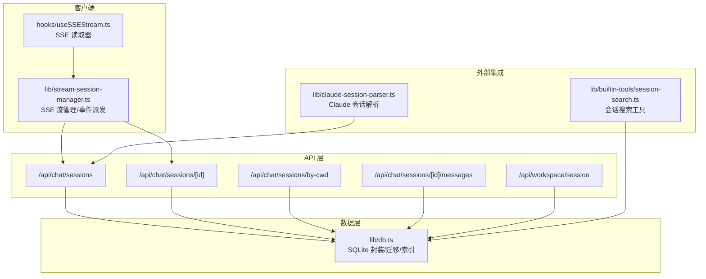
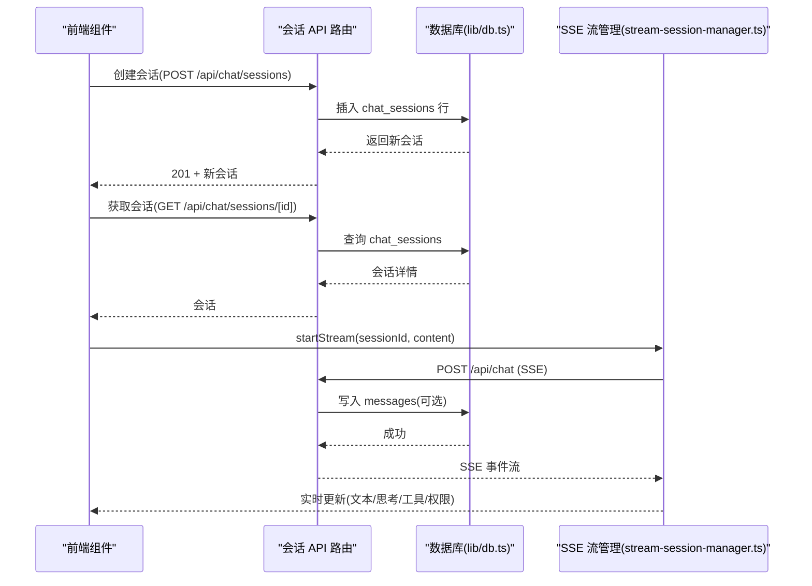
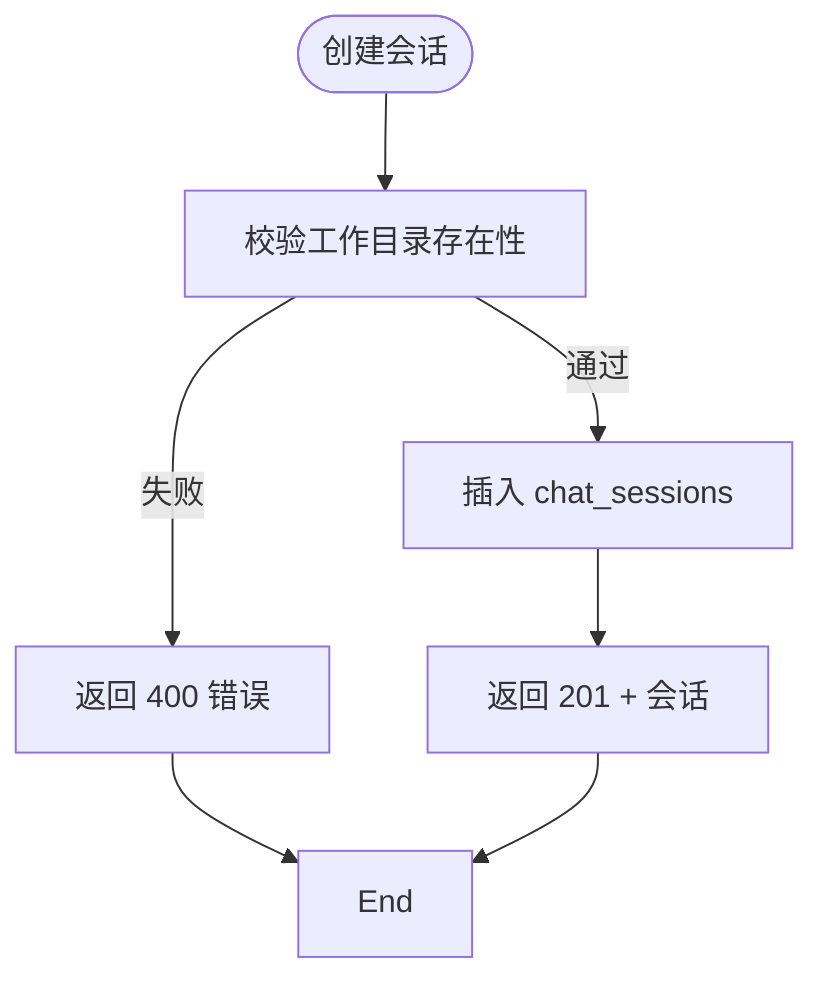
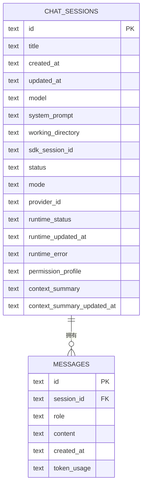
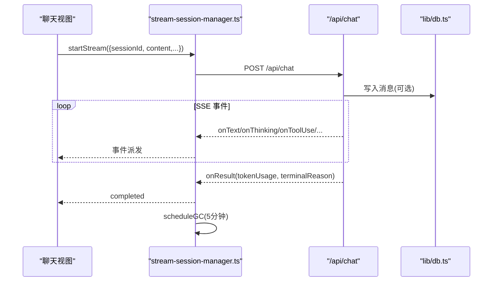
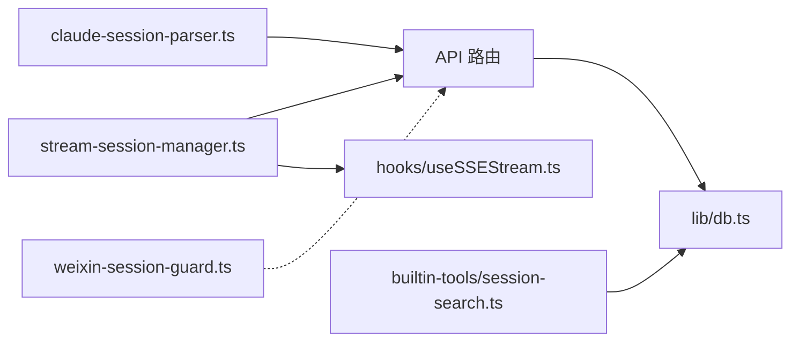

# 会话管理

<cite>
**本文引用的文件**
- [src/app/api/chat/sessions/route.ts](file://src/app/api/chat/sessions/route.ts)
- [src/app/api/chat/sessions/[id]/route.ts](file://src/app/api/chat/sessions/[id]/route.ts)
- [src/app/api/chat/sessions/by-cwd/route.ts](file://src/app/api/chat/sessions/by-cwd/route.ts)
- [src/app/api/chat/sessions/[id]/messages/route.ts](file://src/app/api/chat/sessions/[id]/messages/route.ts)
- [src/app/api/workspace/session/route.ts](file://src/app/api/workspace/session/route.ts)
- [src/lib/db.ts](file://src/lib/db.ts)
- [src/lib/stream-session-manager.ts](file://src/lib/stream-session-manager.ts)
- [src/lib/claude-session-parser.ts](file://src/lib/claude-session-parser.ts)
- [src/lib/resolve-session-model.ts](file://src/lib/resolve-session-model.ts)
- [src/lib/builtin-tools/session-search.ts](file://src/lib/builtin-tools/session-search.ts)
- [src/tabs/index.ts](file://src/tabs/index.ts)
- [src/tabs/chat.tsx](file://src/tabs/chat.tsx)
- [src/components/layout/SessionListItem.tsx](file://src/components/layout/SessionListItem.tsx)
- [src/components/layout/chat-list-utils.ts](file://src/components/layout/chat-list-utils.ts)
- [src/hooks/useSSEStream.ts](file://src/hooks/useSSEStream.ts)
- [src/lib/bridge/adapters/weixin/weixin-session-guard.ts](file://src/lib/bridge/adapters/weixin/weixin-session-guard.ts)
- [src/app/api/claude-sessions/import/route.ts](file://src/app/api/claude-sessions/import/route.ts)
- [src/lib/claude-session-parser.ts](file://src/lib/claude-session-parser.ts)
- [src/types/index.ts](file://src/types/index.ts)
</cite>

## 目录
1. [简介](#简介)
2. [项目结构](#项目结构)
3. [核心组件](#核心组件)
4. [架构总览](#架构总览)
5. [详细组件分析](#详细组件分析)
6. [依赖关系分析](#依赖关系分析)
7. [性能考量](#性能考量)
8. [故障排查指南](#故障排查指南)
9. [结论](#结论)
10. [附录](#附录)

## 简介
本文件系统性阐述 CodePilot 的会话管理系统，覆盖会话生命周期（创建、维护、销毁）、状态管理、消息历史存储、会话暂停/恢复机制、归档与删除、会话 ID 生成规则、元数据存储、消息索引与搜索、API 接口说明与使用示例、数据持久化策略以及并发访问控制等。文档面向不同技术背景读者，既提供高层概览也包含代码级细节与可视化图示。

## 项目结构
围绕会话管理的关键目录与文件：
- API 层：Next.js 路由处理器，负责会话 CRUD、消息查询、工作区会话创建、按工作目录查找最新会话等
- 数据层：SQLite 数据库封装，提供会话与消息的增删改查、索引、迁移与并发锁
- 客户端流式会话管理：独立的客户端单例，管理 SSE 流、事件派发、空闲超时回收、权限请求处理
- 外部会话导入：Claude Code 会话解析与导入
- 工具与搜索：内置会话搜索工具，支持跨会话关键词检索
- 会话守卫：桥接通道（如微信）的会话暂停/恢复机制

图表来源
- [src/app/api/chat/sessions/route.ts:1-57](file://src/app/api/chat/sessions/route.ts#L1-L57)
- [src/app/api/chat/sessions/[id]/route.ts](file://src/app/api/chat/sessions/[id]/route.ts#L1-L118)
- [src/app/api/chat/sessions/by-cwd/route.ts:1-16](file://src/app/api/chat/sessions/by-cwd/route.ts#L1-L16)
- [src/app/api/chat/sessions/[id]/messages/route.ts](file://src/app/api/chat/sessions/[id]/messages/route.ts#L1-L52)
- [src/app/api/workspace/session/route.ts:1-46](file://src/app/api/workspace/session/route.ts#L1-L46)
- [src/lib/db.ts:1-120](file://src/lib/db.ts#L1-L120)
- [src/lib/stream-session-manager.ts:1-120](file://src/lib/stream-session-manager.ts#L1-L120)
- [src/hooks/useSSEStream.ts](file://src/hooks/useSSEStream.ts)

章节来源
- [src/app/api/chat/sessions/route.ts:1-57](file://src/app/api/chat/sessions/route.ts#L1-L57)
- [src/lib/db.ts:98-320](file://src/lib/db.ts#L98-L320)

## 核心组件
- 会话 API 控制器：提供会话列表、创建、更新、删除；支持按工作目录获取最新会话；支持按会话 ID 查询消息列表
- 数据库层：统一的 SQLite 访问、表结构初始化与迁移、索引、并发锁、设置项与任务表扩展
- 客户端流式会话管理：SSE 流生命周期管理、事件监听、空闲超时、错误处理与自动重试、权限请求响应
- 外部会话导入：解析 Claude Code 会话文件，提取元数据与消息，支持导入到本地会话
- 内置会话搜索：基于 SQLite 的关键字搜索，返回会话标题、角色、时间戳与片段
- 会话守卫：桥接通道（如微信）的会话暂停/恢复，防止过期会话继续请求

章节来源
- [src/app/api/chat/sessions/route.ts:1-57](file://src/app/api/chat/sessions/route.ts#L1-L57)
- [src/app/api/chat/sessions/[id]/route.ts](file://src/app/api/chat/sessions/[id]/route.ts#L1-L118)
- [src/lib/db.ts:98-320](file://src/lib/db.ts#L98-L320)
- [src/lib/stream-session-manager.ts:1-120](file://src/lib/stream-session-manager.ts#L1-L120)
- [src/lib/claude-session-parser.ts:1-120](file://src/lib/claude-session-parser.ts#L1-L120)
- [src/lib/builtin-tools/session-search.ts:1-79](file://src/lib/builtin-tools/session-search.ts#L1-L79)
- [src/lib/bridge/adapters/weixin/weixin-session-guard.ts:1-72](file://src/lib/bridge/adapters/weixin/weixin-session-guard.ts#L1-L72)

## 架构总览
会话管理采用“API 层 → 数据层 → 客户端流式管理”的分层设计。API 路由通过 lib/db.ts 访问 SQLite，客户端通过 stream-session-manager.ts 维护 SSE 流，实现跨组件生命周期的稳定状态管理。

图表来源
- [src/app/api/chat/sessions/route.ts:18-56](file://src/app/api/chat/sessions/route.ts#L18-L56)
- [src/app/api/chat/sessions/[id]/route.ts](file://src/app/api/chat/sessions/[id]/route.ts#L5-L96)
- [src/lib/db.ts:100-120](file://src/lib/db.ts#L100-L120)
- [src/lib/stream-session-manager.ts:187-241](file://src/lib/stream-session-manager.ts#L187-L241)

## 详细组件分析

### 会话 API 与数据库交互
- 会话列表与创建
  - GET /api/chat/sessions：返回所有会话
  - POST /api/chat/sessions：校验工作目录存在性，创建会话并返回 201
- 单个会话操作
  - GET /api/chat/sessions/[id]：按 ID 获取会话
  - PATCH /api/chat/sessions/[id]：支持更新标题、工作目录、模式、模型、提供方、SDK 会话 ID、权限配置；当模型/提供方变更且未显式提供 SDK 会话 ID 时，自动清空旧 SDK 会话 ID 防止后续恢复失败
  - DELETE /api/chat/sessions/[id]：删除会话（级联删除消息）
- 按工作目录获取最新会话
  - GET /api/chat/sessions/by-cwd：返回指定工作目录的最新会话 ID
- 消息查询
  - GET /api/chat/sessions/[id]/messages：支持 limit、beforeRowId 分页，排除心跳 ACK；对旧消息中的文件附件 base64 数据进行清理
- 工作区会话创建
  - POST /api/workspace/session：根据工作区路径创建或复用最新会话，返回是否新建

图表来源
- [src/app/api/chat/sessions/route.ts:18-56](file://src/app/api/chat/sessions/route.ts#L18-L56)

章节来源
- [src/app/api/chat/sessions/route.ts:1-57](file://src/app/api/chat/sessions/route.ts#L1-L57)
- [src/app/api/chat/sessions/[id]/route.ts](file://src/app/api/chat/sessions/[id]/route.ts#L1-L118)
- [src/app/api/chat/sessions/by-cwd/route.ts:1-16](file://src/app/api/chat/sessions/by-cwd/route.ts#L1-L16)
- [src/app/api/chat/sessions/[id]/messages/route.ts](file://src/app/api/chat/sessions/[id]/messages/route.ts#L1-L52)
- [src/app/api/workspace/session/route.ts:1-46](file://src/app/api/workspace/session/route.ts#L1-L46)

### 数据库设计与持久化策略
- 表结构
  - chat_sessions：会话主表，包含 id、title、created_at、updated_at、model、system_prompt、working_directory、sdk_session_id、status、mode、provider_id、runtime_* 等字段
  - messages：消息表，外键关联 chat_sessions，包含 id、session_id、role、content、created_at、token_usage
  - 其他扩展表：tasks、api_providers、media_*、channel_*、settings 等
- 索引
  - messages(session_id)、messages(created_at)、chat_sessions(updated_at) 等，支撑高频查询
- 迁移与兼容
  - 自动迁移新增列（如 provider_id、context_summary_* 等），回填历史数据
- 并发与锁
  - 使用文件锁避免多构建进程并发迁移
  - better-sqlite3 设置 busy_timeout、WAL 模式、外键开启
- 设置与任务
  - settings 表存储全局设置；tasks 表支持任务生命周期管理

图表来源
- [src/lib/db.ts:98-120](file://src/lib/db.ts#L98-L120)

章节来源
- [src/lib/db.ts:98-320](file://src/lib/db.ts#L98-L320)

### 客户端流式会话管理
- 单例管理：通过 globalThis 模式在 HMR 下保持状态
- 生命周期
  - startStream：启动新流，若已存在活动流则先中断旧流；建立 AbortController、定时器、快照与监听者注册
  - runStream：发起 /api/chat 请求，消费 SSE；实时更新文本、思考、工具调用/结果、权限请求、上下文压缩、速率限制、令牌用量等；空闲超时（默认 330 秒）触发清理
  - stopStream：优先优雅中断 /api/chat/interrupt，失败则强制 abort
  - 事件派发：向订阅者广播 phase-changed/completed/snapshot-updated 等事件，并通过 window 自定义事件通知上层
- 回收策略：完成/错误后延迟 5 分钟回收，避免频繁重建
- 权限与重试
  - 权限请求：等待用户允许/拒绝，支持会话级授权更新
  - 工具超时：自动重试提示用户更换方案

图表来源
- [src/lib/stream-session-manager.ts:187-241](file://src/lib/stream-session-manager.ts#L187-L241)
- [src/lib/stream-session-manager.ts:291-498](file://src/lib/stream-session-manager.ts#L291-L498)

章节来源
- [src/lib/stream-session-manager.ts:1-800](file://src/lib/stream-session-manager.ts#L1-L800)

### 会话 ID 生成规则与元数据
- 会话 ID：由 better-sqlite3 数据库自动生成（随机十六进制字符串），确保唯一性
- 元数据字段
  - 标题、创建/更新时间、模型、系统提示、工作目录、SDK 会话 ID、状态、模式、提供方、运行时状态/时间/错误、权限配置、上下文摘要与边界行号等
- 会话模型解析
  - 优先使用会话存储的模型；否则按提供方内全局默认模型；再按提供方首个可用模型；最后回退到全局默认或本地存储的上次使用模型

章节来源
- [src/lib/db.ts:100-109](file://src/lib/db.ts#L100-L109)
- [src/lib/resolve-session-model.ts:1-114](file://src/lib/resolve-session-model.ts#L1-L114)
- [src/types/index.ts:5-27](file://src/types/index.ts#L5-L27)

### 消息历史存储与消息索引机制
- 存储格式
  - messages.content 以 JSON 字符串存储 MessageContentBlock[]，支持 text、thinking、tool_use、tool_result、code 等块
  - token_usage 以 JSON 字符串存储 TokenUsage
- 索引与查询
  - messages(session_id)、messages(created_at)、chat_sessions(updated_at) 等索引提升查询效率
  - 消息查询支持 limit、beforeRowId 分页，excludeHeartbeatAck 过滤心跳 ACK
- 文件附件清理
  - 旧消息中的 base64 data 字段在返回前被清理，避免传输冗余

章节来源
- [src/app/api/chat/sessions/[id]/messages/route.ts](file://src/app/api/chat/sessions/[id]/messages/route.ts#L1-L52)
- [src/lib/db.ts:231-242](file://src/lib/db.ts#L231-L242)
- [src/types/index.ts:143-186](file://src/types/index.ts#L143-L186)

### 会话暂停/恢复机制
- 通用暂停
  - 会话 API 在 PATCH 更新模型/提供方时，若未显式提供 sdk_session_id，则自动清空旧值，防止后续恢复失败
- 桥接通道暂停（以微信为例）
  - 会话守卫记录账户暂停状态与到期时间，支持查询剩余暂停时长、清除暂停、批量清除
  - 适用于会话过期（如 errcode -14）后的临时阻断

章节来源
- [src/app/api/chat/sessions/[id]/route.ts](file://src/app/api/chat/sessions/[id]/route.ts#L44-L72)
- [src/lib/bridge/adapters/weixin/weixin-session-guard.ts:1-72](file://src/lib/bridge/adapters/weixin/weixin-session-guard.ts#L1-L72)

### 会话归档与删除
- 归档
  - chat_sessions.status 支持 'active'/'archived'，可用于 UI 层面的归档展示与筛选
- 删除
  - DELETE /api/chat/sessions/[id] 删除会话，数据库外键级联删除消息与相关任务

章节来源
- [src/types/index.ts:15-15](file://src/types/index.ts#L15-L15)
- [src/app/api/chat/sessions/[id]/route.ts](file://src/app/api/chat/sessions/[id]/route.ts#L100-L117)

### 会话搜索与过滤
- 内置会话搜索工具
  - 提供 codepilot_session_search 工具，支持关键词搜索、限定会话、限制返回数量
  - 底层调用 db.searchMessages，返回会话标题、角色、时间戳与片段
- 关键词搜索
  - 使用 LIKE 查询（当前未启用 FTS5），适合轻量场景；可作为后续性能优化方向

章节来源
- [src/lib/builtin-tools/session-search.ts:1-79](file://src/lib/builtin-tools/session-search.ts#L1-L79)
- [src/lib/db.ts:423-432](file://src/lib/db.ts#L423-L432)

### 外部会话导入（Claude Code）
- 发现与解析
  - 列举 ~/.claude/projects 下的 .jsonl 文件，提取会话元数据（工作目录、分支、版本、消息计数、时间戳、大小）
  - 解析用户/助手消息，支持文本、工具调用与结果块
- 导入流程
  - 通过 /api/claude-sessions/import 路由将解析结果写入本地会话与消息表

章节来源
- [src/lib/claude-session-parser.ts:164-211](file://src/lib/claude-session-parser.ts#L164-L211)
- [src/lib/claude-session-parser.ts:319-430](file://src/lib/claude-session-parser.ts#L319-L430)
- [src/app/api/claude-sessions/import/route.ts](file://src/app/api/claude-sessions/import/route.ts)

### API 接口说明与使用示例
- 创建会话
  - 方法：POST /api/chat/sessions
  - 请求体：title、model、system_prompt、working_directory、mode、provider_id、permission_profile
  - 响应：201 + { session }
- 获取会话
  - 方法：GET /api/chat/sessions/[id]
  - 响应：{ session }
- 更新会话
  - 方法：PATCH /api/chat/sessions/[id]
  - 支持字段：title、working_directory、mode、model、provider_id、sdk_session_id、permission_profile、clear_messages
  - 注意：模型/提供方变更且未提供 sdk_session_id 时，自动清空旧 sdk_session_id
- 删除会话
  - 方法：DELETE /api/chat/sessions/[id]
  - 响应：{ success: true }
- 按工作目录获取最新会话
  - 方法：GET /api/chat/sessions/by-cwd?cwd=绝对路径
  - 响应：{ sessionId } 或 null
- 查询会话消息
  - 方法：GET /api/chat/sessions/[id]/messages?limit=&before=
  - 响应：{ messages, hasMore }
- 工作区会话
  - 方法：POST /api/workspace/session
  - 请求体：{ mode? onboarding/checkin, model?, provider_id? }
  - 响应：{ session, isNew }

章节来源
- [src/app/api/chat/sessions/route.ts:1-57](file://src/app/api/chat/sessions/route.ts#L1-L57)
- [src/app/api/chat/sessions/[id]/route.ts](file://src/app/api/chat/sessions/[id]/route.ts#L1-L118)
- [src/app/api/chat/sessions/by-cwd/route.ts:1-16](file://src/app/api/chat/sessions/by-cwd/route.ts#L1-L16)
- [src/app/api/chat/sessions/[id]/messages/route.ts](file://src/app/api/chat/sessions/[id]/messages/route.ts#L1-L52)
- [src/app/api/workspace/session/route.ts:1-46](file://src/app/api/workspace/session/route.ts#L1-L46)

## 依赖关系分析
- API 路由依赖 lib/db.ts 进行数据库操作
- 客户端通过 stream-session-manager.ts 管理 SSE 流，内部依赖 hooks/useSSEStream.ts
- 会话搜索工具动态导入 lib/db.ts 的 searchMessages
- 外部会话导入依赖 lib/claude-session-parser.ts
- 会话守卫独立于数据库，仅维护内存暂停状态

图表来源
- [src/app/api/chat/sessions/route.ts:1-5](file://src/app/api/chat/sessions/route.ts#L1-L5)
- [src/lib/db.ts:1-12](file://src/lib/db.ts#L1-L12)
- [src/lib/stream-session-manager.ts:13-25](file://src/lib/stream-session-manager.ts#L13-L25)
- [src/lib/builtin-tools/session-search.ts:18-20](file://src/lib/builtin-tools/session-search.ts#L18-L20)
- [src/lib/claude-session-parser.ts:15-18](file://src/lib/claude-session-parser.ts#L15-L18)
- [src/lib/bridge/adapters/weixin/weixin-session-guard.ts:1-6](file://src/lib/bridge/adapters/weixin/weixin-session-guard.ts#L1-L6)

章节来源
- [src/app/api/chat/sessions/route.ts:1-5](file://src/app/api/chat/sessions/route.ts#L1-L5)
- [src/lib/stream-session-manager.ts:13-25](file://src/lib/stream-session-manager.ts#L13-L25)
- [src/lib/builtin-tools/session-search.ts:18-20](file://src/lib/builtin-tools/session-search.ts#L18-L20)
- [src/lib/claude-session-parser.ts:15-18](file://src/lib/claude-session-parser.ts#L15-L18)
- [src/lib/bridge/adapters/weixin/weixin-session-guard.ts:1-6](file://src/lib/bridge/adapters/weixin/weixin-session-guard.ts#L1-L6)

## 性能考量
- 数据库
  - WAL 模式与 busy_timeout 提升并发写入稳定性
  - 合理索引（messages.session_id、chat_sessions.updated_at 等）降低查询成本
  - 迁移阶段避免重复列添加，减少锁竞争
- 流式渲染
  - 文本节流（默认 100ms）减少 React 重渲染频率
  - 空闲超时（330 秒）与延迟回收（5 分钟）平衡资源占用
- 搜索
  - 当前使用 LIKE，建议后续引入 FTS5 以提升关键词搜索性能
- 文件附件
  - 返回前清理 base64 data，减小网络传输体积

## 故障排查指南
- 会话创建失败（目录不存在）
  - 现象：POST /api/chat/sessions 返回 400，错误码 INVALID_DIRECTORY
  - 处理：确认 working_directory 存在且可访问
- 模型/提供方变更导致恢复失败
  - 现象：PATCH 更新 model/provider_id 且未提供 sdk_session_id，旧 sdk_session_id 被自动清空
  - 处理：下次消息发送将重新建立 SDK 会话
- SSE 流空闲超时
  - 现象：流在 330 秒无事件后中断，最终消息包含超时提示
  - 处理：检查网络与服务端连接；必要时手动重试
- 权限请求未决
  - 现象：UI 显示待处理权限，需用户允许/拒绝
  - 处理：在 UI 中完成决策；也可通过 respondToPermission 接口处理
- 会话守卫暂停
  - 现象：特定账户（如微信）被暂停一段时间
  - 处理：等待暂停到期或主动清除暂停状态

章节来源
- [src/app/api/chat/sessions/route.ts:22-38](file://src/app/api/chat/sessions/route.ts#L22-L38)
- [src/app/api/chat/sessions/[id]/route.ts](file://src/app/api/chat/sessions/[id]/route.ts#L44-L72)
- [src/lib/stream-session-manager.ts:246-253](file://src/lib/stream-session-manager.ts#L246-L253)
- [src/lib/bridge/adapters/weixin/weixin-session-guard.ts:18-44](file://src/lib/bridge/adapters/weixin/weixin-session-guard.ts#L18-L44)

## 结论
CodePilot 的会话管理以清晰的分层架构实现：API 路由负责接口契约与参数校验，lib/db.ts 提供稳定的数据库访问与迁移能力，客户端 stream-session-manager.ts 确保流式体验的连续性与健壮性。配合会话搜索、外部导入与会话守卫机制，形成从创建到销毁的完整闭环。未来可在搜索性能、并发控制与跨平台一致性方面持续优化。

## 附录
- 会话状态枚举：active/archived
- 模式枚举：code/plan/ask
- 权限配置：default/full_access
- 运行时状态：idle/running/waiting_permission 等（重启后自动恢复为 idle）

章节来源
- [src/types/index.ts:15-27](file://src/types/index.ts#L15-L27)
- [src/lib/db.ts:664-671](file://src/lib/db.ts#L664-L671)