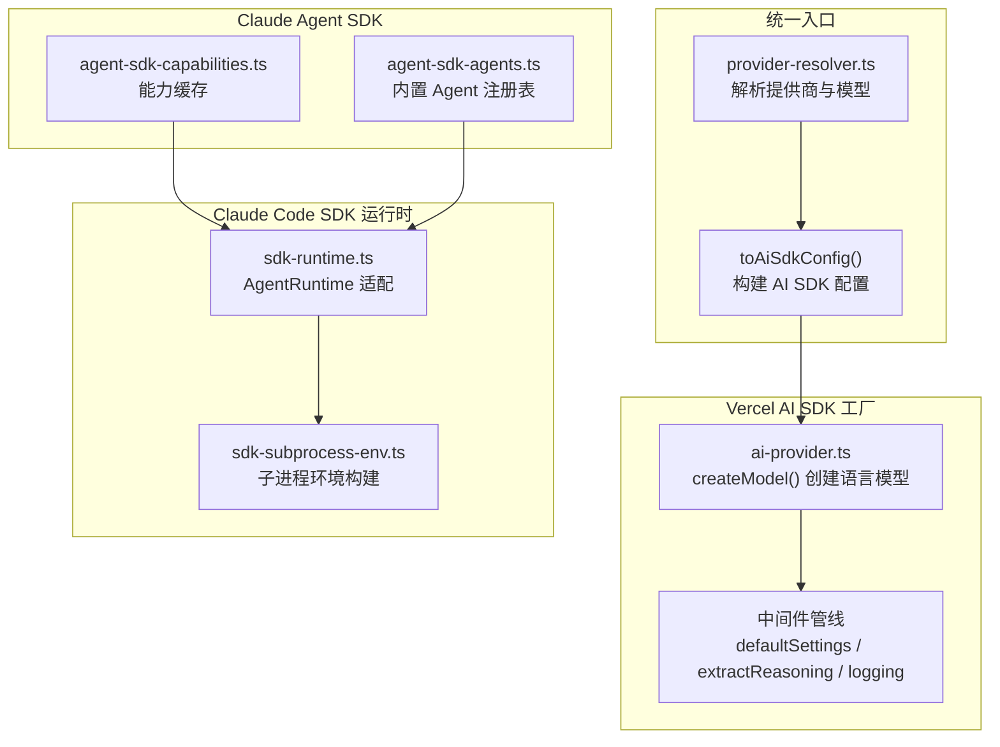
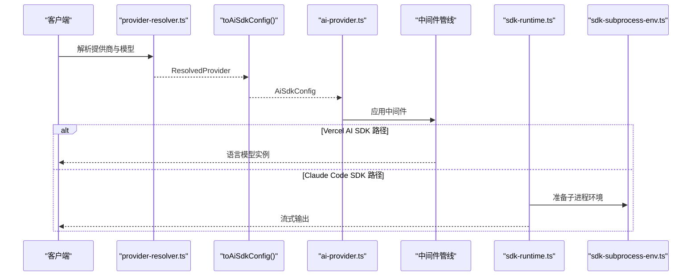
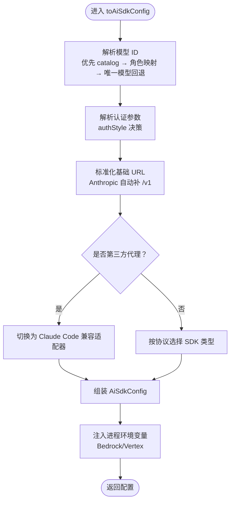
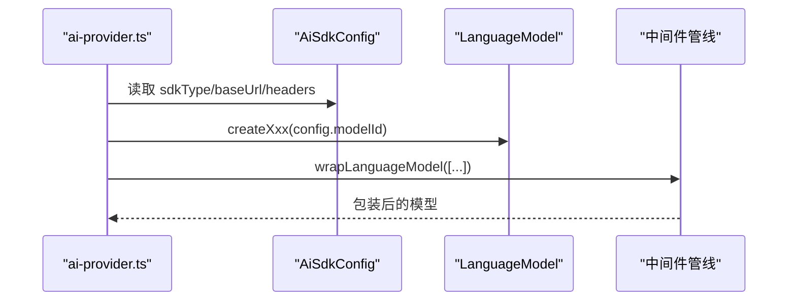
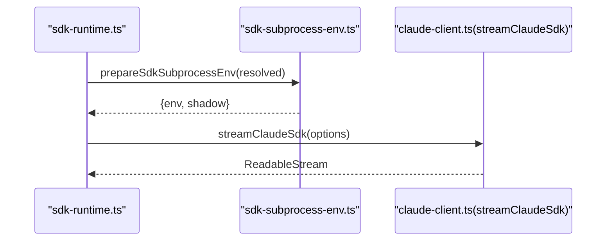
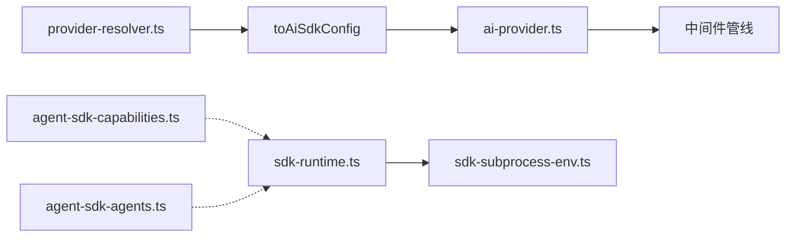

# AI SDK 集成层

<cite>
**本文引用的文件**
- [ai-provider.ts](file://src/lib/ai-provider.ts)
- [provider-resolver.ts](file://src/lib/provider-resolver.ts)
- [agent-sdk-agents.ts](file://src/lib/agent-sdk-agents.ts)
- [agent-sdk-capabilities.ts](file://src/lib/agent-sdk-capabilities.ts)
- [sdk-runtime.ts](file://src/lib/runtime/sdk-runtime.ts)
- [sdk-subprocess-env.ts](file://src/lib/sdk-subprocess-env.ts)
- [route.ts](file://src/app/api/sdk/account/route.ts)
</cite>

## 目录
1. [简介](#简介)
2. [项目结构](#项目结构)
3. [核心组件](#核心组件)
4. [架构总览](#架构总览)
5. [详细组件分析](#详细组件分析)
6. [依赖关系分析](#依赖关系分析)
7. [性能考量](#性能考量)
8. [故障排查指南](#故障排查指南)
9. [结论](#结论)
10. [附录](#附录)

## 简介
本文件面向 CodePilot 的 AI SDK 集成层，系统性说明如何统一接入 Vercel AI SDK、@ai-sdk/* 各类供应商 SDK、Claude Agent SDK 与 Claude Code SDK，并深入解析 SDK 配置构建器 toAiSdkConfig 的工作机理。内容涵盖：
- SDK 类型选择、认证参数注入、基础 URL 处理、头部信息设置
- 特化处理（Bedrock、Vertex、OpenRouter）
- 能力检测与缓存、降级策略
- 具体配置示例路径与性能优化建议

## 项目结构
AI SDK 集成层主要由以下模块构成：
- 提供商解析与配置构建：provider-resolver.ts
- Vercel AI SDK 统一工厂：ai-provider.ts
- Claude Agent SDK 能力缓存与注册表：agent-sdk-capabilities.ts、agent-sdk-agents.ts
- Claude Code SDK 运行时适配：runtime/sdk-runtime.ts
- 子进程环境构建与隔离：sdk-subprocess-env.ts
- 能力查询 API：app/api/sdk/account/route.ts



图表来源
- [provider-resolver.ts:356-620](file://src/lib/provider-resolver.ts#L356-L620)
- [ai-provider.ts:57-117](file://src/lib/ai-provider.ts#L57-L117)
- [agent-sdk-capabilities.ts:102-142](file://src/lib/agent-sdk-capabilities.ts#L102-L142)
- [agent-sdk-agents.ts:24-51](file://src/lib/agent-sdk-agents.ts#L24-L51)
- [sdk-runtime.ts:27-95](file://src/lib/runtime/sdk-runtime.ts#L27-L95)
- [sdk-subprocess-env.ts:50-81](file://src/lib/sdk-subprocess-env.ts#L50-L81)

章节来源
- [provider-resolver.ts:1-1186](file://src/lib/provider-resolver.ts#L1-L1186)
- [ai-provider.ts:1-370](file://src/lib/ai-provider.ts#L1-L370)
- [agent-sdk-capabilities.ts:1-203](file://src/lib/agent-sdk-capabilities.ts#L1-L203)
- [agent-sdk-agents.ts:1-59](file://src/lib/agent-sdk-agents.ts#L1-L59)
- [sdk-runtime.ts:1-96](file://src/lib/runtime/sdk-runtime.ts#L1-L96)
- [sdk-subprocess-env.ts:1-82](file://src/lib/sdk-subprocess-env.ts#L1-L82)

## 核心组件
- 提供商解析与配置构建（provider-resolver.ts）
  - 统一解析提供商、协议、认证风格、模型映射与可用模型目录
  - 生成 AiSdkConfig，覆盖 Anthropic、OpenAI、Google、Bedrock、Vertex、OpenRouter、兼容 OpenAI 的多种协议
- Vercel AI SDK 工厂（ai-provider.ts）
  - 基于 AiSdkConfig 创建具体 SDK 语言模型实例
  - 统一中间件管线：默认设置、推理提取、开发期日志
  - 第三方代理识别与安全处理（禁用自适应思考等）
- Claude Agent SDK 能力缓存与注册表（agent-sdk-capabilities.ts、agent-sdk-agents.ts）
  - 查询会话的能力缓存（模型、命令、账户、MCP 状态、插件）
  - 内置 Agent 注册表，支持未来 SDK 原生 Agent 集成
- Claude Code SDK 运行时适配（sdk-runtime.ts）
  - 将现有 SDK 逻辑包装为 AgentRuntime 接口
  - 通过 streamClaudeSdk 执行流式对话
- 子进程环境构建（sdk-subprocess-env.ts）
  - 构建 SDK 子进程环境，确保凭据隔离与一致性
  - 支持 Windows Git Bash 自动检测、PATH 扩展、HOME/USERPROFILE 指向影子目录

章节来源
- [provider-resolver.ts:356-620](file://src/lib/provider-resolver.ts#L356-L620)
- [ai-provider.ts:57-117](file://src/lib/ai-provider.ts#L57-L117)
- [agent-sdk-capabilities.ts:102-142](file://src/lib/agent-sdk-capabilities.ts#L102-L142)
- [agent-sdk-agents.ts:24-51](file://src/lib/agent-sdk-agents.ts#L24-L51)
- [sdk-runtime.ts:27-95](file://src/lib/runtime/sdk-runtime.ts#L27-L95)
- [sdk-subprocess-env.ts:50-81](file://src/lib/sdk-subprocess-env.ts#L50-L81)

## 架构总览
下图展示从请求到 SDK 调用的关键路径，以及能力缓存与运行时适配的关系。



图表来源
- [provider-resolver.ts:91-159](file://src/lib/provider-resolver.ts#L91-L159)
- [ai-provider.ts:57-117](file://src/lib/ai-provider.ts#L57-L117)
- [sdk-runtime.ts:32-71](file://src/lib/runtime/sdk-runtime.ts#L32-L71)
- [sdk-subprocess-env.ts:50-81](file://src/lib/sdk-subprocess-env.ts#L50-L81)

## 详细组件分析

### SDK 配置构建器 toAiSdkConfig 工作原理
- 模型 ID 解析优先级
  - 显式传入 modelOverride：优先使用可用模型目录中的上游模型 ID；若仍为短别名，则按角色映射（sonnet/opus/haiku）查找；对于仅含一个模型的第三方提供商，短别名将回落到该唯一上游模型以避免“未找到模型”错误
  - 否则使用上游模型或内部模型，最终兜底为默认模型
- 认证参数注入
  - Anthropic：根据 authStyle 选择 apiKey 或 authToken；当处于 env 模式且同时存在两种凭据时优先 authToken（与 Claude Code SDK 行为一致）
- 基础 URL 处理
  - Anthropic 默认使用官方域名并自动补全 /v1；第三方代理（非官方主机名）将走兼容适配器
- 头部信息设置
  - 直接透传解析出的 headers；某些场景追加 beta 头部（如 Anthropic）
- 协议分支与特化处理
  - OpenRouter：固定基座 URL，使用 OpenAI SDK
  - OpenAI 兼容：使用 OpenAI SDK，可指定自定义 base_url
  - Bedrock/Vertex：若配置了 base_url 则走 OpenAI 兼容代理；否则使用原生 SDK
  - Google/Gemini：使用 Google Generative AI SDK
  - OpenAI OAuth（Codex API）：虚拟提供商，构建特殊配置并通过自定义 fetch 注入 OAuth Bearer
- 进程环境注入
  - 对 Bedrock/Vertex，将 envOverrides 注入 process.env 以便 SDK 访问 AWS/Vertex 凭据



图表来源
- [provider-resolver.ts:356-620](file://src/lib/provider-resolver.ts#L356-L620)

章节来源
- [provider-resolver.ts:356-620](file://src/lib/provider-resolver.ts#L356-L620)

### Vercel AI SDK 工厂与中间件
- 语言模型创建
  - Anthropic：根据 baseUrl 是否为官方域名决定直接使用 @ai-sdk/anthropic 或兼容适配器
  - OpenAI：支持 Responses API（Codex OAuth）与常规聊天接口
  - Google：使用 @ai-sdk/google
  - Bedrock/Vertex：使用 @ai-sdk/amazon-bedrock 与 @ai-sdk/google-vertex/anthropic
- 中间件管线
  - defaultSettingsMiddleware：统一默认设置
  - extractReasoningMiddleware：针对 OpenAI 兼容模型提取 <think> 标签内的推理内容
  - loggingMiddleware：开发模式下记录请求耗时与 token 使用量
- 第三方代理安全
  - 识别非官方 Anthropic 域名，禁用可能不受支持的特性（如自适应思考）



图表来源
- [ai-provider.ts:159-298](file://src/lib/ai-provider.ts#L159-L298)
- [ai-provider.ts:332-369](file://src/lib/ai-provider.ts#L332-L369)

章节来源
- [ai-provider.ts:57-117](file://src/lib/ai-provider.ts#L57-L117)
- [ai-provider.ts:159-298](file://src/lib/ai-provider.ts#L159-L298)
- [ai-provider.ts:332-369](file://src/lib/ai-provider.ts#L332-L369)

### Claude Agent SDK 能力缓存与内置 Agent 注册表
- 能力缓存
  - 在 Query 初始化后捕获 models、commands、account、mcpStatus、loadedPlugins 等数据
  - 使用全局 Map 保存，按 providerId 分离，带 TTL（5 分钟）
  - 读取时对空结果进行保护，避免被瞬时错误清空有效缓存
- 内置 Agent 注册表
  - 通过 Map 管理内置 Agent 定义，暴露注册/注销/查询接口
  - 用于未来 SDK 原生 Agent 集成

```mermaid
classDiagram
class CapabilityCache {
+models : ModelInfo[]
+commands : SlashCommand[]
+account : AccountInfo
+mcpStatus : McpServerStatus[]
+loadedPlugins : [{name,path}]
+capturedAt : number
+sessionId : string
}
class AgentsRegistry {
+register(name, definition)
+unregister(name)
+getRegisteredAgents() Record
+getAgent(name) AgentDefinition
+hasRegisteredAgents() bool
}
CapabilityCache <.. AgentsRegistry : "独立模块"
```

图表来源
- [agent-sdk-capabilities.ts:26-62](file://src/lib/agent-sdk-capabilities.ts#L26-L62)
- [agent-sdk-agents.ts:14-51](file://src/lib/agent-sdk-agents.ts#L14-L51)

章节来源
- [agent-sdk-capabilities.ts:102-142](file://src/lib/agent-sdk-capabilities.ts#L102-L142)
- [agent-sdk-capabilities.ts:148-176](file://src/lib/agent-sdk-capabilities.ts#L148-L176)
- [agent-sdk-agents.ts:24-51](file://src/lib/agent-sdk-agents.ts#L24-L51)

### Claude Code SDK 运行时适配与子进程环境
- 运行时适配
  - 将 RuntimeStreamOptions 转换为 ClaudeStreamOptions，委托给 streamClaudeSdk 执行
  - isAvailable 依据 Claude CLI 二进制是否存在判断
- 子进程环境
  - 通过 prepareSdkSubprocessEnv 构建环境：影子 ~/.claude/、PATH 扩展、Git Bash 检测、HOME/USERPROFILE 指向
  - toClaudeCodeEnv 清理并注入 ANTHROPIC_* 与额外环境变量，避免跨提供商凭据泄漏



图表来源
- [sdk-runtime.ts:32-71](file://src/lib/runtime/sdk-runtime.ts#L32-L71)
- [sdk-subprocess-env.ts:50-81](file://src/lib/sdk-subprocess-env.ts#L50-L81)

章节来源
- [sdk-runtime.ts:27-95](file://src/lib/runtime/sdk-runtime.ts#L27-L95)
- [sdk-subprocess-env.ts:50-81](file://src/lib/sdk-subprocess-env.ts#L50-L81)

### 能力查询 API
- 提供 /api/sdk/account 接口，返回当前会话的账户信息与缓存时间戳
- 通过 getCachedAccountInfo 与 getCapabilityCacheAge 获取缓存状态

章节来源
- [route.ts:7-19](file://src/app/api/sdk/account/route.ts#L7-L19)

## 依赖关系分析
- provider-resolver.ts 为核心，被 ai-provider.ts 与 sdk-runtime.ts 引用
- ai-provider.ts 依赖 toAiSdkConfig 产出的配置，再创建具体 SDK 实例
- agent-sdk-capabilities.ts 与 agent-sdk-agents.ts 与 Claude Code SDK 运行时解耦，通过会话注册与缓存机制交互
- sdk-subprocess-env.ts 为 Claude Code SDK 子进程提供隔离与一致性环境



图表来源
- [provider-resolver.ts:356-620](file://src/lib/provider-resolver.ts#L356-L620)
- [ai-provider.ts:57-117](file://src/lib/ai-provider.ts#L57-L117)
- [sdk-runtime.ts:27-95](file://src/lib/runtime/sdk-runtime.ts#L27-L95)
- [sdk-subprocess-env.ts:50-81](file://src/lib/sdk-subprocess-env.ts#L50-L81)
- [agent-sdk-capabilities.ts:102-142](file://src/lib/agent-sdk-capabilities.ts#L102-L142)
- [agent-sdk-agents.ts:24-51](file://src/lib/agent-sdk-agents.ts#L24-L51)

章节来源
- [provider-resolver.ts:1-1186](file://src/lib/provider-resolver.ts#L1-L1186)
- [ai-provider.ts:1-370](file://src/lib/ai-provider.ts#L1-L370)
- [sdk-runtime.ts:1-96](file://src/lib/runtime/sdk-runtime.ts#L1-L96)
- [sdk-subprocess-env.ts:1-82](file://src/lib/sdk-subprocess-env.ts#L1-L82)
- [agent-sdk-capabilities.ts:1-203](file://src/lib/agent-sdk-capabilities.ts#L1-L203)
- [agent-sdk-agents.ts:1-59](file://src/lib/agent-sdk-agents.ts#L1-L59)

## 性能考量
- 中间件开销控制
  - defaultSettingsMiddleware 与 extractReasoningMiddleware 仅在必要时启用，避免对所有请求施加额外成本
- 请求路径优化
  - 第三方代理识别与适配器切换在配置阶段完成，减少运行时分支判断
  - OpenAI Responses API（Codex）通过自定义 fetch 控制超时与重试策略，降低网络波动影响
- 缓存命中率
  - 能力缓存 TTL 为 5 分钟，适合长会话与频繁查询场景；对空结果进行保护，避免误清空
- 子进程环境复用
  - 影子目录与 PATH 扩展一次性构建，减少重复 IO

## 故障排查指南
- 无提供商凭据
  - 当未配置任何提供商且未在环境或设置中找到凭据时，会抛出明确错误提示，指引用户在设置中添加提供商或配置环境变量
- 第三方代理问题
  - 若基础 URL 非官方 Anthropic 域名，将自动切换为兼容适配器；若仍失败，检查代理是否支持所需特性（如 beta 头部、URL 结构）
- OpenAI OAuth（Codex）超时
  - 自定义 fetch 设置默认 30 秒超时，可通过环境变量调整；若在受限网络中，建议配置系统代理或 HTTPS_PROXY
- Bedrock/Vertex 凭据缺失
  - 若未设置 base_url，原生 SDK 依赖 process.env 注入的 AWS/Vertex 凭据；确认 envOverrides 正确写入并生效
- Claude Code SDK 不可用
  - isAvailable 仅基于 CLI 二进制存在与否；若认证失败，应在运行时报错而非预判不可用，避免误导流

章节来源
- [ai-provider.ts:65-78](file://src/lib/ai-provider.ts#L65-L78)
- [ai-provider.ts:195-251](file://src/lib/ai-provider.ts#L195-L251)
- [sdk-runtime.ts:80-90](file://src/lib/runtime/sdk-runtime.ts#L80-L90)

## 结论
CodePilot 的 AI SDK 集成层通过 provider-resolver.ts 的统一解析与 toAiSdkConfig 的配置构建，实现了对多 SDK、多协议、多提供商的一致接入。ai-provider.ts 将配置转化为具体语言模型实例，并通过中间件管线保证行为一致性与可观测性。Claude Agent SDK 的能力缓存与内置 Agent 注册表为未来 SDK 原生 Agent 集成奠定基础。Claude Code SDK 运行时与子进程环境构建确保了凭据隔离与跨平台稳定性。整体设计兼顾易用性、安全性与可扩展性。

## 附录
- SDK 类型与协议映射概览
  - anthropic：官方域名直连 @ai-sdk/anthropic；第三方代理走兼容适配器
  - openrouter/openai-compatible：统一走 @ai-sdk/openai
  - bedrock：有 base_url 走 OpenAI 兼容代理；无 base_url 走 @ai-sdk/amazon-bedrock
  - vertex：有 base_url 走 OpenAI 兼容代理；无 base_url 走 @ai-sdk/google-vertex/anthropic
  - google/gemini-image/openai-image：走 @ai-sdk/google
  - openai-oauth（Codex）：虚拟提供商，Responses API + OAuth Bearer
- 配置示例参考路径
  - toAiSdkConfig 输入：[provider-resolver.ts:356-620](file://src/lib/provider-resolver.ts#L356-L620)
  - Vercel AI SDK 创建与中间件：[ai-provider.ts:159-298](file://src/lib/ai-provider.ts#L159-L298)
  - Claude Code SDK 运行时适配：[sdk-runtime.ts:27-95](file://src/lib/runtime/sdk-runtime.ts#L27-L95)
  - 子进程环境构建：[sdk-subprocess-env.ts:50-81](file://src/lib/sdk-subprocess-env.ts#L50-L81)
  - 能力缓存与查询 API：[agent-sdk-capabilities.ts:102-142](file://src/lib/agent-sdk-capabilities.ts#L102-L142)，[route.ts:7-19](file://src/app/api/sdk/account/route.ts#L7-L19)