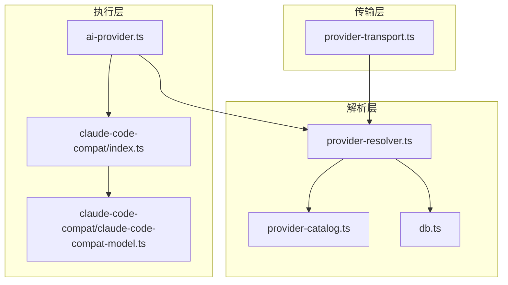
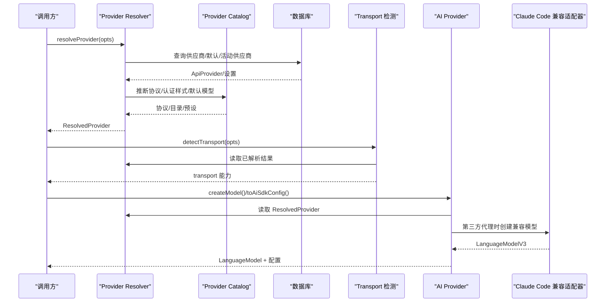
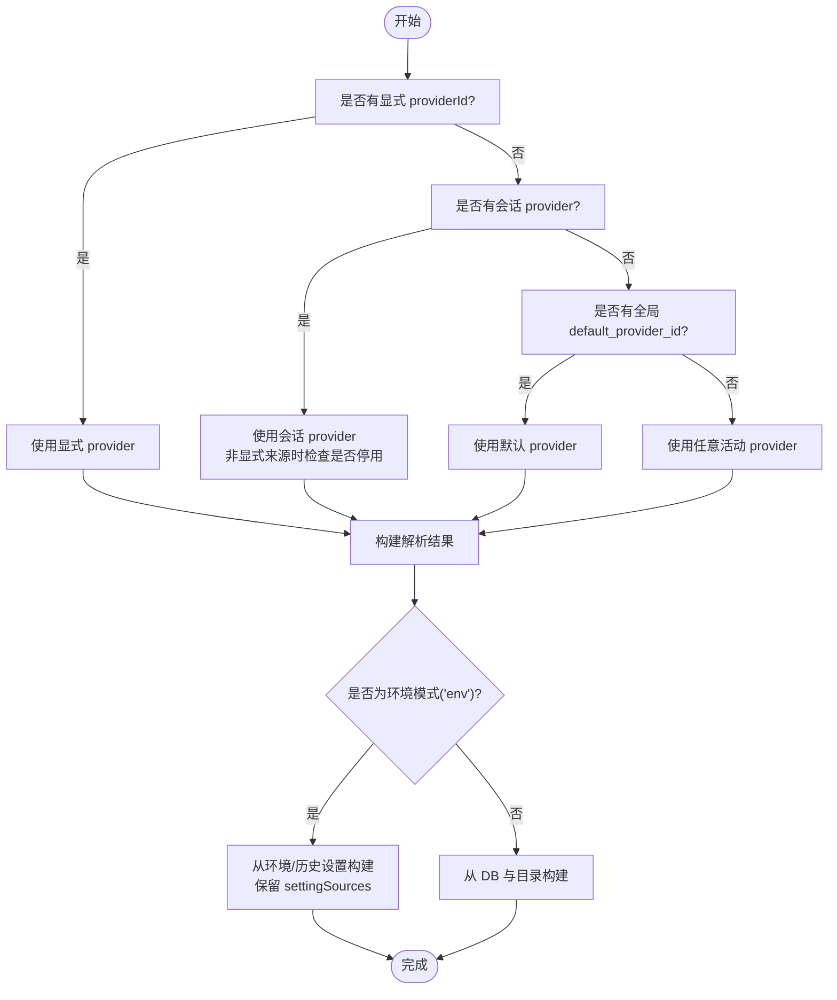
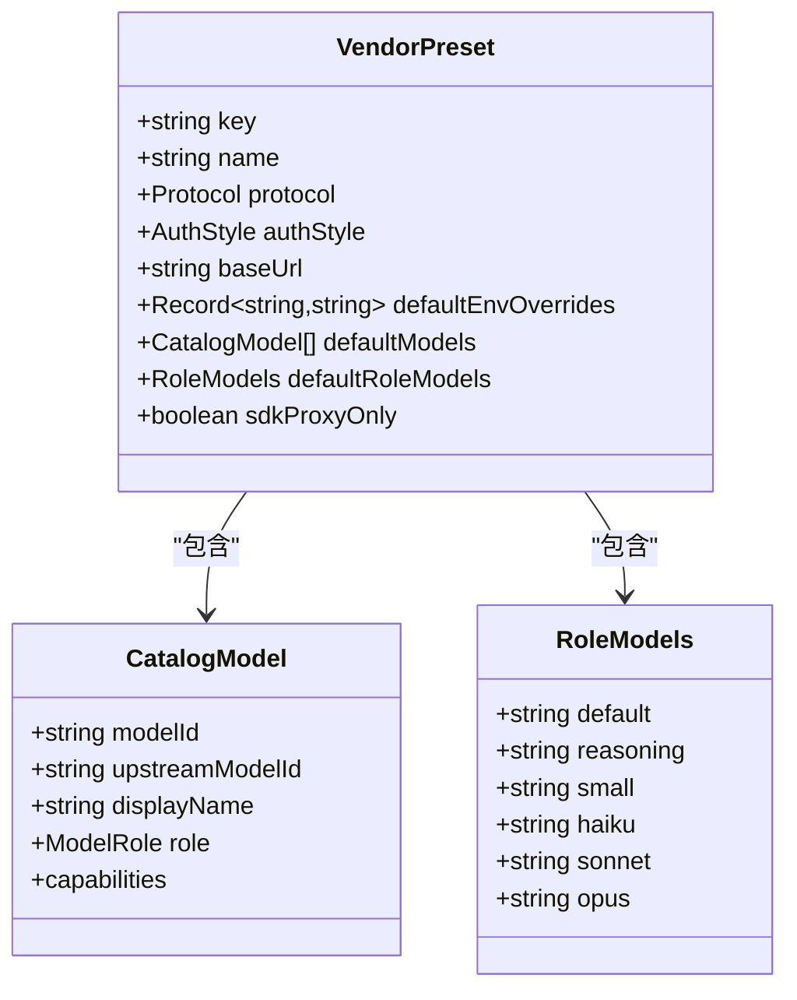
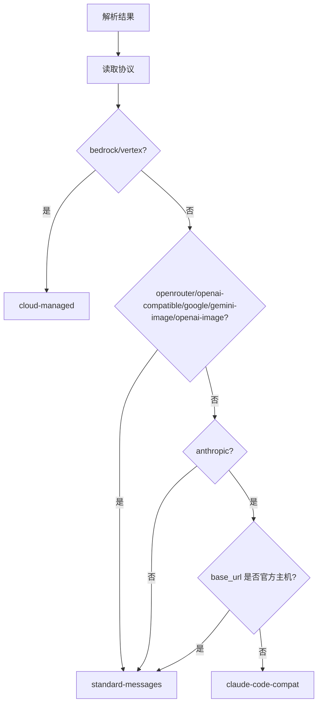
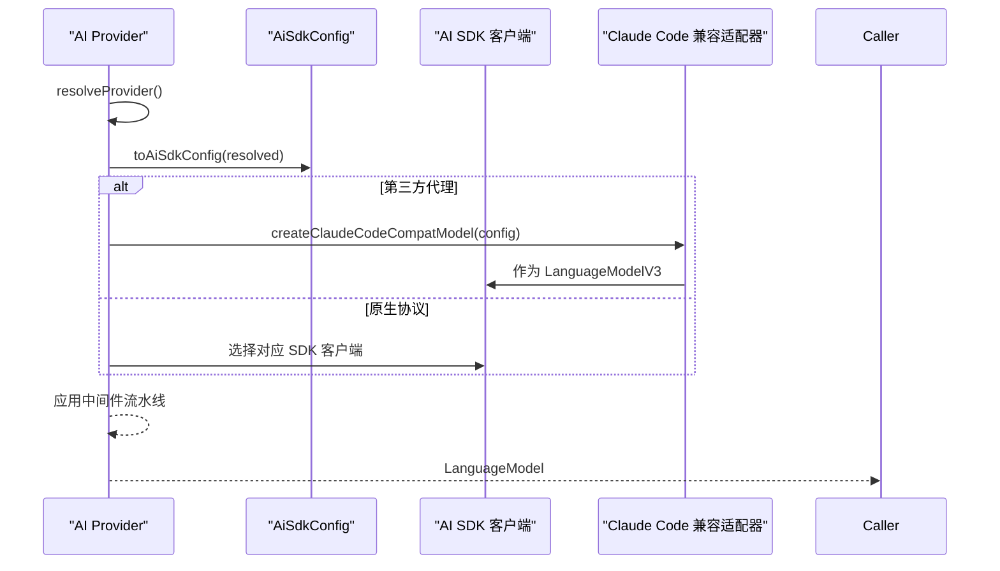
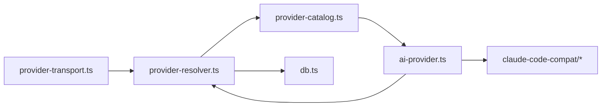

# 供应商适配器架构

<cite>
**本文档引用的文件**
- [provider-resolver.ts](file://src/lib/provider-resolver.ts)
- [provider-transport.ts](file://src/lib/provider-transport.ts)
- [ai-provider.ts](file://src/lib/ai-provider.ts)
- [provider-catalog.ts](file://src/lib/provider-catalog.ts)
- [db.ts](file://src/lib/db.ts)
- [index.ts](file://src/lib/claude-code-compat/index.ts)
- [claude-code-compat-model.ts](file://src/lib/claude-code-compat/claude-code-compat-model.ts)
</cite>

## 目录
1. [简介](#简介)
2. [项目结构](#项目结构)
3. [核心组件](#核心组件)
4. [架构总览](#架构总览)
5. [详细组件分析](#详细组件分析)
6. [依赖关系分析](#依赖关系分析)
7. [性能考量](#性能考量)
8. [故障排查指南](#故障排查指南)
9. [结论](#结论)

## 简介
本文件系统性阐述 CodePilot 的供应商适配器架构，重点说明统一的供应商解析器（Provider Resolver）如何为所有消费者提供一致的“供应商+模型+协议+环境”解析。文档覆盖以下主题：
- 统一解析链：明确优先级与回退策略，确保跨入口一致性
- 协议抽象层：协议类型、默认模型目录、角色映射与认证样式
- 适配器设计模式：标准 Messages API、Claude Code 兼容代理、云托管（Bedrock/Vertex）三类传输能力
- 认证样式处理：API Key 与 Auth Token 的注入与冲突避免
- 环境变量注入：Claude Code SDK 与 Vercel AI SDK 的环境注入策略
- 具体适配示例：Anthropic、OpenAI、Google、AWS Bedrock 等差异点

## 项目结构
围绕供应商适配器的核心文件组织如下：
- 解析与配置：provider-resolver.ts 提供统一解析与配置构建
- 协议与目录：provider-catalog.ts 定义协议、认证样式、默认模型与厂商预设
- 传输检测：provider-transport.ts 判断当前供应商的传输能力
- 模型工厂：ai-provider.ts 创建 Vercel AI SDK 的 LanguageModel 实例
- 适配器：claude-code-compat 提供第三方代理兼容层
- 数据库：db.ts 提供供应商与设置的持久化访问

图表来源
- [provider-resolver.ts:1-1186](file://src/lib/provider-resolver.ts#L1-L1186)
- [provider-transport.ts:1-74](file://src/lib/provider-transport.ts#L1-L74)
- [ai-provider.ts:1-370](file://src/lib/ai-provider.ts#L1-L370)
- [provider-catalog.ts:1-1086](file://src/lib/provider-catalog.ts#L1-L1086)
- [db.ts:1-2905](file://src/lib/db.ts#L1-L2905)
- [index.ts:1-22](file://src/lib/claude-code-compat/index.ts#L1-L22)
- [claude-code-compat-model.ts:1-295](file://src/lib/claude-code-compat/claude-code-compat-model.ts#L1-L295)

章节来源
- [provider-resolver.ts:1-1186](file://src/lib/provider-resolver.ts#L1-L1186)
- [provider-transport.ts:1-74](file://src/lib/provider-transport.ts#L1-L74)
- [ai-provider.ts:1-370](file://src/lib/ai-provider.ts#L1-L370)
- [provider-catalog.ts:1-1086](file://src/lib/provider-catalog.ts#L1-L1086)
- [db.ts:1-2905](file://src/lib/db.ts#L1-L2905)
- [index.ts:1-22](file://src/lib/claude-code-compat/index.ts#L1-L22)
- [claude-code-compat-model.ts:1-295](file://src/lib/claude-code-compat/claude-code-compat-model.ts#L1-L295)

## 核心组件
- 统一解析器（Provider Resolver）
  - 输入：请求中的显式 providerId/sessionProviderId、模型、useCase
  - 输出：ResolvedProvider，包含协议、认证样式、模型、头部、环境覆盖、可用模型、角色映射、凭证状态等
  - 关键特性：显式请求跳过停用检查；未找到或停用时按优先级回退；环境模式下保留 cc-switch 等设置源
- 协议与目录（Provider Catalog）
  - 定义协议枚举（anthropic、openai-compatible、openrouter、bedrock、vertex、google、gemini-image、openai-image）
  - 定义认证样式（api_key、auth_token、env_only、custom_header）
  - 提供厂商预设（VendorPreset），含默认模型目录、角色映射、默认环境覆盖、元信息
- 传输能力检测（Provider Transport）
  - 基于协议与 base_url 推断传输能力：standard-messages、claude-code-compat、cloud-managed
- 模型工厂（AI Provider）
  - 从 ResolvedProvider 构建 AiSdkConfig，并根据协议选择 SDK 客户端
  - 支持 Claude Code 兼容代理、OpenAI 响应式 API（Codex）、Beta 头部、中间件流水线
- 适配器（Claude Code 兼容）
  - 将第三方代理的 SSE/JSON 响应映射为 AI SDK 流水线事件
  - 统一 Messages API 请求格式与响应解析

章节来源
- [provider-resolver.ts:36-159](file://src/lib/provider-resolver.ts#L36-L159)
- [provider-catalog.ts:14-137](file://src/lib/provider-catalog.ts#L14-L137)
- [provider-transport.ts:16-74](file://src/lib/provider-transport.ts#L16-L74)
- [ai-provider.ts:15-117](file://src/lib/ai-provider.ts#L15-L117)
- [index.ts:1-22](file://src/lib/claude-code-compat/index.ts#L1-L22)
- [claude-code-compat-model.ts:41-195](file://src/lib/claude-code-compat/claude-code-compat-model.ts#L41-L195)

## 架构总览
统一解析器贯穿所有调用入口，保证“同一输入，同一输出”。随后根据协议与传输能力选择合适的 SDK 或适配器。

图表来源
- [provider-resolver.ts:91-159](file://src/lib/provider-resolver.ts#L91-L159)
- [provider-transport.ts:23-34](file://src/lib/provider-transport.ts#L23-L34)
- [ai-provider.ts:57-117](file://src/lib/ai-provider.ts#L57-L117)
- [index.ts:19-21](file://src/lib/claude-code-compat/index.ts#L19-L21)

## 详细组件分析

### 组件A：统一解析器（Provider Resolver）
- 解析优先级
  - 显式 providerId（最高优先）
  - 会话 provider_id
  - 全局 default_provider_id
  - 环境变量（'env' 特殊值）
- 停用检查与回退
  - 非显式来源（会话/全局）遇到停用供应商时自动回退至活动供应商
  - 默认供应商即使停用也尊重用户设置（仅在显式来源不命中时）
- 环境模式
  - 无 DB 记录时，凭证可来自 shell 环境、历史设置或 cc-switch 管理的 ~/.claude/settings.json
  - 保留 settingSources 以便 Claude Code SDK 子进程正确加载
- 模型解析
  - 优先使用请求模型/会话模型/全局默认（属于该供应商）
  - 支持 useCase（default/reasoning/small）选择角色映射
  - 通过 availableModels 与 roleModels 解析上游模型 ID
- 环境注入（Claude Code）
  - 清理旧供应商残留的 ANTHROPIC_* 与受管环境变量
  - 根据 authStyle 注入 ANTHROPIC_API_KEY 或 ANTHROPIC_AUTH_TOKEN
  - 注入角色模型环境变量（默认/推理/小模型等）
  - 合并 headers 与 env_overrides（排除认证相关键）

图表来源
- [provider-resolver.ts:91-159](file://src/lib/provider-resolver.ts#L91-L159)
- [provider-resolver.ts:658-733](file://src/lib/provider-resolver.ts#L658-L733)

章节来源
- [provider-resolver.ts:91-159](file://src/lib/provider-resolver.ts#L91-L159)
- [provider-resolver.ts:658-733](file://src/lib/provider-resolver.ts#L658-L733)
- [provider-resolver.ts:208-329](file://src/lib/provider-resolver.ts#L208-L329)

### 组件B：协议抽象层与厂商预设（Provider Catalog）
- 协议定义
  - anthropic：原生或兼容 Messages API
  - openai-compatible/openrouter：OpenAI 兼容 REST
  - bedrock/vertex：云托管平台（环境变量认证）
  - google/gemini-image/openai-image：媒体类协议
- 认证样式
  - api_key：注入 ANTHROPIC_API_KEY
  - auth_token：注入 ANTHROPIC_AUTH_TOKEN（互斥）
  - env_only：通过 env_overrides 注入（Bedrock/Vertex）
  - custom_header：预留扩展
- 厂商预设（示例）
  - Anthropic 官方：协议 anthropic，认证 api_key，官方 base_url
  - OpenRouter：协议 openrouter，认证 auth_token
  - Bedrock/Vertex：协议 bedrock/vertex，认证 env_only，默认 env 覆盖
  - 第三方代理（如 GLM/Kimi/MiniMax/Ollama）：协议 anthropic，但 base_url 非官方，走兼容适配
- 默认模型目录与角色映射
  - 通过 defaultModels 与 defaultRoleModels 提供开箱即用的角色模型映射
  - 支持能力标记（推理、工具、视觉、PDF、上下文窗口、努力级别、自适应思维）

图表来源
- [provider-catalog.ts:87-137](file://src/lib/provider-catalog.ts#L87-L137)
- [provider-catalog.ts:47-83](file://src/lib/provider-catalog.ts#L47-L83)

章节来源
- [provider-catalog.ts:14-137](file://src/lib/provider-catalog.ts#L14-L137)
- [provider-catalog.ts:313-830](file://src/lib/provider-catalog.ts#L313-L830)

### 组件C：传输能力检测（Provider Transport）
- 检测逻辑
  - bedrock/vertex → cloud-managed
  - openrouter/openai-compatible/google/gemini-image/openai-image → standard-messages
  - anthropic：若 base_url 指向官方主机（api.anthropic.com 或其子域）→ standard-messages；否则 → claude-code-compat
- 兼容性
  - 所有传输均对 Native Runtime 兼容（通过 Claude Code 兼容适配器）

图表来源
- [provider-transport.ts:23-65](file://src/lib/provider-transport.ts#L23-L65)

章节来源
- [provider-transport.ts:23-74](file://src/lib/provider-transport.ts#L23-L74)

### 组件D：模型工厂与适配器（AI Provider + Claude Code 兼容）
- 模型工厂
  - createModel：统一入口，校验凭证，构建 AiSdkConfig，注入环境变量，创建 LanguageModel
  - toAiSdkConfig：根据协议选择 SDK 类型（@ai-sdk/anthropic、@ai-sdk/openai、@ai-sdk/google、@ai-sdk/amazon-bedrock、@ai-sdk/google-vertex/anthropic）
  - OpenAI 响应式 API（Codex）：通过自定义 fetch 重写 URL 并注入 OAuth Bearer
  - 中间件：默认设置、推理提取（OpenAI 兼容）、开发日志
- Claude Code 兼容适配器
  - 统一 Messages API 请求格式（含 /v1/messages 路径规则）
  - 解析 SSE 事件流，映射为 AI SDK 流水线事件
  - 支持文本块、推理块、工具调用块的增量与完整事件

图表来源
- [ai-provider.ts:57-117](file://src/lib/ai-provider.ts#L57-L117)
- [ai-provider.ts:159-298](file://src/lib/ai-provider.ts#L159-L298)
- [index.ts:19-21](file://src/lib/claude-code-compat/index.ts#L19-L21)
- [claude-code-compat-model.ts:41-195](file://src/lib/claude-code-compat/claude-code-compat-model.ts#L41-L195)

章节来源
- [ai-provider.ts:54-117](file://src/lib/ai-provider.ts#L54-L117)
- [ai-provider.ts:159-298](file://src/lib/ai-provider.ts#L159-L298)
- [index.ts:1-22](file://src/lib/claude-code-compat/index.ts#L1-L22)
- [claude-code-compat-model.ts:41-195](file://src/lib/claude-code-compat/claude-code-compat-model.ts#L41-L195)

### 组件E：认证样式与环境注入
- 认证样式识别
  - legacy extra_env 中存在 ANTHROPIC_AUTH_TOKEN → auth_token
  - 其他情况 → api_key
- 环境注入（Claude Code）
  - 清理旧供应商残留的 ANTHROPIC_* 与受管键
  - 根据 authStyle 注入 ANTHROPIC_API_KEY 或 ANTHROPIC_AUTH_TOKEN
  - 注入 base_url、角色模型、额外 headers、env_overrides（排除认证键）
- 环境注入（AI SDK）
  - bedrock/vertex：将 env_overrides 注入 process.env
  - OpenAI 响应式 API：通过自定义 fetch 注入 Authorization: Bearer

章节来源
- [provider-catalog.ts:932-944](file://src/lib/provider-catalog.ts#L932-L944)
- [provider-resolver.ts:208-329](file://src/lib/provider-resolver.ts#L208-L329)
- [ai-provider.ts:195-253](file://src/lib/ai-provider.ts#L195-L253)

### 组件F：具体适配示例
- Anthropic 官方
  - 协议：anthropic；认证：api_key；base_url：https://api.anthropic.com
  - 优势：直接使用 @ai-sdk/anthropic；支持 Beta 头部；模型解析严格遵循上游 ID
- 第三方代理（如 GLM/Kimi/MiniMax/Ollama）
  - 协议：anthropic；但 base_url 非官方主机 → 走 claude-code-compat
  - 优势：兼容 Messages API 与 SSE；屏蔽代理差异
- OpenRouter
  - 协议：openrouter；认证：auth_token；base_url：https://openrouter.ai/api
  - 优势：统一 OpenAI 兼容接口；支持多模型路由
- OpenAI 兼容（第三方）
  - 协议：openai-compatible；认证：api_key；base_url：自定义
  - 优势：适合自建或镜像代理；可注入自定义 headers
- Google Gemini（文本/图像）
  - 文本：协议 google；认证：api_key；base_url：https://generativelanguage.googleapis.com/v1
  - 图像：协议 gemini-image；认证：api_key；base_url：图像生成端点
- AWS Bedrock
  - 协议：bedrock；认证：env_only；默认 env 覆盖 CLAUDE_CODE_USE_BEDROCK、AWS_REGION 等
  - 优势：云托管认证；可经 OpenAI 兼容代理透传
- Google Vertex
  - 协议：vertex；认证：env_only；默认 env 覆盖 CLAUDE_CODE_USE_VERTEX、CLOUD_ML_REGION 等
  - 优势：云托管认证；可经 OpenAI 兼容代理透传

章节来源
- [provider-catalog.ts:313-830](file://src/lib/provider-catalog.ts#L313-L830)
- [provider-resolver.ts:517-619](file://src/lib/provider-resolver.ts#L517-L619)

## 依赖关系分析
- 解耦与内聚
  - 解析器与目录高度内聚，负责协议与模型决策
  - 传输检测独立于解析器，仅依赖解析结果
  - 模型工厂与适配器解耦，通过协议与配置驱动
- 外部依赖
  - Vercel AI SDK（@ai-sdk/*）：Anthropic、OpenAI、Google、Bedrock、Vertex
  - Claude Code 兼容适配器：统一第三方代理的请求/响应格式
- 潜在循环
  - 无直接循环依赖；解析器依赖目录与数据库，传输检测依赖解析器，模型工厂依赖解析器与适配器

图表来源
- [provider-resolver.ts:1-1186](file://src/lib/provider-resolver.ts#L1-L1186)
- [provider-transport.ts:1-74](file://src/lib/provider-transport.ts#L1-L74)
- [ai-provider.ts:1-370](file://src/lib/ai-provider.ts#L1-L370)
- [provider-catalog.ts:1-1086](file://src/lib/provider-catalog.ts#L1-L1086)
- [db.ts:1-2905](file://src/lib/db.ts#L1-L2905)
- [index.ts:1-22](file://src/lib/claude-code-compat/index.ts#L1-L22)

章节来源
- [provider-resolver.ts:1-1186](file://src/lib/provider-resolver.ts#L1-L1186)
- [provider-transport.ts:1-74](file://src/lib/provider-transport.ts#L1-L74)
- [ai-provider.ts:1-370](file://src/lib/ai-provider.ts#L1-L370)
- [provider-catalog.ts:1-1086](file://src/lib/provider-catalog.ts#L1-L1086)
- [db.ts:1-2905](file://src/lib/db.ts#L1-L2905)
- [index.ts:1-22](file://src/lib/claude-code-compat/index.ts#L1-L22)

## 性能考量
- 解析缓存
  - 对于同一输入，解析结果可复用；避免重复查询数据库与目录
- 传输选择
  - cloud-managed（Bedrock/Vertex）减少 SDK 初始化成本
  - standard-messages 直连官方 API，延迟更低
- 流式处理
  - Claude Code 兼容适配器将 SSE 事件映射为流式分块，降低首字节延迟感知
- 中间件开销
  - 默认设置与推理提取中间件在开发环境启用，生产环境关闭以减少开销

## 故障排查指南
- 无凭证错误
  - 当 hasCredentials 为假且 provider 为空时，提示配置供应商或设置 ANTHROPIC_API_KEY
  - 若 ~/.claude/settings.json 存在凭证，需切换到 Claude Code SDK 运行时
- 代理兼容问题
  - 第三方代理可能不支持自适应思维或特定头部；通过 claude-code-compat 适配器解决
- 模型别名解析
  - 短别名（sonnet/opus/haiku）需解析为上游模型 ID；若上游未映射，保持别名交由代理处理
- 云托管认证
  - Bedrock/Vertex 需正确设置 AWS/GCP 凭证与区域；确认 env_overrides 注入生效
- OpenAI 响应式 API（Codex）
  - OAuth 令牌过期时需重新登录；注意超时配置与代理设置

章节来源
- [ai-provider.ts:55-78](file://src/lib/ai-provider.ts#L55-L78)
- [ai-provider.ts:195-253](file://src/lib/ai-provider.ts#L195-L253)
- [provider-resolver.ts:36-63](file://src/lib/provider-resolver.ts#L36-L63)

## 结论
CodePilot 的供应商适配器架构通过统一解析器与协议抽象层，实现了“同一输入、同一输出”的跨入口一致性。借助传输能力检测与 Claude Code 兼容适配器，系统能够无缝支持 Anthropic 官方、第三方代理、OpenAI 兼容、Google 与 AWS/Vertex 等多供应商生态。认证样式与环境注入策略确保了安全与灵活性，配合完善的模型目录与角色映射，满足从通用聊天到专业媒体生成的多样化场景需求。