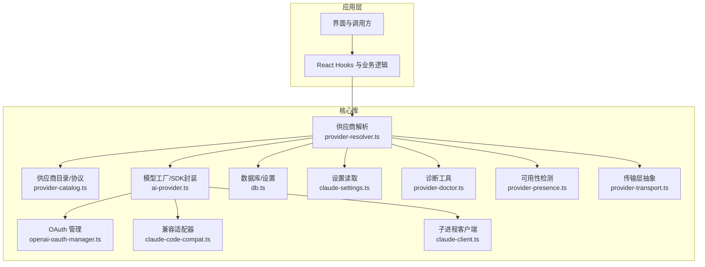
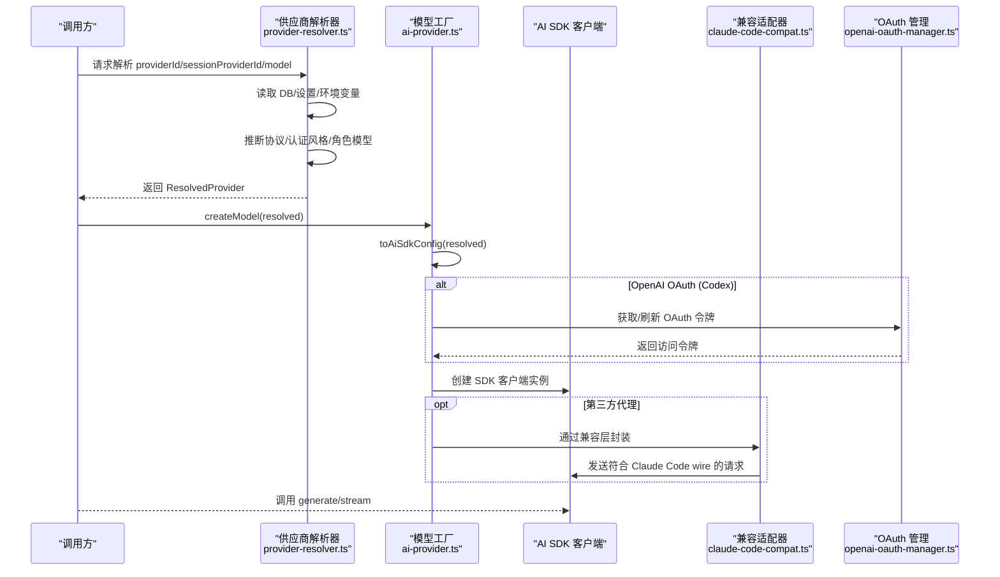
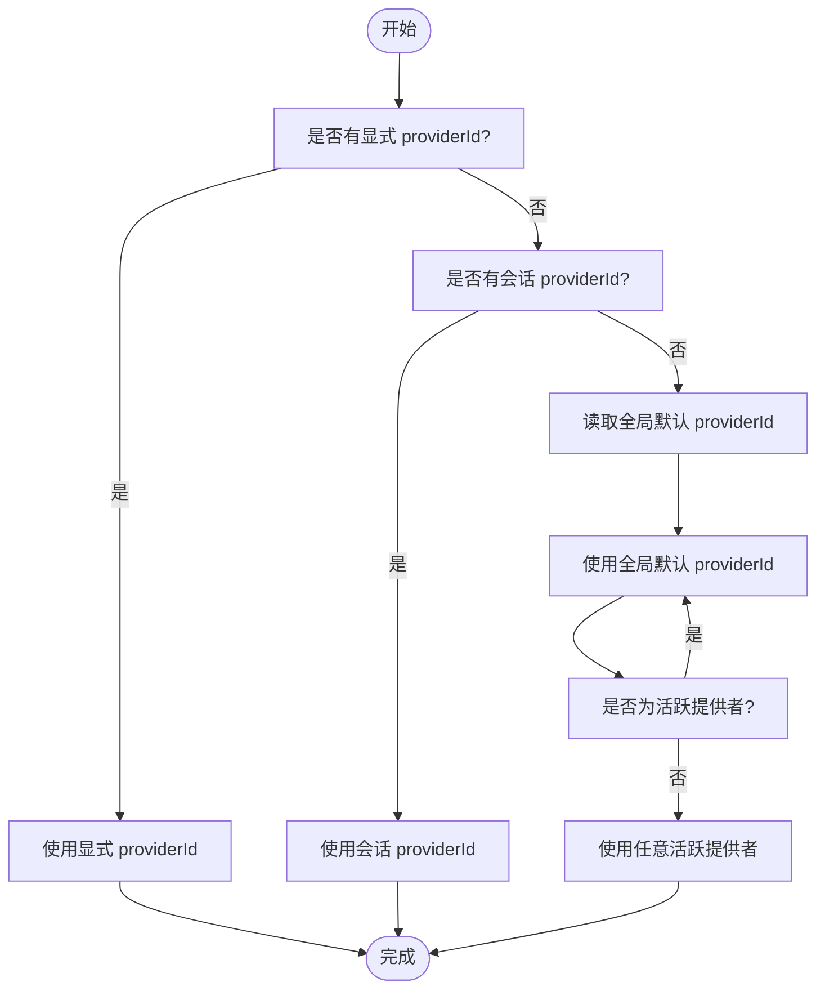
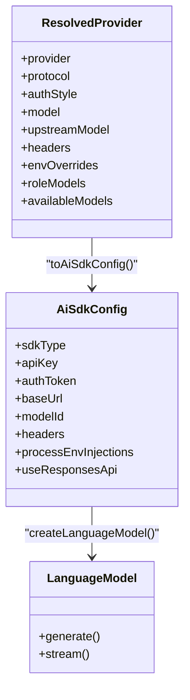
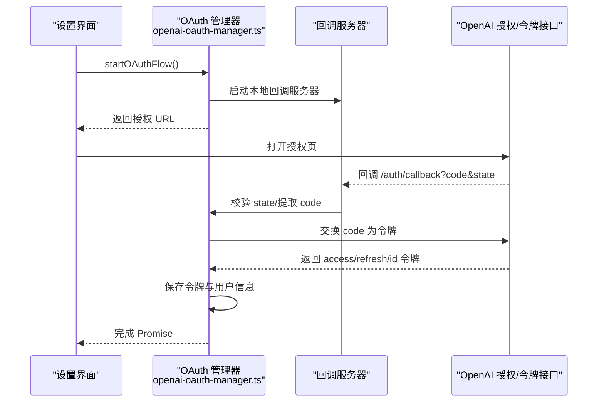
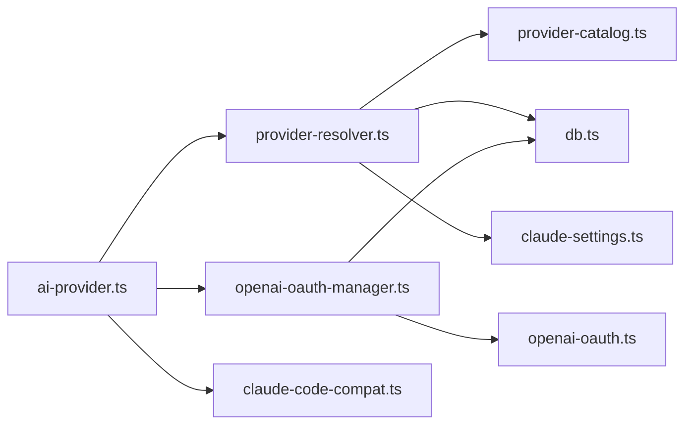

# 多模型 AI 供应商集成

<cite>
**本文档引用的文件**
- [provider-catalog.ts](file://src/lib/provider-catalog.ts)
- [provider-resolver.ts](file://src/lib/provider-resolver.ts)
- [ai-provider.ts](file://src/lib/ai-provider.ts)
- [openai-oauth-manager.ts](file://src/lib/openai-oauth-manager.ts)
- [openai-oauth.ts](file://src/lib/openai-oauth.ts)
- [claude-code-compat.ts](file://src/lib/claude-code-compat.ts)
- [claude-settings.ts](file://src/lib/claude-settings.ts)
- [claude-client.ts](file://src/lib/claude-client.ts)
- [provider-doctor.ts](file://src/lib/provider-doctor.ts)
- [provider-presence.ts](file://src/lib/provider-presence.ts)
- [provider-transport.ts](file://src/lib/provider-transport.ts)
- [route.ts](file://src/app/api/providers/models/route.ts)
- [db.ts](file://src/lib/db.ts)
</cite>

## 更新摘要
**所做更改**
- 新增 DeepSeek 供应商集成支持
- OpenAI GPT-5.5 模型支持
- 小米 MiMo 模型升级（MiMo-V2.5-Pro）
- 环境变量管理改进
- 供应商目录更新以反映最新模型配置

## 目录
1. [简介](#简介)
2. [项目结构](#项目结构)
3. [核心组件](#核心组件)
4. [架构总览](#架构总览)
5. [详细组件分析](#详细组件分析)
6. [依赖关系分析](#依赖关系分析)
7. [性能考虑](#性能考虑)
8. [故障排除指南](#故障排除指南)
9. [结论](#结论)
10. [附录](#附录)

## 简介
本文件面向 CodePilot 的多模型 AI 供应商集成系统，提供从架构设计到实现细节的完整说明。系统支持 17+ AI 供应商（包括 Anthropic、OpenAI、Google、AWS Bedrock、Google Vertex、OpenRouter、GLM、Kimi、Moonshot、MiniMax、Volcengine、Xiaomi MiMo、Aliyun Bailian、Ollama、LiteLLM 等），通过统一的供应商适配器、模型解析器、OAuth 认证流程与配置管理，实现跨平台、可扩展、可治理的 AI 服务接入。

**更新** 新增 DeepSeek 供应商集成、OpenAI GPT-5.5 支持、小米 MiMo 模型升级以及环境变量管理改进

系统目标：
- 统一供应商接入与模型选择逻辑
- 支持 OAuth（OpenAI Codex）、第三方代理、原生 SDK、环境变量等多种认证与路由方式
- 提供辅助任务模型降级与成本优化策略
- 保证错误处理与故障转移的稳定性

## 项目结构
围绕"供应商解析—模型创建—中间件—SDK 调用"的主路径，核心模块如下：
- 供应商解析与模型解析：provider-resolver.ts
- 供应商目录与协议定义：provider-catalog.ts
- 模型工厂与 SDK 创建：ai-provider.ts
- OAuth 管理（OpenAI Codex）：openai-oauth-manager.ts、openai-oauth.ts
- 数据库与持久化：db.ts
- 适配器与兼容层：claude-code-compat.ts
- 设置与外部集成：claude-settings.ts、claude-client.ts
- 诊断与可用性：provider-doctor.ts、provider-presence.ts、provider-transport.ts



**图表来源**
- [provider-resolver.ts:91-159](file://src/lib/provider-resolver.ts#L91-L159)
- [provider-catalog.ts:16-137](file://src/lib/provider-catalog.ts#L16-L137)
- [ai-provider.ts:57-117](file://src/lib/ai-provider.ts#L57-L117)
- [openai-oauth-manager.ts:99-128](file://src/lib/openai-oauth-manager.ts#L99-L128)
- [db.ts:138-150](file://src/lib/db.ts#L138-L150)
- [claude-code-compat.ts](file://src/lib/claude-code-compat.ts)
- [claude-settings.ts](file://src/lib/claude-settings.ts)
- [claude-client.ts](file://src/lib/claude-client.ts)
- [provider-doctor.ts](file://src/lib/provider-doctor.ts)
- [provider-presence.ts](file://src/lib/provider-presence.ts)
- [provider-transport.ts](file://src/lib/provider-transport.ts)

**章节来源**
- [provider-resolver.ts:91-159](file://src/lib/provider-resolver.ts#L91-L159)
- [provider-catalog.ts:16-137](file://src/lib/provider-catalog.ts#L16-L137)
- [ai-provider.ts:57-117](file://src/lib/ai-provider.ts#L57-L117)
- [openai-oauth-manager.ts:99-128](file://src/lib/openai-oauth-manager.ts#L99-L128)
- [db.ts:138-150](file://src/lib/db.ts#L138-L150)

## 核心组件
- 供应商解析器（provider-resolver.ts）
  - 统一解析优先级：显式 providerId → 会话 providerId → 全局默认 → 环境变量
  - 解析协议、认证风格、角色模型映射、可用模型目录、额外头部与环境覆盖
  - 支持虚拟 OpenAI OAuth 提供商（Codex API）
- 供应商目录（provider-catalog.ts）
  - 定义协议类型（anthropic、openai-compatible、openrouter、bedrock、vertex、google、gemini-image、openai-image）
  - 默认模型目录、角色模型映射、默认环境覆盖、元信息（API Key 获取、文档、计费模型）
  - 预设匹配与回退逻辑，兼容第三方代理与自定义端点
- 模型工厂（ai-provider.ts）
  - 基于解析结果创建 Vercel AI SDK LanguageModel 实例
  - 支持 Anthropic、OpenAI、Google、Bedrock、Vertex 等 SDK
  - 第三方代理安全处理（URL 规范化、Beta 头部、禁用自适应思维等）
  - 中间件流水线：默认设置、推理提取、开发日志
- OAuth 管理（openai-oauth-manager.ts + openai-oauth.ts）
  - PKCE 流程、回调服务器、令牌刷新、状态持久化
  - Codex API 专用路径：自定义 fetch 包装、超时控制、账户标识注入
- 数据库与设置（db.ts）
  - api_providers 表：协议、头部、环境覆盖、角色模型、选项
  - provider_models 表：每供应商模型目录与能力
  - settings 表：全局默认模型、默认提供商等
- 兼容适配器（claude-code-compat.ts）
  - 第三方 Anthropic 代理通过兼容层路由，保证与 Claude Code SDK wire 协议一致
- 设置与外部集成（claude-settings.ts、claude-client.ts）
  - 读取 ~/.claude/settings.json（cc-switch 等集成）
  - 子进程 Claude Code SDK 环境构建与注入

**章节来源**
- [provider-resolver.ts:36-63](file://src/lib/provider-resolver.ts#L36-L63)
- [provider-resolver.ts:91-159](file://src/lib/provider-resolver.ts#L91-L159)
- [provider-catalog.ts:16-137](file://src/lib/provider-catalog.ts#L16-L137)
- [ai-provider.ts:159-298](file://src/lib/ai-provider.ts#L159-L298)
- [openai-oauth-manager.ts:99-128](file://src/lib/openai-oauth-manager.ts#L99-L128)
- [db.ts:138-150](file://src/lib/db.ts#L138-L150)
- [claude-code-compat.ts](file://src/lib/claude-code-compat.ts)
- [claude-settings.ts](file://src/lib/claude-settings.ts)
- [claude-client.ts](file://src/lib/claude-client.ts)

## 架构总览
下图展示从调用方到具体 SDK 的完整调用链路与关键决策点：



**图表来源**
- [provider-resolver.ts:91-159](file://src/lib/provider-resolver.ts#L91-L159)
- [ai-provider.ts:57-117](file://src/lib/ai-provider.ts#L57-L117)
- [openai-oauth-manager.ts:99-128](file://src/lib/openai-oauth-manager.ts#L99-L128)
- [claude-code-compat.ts](file://src/lib/claude-code-compat.ts)

## 详细组件分析

### 供应商解析器（provider-resolver.ts）
- 解析优先级与回退策略
  - 显式 providerId > 会话 providerId > 全局默认 provider > 活跃 provider > 环境变量
  - 对于非显式来源（会话/默认），跳过未激活的提供者，避免陈旧会话指向已停用的提供者
- 协议与认证风格推断
  - 优先使用 provider.protocol；否则基于 provider_type 与 base_url 推断
  - 认证风格：API Key 或 Auth Token；Bedrock/Vertex 为环境变量注入
- 角色模型与可用模型
  - roleModels（default/reasoning/small/haiku/sonnet/opus）映射到 ANTHROPIC_* 环境变量
  - 可用模型目录来自 provider_models 表与预设目录的合并
- 辅助任务模型路由
  - 5 步路由：环境覆盖 > 主提供者 small/haiku > 其他提供者 small/haiku > 主提供者+主模型
  - 保证"优化不可用"时仍能正常执行



**图表来源**
- [provider-resolver.ts:91-159](file://src/lib/provider-resolver.ts#L91-L159)

**章节来源**
- [provider-resolver.ts:91-159](file://src/lib/provider-resolver.ts#L91-L159)
- [provider-resolver.ts:798-880](file://src/lib/provider-resolver.ts#L798-L880)
- [provider-resolver.ts:991-1056](file://src/lib/provider-resolver.ts#L991-L1056)

### 供应商目录与协议（provider-catalog.ts）
- 协议定义
  - anthropic、openai-compatible、openrouter、bedrock、vertex、google、gemini-image、openai-image
- 预设（Vendor Preset）
  - 包含默认模型目录、角色模型映射、默认环境覆盖、图标、分类（聊天/媒体）、元信息（API Key 获取链接、文档、计费模型）
  - 支持 sdkProxyOnly 标记，指示某些供应商仅支持 Claude Code wire 协议
- 预设匹配与回退
  - 精确 base_url 匹配优先；其次按域名模糊匹配；最后按 provider_type 回退
  - 首席 Anthropic（官方）与 Bedrock/Vertex 的特殊默认模型目录

**更新** 新增 DeepSeek 供应商支持，包括 DeepSeek V4 Pro 和 V4 Flash 模型配置，以及小米 MiMo 模型升级至 MiMo-V2.5-Pro

**章节来源**
- [provider-catalog.ts:16-137](file://src/lib/provider-catalog.ts#L16-L137)
- [provider-catalog.ts:313-830](file://src/lib/provider-catalog.ts#L313-L830)
- [provider-catalog.ts:840-1002](file://src/lib/provider-catalog.ts#L840-L1002)
- [provider-catalog.ts:1015-1086](file://src/lib/provider-catalog.ts#L1015-L1086)

### 模型工厂与 SDK 封装（ai-provider.ts）
- 模型 ID 解析
  - 优先使用 provider.availableModels 的上游模型 ID；若为短别名（sonnet/opus/haiku），在无 provider 时映射到当前默认
- SDK 类型选择
  - Anthropic、OpenAI、Google、Bedrock、Vertex；第三方代理统一走兼容层
- URL 规范化与安全
  - 为 Anthropic 代理自动补全 /v1；注入 beta 头部；禁用自适应思维（第三方代理兼容）
- 中间件流水线
  - defaultSettingsMiddleware：统一默认参数
  - extractReasoningMiddleware：OpenAI 兼容模型的推理标签提取
  - loggingMiddleware：开发环境调试日志



**图表来源**
- [ai-provider.ts:36-52](file://src/lib/ai-provider.ts#L36-L52)
- [ai-provider.ts:356-446](file://src/lib/ai-provider.ts#L356-L446)
- [ai-provider.ts:159-298](file://src/lib/ai-provider.ts#L159-L298)

**章节来源**
- [ai-provider.ts:57-117](file://src/lib/ai-provider.ts#L57-L117)
- [ai-provider.ts:159-298](file://src/lib/ai-provider.ts#L159-L298)
- [ai-provider.ts:332-369](file://src/lib/ai-provider.ts#L332-L369)

### OAuth 认证流程（OpenAI Codex）
- 流程概览
  - PKCE 参数准备、本地回调服务器监听、浏览器打开授权页、交换授权码为令牌、保存至设置表
  - 令牌刷新：接近过期自动刷新，失败则清理并提示重新登录
  - 调用时注入：自定义 fetch 包装，重写 URL 至 /responses，注入 Authorization 与 chatgpt-account-id
- 错误处理
  - 回调校验失败、超时、网络错误均清理状态并返回用户可读错误

**更新** 新增 OpenAI GPT-5.5 模型支持，包括 GPT-5.5、GPT-5.4、GPT-5.4-Mini 等模型配置



**图表来源**
- [openai-oauth-manager.ts:195-227](file://src/lib/openai-oauth-manager.ts#L195-L227)
- [openai-oauth-manager.ts:231-304](file://src/lib/openai-oauth-manager.ts#L231-L304)
- [openai-oauth-manager.ts:99-128](file://src/lib/openai-oauth-manager.ts#L99-L128)
- [openai-oauth.ts](file://src/lib/openai-oauth.ts)

**章节来源**
- [openai-oauth-manager.ts:99-128](file://src/lib/openai-oauth-manager.ts#L99-L128)
- [openai-oauth-manager.ts:195-227](file://src/lib/openai-oauth-manager.ts#L195-L227)
- [openai-oauth-manager.ts:231-304](file://src/lib/openai-oauth-manager.ts#L231-L304)

### 配置管理与数据库
- api_providers 表
  - 字段：provider_type、protocol、base_url、api_key、is_active、extra_env、notes、headers_json、env_overrides_json、role_models_json、options_json
  - 通过 extra_env 与 headers_json 实现灵活的认证与请求头注入
- provider_models 表
  - 每供应商的模型目录、显示名、上游模型 ID、能力描述、排序、启用状态
- settings 表
  - 全局默认模型、默认提供商、OAuth 令牌、账户标识等

**章节来源**
- [db.ts:138-150](file://src/lib/db.ts#L138-L150)
- [db.ts:497-514](file://src/lib/db.ts#L497-L514)
- [db.ts:121-125](file://src/lib/db.ts#L121-L125)

### 辅助任务模型选择与成本优化
- 5 步路由策略
  - 环境覆盖 > 主提供者 small/haiku > 其他提供者 small/haiku > 主提供者+主模型
- 适用场景
  - 上下文压缩、摘要、视觉理解、网页抽取等辅助任务
- 成本控制
  - 优先使用小模型或轻量模型槽位，减少 token 消耗与延迟

**章节来源**
- [provider-resolver.ts:991-1056](file://src/lib/provider-resolver.ts#L991-L1056)
- [provider-resolver.ts:1079-1140](file://src/lib/provider-resolver.ts#L1079-L1140)

### 故障转移与错误处理
- 供应商解析
  - 未激活提供者自动回退；环境变量模式下保留 cc-switch 兼容性
- 第三方代理
  - 非官方 Anthropic 域名统一走兼容层，避免 SDK 差异导致的 404/400
- OAuth
  - 令牌过期自动刷新；刷新失败清理状态并提示重新登录
- 调用侧
  - 中间件记录耗时与 token 使用；开发环境输出调试日志

**章节来源**
- [provider-resolver.ts:112-115](file://src/lib/provider-resolver.ts#L112-L115)
- [ai-provider.ts:108-111](file://src/lib/ai-provider.ts#L108-L111)
- [openai-oauth-manager.ts:114-128](file://src/lib/openai-oauth-manager.ts#L114-L128)

## 依赖关系分析
- 模块耦合
  - provider-resolver.ts 依赖 provider-catalog.ts、db.ts、claude-settings.ts
  - ai-provider.ts 依赖 provider-resolver.ts、openai-oauth-manager.ts、claude-code-compat.ts
  - openai-oauth-manager.ts 依赖 openai-oauth.ts 与 db.ts
- 外部依赖
  - @ai-sdk/* 生态（anthropic、openai、google、amazon-bedrock、google-vertex）
  - better-sqlite3（本地数据库）



**图表来源**
- [provider-resolver.ts:9-32](file://src/lib/provider-resolver.ts#L9-L32)
- [ai-provider.ts:15-34](file://src/lib/ai-provider.ts#L15-L34)
- [openai-oauth-manager.ts:8-18](file://src/lib/openai-oauth-manager.ts#L8-L18)

**章节来源**
- [provider-resolver.ts:9-32](file://src/lib/provider-resolver.ts#L9-L32)
- [ai-provider.ts:15-34](file://src/lib/ai-provider.ts#L15-L34)
- [openai-oauth-manager.ts:8-18](file://src/lib/openai-oauth-manager.ts#L8-L18)

## 性能考虑
- 模型选择
  - 使用辅助任务路由选择小模型，降低 token 与延迟
  - 通过 roleModels.small/haiku 与环境覆盖实现按任务优化
- 调用封装
  - 中间件仅在开发环境启用，生产环境避免额外开销
  - 第三方代理统一走兼容层，减少 SDK 差异带来的重试与失败
- OAuth
  - 令牌刷新缓冲时间（REFRESH_BUFFER_MS）避免频繁刷新
  - Codex API 自定义 fetch 控制超时，提升稳定性

**章节来源**
- [provider-resolver.ts:991-1056](file://src/lib/provider-resolver.ts#L991-L1056)
- [ai-provider.ts:306-322](file://src/lib/ai-provider.ts#L306-L322)
- [openai-oauth-manager.ts:32-32](file://src/lib/openai-oauth-manager.ts#L32-L32)

## 故障排除指南
- "未找到可用凭据"
  - 检查 provider 是否存在且 is_active；确认环境变量（ANTHROPIC_API_KEY/ANTHROPIC_AUTH_TOKEN/ANTHROPIC_BASE_URL）或 DB 中 api_key 是否正确
  - 若使用 cc-switch，确保 ~/.claude/settings.json 中的凭据有效
- "第三方代理 404/400"
  - 确认 base_url 是否为官方域名；非官方域名将强制走兼容层
  - 检查模型 ID 是否为上游模型 ID（短别名可能不被代理接受）
- "OpenAI OAuth 登录失败/超时"
  - 检查本地回调服务器是否成功启动（端口占用、防火墙）
  - 查看设置表中的令牌是否过期且无法刷新
- "辅助任务仍使用主模型"
  - 检查主提供者是否标记 sdkProxyOnly；若是，则小模型槽位不可用
  - 确认其他提供者是否存在 small/haiku 槽位

**章节来源**
- [provider-resolver.ts:65-78](file://src/lib/provider-resolver.ts#L65-L78)
- [ai-provider.ts:108-111](file://src/lib/ai-provider.ts#L108-L111)
- [openai-oauth-manager.ts:195-227](file://src/lib/openai-oauth-manager.ts#L195-L227)
- [provider-resolver.ts:991-1056](file://src/lib/provider-resolver.ts#L991-L1056)

## 结论
CodePilot 的多模型 AI 供应商集成通过"统一解析 + 目录驱动 + SDK 封装 + OAuth 管理 + 数据持久化"的架构，实现了对 17+ 供应商的稳定接入与灵活调度。系统在兼容第三方代理、成本优化与错误处理方面具备完善的策略，同时通过诊断与可用性工具保障运行质量。

**更新** 最新版本新增 DeepSeek 供应商集成、OpenAI GPT-5.5 支持、小米 MiMo 模型升级以及环境变量管理改进，进一步增强了系统的扩展性和兼容性。新增供应商时，只需在供应商目录中定义预设、在数据库中配置提供者信息，并在必要时提供兼容适配器即可快速上线。

## 附录

### 新增供应商步骤（概要）
- 在供应商目录中添加 VendorPreset（协议、认证风格、默认模型、环境覆盖、元信息）
- 在数据库 api_providers 表中创建提供者记录（可选：headers_json/env_overrides_json/role_models_json）
- 如为第三方代理，确保兼容层适配（claude-code-compat）
- 在 UI 中提供快速连接表单（fields 字段决定显示项）
- 添加测试与诊断（provider-doctor、provider-presence）

**章节来源**
- [provider-catalog.ts:83-137](file://src/lib/provider-catalog.ts#L83-L137)
- [db.ts:138-150](file://src/lib/db.ts#L138-L150)
- [provider-catalog.ts:313-830](file://src/lib/provider-catalog.ts#L313-L830)

### 供应商配置示例

#### DeepSeek 供应商配置
```json
{
  "key": "deepseek",
  "name": "DeepSeek",
  "description": "DeepSeek Anthropic-compatible API — V4 Pro / V4 Flash",
  "protocol": "anthropic",
  "authStyle": "auth_token",
  "baseUrl": "https://api.deepseek.com/anthropic",
  "defaultEnvOverrides": {
    "CLAUDE_CODE_SUBAGENT_MODEL": "deepseek-v4-pro",
    "CLAUDE_CODE_DISABLE_NONESSENTIAL_TRAFFIC": "1",
    "CLAUDE_CODE_DISABLE_NONSTREAMING_FALLBACK": "1",
    "CLAUDE_CODE_EFFORT_LEVEL": "max"
  },
  "defaultModels": [
    {
      "modelId": "sonnet",
      "upstreamModelId": "deepseek-v4-pro",
      "displayName": "DeepSeek V4 Pro",
      "role": "default"
    },
    {
      "modelId": "opus", 
      "upstreamModelId": "deepseek-v4-pro",
      "displayName": "DeepSeek V4 Pro",
      "role": "opus"
    },
    {
      "modelId": "haiku",
      "upstreamModelId": "deepseek-v4-flash", 
      "displayName": "DeepSeek V4 Flash",
      "role": "haiku"
    }
  ]
}
```

#### 小米 MiMo 模型升级配置
```json
{
  "key": "xiaomi-mimo",
  "name": "Xiaomi MiMo",
  "description": "Xiaomi MiMo Pay-as-you-go API — MiMo-V2.5-Pro",
  "protocol": "anthropic", 
  "authStyle": "auth_token",
  "baseUrl": "https://api.xiaomimimo.com/anthropic",
  "defaultModels": [
    {
      "modelId": "sonnet",
      "upstreamModelId": "mimo-v2.5-pro",
      "displayName": "MiMo-V2.5-Pro",
      "role": "default"
    }
  ],
  "defaultRoleModels": {
    "default": "mimo-v2.5-pro",
    "sonnet": "mimo-v2.5-pro", 
    "opus": "mimo-v2.5-pro",
    "haiku": "mimo-v2.5-pro"
  }
}
```

#### OpenAI GPT-5.5 模型配置
```json
{
  "value": "gpt-5.5",
  "label": "GPT-5.5"
}
```

**章节来源**
- [provider-catalog.ts:533-566](file://src/lib/provider-catalog.ts#L533-L566)
- [provider-catalog.ts:590-618](file://src/lib/provider-catalog.ts#L590-L618)
- [route.ts:11-17](file://src/app/api/providers/models/route.ts#L11-L17)
- [provider-resolver.ts:627-633](file://src/lib/provider-resolver.ts#L627-L633)