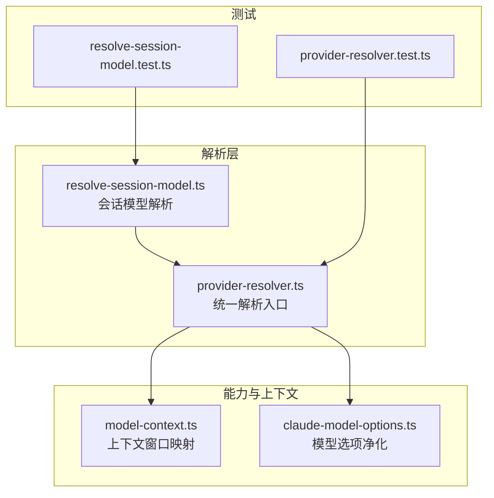
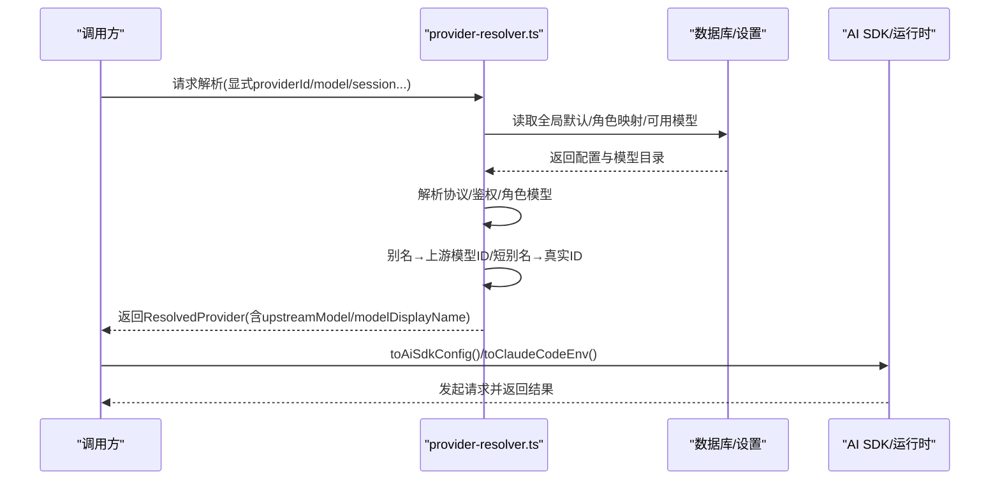
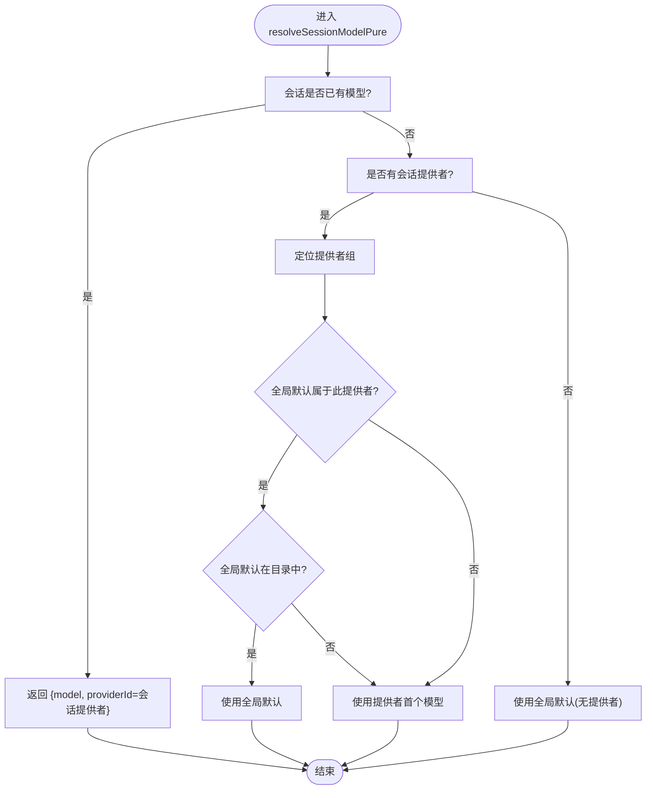
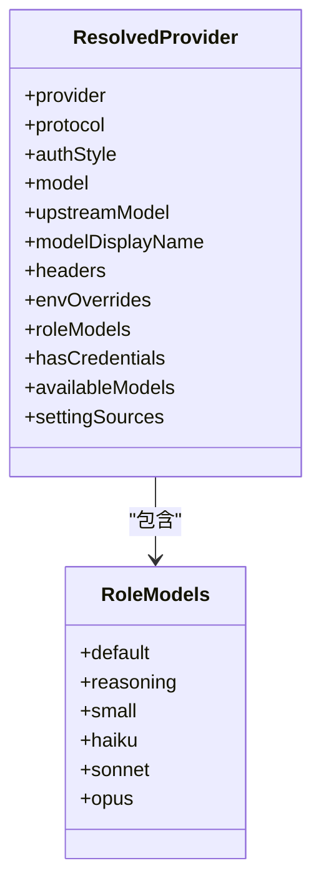
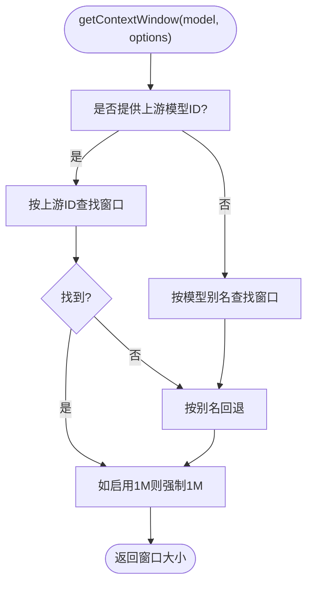
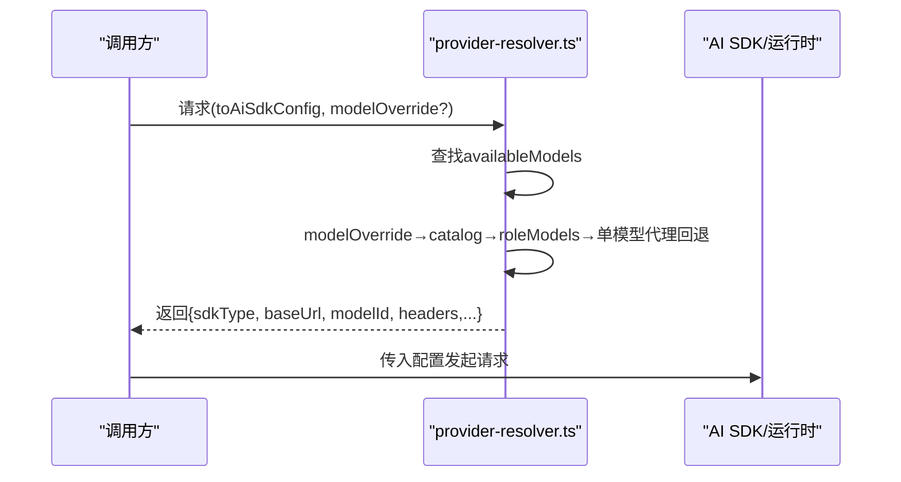
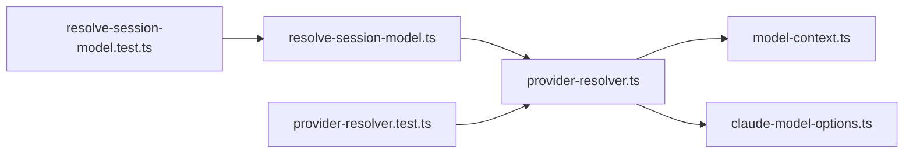

# 模型解析与选择

<cite>
**本文引用的文件**
- [resolve-session-model.ts](file://src/lib/resolve-session-model.ts)
- [provider-resolver.ts](file://src/lib/provider-resolver.ts)
- [model-context.ts](file://src/lib/model-context.ts)
- [claude-model-options.ts](file://src/lib/claude-model-options.ts)
- [resolve-session-model.test.ts](file://src/__tests__/unit/resolve-session-model.test.ts)
- [provider-resolver.test.ts](file://src/__tests__/unit/provider-resolver.test.ts)
</cite>

## 目录
1. [简介](#简介)
2. [项目结构](#项目结构)
3. [核心组件](#核心组件)
4. [架构总览](#架构总览)
5. [详细组件分析](#详细组件分析)
6. [依赖关系分析](#依赖关系分析)
7. [性能考量](#性能考量)
8. [故障排查指南](#故障排查指南)
9. [结论](#结论)
10. [附录](#附录)

## 简介
本文件系统性阐述 CodePilot 的“模型解析与选择”体系，覆盖以下关键主题：
- 显式请求模型 > 会话存储模型 > 全局默认模型 > 供应商预设模型 的优先级链路
- 角色模型映射（默认/推理/小型模型）与上游模型 ID 转换
- 模型能力检测与上下文窗口管理
- 模型别名系统、成本控制策略与辅助任务路由
- 面向不同使用场景（代码编写、逻辑推理、快速回复）的模型选择建议

## 项目结构
围绕模型解析与选择的关键源码位于 src/lib 下，配套单元测试位于 src/__tests__/unit 中，形成“纯函数解析 + 组件封装 + 测试保障”的清晰分层。

图表来源
- [provider-resolver.ts:1-1186](file://src/lib/provider-resolver.ts#L1-L1186)
- [resolve-session-model.ts:1-114](file://src/lib/resolve-session-model.ts#L1-L114)
- [model-context.ts:1-61](file://src/lib/model-context.ts#L1-L61)
- [claude-model-options.ts:1-91](file://src/lib/claude-model-options.ts#L1-L91)
- [resolve-session-model.test.ts:1-131](file://src/__tests__/unit/resolve-session-model.test.ts#L1-L131)
- [provider-resolver.test.ts:1-200](file://src/__tests__/unit/provider-resolver.test.ts#L1-L200)

章节来源
- [provider-resolver.ts:1-1186](file://src/lib/provider-resolver.ts#L1-L1186)
- [resolve-session-model.ts:1-114](file://src/lib/resolve-session-model.ts#L1-L114)

## 核心组件
- provider-resolver.ts：提供统一的“提供者+模型”解析入口，负责协议/鉴权推断、角色模型映射、上游模型 ID 转换、可用模型合并与环境注入。
- resolve-session-model.ts：在会话维度进行模型解析，遵循“显式 > 会话存储 > 全局默认 > 供应商首个模型 > localStorage > 固定回退”的优先级链。
- model-context.ts：提供模型别名到上下文窗口大小的映射，支持基于上游模型 ID 的精确匹配与子串回退。
- claude-model-options.ts：对 Claude 模型的思考模式、努力等级、上下文 1M 开关进行规范化处理，适配 Opus 4.7 的行为变化。

章节来源
- [provider-resolver.ts:67-159](file://src/lib/provider-resolver.ts#L67-L159)
- [resolve-session-model.ts:4-68](file://src/lib/resolve-session-model.ts#L4-L68)
- [model-context.ts:12-61](file://src/lib/model-context.ts#L12-L61)
- [claude-model-options.ts:19-91](file://src/lib/claude-model-options.ts#L19-L91)

## 架构总览
下图展示“请求侧（调用方）—解析器—SDK/运行时”的交互路径，突出模型别名到上游模型 ID 的转换、角色模型映射与环境注入。

图表来源
- [provider-resolver.ts:67-159](file://src/lib/provider-resolver.ts#L67-L159)
- [provider-resolver.ts:356-620](file://src/lib/provider-resolver.ts#L356-L620)

## 详细组件分析

### 会话模型解析（resolveSessionModelPure/resolveSessionModel）
- 优先级链
  1) 会话已存储的模型（直接采用）
  2) 仅当该全局默认属于当前会话提供者时才使用；否则跳过
  3) 当前提供者目录中的第一个可用模型
  4) 全局默认模型（无会话提供者时）
  5) localStorage 记录的最后使用模型/提供者
  6) 固定回退：sonnet
- 关键点
  - 会话提供者不被“其他提供者的全局默认”所覆盖
  - 若全局默认不在当前提供者目录中，则跳过，转而使用提供者首个模型或 localStorage
  - 组件封装版本通过并行拉取全局选项与模型目录，提升首帧性能

图表来源
- [resolve-session-model.ts:28-68](file://src/lib/resolve-session-model.ts#L28-L68)

章节来源
- [resolve-session-model.ts:4-68](file://src/lib/resolve-session-model.ts#L4-L68)
- [resolve-session-model.ts:73-114](file://src/lib/resolve-session-model.ts#L73-L114)
- [resolve-session-model.test.ts:27-130](file://src/__tests__/unit/resolve-session-model.test.ts#L27-L130)

### 提供者解析与模型选择（resolveProvider/toAiSdkConfig/toClaudeCodeEnv）
- 提供者解析优先级（请求侧）
  1) 显式 providerId（最高优先）
  2) 会话提供者
  3) 全局默认提供者
  4) 环境变量（provider=undefined，走“环境模式”）
- 模型解析优先级（同一提供者内）
  1) 显式请求模型
  2) 会话存储模型
  3) 全局默认模型（仅当属于当前提供者）
  4) 提供者预设 roleModels.default
  5) legacy default_model
- 上游模型 ID 转换与别名系统
  - 支持短别名（sonnet/opus/haiku）→ catalog 中的上游模型 ID
  - 支持 roleModels 中的用户自定义映射
  - 对于仅有一个可用模型的第三方代理，允许将短别名透明替换为唯一上游 ID，避免“未找到模型”错误
- 角色模型映射（默认/推理/小型）
  - 通过 toClaudeCodeEnv 注入 ANTHROPIC_MODEL / ANTHROPIC_REASONING_MODEL / ANTHROPIC_SMALL_FAST_MODEL 等环境变量
  - resolveProvider 在 useCase 参数影响下，可从 roleModels 中选取对应角色模型
- 辅助任务路由（紧凑/摘要/视觉/网页抽取）
  - 五级解析链：环境覆盖 → 主提供者 small/haiku → 第二提供者 small/haiku → 主提供者+主模型（兜底）
  - 保证“会话上下文”传递，避免辅助任务跨凭据/模型执行

图表来源
- [provider-resolver.ts:36-63](file://src/lib/provider-resolver.ts#L36-L63)
- [provider-resolver.ts:76-78](file://src/lib/provider-resolver.ts#L76-L78)

章节来源
- [provider-resolver.ts:80-159](file://src/lib/provider-resolver.ts#L80-L159)
- [provider-resolver.ts:356-620](file://src/lib/provider-resolver.ts#L356-L620)
- [provider-resolver.ts:927-1140](file://src/lib/provider-resolver.ts#L927-L1140)

### 上下文窗口与能力检测（model-context.ts/claude-model-options.ts）
- 上下文窗口映射
  - 提供模型别名与上游模型 ID 到固定窗口大小的映射
  - 支持上游模型 ID 子串回退，确保 vendor 前缀/日期后缀也能命中
  - 可选开启 1M 上下文开关，覆盖已知支持 1M 的模型
- Claude 模型选项净化
  - Opus 4.7 行为适配：禁用手动扩展思考，转换为自适应思考；默认显示“摘要”
  - 1M 上下文在 Opus 4.7 默认生效，不再需要 beta 头

图表来源
- [model-context.ts:43-61](file://src/lib/model-context.ts#L43-L61)

章节来源
- [model-context.ts:12-61](file://src/lib/model-context.ts#L12-L61)
- [claude-model-options.ts:59-91](file://src/lib/claude-model-options.ts#L59-L91)

### 角色模型映射与上游模型转换流程
- 角色模型映射
  - 默认/推理/小型模型由 roleModels 字段定义，可在 DB 或供应商预设中配置
  - toClaudeCodeEnv 将其注入到 SDK 运行时所需的环境变量中
- 上游模型转换
  - 优先使用 availableModels 中的 upstreamModelId
  - 若传入 modelOverride，先查 catalog，再查 roleModels，最后在单模型代理上将短别名映射为唯一上游 ID
  - 保持 model 与 upstreamModel 的一致性，避免“UI 别名”与“API 实际名称”不一致导致的 404

图表来源
- [provider-resolver.ts:356-414](file://src/lib/provider-resolver.ts#L356-L414)

章节来源
- [provider-resolver.ts:356-414](file://src/lib/provider-resolver.ts#L356-L414)

## 依赖关系分析
- provider-resolver.ts 依赖数据库/设置接口（全局默认、角色映射、可用模型），并通过协议/鉴权推断与供应商预设联动
- resolve-session-model.ts 依赖 provider-resolver.ts 的解析结果与本地存储
- model-context.ts 与 claude-model-options.ts 作为独立工具模块，分别服务于上下文窗口与模型选项的通用逻辑

图表来源
- [resolve-session-model.ts:1-114](file://src/lib/resolve-session-model.ts#L1-L114)
- [provider-resolver.ts:1-1186](file://src/lib/provider-resolver.ts#L1-L1186)
- [model-context.ts:1-61](file://src/lib/model-context.ts#L1-L61)
- [claude-model-options.ts:1-91](file://src/lib/claude-model-options.ts#L1-L91)
- [resolve-session-model.test.ts:1-131](file://src/__tests__/unit/resolve-session-model.test.ts#L1-L131)
- [provider-resolver.test.ts:1-200](file://src/__tests__/unit/provider-resolver.test.ts#L1-L200)

章节来源
- [provider-resolver.ts:1-1186](file://src/lib/provider-resolver.ts#L1-L1186)
- [resolve-session-model.ts:1-114](file://src/lib/resolve-session-model.ts#L1-L114)

## 性能考量
- resolveSessionModel 通过并行拉取全局选项与模型目录，减少首帧等待时间
- provider-resolver 的解析过程为纯函数与轻量 I/O 组合，避免重复计算
- 辅助任务路由在本地聚合其他提供者信息，失败降级仍保证可用结果

## 故障排查指南
- “全局默认未生效”
  - 确认全局默认提供者与当前会话提供者一致；否则会被跳过
  - 检查全局默认模型是否存在于当前提供者目录中
- “短别名报未找到模型”
  - 对于仅有一个可用模型的第三方代理，系统会将短别名映射为唯一上游 ID；若仍报错，请检查代理是否接受该上游 ID
- “推理/小型模型未生效”
  - 检查 role_models_json 是否正确配置；必要时参考供应商预设的默认角色模型
- “上下文窗口异常”
  - 确认是否传入了上游模型 ID；否则可能按别名回退导致误判
  - 如需强制 1M 上下文，确认目标模型确实支持该能力

章节来源
- [resolve-session-model.ts:4-68](file://src/lib/resolve-session-model.ts#L4-L68)
- [provider-resolver.ts:776-810](file://src/lib/provider-resolver.ts#L776-L810)
- [model-context.ts:36-61](file://src/lib/model-context.ts#L36-L61)

## 结论
CodePilot 的模型解析与选择体系以“统一解析入口 + 严格优先级链 + 明确别名与上游映射”为核心，既保证了跨提供者的一致性，又兼顾了成本控制与使用体验。通过角色模型映射、上下文窗口与模型选项净化，系统在不同场景下均能稳定输出最优模型配置。

## 附录

### 使用场景与模型选择建议
- 代码编写
  - 推荐：默认/推理模型（如 sonnet/opus），根据复杂度与成本选择
  - 若追求速度且可接受较低成本，可使用小型模型（roleModels.small）
- 逻辑推理
  - 推荐：推理模型（roleModels.reasoning）或更高规格模型（如 opus）
  - 注意：Opus 4.7 的思考模式需采用自适应模式
- 快速回复
  - 推荐：小型模型（roleModels.small）或 haiku
  - 成本敏感场景可考虑辅助任务路由中的“兜底主模型”策略，平衡成本与质量

### 模型别名与上游模型对照（示例）
- 别名：sonnet → 上游：claude-sonnet-4-20250514
- 别名：opus → 上游：claude-opus-4-7（默认 1M 上下文）
- 别名：haiku → 上游：claude-haiku-4-5-20251001

章节来源
- [provider-resolver.ts:684-732](file://src/lib/provider-resolver.ts#L684-L732)
- [model-context.ts:12-20](file://src/lib/model-context.ts#L12-L20)
- [claude-model-options.ts:59-91](file://src/lib/claude-model-options.ts#L59-L91)