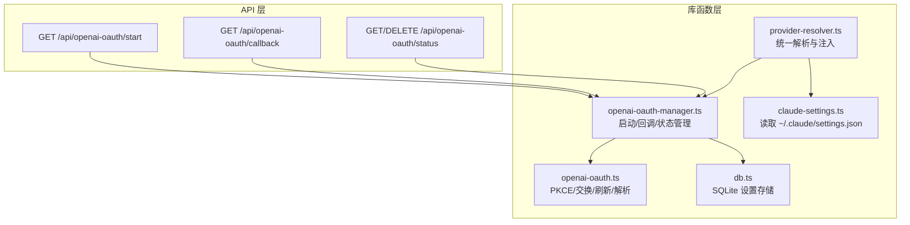
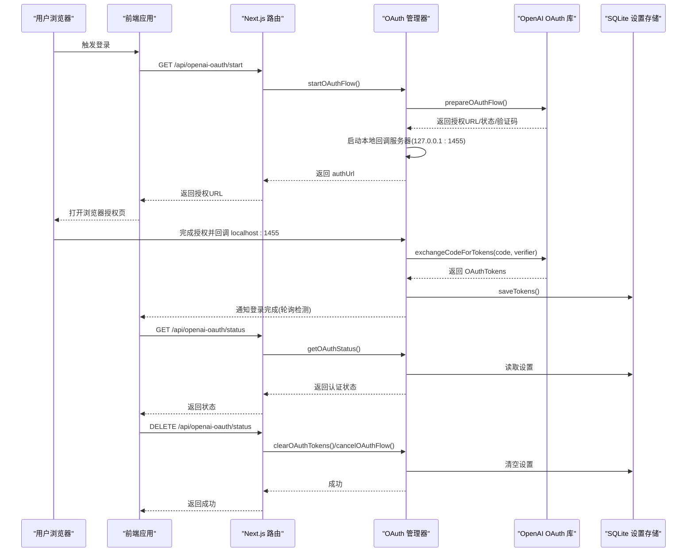
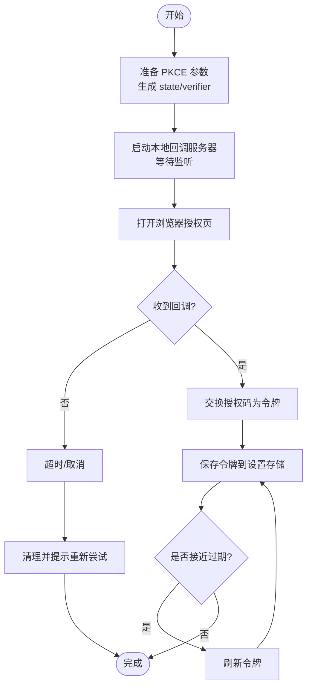
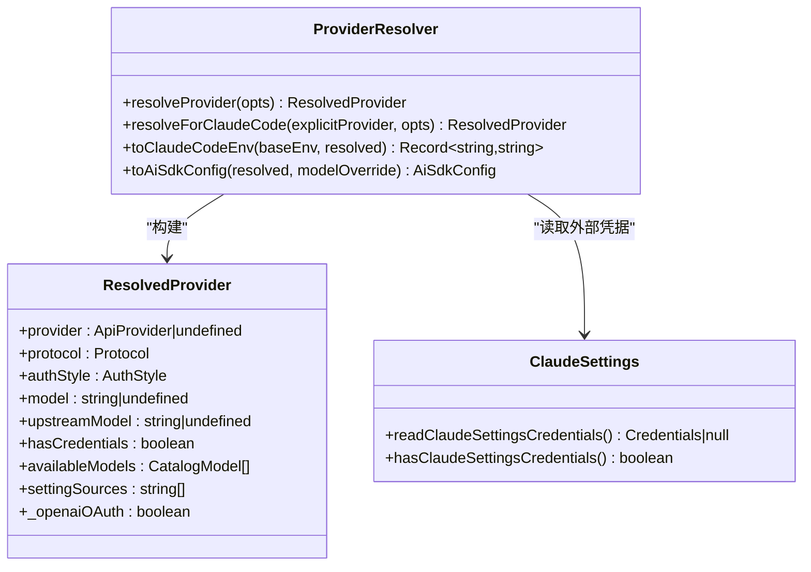
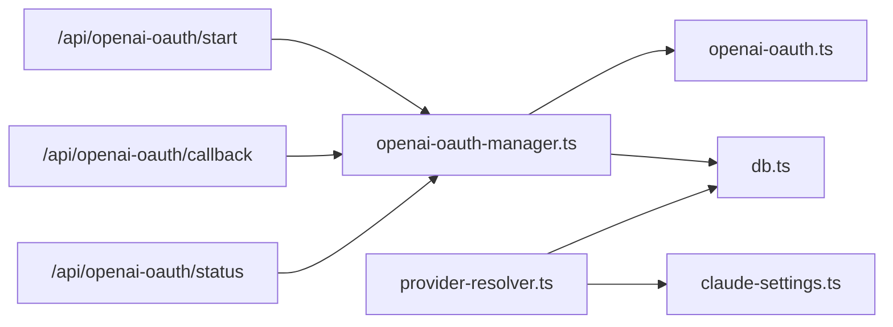

# 认证管理系统

<cite>
**本文档引用的文件**
- [openai-oauth.ts](file://src/lib/openai-oauth.ts)
- [openai-oauth-manager.ts](file://src/lib/openai-oauth-manager.ts)
- [claude-settings.ts](file://src/lib/claude-settings.ts)
- [provider-resolver.ts](file://src/lib/provider-resolver.ts)
- [db.ts](file://src/lib/db.ts)
- [openai-oauth-start.route.ts](file://src/app/api/openai-oauth/start/route.ts)
- [openai-oauth-callback.route.ts](file://src/app/api/openai-oauth/callback/route.ts)
- [openai-oauth-status.route.ts](file://src/app/api/openai-oauth/status/route.ts)
- [openai-oauth-retry.test.ts](file://src/__tests__/unit/openai-oauth-retry.test.ts)
</cite>

## 目录
1. [简介](#简介)
2. [项目结构](#项目结构)
3. [核心组件](#核心组件)
4. [架构总览](#架构总览)
5. [详细组件分析](#详细组件分析)
6. [依赖关系分析](#依赖关系分析)
7. [性能考量](#性能考量)
8. [故障排除指南](#故障排除指南)
9. [结论](#结论)

## 简介
本文件全面阐述 CodePilot 的认证管理系统，涵盖多种认证方式与实现机制：
- API Key 与 Bearer Token：通过数据库与环境变量注入到运行时进程环境，支持 Anthropic、OpenAI 兼容等多种协议。
- OAuth 2.0：基于 OpenAI PKCE 的 Codex API 虚拟供应商，实现浏览器交互式登录、令牌交换、刷新与持久化。
- 环境变量认证：支持从 shell 环境、历史遗留设置与第三方工具（如 Claude Settings）读取凭据。
- 第三方服务集成：通过统一解析器将凭据注入到 Claude Code SDK 子进程，确保凭据隔离与安全传递。

该系统强调“就近验证、延迟刷新”的设计原则，既保证用户体验（无感续期），又兼顾安全性（最小暴露面与本地存储）。

## 项目结构
认证相关代码主要分布在以下位置：
- 库函数层：openai-oauth.ts、openai-oauth-manager.ts、claude-settings.ts、provider-resolver.ts、db.ts
- API 层：/api/openai-oauth/* 路由
- 测试层：openai-oauth-retry.test.ts

图表来源
- [openai-oauth-manager.ts:195-227](file://src/lib/openai-oauth-manager.ts#L195-L227)
- [openai-oauth.ts:63-84](file://src/lib/openai-oauth.ts#L63-L84)
- [openai-oauth-start.route.ts:11-21](file://src/app/api/openai-oauth/start/route.ts#L11-L21)
- [openai-oauth-callback.route.ts:7-9](file://src/app/api/openai-oauth/callback/route.ts#L7-L9)
- [openai-oauth-status.route.ts:7-18](file://src/app/api/openai-oauth/status/route.ts#L7-L18)
- [claude-settings.ts:35-68](file://src/lib/claude-settings.ts#L35-L68)
- [provider-resolver.ts:91-159](file://src/lib/provider-resolver.ts#L91-L159)
- [db.ts:11-12](file://src/lib/db.ts#L11-L12)

章节来源
- [openai-oauth-manager.ts:195-227](file://src/lib/openai-oauth-manager.ts#L195-L227)
- [openai-oauth.ts:63-84](file://src/lib/openai-oauth.ts#L63-L84)
- [openai-oauth-start.route.ts:11-21](file://src/app/api/openai-oauth/start/route.ts#L11-L21)
- [openai-oauth-callback.route.ts:7-9](file://src/app/api/openai-oauth/callback/route.ts#L7-L9)
- [openai-oauth-status.route.ts:7-18](file://src/app/api/openai-oauth/status/route.ts#L7-L18)
- [claude-settings.ts:35-68](file://src/lib/claude-settings.ts#L35-L68)
- [provider-resolver.ts:91-159](file://src/lib/provider-resolver.ts#L91-L159)
- [db.ts:11-12](file://src/lib/db.ts#L11-L12)

## 核心组件
- OpenAI OAuth（Codex API）虚拟供应商
  - 实现 PKCE 授权码流程，完成令牌交换与刷新，并将凭据写入 SQLite 设置表。
  - 提供前端轮询接口以检测登录状态与注销清理。
- 凭证解析与注入
  - 统一解析数据库配置、环境变量与第三方工具配置，按协议注入到 Claude Code SDK 子进程。
- 安全存储
  - 使用 SQLite 存储令牌与元数据，避免明文泄露；提供清理与取消流程。

章节来源
- [openai-oauth.ts:14-275](file://src/lib/openai-oauth.ts#L14-L275)
- [openai-oauth-manager.ts:45-150](file://src/lib/openai-oauth-manager.ts#L45-L150)
- [provider-resolver.ts:36-63](file://src/lib/provider-resolver.ts#L36-L63)
- [db.ts:11-12](file://src/lib/db.ts#L11-L12)

## 架构总览
下图展示从浏览器到后端再到第三方服务的整体认证流程，重点体现 OpenAI OAuth 的虚拟供应商模式与凭据注入路径。

图表来源
- [openai-oauth-start.route.ts:11-21](file://src/app/api/openai-oauth/start/route.ts#L11-L21)
- [openai-oauth-callback.route.ts:7-9](file://src/app/api/openai-oauth/callback/route.ts#L7-L9)
- [openai-oauth-status.route.ts:7-18](file://src/app/api/openai-oauth/status/route.ts#L7-L18)
- [openai-oauth-manager.ts:195-227](file://src/lib/openai-oauth-manager.ts#L195-L227)
- [openai-oauth-manager.ts:231-304](file://src/lib/openai-oauth-manager.ts#L231-L304)
- [openai-oauth-manager.ts:130-144](file://src/lib/openai-oauth-manager.ts#L130-L144)
- [openai-oauth.ts:118-201](file://src/lib/openai-oauth.ts#L118-L201)

## 详细组件分析

### OpenAI OAuth（Codex API）虚拟供应商
- 功能要点
  - PKCE 授权准备：生成 state 与 code_verifier，拼装授权 URL。
  - 令牌交换：在本地回调服务器接收授权码，调用 OpenAI 令牌端点交换为 OAuthTokens。
  - 刷新机制：到期前自动刷新，失败时清理并提示重新登录。
  - 状态查询：前端轮询检测是否已登录、是否需要刷新。
  - 注销清理：清除设置并取消进行中的流程。
- 关键接口
  - startOAuthFlow：启动流程、启动本地服务器、返回授权 URL 与完成 Promise。
  - getOAuthStatus/isOAuthUsable：同步/异步状态检查。
  - ensureTokenFresh：确保令牌新鲜度（必要时刷新）。
  - clearOAuthTokens/cancelOAuthFlow：清理与取消。
- 错误处理
  - 重试策略：对网络错误与特定 HTTP 状态码进行指数退避重试。
  - 用户可见错误：本地回调页面显示失败原因，便于诊断。

图表来源
- [openai-oauth-manager.ts:195-227](file://src/lib/openai-oauth-manager.ts#L195-L227)
- [openai-oauth-manager.ts:231-304](file://src/lib/openai-oauth-manager.ts#L231-L304)
- [openai-oauth-manager.ts:99-128](file://src/lib/openai-oauth-manager.ts#L99-L128)
- [openai-oauth.ts:118-201](file://src/lib/openai-oauth.ts#L118-L201)

章节来源
- [openai-oauth.ts:14-275](file://src/lib/openai-oauth.ts#L14-L275)
- [openai-oauth-manager.ts:45-150](file://src/lib/openai-oauth-manager.ts#L45-L150)
- [openai-oauth-manager.ts:195-227](file://src/lib/openai-oauth-manager.ts#L195-L227)
- [openai-oauth-manager.ts:231-304](file://src/lib/openai-oauth-manager.ts#L231-L304)
- [openai-oauth-manager.ts:99-128](file://src/lib/openai-oauth-manager.ts#L99-L128)
- [openai-oauth-start.route.ts:11-21](file://src/app/api/openai-oauth/start/route.ts#L11-L21)
- [openai-oauth-callback.route.ts:7-9](file://src/app/api/openai-oauth/callback/route.ts#L7-L9)
- [openai-oauth-status.route.ts:7-18](file://src/app/api/openai-oauth/status/route.ts#L7-L18)

### 凭证解析与注入（Provider Resolver）
- 解析优先级
  - 显式 providerId > 会话 providerId > 默认 providerId > 环境变量（env）。
  - 对于 OpenAI OAuth 虚拟供应商（providerId='openai-oauth'），构建专用解析结果并标记 _openaiOAuth。
- 注入策略
  - 将凭据注入 Claude Code SDK 子进程环境，避免跨提供者泄漏。
  - 支持多种协议（Anthropic、OpenRouter、OpenAI 兼容、Bedrock、Vertex、Google 等）。
- 第三方工具集成
  - 读取 ~/.claude/settings.json 中的 ANTHROPIC_* 凭据，使 cc-switch 等外部工具与 CodePilot 协同工作。

图表来源
- [provider-resolver.ts:91-159](file://src/lib/provider-resolver.ts#L91-L159)
- [provider-resolver.ts:176-196](file://src/lib/provider-resolver.ts#L176-L196)
- [provider-resolver.ts:208-329](file://src/lib/provider-resolver.ts#L208-L329)
- [provider-resolver.ts:356-620](file://src/lib/provider-resolver.ts#L356-L620)
- [claude-settings.ts:35-81](file://src/lib/claude-settings.ts#L35-L81)

章节来源
- [provider-resolver.ts:91-159](file://src/lib/provider-resolver.ts#L91-L159)
- [provider-resolver.ts:176-196](file://src/lib/provider-resolver.ts#L176-L196)
- [provider-resolver.ts:208-329](file://src/lib/provider-resolver.ts#L208-L329)
- [provider-resolver.ts:356-620](file://src/lib/provider-resolver.ts#L356-L620)
- [claude-settings.ts:35-81](file://src/lib/claude-settings.ts#L35-L81)

### 安全存储与凭据验证
- 存储介质
  - SQLite 设置表：存储访问令牌、刷新令牌、过期时间、账户信息等。
  - 数据目录：默认位于用户主目录下的 .codepilot，可通过环境变量覆盖。
- 凭据验证
  - 过期判断：基于 expiresAt 与缓冲时间（5 分钟）决定是否需要刷新。
  - 可用性检查：isOAuthUsable 返回同步可用性，ensureTokenFresh 支持异步刷新。
  - 清理策略：过期且无刷新令牌时清空设置，防止残留无效凭据。

章节来源
- [db.ts:11-12](file://src/lib/db.ts#L11-L12)
- [openai-oauth-manager.ts:45-85](file://src/lib/openai-oauth-manager.ts#L45-L85)
- [openai-oauth-manager.ts:130-144](file://src/lib/openai-oauth-manager.ts#L130-L144)

## 依赖关系分析
- 组件耦合
  - API 路由仅负责入口与状态暴露，核心逻辑集中在 openai-oauth-manager.ts 与 openai-oauth.ts。
  - provider-resolver.ts 依赖 db.ts 与 claude-settings.ts，形成“解析—注入—运行时”的闭环。
- 外部依赖
  - OpenAI OAuth 端点与 PKCE 协议规范。
  - Claude Code SDK 子进程环境注入要求，需严格控制 ANTHROPIC_* 变量与额外环境变量。
- 潜在风险
  - 本地回调服务器仅绑定 127.0.0.1，降低外网暴露风险。
  - 刷新失败或网络异常时的回退与清理流程需保持一致。

图表来源
- [openai-oauth-start.route.ts:11-21](file://src/app/api/openai-oauth/start/route.ts#L11-L21)
- [openai-oauth-callback.route.ts:7-9](file://src/app/api/openai-oauth/callback/route.ts#L7-L9)
- [openai-oauth-status.route.ts:7-18](file://src/app/api/openai-oauth/status/route.ts#L7-L18)
- [openai-oauth-manager.ts:195-227](file://src/lib/openai-oauth-manager.ts#L195-L227)
- [openai-oauth.ts:63-84](file://src/lib/openai-oauth.ts#L63-L84)
- [db.ts:11-12](file://src/lib/db.ts#L11-L12)
- [provider-resolver.ts:91-159](file://src/lib/provider-resolver.ts#L91-L159)
- [claude-settings.ts:35-81](file://src/lib/claude-settings.ts#L35-L81)

章节来源
- [openai-oauth-start.route.ts:11-21](file://src/app/api/openai-oauth/start/route.ts#L11-L21)
- [openai-oauth-callback.route.ts:7-9](file://src/app/api/openai-oauth/callback/route.ts#L7-L9)
- [openai-oauth-status.route.ts:7-18](file://src/app/api/openai-oauth/status/route.ts#L7-L18)
- [openai-oauth-manager.ts:195-227](file://src/lib/openai-oauth-manager.ts#L195-L227)
- [openai-oauth.ts:63-84](file://src/lib/openai-oauth.ts#L63-L84)
- [db.ts:11-12](file://src/lib/db.ts#L11-L12)
- [provider-resolver.ts:91-159](file://src/lib/provider-resolver.ts#L91-L159)
- [claude-settings.ts:35-81](file://src/lib/claude-settings.ts#L35-L81)

## 性能考量
- 令牌刷新策略
  - 在到期前 5 分钟触发刷新，减少请求失败概率。
  - 刷新失败时立即清理设置，避免无效令牌占用资源。
- 重试与退避
  - 令牌交换阶段采用最多 3 次重试，指数退避（1s、2s、4s），提升网络不稳定场景成功率。
- 前端轮询
  - 登录完成后由前端轮询 /api/openai-oauth/status 检测完成，避免长连接与不必要的资源消耗。

章节来源
- [openai-oauth-manager.ts:32](file://src/lib/openai-oauth-manager.ts#L32)
- [openai-oauth-manager.ts:114-128](file://src/lib/openai-oauth-manager.ts#L114-L128)
- [openai-oauth.ts:101-112](file://src/lib/openai-oauth.ts#L101-L112)
- [openai-oauth.ts:136-140](file://src/lib/openai-oauth.ts#L136-L140)

## 故障排除指南
- 常见问题与定位
  - 无法启动本地回调服务器：检查端口 1455 是否被占用，确认防火墙策略允许 127.0.0.1 监听。
  - 授权码交换失败：查看重试日志与错误消息，关注网络错误（DNS、连接重置）与特定 HTTP 状态码（403/408/429/5xx）。
  - 刷新失败：确认刷新令牌存在，检查第三方服务端点可达性与响应体。
  - 凭据未生效：检查 provider-resolver 是否正确识别 provider 或 env 模式，确认 Claude Code SDK 子进程环境变量注入是否覆盖了旧值。
- 建议操作
  - 使用 /api/openai-oauth/status 查询当前状态，必要时执行 DELETE 清理后重新登录。
  - 查看测试用例中对重试行为的断言，复现类似网络波动场景以验证健壮性。

章节来源
- [openai-oauth-manager.ts:231-304](file://src/lib/openai-oauth-manager.ts#L231-L304)
- [openai-oauth.ts:101-112](file://src/lib/openai-oauth.ts#L101-L112)
- [openai-oauth-status.route.ts:14-18](file://src/app/api/openai-oauth/status/route.ts#L14-L18)
- [openai-oauth-retry.test.ts](file://src/__tests__/unit/openai-oauth-retry.test.ts)

## 结论
CodePilot 的认证系统通过“虚拟供应商 + 统一解析 + 安全存储”的组合，实现了对多种认证方式的无缝支持。OpenAI OAuth（Codex API）作为虚拟供应商，借助 PKCE 与本地回调服务器，提供了安全便捷的登录体验；provider-resolver 则确保凭据在不同协议与运行时之间正确、安全地传递。配合 SQLite 的本地存储与完善的错误处理与重试机制，系统在易用性与安全性之间取得了良好平衡。