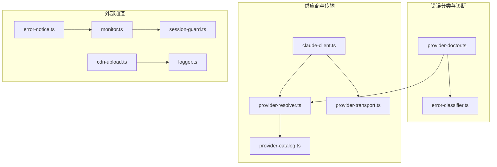
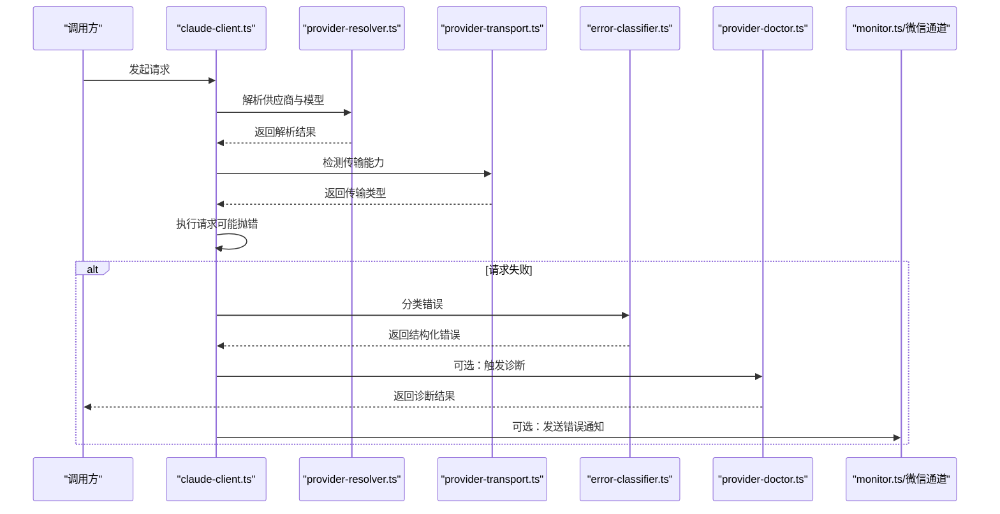
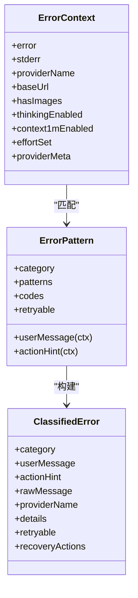
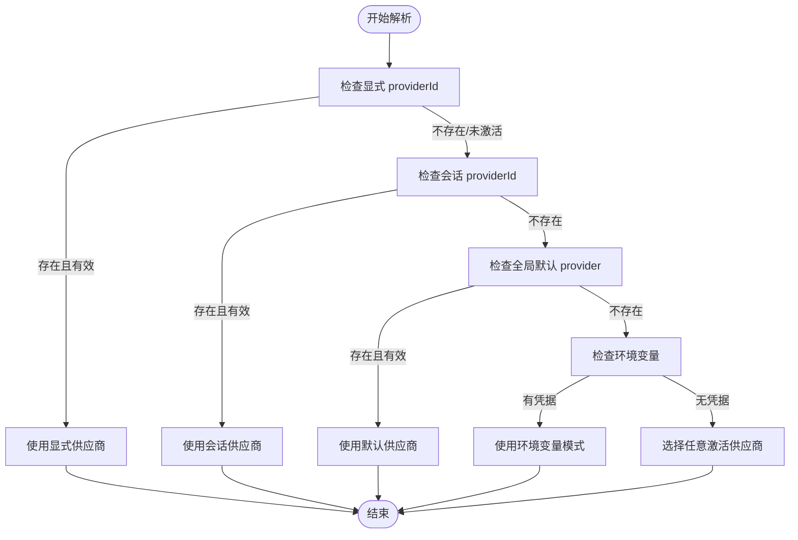
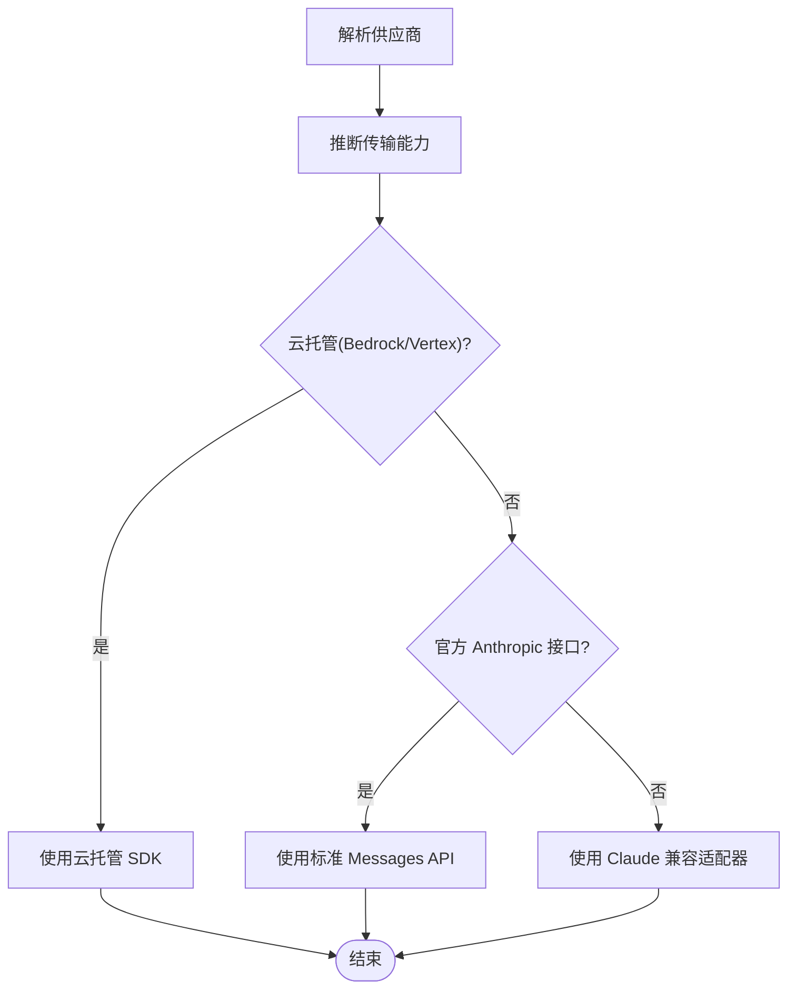
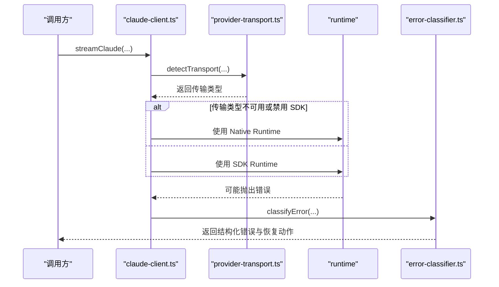
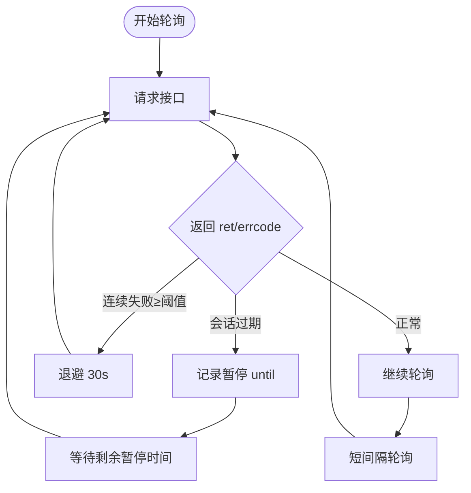
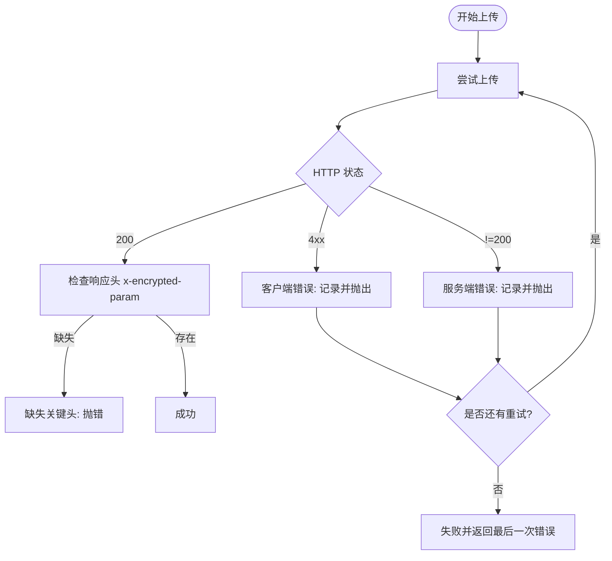
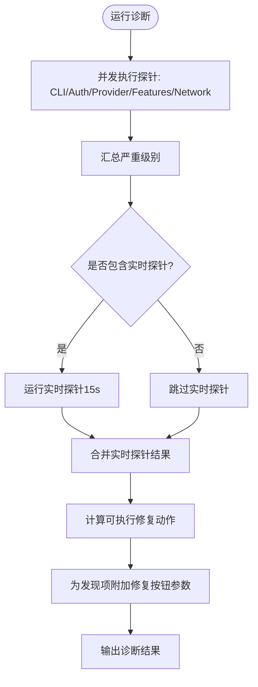
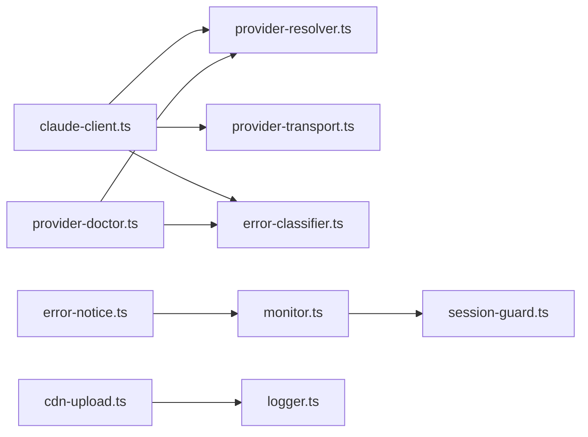

# 错误处理与故障转移

<cite>
**本文引用的文件**
- [error-classifier.ts](file://src/lib/error-classifier.ts)
- [provider-resolver.ts](file://src/lib/provider-resolver.ts)
- [provider-transport.ts](file://src/lib/provider-transport.ts)
- [provider-doctor.ts](file://src/lib/provider-doctor.ts)
- [claude-client.ts](file://src/lib/claude-client.ts)
- [text-generator.ts](file://src/lib/text-generator.ts)
- [provider-catalog.ts](file://src/lib/provider-catalog.ts)
- [session-guard.ts](file://资料/weixin-openclaw-package/package/src/api/session-guard.ts)
- [monitor.ts](file://资料/weixin-openclaw-package/package/src/monitor/monitor.ts)
- [cdn-upload.ts](file://资料/weixin-openclaw-package/package/src/cdn/cdn-upload.ts)
- [logger.ts](file://资料/weixin-openclaw-package/package/src/util/logger.ts)
- [error-notice.ts](file://资料/weixin-openclaw-package/package/src/messaging/error-notice.ts)
</cite>

## 目录
1. [简介](#简介)
2. [项目结构](#项目结构)
3. [核心组件](#核心组件)
4. [架构总览](#架构总览)
5. [详细组件分析](#详细组件分析)
6. [依赖关系分析](#依赖关系分析)
7. [性能考量](#性能考量)
8. [故障排查指南](#故障排查指南)
9. [结论](#结论)
10. [附录](#附录)

## 简介
本文件系统性梳理 CodePilot 的错误处理与故障转移体系，围绕 16 类结构化错误分类、统一的错误分类器、诊断引擎、以及跨模块的故障转移策略进行深入解析。内容覆盖网络错误、认证失败、模型不可用、速率限制、会话状态异常、进程崩溃、CDN 上传失败、微信机器人会话暂停等场景，并提供可操作的故障转移路径（供应商切换、模型回退、协议降级）、错误恢复与用户体验优化方案。

## 项目结构
CodePilot 将“错误分类”“诊断”“运行时调用”“传输能力检测”“外部通道（微信）”等模块解耦，形成清晰的分层：
- 错误分类与上报：error-classifier.ts
- 供应商解析与模型选择：provider-resolver.ts、provider-catalog.ts
- 传输能力检测与路由：provider-transport.ts、claude-client.ts
- 诊断与修复：provider-doctor.ts
- 外部通道与幂等重试：monitor.ts、session-guard.ts、cdn-upload.ts
- 用户提示与日志：error-notice.ts、logger.ts

**图表来源**
- [error-classifier.ts:1-522](file://src/lib/error-classifier.ts#L1-L522)
- [provider-doctor.ts:1-1078](file://src/lib/provider-doctor.ts#L1-L1078)
- [provider-resolver.ts:1-800](file://src/lib/provider-resolver.ts#L1-L800)
- [provider-transport.ts:1-74](file://src/lib/provider-transport.ts#L1-L74)
- [claude-client.ts:1-800](file://src/lib/claude-client.ts#L1-L800)
- [session-guard.ts:1-58](file://资料/weixin-openclaw-package/package/src/api/session-guard.ts#L1-L58)
- [monitor.ts:101-221](file://资料/weixin-openclaw-package/package/src/monitor/monitor.ts#L101-L221)
- [cdn-upload.ts:33-77](file://资料/weixin-openclaw-package/package/src/cdn/cdn-upload.ts#L33-L77)
- [logger.ts:121-143](file://资料/weixin-openclaw-package/package/src/util/logger.ts#L121-L143)
- [error-notice.ts:1-31](file://资料/weixin-openclaw-package/package/src/messaging/error-notice.ts#L1-L31)

**章节来源**
- [error-classifier.ts:1-522](file://src/lib/error-classifier.ts#L1-L522)
- [provider-doctor.ts:1-1078](file://src/lib/provider-doctor.ts#L1-L1078)
- [provider-resolver.ts:1-800](file://src/lib/provider-resolver.ts#L1-L800)
- [provider-transport.ts:1-74](file://src/lib/provider-transport.ts#L1-L74)
- [claude-client.ts:1-800](file://src/lib/claude-client.ts#L1-L800)

## 核心组件
- 结构化错误分类器：将底层错误映射为 16 类用户可理解的错误类别，提供可操作的恢复动作与可序列化的错误信息。
- 诊断引擎：对 CLI、认证、供应商配置、特性兼容、网络可达性进行探针式检查，并给出修复建议。
- 供应商解析与传输能力检测：统一解析当前会话使用的供应商与模型，判断传输能力并路由到合适的运行时。
- 外部通道与幂等重试：针对微信机器人等外部通道，实现会话暂停、连续失败退避、重试与错误通知。

**章节来源**
- [error-classifier.ts:57-136](file://src/lib/error-classifier.ts#L57-L136)
- [provider-doctor.ts:41-80](file://src/lib/provider-doctor.ts#L41-L80)
- [provider-resolver.ts:34-63](file://src/lib/provider-resolver.ts#L34-L63)
- [provider-transport.ts:16-34](file://src/lib/provider-transport.ts#L16-L34)

## 架构总览
下图展示从“错误发生”到“用户可见提示”的完整链路，包括分类、诊断、路由与外部通道处理。

**图表来源**
- [claude-client.ts:433-505](file://src/lib/claude-client.ts#L433-L505)
- [provider-resolver.ts:91-159](file://src/lib/provider-resolver.ts#L91-L159)
- [provider-transport.ts:23-34](file://src/lib/provider-transport.ts#L23-L34)
- [error-classifier.ts:360-421](file://src/lib/error-classifier.ts#L360-L421)
- [provider-doctor.ts:1042-1071](file://src/lib/provider-doctor.ts#L1042-L1071)
- [monitor.ts:101-207](file://资料/weixin-openclaw-package/package/src/monitor/monitor.ts#L101-L207)

## 详细组件分析

### 结构化错误分类体系（16 类）
错误分类器将常见问题归纳为 16 类，每类包含用户消息、可操作提示、是否可重试、恢复动作等字段，便于前端渲染与自动修复。

- CLI 相关
  - CLI_NOT_FOUND：未找到 Claude Code CLI
  - MISSING_GIT_BASH：Windows 缺少 Git Bash
  - CLI_VERSION_TOO_OLD：CLI 版本过旧
  - UNSUPPORTED_FEATURE：CLI 不支持请求功能
- 认证与权限
  - NO_CREDENTIALS：无可用 API 凭据
  - AUTH_REJECTED：认证失败（401）
  - AUTH_FORBIDDEN：访问被拒绝（403）
  - AUTH_STYLE_MISMATCH：认证样式不匹配（API Key vs Auth Token）
- 网络与端点
  - NETWORK_UNREACHABLE：网络不可达（DNS/连接超时/拒绝）
  - ENDPOINT_NOT_FOUND：端点不存在（404）
- 速率限制与配额
  - RATE_LIMITED：触发速率限制（429）
- 模型与上下文
  - MODEL_NOT_AVAILABLE：模型不可用
  - CONTEXT_TOO_LONG：上下文过长（自动压缩）
- 会话与进程
  - RESUME_FAILED：会话恢复失败
  - SESSION_STATE_ERROR：会话状态无效/损坏（可重试）
  - PROCESS_CRASH：进程退出（需检查凭据/URL/网络/图像输入/思考模式/1M 上下文）
- 原生运行时
  - NATIVE_STREAM_ERROR：原生流错误
  - OPENAI_AUTH_FAILED：OpenAI OAuth 过期/无效
  - MCP_CONNECTION_ERROR：MCP 服务器连接失败
  - EMPTY_RESPONSE：模型返回空（代理拒绝/不支持模型）
- 未知错误
  - UNKNOWN：未知错误（进入兜底）

**图表来源**
- [error-classifier.ts:93-136](file://src/lib/error-classifier.ts#L93-L136)
- [error-classifier.ts:140-149](file://src/lib/error-classifier.ts#L140-L149)
- [error-classifier.ts:360-421](file://src/lib/error-classifier.ts#L360-L421)

**章节来源**
- [error-classifier.ts:57-81](file://src/lib/error-classifier.ts#L57-L81)
- [error-classifier.ts:154-421](file://src/lib/error-classifier.ts#L154-L421)

### 故障转移策略与实现

#### 供应商切换
- 优先级链：显式 providerId → 会话 providerId → 全局默认 provider → 环境变量 → 任意激活的 provider（非显式来源跳过未激活供应商）
- 当显式请求指定的供应商不存在或未激活时，自动回退到全局默认或任意激活的供应商，避免“无凭据”错误
- 对于 OpenAI OAuth（Codex API）虚拟供应商，走特殊路径，确保令牌刷新与响应 API 使用正确

**图表来源**
- [provider-resolver.ts:91-159](file://src/lib/provider-resolver.ts#L91-L159)

**章节来源**
- [provider-resolver.ts:91-159](file://src/lib/provider-resolver.ts#L91-L159)

#### 模型回退与协议降级
- 传输能力检测：根据协议与 base_url 判断是否使用标准 Messages API、Claude 兼容适配器或云托管（Bedrock/Vertex）
- 非官方 Anthropic 代理一律走 Claude 兼容适配器，确保协议一致性
- 云托管（Bedrock/Vertex）走各自 SDK，必要时通过 OpenAI 兼容代理桥接
- 对于第三方代理缺少显式模型名的情况，提示设置 role_models_json.default 或 env overrides

**图表来源**
- [provider-transport.ts:36-65](file://src/lib/provider-transport.ts#L36-L65)
- [provider-resolver.ts:658-800](file://src/lib/provider-resolver.ts#L658-L800)

**章节来源**
- [provider-transport.ts:16-74](file://src/lib/provider-transport.ts#L16-L74)
- [provider-resolver.ts:658-800](file://src/lib/provider-resolver.ts#L658-L800)

#### 运行时路由与错误恢复
- 主入口 streamClaude 根据设置与传输能力选择 Native Runtime 或 SDK Runtime
- 对于非 Anthropic 供应商（如 OpenAI OAuth），强制使用 Native Runtime
- SDK 路径捕获错误后交由分类器，生成用户可读提示与恢复动作

**图表来源**
- [claude-client.ts:433-505](file://src/lib/claude-client.ts#L433-L505)
- [claude-client.ts:511-800](file://src/lib/claude-client.ts#L511-L800)
- [provider-transport.ts:23-34](file://src/lib/provider-transport.ts#L23-L34)
- [error-classifier.ts:360-421](file://src/lib/error-classifier.ts#L360-L421)

**章节来源**
- [claude-client.ts:433-505](file://src/lib/claude-client.ts#L433-L505)
- [claude-client.ts:511-800](file://src/lib/claude-client.ts#L511-L800)

### 外部通道与幂等重试（微信机器人）
- 会话暂停：当服务端返回特定错误码（会话过期）时，记录暂停截止时间，后续请求前校验并阻塞直至冷却结束
- 连续失败退避：超过阈值后指数退避（例如 30 秒），降低对上游的压力
- 错误通知：通过上下文令牌向用户发送纯文本错误提示，失败不中断主流程

**图表来源**
- [monitor.ts:101-207](file://资料/weixin-openclaw-package/package/src/monitor/monitor.ts#L101-L207)
- [session-guard.ts:1-58](file://资料/weixin-openclaw-package/package/src/api/session-guard.ts#L1-L58)

**章节来源**
- [monitor.ts:101-221](file://资料/weixin-openclaw-package/package/src/monitor/monitor.ts#L101-L221)
- [session-guard.ts:1-58](file://资料/weixin-openclaw-package/package/src/api/session-guard.ts#L1-L58)
- [error-notice.ts:1-31](file://资料/weixin-openclaw-package/package/src/messaging/error-notice.ts#L1-L31)

### CDN 上传与客户端/服务端错误处理
- 区分客户端错误（4xx）与服务端错误（非 200），记录详细错误信息与响应头
- 支持最大重试次数，逐次记录失败原因，最终抛出最后一次错误
- 若响应缺失关键头（加密参数），立即报错并终止

**图表来源**
- [cdn-upload.ts:33-77](file://资料/weixin-openclaw-package/package/src/cdn/cdn-upload.ts#L33-L77)

**章节来源**
- [cdn-upload.ts:33-77](file://资料/weixin-openclaw-package/package/src/cdn/cdn-upload.ts#L33-L77)
- [logger.ts:121-143](file://资料/weixin-openclaw-package/package/src/util/logger.ts#L121-L143)

### 诊断与修复（Provider Doctor）
- CLI 探针：检查二进制是否存在、版本查询、多实例警告、Windows Git Bash
- 认证探针：检查环境变量、数据库存储、OpenAI OAuth 状态、解析后的供应商凭据
- 供应商探针：统计配置数量、默认供应商有效性、协议与 base_url 合理性、模型配置、第三方代理模型缺失风险
- 特性探针：检查思维模式、1M 上下文在当前协议下的兼容性；检测过期 sdk_session_id
- 网络探针：对环境模式与各供应商 base_url 发送 HEAD 请求，检测可达性与超时
- 实时探针：通过真实 SDK 子进程发起最小化查询，捕获 stderr，分类错误并缓存结果
- 修复动作：提供一键修复（设置默认供应商、应用到会话、清除过期会话 ID、切换认证样式、重新导入环境配置）

**图表来源**
- [provider-doctor.ts:1042-1071](file://src/lib/provider-doctor.ts#L1042-L1071)
- [provider-doctor.ts:751-909](file://src/lib/provider-doctor.ts#L751-L909)

**章节来源**
- [provider-doctor.ts:100-170](file://src/lib/provider-doctor.ts#L100-L170)
- [provider-doctor.ts:172-307](file://src/lib/provider-doctor.ts#L172-L307)
- [provider-doctor.ts:309-513](file://src/lib/provider-doctor.ts#L309-L513)
- [provider-doctor.ts:515-610](file://src/lib/provider-doctor.ts#L515-L610)
- [provider-doctor.ts:612-687](file://src/lib/provider-doctor.ts#L612-L687)
- [provider-doctor.ts:689-909](file://src/lib/provider-doctor.ts#L689-L909)
- [provider-doctor.ts:911-1028](file://src/lib/provider-doctor.ts#L911-L1028)
- [provider-doctor.ts:1030-1078](file://src/lib/provider-doctor.ts#L1030-L1078)

### 用户体验优化
- 结构化错误消息：包含“用户可读消息 + 可操作提示 + 详情 + 原始错误”，便于前端渲染与复制反馈
- 恢复动作按钮：针对不同错误类别提供“打开设置”“重试”“新对话”“获取 API Key”等一键操作
- 诊断导出：实时探针错误与诊断结果可导出，便于问题定位与用户自助修复
- 外部通道错误通知：在具备上下文令牌时，向用户发送错误提示，避免静默失败

**章节来源**
- [error-classifier.ts:423-460](file://src/lib/error-classifier.ts#L423-L460)
- [error-classifier.ts:494-521](file://src/lib/error-classifier.ts#L494-L521)
- [provider-doctor.ts:691-707](file://src/lib/provider-doctor.ts#L691-L707)
- [error-notice.ts:1-31](file://资料/weixin-openclaw-package/package/src/messaging/error-notice.ts#L1-L31)

## 依赖关系分析
- claude-client.ts 依赖 provider-resolver.ts 与 provider-transport.ts，负责运行时选择与错误分类
- provider-doctor.ts 依赖 provider-resolver.ts 与 error-classifier.ts，负责诊断与修复
- 外部通道（monitor.ts）依赖 session-guard.ts 实现会话暂停与冷却
- CDN 上传（cdn-upload.ts）依赖 logger.ts 记录错误细节

**图表来源**
- [claude-client.ts:1-800](file://src/lib/claude-client.ts#L1-L800)
- [provider-resolver.ts:1-800](file://src/lib/provider-resolver.ts#L1-L800)
- [provider-transport.ts:1-74](file://src/lib/provider-transport.ts#L1-L74)
- [error-classifier.ts:1-522](file://src/lib/error-classifier.ts#L1-L522)
- [provider-doctor.ts:1-1078](file://src/lib/provider-doctor.ts#L1-L1078)
- [monitor.ts:101-221](file://资料/weixin-openclaw-package/package/src/monitor/monitor.ts#L101-L221)
- [session-guard.ts:1-58](file://资料/weixin-openclaw-package/package/src/api/session-guard.ts#L1-L58)
- [cdn-upload.ts:33-77](file://资料/weixin-openclaw-package/package/src/cdn/cdn-upload.ts#L33-L77)
- [logger.ts:121-143](file://资料/weixin-openclaw-package/package/src/util/logger.ts#L121-L143)
- [error-notice.ts:1-31](file://资料/weixin-openclaw-package/package/src/messaging/error-notice.ts#L1-L31)

**章节来源**
- [claude-client.ts:1-800](file://src/lib/claude-client.ts#L1-L800)
- [provider-doctor.ts:1-1078](file://src/lib/provider-doctor.ts#L1-L1078)

## 性能考量
- 诊断并发执行多个探针，减少总体等待时间；实时探针单独运行，避免阻塞 UI
- 传输能力检测仅基于协议与 base_url 推断，开销极低
- 外部通道采用退避与暂停策略，避免对上游造成冲击
- 错误分类与序列化为 SSE/JSON，便于前端增量渲染与缓存

## 故障排查指南
- 快速自检
  - 运行 Provider Doctor，查看 CLI、认证、供应商、特性、网络探针结果
  - 如需验证实际连通性，运行实时探针，查看分类后的错误与恢复动作
- 常见问题定位
  - 无凭据：检查环境变量、数据库设置、OpenAI OAuth 状态
  - 401/403：核对 API Key 与权限范围，确认认证样式（API Key vs Auth Token）
  - 429：等待后重试，或升级套餐
  - 404：检查 Base URL 是否包含正确路径（如 /v1）
  - 会话恢复失败：清理过期 sdk_session_id，重启会话
  - 第三方代理模型不可用：在供应商设置中配置显式模型名或 role_models_json.default
- 外部通道问题
  - 会话过期：等待冷却时间结束后自动恢复
  - 连续失败：系统自动退避，稍后重试
  - 错误通知：确保上下文令牌存在，以便向用户发送错误提示

**章节来源**
- [provider-doctor.ts:1030-1078](file://src/lib/provider-doctor.ts#L1030-L1078)
- [monitor.ts:101-221](file://资料/weixin-openclaw-package/package/src/monitor/monitor.ts#L101-L221)
- [session-guard.ts:1-58](file://资料/weixin-openclaw-package/package/src/api/session-guard.ts#L1-L58)

## 结论
CodePilot 的错误处理与故障转移体系以“结构化分类 + 诊断引擎 + 传输能力检测 + 外部通道幂等重试”为核心，实现了从“可观测、可诊断、可恢复”到“可迁移”的闭环。通过 16 类结构化错误分类与统一的恢复动作，结合供应商切换、模型回退、协议降级等策略，显著提升了系统的稳定性与用户体验。建议在生产环境中持续使用 Provider Doctor 进行健康巡检，并配合错误分类器与外部通道的错误通知机制，实现问题早发现、早恢复。

## 附录
- 术语
  - 传输能力：标准 Messages API、Claude 兼容适配器、云托管（Bedrock/Vertex）
  - 供应商解析：统一的解析链（显式 → 会话 → 默认 → 环境变量）
  - 诊断探针：CLI、认证、供应商、特性、网络、实时探针
- 参考实现路径
  - [error-classifier.ts:1-522](file://src/lib/error-classifier.ts#L1-L522)
  - [provider-resolver.ts:1-800](file://src/lib/provider-resolver.ts#L1-L800)
  - [provider-transport.ts:1-74](file://src/lib/provider-transport.ts#L1-L74)
  - [provider-doctor.ts:1-1078](file://src/lib/provider-doctor.ts#L1-L1078)
  - [claude-client.ts:1-800](file://src/lib/claude-client.ts#L1-L800)
  - [text-generator.ts:1-56](file://src/lib/text-generator.ts#L1-L56)
  - [provider-catalog.ts:1-800](file://src/lib/provider-catalog.ts#L1-L800)
  - [session-guard.ts:1-58](file://资料/weixin-openclaw-package/package/src/api/session-guard.ts#L1-L58)
  - [monitor.ts:101-221](file://资料/weixin-openclaw-package/package/src/monitor/monitor.ts#L101-L221)
  - [cdn-upload.ts:33-77](file://资料/weixin-openclaw-package/package/src/cdn/cdn-upload.ts#L33-L77)
  - [logger.ts:121-143](file://资料/weixin-openclaw-package/package/src/util/logger.ts#L121-L143)
  - [error-notice.ts:1-31](file://资料/weixin-openclaw-package/package/src/messaging/error-notice.ts#L1-L31)