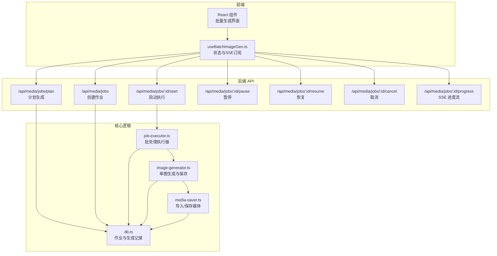
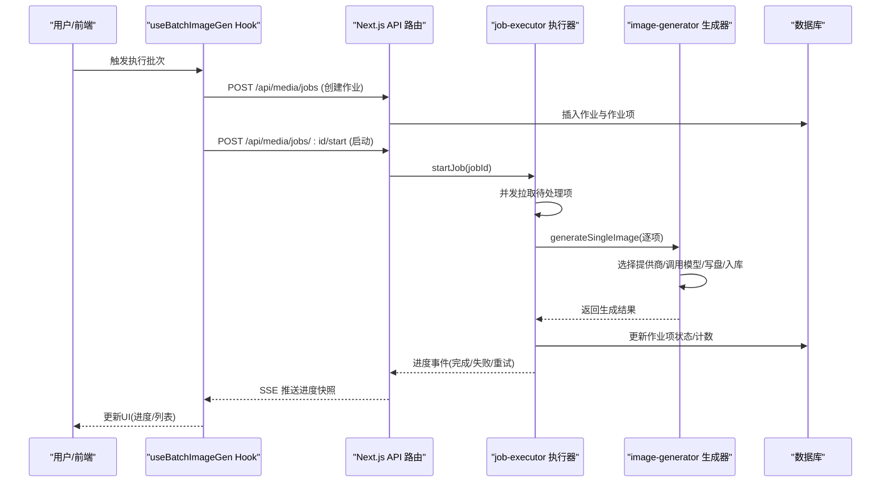
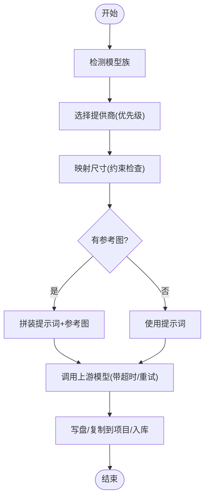
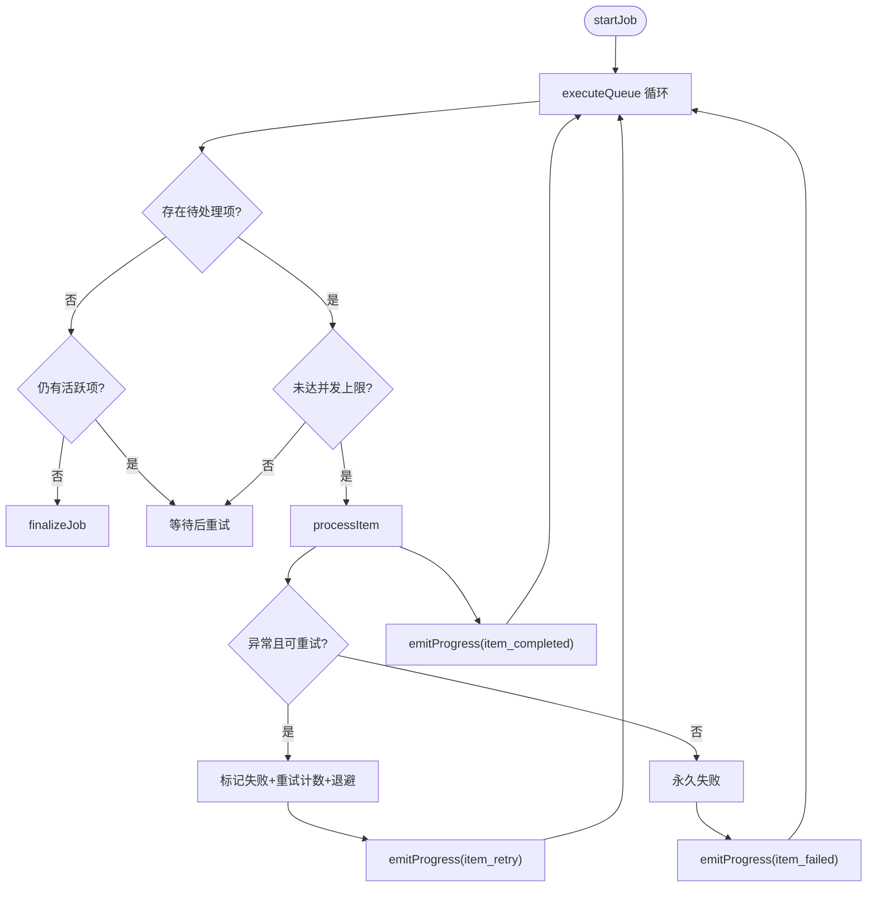
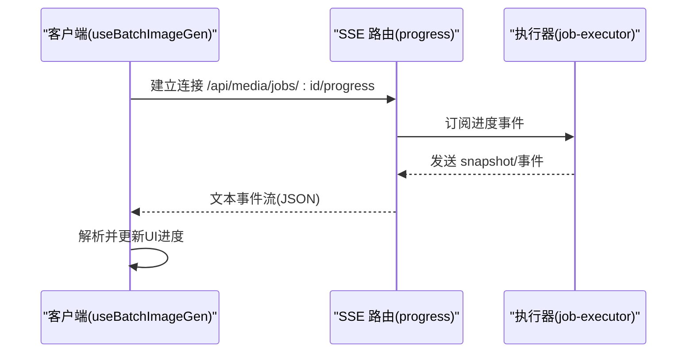
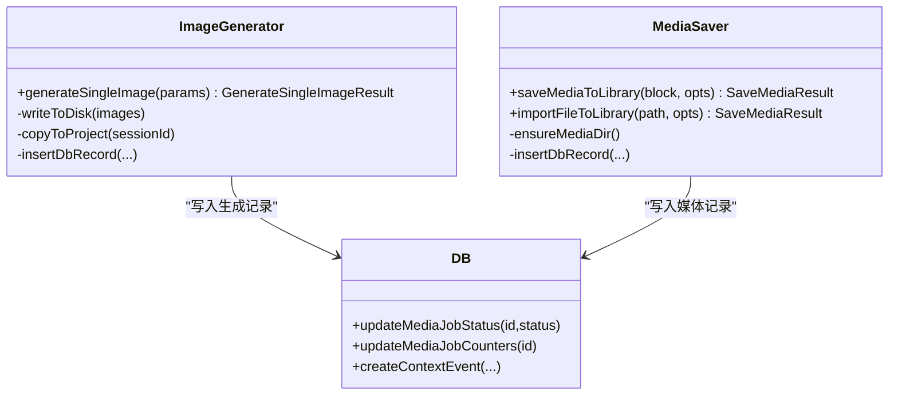
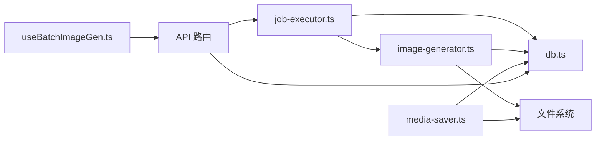

# 媒体生成系统

<cite>
**本文引用的文件**
- [image-generator.ts](file://src/lib/image-generator.ts)
- [job-executor.ts](file://src/lib/job-executor.ts)
- [media-saver.ts](file://src/lib/media-saver.ts)
- [useBatchImageGen.ts](file://src/hooks/useBatchImageGen.ts)
- [progress/route.ts](file://src/app/api/media/jobs/[id]/progress/route.ts)
- [db.ts](file://src/lib/db.ts)
- [PreviewPanel.tsx](file://src/components/layout/panels/PreviewPanel.tsx)
- [builtin-bridge.ts](file://src/lib/codex/proxy/builtin-bridge.ts)
</cite>

## 目录
1. [简介](#简介)
2. [项目结构](#项目结构)
3. [核心组件](#核心组件)
4. [架构总览](#架构总览)
5. [详细组件分析](#详细组件分析)
6. [依赖关系分析](#依赖关系分析)
7. [性能考量](#性能考量)
8. [故障排查指南](#故障排查指南)
9. [结论](#结论)
10. [附录](#附录)

## 简介
本文件面向“媒体生成系统”，聚焦于图片生成算法、任务调度与结果管理机制，覆盖以下主题：
- 图片生成算法：支持 OpenAI GPT Image 与 Gemini 的尺寸映射、参考图增强、超时与重试策略
- 任务调度：批处理作业的队列管理、并发控制、重试退避、进度事件与状态跟踪
- 结果管理：本地存储、项目目录复制、数据库记录、SSE 实时进度流
- 媒体文件管理：导入/保存、类型识别、扩展名映射、预览能力
- 质量控制与性能优化：尺寸约束、像素预算、并发与重试上限、错误分类与非可重试判定
- 批量处理：计划-执行-同步工作流，支持手动与自动批量同步到 LLM 上下文

## 项目结构
媒体生成系统由前端 React Hook、后端 Next.js API、任务执行器与数据库层协同组成，核心路径如下：
- 前端交互：批量图片生成 Hook（useBatchImageGen）
- 后端 API：作业计划、创建、启动、暂停、恢复、取消、进度流等路由
- 核心逻辑：单张图片生成、批处理执行器、媒体保存与导入
- 数据持久化：SQLite 数据库（媒体生成记录、作业与作业项）

**图表来源**
- [useBatchImageGen.ts:1-486](file://src/hooks/useBatchImageGen.ts#L1-L486)
- [progress/route.ts:1-41](file://src/app/api/media/jobs/[id]/progress/route.ts#L1-L41)
- [image-generator.ts:1-455](file://src/lib/image-generator.ts#L1-L455)
- [job-executor.ts:1-363](file://src/lib/job-executor.ts#L1-L363)
- [media-saver.ts:1-175](file://src/lib/media-saver.ts#L1-L175)
- [db.ts:2655-2835](file://src/lib/db.ts#L2655-L2835)

**章节来源**
- [useBatchImageGen.ts:1-486](file://src/hooks/useBatchImageGen.ts#L1-L486)
- [progress/route.ts:1-41](file://src/app/api/media/jobs/[id]/progress/route.ts#L1-L41)
- [image-generator.ts:1-455](file://src/lib/image-generator.ts#L1-L455)
- [job-executor.ts:1-363](file://src/lib/job-executor.ts#L1-L363)
- [media-saver.ts:1-175](file://src/lib/media-saver.ts#L1-L175)
- [db.ts:2655-2835](file://src/lib/db.ts#L2655-L2835)

## 核心组件
- 单图生成器：负责选择提供商、调用上游模型、写入本地与项目目录、入库
- 批处理执行器：队列化作业项、并发控制、指数退避重试、进度事件广播
- 媒体保存器：从 MCP 工具结果或本地文件导入媒体，写入库并记录元数据
- 前端 Hook：封装计划、创建、执行、暂停/恢复/取消、SSE 进度监听与失败重试
- 数据库：作业与作业项状态、计数器、上下文事件记录

**章节来源**
- [image-generator.ts:271-451](file://src/lib/image-generator.ts#L271-L451)
- [job-executor.ts:88-264](file://src/lib/job-executor.ts#L88-L264)
- [media-saver.ts:107-174](file://src/lib/media-saver.ts#L107-L174)
- [useBatchImageGen.ts:203-417](file://src/hooks/useBatchImageGen.ts#L203-L417)
- [db.ts:2655-2835](file://src/lib/db.ts#L2655-L2835)

## 架构总览
系统采用“前端驱动 + 后端 API + 内存执行器 + 持久化”的分层设计：
- 前端通过 REST 与 SSE 与后端交互，实时获取进度
- 后端路由负责作业生命周期管理与进度流输出
- 执行器在内存中维护运行中的作业，按并发与重试策略推进
- 生成器与保存器负责实际的媒体生成与落盘入库

**图表来源**
- [useBatchImageGen.ts:203-330](file://src/hooks/useBatchImageGen.ts#L203-L330)
- [progress/route.ts:12-41](file://src/app/api/media/jobs/[id]/progress/route.ts#L12-L41)
- [job-executor.ts:88-264](file://src/lib/job-executor.ts#L88-L264)
- [image-generator.ts:271-451](file://src/lib/image-generator.ts#L271-L451)
- [db.ts:2667-2687](file://src/lib/db.ts#L2667-L2687)

## 详细组件分析

### 图片生成算法与质量控制
- 提供商选择：优先级为显式 providerId → 模型族推断 → 用户设置 → 回退到 Gemini
- 尺寸映射：OpenAI GPT Image 2 遵循边缘步进 16、最大边 3840、像素预算 655360–8294400；支持任意宽高比与 1K/2K/4K 等级锚点
- 参考图增强：同时传入提示词与参考图，OpenAI 使用编辑接口，Gemini 注入配置
- 超时与重试：默认 300 秒超时，最多 3 次重试
- 输出落盘：写入用户数据目录，必要时复制到项目目录，入库记录元数据

**图表来源**
- [image-generator.ts:271-348](file://src/lib/image-generator.ts#L271-L348)
- [image-generator.ts:43-48](file://src/lib/image-generator.ts#L43-L48)
- [image-generator.ts:163-198](file://src/lib/image-generator.ts#L163-L198)

**章节来源**
- [image-generator.ts:13-38](file://src/lib/image-generator.ts#L13-L38)
- [image-generator.ts:217-265](file://src/lib/image-generator.ts#L217-L265)
- [image-generator.ts:308-348](file://src/lib/image-generator.ts#L308-L348)
- [image-generator.ts:350-451](file://src/lib/image-generator.ts#L350-L451)

### 任务调度与队列管理
- 并发控制：默认并发 2，可从作业配置覆盖
- 重试策略：指数退避（以 3 为底），最大重试次数可配置
- 非可重试判定：当错误包含 4xx/5xx 状态码且为 400/401/403 时直接失败
- 进度事件：item_started/item_completed/item_failed/item_retry/job_completed
- 生命周期：start → pause → resume → cancel → finalize

**图表来源**
- [job-executor.ts:88-165](file://src/lib/job-executor.ts#L88-L165)
- [job-executor.ts:167-264](file://src/lib/job-executor.ts#L167-L264)
- [job-executor.ts:266-295](file://src/lib/job-executor.ts#L266-L295)

**章节来源**
- [job-executor.ts:35-39](file://src/lib/job-executor.ts#L35-L39)
- [job-executor.ts:219-263](file://src/lib/job-executor.ts#L219-L263)
- [job-executor.ts:353-362](file://src/lib/job-executor.ts#L353-L362)

### 进度监控与状态跟踪
- SSE 实时流：后端以 Server-Sent Events 推送快照与事件
- 客户端订阅：Hook 中建立 EventSource，监听 snapshot/item_* 与 job_* 事件
- 状态更新：UI 根据事件更新进度、作业项列表与阶段

**图表来源**
- [useBatchImageGen.ts:257-330](file://src/hooks/useBatchImageGen.ts#L257-L330)
- [progress/route.ts:12-41](file://src/app/api/media/jobs/[id]/progress/route.ts#L12-L41)

**章节来源**
- [useBatchImageGen.ts:257-330](file://src/hooks/useBatchImageGen.ts#L257-L330)
- [progress/route.ts:24-41](file://src/app/api/media/jobs/[id]/progress/route.ts#L24-L41)

### 结果管理与存储
- 本地存储：统一写入用户数据目录下的媒体库
- 项目复制：若提供 sessionId，复制到会话工作目录的隐藏图片目录
- 数据库记录：插入 media_generations 表，记录类型、提供商、模型、元数据等
- 导入能力：支持从 MCP 工具结果或本地文件导入，自动推断 MIME/扩展名

**图表来源**
- [image-generator.ts:364-451](file://src/lib/image-generator.ts#L364-L451)
- [media-saver.ts:107-174](file://src/lib/media-saver.ts#L107-L174)
- [db.ts:2667-2687](file://src/lib/db.ts#L2667-L2687)
- [db.ts:2811-2827](file://src/lib/db.ts#L2811-L2827)

**章节来源**
- [image-generator.ts:364-451](file://src/lib/image-generator.ts#L364-L451)
- [media-saver.ts:107-174](file://src/lib/media-saver.ts#L107-L174)
- [db.ts:2667-2687](file://src/lib/db.ts#L2667-L2687)

### 媒体文件的存储、检索与预览
- 存储：统一目录 + 按 MIME 映射扩展名；CLI/工具链导入时保留原始路径信息
- 检索：通过 API 获取作业详情与作业项列表，支持刷新最新状态
- 预览：根据扩展名判断是否可直渲染（图片/视频/音频），否则走 API 获取

**章节来源**
- [media-saver.ts:22-45](file://src/lib/media-saver.ts#L22-L45)
- [useBatchImageGen.ts:332-344](file://src/hooks/useBatchImageGen.ts#L332-L344)
- [PreviewPanel.tsx:167-194](file://src/components/layout/panels/PreviewPanel.tsx#L167-L194)

### 批量处理与上下文同步
- 计划生成：向后端发送风格提示与文档内容，流式返回计划
- 执行：创建作业、启动、订阅进度、失败重试
- 同步：将生成结果同步到 LLM 上下文，支持手动与自动批量模式

**章节来源**
- [useBatchImageGen.ts:87-164](file://src/hooks/useBatchImageGen.ts#L87-L164)
- [useBatchImageGen.ts:419-448](file://src/hooks/useBatchImageGen.ts#L419-L448)

## 依赖关系分析
- 前端 Hook 依赖后端 API 与 SSE；后端路由依赖执行器与数据库
- 执行器依赖生成器与数据库；生成器依赖提供商配置与文件系统
- 媒体保存器独立于执行器，可被 MCP 或 CLI 调用

**图表来源**
- [useBatchImageGen.ts:203-330](file://src/hooks/useBatchImageGen.ts#L203-L330)
- [job-executor.ts:88-165](file://src/lib/job-executor.ts#L88-L165)
- [image-generator.ts:271-451](file://src/lib/image-generator.ts#L271-L451)
- [media-saver.ts:107-174](file://src/lib/media-saver.ts#L107-L174)
- [db.ts:2667-2687](file://src/lib/db.ts#L2667-L2687)

**章节来源**
- [useBatchImageGen.ts:203-330](file://src/hooks/useBatchImageGen.ts#L203-L330)
- [job-executor.ts:88-165](file://src/lib/job-executor.ts#L88-L165)
- [image-generator.ts:271-451](file://src/lib/image-generator.ts#L271-L451)
- [media-saver.ts:107-174](file://src/lib/media-saver.ts#L107-L174)
- [db.ts:2667-2687](file://src/lib/db.ts#L2667-L2687)

## 性能考量
- 并发与限速：通过批配置控制并发，避免上游限流与资源争用
- 重试退避：指数退避降低抖动，结合非可重试判定减少无效重试
- 尺寸预算：严格遵循最大边与像素预算，避免超大分辨率导致的内存与时间开销
- I/O 优化：批量写盘与复制，尽量减少多次 IO；仅在需要时复制到项目目录
- 超时控制：统一超时阈值，防止长时间挂起阻塞队列

[本节为通用指导，不直接分析具体文件]

## 故障排查指南
- 无提供商可用：检查设置中是否配置了有效的 Gemini/OpenAI 图像提供商
- 尺寸非法：确认宽高比不超过 3:1，且映射后的尺寸满足约束
- 非可重试错误：400/401/403 状态将直接失败，需修正参数或凭据
- 进度无更新：确认 SSE 连接正常，检查浏览器网络面板与后端日志
- 生成失败但无重试：检查重试次数上限与退避延迟配置

**章节来源**
- [image-generator.ts:226-228](file://src/lib/image-generator.ts#L226-L228)
- [job-executor.ts:222-223](file://src/lib/job-executor.ts#L222-L223)
- [job-executor.ts:353-362](file://src/lib/job-executor.ts#L353-L362)
- [useBatchImageGen.ts:257-330](file://src/hooks/useBatchImageGen.ts#L257-L330)

## 结论
该媒体生成系统通过清晰的分层设计实现了从计划到执行再到结果管理的完整闭环。前端以 Hook 驱动，后端以 API 与 SSE 提供实时反馈，执行器以并发与重试策略保障稳定性，生成器与保存器确保质量与一致性。配合严格的尺寸与像素预算控制，系统在保证生成质量的同时兼顾性能与可靠性。

[本节为总结性内容，不直接分析具体文件]

## 附录

### API 一览（路径与用途）
- POST /api/media/jobs/plan：基于风格提示与文档内容生成计划（流式）
- POST /api/media/jobs：创建作业与作业项
- POST /api/media/jobs/:id/start：启动执行
- POST /api/media/jobs/:id/pause：暂停
- POST /api/media/jobs/:id/resume：恢复
- POST /api/media/jobs/:id/cancel：取消
- GET /api/media/jobs/:id/progress：SSE 实时进度流
- GET /api/media/jobs/:id：获取作业与作业项详情
- POST /api/media/jobs/:id/sync-context：同步到 LLM 上下文

**章节来源**
- [useBatchImageGen.ts:87-164](file://src/hooks/useBatchImageGen.ts#L87-L164)
- [useBatchImageGen.ts:203-330](file://src/hooks/useBatchImageGen.ts#L203-L330)
- [progress/route.ts:12-41](file://src/app/api/media/jobs/[id]/progress/route.ts#L12-L41)

### 类型与状态
- 作业状态：planned → running → paused → completed/failed/cancelled
- 作业项状态：pending → processing → completed/failed/cancelled
- 进度事件：snapshot、item_started、item_completed、item_failed、item_retry、job_completed、job_paused、job_cancelled

**章节来源**
- [job-executor.ts:71-79](file://src/lib/job-executor.ts#L71-L79)
- [job-executor.ts:183-218](file://src/lib/job-executor.ts#L183-L218)
- [job-executor.ts:311-337](file://src/lib/job-executor.ts#L311-L337)