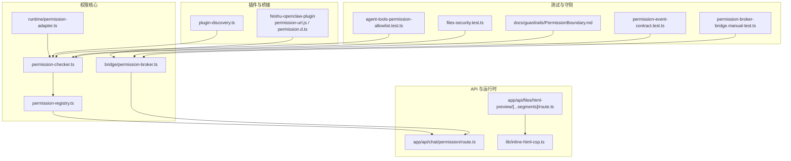
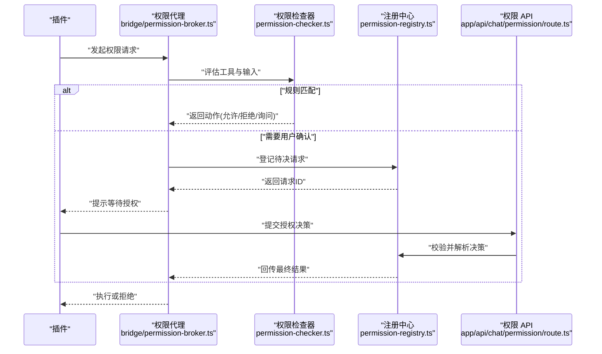
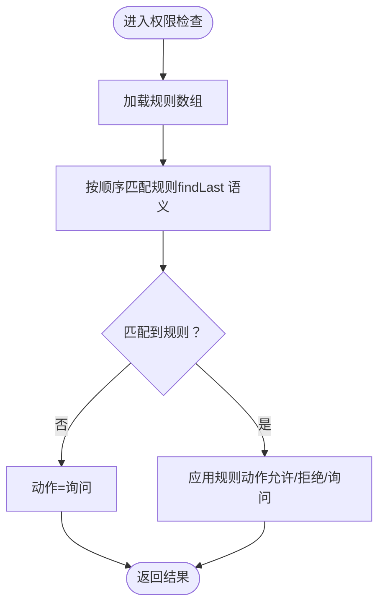
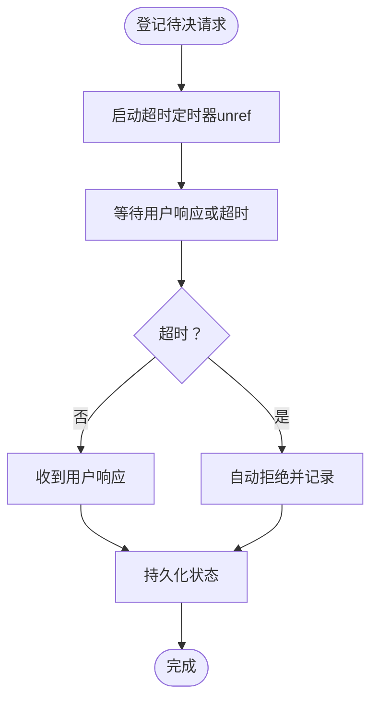
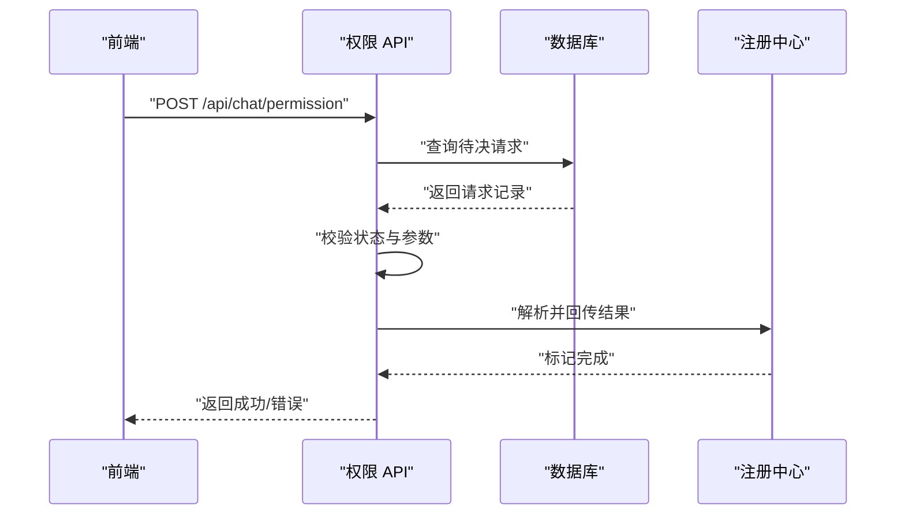
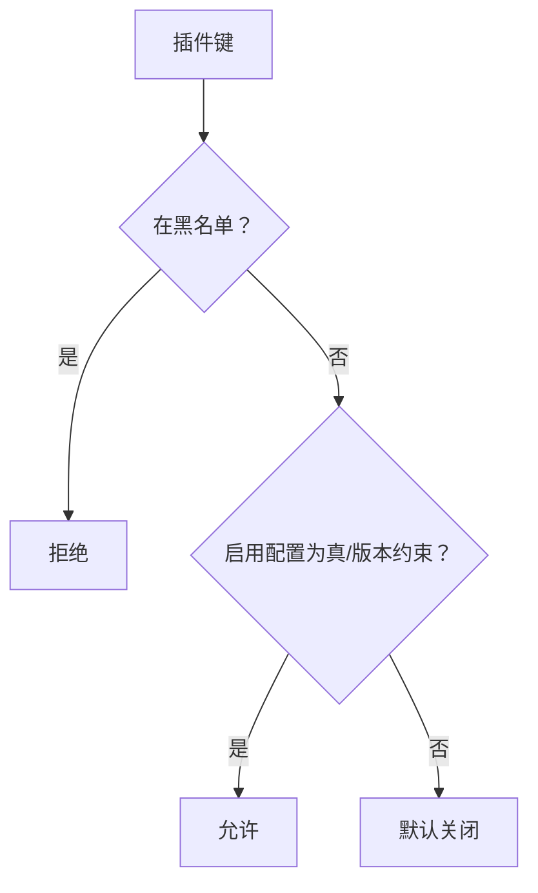
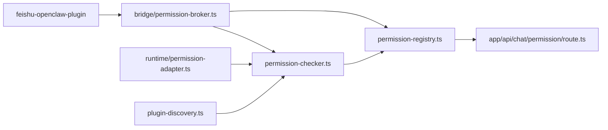

# 插件安全与权限

<cite>
**本文引用的文件**
- [permission-checker.ts](file://src/lib/permission-checker.ts)
- [permission-registry.ts](file://src/lib/permission-registry.ts)
- [permission-broker.ts](file://src/lib/bridge/permission-broker.ts)
- [permission-url.js](file://资料/feishu-openclaw-plugin/package/src/core/permission-url.js)
- [permission.d.ts](file://资料/feishu-openclaw-plugin/package/src/messaging/inbound/permission.d.ts)
- [plugin-discovery.ts](file://src/lib/plugin-discovery.ts)
- [files-security.test.ts](file://src/__tests__/unit/files-security.test.ts)
- [PermissionBoundary.md](file://docs/guardrails/PermissionBoundary.md)
- [route.ts](file://src/app/api/chat/permission/route.ts)
- [runtime-adapter.ts](file://src/lib/runtime/permission-adapter.ts)
- [agent-tools-permission-allowlist.test.ts](file://src/__tests__/unit/agent-tools-permission-allowlist.test.ts)
- [permission-event-contract.test.ts](file://src/__tests__/unit/permission-event-contract.test.ts)
- [permission-broker-bridge.manual-test.ts](file://src/__tests__/unit/permission-broker-bridge.manual-test.ts)
- [inline-html-csp.ts](file://src/lib/inline-html-csp.ts)
- [route.ts](file://src/app/api/files/html-preview/[...segments]/route.ts)
- [log-sanitize.ts](file://electron/log-sanitize.ts)
</cite>

## 目录
1. [引言](#引言)
2. [项目结构](#项目结构)
3. [核心组件](#核心组件)
4. [架构总览](#架构总览)
5. [详细组件分析](#详细组件分析)
6. [依赖关系分析](#依赖关系分析)
7. [性能考量](#性能考量)
8. [故障排查指南](#故障排查指南)
9. [结论](#结论)
10. [附录](#附录)

## 引言
本文件系统化阐述本项目的插件安全与权限体系，重点覆盖以下方面：
- 插件安全沙箱与资源限制机制
- 权限申请、授权验证与撤销流程
- 安全策略、访问控制与数据保护
- 隔离机制、恶意行为检测与防护策略
- 安全审计、日志记录与合规性检查

目标是帮助开发者与运维人员理解并正确配置、检查与管理插件权限，确保在开放生态中保持最小权限原则与运行时安全。

## 项目结构
围绕“插件安全与权限”的关键目录与文件分布如下：
- 权限核心逻辑：src/lib/permission-* 系列文件
- 插件发现与启用/禁用：src/lib/plugin-discovery.ts
- 插件桥接与消息通道：src/lib/bridge/permission-broker.ts
- 插件 SDK（示例）：资料/feishu-openclaw-plugin
- API 入口：src/app/api/chat/permission/route.ts
- 运行时适配器：src/lib/runtime/permission-adapter.ts
- 安全测试与契约测试：多处 unit 测试文件
- HTML 预览 CSP：src/app/api/files/html-preview/[...segments]/route.ts 与 src/lib/inline-html-csp.ts
- 日志与敏感信息清洗：electron/log-sanitize.ts

图表来源
- [permission-checker.ts:1-35](file://src/lib/permission-checker.ts#L1-L35)
- [permission-registry.ts:34-71](file://src/lib/permission-registry.ts#L34-L71)
- [permission-broker.ts](file://src/lib/bridge/permission-broker.ts)
- [runtime-adapter.ts](file://src/lib/runtime/permission-adapter.ts)
- [plugin-discovery.ts:197-246](file://src/lib/plugin-discovery.ts#L197-L246)
- [route.ts:1-74](file://src/app/api/chat/permission/route.ts#L1-L74)
- [route.ts:153-181](file://src/app/api/files/html-preview/[...segments]/route.ts#L153-L181)
- [inline-html-csp.ts](file://src/lib/inline-html-csp.ts)
- [agent-tools-permission-allowlist.test.ts](file://src/__tests__/unit/agent-tools-permission-allowlist.test.ts)
- [permission-event-contract.test.ts](file://src/__tests__/unit/permission-event-contract.test.ts)
- [permission-broker-bridge.manual-test.ts](file://src/__tests__/unit/permission-broker-bridge.manual-test.ts)
- [files-security.test.ts:62-91](file://src/__tests__/unit/files-security.test.ts#L62-L91)
- [PermissionBoundary.md:21-49](file://docs/guardrails/PermissionBoundary.md#L21-L49)

章节来源
- [permission-checker.ts:1-35](file://src/lib/permission-checker.ts#L1-L35)
- [permission-registry.ts:34-71](file://src/lib/permission-registry.ts#L34-L71)
- [permission-broker.ts](file://src/lib/bridge/permission-broker.ts)
- [plugin-discovery.ts:197-246](file://src/lib/plugin-discovery.ts#L197-L246)
- [route.ts:1-74](file://src/app/api/chat/permission/route.ts#L1-L74)
- [route.ts:153-181](file://src/app/api/files/html-preview/[...segments]/route.ts#L153-L181)
- [inline-html-csp.ts](file://src/lib/inline-html-csp.ts)
- [agent-tools-permission-allowlist.test.ts](file://src/__tests__/unit/agent-tools-permission-allowlist.test.ts)
- [permission-event-contract.test.ts](file://src/__tests__/unit/permission-event-contract.test.ts)
- [permission-broker-bridge.manual-test.ts](file://src/__tests__/unit/permission-broker-bridge.manual-test.ts)
- [files-security.test.ts:62-91](file://src/__tests__/unit/files-security.test.ts#L62-L91)
- [PermissionBoundary.md:21-49](file://docs/guardrails/PermissionBoundary.md#L21-L49)

## 核心组件
- 权限检查器（permission-checker.ts）：定义权限模式、规则引擎与检查结果类型，提供三态动作（允许/拒绝/询问）。
- 权限注册中心（permission-registry.ts）：维护待决请求、超时处理、数据库持久化与内存状态同步。
- 权限 API（app/api/chat/permission/route.ts）：接收用户授权决策，校验请求存在性与状态，解析并回传最终结果。
- 权限代理（runtime/permission-adapter.ts）：将运行时能力映射为权限模型，确保跨运行时一致性。
- 插件发现（plugin-discovery.ts）：合并启用列表与黑名单，优先级为黑名单硬阻断 > 启用配置 > 默认关闭。
- 插件桥接（bridge/permission-broker.ts）：在宿主与插件之间传递权限事件与决策，保障消息通道安全。
- 插件 SDK 示例（资料/feishu-openclaw-plugin）：提供插件侧权限 URL 与消息类型定义，便于插件端接入。
- HTML 预览 CSP（app/api/files/html-preview/[...segments]/route.ts 与 lib/inline-html-csp.ts）：严格限制外联、嵌入与脚本执行，防止数据泄露与钓鱼攻击。
- 安全测试与契约（多处 unit 测试与 Guardrails 文档）：通过测试覆盖权限白名单、事件契约与桥接一致性，确保变更可控。

章节来源
- [permission-checker.ts:1-35](file://src/lib/permission-checker.ts#L1-L35)
- [permission-registry.ts:34-71](file://src/lib/permission-registry.ts#L34-L71)
- [route.ts:1-74](file://src/app/api/chat/permission/route.ts#L1-L74)
- [runtime-adapter.ts](file://src/lib/runtime/permission-adapter.ts)
- [plugin-discovery.ts:197-246](file://src/lib/plugin-discovery.ts#L197-L246)
- [permission-broker.ts](file://src/lib/bridge/permission-broker.ts)
- [route.ts:153-181](file://src/app/api/files/html-preview/[...segments]/route.ts#L153-L181)
- [inline-html-csp.ts](file://src/lib/inline-html-csp.ts)
- [agent-tools-permission-allowlist.test.ts](file://src/__tests__/unit/agent-tools-permission-allowlist.test.ts)
- [permission-event-contract.test.ts](file://src/__tests__/unit/permission-event-contract.test.ts)
- [permission-broker-bridge.manual-test.ts](file://src/__tests__/unit/permission-broker-bridge.manual-test.ts)
- [PermissionBoundary.md:21-49](file://docs/guardrails/PermissionBoundary.md#L21-L49)

## 架构总览
下图展示了从“插件调用工具”到“权限决策与执行”的整体流程，包括本地权限检查、待决请求登记、用户授权与结果回传。

图表来源
- [permission-broker.ts](file://src/lib/bridge/permission-broker.ts)
- [permission-checker.ts:1-35](file://src/lib/permission-checker.ts#L1-L35)
- [permission-registry.ts:34-71](file://src/lib/permission-registry.ts#L34-L71)
- [route.ts:1-74](file://src/app/api/chat/permission/route.ts#L1-L74)

## 详细组件分析

### 权限检查器（permission-checker.ts）
- 角色：定义权限模式（探索/普通/信任）、规则引擎（基于最后匹配规则生效）与检查结果类型。
- 关键点：
  - 三态动作：允许、拒绝、询问
  - 规则字段：权限标识、输入模式（glob）、动作
  - Bash 安全：危险命令在信任模式下仍需显式规则允许
- 复杂度：规则数组线性扫描，按最后匹配规则决定，时间复杂度 O(n)，空间复杂度 O(n)。

图表来源
- [permission-checker.ts:1-35](file://src/lib/permission-checker.ts#L1-L35)

章节来源
- [permission-checker.ts:1-35](file://src/lib/permission-checker.ts#L1-L35)

### 权限注册中心（permission-registry.ts）
- 角色：维护待决请求、超时自动拒绝、与数据库状态同步。
- 关键点：
  - 登记接口：registerPendingPermission 返回 Promise，超时自动拒绝
  - 撤销接口：根据 ID 与错误信息拒绝并持久化
  - 数据一致性：DB 写失败不影响内存路径
- 复杂度：内存 Map 查找/删除 O(1)，定时器 O(1)。

图表来源
- [permission-registry.ts:34-71](file://src/lib/permission-registry.ts#L34-L71)

章节来源
- [permission-registry.ts:34-71](file://src/lib/permission-registry.ts#L34-L71)

### 权限 API（app/api/chat/permission/route.ts）
- 角色：接收前端提交的授权决策，校验请求存在性与状态，解析并回传最终结果。
- 关键点：
  - 参数校验：请求 ID 与决策必填
  - DB 校验：请求存在且处于待决状态
  - 结果解析：允许/拒绝分支，支持更新权限与输入
  - 错误处理：多种状态码与错误码
- 复杂度：O(1) 校验与查询，I/O 受 DB 影响。

图表来源
- [route.ts:1-74](file://src/app/api/chat/permission/route.ts#L1-L74)

章节来源
- [route.ts:1-74](file://src/app/api/chat/permission/route.ts#L1-L74)

### 权限代理（bridge/permission-broker.ts）
- 角色：在宿主与插件之间转发权限事件，确保消息通道安全与一致性。
- 关键点：
  - 事件桥接：将运行时事件转换为权限请求
  - 与注册中心协作：登记/撤销/查询待决请求
  - 与运行时适配器协作：将运行时能力映射为权限模型
- 复杂度：消息转发 O(1)，状态同步受网络与 DB 影响。

章节来源
- [permission-broker.ts](file://src/lib/bridge/permission-broker.ts)
- [runtime-adapter.ts](file://src/lib/runtime/permission-adapter.ts)

### 插件发现与启用/禁用（plugin-discovery.ts）
- 角色：合并启用列表与黑名单，决定插件是否可用。
- 关键点：
  - 优先级：黑名单硬阻断 > 启用配置 > 默认关闭
  - 版本约束：字符串数组视作启用（带版本约束）
- 复杂度：O(1) 查询，构建缓存集合 O(n)。

图表来源
- [plugin-discovery.ts:197-246](file://src/lib/plugin-discovery.ts#L197-L246)

章节来源
- [plugin-discovery.ts:197-246](file://src/lib/plugin-discovery.ts#L197-L246)

### 插件 SDK 示例（feishu-openclaw-plugin）
- 角色：提供插件侧权限 URL 与消息类型定义，便于插件端接入宿主权限系统。
- 关键点：
  - permission-url.js：定义插件侧权限交互 URL
  - permission.d.ts：定义插件侧权限消息类型

章节来源
- [permission-url.js](file://资料/feishu-openclaw-plugin/package/src/core/permission-url.js)
- [permission.d.ts](file://资料/feishu-openclaw-plugin/package/src/messaging/inbound/permission.d.ts)

### HTML 预览 CSP（app/api/files/html-preview/[...segments]/route.ts 与 lib/inline-html-csp.ts）
- 角色：严格限制外联、嵌入与脚本执行，防止数据泄露与钓鱼攻击。
- 关键点：
  - 默认禁止所有来源（default-src 'none'）
  - 禁止嵌套框架、对象与 Worker
  - 交互模式下进一步收紧 URL 形通道
  - 基线限制：frame-ancestors 'self'、base-uri 'self'、form-action 'none'

章节来源
- [route.ts:153-181](file://src/app/api/files/html-preview/[...segments]/route.ts#L153-L181)
- [inline-html-csp.ts](file://src/lib/inline-html-csp.ts)

### 安全测试与契约（多处 unit 测试与 Guardrails 文档）
- 角色：通过测试覆盖权限白名单、事件契约与桥接一致性，确保变更可控。
- 关键点：
  - agent-tools-permission-allowlist.test.ts：工具白名单测试
  - permission-event-contract.test.ts：事件契约测试
  - permission-broker-bridge.manual-test.ts：桥接手动测试
  - files-security.test.ts：路径安全与越权读取测试
  - PermissionBoundary.md：权限边界守则与责任清单

章节来源
- [agent-tools-permission-allowlist.test.ts](file://src/__tests__/unit/agent-tools-permission-allowlist.test.ts)
- [permission-event-contract.test.ts](file://src/__tests__/unit/permission-event-contract.test.ts)
- [permission-broker-bridge.manual-test.ts](file://src/__tests__/unit/permission-broker-bridge.manual-test.ts)
- [files-security.test.ts:62-91](file://src/__tests__/unit/files-security.test.ts#L62-L91)
- [PermissionBoundary.md:21-49](file://docs/guardrails/PermissionBoundary.md#L21-L49)

## 依赖关系分析
- 组件耦合：
  - 权限检查器与注册中心强耦合：前者输出动作，后者负责登记与超时
  - 权限代理与两者弱耦合：通过接口抽象进行消息传递
  - 运行时适配器与权限检查器：将运行时能力映射为权限模型
  - 插件发现与权限检查器：插件启用状态影响工具可用性
- 外部依赖：
  - 数据库：持久化待决请求与结果
  - 前端 API：提交授权决策
  - 插件 SDK：插件侧权限交互协议

图表来源
- [permission-checker.ts:1-35](file://src/lib/permission-checker.ts#L1-L35)
- [permission-registry.ts:34-71](file://src/lib/permission-registry.ts#L34-L71)
- [permission-broker.ts](file://src/lib/bridge/permission-broker.ts)
- [runtime-adapter.ts](file://src/lib/runtime/permission-adapter.ts)
- [plugin-discovery.ts:197-246](file://src/lib/plugin-discovery.ts#L197-L246)
- [route.ts:1-74](file://src/app/api/chat/permission/route.ts#L1-L74)
- [permission-url.js](file://资料/feishu-openclaw-plugin/package/src/core/permission-url.js)

章节来源
- [permission-checker.ts:1-35](file://src/lib/permission-checker.ts#L1-L35)
- [permission-registry.ts:34-71](file://src/lib/permission-registry.ts#L34-L71)
- [permission-broker.ts](file://src/lib/bridge/permission-broker.ts)
- [runtime-adapter.ts](file://src/lib/runtime/permission-adapter.ts)
- [plugin-discovery.ts:197-246](file://src/lib/plugin-discovery.ts#L197-L246)
- [route.ts:1-74](file://src/app/api/chat/permission/route.ts#L1-L74)
- [permission-url.js](file://资料/feishu-openclaw-plugin/package/src/core/permission-url.js)

## 性能考量
- 规则匹配：线性扫描规则数组，建议控制规则数量与复杂度，避免长链路延迟
- 待决请求：超时定时器使用 unref，避免阻塞进程退出；DB 写失败不影响内存路径
- API 调用：参数校验与 DB 查询为 O(1)，瓶颈主要在数据库 I/O
- 插件发现：缓存黑名单与启用映射，查询为 O(1)

## 故障排查指南
- 请求未找到或已解决
  - 现象：返回 NOT_FOUND 或 ALREADY_RESOLVED
  - 排查：确认请求 ID 是否正确，检查状态是否为 pending
- 超时未响应
  - 现象：自动拒绝并记录超时
  - 排查：检查前端是否触发授权弹窗，确认网络与服务可用性
- 权限 API 返回 WAITER_GONE
  - 现象：进程重启导致内存等待者消失
  - 排查：确认服务重启策略，必要时迁移状态或重建等待者
- 插件未启用
  - 现象：工具不可用
  - 排查：检查黑名单与启用配置，确认版本约束
- HTML 预览异常
  - 现象：资源无法加载或脚本被阻止
  - 排查：核对 CSP 策略与交互模式开关

章节来源
- [route.ts:20-61](file://src/app/api/chat/permission/route.ts#L20-L61)
- [permission-registry.ts:63-71](file://src/lib/permission-registry.ts#L63-L71)
- [plugin-discovery.ts:234-241](file://src/lib/plugin-discovery.ts#L234-L241)
- [route.ts:153-181](file://src/app/api/files/html-preview/[...segments]/route.ts#L153-L181)

## 结论
本项目通过“规则驱动的权限检查器 + 待决请求注册中心 + 明确的 API 决策流 + 插件发现与桥接”的组合，实现了可审计、可扩展、可测试的插件权限体系。配合严格的 CSP 与安全测试，有效降低了插件生态中的权限滥用与数据泄露风险。建议在新增工具与运行时能力时，遵循契约测试与守则文档，确保变更可控与一致。

## 附录
- 安全策略要点
  - 最小权限：默认拒绝，显式允许
  - 三态动作：允许、拒绝、询问（用于危险操作）
  - 超时自动拒绝：避免长时间挂起
  - 交互模式收紧：脚本运行时收紧 URL 通道
- 访问控制与数据保护
  - 路径安全：禁止越权读取系统文件
  - CSP 严格限制：禁止外联与嵌入
  - 日志清洗：敏感信息脱敏输出
- 审计与合规
  - 待决请求持久化：可追溯授权历史
  - 契约测试：保证跨运行时一致性
  - 守则文档：明确责任与检查项

章节来源
- [files-security.test.ts:62-91](file://src/__tests__/unit/files-security.test.ts#L62-L91)
- [route.ts:153-181](file://src/app/api/files/html-preview/[...segments]/route.ts#L153-L181)
- [log-sanitize.ts](file://electron/log-sanitize.ts)