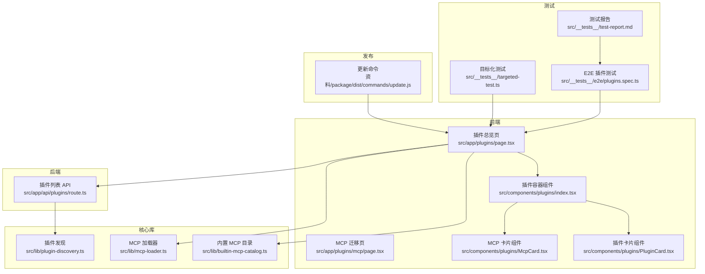
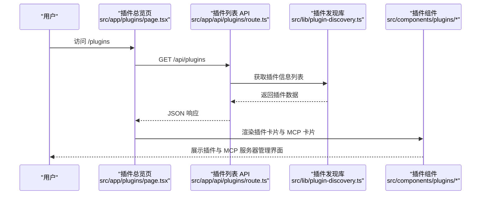
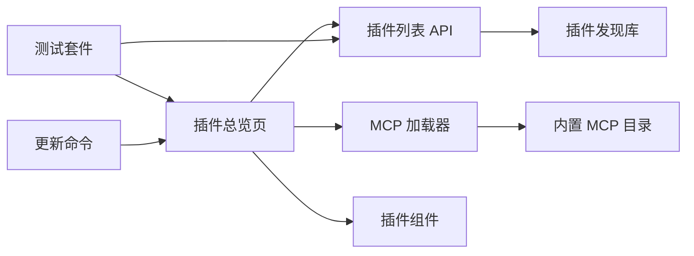

# 插件开发指南

<cite>
**本文引用的文件**
- [README.md](file://README.md)
- [src/app/plugins/page.tsx](file://src/app/plugins/page.tsx)
- [src/app/plugins/mcp/page.tsx](file://src/app/plugins/mcp/page.tsx)
- [src/app/api/plugins/route.ts](file://src/app/api/plugins/route.ts)
- [src/lib/plugin-discovery.ts](file://src/lib/plugin-discovery.ts)
- [src/lib/mcp-loader.ts](file://src/lib/mcp-loader.ts)
- [src/lib/builtin-mcp-catalog.ts](file://src/lib/builtin-mcp-catalog.ts)
- [src/components/plugins/index.tsx](file://src/components/plugins/index.tsx)
- [src/components/plugins/McpCard.tsx](file://src/components/plugins/McpCard.tsx)
- [src/components/plugins/PluginCard.tsx](file://src/components/plugins/PluginCard.tsx)
- [src/__tests__/e2e/plugins.spec.ts](file://src/__tests__/e2e/plugins.spec.ts)
- [src/__tests__/targeted-test.ts](file://src/__tests__/targeted-test.ts)
- [src/__tests__/test-report.md](file://src/__tests__/test-report.md)
- [资料/package/dist/commands/update.js](file://资料/package/dist/commands/update.js)
</cite>

## 目录
1. [简介](#简介)
2. [项目结构](#项目结构)
3. [核心组件](#核心组件)
4. [架构总览](#架构总览)
5. [详细组件分析](#详细组件分析)
6. [依赖关系分析](#依赖关系分析)
7. [性能考量](#性能考量)
8. [故障排查指南](#故障排查指南)
9. [结论](#结论)
10. [附录](#附录)

## 简介
本指南面向希望在 CodePilot 平台上开发与集成插件的开发者，系统阐述插件开发框架、API 接口与扩展点，覆盖模板系统、代码生成与调试工具，提供测试策略（单元测试与集成测试）、版本管理与发布流程的最佳实践。文档以仓库现有实现为依据，结合前端页面、后端接口与测试用例，帮助你从零完成插件的创建、调试、测试、打包与发布全流程。

## 项目结构
围绕插件体系的关键目录与文件包括：
- 前端页面与路由
  - 插件总览页：src/app/plugins/page.tsx
  - MCP 服务器迁移页：src/app/plugins/mcp/page.tsx
- 后端 API
  - 插件列表接口：src/app/api/plugins/route.ts
- 核心库
  - 插件发现：src/lib/plugin-discovery.ts
  - MCP 加载器：src/lib/mcp-loader.ts
  - 内置 MCP 目录：src/lib/builtin-mcp-catalog.ts
- 组件
  - 插件容器与卡片组件：src/components/plugins/index.tsx、McpCard.tsx、PluginCard.tsx
- 测试
  - E2E 插件测试：src/__tests__/e2e/plugins.spec.ts
  - 目标化测试与报告：src/__tests__/targeted-test.ts、src/__tests__/test-report.md
- 发布与更新
  - 更新命令：资料/package/dist/commands/update.js

图表来源
- [src/app/plugins/page.tsx:1-200](file://src/app/plugins/page.tsx#L1-L200)
- [src/app/plugins/mcp/page.tsx:1-17](file://src/app/plugins/mcp/page.tsx#L1-L17)
- [src/app/api/plugins/route.ts:1-17](file://src/app/api/plugins/route.ts#L1-L17)
- [src/lib/plugin-discovery.ts:1-200](file://src/lib/plugin-discovery.ts#L1-L200)
- [src/lib/mcp-loader.ts:1-200](file://src/lib/mcp-loader.ts#L1-L200)
- [src/lib/builtin-mcp-catalog.ts:1-200](file://src/lib/builtin-mcp-catalog.ts#L1-L200)
- [src/components/plugins/index.tsx:1-200](file://src/components/plugins/index.tsx#L1-L200)
- [src/components/plugins/McpCard.tsx:1-200](file://src/components/plugins/McpCard.tsx#L1-L200)
- [src/components/plugins/PluginCard.tsx:1-200](file://src/components/plugins/PluginCard.tsx#L1-L200)
- [src/__tests__/e2e/plugins.spec.ts:1-200](file://src/__tests__/e2e/plugins.spec.ts#L1-L200)
- [src/__tests__/targeted-test.ts:1-200](file://src/__tests__/targeted-test.ts#L1-L200)
- [src/__tests__/test-report.md:1-200](file://src/__tests__/test-report.md#L1-L200)
- [资料/package/dist/commands/update.js:1-150](file://资料/package/dist/commands/update.js#L1-L150)

章节来源
- [src/app/plugins/page.tsx:1-200](file://src/app/plugins/page.tsx#L1-L200)
- [src/app/plugins/mcp/page.tsx:1-17](file://src/app/plugins/mcp/page.tsx#L1-L17)
- [src/app/api/plugins/route.ts:1-17](file://src/app/api/plugins/route.ts#L1-L17)
- [src/lib/plugin-discovery.ts:1-200](file://src/lib/plugin-discovery.ts#L1-L200)
- [src/lib/mcp-loader.ts:1-200](file://src/lib/mcp-loader.ts#L1-L200)
- [src/lib/builtin-mcp-catalog.ts:1-200](file://src/lib/builtin-mcp-catalog.ts#L1-L200)
- [src/components/plugins/index.tsx:1-200](file://src/components/plugins/index.tsx#L1-L200)
- [src/components/plugins/McpCard.tsx:1-200](file://src/components/plugins/McpCard.tsx#L1-L200)
- [src/components/plugins/PluginCard.tsx:1-200](file://src/components/plugins/PluginCard.tsx#L1-L200)
- [src/__tests__/e2e/plugins.spec.ts:1-200](file://src/__tests__/e2e/plugins.spec.ts#L1-L200)
- [src/__tests__/targeted-test.ts:1-200](file://src/__tests__/targeted-test.ts#L1-L200)
- [src/__tests__/test-report.md:1-200](file://src/__tests__/test-report.md#L1-L200)
- [资料/package/dist/commands/update.js:1-150](file://资料/package/dist/commands/update.js#L1-L150)

## 核心组件
- 插件总览页：负责渲染插件与 MCP 服务器的统一管理界面，支持筛选（全部/全局/项目）与搜索。
- 插件列表 API：提供插件清单的后端接口，支持可选的工作目录参数用于解析不同层级的设置。
- 插件发现库：负责扫描与聚合插件信息，作为 API 数据源。
- MCP 加载器与内置目录：负责 MCP 服务器的加载、连接与目录管理。
- 插件组件：包含通用插件卡片与 MCP 卡片，用于在界面上展示与操作。
- 测试套件：包含 E2E 与目标化测试，验证页面行为与交互。
- 更新命令：提供插件更新流程中的版本读取与校验。

章节来源
- [src/app/plugins/page.tsx:1-200](file://src/app/plugins/page.tsx#L1-L200)
- [src/app/api/plugins/route.ts:1-17](file://src/app/api/plugins/route.ts#L1-L17)
- [src/lib/plugin-discovery.ts:1-200](file://src/lib/plugin-discovery.ts#L1-L200)
- [src/lib/mcp-loader.ts:1-200](file://src/lib/mcp-loader.ts#L1-L200)
- [src/lib/builtin-mcp-catalog.ts:1-200](file://src/lib/builtin-mcp-catalog.ts#L1-L200)
- [src/components/plugins/index.tsx:1-200](file://src/components/plugins/index.tsx#L1-L200)
- [src/components/plugins/McpCard.tsx:1-200](file://src/components/plugins/McpCard.tsx#L1-L200)
- [src/components/plugins/PluginCard.tsx:1-200](file://src/components/plugins/PluginCard.tsx#L1-L200)
- [src/__tests__/e2e/plugins.spec.ts:1-200](file://src/__tests__/e2e/plugins.spec.ts#L1-L200)
- [src/__tests__/targeted-test.ts:1-200](file://src/__tests__/targeted-test.ts#L1-L200)
- [src/__tests__/test-report.md:1-200](file://src/__tests__/test-report.md#L1-L200)
- [资料/package/dist/commands/update.js:1-150](file://资料/package/dist/commands/update.js#L1-L150)

## 架构总览
下图展示了从前端页面到后端 API、再到核心库与组件的整体调用链路，以及测试与发布环节的衔接。

图表来源
- [src/app/plugins/page.tsx:1-200](file://src/app/plugins/page.tsx#L1-L200)
- [src/app/api/plugins/route.ts:1-17](file://src/app/api/plugins/route.ts#L1-L17)
- [src/lib/plugin-discovery.ts:1-200](file://src/lib/plugin-discovery.ts#L1-L200)
- [src/components/plugins/index.tsx:1-200](file://src/components/plugins/index.tsx#L1-L200)
- [src/components/plugins/McpCard.tsx:1-200](file://src/components/plugins/McpCard.tsx#L1-L200)
- [src/components/plugins/PluginCard.tsx:1-200](file://src/components/plugins/PluginCard.tsx#L1-L200)

## 详细组件分析

### 插件总览页（页面与路由）
- 页面职责
  - 提供插件与 MCP 服务器的统一管理入口
  - 支持按“全部/全局/项目”筛选与搜索
  - 导航至 MCP 管理页
- 关键实现要点
  - 使用客户端路由与状态管理控制筛选与搜索
  - 通过 API 获取插件列表并渲染卡片组件
  - 与 MCP 卡片组件协作展示 MCP 服务器状态与操作

章节来源
- [src/app/plugins/page.tsx:1-200](file://src/app/plugins/page.tsx#L1-L200)

### MCP 服务器迁移页
- 页面职责
  - 将旧路径 /plugins/mcp 重定向到新的统一插件页的 MCP 标签
  - 保持向后兼容，避免外部链接失效
- 关键实现要点
  - 使用 Next.js 客户端路由 replace 功能进行跳转
  - 在挂载后执行一次跳转逻辑

章节来源
- [src/app/plugins/mcp/page.tsx:1-17](file://src/app/plugins/mcp/page.tsx#L1-L17)

### 插件列表 API
- 接口定义
  - 方法：GET
  - 路径：/api/plugins
  - 查询参数：cwd（可选，工作目录）
  - 成功响应：包含 plugins 数组的 JSON 对象
  - 错误响应：返回错误信息与 500 状态码
- 关键实现要点
  - 调用插件发现库获取插件信息列表
  - 捕获异常并返回标准化错误响应

章节来源
- [src/app/api/plugins/route.ts:1-17](file://src/app/api/plugins/route.ts#L1-L17)

### 插件发现库
- 职责
  - 扫描并聚合插件信息，作为 API 数据源
  - 支持基于 cwd 的项目本地设置层解析
- 关键实现要点
  - 与工作目录参数协同，确保在不同环境下的正确解析
  - 输出结构化的插件信息对象数组

章节来源
- [src/lib/plugin-discovery.ts:1-200](file://src/lib/plugin-discovery.ts#L1-L200)

### MCP 加载器与内置目录
- 职责
  - 管理 MCP 服务器的生命周期与连接
  - 提供内置 MCP 服务目录，便于快速启用
- 关键实现要点
  - 与插件总览页配合，驱动 MCP 卡片组件的渲染与交互
  - 与内置目录协作，提供预置服务项

章节来源
- [src/lib/mcp-loader.ts:1-200](file://src/lib/mcp-loader.ts#L1-L200)
- [src/lib/builtin-mcp-catalog.ts:1-200](file://src/lib/builtin-mcp-catalog.ts#L1-L200)

### 插件组件（容器与卡片）
- 插件容器组件
  - 负责布局与筛选区的组织
  - 作为插件卡片与 MCP 卡片的父容器
- MCP 卡片组件
  - 展示 MCP 服务器的状态与操作入口
  - 与加载器协作，处理连接与配置
- 插件卡片组件
  - 展示插件的基本信息与操作按钮
  - 与插件发现库输出的数据结构对应

章节来源
- [src/components/plugins/index.tsx:1-200](file://src/components/plugins/index.tsx#L1-L200)
- [src/components/plugins/McpCard.tsx:1-200](file://src/components/plugins/McpCard.tsx#L1-L200)
- [src/components/plugins/PluginCard.tsx:1-200](file://src/components/plugins/PluginCard.tsx#L1-L200)

### 测试策略与用例
- E2E 插件测试
  - 验证插件页标题、搜索输入、筛选标签、空状态与 MCP 服务器按钮等关键元素
  - 确认导航至 MCP 页面的行为符合预期
- 目标化测试
  - 针对插件页的筛选标签与 MCP 返回按钮进行断言
  - 检查页面元素数量与文本内容
- 测试报告
  - 汇总插件管理与 MCP 管理相关测试结果，记录通过/失败与细节

章节来源
- [src/__tests__/e2e/plugins.spec.ts:1-200](file://src/__tests__/e2e/plugins.spec.ts#L1-L200)
- [src/__tests__/targeted-test.ts:1-200](file://src/__tests__/targeted-test.ts#L1-L200)
- [src/__tests__/test-report.md:1-200](file://src/__tests__/test-report.md#L1-L200)

### 版本管理与发布流程
- 更新命令
  - 自动允许插件、写入配置、运行健康检查（doctor）、读取版本号并输出成功信息
  - 在缺少 package.json 或读取失败时输出警告提示
- 最佳实践
  - 更新前先执行健康检查，确保 MCP 与插件配置有效
  - 明确版本号来源，确保发布一致性

章节来源
- [资料/package/dist/commands/update.js:1-150](file://资料/package/dist/commands/update.js#L1-L150)

## 依赖关系分析
- 前端页面依赖后端 API 提供数据
- API 依赖插件发现库进行数据聚合
- 页面组件依赖 MCP 加载器与内置目录提供 MCP 服务器能力
- 测试依赖页面行为与 API 响应进行验证
- 发布脚本依赖更新命令完成自动化流程

图表来源
- [src/app/plugins/page.tsx:1-200](file://src/app/plugins/page.tsx#L1-L200)
- [src/app/api/plugins/route.ts:1-17](file://src/app/api/plugins/route.ts#L1-L17)
- [src/lib/plugin-discovery.ts:1-200](file://src/lib/plugin-discovery.ts#L1-L200)
- [src/lib/mcp-loader.ts:1-200](file://src/lib/mcp-loader.ts#L1-L200)
- [src/lib/builtin-mcp-catalog.ts:1-200](file://src/lib/builtin-mcp-catalog.ts#L1-L200)
- [src/components/plugins/index.tsx:1-200](file://src/components/plugins/index.tsx#L1-L200)
- [src/__tests__/e2e/plugins.spec.ts:1-200](file://src/__tests__/e2e/plugins.spec.ts#L1-L200)
- [资料/package/dist/commands/update.js:1-150](file://资料/package/dist/commands/update.js#L1-L150)

## 性能考量
- 列表加载
  - API 应尽量减少不必要的计算，优先使用缓存与增量刷新
- 组件渲染
  - 使用虚拟化或分页策略处理大量插件与 MCP 服务器
- 请求优化
  - 合并请求、延迟加载非关键资源，避免阻塞首屏
- 测试效率
  - E2E 与目标化测试并行执行，缩短反馈周期

## 故障排查指南
- 插件列表为空
  - 检查 API 是否正确传入 cwd 参数
  - 确认插件发现库在该目录下存在可用插件
- MCP 服务器无法连接
  - 核对 MCP 加载器配置与内置目录项
  - 查看组件日志与错误提示，确认命令与参数正确
- 测试失败
  - 使用目标化测试定位具体页面元素与文本
  - 参考测试报告汇总的问题与通过情况

章节来源
- [src/app/api/plugins/route.ts:1-17](file://src/app/api/plugins/route.ts#L1-L17)
- [src/lib/plugin-discovery.ts:1-200](file://src/lib/plugin-discovery.ts#L1-L200)
- [src/lib/mcp-loader.ts:1-200](file://src/lib/mcp-loader.ts#L1-L200)
- [src/__tests__/targeted-test.ts:1-200](file://src/__tests__/targeted-test.ts#L1-L200)
- [src/__tests__/test-report.md:1-200](file://src/__tests__/test-report.md#L1-L200)

## 结论
本指南基于仓库现有实现，梳理了插件开发的前端页面、后端 API、核心库与组件之间的关系，并提供了测试与发布流程的参考。建议在实际开发中遵循统一的扩展点与接口规范，结合测试与健康检查机制，确保插件的稳定性与可维护性。

## 附录
- 开发流程建议
  - 设计阶段：明确插件职责与扩展点，参考内置 MCP 目录与组件结构
  - 实现阶段：实现插件发现与 API 接口，完善前端页面与组件
  - 测试阶段：补充 E2E 与目标化测试，覆盖关键交互与错误场景
  - 发布阶段：使用更新命令完成自动化流程，确保版本与配置一致