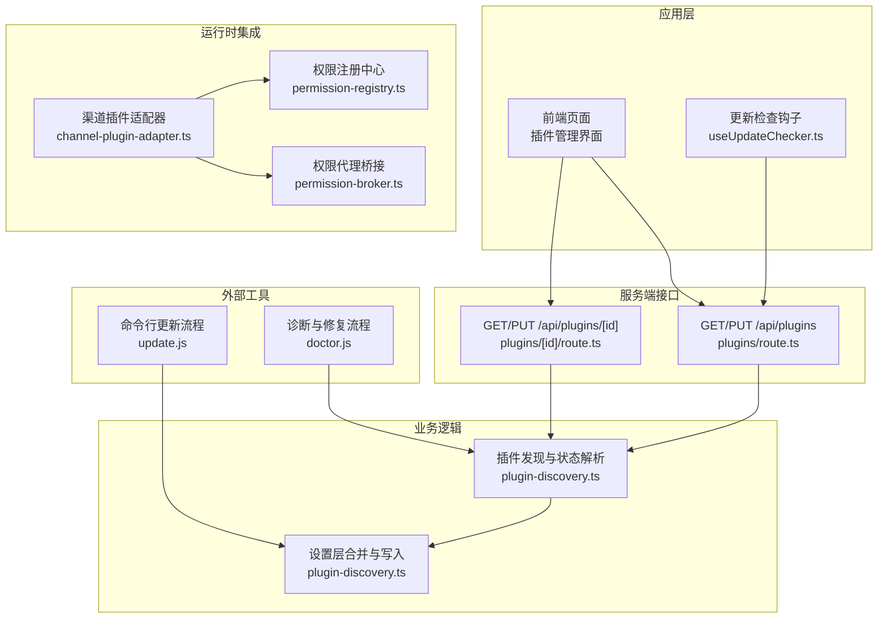
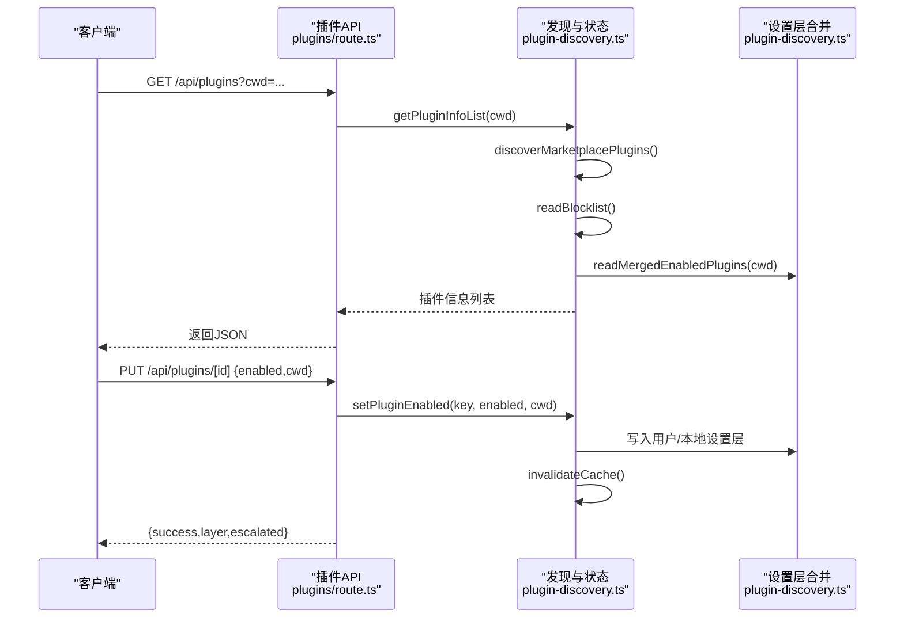
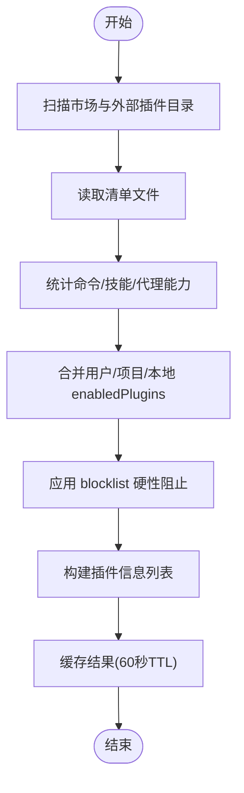
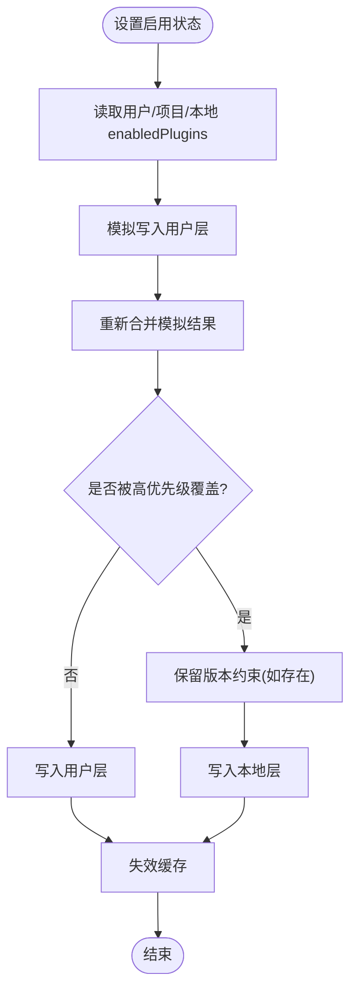
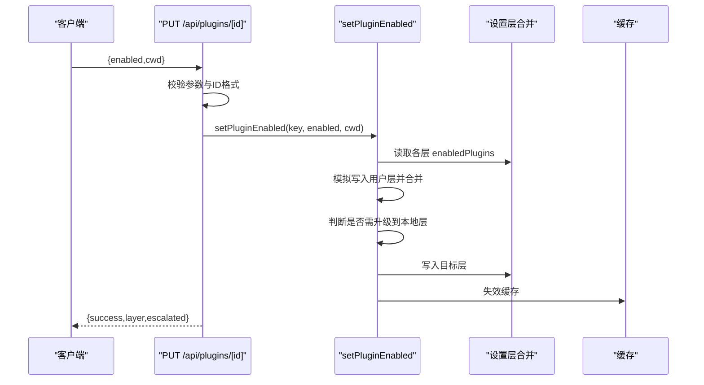
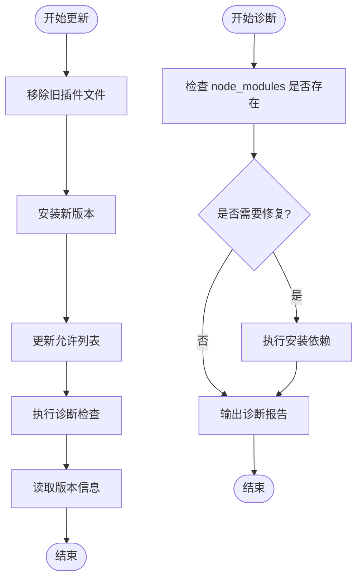
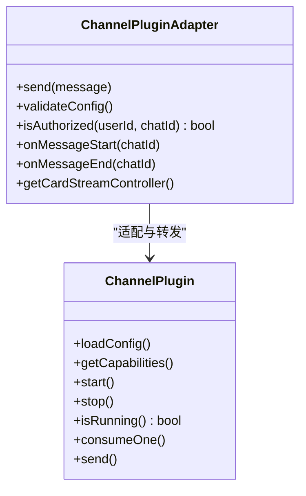
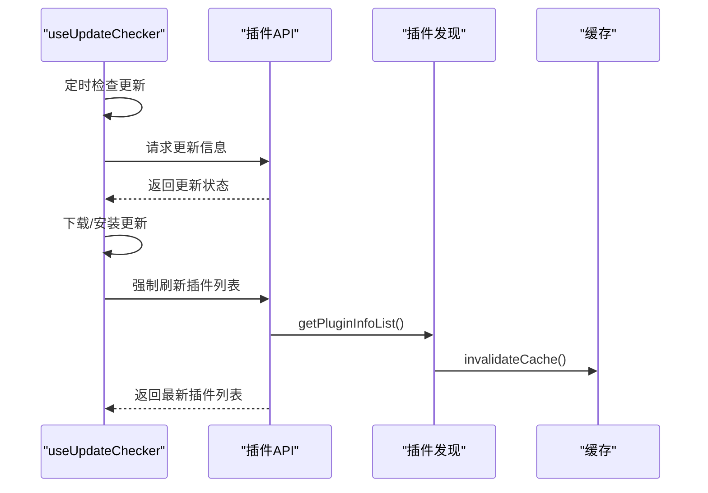
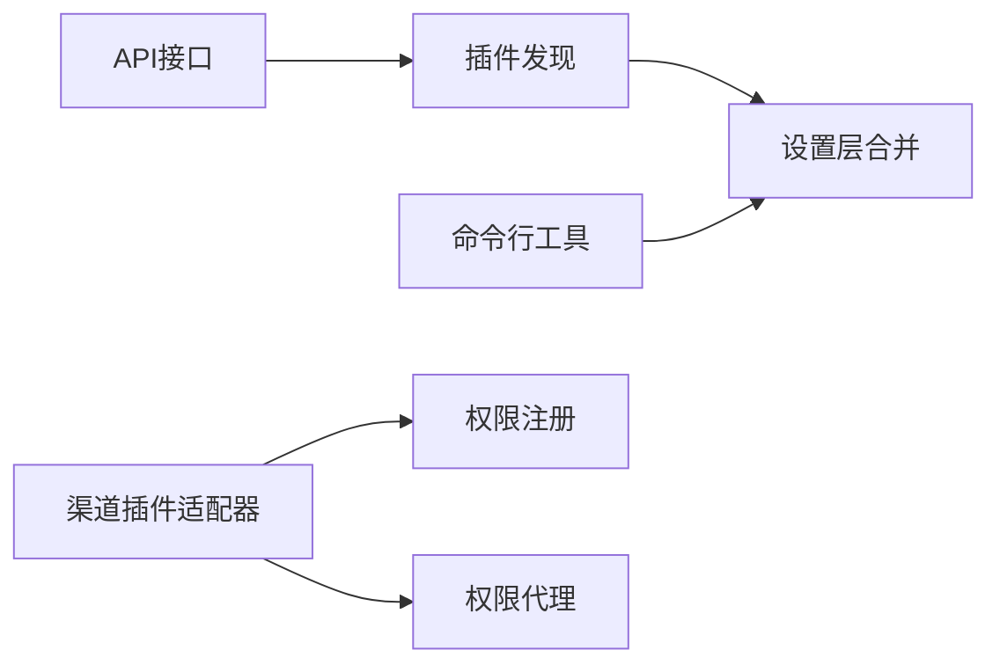

# 插件注册与管理

<cite>
**本文引用的文件**
- [plugin-discovery.ts](file://src/lib/plugin-discovery.ts)
- [plugins/route.ts](file://src/app/api/plugins/route.ts)
- [plugins/[id]/route.ts](file://src/app/api/plugins/[id]/route.ts)
- [types.ts](file://src/types/index.ts)
- [update.js](file://资料/package/dist/commands/update.js)
- [doctor.js](file://资料/package/dist/commands/doctor.js)
- [channel-plugin-adapter.ts](file://src/lib/channels/channel-plugin-adapter.ts)
- [types.ts](file://src/lib/channels/types.ts)
- [permission-registry.ts](file://src/lib/permission-registry.ts)
- [permission-broker.ts](file://src/lib/bridge/permission-broker.ts)
- [useUpdateChecker.ts](file://src/hooks/useUpdateChecker.ts)
</cite>

## 目录
1. [简介](#简介)
2. [项目结构](#项目结构)
3. [核心组件](#核心组件)
4. [架构总览](#架构总览)
5. [详细组件分析](#详细组件分析)
6. [依赖分析](#依赖分析)
7. [性能考虑](#性能考虑)
8. [故障排查指南](#故障排查指南)
9. [结论](#结论)
10. [附录](#附录)

## 简介
本文件系统化阐述插件在系统中的“发现、注册、配置、启用/禁用、卸载”全流程，覆盖生命周期管理、状态跟踪、依赖关系处理、分类体系、权限控制与安全验证、热重载与版本管理、兼容性检查、错误处理与回滚机制以及调试支持。文档以代码为依据，通过图示与分层讲解帮助读者快速理解并正确使用插件管理能力。

## 项目结构
围绕插件管理的关键目录与文件如下：
- 发现与配置：src/lib/plugin-discovery.ts
- API 接口：src/app/api/plugins/*
- 类型定义：src/types/index.ts
- 插件命令行工具（安装/更新/诊断）：资料/package/dist/commands/*
- 渠道插件适配器：src/lib/channels/channel-plugin-adapter.ts
- 权限与安全：src/lib/permission-registry.ts、src/lib/bridge/permission-broker.ts
- 版本与热重载：src/hooks/useUpdateChecker.ts

图表来源
- [plugins/route.ts:1-17](file://src/app/api/plugins/route.ts#L1-L17)
- [plugins/[id]/route.ts](file://src/app/api/plugins/[id]/route.ts#L1-L101)
- [plugin-discovery.ts:125-466](file://src/lib/plugin-discovery.ts#L125-L466)
- [update.js:58-119](file://资料/package/dist/commands/update.js#L58-L119)
- [doctor.js:57-78](file://资料/package/dist/commands/doctor.js#L57-L78)
- [channel-plugin-adapter.ts:51-73](file://src/lib/channels/channel-plugin-adapter.ts#L51-L73)
- [permission-registry.ts:34-71](file://src/lib/permission-registry.ts#L34-L71)
- [permission-broker.ts:360-395](file://src/lib/bridge/permission-broker.ts#L360-L395)
- [useUpdateChecker.ts:137-184](file://src/hooks/useUpdateChecker.ts#L137-L184)

章节来源
- [plugin-discovery.ts:125-466](file://src/lib/plugin-discovery.ts#L125-L466)
- [plugins/route.ts:1-17](file://src/app/api/plugins/route.ts#L1-L17)
- [plugins/[id]/route.ts](file://src/app/api/plugins/[id]/route.ts#L1-L101)

## 核心组件
- 插件发现与状态解析：负责扫描市场与外部插件目录、读取清单、合并启用状态、生成插件信息列表。
- 设置层合并与写入：按用户/项目/本地三层优先级合并 enabledPlugins，并智能决定写入层级，避免被更高优先级覆盖。
- API 层：提供插件列表查询与启用/禁用操作的 REST 接口。
- 命令行工具：封装安装、更新、卸载与诊断流程，确保配置一致性与环境修复。
- 渠道插件适配器：统一渠道插件接口，提供授权、配置校验、消息生命周期回调等能力。
- 权限与安全：权限注册与代理桥接，保障插件调用工具或资源时的安全控制。
- 版本与热重载：前端更新检查钩子，结合后端缓存失效实现热重载与版本提示。

章节来源
- [plugin-discovery.ts:125-466](file://src/lib/plugin-discovery.ts#L125-L466)
- [plugins/route.ts:1-17](file://src/app/api/plugins/route.ts#L1-L17)
- [plugins/[id]/route.ts](file://src/app/api/plugins/[id]/route.ts#L1-L101)
- [update.js:58-119](file://资料/package/dist/commands/update.js#L58-L119)
- [doctor.js:57-78](file://资料/package/dist/commands/doctor.js#L57-L78)
- [channel-plugin-adapter.ts:51-73](file://src/lib/channels/channel-plugin-adapter.ts#L51-L73)
- [permission-registry.ts:34-71](file://src/lib/permission-registry.ts#L34-L71)
- [permission-broker.ts:360-395](file://src/lib/bridge/permission-broker.ts#L360-L395)
- [useUpdateChecker.ts:137-184](file://src/hooks/useUpdateChecker.ts#L137-L184)

## 架构总览
插件管理由“发现—配置—启用—运行时集成—诊断修复—版本热重载”构成闭环。前端通过 API 获取插件列表与状态；后端基于设置层合并策略决定最终启用状态；命令行工具保证安装/更新/卸载过程的配置一致性与环境修复；运行时通过适配器与权限系统保障安全可控。

图表来源
- [plugins/route.ts:1-17](file://src/app/api/plugins/route.ts#L1-L17)
- [plugins/[id]/route.ts](file://src/app/api/plugins/[id]/route.ts#L49-L101)
- [plugin-discovery.ts:143-159](file://src/lib/plugin-discovery.ts#L143-L159)
- [plugin-discovery.ts:424-459](file://src/lib/plugin-discovery.ts#L424-L459)

## 详细组件分析

### 组件A：插件发现与状态解析
职责
- 扫描市场与外部插件目录，读取清单文件，统计命令/技能/代理能力标记。
- 合并 blocklist 与 enabledPlugins，计算最终启用状态。
- 提供缓存与失效机制，降低重复扫描成本。

关键数据结构
- 插件清单条目：包含名称、描述、作者、路径、市场、位置、能力标记等。
- enabledPlugins 映射：键为“name@marketplace”，值可为布尔或版本约束数组。
- blocklist：硬性阻止启用的插件集合。

算法与流程
- 发现流程：遍历 ~/.claude/plugins 下的市场与外部目录，读取清单，统计能力标记。
- 启用判定：blocklist 优先；否则按 enabledPlugins 解析；默认未启用。
- 缓存策略：60 秒 TTL，按工作目录缓存合并后的 enabledPlugins。

图表来源
- [plugin-discovery.ts:262-342](file://src/lib/plugin-discovery.ts#L262-L342)
- [plugin-discovery.ts:143-159](file://src/lib/plugin-discovery.ts#L143-L159)
- [plugin-discovery.ts:197-210](file://src/lib/plugin-discovery.ts#L197-L210)
- [plugin-discovery.ts:355-379](file://src/lib/plugin-discovery.ts#L355-L379)

章节来源
- [plugin-discovery.ts:262-342](file://src/lib/plugin-discovery.ts#L262-L342)
- [plugin-discovery.ts:143-159](file://src/lib/plugin-discovery.ts#L143-L159)
- [plugin-discovery.ts:197-210](file://src/lib/plugin-discovery.ts#L197-L210)
- [plugin-discovery.ts:355-379](file://src/lib/plugin-discovery.ts#L355-L379)

### 组件B：设置层合并与写入
职责
- 按用户/项目/本地三层优先级合并 enabledPlugins。
- 在写入前进行“模拟提升”判断，避免被更高优先级覆盖，必要时升级到本地层。
- 写入后使缓存失效，确保后续读取一致。

写入策略
- 默认写入用户层；若模拟写入后仍被高优先级覆盖，则写入本地层（最高优先级且忽略版本控制）。
- 启用时保留版本约束数组，仅当无任何约束时才写入布尔值。

图表来源
- [plugin-discovery.ts:424-459](file://src/lib/plugin-discovery.ts#L424-L459)
- [plugin-discovery.ts:389-401](file://src/lib/plugin-discovery.ts#L389-L401)

章节来源
- [plugin-discovery.ts:424-459](file://src/lib/plugin-discovery.ts#L424-L459)
- [plugin-discovery.ts:389-401](file://src/lib/plugin-discovery.ts#L389-L401)

### 组件C：API 接口（插件列表与启用/禁用）
职责
- GET /api/plugins：返回插件列表，支持 cwd 参数影响项目/本地设置层解析。
- PUT /api/plugins/[id]：启用/禁用指定插件，校验格式与状态，返回写入层级与是否升级。

安全与错误处理
- 对无效 ID、插件不存在、被 blocklist 阻止等情况返回相应状态码与错误信息。
- 启用时若被高优先级覆盖，返回 escalated 标识，便于前端提示。

图表来源
- [plugins/[id]/route.ts](file://src/app/api/plugins/[id]/route.ts#L49-L101)
- [plugin-discovery.ts:424-459](file://src/lib/plugin-discovery.ts#L424-L459)

章节来源
- [plugins/route.ts:1-17](file://src/app/api/plugins/route.ts#L1-L17)
- [plugins/[id]/route.ts](file://src/app/api/plugins/[id]/route.ts#L1-L101)
- [plugin-discovery.ts:424-459](file://src/lib/plugin-discovery.ts#L424-L459)

### 组件D：命令行工具（安装/更新/卸载/诊断）
职责
- 更新流程：移除旧文件、安装新版本、更新允许列表、执行诊断检查、输出版本信息。
- 诊断流程：检测缺失依赖、尝试自动修复（如安装依赖）、输出诊断报告。

图表来源
- [update.js:58-119](file://资料/package/dist/commands/update.js#L58-L119)
- [doctor.js:57-78](file://资料/package/dist/commands/doctor.js#L57-L78)

章节来源
- [update.js:58-119](file://资料/package/dist/commands/update.js#L58-L119)
- [doctor.js:57-78](file://资料/package/dist/commands/doctor.js#L57-L78)

### 组件E：运行时集成与权限控制
职责
- 渠道插件适配器：统一路由插件的消息发送、配置校验、授权检查与生命周期回调。
- 权限注册与代理：注册待决权限请求、超时自动拒绝、回调去重与原子化处理。

图表来源
- [channel-plugin-adapter.ts:51-73](file://src/lib/channels/channel-plugin-adapter.ts#L51-L73)
- [types.ts:86-109](file://src/lib/channels/types.ts#L86-L109)

章节来源
- [channel-plugin-adapter.ts:51-73](file://src/lib/channels/channel-plugin-adapter.ts#L51-L73)
- [types.ts:86-109](file://src/lib/channels/types.ts#L86-L109)
- [permission-registry.ts:34-71](file://src/lib/permission-registry.ts#L34-L71)
- [permission-broker.ts:360-395](file://src/lib/bridge/permission-broker.ts#L360-L395)

### 组件F：版本管理与热重载
职责
- 前端更新检查钩子：周期性检查更新、下载与安装、会话内屏蔽重复提示。
- 后端缓存失效：命令行更新后主动失效插件缓存，确保下次请求读取最新状态。

图表来源
- [useUpdateChecker.ts:137-184](file://src/hooks/useUpdateChecker.ts#L137-L184)
- [plugin-discovery.ts:464-466](file://src/lib/plugin-discovery.ts#L464-L466)
- [plugins/route.ts:1-17](file://src/app/api/plugins/route.ts#L1-L17)

章节来源
- [useUpdateChecker.ts:137-184](file://src/hooks/useUpdateChecker.ts#L137-L184)
- [plugin-discovery.ts:464-466](file://src/lib/plugin-discovery.ts#L464-L466)

## 依赖分析
- 组件耦合
  - API 层依赖插件发现模块；插件发现模块依赖设置层合并与缓存。
  - 命令行工具与设置层合并直接交互，确保安装/更新后配置一致。
  - 渠道插件适配器依赖权限注册与代理，保障运行时安全。
- 外部依赖
  - 文件系统：扫描插件目录、读取清单与设置文件。
  - 进程与系统命令：命令行工具通过系统命令安装依赖与执行安装。
- 循环依赖
  - 未见循环依赖迹象；模块间单向依赖清晰。

图表来源
- [plugins/route.ts:1-17](file://src/app/api/plugins/route.ts#L1-L17)
- [plugin-discovery.ts:143-159](file://src/lib/plugin-discovery.ts#L143-L159)
- [update.js:58-119](file://资料/package/dist/commands/update.js#L58-L119)
- [channel-plugin-adapter.ts:51-73](file://src/lib/channels/channel-plugin-adapter.ts#L51-L73)
- [permission-registry.ts:34-71](file://src/lib/permission-registry.ts#L34-L71)
- [permission-broker.ts:360-395](file://src/lib/bridge/permission-broker.ts#L360-L395)

章节来源
- [plugin-discovery.ts:143-159](file://src/lib/plugin-discovery.ts#L143-L159)
- [plugins/route.ts:1-17](file://src/app/api/plugins/route.ts#L1-L17)
- [update.js:58-119](file://资料/package/dist/commands/update.js#L58-L119)
- [channel-plugin-adapter.ts:51-73](file://src/lib/channels/channel-plugin-adapter.ts#L51-L73)
- [permission-registry.ts:34-71](file://src/lib/permission-registry.ts#L34-L71)
- [permission-broker.ts:360-395](file://src/lib/bridge/permission-broker.ts#L360-L395)

## 性能考虑
- 缓存策略：插件发现与合并结果按 60 秒 TTL 缓存，减少重复扫描与解析开销。
- 合并策略：三层设置层合并采用浅拷贝覆盖方式，时间复杂度 O(n)，空间 O(n)。
- 写入优化：通过“模拟提升”避免不必要的本地层写入，降低磁盘写入频率。
- 前端热重载：结合缓存失效与定时检查，确保状态变更及时反映。

## 故障排查指南
常见问题与定位
- 插件未出现在列表中
  - 检查插件目录是否存在清单文件与能力目录；确认未被 blocklist 阻止。
  - 参考：[plugin-discovery.ts:247-342](file://src/lib/plugin-discovery.ts#L247-L342)
- 启用失败或立即恢复原状
  - 检查是否存在更高优先级的设置覆盖；查看返回的 escalated 标识。
  - 参考：[plugin-discovery.ts:424-459](file://src/lib/plugin-discovery.ts#L424-L459)
- 更新后状态未生效
  - 确认命令行更新流程已执行并完成缓存失效；前端触发刷新。
  - 参考：[update.js:58-119](file://资料/package/dist/commands/update.js#L58-L119)、[plugin-discovery.ts:464-466](file://src/lib/plugin-discovery.ts#L464-L466)
- 运行时权限相关错误
  - 检查权限请求是否超时或被重复处理；核对回调数据格式。
  - 参考：[permission-registry.ts:34-71](file://src/lib/permission-registry.ts#L34-L71)、[permission-broker.ts:360-395](file://src/lib/bridge/permission-broker.ts#L360-L395)
- 诊断失败或依赖缺失
  - 使用 doctor 流程自动修复依赖；关注输出的修复建议。
  - 参考：[doctor.js:57-78](file://资料/package/dist/commands/doctor.js#L57-L78)

章节来源
- [plugin-discovery.ts:247-342](file://src/lib/plugin-discovery.ts#L247-L342)
- [plugin-discovery.ts:424-459](file://src/lib/plugin-discovery.ts#L424-L459)
- [update.js:58-119](file://资料/package/dist/commands/update.js#L58-L119)
- [doctor.js:57-78](file://资料/package/dist/commands/doctor.js#L57-L78)
- [permission-registry.ts:34-71](file://src/lib/permission-registry.ts#L34-L71)
- [permission-broker.ts:360-395](file://src/lib/bridge/permission-broker.ts#L360-L395)

## 结论
本系统通过“发现—配置—启用—运行时集成—诊断修复—版本热重载”的完整链路，实现了插件的全生命周期管理。设置层合并策略与缓存机制确保了性能与一致性；命令行工具与 API 接口提供了便捷的操作入口；权限与安全模块保障了运行时可控；前端更新检查钩子与后端缓存失效共同实现了热重载与版本管理。整体设计具备良好的扩展性与可维护性。

## 附录

### 插件分类系统
- 按来源分类
  - 市场插件：位于 ~/.claude/plugins/marketplaces/{mkt}/plugins/*/
  - 外部插件：位于 ~/.claude/plugins/external_plugins/*/
- 按能力分类
  - 命令：存在 commands 目录
  - 技能：存在 skills 目录
  - 代理：存在 agents 目录

章节来源
- [plugin-discovery.ts:262-342](file://src/lib/plugin-discovery.ts#L262-L342)

### 权限控制与安全验证机制
- 权限注册：注册待决请求，超时自动拒绝，支持数据库持久化。
- 权限代理：校验回调来源与去重，实现原子化处理与会话语义。
- 渠道插件适配器：统一授权与配置校验接口，贯穿消息生命周期。

章节来源
- [permission-registry.ts:34-71](file://src/lib/permission-registry.ts#L34-L71)
- [permission-broker.ts:360-395](file://src/lib/bridge/permission-broker.ts#L360-L395)
- [channel-plugin-adapter.ts:51-73](file://src/lib/channels/channel-plugin-adapter.ts#L51-L73)

### 热重载、版本管理与兼容性检查
- 热重载：前端更新检查钩子定期拉取更新信息，结合后端缓存失效实现状态刷新。
- 版本管理：命令行更新流程读取 package.json 输出版本信息。
- 兼容性检查：doctor 流程检测依赖缺失并提供修复建议。

章节来源
- [useUpdateChecker.ts:137-184](file://src/hooks/useUpdateChecker.ts#L137-L184)
- [update.js:96-118](file://资料/package/dist/commands/update.js#L96-L118)
- [doctor.js:57-78](file://资料/package/dist/commands/doctor.js#L57-L78)

### 错误处理、回滚机制与调试支持
- 错误处理：API 层对无效参数、未找到、被阻止等情况返回明确错误与状态码。
- 回滚机制：命令行更新流程在安装新版本后执行 doctor 检查，失败时可手动干预。
- 调试支持：doctor 支持读取日志片段与格式化输出，辅助定位问题。

章节来源
- [plugins/[id]/route.ts](file://src/app/api/plugins/[id]/route.ts#L49-L101)
- [update.js:58-119](file://资料/package/dist/commands/update.js#L58-L119)
- [doctor.js:57-78](file://资料/package/dist/commands/doctor.js#L57-L78)