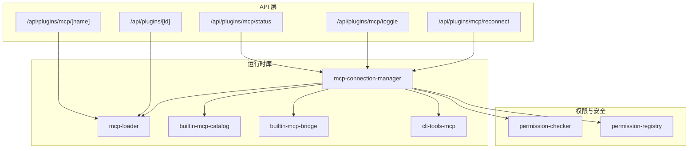
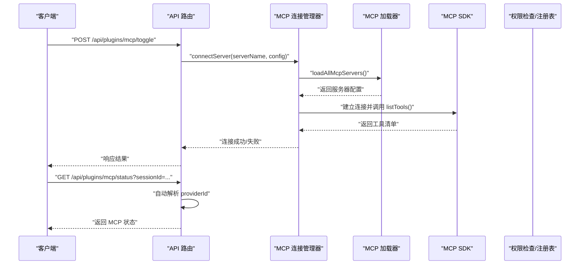
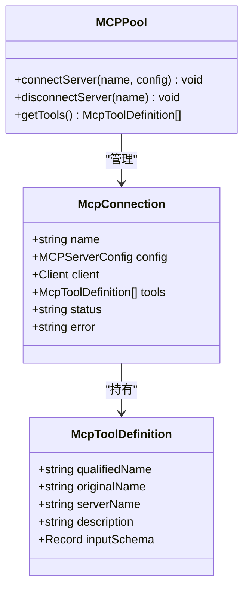
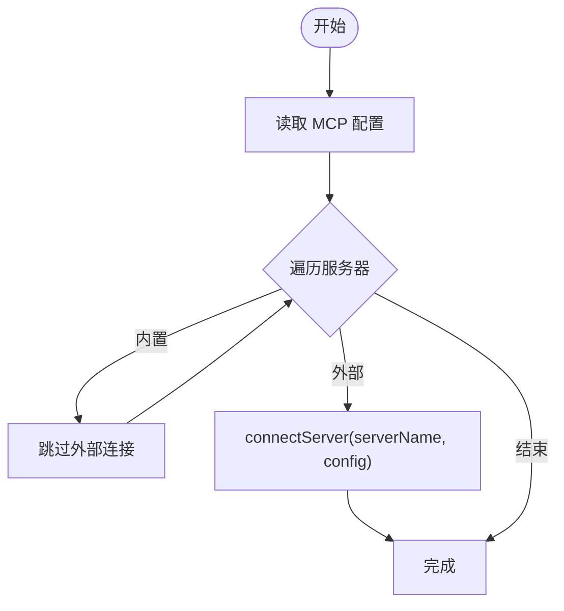
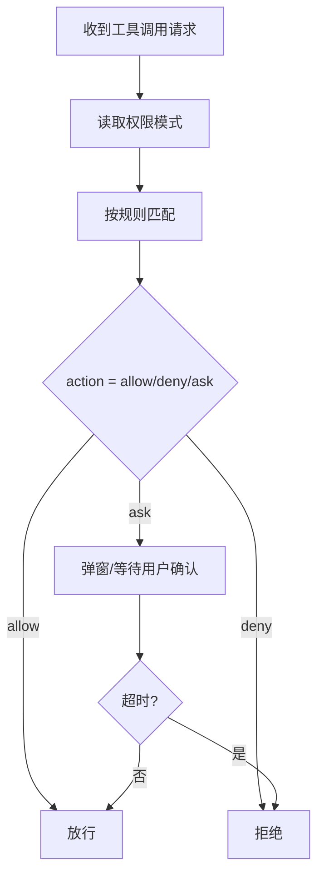
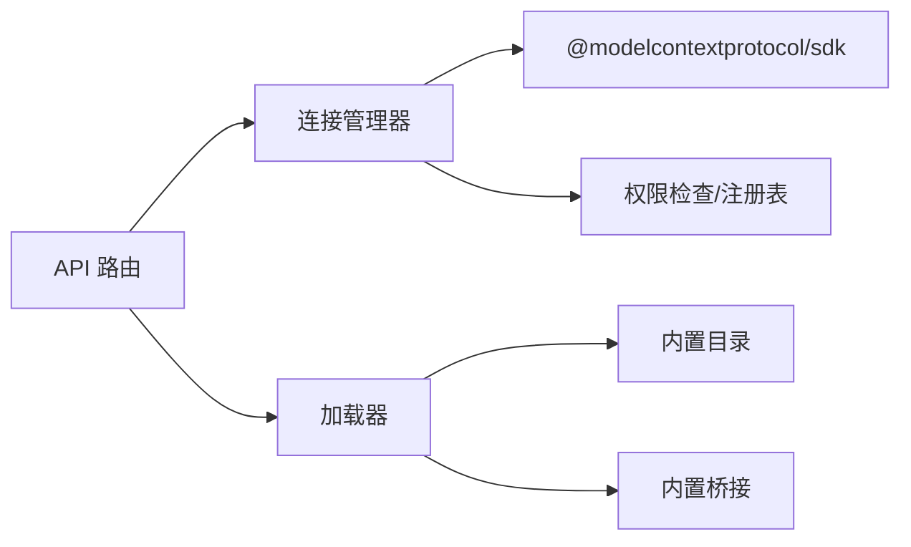

# 插件系统

<cite>
**本文引用的文件**
- [src/app/api/plugins/mcp/status/route.ts](file://src/app/api/plugins/mcp/status/route.ts)
- [src/app/api/plugins/mcp/toggle/route.ts](file://src/app/api/plugins/mcp/toggle/route.ts)
- [src/app/api/plugins/mcp/reconnect/route.ts](file://src/app/api/plugins/mcp/reconnect/route.ts)
- [src/app/api/plugins/mcp/[name]/route.ts](file://src/app/api/plugins/mcp/[name]/route.ts)
- [src/app/api/plugins/[id]/route.ts](file://src/app/api/plugins/[id]/route.ts)
- [src/lib/mcp-connection-manager.ts](file://src/lib/mcp-connection-manager.ts)
- [src/lib/mcp-loader.ts](file://src/lib/mcp-loader.ts)
- [src/lib/builtin-mcp-catalog.ts](file://src/lib/builtin-mcp-catalog.ts)
- [src/lib/builtin-mcp-bridge.ts](file://src/lib/builtin-mcp-bridge.ts)
- [src/lib/cli-tools-mcp.ts](file://src/lib/cli-tools-mcp.ts)
- [src/lib/plugin-discovery.ts](file://src/lib/plugin-discovery.ts)
- [src/lib/permission-checker.ts](file://src/lib/permission-checker.ts)
- [src/lib/permission-registry.ts](file://src/lib/permission-registry.ts)
- [src/app/plugins/mcp/page.tsx](file://src/app/plugins/mcp/page.tsx)
- [docs/guardrails/MCP.md](file://docs/guardrails/MCP.md)
- [docs/guardrails/PermissionBoundary.md](file://docs/guardrails/PermissionBoundary.md)
- [src/__tests__/unit/mcp-loader.test.ts](file://src/__tests__/unit/mcp-loader.test.ts)
- [src/__tests__/unit/codex-mcp-config.test.ts](file://src/__tests__/unit/codex-mcp-config.test.ts)
- [src/__tests__/unit/codex-mcp-injection.test.ts](file://src/__tests__/unit/codex-mcp-injection.test.ts)
- [资料/package/dist/commands/update.js](file://资料/package/dist/commands/update.js)
</cite>

## 目录
1. [引言](#引言)
2. [项目结构](#项目结构)
3. [核心组件](#核心组件)
4. [架构总览](#架构总览)
5. [详细组件分析](#详细组件分析)
6. [依赖关系分析](#依赖关系分析)
7. [性能考量](#性能考量)
8. [故障排查指南](#故障排查指南)
9. [结论](#结论)
10. [附录](#附录)

## 引言
本文件系统性阐述插件系统的实现，重点围绕 MCP（多模型协议）的发现、加载、连接、工具暴露与调用流程，以及与主应用的通信协议与数据交换格式。同时覆盖插件的启用/禁用、重连、状态查询、内置桥接、权限控制、用户确认流程、安全边界与资源限制等主题，并提供可操作的开发、安装与使用指引。

## 项目结构
插件系统主要分布在以下区域：
- API 层：提供插件与 MCP 的管理与状态查询接口，位于 src/app/api/plugins 与 src/app/api/plugins/mcp。
- 运行时库：负责 MCP 连接池、加载器、内置 MCP 桥接与 CLI 工具桥接，位于 src/lib。
- 权限与安全：权限检查、规则引擎与注册表，位于 src/lib/permission-*。
- 文档与测试：MCP 与权限边界文档，以及单元测试与集成测试，位于 docs 与 src/__tests__。

图表来源
- [src/app/api/plugins/mcp/status/route.ts:1-120](file://src/app/api/plugins/mcp/status/route.ts#L1-L120)
- [src/app/api/plugins/mcp/toggle/route.ts:1-34](file://src/app/api/plugins/mcp/toggle/route.ts#L1-L34)
- [src/app/api/plugins/mcp/reconnect/route.ts:1-35](file://src/app/api/plugins/mcp/reconnect/route.ts#L1-L35)
- [src/app/api/plugins/mcp/[name]/route.ts](file://src/app/api/plugins/mcp/[name]/route.ts#L1-L200)
- [src/app/api/plugins/[id]/route.ts](file://src/app/api/plugins/[id]/route.ts#L33-L101)
- [src/lib/mcp-connection-manager.ts:1-120](file://src/lib/mcp-connection-manager.ts#L1-L120)
- [src/lib/mcp-loader.ts:1-200](file://src/lib/mcp-loader.ts#L1-L200)
- [src/lib/builtin-mcp-catalog.ts:1-200](file://src/lib/builtin-mcp-catalog.ts#L1-L200)
- [src/lib/builtin-mcp-bridge.ts:1-200](file://src/lib/builtin-mcp-bridge.ts#L1-L200)
- [src/lib/cli-tools-mcp.ts:1-200](file://src/lib/cli-tools-mcp.ts#L1-L200)
- [src/lib/permission-checker.ts:1-120](file://src/lib/permission-checker.ts#L1-L120)
- [src/lib/permission-registry.ts:34-120](file://src/lib/permission-registry.ts#L34-L120)

章节来源
- [src/app/api/plugins/mcp/status/route.ts:1-120](file://src/app/api/plugins/mcp/status/route.ts#L1-L120)
- [src/app/api/plugins/mcp/toggle/route.ts:1-34](file://src/app/api/plugins/mcp/toggle/route.ts#L1-L34)
- [src/app/api/plugins/mcp/reconnect/route.ts:1-35](file://src/app/api/plugins/mcp/reconnect/route.ts#L1-L35)
- [src/app/api/plugins/mcp/[name]/route.ts](file://src/app/api/plugins/mcp/[name]/route.ts#L1-L200)
- [src/app/api/plugins/[id]/route.ts](file://src/app/api/plugins/[id]/route.ts#L33-L101)
- [src/lib/mcp-connection-manager.ts:1-120](file://src/lib/mcp-connection-manager.ts#L1-L120)
- [src/lib/mcp-loader.ts:1-200](file://src/lib/mcp-loader.ts#L1-L200)
- [src/lib/builtin-mcp-catalog.ts:1-200](file://src/lib/builtin-mcp-catalog.ts#L1-L200)
- [src/lib/builtin-mcp-bridge.ts:1-200](file://src/lib/builtin-mcp-bridge.ts#L1-L200)
- [src/lib/cli-tools-mcp.ts:1-200](file://src/lib/cli-tools-mcp.ts#L1-L200)
- [src/lib/permission-checker.ts:1-120](file://src/lib/permission-checker.ts#L1-L120)
- [src/lib/permission-registry.ts:34-120](file://src/lib/permission-registry.ts#L34-L120)

## 核心组件
- MCP 连接管理器：维护外部 MCP 服务器连接池，发现工具并通过统一入口暴露给运行时。
- MCP 加载器：负责从配置中发现并加载 MCP 服务器，支持内置与外部服务器。
- 内置 MCP 目录与桥接：内置工具通过目录与桥接模块直接注入运行时，无需外部进程。
- 权限检查与注册表：对工具调用进行模式化权限判定与用户确认流程。
- 插件发现与启用策略：合并多层配置，执行黑名单优先、启用列表次之的策略。

章节来源
- [src/lib/mcp-connection-manager.ts:1-120](file://src/lib/mcp-connection-manager.ts#L1-L120)
- [src/lib/mcp-loader.ts:1-200](file://src/lib/mcp-loader.ts#L1-L200)
- [src/lib/builtin-mcp-catalog.ts:1-200](file://src/lib/builtin-mcp-catalog.ts#L1-L200)
- [src/lib/builtin-mcp-bridge.ts:1-200](file://src/lib/builtin-mcp-bridge.ts#L1-L200)
- [src/lib/permission-checker.ts:1-120](file://src/lib/permission-checker.ts#L1-L120)
- [src/lib/permission-registry.ts:34-120](file://src/lib/permission-registry.ts#L34-L120)
- [src/lib/plugin-discovery.ts:197-246](file://src/lib/plugin-discovery.ts#L197-L246)

## 架构总览
下图展示了 MCP 插件系统在运行时的整体交互：API 层接收请求，路由调用连接管理器或加载器，连接管理器通过 MCP SDK 与外部服务器建立连接并发现工具；内置 MCP 通过目录与桥接模块直接注入；权限系统在工具调用前进行模式判定与用户确认。

图表来源
- [src/app/api/plugins/mcp/toggle/route.ts:13-34](file://src/app/api/plugins/mcp/toggle/route.ts#L13-L34)
- [src/app/api/plugins/mcp/status/route.ts:1-120](file://src/app/api/plugins/mcp/status/route.ts#L1-L120)
- [src/lib/mcp-connection-manager.ts:1-120](file://src/lib/mcp-connection-manager.ts#L1-L120)
- [src/lib/mcp-loader.ts:1-200](file://src/lib/mcp-loader.ts#L1-L200)

## 详细组件分析

### 组件一：MCP 连接管理器（连接池与工具暴露）
- 职责
  - 管理外部 MCP 服务器连接（stdio/sse/http），延迟加载 MCP SDK。
  - 通过 listTools 发现工具，生成带前缀的 qualifiedName 并缓存输入模式。
  - 维护连接状态（connected/connecting/failed/disabled）与错误信息。
- 数据结构
  - McpConnection：包含名称、配置、客户端实例、工具清单、状态与错误。
  - McpToolDefinition：工具的全限定名、原始名、所属服务器、描述与输入模式。
- 处理逻辑
  - 连接建立后调用 listTools 获取工具清单，供运行时统一调度。
  - 支持立即断开与延迟生效的重连策略（受 agent-loop 同步周期影响）。

图表来源
- [src/lib/mcp-connection-manager.ts:15-36](file://src/lib/mcp-connection-manager.ts#L15-L36)

章节来源
- [src/lib/mcp-connection-manager.ts:1-120](file://src/lib/mcp-connection-manager.ts#L1-L120)

### 组件二：MCP 加载器（发现与加载）
- 职责
  - 从持久化配置中加载所有 MCP 服务器，支持内置与外部服务器。
  - 提供预检与快速失败机制，避免对内置服务器执行无效的外部重连。
- 关键点
  - 与内置 MCP 名单配合，区分内置与外部服务器。
  - 与连接管理器协作，完成配置读取与连接建立。

图表来源
- [src/lib/mcp-loader.ts:1-200](file://src/lib/mcp-loader.ts#L1-L200)
- [src/app/api/plugins/mcp/reconnect/route.ts:17-35](file://src/app/api/plugins/mcp/reconnect/route.ts#L17-L35)

章节来源
- [src/lib/mcp-loader.ts:1-200](file://src/lib/mcp-loader.ts#L1-L200)
- [src/app/api/plugins/mcp/reconnect/route.ts:1-35](file://src/app/api/plugins/mcp/reconnect/route.ts#L1-L35)

### 组件三：内置 MCP 目录与桥接
- 职责
  - 内置 MCP 通过目录与桥接模块直接注入运行时，无需外部进程。
  - 与连接管理器协同，确保内置工具在运行时可用。
- 关系
  - 目录提供工具清单，桥接负责将工具注册到运行时。

章节来源
- [src/lib/builtin-mcp-catalog.ts:1-200](file://src/lib/builtin-mcp-catalog.ts#L1-L200)
- [src/lib/builtin-mcp-bridge.ts:1-200](file://src/lib/builtin-mcp-bridge.ts#L1-L200)

### 组件四：CLI 工具桥接（MCP 化）
- 职责
  - 将 CLI 工具通过 MCP 形式暴露，统一工具调用入口。
  - 与运行时集成，参与权限检查与工具发现流程。

章节来源
- [src/lib/cli-tools-mcp.ts:1-200](file://src/lib/cli-tools-mcp.ts#L1-L200)

### 组件五：权限检查与注册表（安全沙箱与权限控制）
- 权限模式
  - explore：只读，阻断写与危险命令。
  - normal：标准模式，自动允许读与编辑，bash 命令需确认。
  - trust：完全信任，自动允许一切。
- 规则引擎
  - OpenCode 风格规则数组，采用 findLast 语义，最后匹配规则优先。
  - 支持通配与输入模式匹配，危险命令（如 rm -rf、kill、格式化）在任何模式下均需确认。
- 注册表
  - 记录待决权限请求，超时自动拒绝，支持数据库持久化结果。

图表来源
- [src/lib/permission-checker.ts:1-120](file://src/lib/permission-checker.ts#L1-L120)
- [src/lib/permission-registry.ts:34-120](file://src/lib/permission-registry.ts#L34-L120)

章节来源
- [src/lib/permission-checker.ts:1-120](file://src/lib/permission-checker.ts#L1-L120)
- [src/lib/permission-registry.ts:34-120](file://src/lib/permission-registry.ts#L34-L120)
- [docs/guardrails/PermissionBoundary.md:21-49](file://docs/guardrails/PermissionBoundary.md#L21-L49)

### 组件六：插件发现与启用策略
- 黑名单优先：blocklist 硬性阻止。
- 合并启用：基于多层配置合并后的 enabledPlugins。
- 默认值：未启用即视为禁用。
- 版本约束：字符串数组形式的版本约束视作启用。

章节来源
- [src/lib/plugin-discovery.ts:197-246](file://src/lib/plugin-discovery.ts#L197-L246)

### 组件七：API 路由与状态查询
- /api/plugins/mcp/status
  - 自动从会话解析 providerId，避免前端重复传参。
  - 支持回退到 env provider。
- /api/plugins/mcp/toggle
  - 立即断开或在下一条消息时生效（受 syncMcpConnections 影响）。
- /api/plugins/mcp/reconnect
  - 对内置 MCP 明确拒绝“重连”操作，避免误导。
- /api/plugins/mcp/[name]
  - 提供 MCP 服务器的增删改查与工具清单。
- /api/plugins/[id]
  - 提供插件启用/禁用、分层配置与升级提示。

章节来源
- [src/app/api/plugins/mcp/status/route.ts:1-120](file://src/app/api/plugins/mcp/status/route.ts#L1-L120)
- [src/app/api/plugins/mcp/toggle/route.ts:13-34](file://src/app/api/plugins/mcp/toggle/route.ts#L13-L34)
- [src/app/api/plugins/mcp/reconnect/route.ts:17-35](file://src/app/api/plugins/mcp/reconnect/route.ts#L17-L35)
- [src/app/api/plugins/mcp/[name]/route.ts](file://src/app/api/plugins/mcp/[name]/route.ts#L1-L200)
- [src/app/api/plugins/[id]/route.ts](file://src/app/api/plugins/[id]/route.ts#L33-L101)
- [docs/guardrails/MCP.md:1-49](file://docs/guardrails/MCP.md#L1-L49)

### 组件八：UI 兼容与重定向
- 旧版 /plugins/mcp 路径重定向至统一 /plugins 页面的 MCP 标签页，保证历史链接可用。

章节来源
- [src/app/plugins/mcp/page.tsx:1-17](file://src/app/plugins/mcp/page.tsx#L1-L17)

## 依赖关系分析
- API 路由依赖连接管理器与加载器，后者依赖内置目录与桥接。
- 连接管理器依赖 MCP SDK，延迟加载以减少未使用场景的开销。
- 权限系统独立于 MCP，但在工具调用前介入，形成安全边界。
- 插件发现与启用策略贯穿配置层，影响工具可用性。

图表来源
- [src/app/api/plugins/mcp/toggle/route.ts:21-31](file://src/app/api/plugins/mcp/toggle/route.ts#L21-L31)
- [src/lib/mcp-connection-manager.ts:11-14](file://src/lib/mcp-connection-manager.ts#L11-L14)
- [src/lib/mcp-loader.ts:1-200](file://src/lib/mcp-loader.ts#L1-L200)
- [src/lib/builtin-mcp-catalog.ts:1-200](file://src/lib/builtin-mcp-catalog.ts#L1-L200)
- [src/lib/builtin-mcp-bridge.ts:1-200](file://src/lib/builtin-mcp-bridge.ts#L1-L200)
- [src/lib/permission-checker.ts:1-120](file://src/lib/permission-checker.ts#L1-L120)
- [src/lib/permission-registry.ts:34-120](file://src/lib/permission-registry.ts#L34-L120)

章节来源
- [src/app/api/plugins/mcp/toggle/route.ts:13-34](file://src/app/api/plugins/mcp/toggle/route.ts#L13-L34)
- [src/lib/mcp-connection-manager.ts:1-120](file://src/lib/mcp-connection-manager.ts#L1-L120)
- [src/lib/mcp-loader.ts:1-200](file://src/lib/mcp-loader.ts#L1-L200)
- [src/lib/builtin-mcp-catalog.ts:1-200](file://src/lib/builtin-mcp-catalog.ts#L1-L200)
- [src/lib/builtin-mcp-bridge.ts:1-200](file://src/lib/builtin-mcp-bridge.ts#L1-L200)
- [src/lib/permission-checker.ts:1-120](file://src/lib/permission-checker.ts#L1-L120)
- [src/lib/permission-registry.ts:34-120](file://src/lib/permission-registry.ts#L34-L120)

## 性能考量
- 延迟加载 MCP SDK：仅在需要时导入，降低冷启动成本。
- 连接池复用：避免频繁建立/销毁连接，提升工具调用吞吐。
- 规则匹配优化：规则数组采用 findLast，建议精简规则数量与复杂度。
- 重连策略：内置服务器不走外部重连路径，避免无效调用与错误传播。

## 故障排查指南
- 状态查询异常
  - 确认 sessionId 是否正确，providerId 解析是否按预期回退到 env。
  - 参考契约与常见坑，避免前端显式传 providerId 导致冲突。
- 切换/重连失败
  - 对内置服务器执行重连会返回明确错误，应改为检查内置工具是否正常加载。
  - 外部服务器连接失败时，查看连接管理器中的错误信息与状态。
- 权限请求超时
  - 检查权限注册表的超时时间与数据库持久化状态，必要时调整超时阈值。
- 插件启用/禁用无效
  - 核对插件发现策略：黑名单优先、启用列表次之，默认禁用。
  - 确认分层配置与升级提示，避免旧配置覆盖新设置。

章节来源
- [docs/guardrails/MCP.md:1-49](file://docs/guardrails/MCP.md#L1-L49)
- [src/app/api/plugins/mcp/reconnect/route.ts:25-34](file://src/app/api/plugins/mcp/reconnect/route.ts#L25-L34)
- [src/lib/permission-registry.ts:63-71](file://src/lib/permission-registry.ts#L63-L71)
- [src/lib/plugin-discovery.ts:234-241](file://src/lib/plugin-discovery.ts#L234-L241)

## 结论
该插件系统以 MCP 为核心，结合内置目录与桥接、连接池与加载器、权限检查与注册表，构建了可扩展、可审计且安全可控的工具生态。通过 API 路由与运行时解耦，既满足外部工具接入，又保障内置能力的稳定与高效。建议在生产环境中持续完善权限规则、监控连接状态与工具调用链路，并定期回归测试以确保契约一致性。

## 附录

### 开发与安装流程（示例步骤）
- 创建插件包
  - 使用插件模板初始化项目，定义插件元数据与入口。
  - 在插件内实现工具函数并导出工具清单。
- 安装与启用
  - 通过命令行安装插件包，更新配置并将其加入允许列表。
  - 在 UI 中查看插件状态，确认工具已出现在工具面板。
- 升级与卸载
  - 执行升级命令，系统会移除旧文件并安装新版本。
  - 卸载时从允许列表与配置中清理插件记录。

章节来源
- [资料/package/dist/commands/update.js:58-90](file://资料/package/dist/commands/update.js#L58-L90)

### 通信协议与数据交换格式（概念说明）
- 请求/响应
  - API 层以 JSON 作为请求体与响应体，遵循 REST 风格路径与方法。
- MCP 协议
  - 通过 MCP SDK 与外部服务器交互，使用 listTools 发现工具，调用时传递标准化输入模式。
- 权限与安全
  - 工具调用前进行权限判定，危险操作需用户确认；超时自动拒绝。

[本节为概念性说明，不直接分析具体源码文件]