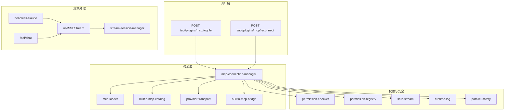
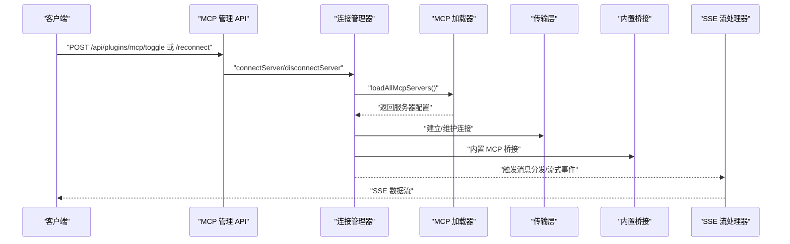
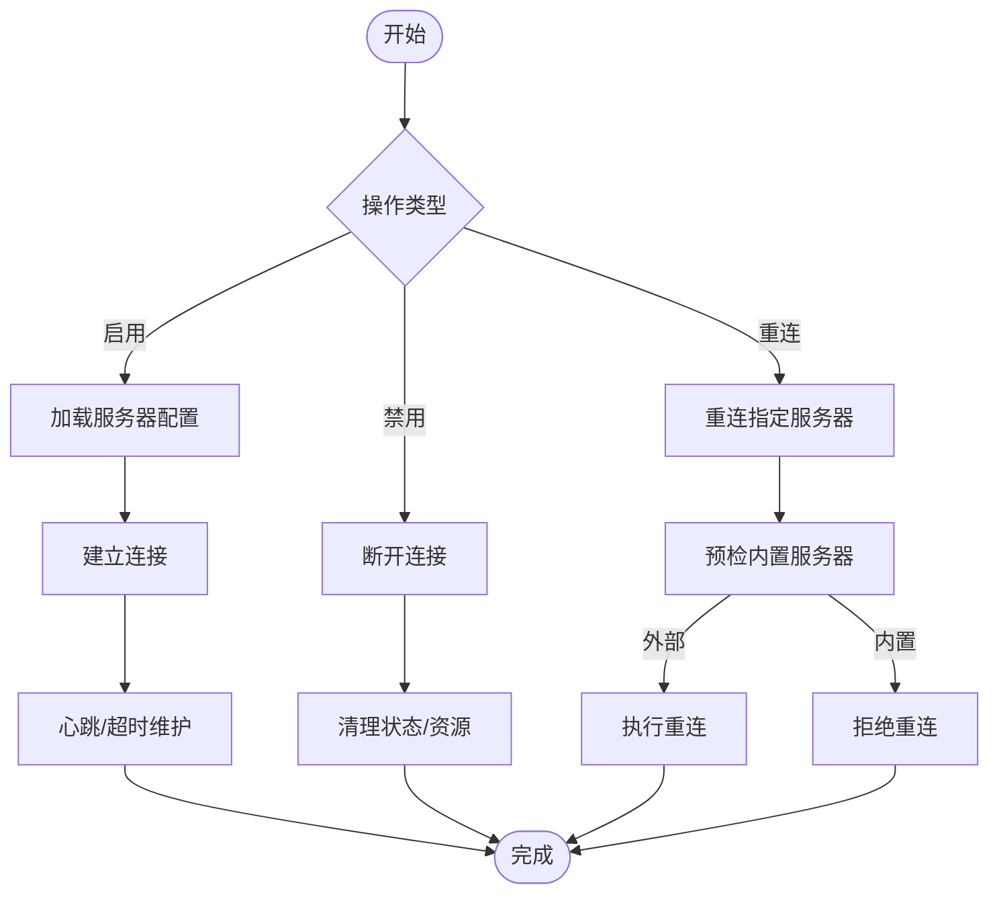
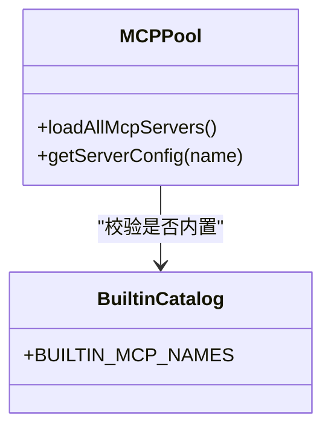
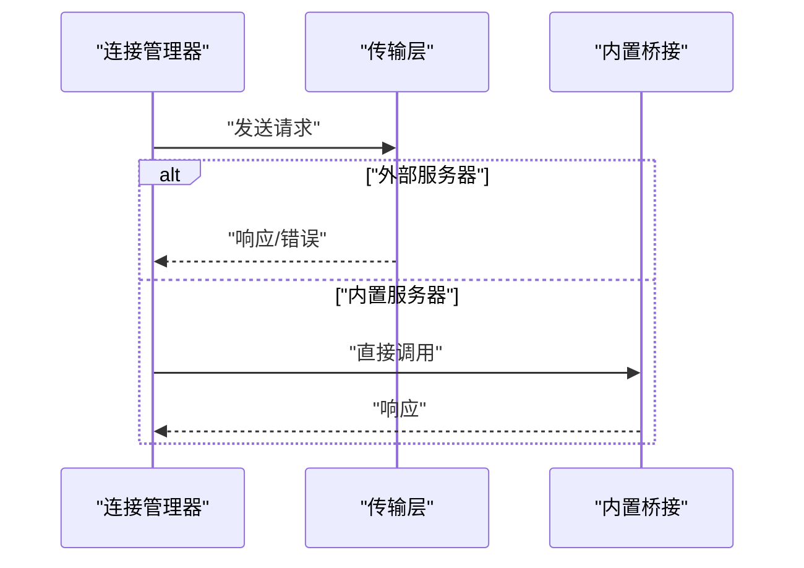
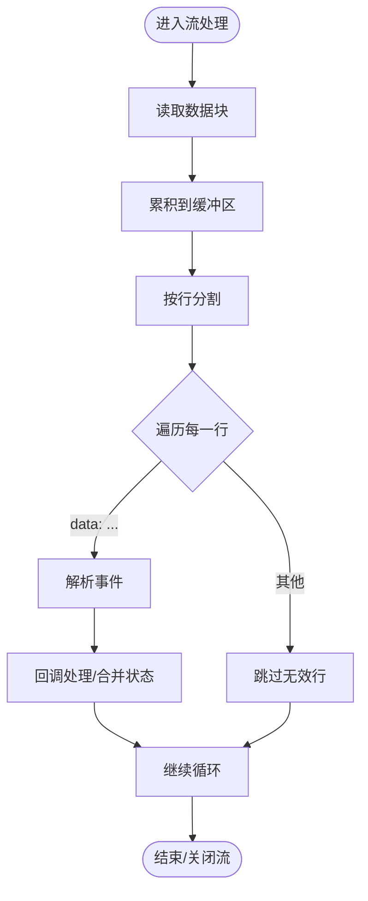
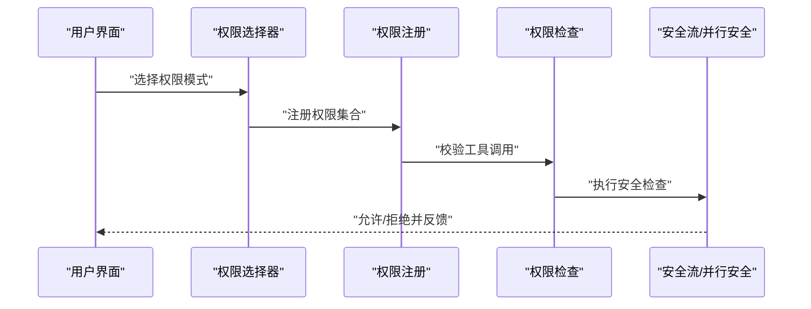
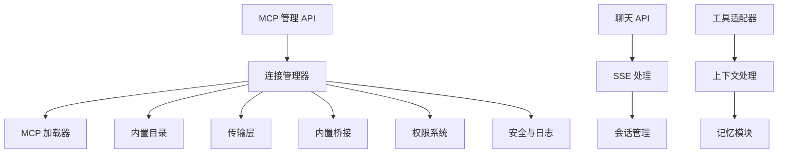

# 插件通信机制

<cite>
**本文引用的文件**
- [src/app/api/plugins/mcp/toggle/route.ts](file://src/app/api/plugins/mcp/toggle/route.ts)
- [src/app/api/plugins/mcp/reconnect/route.ts](file://src/app/api/plugins/mcp/reconnect/route.ts)
- [src/lib/mcp-connection-manager.ts](file://src/lib/mcp-connection-manager.ts)
- [src/lib/mcp-loader.ts](file://src/lib/mcp-loader.ts)
- [src/lib/builtin-mcp-catalog.ts](file://src/lib/builtin-mcp-catalog.ts)
- [src/lib/provider-transport.ts](file://src/lib/provider-transport.ts)
- [src/lib/permission-checker.ts](file://src/lib/permission-checker.ts)
- [src/lib/permission-registry.ts](file://src/lib/permission-registry.ts)
- [src/components/chat/ChatPermissionSelector.tsx](file://src/components/chat/ChatPermissionSelector.tsx)
- [src/hooks/useSSEStream.ts](file://src/hooks/useSSEStream.ts)
- [src/lib/stream-session-manager.ts](file://src/lib/stream-session-manager.ts)
- [src/lib/headless-claude.ts](file://src/lib/headless-claude.ts)
- [src/app/api/chat/route.ts](file://src/app/api/chat/route.ts)
- [src/lib/safe-stream.ts](file://src/lib/safe-stream.ts)
- [src/lib/sdk-subprocess-env.ts](file://src/lib/sdk-subprocess-env.ts)
- [src/lib/runtime-log.ts](file://src/lib/runtime-log.ts)
- [src/lib/heartbeat.ts](file://src/lib/heartbeat.ts)
- [src/lib/parallel-safety.ts](file://src/lib/parallel-safety.ts)
- [src/lib/lru-map.ts](file://src/lib/lru-map.ts)
- [src/lib/message-normalizer.ts](file://src/lib/message-normalizer.ts)
- [src/lib/model-context.ts](file://src/lib/model-context.ts)
- [src/lib/context-assembler.ts](file://src/lib/context-assembler.ts)
- [src/lib/context-compressor.ts](file://src/lib/context-compressor.ts)
- [src/lib/context-pruner.ts](file://src/lib/context-pruner.ts)
- [src/lib/context-estimator.ts](file://src/lib/context-estimator.ts)
- [src/lib/context-usage-walk.ts](file://src/lib/context-usage-walk.ts)
- [src/lib/memory-extractor.ts](file://src/lib/memory-extractor.ts)
- [src/lib/memory-search-mcp.ts](file://src/lib/memory-search-mcp.ts)
- [src/lib/dashboard-mcp.ts](file://src/lib/dashboard-mcp.ts)
- [src/lib/media-import-mcp.ts](file://src/lib/media-import-mcp.ts)
- [src/lib/notification-mcp.ts](file://src/lib/notification-mcp.ts)
- [src/lib/image-generator.ts](file://src/lib/image-generator.ts)
- [src/lib/image-gen-mcp.ts](file://src/lib/image-gen-mcp.ts)
- [src/lib/cli-tools-mcp.ts](file://src/lib/cli-tools-mcp.ts)
- [src/lib/plugin-discovery.ts](file://src/lib/plugin-discovery.ts)
- [src/lib/mcp-tool-adapter.ts](file://src/lib/mcp-tool-adapter.ts)
- [src/lib/builtin-mcp-bridge.ts](file://src/lib/builtin-mcp-bridge.ts)
- [src/lib/mcp-config.ts](file://src/lib/mcp-config.ts)
- [src/lib/mcp-events.ts](file://src/lib/mcp-events.ts)
- [src/lib/mcp-injection.ts](file://src/lib/mcp-injection.ts)
- [src/lib/mcp-memory-mcp-route.ts](file://src/lib/mcp-memory-mcp-route.ts)
- [src/lib/mcp-user-mcp-wiring.ts](file://src/lib/mcp-user-mcp-wiring.ts)
- [src/lib/mcp-proxy-sdk-fixture.ts](file://src/lib/mcp-proxy-sdk-fixture.ts)
- [src/lib/mcp-proxy-translators.ts](file://src/lib/mcp-proxy-translators.ts)
- [src/lib/mcp-proxy-tool-contract.ts](file://src/lib/mcp-proxy-tool-contract.ts)
- [src/lib/mcp-proxy-compiler-message-order.ts](file://src/lib/mcp-proxy-compiler-message-order.ts)
- [src/lib/mcp-proxy-error-visibility.ts](file://src/lib/mcp-proxy-error-visibility.ts)
- [src/lib/mcp-proxy-foundation.ts](file://src/lib/mcp-proxy-foundation.ts)
- [src/lib/mcp-proxy-headers.ts](file://src/lib/mcp-proxy-headers.ts)
- [src/lib/mcp-proxy-namespace-tool.ts](file://src/lib/mcp-proxy-namespace-tool.ts)
- [src/lib/mcp-proxy-parse-classification.ts](file://src/lib/mcp-proxy-parse-classification.ts)
- [src/lib/mcp-proxy-sdk-fixture.ts](file://src/lib/mcp-proxy-sdk-fixture.ts)
- [src/lib/mcp-proxy-virtual-providers.ts](file://src/lib/mcp-proxy-virtual-providers.ts)
- [src/lib/mcp-proxy-wire-injection.ts](file://src/lib/mcp-proxy-wire-injection.ts)
- [src/lib/mcp-proxy-compiler-message-order.ts](file://src/lib/mcp-proxy-compiler-message-order.ts)
- [src/lib/mcp-proxy-error-visibility.ts](file://src/lib/mcp-proxy-error-visibility.ts)
- [src/lib/mcp-proxy-foundation.ts](file://src/lib/mcp-proxy-foundation.ts)
- [src/lib/mcp-proxy-headers.ts](file://src/lib/mcp-proxy-headers.ts)
- [src/lib/mcp-proxy-namespace-tool.ts](file://src/lib/mcp-proxy-namespace-tool.ts)
- [src/lib/mcp-proxy-parse-classification.ts](file://src/lib/mcp-proxy-parse-classification.ts)
- [src/lib/mcp-proxy-sdk-fixture.ts](file://src/lib/mcp-proxy-sdk-fixture.ts)
- [src/lib/mcp-proxy-virtual-providers.ts](file://src/lib/mcp-proxy-virtual-providers.ts)
- [src/lib/mcp-proxy-wire-injection.ts](file://src/lib/mcp-proxy-wire-injection.ts)
</cite>

## 目录
1. [引言](#引言)
2. [项目结构](#项目结构)
3. [核心组件](#核心组件)
4. [架构总览](#架构总览)
5. [详细组件分析](#详细组件分析)
6. [依赖关系分析](#依赖关系分析)
7. [性能考虑](#性能考虑)
8. [故障排查指南](#故障排查指南)
9. [结论](#结论)
10. [附录](#附录)

## 引言
本文件系统性阐述 CodePilot 中的插件通信机制，重点围绕 MCP（Model Context Protocol）连接的建立、维护与断开，消息传递与数据交换格式，以及消息队列、缓冲区管理与流量控制策略。同时覆盖安全加密、身份验证与权限控制，并提供可操作的性能优化建议与故障诊断方法。文档以实际源码为依据，辅以图示帮助不同技术背景的读者理解。

## 项目结构
插件通信相关代码主要分布在以下区域：
- API 层：提供 MCP 启用/禁用与重连的 HTTP 接口
- 核心库：MCP 连接管理、加载器、内置 MCP 目录、代理桥接等
- 流式处理：SSE 流解析、会话管理、心跳与超时控制
- 权限与安全：权限检查、注册表、运行时日志与并行安全
- 工具适配：MCP 工具适配器、媒体导入、通知、图像生成等

**图表来源**
- [src/app/api/plugins/mcp/toggle/route.ts:1-35](file://src/app/api/plugins/mcp/toggle/route.ts#L1-L35)
- [src/app/api/plugins/mcp/reconnect/route.ts:1-35](file://src/app/api/plugins/mcp/reconnect/route.ts#L1-L35)
- [src/lib/mcp-connection-manager.ts](file://src/lib/mcp-connection-manager.ts)
- [src/lib/mcp-loader.ts](file://src/lib/mcp-loader.ts)
- [src/lib/builtin-mcp-catalog.ts](file://src/lib/builtin-mcp-catalog.ts)
- [src/lib/provider-transport.ts](file://src/lib/provider-transport.ts)
- [src/lib/builtin-mcp-bridge.ts](file://src/lib/builtin-mcp-bridge.ts)
- [src/hooks/useSSEStream.ts:418-468](file://src/hooks/useSSEStream.ts#L418-L468)
- [src/lib/stream-session-manager.ts:953-1115](file://src/lib/stream-session-manager.ts#L953-L1115)
- [src/lib/headless-claude.ts:240-272](file://src/lib/headless-claude.ts#L240-L272)
- [src/app/api/chat/route.ts:726-766](file://src/app/api/chat/route.ts#L726-L766)
- [src/lib/permission-checker.ts](file://src/lib/permission-checker.ts)
- [src/lib/permission-registry.ts](file://src/lib/permission-registry.ts)
- [src/lib/safe-stream.ts](file://src/lib/safe-stream.ts)
- [src/lib/runtime-log.ts](file://src/lib/runtime-log.ts)
- [src/lib/parallel-safety.ts](file://src/lib/parallel-safety.ts)

**章节来源**
- [src/app/api/plugins/mcp/toggle/route.ts:1-35](file://src/app/api/plugins/mcp/toggle/route.ts#L1-L35)
- [src/app/api/plugins/mcp/reconnect/route.ts:1-35](file://src/app/api/plugins/mcp/reconnect/route.ts#L1-L35)

## 核心组件
- MCP 连接管理器：负责 MCP 服务器的连接、断开、重连与状态同步；支持立即断开与下一次消息生效的延迟重连策略。
- MCP 加载器：从配置中加载所有 MCP 服务器，提供按名称检索与校验能力。
- 内置 MCP 目录：标识内置 MCP 名称集合，避免对内置服务器执行外部重连。
- Provider Transport：封装传输层抽象，统一处理请求/响应与错误传播。
- 流式会话管理：提供 SSE 流订阅、快照更新、强制中断与清理机制。
- 权限检查与注册：在工具调用前进行权限校验与注册，确保最小授权与安全边界。
- 安全与并行：通过安全流、运行时日志与并行安全模块，降低并发风险与泄露可能。

**章节来源**
- [src/lib/mcp-connection-manager.ts](file://src/lib/mcp-connection-manager.ts)
- [src/lib/mcp-loader.ts](file://src/lib/mcp-loader.ts)
- [src/lib/builtin-mcp-catalog.ts](file://src/lib/builtin-mcp-catalog.ts)
- [src/lib/provider-transport.ts](file://src/lib/provider-transport.ts)
- [src/lib/stream-session-manager.ts:953-1115](file://src/lib/stream-session-manager.ts#L953-L1115)
- [src/lib/permission-checker.ts](file://src/lib/permission-checker.ts)
- [src/lib/permission-registry.ts](file://src/lib/permission-registry.ts)
- [src/lib/safe-stream.ts](file://src/lib/safe-stream.ts)
- [src/lib/parallel-safety.ts](file://src/lib/parallel-safety.ts)

## 架构总览
下图展示了 MCP 通信从 API 触发到连接管理器、加载器与传输层的整体交互路径，以及与流式处理和权限系统的协作关系。

**图表来源**
- [src/app/api/plugins/mcp/toggle/route.ts:13-34](file://src/app/api/plugins/mcp/toggle/route.ts#L13-L34)
- [src/app/api/plugins/mcp/reconnect/route.ts:17-35](file://src/app/api/plugins/mcp/reconnect/route.ts#L17-L35)
- [src/lib/mcp-connection-manager.ts](file://src/lib/mcp-connection-manager.ts)
- [src/lib/mcp-loader.ts](file://src/lib/mcp-loader.ts)
- [src/lib/provider-transport.ts](file://src/lib/provider-transport.ts)
- [src/lib/builtin-mcp-bridge.ts](file://src/lib/builtin-mcp-bridge.ts)
- [src/hooks/useSSEStream.ts:418-468](file://src/hooks/useSSEStream.ts#L418-L468)

## 详细组件分析

### MCP 连接管理器（建立/维护/断开）
- 建立连接：根据服务器名称与配置，调用底层传输层建立连接；支持立即断开与延迟重连（下一次消息生效）。
- 维护连接：在代理桥接与消息注入阶段，保持连接稳定；结合心跳与超时策略维持长连接健康。
- 断开连接：提供显式断开接口，确保资源释放与状态清理。

**图表来源**
- [src/app/api/plugins/mcp/toggle/route.ts:13-34](file://src/app/api/plugins/mcp/toggle/route.ts#L13-L34)
- [src/app/api/plugins/mcp/reconnect/route.ts:17-35](file://src/app/api/plugins/mcp/reconnect/route.ts#L17-L35)
- [src/lib/mcp-connection-manager.ts](file://src/lib/mcp-connection-manager.ts)
- [src/lib/mcp-loader.ts](file://src/lib/mcp-loader.ts)
- [src/lib/builtin-mcp-catalog.ts](file://src/lib/builtin-mcp-catalog.ts)

**章节来源**
- [src/app/api/plugins/mcp/toggle/route.ts:13-34](file://src/app/api/plugins/mcp/toggle/route.ts#L13-L34)
- [src/app/api/plugins/mcp/reconnect/route.ts:17-35](file://src/app/api/plugins/mcp/reconnect/route.ts#L17-L35)
- [src/lib/mcp-connection-manager.ts](file://src/lib/mcp-connection-manager.ts)

### MCP 加载器与内置目录
- 加载器：扫描并加载所有 MCP 服务器配置，提供按名称检索与有效性校验。
- 内置目录：维护内置 MCP 名称集合，用于区分内置与外部服务器，避免对内置服务器执行外部重连。

**图表来源**
- [src/lib/mcp-loader.ts](file://src/lib/mcp-loader.ts)
- [src/lib/builtin-mcp-catalog.ts](file://src/lib/builtin-mcp-catalog.ts)

**章节来源**
- [src/lib/mcp-loader.ts](file://src/lib/mcp-loader.ts)
- [src/lib/builtin-mcp-catalog.ts](file://src/lib/builtin-mcp-catalog.ts)

### 传输层与内置桥接
- 传输层：封装请求/响应与错误传播，统一处理连接状态与异常。
- 内置桥接：针对内置 MCP 提供进程内桥接，无需外部连接。

**图表来源**
- [src/lib/provider-transport.ts](file://src/lib/provider-transport.ts)
- [src/lib/builtin-mcp-bridge.ts](file://src/lib/builtin-mcp-bridge.ts)

**章节来源**
- [src/lib/provider-transport.ts](file://src/lib/provider-transport.ts)
- [src/lib/builtin-mcp-bridge.ts](file://src/lib/builtin-mcp-bridge.ts)

### 流式消息与缓冲区管理
- SSE 流解析：逐行解析 data: 行，累积缓冲区，处理部分帧与边界情况。
- 会话管理：提供订阅、快照更新、强制中断与清理，保障会话生命周期可控。
- 心跳与超时：在长轮询或流式场景中，结合心跳与超时策略防止挂起。

**图表来源**
- [src/hooks/useSSEStream.ts:418-468](file://src/hooks/useSSEStream.ts#L418-L468)
- [src/lib/stream-session-manager.ts:953-1115](file://src/lib/stream-session-manager.ts#L953-L1115)
- [src/lib/headless-claude.ts:240-272](file://src/lib/headless-claude.ts#L240-L272)
- [src/app/api/chat/route.ts:726-766](file://src/app/api/chat/route.ts#L726-L766)

**章节来源**
- [src/hooks/useSSEStream.ts:418-468](file://src/hooks/useSSEStream.ts#L418-L468)
- [src/lib/stream-session-manager.ts:953-1115](file://src/lib/stream-session-manager.ts#L953-L1115)
- [src/lib/headless-claude.ts:240-272](file://src/lib/headless-claude.ts#L240-L272)
- [src/app/api/chat/route.ts:726-766](file://src/app/api/chat/route.ts#L726-L766)

### 权限控制与安全
- 权限检查：在工具调用前进行权限校验，确保仅授予必要权限。
- 权限注册：集中管理权限集合，支持默认与全量访问模式切换。
- 安全流与并行安全：通过安全流与并行安全模块，降低并发风险与信息泄露可能。
- 运行时日志：记录关键事件与错误，便于审计与排障。

**图表来源**
- [src/components/chat/ChatPermissionSelector.tsx:104-154](file://src/components/chat/ChatPermissionSelector.tsx#L104-L154)
- [src/lib/permission-checker.ts](file://src/lib/permission-checker.ts)
- [src/lib/permission-registry.ts](file://src/lib/permission-registry.ts)
- [src/lib/safe-stream.ts](file://src/lib/safe-stream.ts)
- [src/lib/parallel-safety.ts](file://src/lib/parallel-safety.ts)
- [src/lib/runtime-log.ts](file://src/lib/runtime-log.ts)

**章节来源**
- [src/components/chat/ChatPermissionSelector.tsx:104-154](file://src/components/chat/ChatPermissionSelector.tsx#L104-L154)
- [src/lib/permission-checker.ts](file://src/lib/permission-checker.ts)
- [src/lib/permission-registry.ts](file://src/lib/permission-registry.ts)
- [src/lib/safe-stream.ts](file://src/lib/safe-stream.ts)
- [src/lib/parallel-safety.ts](file://src/lib/parallel-safety.ts)
- [src/lib/runtime-log.ts](file://src/lib/runtime-log.ts)

### 工具适配与上下文处理
- MCP 工具适配器：将通用工具调用映射到 MCP 协议，保证跨插件一致性。
- 上下文处理：包括上下文组装、压缩、修剪与用量估算，确保消息体积与质量平衡。
- 记忆提取与搜索：支持从记忆库中抽取与检索相关信息，增强对话上下文。

**图表来源**
- [src/lib/mcp-tool-adapter.ts](file://src/lib/mcp-tool-adapter.ts)
- [src/lib/context-assembler.ts](file://src/lib/context-assembler.ts)
- [src/lib/context-compressor.ts](file://src/lib/context-compressor.ts)
- [src/lib/context-pruner.ts](file://src/lib/context-pruner.ts)
- [src/lib/context-estimator.ts](file://src/lib/context-estimator.ts)
- [src/lib/context-usage-walk.ts](file://src/lib/context-usage-walk.ts)
- [src/lib/memory-extractor.ts](file://src/lib/memory-extractor.ts)
- [src/lib/memory-search-mcp.ts](file://src/lib/memory-search-mcp.ts)

**章节来源**
- [src/lib/mcp-tool-adapter.ts](file://src/lib/mcp-tool-adapter.ts)
- [src/lib/context-assembler.ts](file://src/lib/context-assembler.ts)
- [src/lib/context-compressor.ts](file://src/lib/context-compressor.ts)
- [src/lib/context-pruner.ts](file://src/lib/context-pruner.ts)
- [src/lib/context-estimator.ts](file://src/lib/context-estimator.ts)
- [src/lib/context-usage-walk.ts](file://src/lib/context-usage-walk.ts)
- [src/lib/memory-extractor.ts](file://src/lib/memory-extractor.ts)
- [src/lib/memory-search-mcp.ts](file://src/lib/memory-search-mcp.ts)

## 依赖关系分析
- API 层依赖连接管理器；连接管理器依赖加载器、内置目录、传输层与内置桥接。
- 流式处理依赖 SSE 钩子与会话管理器；会话管理器与聊天 API 共享流式基础设施。
- 权限系统贯穿工具调用链，与安全流、并行安全与运行时日志协同工作。
- 工具适配器与上下文处理模块相互依赖，形成完整的 MCP 工具生态。

**图表来源**
- [src/app/api/plugins/mcp/toggle/route.ts:13-34](file://src/app/api/plugins/mcp/toggle/route.ts#L13-L34)
- [src/app/api/plugins/mcp/reconnect/route.ts:17-35](file://src/app/api/plugins/mcp/reconnect/route.ts#L17-L35)
- [src/lib/mcp-connection-manager.ts](file://src/lib/mcp-connection-manager.ts)
- [src/lib/mcp-loader.ts](file://src/lib/mcp-loader.ts)
- [src/lib/builtin-mcp-catalog.ts](file://src/lib/builtin-mcp-catalog.ts)
- [src/lib/provider-transport.ts](file://src/lib/provider-transport.ts)
- [src/lib/builtin-mcp-bridge.ts](file://src/lib/builtin-mcp-bridge.ts)
- [src/lib/permission-checker.ts](file://src/lib/permission-checker.ts)
- [src/lib/permission-registry.ts](file://src/lib/permission-registry.ts)
- [src/lib/safe-stream.ts](file://src/lib/safe-stream.ts)
- [src/lib/runtime-log.ts](file://src/lib/runtime-log.ts)
- [src/lib/parallel-safety.ts](file://src/lib/parallel-safety.ts)
- [src/hooks/useSSEStream.ts:418-468](file://src/hooks/useSSEStream.ts#L418-L468)
- [src/lib/stream-session-manager.ts:953-1115](file://src/lib/stream-session-manager.ts#L953-L1115)
- [src/app/api/chat/route.ts:726-766](file://src/app/api/chat/route.ts#L726-L766)
- [src/lib/mcp-tool-adapter.ts](file://src/lib/mcp-tool-adapter.ts)
- [src/lib/context-assembler.ts](file://src/lib/context-assembler.ts)
- [src/lib/context-compressor.ts](file://src/lib/context-compressor.ts)
- [src/lib/context-pruner.ts](file://src/lib/context-pruner.ts)
- [src/lib/context-estimator.ts](file://src/lib/context-estimator.ts)
- [src/lib/context-usage-walk.ts](file://src/lib/context-usage-walk.ts)
- [src/lib/memory-extractor.ts](file://src/lib/memory-extractor.ts)
- [src/lib/memory-search-mcp.ts](file://src/lib/memory-search-mcp.ts)

**章节来源**
- [src/lib/mcp-connection-manager.ts](file://src/lib/mcp-connection-manager.ts)
- [src/lib/mcp-loader.ts](file://src/lib/mcp-loader.ts)
- [src/lib/builtin-mcp-catalog.ts](file://src/lib/builtin-mcp-catalog.ts)
- [src/lib/provider-transport.ts](file://src/lib/provider-transport.ts)
- [src/lib/builtin-mcp-bridge.ts](file://src/lib/builtin-mcp-bridge.ts)
- [src/lib/permission-checker.ts](file://src/lib/permission-checker.ts)
- [src/lib/permission-registry.ts](file://src/lib/permission-registry.ts)
- [src/lib/safe-stream.ts](file://src/lib/safe-stream.ts)
- [src/lib/runtime-log.ts](file://src/lib/runtime-log.ts)
- [src/lib/parallel-safety.ts](file://src/lib/parallel-safety.ts)
- [src/hooks/useSSEStream.ts:418-468](file://src/hooks/useSSEStream.ts#L418-L468)
- [src/lib/stream-session-manager.ts:953-1115](file://src/lib/stream-session-manager.ts#L953-L1115)
- [src/app/api/chat/route.ts:726-766](file://src/app/api/chat/route.ts#L726-L766)
- [src/lib/mcp-tool-adapter.ts](file://src/lib/mcp-tool-adapter.ts)
- [src/lib/context-assembler.ts](file://src/lib/context-assembler.ts)
- [src/lib/context-compressor.ts](file://src/lib/context-compressor.ts)
- [src/lib/context-pruner.ts](file://src/lib/context-pruner.ts)
- [src/lib/context-estimator.ts](file://src/lib/context-estimator.ts)
- [src/lib/context-usage-walk.ts](file://src/lib/context-usage-walk.ts)
- [src/lib/memory-extractor.ts](file://src/lib/memory-extractor.ts)
- [src/lib/memory-search-mcp.ts](file://src/lib/memory-search-mcp.ts)

## 性能考虑
- 流式处理优化：采用增量解析与缓冲区复用，减少内存峰值与 GC 压力。
- 会话生命周期：通过快照与清理机制，避免悬挂会话占用资源。
- 并发与超时：结合心跳与超时策略，防止单个连接阻塞整体吞吐。
- 上下文压缩：在保证语义完整性前提下压缩上下文，降低传输与处理成本。
- 缓存与 LRU：利用 LRU 结构缓存热点数据，提升重复查询效率。

**章节来源**
- [src/hooks/useSSEStream.ts:418-468](file://src/hooks/useSSEStream.ts#L418-L468)
- [src/lib/stream-session-manager.ts:953-1115](file://src/lib/stream-session-manager.ts#L953-L1115)
- [src/lib/context-compressor.ts](file://src/lib/context-compressor.ts)
- [src/lib/lru-map.ts](file://src/lib/lru-map.ts)

## 故障排查指南
- 连接问题：检查 API 请求参数与服务器配置；确认内置服务器不可重连；关注连接管理器的日志与状态。
- 流式异常：定位 SSE 解析错误、缓冲区溢出与会话清理时机；核对强制中断与超时设置。
- 权限错误：核对权限注册与检查逻辑；确认权限模式与工具调用范围匹配。
- 安全与并行：排查并发冲突与信息泄露风险；审查安全流与并行安全模块的使用。
- 代理与桥接：验证传输层与内置桥接的调用路径；确保工具适配器与上下文处理链路完整。

**章节来源**
- [src/app/api/plugins/mcp/toggle/route.ts:13-34](file://src/app/api/plugins/mcp/toggle/route.ts#L13-L34)
- [src/app/api/plugins/mcp/reconnect/route.ts:17-35](file://src/app/api/plugins/mcp/reconnect/route.ts#L17-L35)
- [src/lib/mcp-connection-manager.ts](file://src/lib/mcp-connection-manager.ts)
- [src/hooks/useSSEStream.ts:418-468](file://src/hooks/useSSEStream.ts#L418-L468)
- [src/lib/stream-session-manager.ts:953-1115](file://src/lib/stream-session-manager.ts#L953-L1115)
- [src/lib/permission-checker.ts](file://src/lib/permission-checker.ts)
- [src/lib/permission-registry.ts](file://src/lib/permission-registry.ts)
- [src/lib/safe-stream.ts](file://src/lib/safe-stream.ts)
- [src/lib/parallel-safety.ts](file://src/lib/parallel-safety.ts)

## 结论
CodePilot 的插件通信机制以 MCP 为核心，结合连接管理、加载器、传输层与内置桥接，构建了稳定、可扩展且安全的插件生态。通过 SSE 流式处理、会话生命周期管理与权限控制，系统在性能与安全性之间取得良好平衡。建议在生产环境中持续监控连接健康、流式延迟与权限命中率，并定期评估上下文压缩与缓存策略以进一步优化体验。

## 附录
- 代码示例路径（不展示具体代码内容）：
  - [MCP 启用/禁用 API:13-34](file://src/app/api/plugins/mcp/toggle/route.ts#L13-L34)
  - [MCP 重连 API:17-35](file://src/app/api/plugins/mcp/reconnect/route.ts#L17-L35)
  - [SSE 流解析与累积:418-468](file://src/hooks/useSSEStream.ts#L418-L468)
  - [会话管理与强制中断:953-1115](file://src/lib/stream-session-manager.ts#L953-L1115)
  - [权限选择器 UI:104-154](file://src/components/chat/ChatPermissionSelector.tsx#L104-L154)
  - [上下文压缩与修剪](file://src/lib/context-compressor.ts)
  - [LRU 缓存](file://src/lib/lru-map.ts)