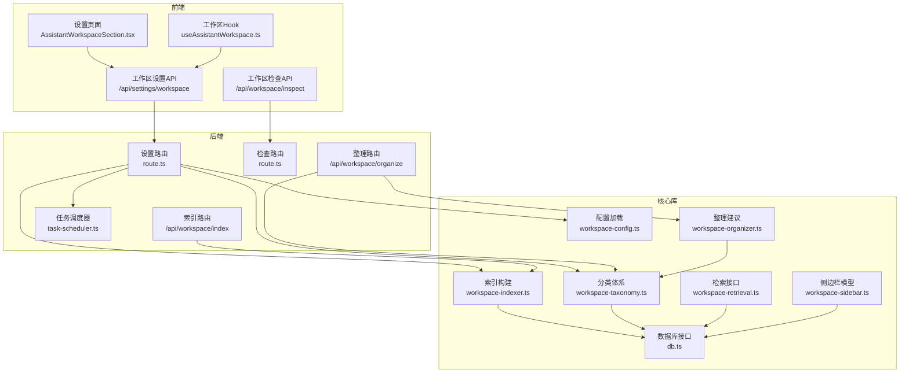
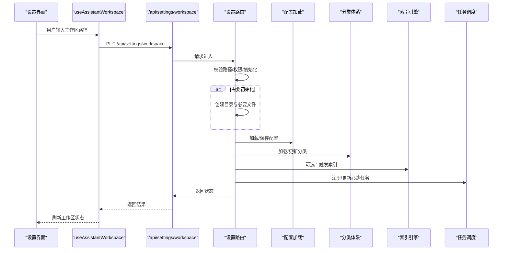
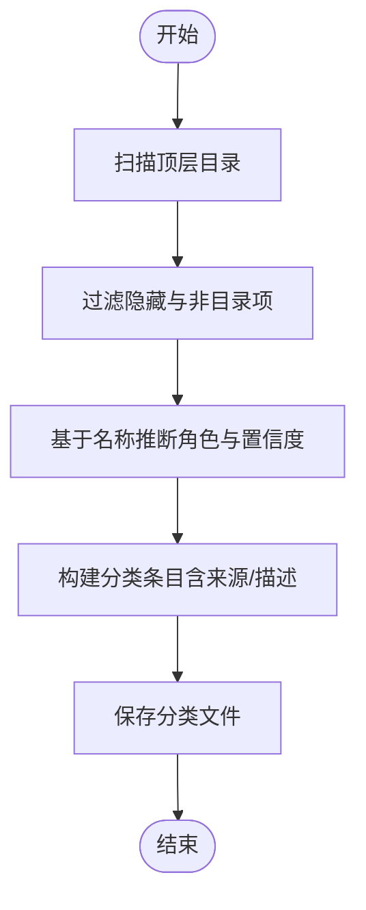
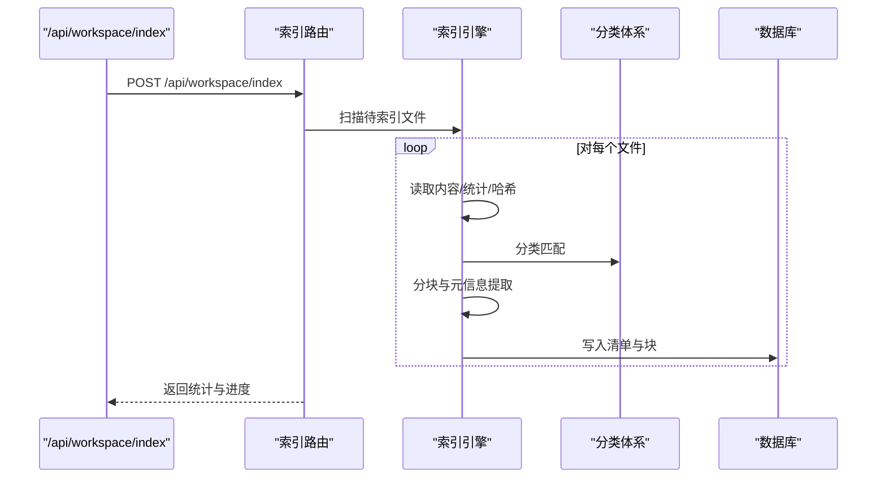
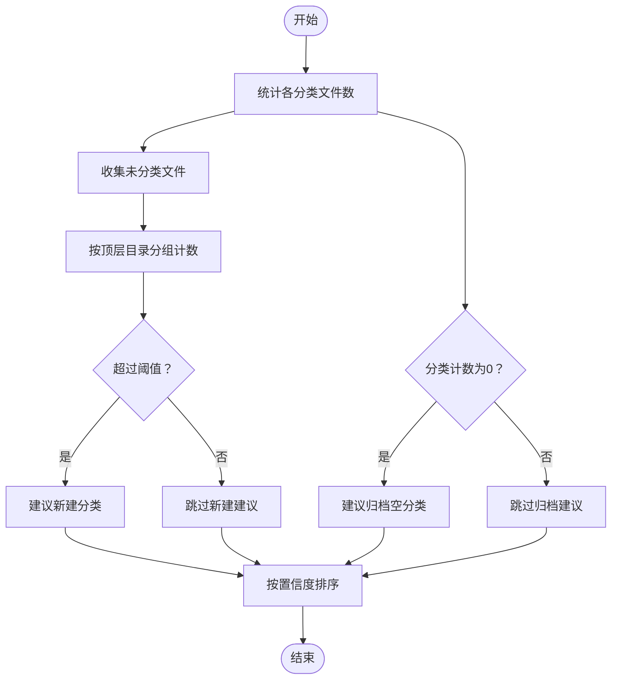
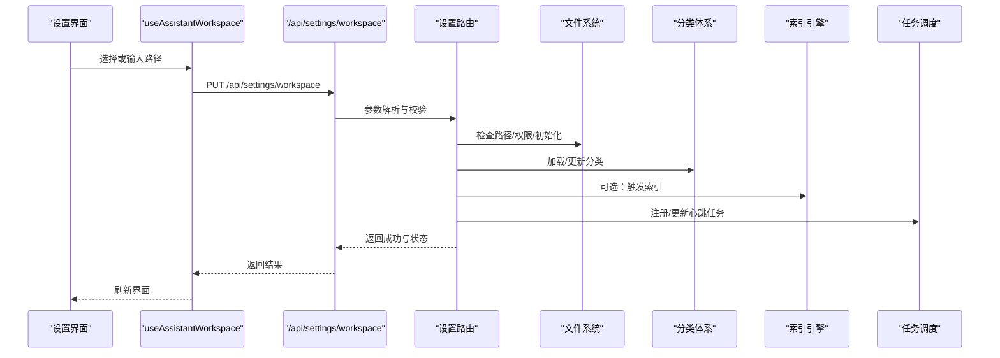
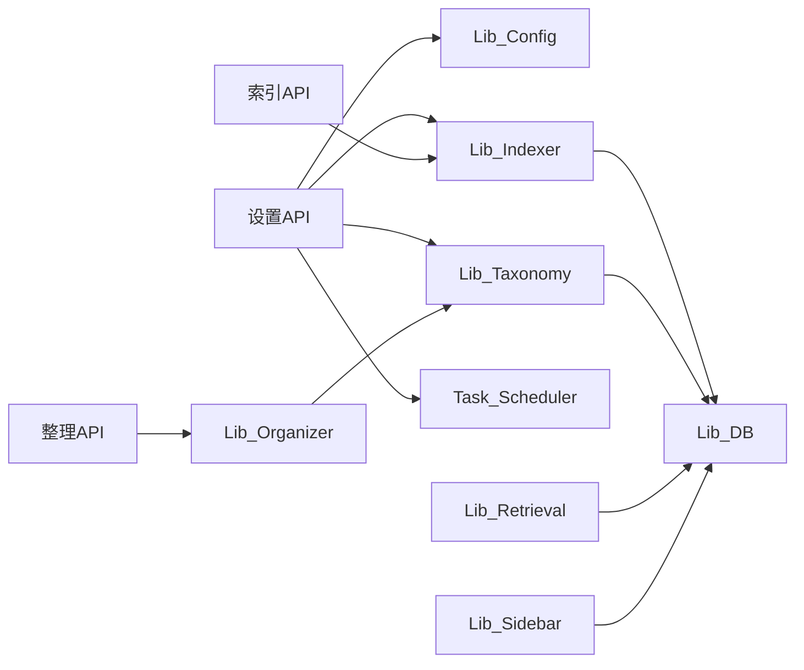

# 工作区组织

<cite>
**本文引用的文件**
- [src/lib/workspace-config.ts](file://src/lib/workspace-config.ts)
- [src/lib/workspace-taxonomy.ts](file://src/lib/workspace-taxonomy.ts)
- [src/lib/workspace-indexer.ts](file://src/lib/workspace-indexer.ts)
- [src/lib/workspace-organizer.ts](file://src/lib/workspace-organizer.ts)
- [src/lib/workspace-retrieval.ts](file://src/lib/workspace-retrieval.ts)
- [src/lib/workspace-sidebar.ts](file://src/lib/workspace-sidebar.ts)
- [src/components/settings/workspace-types.ts](file://src/components/settings/workspace-types.ts)
- [src/app/api/settings/workspace/route.ts](file://src/app/api/settings/workspace/route.ts)
- [src/app/api/workspace/inspect/route.ts](file://src/app/api/workspace/inspect/route.ts)
- [src/hooks/useAssistantWorkspace.ts](file://src/hooks/useAssistantWorkspace.ts)
- [src/components/settings/AssistantWorkspaceSection.tsx](file://src/components/settings/AssistantWorkspaceSection.tsx)
- [src/app/api/workspace/index/route.ts](file://src/app/api/workspace/index/route.ts)
- [src/app/api/workspace/organize/route.ts](file://src/app/api/workspace/organize/route.ts)
- [src/lib/assistant-workspace.ts](file://src/lib/assistant-workspace.ts)
- [src/lib/working-directory.ts](file://src/lib/working-directory.ts)
- [src/lib/db.ts](file://src/lib/db.ts)
- [src/lib/task-scheduler.ts](file://src/lib/task-scheduler.ts)
- [src/types/index.ts](file://src/types/index.ts)
</cite>

## 目录
1. [简介](#简介)
2. [项目结构](#项目结构)
3. [核心组件](#核心组件)
4. [架构总览](#架构总览)
5. [详细组件分析](#详细组件分析)
6. [依赖分析](#依赖分析)
7. [性能考虑](#性能考虑)
8. [故障排查指南](#故障排查指南)
9. [结论](#结论)
10. [附录](#附录)

## 简介
本文件系统性阐述工作区组织的设计与实现，覆盖项目结构管理、文件索引与分类、工作区配置、标签与分类体系、文件关联关系、导入导出与同步、版本控制集成、模板与共享机制、权限管理以及性能优化与大数据集处理策略。文档以代码级可视化图示与路径引用的方式，帮助读者快速定位实现细节并掌握完整的使用与扩展流程。

## 项目结构
工作区组织围绕“配置-分类-索引-整理-检索-侧边栏”六大子系统协同运作，前端通过设置页面与API交互完成工作区初始化、配置变更与状态检查；后端提供索引与整理的批处理能力，并通过任务调度维持长期运行的健康度指标。

图表来源
- [src/app/api/settings/workspace/route.ts](file://src/app/api/settings/workspace/route.ts)
- [src/app/api/workspace/inspect/route.ts](file://src/app/api/workspace/inspect/route.ts)
- [src/app/api/workspace/index/route.ts](file://src/app/api/workspace/index/route.ts)
- [src/app/api/workspace/organize/route.ts](file://src/app/api/workspace/organize/route.ts)
- [src/lib/workspace-config.ts](file://src/lib/workspace-config.ts)
- [src/lib/workspace-taxonomy.ts](file://src/lib/workspace-taxonomy.ts)
- [src/lib/workspace-indexer.ts](file://src/lib/workspace-indexer.ts)
- [src/lib/workspace-organizer.ts](file://src/lib/workspace-organizer.ts)
- [src/lib/workspace-retrieval.ts](file://src/lib/workspace-retrieval.ts)
- [src/lib/workspace-sidebar.ts](file://src/lib/workspace-sidebar.ts)
- [src/lib/db.ts](file://src/lib/db.ts)
- [src/lib/task-scheduler.ts](file://src/lib/task-scheduler.ts)

章节来源
- [src/app/api/settings/workspace/route.ts](file://src/app/api/settings/workspace/route.ts)
- [src/app/api/workspace/inspect/route.ts](file://src/app/api/workspace/inspect/route.ts)
- [src/lib/workspace-config.ts](file://src/lib/workspace-config.ts)
- [src/lib/workspace-taxonomy.ts](file://src/lib/workspace-taxonomy.ts)
- [src/lib/workspace-indexer.ts](file://src/lib/workspace-indexer.ts)
- [src/lib/workspace-organizer.ts](file://src/lib/workspace-organizer.ts)
- [src/lib/workspace-retrieval.ts](file://src/lib/workspace-retrieval.ts)
- [src/lib/workspace-sidebar.ts](file://src/lib/workspace-sidebar.ts)
- [src/lib/db.ts](file://src/lib/db.ts)
- [src/lib/task-scheduler.ts](file://src/lib/task-scheduler.ts)

## 核心组件
- 配置系统：负责工作区配置的加载、校验与持久化，定义索引参数、忽略规则、归档策略等。
- 分类体系：基于目录名称推断角色（如笔记、项目、日记、归档、收件箱、模板、资源、内存等），支持手动/自动/默认来源。
- 索引引擎：对文件内容进行分块、提取元信息、建立清单与向量索引，支持增量重算与一致性校验。
- 整理器：根据分类统计与未分类文件分布，生成“新建分类”“归档空分类”等建议，辅助组织优化。
- 检索接口：提供基于分类、关键词、标签的查询与排序，支撑侧边栏与全局搜索。
- 侧边栏模型：维护工作区树形视图、折叠状态、当前选中项与快捷导航。
- 设置API与检查API：对外暴露工作区路径设置、初始化、重置引导、心跳开关与间隔、状态检查等能力。
- 数据库与任务调度：承载索引与分类的持久化，以及周期性健康度任务的注册与执行。

章节来源
- [src/lib/workspace-config.ts](file://src/lib/workspace-config.ts)
- [src/lib/workspace-taxonomy.ts](file://src/lib/workspace-taxonomy.ts)
- [src/lib/workspace-indexer.ts](file://src/lib/workspace-indexer.ts)
- [src/lib/workspace-organizer.ts](file://src/lib/workspace-organizer.ts)
- [src/lib/workspace-retrieval.ts](file://src/lib/workspace-retrieval.ts)
- [src/lib/workspace-sidebar.ts](file://src/lib/workspace-sidebar.ts)
- [src/app/api/settings/workspace/route.ts](file://src/app/api/settings/workspace/route.ts)
- [src/app/api/workspace/inspect/route.ts](file://src/app/api/workspace/inspect/route.ts)
- [src/lib/db.ts](file://src/lib/db.ts)
- [src/lib/task-scheduler.ts](file://src/lib/task-scheduler.ts)

## 架构总览
工作区组织采用“前端设置-后端批处理-数据库持久化”的分层设计。前端通过设置页与API交互，后端路由负责业务编排与调用核心库，核心库封装具体算法与数据结构，数据库统一存储索引与分类结果。

图表来源
- [src/hooks/useAssistantWorkspace.ts](file://src/hooks/useAssistantWorkspace.ts)
- [src/app/api/settings/workspace/route.ts](file://src/app/api/settings/workspace/route.ts)
- [src/lib/workspace-config.ts](file://src/lib/workspace-config.ts)
- [src/lib/workspace-taxonomy.ts](file://src/lib/workspace-taxonomy.ts)
- [src/lib/workspace-indexer.ts](file://src/lib/workspace-indexer.ts)
- [src/lib/task-scheduler.ts](file://src/lib/task-scheduler.ts)

## 详细组件分析

### 配置系统（workspace-config）
- 职责：加载与保存工作区配置，包括组织风格、捕获默认位置、归档策略、忽略列表、索引参数（最大文件大小、分块大小、重叠、最大深度、包含扩展名）。
- 关键点：配置变更影响索引与分类行为，需在设置API中进行原子性保存与初始化/重置引导。
- 复杂度：O(1) 读取，写入涉及磁盘IO与一致性校验。

章节来源
- [src/lib/workspace-config.ts](file://src/lib/workspace-config.ts)
- [src/types/index.ts](file://src/types/index.ts)
- [src/app/api/settings/workspace/route.ts](file://src/app/api/settings/workspace/route.ts)

### 分类体系（workspace-taxonomy）
- 职责：从目录推断角色（笔记/项目/日记/归档/收件箱/模板/资源/内存等），支持精确匹配与近似匹配，输出带置信度的分类条目。
- 关键点：支持从现有目录批量推断、按路径匹配分类、建议新分类、记录来源（用户/学习/默认）。
- 复杂度：目录扫描 O(n)，路径匹配 O(m·k)，其中 n 为目录项数，m 为分类数，k 为路径前缀比较次数。

图表来源
- [src/lib/workspace-taxonomy.ts](file://src/lib/workspace-taxonomy.ts)

章节来源
- [src/lib/workspace-taxonomy.ts](file://src/lib/workspace-taxonomy.ts)

### 索引引擎（workspace-indexer）
- 职责：读取文件内容，计算哈希，提取元信息（标题/标签/标题层级/别名），按配置分块，生成清单与块条目，支持增量重算与一致性校验。
- 关键点：基于修改时间判断是否需要重索引；分块大小与重叠由配置控制；分类用于标注块所属类别。
- 复杂度：单文件索引 O(f)，f 为内容长度；批量索引 O(F·f)，F 为文件数。

图表来源
- [src/app/api/workspace/index/route.ts](file://src/app/api/workspace/index/route.ts)
- [src/lib/workspace-indexer.ts](file://src/lib/workspace-indexer.ts)
- [src/lib/workspace-taxonomy.ts](file://src/lib/workspace-taxonomy.ts)
- [src/lib/db.ts](file://src/lib/db.ts)

章节来源
- [src/app/api/workspace/index/route.ts](file://src/app/api/workspace/index/route.ts)
- [src/lib/workspace-indexer.ts](file://src/lib/workspace-indexer.ts)

### 整理器（workspace-organizer）
- 职责：统计各分类文件数量，识别未分类文件，生成“新建分类”“归档空分类”等建议，按置信度排序。
- 关键点：基于顶层目录分组统计，阈值触发建议；与分类体系联动。
- 复杂度：O(F+F')，F 为清单条目数，F' 为未分类文件数。

图表来源
- [src/lib/workspace-organizer.ts](file://src/lib/workspace-organizer.ts)
- [src/lib/workspace-taxonomy.ts](file://src/lib/workspace-taxonomy.ts)

章节来源
- [src/lib/workspace-organizer.ts](file://src/lib/workspace-organizer.ts)

### 检索接口（workspace-retrieval）
- 职责：提供基于分类、关键词、标签的查询与排序，支撑侧边栏与全局搜索。
- 关键点：与数据库交互，结合分类与索引结果进行过滤与聚合。
- 复杂度：查询复杂度取决于索引结构与过滤条件，通常 O(log N) 到 O(N) 不等。

章节来源
- [src/lib/workspace-retrieval.ts](file://src/lib/workspace-retrieval.ts)

### 侧边栏模型（workspace-sidebar）
- 职责：维护工作区树形视图、折叠状态、当前选中项与快捷导航。
- 关键点：与检索接口配合，动态渲染目录与文件节点。
- 复杂度：树构建与渲染 O(V+E)，V 为节点数，E 为边数。

章节来源
- [src/lib/workspace-sidebar.ts](file://src/lib/workspace-sidebar.ts)

### 设置与检查API
- 设置API（/api/settings/workspace）：接收工作区路径，校验存在性与读写权限，支持初始化（创建目录与必要文件）、重置引导、重置心跳、保存状态并注册/更新心跳任务。
- 检查API（/api/workspace/inspect）：返回工作区有效性、可读写性、是否存在助理数据、摘要信息等。

图表来源
- [src/hooks/useAssistantWorkspace.ts](file://src/hooks/useAssistantWorkspace.ts)
- [src/app/api/settings/workspace/route.ts](file://src/app/api/settings/workspace/route.ts)
- [src/lib/workspace-taxonomy.ts](file://src/lib/workspace-taxonomy.ts)
- [src/lib/workspace-indexer.ts](file://src/lib/workspace-indexer.ts)
- [src/lib/task-scheduler.ts](file://src/lib/task-scheduler.ts)

章节来源
- [src/app/api/settings/workspace/route.ts](file://src/app/api/settings/workspace/route.ts)
- [src/app/api/workspace/inspect/route.ts](file://src/app/api/workspace/inspect/route.ts)
- [src/hooks/useAssistantWorkspace.ts](file://src/hooks/useAssistantWorkspace.ts)

### 导入导出、同步与版本控制
- 导入：通过设置API的初始化选项创建工作区目录与必要文件，确保后续索引与分类可用。
- 同步：索引与分类结果写入数据库，提供一致性校验与增量重算；可通过检查API获取摘要信息。
- 版本控制：工作区状态与配置文件可纳入版本控制，建议将配置与分类文件纳入仓库，避免敏感信息泄露。

章节来源
- [src/app/api/settings/workspace/route.ts](file://src/app/api/settings/workspace/route.ts)
- [src/lib/db.ts](file://src/lib/db.ts)

### 模板、共享与权限
- 模板：分类体系中的“模板”角色用于存放可复用的文件模板，便于快速创建标准化内容。
- 共享：工作区作为独立目录，可按团队约定共享；建议通过版本控制系统与权限策略保障安全。
- 权限：设置API在保存前进行读写权限检查，防止无权限目录被设为工作区。

章节来源
- [src/lib/workspace-taxonomy.ts](file://src/lib/workspace-taxonomy.ts)
- [src/app/api/settings/workspace/route.ts](file://src/app/api/settings/workspace/route.ts)

## 依赖分析
- 组件耦合：设置API依赖配置、分类、索引与任务调度；索引与整理依赖分类与数据库；检索与侧边栏依赖数据库。
- 外部依赖：文件系统访问、数据库持久化、任务调度器。
- 循环依赖：未发现直接循环依赖，模块职责清晰。

图表来源
- [src/app/api/settings/workspace/route.ts](file://src/app/api/settings/workspace/route.ts)
- [src/app/api/workspace/index/route.ts](file://src/app/api/workspace/index/route.ts)
- [src/app/api/workspace/organize/route.ts](file://src/app/api/workspace/organize/route.ts)
- [src/lib/workspace-config.ts](file://src/lib/workspace-config.ts)
- [src/lib/workspace-taxonomy.ts](file://src/lib/workspace-taxonomy.ts)
- [src/lib/workspace-indexer.ts](file://src/lib/workspace-indexer.ts)
- [src/lib/workspace-organizer.ts](file://src/lib/workspace-organizer.ts)
- [src/lib/workspace-retrieval.ts](file://src/lib/workspace-retrieval.ts)
- [src/lib/workspace-sidebar.ts](file://src/lib/workspace-sidebar.ts)
- [src/lib/db.ts](file://src/lib/db.ts)
- [src/lib/task-scheduler.ts](file://src/lib/task-scheduler.ts)

章节来源
- [src/app/api/settings/workspace/route.ts](file://src/app/api/settings/workspace/route.ts)
- [src/app/api/workspace/index/route.ts](file://src/app/api/workspace/index/route.ts)
- [src/app/api/workspace/organize/route.ts](file://src/app/api/workspace/organize/route.ts)
- [src/lib/workspace-config.ts](file://src/lib/workspace-config.ts)
- [src/lib/workspace-taxonomy.ts](file://src/lib/workspace-taxonomy.ts)
- [src/lib/workspace-indexer.ts](file://src/lib/workspace-indexer.ts)
- [src/lib/workspace-organizer.ts](file://src/lib/workspace-organizer.ts)
- [src/lib/workspace-retrieval.ts](file://src/lib/workspace-retrieval.ts)
- [src/lib/workspace-sidebar.ts](file://src/lib/workspace-sidebar.ts)
- [src/lib/db.ts](file://src/lib/db.ts)
- [src/lib/task-scheduler.ts](file://src/lib/task-scheduler.ts)

## 性能考虑
- 增量索引：基于修改时间与清单对比，仅对变更文件重索引，降低全量扫描成本。
- 分块策略：合理设置分块大小与重叠，平衡检索精度与索引体积。
- 并发与批处理：索引与整理采用批处理模式，避免频繁I/O；任务调度器定期执行健康度任务。
- 数据库优化：索引与分类结果持久化，查询时利用索引字段；定期清理无效/空分类减少冗余。
- 大数据集：限制最大文件大小与最大深度，避免超大文件拖慢索引；对未分类文件进行分组统计，及时建议新建分类以提升命中率。

## 故障排查指南
- 路径无效：检查路径是否存在且为目录，若不存在可启用初始化创建；确认读写权限。
- 初始化失败：查看日志中的错误码与消息，修复权限或磁盘空间问题。
- 心跳任务异常：确认心跳开关与间隔设置，检查任务调度器是否成功注册。
- 索引不生效：确认增量重算逻辑是否触发，检查清单与文件修改时间一致性。
- 分类不准确：调整分类来源（用户/学习/默认），或手动修正分类条目。

章节来源
- [src/app/api/settings/workspace/route.ts](file://src/app/api/settings/workspace/route.ts)
- [src/lib/task-scheduler.ts](file://src/lib/task-scheduler.ts)
- [src/lib/workspace-indexer.ts](file://src/lib/workspace-indexer.ts)
- [src/lib/workspace-taxonomy.ts](file://src/lib/workspace-taxonomy.ts)

## 结论
工作区组织通过“配置-分类-索引-整理-检索-侧边栏”的闭环设计，实现了对知识资产的结构化管理与高效检索。前端设置与API提供了便捷的入口，后端批处理与数据库持久化保证了稳定性与可扩展性。结合增量索引、分块策略与任务调度，系统能够应对大规模数据场景并持续保持健康度。

## 附录
- 使用流程建议：先设置工作区路径并初始化，再进行分类与索引，最后通过整理建议优化组织结构。
- 最佳实践：定期重置心跳以刷新健康度，合理配置索引参数，利用模板与分类角色提升一致性。