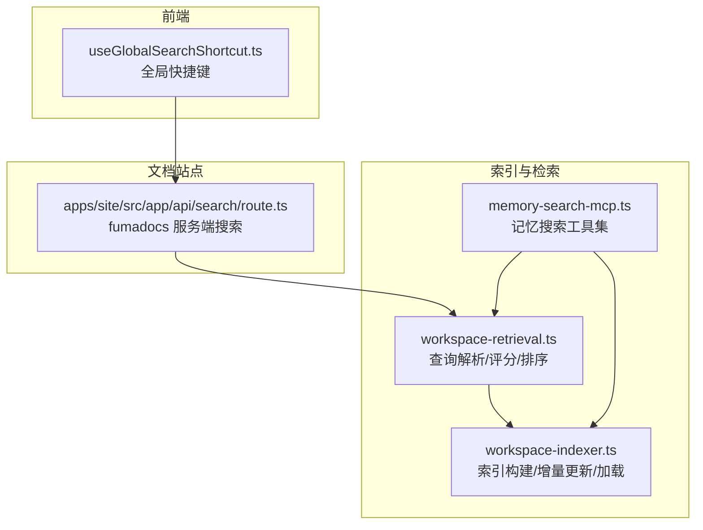
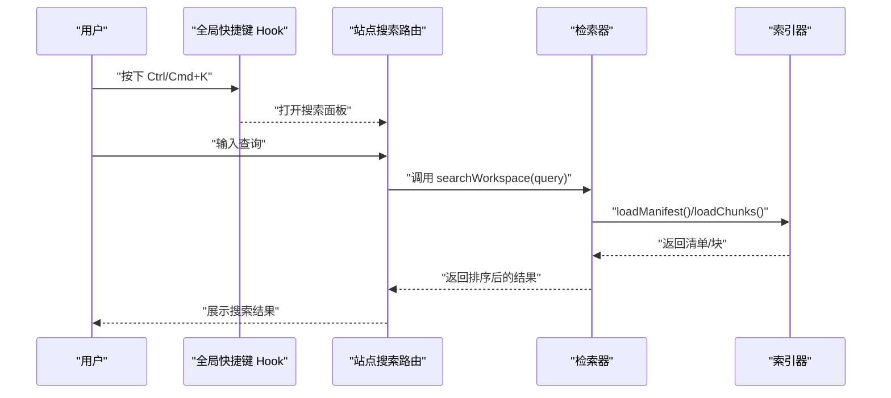
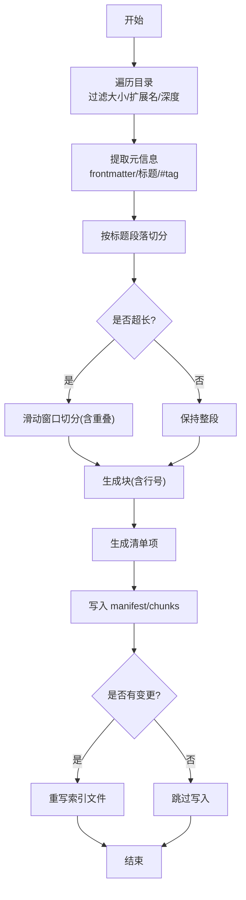
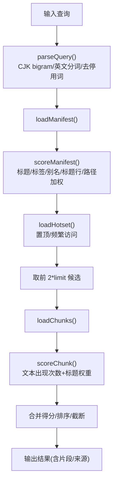
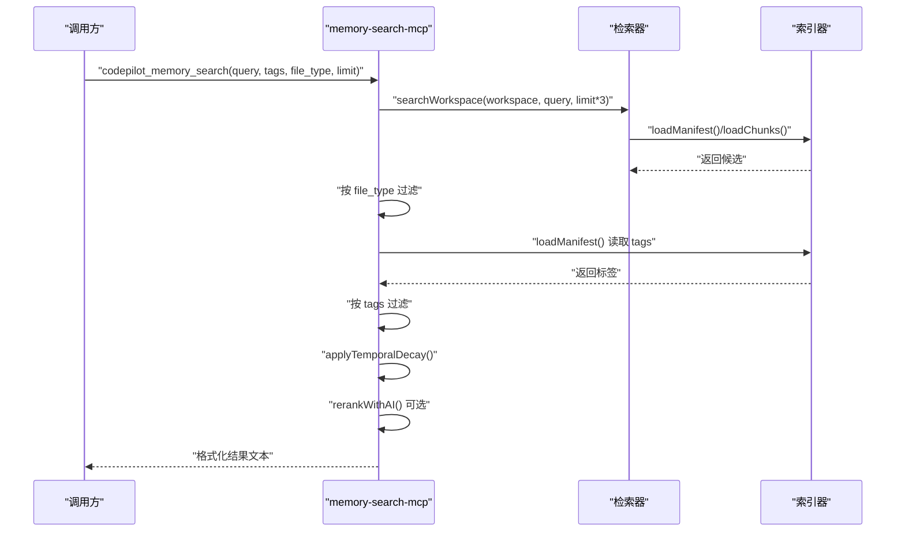
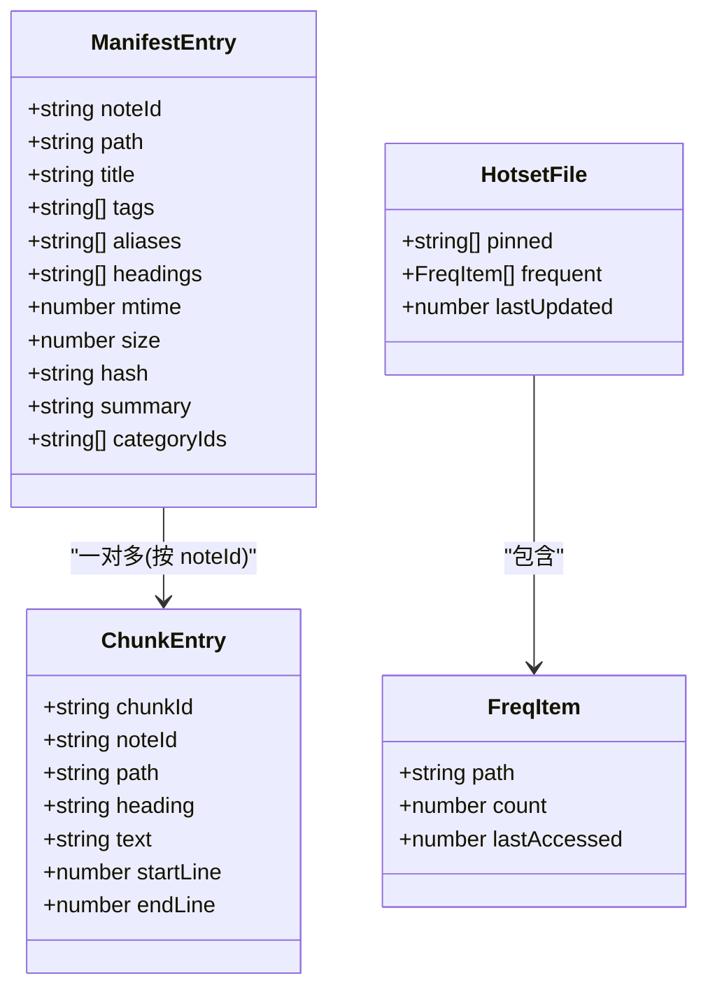

# 文件搜索

<cite>
**本文引用的文件**
- [workspace-retrieval.ts](file://src/lib/workspace-retrieval.ts)
- [workspace-indexer.ts](file://src/lib/workspace-indexer.ts)
- [memory-search-mcp.ts](file://src/lib/memory-search-mcp.ts)
- [route.ts](file://apps/site/src/app/api/search/route.ts)
- [useGlobalSearchShortcut.ts](file://src/hooks/useGlobalSearchShortcut.ts)
- [assistant-workspace.test.ts](file://src/__tests__/unit/assistant-workspace.test.ts)
</cite>

## 目录
1. [简介](#简介)
2. [项目结构](#项目结构)
3. [核心组件](#核心组件)
4. [架构总览](#架构总览)
5. [详细组件分析](#详细组件分析)
6. [依赖关系分析](#依赖关系分析)
7. [性能考量](#性能考量)
8. [故障排查指南](#故障排查指南)
9. [结论](#结论)
10. [附录](#附录)

## 简介
本文件系统化梳理了代码库中的“文件搜索”能力，覆盖全局搜索实现、索引构建与增量更新、查询解析与评分、相关性排序与重排、时间衰减与热度提升、以及前端快捷键触发与结果展示路径。文档同时指出当前仓库中未直接实现的“正则表达式支持”和“模糊匹配”，并给出可扩展建议。

## 项目结构
围绕文件搜索的关键模块分布如下：
- 索引与检索
  - 索引器：负责扫描工作区、提取元信息、切分块、生成清单与块索引，并支持增量更新。
  - 检索器：基于关键词对清单与块进行评分，输出带片段与来源的搜索结果。
  - 内存搜索 MCP：面向记忆型文件（如 daily/long-term）的专用搜索工具，支持类型过滤、标签过滤、时间衰减与可选 AI 重排。
- 文档站点搜索
  - 站点 API 搜索路由：基于 fumadocs 的服务端搜索适配器，支持多语言（含中文回退）。
- 前端交互
  - 全局搜索快捷键 Hook：统一触发全局搜索面板。

图表来源
- [workspace-indexer.ts:300-371](file://src/lib/workspace-indexer.ts#L300-L371)
- [workspace-retrieval.ts:169-254](file://src/lib/workspace-retrieval.ts#L169-L254)
- [memory-search-mcp.ts:42-113](file://src/lib/memory-search-mcp.ts#L42-L113)
- [route.ts:1-10](file://apps/site/src/app/api/search/route.ts#L1-L10)
- [useGlobalSearchShortcut.ts:1-20](file://src/hooks/useGlobalSearchShortcut.ts#L1-L20)

章节来源
- [workspace-indexer.ts:1-428](file://src/lib/workspace-indexer.ts#L1-L428)
- [workspace-retrieval.ts:1-293](file://src/lib/workspace-retrieval.ts#L1-L293)
- [memory-search-mcp.ts:1-349](file://src/lib/memory-search-mcp.ts#L1-L349)
- [route.ts:1-10](file://apps/site/src/app/api/search/route.ts#L1-L10)
- [useGlobalSearchShortcut.ts:1-20](file://src/hooks/useGlobalSearchShortcut.ts#L1-L20)

## 核心组件
- 索引器（workspace-indexer）
  - 扫描工作区目录，按配置过滤文件大小与扩展名，支持最大深度限制。
  - 提取 Markdown 元信息（标题、标签、别名、标题层级），并按固定 chunk 大小与重叠切分为块。
  - 生成清单（manifest.jsonl）与块索引（chunks.jsonl），支持增量更新：仅重新索引变更或新增文件。
  - 提供加载清单与块、统计索引状态等辅助函数。
- 检索器（workspace-retrieval）
  - 查询解析：支持英文空格/标点分词与中文二元组（bigram）分词；剔除停用词；去重。
  - 清单评分：对标题、标签、别名、标题行、路径进行加权匹配，确定主要匹配来源。
  - 块评分：在候选条目的所有块中寻找最佳块，按文本出现次数与标题权重计算得分。
  - 结果聚合：合并清单与块得分，返回带片段与来源的搜索结果，并按分数降序截断。
  - 热点提升：基于“常访问”与“置顶”列表对结果进行额外加分。
- 记忆搜索 MCP（memory-search-mcp）
  - 提供 codepilot_memory_search 工具：关键词搜索 + 类型过滤（daily/longterm/notes/all）、标签过滤（YAML frontmatter），并应用时间衰减。
  - 支持可选 AI 重排（小模型），以提升最终相关性。
  - 提供 codepilot_memory_get 与 codepilot_memory_recent 工具，用于读取指定文件与获取近期记忆摘要。
- 文档站点搜索（apps/site）
  - 使用 fumadocs 的 createFromSource 适配器，提供服务端搜索接口，中文场景回退至英文分词器。
- 前端快捷键（useGlobalSearchShortcut）
  - 统一监听 Ctrl/Cmd+K 触发全局搜索面板，确保在聊天输入框等场景下也能生效。

章节来源
- [workspace-indexer.ts:14-190](file://src/lib/workspace-indexer.ts#L14-L190)
- [workspace-indexer.ts:300-371](file://src/lib/workspace-indexer.ts#L300-L371)
- [workspace-indexer.ts:373-427](file://src/lib/workspace-indexer.ts#L373-L427)
- [workspace-retrieval.ts:54-94](file://src/lib/workspace-retrieval.ts#L54-L94)
- [workspace-retrieval.ts:100-163](file://src/lib/workspace-retrieval.ts#L100-L163)
- [workspace-retrieval.ts:169-254](file://src/lib/workspace-retrieval.ts#L169-L254)
- [workspace-retrieval.ts:260-292](file://src/lib/workspace-retrieval.ts#L260-L292)
- [memory-search-mcp.ts:42-113](file://src/lib/memory-search-mcp.ts#L42-L113)
- [memory-search-mcp.ts:281-296](file://src/lib/memory-search-mcp.ts#L281-L296)
- [memory-search-mcp.ts:302-348](file://src/lib/memory-search-mcp.ts#L302-L348)
- [route.ts:1-10](file://apps/site/src/app/api/search/route.ts#L1-L10)
- [useGlobalSearchShortcut.ts:1-20](file://src/hooks/useGlobalSearchShortcut.ts#L1-L20)

## 架构总览
整体流程从“索引构建”开始，随后“检索器”对查询进行解析与评分，结合“块级最佳匹配”输出结果；“记忆搜索 MCP”在此基础上增加类型/标签过滤与时间衰减；“文档站点搜索”复用检索器能力提供站内搜索；“前端快捷键”统一入口。

图表来源
- [useGlobalSearchShortcut.ts:1-20](file://src/hooks/useGlobalSearchShortcut.ts#L1-L20)
- [route.ts:1-10](file://apps/site/src/app/api/search/route.ts#L1-L10)
- [workspace-retrieval.ts:169-254](file://src/lib/workspace-retrieval.ts#L169-L254)
- [workspace-indexer.ts:373-393](file://src/lib/workspace-indexer.ts#L373-L393)

## 详细组件分析

### 索引构建与增量更新（workspace-indexer）
- 目录遍历与过滤
  - 递归遍历，受最大深度与忽略规则控制；按扩展名白名单与文件大小上限筛选。
- 元信息提取
  - 解析 YAML frontmatter 中的 title/tags/aliases；提取标题层级作为 headings；从内容中抽取 #tag（排除代码块）。
- 块切分
  - 按标题段落切分，超过阈值的段落采用滑动窗口（固定 chunkSize 与重叠）进一步切分，保留起止行号以便定位。
- 清单与块写入
  - 将每个文件生成一个清单项与多个块项，分别写入 manifest.jsonl 与 chunks.jsonl。
- 增量更新
  - 对比文件 mtime 与现有清单条目，仅对变更或新增文件重新索引，其余复用旧索引，显著降低重复索引成本。

图表来源
- [workspace-indexer.ts:255-298](file://src/lib/workspace-indexer.ts#L255-L298)
- [workspace-indexer.ts:90-190](file://src/lib/workspace-indexer.ts#L90-L190)
- [workspace-indexer.ts:14-88](file://src/lib/workspace-indexer.ts#L14-L88)
- [workspace-indexer.ts:300-371](file://src/lib/workspace-indexer.ts#L300-L371)

章节来源
- [workspace-indexer.ts:14-190](file://src/lib/workspace-indexer.ts#L14-L190)
- [workspace-indexer.ts:300-371](file://src/lib/workspace-indexer.ts#L300-L371)
- [workspace-indexer.ts:373-427](file://src/lib/workspace-indexer.ts#L373-L427)

### 查询解析与评分（workspace-retrieval）
- 查询解析
  - 混合 CJK 与非 CJK 字符处理：CJK 使用二元组分词，非 CJK 使用空格/标点分词；剔除停用词并去重。
- 清单评分
  - 标题命中最高权重，其次为标签、别名、标题行、路径；记录主要匹配来源（title/tag/heading/content/path）。
- 块评分
  - 在候选条目的所有块中查找最佳块：统计关键词在文本中的出现次数，标题命中权重更高。
- 结果聚合与排序
  - 合并清单与块得分，按分数降序，截断为 limit；默认返回前 5 条。
- 热点提升
  - 基于“置顶集合”与“频繁访问计数”对结果进行加分，频繁访问采用对数增长并设上限。

图表来源
- [workspace-retrieval.ts:54-94](file://src/lib/workspace-retrieval.ts#L54-L94)
- [workspace-retrieval.ts:100-163](file://src/lib/workspace-retrieval.ts#L100-L163)
- [workspace-retrieval.ts:169-254](file://src/lib/workspace-retrieval.ts#L169-L254)
- [workspace-retrieval.ts:260-292](file://src/lib/workspace-retrieval.ts#L260-L292)

章节来源
- [workspace-retrieval.ts:54-94](file://src/lib/workspace-retrieval.ts#L54-L94)
- [workspace-retrieval.ts:100-163](file://src/lib/workspace-retrieval.ts#L100-L163)
- [workspace-retrieval.ts:169-254](file://src/lib/workspace-retrieval.ts#L169-L254)
- [workspace-retrieval.ts:260-292](file://src/lib/workspace-retrieval.ts#L260-L292)

### 记忆搜索 MCP（memory-search-mcp）
- 工具一：codepilot_memory_search
  - 关键词搜索，支持 file_type（all/daily/longterm/notes）与 tags（YAML frontmatter）过滤。
  - 应用时间衰减（指数衰减，基于文件名日期），随后可选 AI 重排（小模型）。
- 工具二：codepilot_memory_get
  - 安全读取指定文件，路径严格校验（防越界与符号链接逃逸），支持行范围裁剪与长度限制。
- 工具三：codepilot_memory_recent
  - 返回长期记忆摘要与最近若干天的每日记忆，作为对话上下文的起点。

图表来源
- [memory-search-mcp.ts:42-113](file://src/lib/memory-search-mcp.ts#L42-L113)
- [memory-search-mcp.ts:281-296](file://src/lib/memory-search-mcp.ts#L281-L296)
- [memory-search-mcp.ts:302-348](file://src/lib/memory-search-mcp.ts#L302-L348)
- [workspace-retrieval.ts:169-254](file://src/lib/workspace-retrieval.ts#L169-L254)
- [workspace-indexer.ts:373-393](file://src/lib/workspace-indexer.ts#L373-L393)

章节来源
- [memory-search-mcp.ts:42-113](file://src/lib/memory-search-mcp.ts#L42-L113)
- [memory-search-mcp.ts:281-296](file://src/lib/memory-search-mcp.ts#L281-L296)
- [memory-search-mcp.ts:302-348](file://src/lib/memory-search-mcp.ts#L302-L348)

### 文档站点搜索（apps/site）
- 使用 fumadocs 的 createFromSource 适配器，将源内容转换为可搜索索引。
- 中文场景回退到英文分词器，以缓解中文词干化缺失问题。
- 通过 /api/search 路由对外提供搜索能力，便于站点内快速检索文档内容。

章节来源
- [route.ts:1-10](file://apps/site/src/app/api/search/route.ts#L1-L10)

### 前端快捷键（useGlobalSearchShortcut）
- 全局监听 Ctrl/Cmd+K，阻止默认行为并回调 onOpen，确保在任意页面（包括聊天输入框）都能打开搜索面板。

章节来源
- [useGlobalSearchShortcut.ts:1-20](file://src/hooks/useGlobalSearchShortcut.ts#L1-L20)

## 依赖关系分析
- 模块耦合
  - 检索器依赖索引器提供的清单与块数据；记忆搜索 MCP 在检索器之上增加类型/标签过滤与时间衰减。
  - 文档站点搜索路由依赖检索器能力（通过 createFromSource 包装）。
- 数据结构
  - 清单项（ManifestEntry）：包含路径、标题、标签、别名、标题行、哈希、修改时间、大小、摘要、分类等。
  - 块项（ChunkEntry）：包含块 ID、所属笔记 ID、路径、标题、文本、起止行号。
  - 热点集（HotsetFile）：包含置顶路径与频繁访问记录，用于提升搜索结果相关性。
- 外部依赖
  - 文档站点搜索依赖 fumadocs-core 的搜索适配器。
  - 记忆搜索 MCP 的可选 AI 重排依赖文本生成与提供商解析模块。

图表来源
- [workspace-indexer.ts:238-250](file://src/lib/workspace-indexer.ts#L238-L250)
- [workspace-indexer.ts:228-236](file://src/lib/workspace-indexer.ts#L228-L236)
- [workspace-retrieval.ts:260-292](file://src/lib/workspace-retrieval.ts#L260-L292)

章节来源
- [workspace-indexer.ts:228-250](file://src/lib/workspace-indexer.ts#L228-L250)
- [workspace-indexer.ts:228-236](file://src/lib/workspace-indexer.ts#L228-L236)
- [workspace-retrieval.ts:260-292](file://src/lib/workspace-retrieval.ts#L260-L292)

## 性能考量
- 索引构建
  - 增量更新：仅对变更或新增文件重新索引，避免全量重建；通过 mtime 对比与哈希校验减少 IO。
  - 切分策略：大段落采用滑动窗口与重叠，兼顾块粒度与上下文连续性。
- 检索性能
  - 候选集剪枝：先按清单得分取前 2*limit，再在块级精打细算，避免全量扫描。
  - 评分函数轻量：字符串包含与计数操作，复杂度与关键词数量线性相关。
  - 热点提升：通过内存 Map/Set 快速判定与加权，开销极低。
- 记忆搜索 MCP
  - 时间衰减与可选 AI 重排：在结果规模较小（<=2）时不进行重排，避免不必要的开销。
  - 文件读取安全：路径严格校验与符号链接解析，防止越界与逃逸。
- 并发与缓存
  - 当前实现未显式使用并发或缓存层；可通过以下方式优化：
    - 并发：对候选文件的块评分阶段引入并发（注意共享状态保护）。
    - 缓存：对热点查询结果与热门文件的块评分进行短期缓存。
    - 流水线：将“加载清单/块”“评分”“截断”拆分为流水线阶段，提高吞吐。
- 分页与统计
  - 检索器默认返回前 N 条；若需分页，可在上层按批次扩大候选集并分页截取。
  - 统计：索引器提供文件数、块数、最后索引时间、陈旧文件数等指标，可用于健康监控。

章节来源
- [workspace-indexer.ts:300-371](file://src/lib/workspace-indexer.ts#L300-L371)
- [workspace-retrieval.ts:169-254](file://src/lib/workspace-retrieval.ts#L169-L254)
- [memory-search-mcp.ts:302-348](file://src/lib/memory-search-mcp.ts#L302-L348)

## 故障排查指南
- 索引未更新或不生效
  - 检查工作区根目录是否存在 .assistant/index 目录与 manifest.jsonl/chunks.jsonl。
  - 确认文件大小与扩展名符合配置；确认文件修改时间是否晚于清单记录。
  - 如需强制重建，调用索引器的 force 选项。
- 搜索结果为空
  - 确认查询是否被停用词过滤干净；尝试更具体的关键词。
  - 检查文件是否被忽略（路径、扩展名、大小限制）。
- 记忆搜索无标签过滤结果
  - 确认目标文件 YAML frontmatter 中存在 tags 字段；标签大小写会被标准化。
- 时间衰减异常
  - 确认文件路径是否匹配 daily/longterm/notes 类型；仅 dated 文件会应用衰减。
- AI 重排失败
  - 检查提供商凭据与可用性；重排有 5 秒超时保护，失败时回退原顺序。
- 前端快捷键无效
  - 确认在支持的页面加载该 Hook；确保未被其他元素拦截键盘事件。

章节来源
- [workspace-indexer.ts:373-427](file://src/lib/workspace-indexer.ts#L373-L427)
- [workspace-retrieval.ts:169-254](file://src/lib/workspace-retrieval.ts#L169-L254)
- [memory-search-mcp.ts:42-113](file://src/lib/memory-search-mcp.ts#L42-L113)
- [useGlobalSearchShortcut.ts:1-20](file://src/hooks/useGlobalSearchShortcut.ts#L1-L20)

## 结论
该搜索体系以“纯文本关键词匹配 + 块级最佳匹配”为核心，辅以清单评分、热点提升、类型/标签过滤与时间衰减，形成稳定高效的本地工作区检索方案。文档站点搜索通过 fumadocs 适配器无缝集成。当前未实现正则表达式与模糊匹配，但查询解析与评分框架具备扩展空间；建议在不破坏现有评分体系的前提下，引入正则/模糊匹配作为可选增强模式，并配合并发与缓存策略进一步提升性能。

## 附录
- 代码示例路径（不含具体代码内容）
  - 索引构建与增量更新：[workspace-indexer.ts:300-371](file://src/lib/workspace-indexer.ts#L300-L371)
  - 清单与块加载：[workspace-indexer.ts:373-393](file://src/lib/workspace-indexer.ts#L373-L393)
  - 查询解析与评分：[workspace-retrieval.ts:54-94](file://src/lib/workspace-retrieval.ts#L54-L94), [workspace-retrieval.ts:100-163](file://src/lib/workspace-retrieval.ts#L100-L163)
  - 主搜索流程：[workspace-retrieval.ts:169-254](file://src/lib/workspace-retrieval.ts#L169-L254)
  - 热点提升与热集管理：[workspace-retrieval.ts:260-292](file://src/lib/workspace-retrieval.ts#L260-L292)
  - 记忆搜索工具链：[memory-search-mcp.ts:42-113](file://src/lib/memory-search-mcp.ts#L42-L113), [memory-search-mcp.ts:281-296](file://src/lib/memory-search-mcp.ts#L281-L296), [memory-search-mcp.ts:302-348](file://src/lib/memory-search-mcp.ts#L302-L348)
  - 文档站点搜索路由：[route.ts:1-10](file://apps/site/src/app/api/search/route.ts#L1-L10)
  - 全局搜索快捷键：[useGlobalSearchShortcut.ts:1-20](file://src/hooks/useGlobalSearchShortcut.ts#L1-L20)
- 单元测试参考
  - 增量索引与热集提升：[assistant-workspace.test.ts:382-499](file://src/__tests__/unit/assistant-workspace.test.ts#L382-L499)