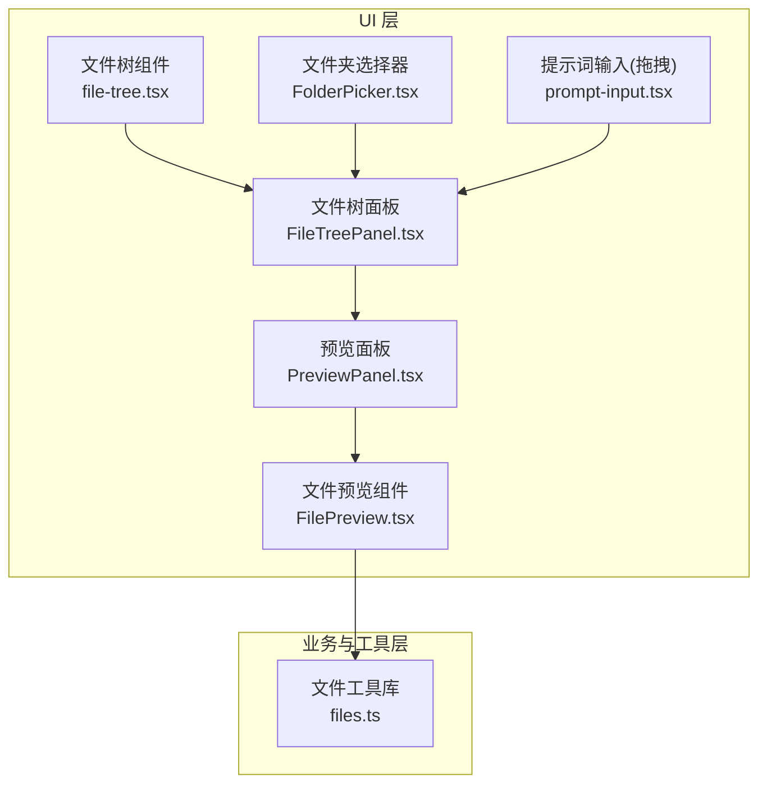
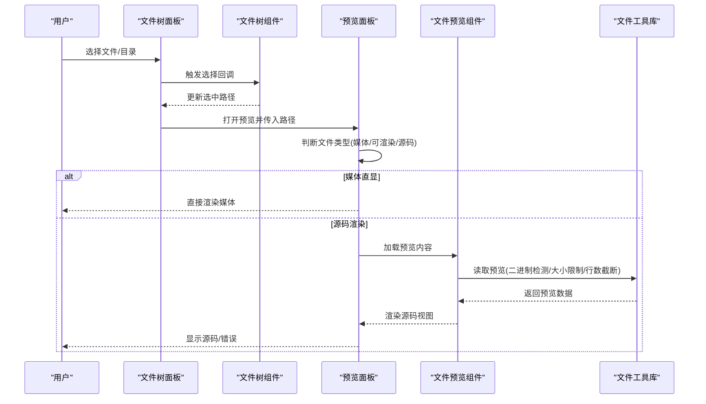
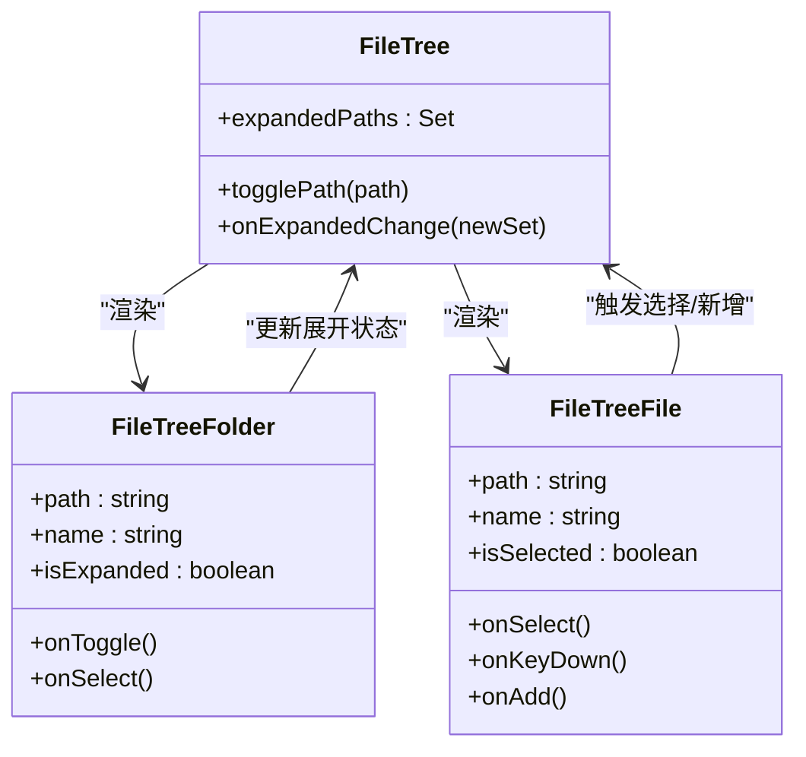

# 文件浏览器

<cite>
**本文引用的文件**
- [src/components/ai-elements/file-tree.tsx](file://src/components/ai-elements/file-tree.tsx)
- [src/components/project/FilePreview.tsx](file://src/components/project/FilePreview.tsx)
- [src/lib/files.ts](file://src/lib/files.ts)
- [src/components/layout/panels/PreviewPanel.tsx](file://src/components/layout/panels/PreviewPanel.tsx)
- [src/components/layout/panels/FileTreePanel.tsx](file://src/components/layout/panels/FileTreePanel.tsx)
- [src/components/chat/FolderPicker.tsx](file://src/components/chat/FolderPicker.tsx)
- [src/__tests__/helpers.ts](file://src/__tests__/helpers.ts)
- [src/__tests__/unit/folder-drop-classify.test.ts](file://src/__tests__/unit/folder-drop-classify.test.ts)
- [src/components/ai-elements/prompt-input.tsx](file://src/components/ai-elements/prompt-input.tsx)
</cite>

## 目录
1. [简介](#简介)
2. [项目结构](#项目结构)
3. [核心组件](#核心组件)
4. [架构总览](#架构总览)
5. [详细组件分析](#详细组件分析)
6. [依赖关系分析](#依赖关系分析)
7. [性能考量](#性能考量)
8. [故障排查指南](#故障排查指南)
9. [结论](#结论)
10. [附录](#附录)

## 简介
本文件浏览器文档聚焦于“文件树组件”、“目录结构展示”、“文件预览”三大主题，系统阐述以下能力与实现要点：
- 文件树组件的层级渲染、展开/折叠控制、选择与键盘交互
- 目录浏览与路径导航、工作目录与相对路径处理
- 文件预览的类型识别、媒体直显、源码渲染与错误处理
- 文件类型识别、图标映射与样式定制建议
- 文件右键菜单、拖拽操作与快捷键支持
- 文件大小计算、进度显示与性能优化策略
- 文件编码检测与二进制/大文件保护机制

## 项目结构
围绕文件浏览与预览的关键模块分布如下：
- 文件树组件：负责树形结构渲染、节点选择与上下文交互
- 预览面板：根据文件类型决定媒体直显或源码渲染
- 文件工具库：提供预览数据读取、二进制检测、行数限制与语言识别
- 文件树面板：提供新建文件/文件夹、刷新、面包屑等操作入口
- 文件预览组件：封装预览加载、复制路径、面包屑展示
- 文件夹选择器：用于对话框式浏览与路径输入
- 拖拽分类：在全局或表单级处理拖拽入参，区分文件与目录
- 测试辅助：定位文件树节点、预览按钮等，保障端到端测试一致性

图表来源
- [src/components/ai-elements/file-tree.tsx](file://src/components/ai-elements/file-tree.tsx)
- [src/components/layout/panels/FileTreePanel.tsx](file://src/components/layout/panels/FileTreePanel.tsx)
- [src/components/layout/panels/PreviewPanel.tsx](file://src/components/layout/panels/PreviewPanel.tsx)
- [src/components/project/FilePreview.tsx](file://src/components/project/FilePreview.tsx)
- [src/components/chat/FolderPicker.tsx](file://src/components/chat/FolderPicker.tsx)
- [src/components/ai-elements/prompt-input.tsx](file://src/components/ai-elements/prompt-input.tsx)
- [src/lib/files.ts](file://src/lib/files.ts)

章节来源
- [src/components/ai-elements/file-tree.tsx](file://src/components/ai-elements/file-tree.tsx)
- [src/components/layout/panels/FileTreePanel.tsx](file://src/components/layout/panels/FileTreePanel.tsx)
- [src/components/layout/panels/PreviewPanel.tsx](file://src/components/layout/panels/PreviewPanel.tsx)
- [src/components/project/FilePreview.tsx](file://src/components/project/FilePreview.tsx)
- [src/components/chat/FolderPicker.tsx](file://src/components/chat/FolderPicker.tsx)
- [src/components/ai-elements/prompt-input.tsx](file://src/components/ai-elements/prompt-input.tsx)
- [src/lib/files.ts](file://src/lib/files.ts)

## 核心组件
- 文件树组件：提供树形节点渲染、展开/折叠状态管理、选择回调、键盘事件（回车/空格）与新增子项入口
- 文件树面板：提供新建文件/文件夹、刷新、面包屑与操作区，承载文件树主体
- 预览面板：根据文件扩展名判定媒体直显、可渲染与源码视图，并据此选择渲染分支
- 文件预览组件：封装预览加载、错误处理、复制路径、面包屑展示
- 文件夹选择器：提供目录浏览、上一级导航、路径输入与选择回调
- 拖拽分类：在表单级或全局模式下，对拖拽事件进行归类，分别进入文件/目录处理流

章节来源
- [src/components/ai-elements/file-tree.tsx](file://src/components/ai-elements/file-tree.tsx)
- [src/components/layout/panels/FileTreePanel.tsx](file://src/components/layout/panels/FileTreePanel.tsx)
- [src/components/layout/panels/PreviewPanel.tsx](file://src/components/layout/panels/PreviewPanel.tsx)
- [src/components/project/FilePreview.tsx](file://src/components/project/FilePreview.tsx)
- [src/components/chat/FolderPicker.tsx](file://src/components/chat/FolderPicker.tsx)
- [src/components/ai-elements/prompt-input.tsx](file://src/components/ai-elements/prompt-input.tsx)

## 架构总览
文件浏览与预览的整体流程如下：
- 用户在文件树面板中选择某文件或目录
- 若为目录，触发展开/折叠；若为文件，进入预览流程
- 预览面板根据文件类型判断是否走媒体直显或源码渲染
- 源码渲染前由文件工具库执行二进制检测、大小限制与行数截断
- 文件预览组件发起后端请求获取预览内容，失败时展示错误信息

图表来源
- [src/components/layout/panels/FileTreePanel.tsx](file://src/components/layout/panels/FileTreePanel.tsx)
- [src/components/ai-elements/file-tree.tsx](file://src/components/ai-elements/file-tree.tsx)
- [src/components/layout/panels/PreviewPanel.tsx](file://src/components/layout/panels/PreviewPanel.tsx)
- [src/components/project/FilePreview.tsx](file://src/components/project/FilePreview.tsx)
- [src/lib/files.ts](file://src/lib/files.ts)

## 详细组件分析

### 文件树组件（file-tree.tsx）
- 结构与职责
  - 提供树容器、上下文传递、展开/折叠状态管理
  - 文件节点与文件夹节点分别渲染，支持选择、键盘事件与新增子项入口
  - 通过上下文向子节点暴露当前展开集合、选择回调、新增回调等
- 关键行为
  - 展开/折叠切换：维护展开集合，触发外部回调
  - 选择文件：触发 onSelect 回调，支持 Enter/Space 键盘激活
  - 新增子项：在文件节点上触发 onAdd，区分文件/文件夹
- 可访问性与交互
  - 使用 role="tree" 与键盘事件提升可访问性
  - 支持受控/非受控展开状态，便于父组件统一管理

图表来源
- [src/components/ai-elements/file-tree.tsx](file://src/components/ai-elements/file-tree.tsx)

章节来源
- [src/components/ai-elements/file-tree.tsx](file://src/components/ai-elements/file-tree.tsx)

### 文件树面板（FileTreePanel.tsx）
- 功能概览
  - 提供新建文件/文件夹、刷新、面包屑与操作区
  - 承载文件树主体，处理工作目录与相对路径
- 关键点
  - 刷新：通过派发窗口事件触发文件树刷新，避免状态提升
  - 新建：根据工作目录启用/禁用，支持文件与文件夹两种新建入口
  - 面包屑：基于当前选中路径生成，便于快速定位

章节来源
- [src/components/layout/panels/FileTreePanel.tsx](file://src/components/layout/panels/FileTreePanel.tsx)

### 预览面板（PreviewPanel.tsx）
- 类型识别与渲染分支
  - 媒体直显：图片、视频、音频等扩展名直接渲染
  - 可渲染：如 Markdown、HTML 等，走渲染视图
  - 源码视图：其他文本类文件，走源码视图
- 关键函数
  - 扩展名提取与小写化
  - 媒体/可渲染/HTML 判定
  - 编辑性判定（基于扩展名集合）

章节来源
- [src/components/layout/panels/PreviewPanel.tsx](file://src/components/layout/panels/PreviewPanel.tsx)

### 文件预览组件（FilePreview.tsx）
- 加载流程
  - 组件挂载后发起预览请求，携带文件路径与工作目录参数
  - 成功返回后设置预览内容，失败则记录错误消息
- 交互与展示
  - 复制路径：点击复制当前文件路径
  - 面包屑：截取路径最后若干段，便于移动端阅读
- 错误处理
  - 对后端返回的错误进行捕获与展示

章节来源
- [src/components/project/FilePreview.tsx](file://src/components/project/FilePreview.tsx)

### 文件夹选择器（FolderPicker.tsx）
- 浏览与导航
  - 支持浏览指定目录、上一级返回、路径输入提交
  - 通过 API 获取当前目录、父目录、目录列表与磁盘列表
- 选择回调
  - 用户确认后触发 onSelect 并关闭弹窗

章节来源
- [src/components/chat/FolderPicker.tsx](file://src/components/chat/FolderPicker.tsx)

### 拖拽与快捷键支持
- 表单级拖拽
  - 在表单元素上监听 dragover/drop，对拖拽入参进行分类
  - 将目录与文件分别进入不同处理流（目录回调/文件添加）
- 全局拖拽
  - 在全局文档级别监听，同样进行分类与处理
- 快捷键
  - 文件树节点支持 Enter/Space 键触发选择，提升键盘可达性

章节来源
- [src/components/ai-elements/prompt-input.tsx](file://src/components/ai-elements/prompt-input.tsx)
- [src/components/ai-elements/file-tree.tsx](file://src/components/ai-elements/file-tree.tsx)

## 依赖关系分析
- 文件树组件依赖文件树上下文，向下传递展开状态与选择回调
- 预览面板依赖文件类型识别逻辑，决定渲染分支
- 文件预览组件依赖文件工具库提供的预览读取能力
- 文件夹选择器与文件树面板共同构成目录浏览链路
- 拖拽分类在多个组件中复用，确保一致的拖拽体验

图表来源
- [src/components/ai-elements/file-tree.tsx](file://src/components/ai-elements/file-tree.tsx)
- [src/components/layout/panels/FileTreePanel.tsx](file://src/components/layout/panels/FileTreePanel.tsx)
- [src/components/layout/panels/PreviewPanel.tsx](file://src/components/layout/panels/PreviewPanel.tsx)
- [src/components/project/FilePreview.tsx](file://src/components/project/FilePreview.tsx)
- [src/components/chat/FolderPicker.tsx](file://src/components/chat/FolderPicker.tsx)
- [src/components/ai-elements/prompt-input.tsx](file://src/components/ai-elements/prompt-input.tsx)
- [src/lib/files.ts](file://src/lib/files.ts)

章节来源
- [src/components/ai-elements/file-tree.tsx](file://src/components/ai-elements/file-tree.tsx)
- [src/components/layout/panels/FileTreePanel.tsx](file://src/components/layout/panels/FileTreePanel.tsx)
- [src/components/layout/panels/PreviewPanel.tsx](file://src/components/layout/panels/PreviewPanel.tsx)
- [src/components/project/FilePreview.tsx](file://src/components/project/FilePreview.tsx)
- [src/components/chat/FolderPicker.tsx](file://src/components/chat/FolderPicker.tsx)
- [src/components/ai-elements/prompt-input.tsx](file://src/components/ai-elements/prompt-input.tsx)
- [src/lib/files.ts](file://src/lib/files.ts)

## 性能考量
- 预览读取策略
  - 单文件字节上限：超过阈值直接拒绝，避免内存占用与渲染卡顿
  - 二进制检测：在打开流之前对前若干字节进行二进制判定，避免错误解码与异常
  - 行数截断：按扩展名与用户上限计算最大行数，仅读取必要行，降低 IO 与渲染压力
- 渲染分支
  - 媒体直显优先：图片/视频/音频直接渲染，减少源码解析成本
  - 源码渲染：按需加载，避免一次性读取整文件
- UI 交互
  - 文件树展开/折叠采用集合管理，避免深层重渲染
  - 预览加载采用异步请求与错误兜底，保证界面流畅

章节来源
- [src/lib/files.ts](file://src/lib/files.ts)
- [src/components/layout/panels/PreviewPanel.tsx](file://src/components/layout/panels/PreviewPanel.tsx)
- [src/components/project/FilePreview.tsx](file://src/components/project/FilePreview.tsx)

## 故障排查指南
- 预览失败
  - 检查后端返回的错误信息，确认文件是否存在、是否为文件、是否过大或为二进制
  - 查看前端错误提示与日志，定位具体环节（网络/解析/权限）
- 文件树无响应
  - 确认展开状态是否正确更新，键盘事件是否被拦截
  - 检查 onSelect/onAdd 回调是否正确传递
- 拖拽无效
  - 确认 dragover/drop 事件是否被阻止默认行为
  - 检查分类函数是否正确区分文件与目录
- 面包屑显示异常
  - 确认路径分隔符与截取逻辑，确保最后一段片段正确

章节来源
- [src/components/project/FilePreview.tsx](file://src/components/project/FilePreview.tsx)
- [src/components/ai-elements/file-tree.tsx](file://src/components/ai-elements/file-tree.tsx)
- [src/components/ai-elements/prompt-input.tsx](file://src/components/ai-elements/prompt-input.tsx)
- [src/__tests__/helpers.ts](file://src/__tests__/helpers.ts)
- [src/__tests__/unit/folder-drop-classify.test.ts](file://src/__tests__/unit/folder-drop-classify.test.ts)

## 结论
该文件浏览器以“文件树 + 预览面板”的组合为核心，结合“类型识别 + 二进制检测 + 行数截断”的预览策略，在保证性能与安全的前提下，提供了直观、可访问且可扩展的文件浏览与预览体验。通过上下文传递、受控状态与清晰的渲染分支，系统在复杂场景下仍保持稳定与高效。

## 附录

### 文件类型识别与图标映射
- 类型识别
  - 基于扩展名小写化与集合匹配，区分媒体、可渲染与源码
- 图标映射建议
  - 使用统一的图标系统，按类型映射至对应图标资源
  - 文件夹与文件节点分别使用不同颜色或形状以增强辨识度
- 样式定制
  - 通过 CSS 变量与主题系统，支持深浅主题与自定义配色
  - 为可编辑文件提供高亮与光标样式，提升编辑体验

章节来源
- [src/components/layout/panels/PreviewPanel.tsx](file://src/components/layout/panels/PreviewPanel.tsx)

### 右键菜单与快捷键
- 右键菜单
  - 文件树节点可扩展右键菜单，支持复制路径、打开所在目录等常用操作
- 快捷键
  - 支持 Enter/Space 键选择文件节点，提升键盘可达性

章节来源
- [src/components/ai-elements/file-tree.tsx](file://src/components/ai-elements/file-tree.tsx)

### 拖拽操作
- 分类逻辑
  - 区分文件与目录，分别进入不同处理流
- 全局与表单级
  - 支持在表单内与全局文档级别监听拖拽事件，满足多场景需求

章节来源
- [src/components/ai-elements/prompt-input.tsx](file://src/components/ai-elements/prompt-input.tsx)
- [src/__tests__/unit/folder-drop-classify.test.ts](file://src/__tests__/unit/folder-drop-classify.test.ts)

### 编码检测与特殊文件处理
- 编码检测
  - 采用 UTF-8 文本特征检测，避免错误解码导致的乱码
- 特殊文件处理
  - 符号链接检测：发现符号链接立即报错
  - 二进制文件：在读取前进行采样检测，避免不可预知的渲染问题
  - 大文件保护：超过阈值直接拒绝，避免 UI 卡顿

章节来源
- [src/lib/files.ts](file://src/lib/files.ts)