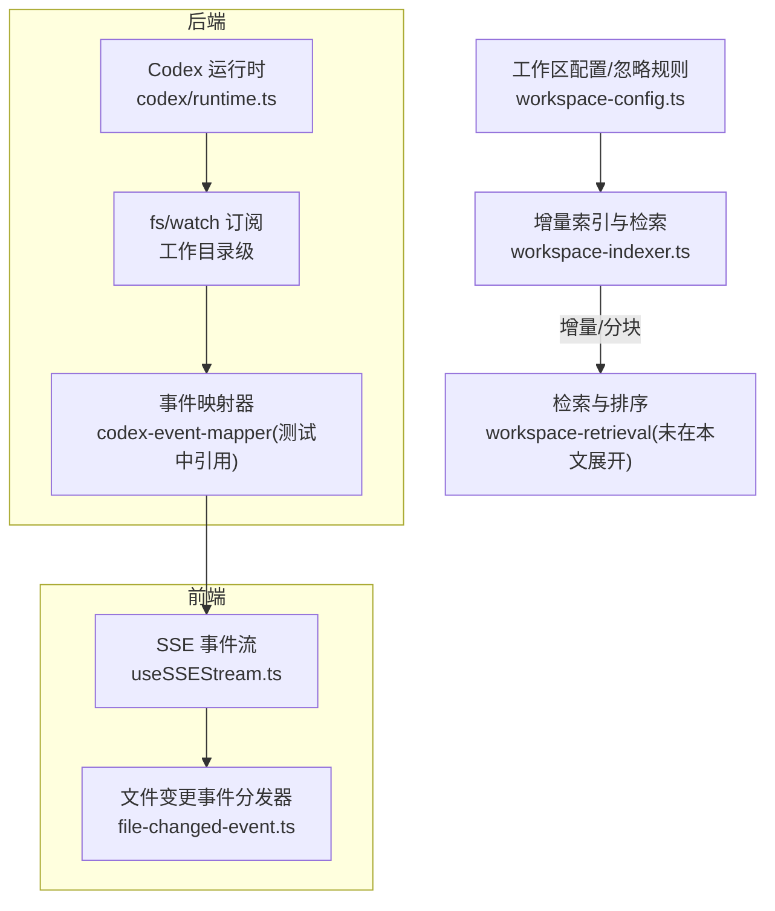
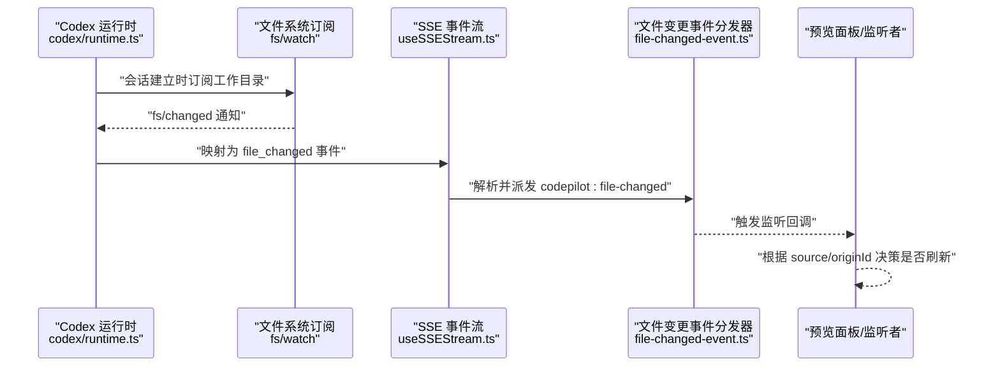
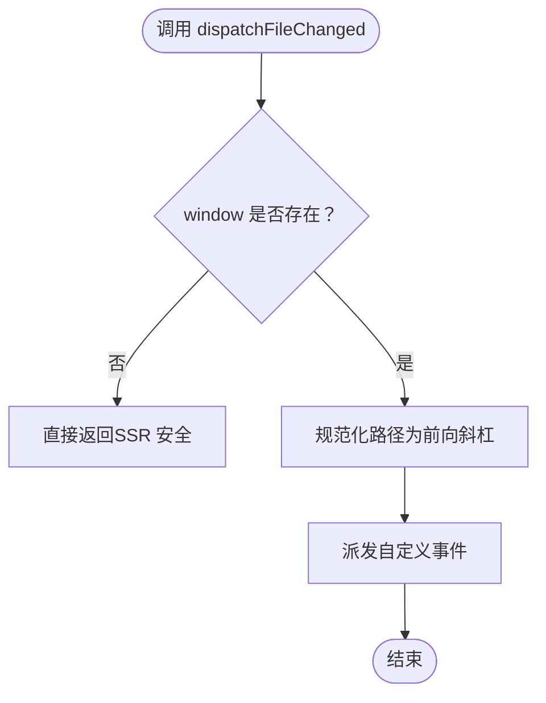
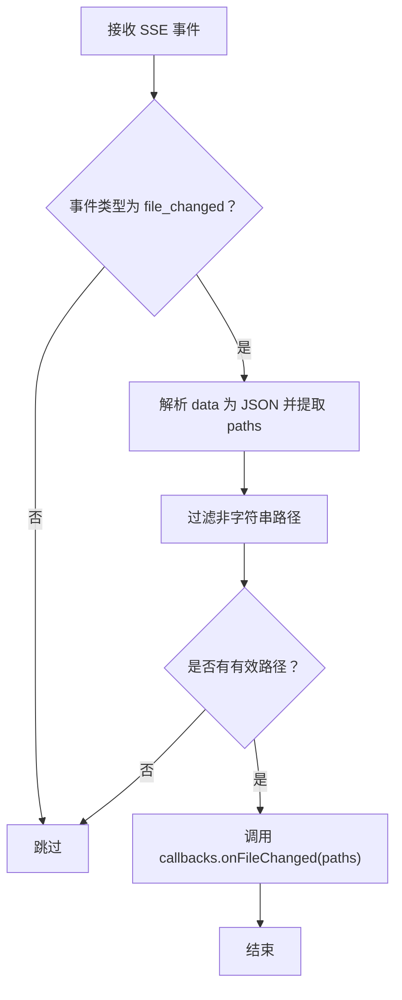
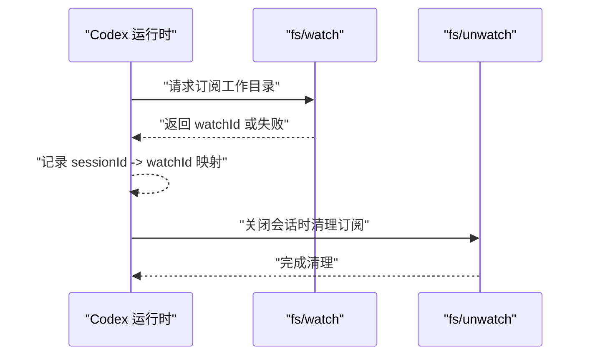
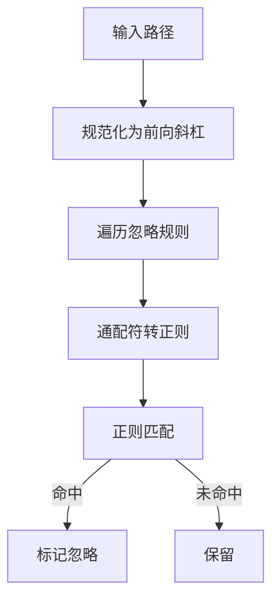
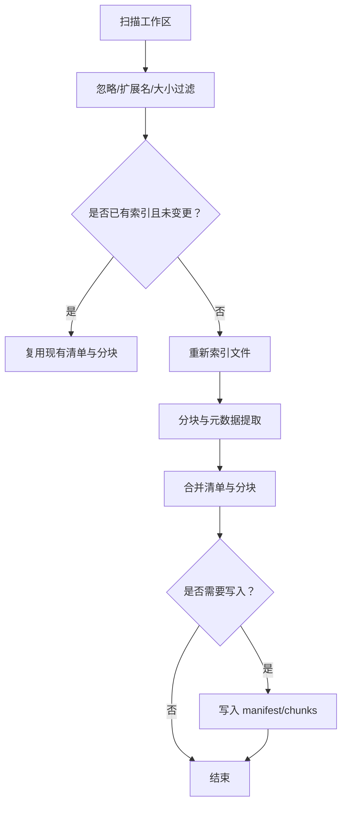
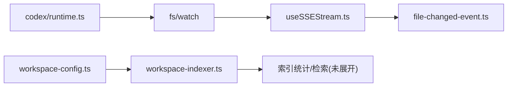

# 文件监控

<cite>
**本文引用的文件**
- [src/lib/file-changed-event.ts](file://src/lib/file-changed-event.ts)
- [src/hooks/useSSEStream.ts](file://src/hooks/useSSEStream.ts)
- [src/lib/stream-session-manager.ts](file://src/lib/stream-session-manager.ts)
- [src/lib/codex/runtime.ts](file://src/lib/codex/runtime.ts)
- [src/lib/workspace-config.ts](file://src/lib/workspace-config.ts)
- [src/lib/workspace-indexer.ts](file://src/lib/workspace-indexer.ts)
- [src/lib/files.ts](file://src/lib/files.ts)
- [src/app/api/files/route.ts](file://src/app/api/files/route.ts)
- [src/__tests__/unit/file-changed-event.test.ts](file://src/__tests__/unit/file-changed-event.test.ts)
- [src/__tests__/unit/codex-file-changed-dispatch.test.ts](file://src/__tests__/unit/codex-file-changed-dispatch.test.ts)
- [src/__tests__/unit/codex-review-round-3.test.ts](file://src/__tests__/unit/codex-review-round-3.test.ts)
</cite>

## 目录
1. [简介](#简介)
2. [项目结构](#项目结构)
3. [核心组件](#核心组件)
4. [架构总览](#架构总览)
5. [组件详解](#组件详解)
6. [依赖关系分析](#依赖关系分析)
7. [性能考量](#性能考量)
8. [故障排查指南](#故障排查指南)
9. [结论](#结论)
10. [附录](#附录)

## 简介
本文件面向“文件监控”主题，系统性阐述代码库中的文件变更监听机制、实时更新与增量同步策略。重点覆盖以下方面：
- 文件系统事件处理：从 Codex 运行时到前端 SSE 通道，再到统一的浏览器自定义事件分发链路
- 监控配置与忽略规则：工作区配置、通配符匹配与路径安全校验
- 增量同步与索引：基于时间戳与哈希的增量更新、分块索引与热数据提升
- 删除、重命名与内容变更的检测逻辑：通过工作目录级 fs/watch 订阅与事件映射实现
- 批量处理与可靠性：事件去抖、错误恢复与最佳努力（best-effort）策略
- 具体代码示例：以测试用例定位关键实现位置，便于读者快速溯源

## 项目结构
围绕文件监控的关键模块分布如下：
- 前端事件通道与消费：统一的自定义事件分发器、SSE 事件解析与回调桥接
- 后端运行时与订阅：Codex 运行时对工作目录进行 fs/watch 订阅，并在关闭会话时清理
- 工作区配置与忽略：通配符模式转换为正则表达式，用于过滤不参与索引或监控的路径
- 增量索引与检索：按文件修改时间与大小限制进行增量重建，支持分块与热数据提升

图表来源
- [src/hooks/useSSEStream.ts:312-328](file://src/hooks/useSSEStream.ts#L312-L328)
- [src/lib/file-changed-event.ts:50-59](file://src/lib/file-changed-event.ts#L50-L59)
- [src/lib/codex/runtime.ts:695-706](file://src/lib/codex/runtime.ts#L695-L706)
- [src/lib/workspace-config.ts:111-118](file://src/lib/workspace-config.ts#L111-L118)
- [src/lib/workspace-indexer.ts:300-371](file://src/lib/workspace-indexer.ts#L300-L371)

章节来源
- [src/lib/file-changed-event.ts:1-73](file://src/lib/file-changed-event.ts#L1-L73)
- [src/hooks/useSSEStream.ts:307-346](file://src/hooks/useSSEStream.ts#L307-L346)
- [src/lib/stream-session-manager.ts:953-997](file://src/lib/stream-session-manager.ts#L953-L997)
- [src/lib/codex/runtime.ts:222-234](file://src/lib/codex/runtime.ts#L222-L234)
- [src/lib/workspace-config.ts:111-118](file://src/lib/workspace-config.ts#L111-L118)
- [src/lib/workspace-indexer.ts:300-371](file://src/lib/workspace-indexer.ts#L300-L371)

## 核心组件
- 统一文件变更事件分发器：负责在浏览器环境派发标准化的自定义事件，确保前后端写入与用户保存行为走同一监听路径
- SSE 事件解析与回调桥接：将 Codex 发出的专用事件类型映射到前端回调，触发刷新
- Codex 运行时文件系统订阅：在会话建立时对工作目录发起 fs/watch 订阅，并在关闭时清理
- 工作区配置与忽略规则：提供默认忽略列表与通配符到正则的转换函数
- 增量索引与分块：基于文件修改时间与大小限制进行增量重建，支持分块与热数据提升

章节来源
- [src/lib/file-changed-event.ts:21-72](file://src/lib/file-changed-event.ts#L21-L72)
- [src/hooks/useSSEStream.ts:312-328](file://src/hooks/useSSEStream.ts#L312-L328)
- [src/lib/codex/runtime.ts:695-706](file://src/lib/codex/runtime.ts#L695-L706)
- [src/lib/workspace-config.ts:79-118](file://src/lib/workspace-config.ts#L79-L118)
- [src/lib/workspace-indexer.ts:14-88](file://src/lib/workspace-indexer.ts#L14-L88)

## 架构总览
下图展示了从 Codex 运行时到前端的完整文件变更通知链路，以及与工作区配置和索引系统的交互。

图表来源
- [src/lib/codex/runtime.ts:695-706](file://src/lib/codex/runtime.ts#L695-L706)
- [src/hooks/useSSEStream.ts:312-328](file://src/hooks/useSSEStream.ts#L312-L328)
- [src/lib/file-changed-event.ts:50-59](file://src/lib/file-changed-event.ts#L50-L59)

章节来源
- [src/lib/codex/runtime.ts:695-706](file://src/lib/codex/runtime.ts#L695-L706)
- [src/hooks/useSSEStream.ts:312-328](file://src/hooks/useSSEStream.ts#L312-L328)
- [src/lib/file-changed-event.ts:50-59](file://src/lib/file-changed-event.ts#L50-L59)

## 组件详解

### 统一文件变更事件通道
- 事件名称与来源枚举：定义了事件名与来源类型，用于区分 AI 写入、预览保存与外部写入
- 详情结构：包含路径数组、来源与可选的 originId，用于避免自回声
- 分发逻辑：在浏览器环境下将路径规范化为前向斜杠；在 SSR/无窗口环境下无操作
- 类型守卫：对事件详情进行类型检查，确保监听者安全使用

图表来源
- [src/lib/file-changed-event.ts:50-59](file://src/lib/file-changed-event.ts#L50-L59)

章节来源
- [src/lib/file-changed-event.ts:21-72](file://src/lib/file-changed-event.ts#L21-L72)
- [src/__tests__/unit/file-changed-event.test.ts:82-182](file://src/__tests__/unit/file-changed-event.test.ts#L82-L182)

### SSE 事件到前端回调的映射
- 事件类型：SSE 事件类型联合中包含 file_changed
- 解析与过滤：从事件数据解析 paths 数组，过滤非字符串项，再调用回调
- 回调声明：onFileChanged 可选，允许监听者选择性接入

图表来源
- [src/hooks/useSSEStream.ts:312-328](file://src/hooks/useSSEStream.ts#L312-L328)

章节来源
- [src/hooks/useSSEStream.ts:312-328](file://src/hooks/useSSEStream.ts#L312-L328)
- [src/__tests__/unit/codex-file-changed-dispatch.test.ts:49-95](file://src/__tests__/unit/codex-file-changed-dispatch.test.ts#L49-L95)

### Codex 运行时的文件系统订阅与生命周期
- 订阅策略：在会话建立后对工作目录发起 fs/watch 订阅，watchId 与会话绑定
- 生命周期：关闭会话时发送 fs/unwatch 清理，防止资源泄漏
- 最佳努力：订阅失败不影响会话继续，但预览自动刷新退化为仅依赖文件变更项

图表来源
- [src/lib/codex/runtime.ts:695-706](file://src/lib/codex/runtime.ts#L695-L706)
- [src/__tests__/unit/codex-review-round-3.test.ts:133-167](file://src/__tests__/unit/codex-review-round-3.test.ts#L133-L167)

章节来源
- [src/lib/codex/runtime.ts:222-234](file://src/lib/codex/runtime.ts#L222-L234)
- [src/lib/codex/runtime.ts:695-706](file://src/lib/codex/runtime.ts#L695-L706)
- [src/__tests__/unit/codex-review-round-3.test.ts:133-167](file://src/__tests__/unit/codex-review-round-3.test.ts#L133-L167)

### 工作区配置与忽略规则
- 默认忽略列表：包含常见隐藏目录与二进制扩展名等
- 通配符到正则：支持 **、*、? 等，适配跨平台路径分隔符
- 忽略判定：将路径规范化为前向斜杠后逐条匹配

图表来源
- [src/lib/workspace-config.ts:79-118](file://src/lib/workspace-config.ts#L79-L118)

章节来源
- [src/lib/workspace-config.ts:16-34](file://src/lib/workspace-config.ts#L16-L34)
- [src/lib/workspace-config.ts:79-118](file://src/lib/workspace-config.ts#L79-L118)

### 增量索引与分块
- 遍历与过滤：递归遍历工作区，应用忽略规则、扩展名白名单与大小上限
- 增量判断：比较文件修改时间，未变化则复用旧索引
- 分块策略：按标题与段落切分，支持重叠长度
- 写入策略：仅在有变更或强制重建时写入清单与分块文件

图表来源
- [src/lib/workspace-indexer.ts:255-298](file://src/lib/workspace-indexer.ts#L255-L298)
- [src/lib/workspace-indexer.ts:300-371](file://src/lib/workspace-indexer.ts#L300-L371)
- [src/lib/workspace-indexer.ts:14-88](file://src/lib/workspace-indexer.ts#L14-L88)

章节来源
- [src/lib/workspace-indexer.ts:255-298](file://src/lib/workspace-indexer.ts#L255-L298)
- [src/lib/workspace-indexer.ts:300-371](file://src/lib/workspace-indexer.ts#L300-L371)
- [src/lib/workspace-indexer.ts:14-88](file://src/lib/workspace-indexer.ts#L14-L88)

### 文件删除、重命名与内容变更的检测逻辑
- 删除检测：索引统计时若无法 stat 或 mtime 超过记录，则计为陈旧，视为删除
- 重命名检测：当前实现未显式处理重命名；可通过工作目录级订阅与路径规范化配合，结合 originId 避免自回声
- 内容变更：通过修改时间戳与哈希对比实现增量重建；SSE 事件映射确保前端感知

章节来源
- [src/lib/workspace-indexer.ts:192-208](file://src/lib/workspace-indexer.ts#L192-L208)
- [src/lib/workspace-indexer.ts:407-427](file://src/lib/workspace-indexer.ts#L407-L427)
- [src/lib/codex/runtime.ts:695-706](file://src/lib/codex/runtime.ts#L695-L706)
- [src/hooks/useSSEStream.ts:312-328](file://src/hooks/useSSEStream.ts#L312-L328)

### 监控范围配置、忽略规则与批量处理
- 监控范围：以会话工作目录为单位进行 fs/watch 订阅，确保跨命令写入也能被发现
- 忽略规则：默认忽略常见隐藏目录与二进制文件，支持通配符
- 批量处理：SSE 事件中的 paths 数组可承载多路径；前端过滤无效路径后批量触发刷新

章节来源
- [src/lib/codex/runtime.ts:695-706](file://src/lib/codex/runtime.ts#L695-L706)
- [src/lib/workspace-config.ts:16-34](file://src/lib/workspace-config.ts#L16-L34)
- [src/hooks/useSSEStream.ts:312-328](file://src/hooks/useSSEStream.ts#L312-L328)

### 可靠性保证与错误恢复
- 最佳努力订阅：订阅失败不会中断会话，预览自动刷新退化为文件变更项
- 错误容忍：SSE 事件解析对异常负载进行静默丢弃，避免影响主事件流
- 资源清理：关闭会话时主动取消订阅，防止泄漏
- 路径安全：文件 I/O 侧提供路径安全校验、符号链接检测与跨基座逃逸防护

章节来源
- [src/lib/codex/runtime.ts:691-706](file://src/lib/codex/runtime.ts#L691-L706)
- [src/hooks/useSSEStream.ts:322-326](file://src/hooks/useSSEStream.ts#L322-L326)
- [src/lib/files.ts:348-459](file://src/lib/files.ts#L348-L459)

## 依赖关系分析
- 前端依赖：SSE 流解析依赖于事件类型联合与回调接口；事件分发器依赖于浏览器环境
- 后端依赖：Codex 运行时依赖 fs/watch 接口；事件映射器负责将底层通知转换为 SSE 专用事件
- 配置与索引：工作区配置驱动索引扫描与忽略；索引输出供检索与统计使用

图表来源
- [src/hooks/useSSEStream.ts:312-328](file://src/hooks/useSSEStream.ts#L312-L328)
- [src/lib/file-changed-event.ts:50-59](file://src/lib/file-changed-event.ts#L50-L59)
- [src/lib/codex/runtime.ts:695-706](file://src/lib/codex/runtime.ts#L695-L706)
- [src/lib/workspace-config.ts:111-118](file://src/lib/workspace-config.ts#L111-L118)
- [src/lib/workspace-indexer.ts:300-371](file://src/lib/workspace-indexer.ts#L300-L371)

章节来源
- [src/hooks/useSSEStream.ts:312-328](file://src/hooks/useSSEStream.ts#L312-L328)
- [src/lib/file-changed-event.ts:50-59](file://src/lib/file-changed-event.ts#L50-L59)
- [src/lib/codex/runtime.ts:695-706](file://src/lib/codex/runtime.ts#L695-L706)
- [src/lib/workspace-config.ts:111-118](file://src/lib/workspace-config.ts#L111-L118)
- [src/lib/workspace-indexer.ts:300-371](file://src/lib/workspace-indexer.ts#L300-L371)

## 性能考量
- 增量索引：仅对变更文件重新索引，减少 I/O 与 CPU 开销
- 分块与重叠：分块时保留重叠区域，提升检索连贯性
- 行数与字节上限：预览与索引均设置上限，避免大文件拖慢系统
- 通配符匹配：忽略规则采用正则匹配，建议精简规则以降低匹配成本

## 故障排查指南
- 事件未到达前端：检查 SSE 事件类型是否包含 file_changed，确认解析分支是否正确调用回调
- 自回声问题：利用 originId 字段避免自身写入导致的重复刷新
- 订阅失败：Codex 运行时对订阅采取最佳努力策略，若失败需检查工作目录权限与路径有效性
- 路径安全：文件 I/O 侧提供严格的安全校验，遇到拒绝写入时优先检查路径是否位于受保护目录或越界

章节来源
- [src/__tests__/unit/codex-file-changed-dispatch.test.ts:49-95](file://src/__tests__/unit/codex-file-changed-dispatch.test.ts#L49-L95)
- [src/lib/file-changed-event.ts:36-42](file://src/lib/file-changed-event.ts#L36-L42)
- [src/lib/codex/runtime.ts:691-706](file://src/lib/codex/runtime.ts#L691-L706)
- [src/lib/files.ts:348-459](file://src/lib/files.ts#L348-L459)

## 结论
本文件监控体系以“工作目录级订阅 + 统一事件通道 + 增量索引”为核心，实现了对文件删除、重命名与内容变更的可靠检测与实时响应。通过忽略规则与路径安全校验，兼顾了易用性与安全性；通过最佳努力策略与错误容忍，保障了在异常场景下的稳定性。建议在实际部署中结合业务需求进一步优化忽略规则与索引参数，以获得更佳的性能与体验。

## 附录
- 关键实现定位（以测试用例为索引）：
  - 统一文件变更事件分发与类型守卫：[src/lib/file-changed-event.ts:50-72](file://src/lib/file-changed-event.ts#L50-L72)
  - SSE 到前端回调映射与过滤：[src/hooks/useSSEStream.ts:312-328](file://src/hooks/useSSEStream.ts#L312-L328)
  - Codex 运行时订阅与清理：[src/lib/codex/runtime.ts:695-706](file://src/lib/codex/runtime.ts#L695-L706)
  - 工作区配置与忽略规则：[src/lib/workspace-config.ts:16-34](file://src/lib/workspace-config.ts#L16-L34), [src/lib/workspace-config.ts:111-118](file://src/lib/workspace-config.ts#L111-L118)
  - 增量索引与分块：[src/lib/workspace-indexer.ts:300-371](file://src/lib/workspace-indexer.ts#L300-L371), [src/lib/workspace-indexer.ts:14-88](file://src/lib/workspace-indexer.ts#L14-L88)
  - 文件 I/O 安全校验与路径断言：[src/lib/files.ts:348-459](file://src/lib/files.ts#L348-L459)
  - API 路由中的根路径保护（与文件监控相关联的边界条件）：[src/app/api/files/route.ts](file://src/app/api/files/route.ts#L29)