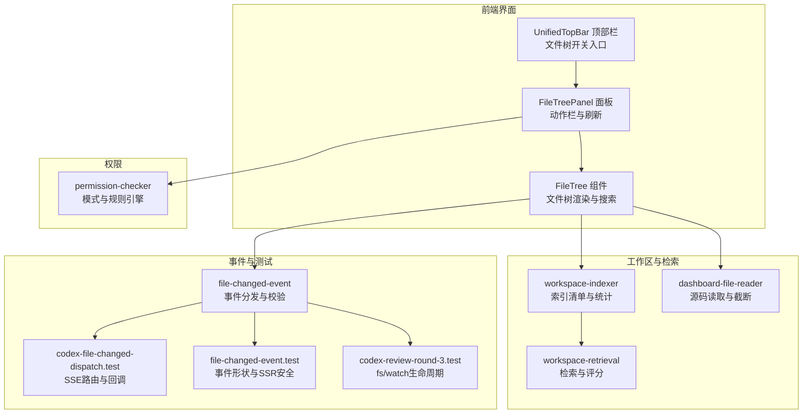
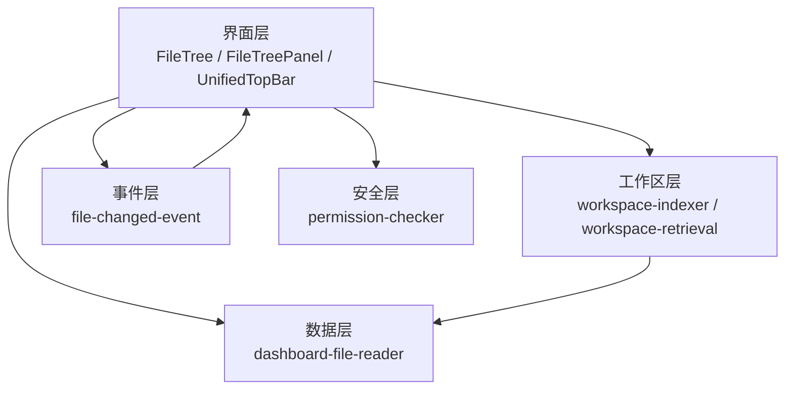
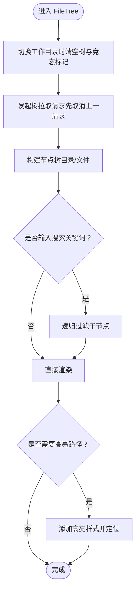
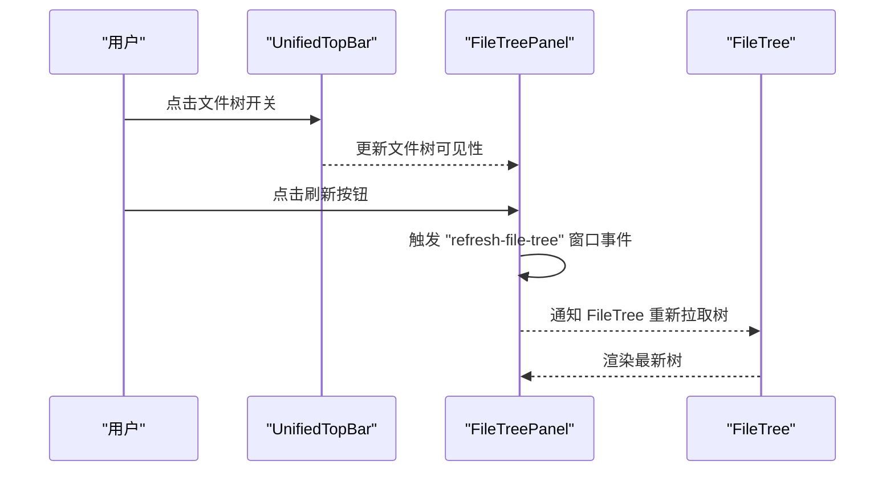
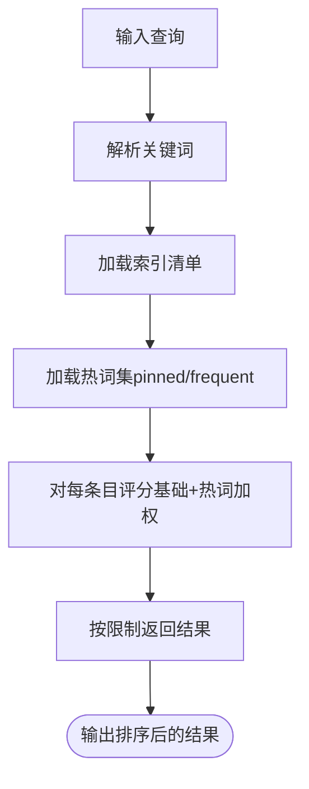
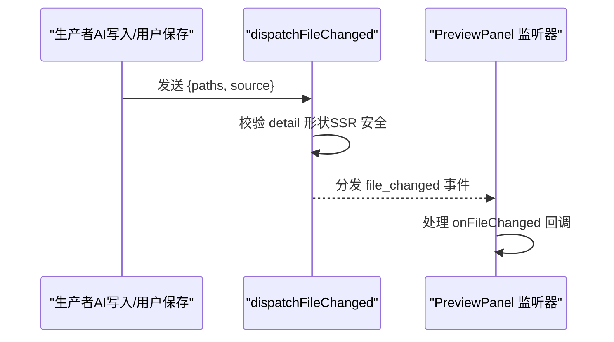
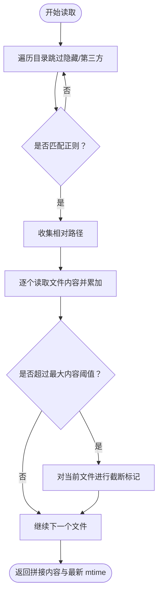
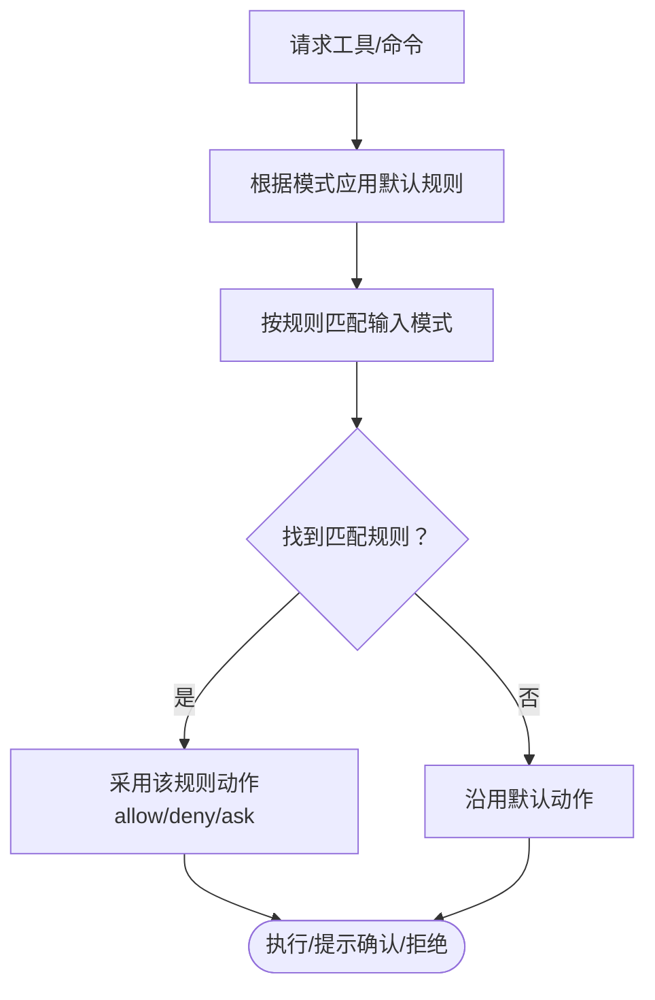
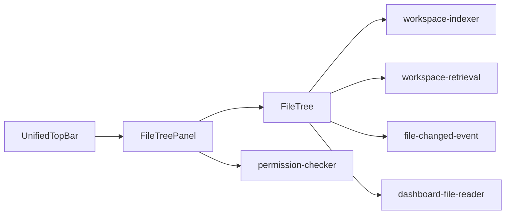

# 文件管理系统

<cite>
**本文引用的文件**
- [FileTree.tsx](file://src/components/project/FileTree.tsx)
- [FileTreePanel.tsx](file://src/components/layout/panels/FileTreePanel.tsx)
- [UnifiedTopBar.tsx](file://src/components/layout/UnifiedTopBar.tsx)
- [workspace-indexer.ts](file://src/lib/workspace-indexer.ts)
- [workspace-retrieval.ts](file://src/lib/workspace-retrieval.ts)
- [file-changed-event.ts](file://src/lib/file-changed-event.ts)
- [codex-file-changed-dispatch.test.ts](file://src/__tests__/unit/codex-file-changed-dispatch.test.ts)
- [file-changed-event.test.ts](file://src/__tests__/unit/file-changed-event.test.ts)
- [codex-review-round-3.test.ts](file://src/__tests__/unit/codex-review-round-3.test.ts)
- [files-suggest-route.test.ts](file://src/__tests__/unit/files-suggest-route.test.ts)
- [dashboard-file-reader.ts](file://src/lib/dashboard-file-reader.ts)
- [permission-checker.ts](file://src/lib/permission-checker.ts)
</cite>

## 目录
1. [简介](#简介)
2. [项目结构](#项目结构)
3. [核心组件](#核心组件)
4. [架构总览](#架构总览)
5. [详细组件分析](#详细组件分析)
6. [依赖关系分析](#依赖关系分析)
7. [性能考量](#性能考量)
8. [故障排查指南](#故障排查指南)
9. [结论](#结论)
10. [附录](#附录)

## 简介
本文件管理系统围绕“文件浏览组件”“工作区组织”“文件监控机制”三大主题展开，覆盖文件树结构、目录导航、文件预览、搜索与过滤、排序、文件变更监听、增量更新与缓存策略，以及权限控制与安全检查。文档通过代码级图示与路径引用，帮助读者快速理解并扩展系统能力。

## 项目结构
文件管理相关的关键位置如下：
- 前端文件树与面板：src/components/project/FileTree.tsx、src/components/layout/panels/FileTreePanel.tsx、src/components/layout/UnifiedTopBar.tsx
- 工作区索引与检索：src/lib/workspace-indexer.ts、src/lib/workspace-retrieval.ts
- 文件变更事件通道：src/lib/file-changed-event.ts 及其单元测试
- 搜索建议与文件读取：src/__tests__/unit/files-suggest-route.test.ts、src/lib/dashboard-file-reader.ts
- 权限控制：src/lib/permission-checker.ts

**图表来源**
- [FileTree.tsx:82-120](file://src/components/project/FileTree.tsx#L82-L120)
- [FileTreePanel.tsx:28-278](file://src/components/layout/panels/FileTreePanel.tsx#L28-L278)
- [UnifiedTopBar.tsx:362-394](file://src/components/layout/UnifiedTopBar.tsx#L362-L394)
- [workspace-indexer.ts:394-427](file://src/lib/workspace-indexer.ts#L394-L427)
- [workspace-retrieval.ts:149-197](file://src/lib/workspace-retrieval.ts#L149-L197)
- [file-changed-event.ts](file://src/lib/file-changed-event.ts)
- [codex-file-changed-dispatch.test.ts:64-95](file://src/__tests__/unit/codex-file-changed-dispatch.test.ts#L64-L95)
- [file-changed-event.test.ts:1-182](file://src/__tests__/unit/file-changed-event.test.ts#L1-L182)
- [codex-review-round-3.test.ts:133-149](file://src/__tests__/unit/codex-review-round-3.test.ts#L133-L149)
- [files-suggest-route.test.ts:64-86](file://src/__tests__/unit/files-suggest-route.test.ts#L64-L86)
- [dashboard-file-reader.ts:64-88](file://src/lib/dashboard-file-reader.ts#L64-L88)
- [permission-checker.ts:1-59](file://src/lib/permission-checker.ts#L1-L59)

**章节来源**
- [FileTree.tsx:82-120](file://src/components/project/FileTree.tsx#L82-L120)
- [FileTreePanel.tsx:28-278](file://src/components/layout/panels/FileTreePanel.tsx#L28-L278)
- [UnifiedTopBar.tsx:362-394](file://src/components/layout/UnifiedTopBar.tsx#L362-L394)
- [workspace-indexer.ts:394-427](file://src/lib/workspace-indexer.ts#L394-L427)
- [workspace-retrieval.ts:149-197](file://src/lib/workspace-retrieval.ts#L149-L197)
- [file-changed-event.ts](file://src/lib/file-changed-event.ts)
- [codex-file-changed-dispatch.test.ts:64-95](file://src/__tests__/unit/codex-file-changed-dispatch.test.ts#L64-L95)
- [file-changed-event.test.ts:1-182](file://src/__tests__/unit/file-changed-event.test.ts#L1-L182)
- [codex-review-round-3.test.ts:133-149](file://src/__tests__/unit/codex-review-round-3.test.ts#L133-L149)
- [files-suggest-route.test.ts:64-86](file://src/__tests__/unit/files-suggest-route.test.ts#L64-L86)
- [dashboard-file-reader.ts:64-88](file://src/lib/dashboard-file-reader.ts#L64-L88)
- [permission-checker.ts:1-59](file://src/lib/permission-checker.ts#L1-L59)

## 核心组件
- 文件树组件（FileTree）：负责构建树形结构、支持搜索过滤、高亮定位、递归渲染子节点。
- 文件树面板（FileTreePanel）：提供新建文件/文件夹、刷新、挂载到侧边栏等交互入口。
- 顶部栏入口（UnifiedTopBar）：提供独立的文件树开关按钮，支持与工作区侧边栏并行显示。
- 工作区索引器（workspace-indexer）：维护清单、统计索引状态、计算过期项。
- 工作区检索（workspace-retrieval）：基于关键词与热词集对清单条目进行评分与排序。
- 文件变更事件（file-changed-event）：定义事件形状、分发与监听，保障 SSR 安全。
- 源码读取（dashboard-file-reader）：按相对路径批量读取文件内容，带大小与时间戳控制。
- 权限检查（permission-checker）：基于模式与规则引擎执行权限判定。

**章节来源**
- [FileTree.tsx:82-120](file://src/components/project/FileTree.tsx#L82-L120)
- [FileTreePanel.tsx:28-278](file://src/components/layout/panels/FileTreePanel.tsx#L28-L278)
- [UnifiedTopBar.tsx:362-394](file://src/components/layout/UnifiedTopBar.tsx#L362-L394)
- [workspace-indexer.ts:394-427](file://src/lib/workspace-indexer.ts#L394-L427)
- [workspace-retrieval.ts:149-197](file://src/lib/workspace-retrieval.ts#L149-L197)
- [file-changed-event.ts](file://src/lib/file-changed-event.ts)
- [dashboard-file-reader.ts:64-88](file://src/lib/dashboard-file-reader.ts#L64-L88)
- [permission-checker.ts:1-59](file://src/lib/permission-checker.ts#L1-L59)

## 架构总览
文件管理由“界面层（文件树/面板/顶部栏）—工作区层（索引/检索）—事件层（变更分发）—数据层（源码读取）—安全层（权限检查）”构成，形成闭环的数据流与控制流。

**图表来源**
- [FileTree.tsx:82-120](file://src/components/project/FileTree.tsx#L82-L120)
- [FileTreePanel.tsx:28-278](file://src/components/layout/panels/FileTreePanel.tsx#L28-L278)
- [workspace-indexer.ts:394-427](file://src/lib/workspace-indexer.ts#L394-L427)
- [workspace-retrieval.ts:149-197](file://src/lib/workspace-retrieval.ts#L149-L197)
- [file-changed-event.ts](file://src/lib/file-changed-event.ts)
- [dashboard-file-reader.ts:64-88](file://src/lib/dashboard-file-reader.ts#L64-L88)
- [permission-checker.ts:1-59](file://src/lib/permission-checker.ts#L1-L59)

## 详细组件分析

### 文件树组件（FileTree）
- 结构与职责
  - 接收工作目录与选择回调，内部维护树、加载状态、错误信息与搜索查询。
  - 提供过滤函数，按关键词递归筛选目录与文件节点，并支持高亮命中路径。
  - 渲染时区分目录与文件，为目录递归渲染子节点，为文件设置图标与高亮样式。
- 关键流程
  - 切换工作目录时清理旧树与竞态标记，避免跨会话高亮冲突。
  - 拉取树数据前先取消上一次请求，保证并发安全。
- 代码片段路径
  - [过滤与渲染逻辑:82-120](file://src/components/project/FileTree.tsx#L82-L120)
  - [父路径提取工具:126-136](file://src/components/project/FileTree.tsx#L126-L136)
  - [树拉取与清理逻辑:138-155](file://src/components/project/FileTree.tsx#L138-L155)

**图表来源**
- [FileTree.tsx:138-155](file://src/components/project/FileTree.tsx#L138-L155)
- [FileTree.tsx:82-120](file://src/components/project/FileTree.tsx#L82-L120)
- [FileTree.tsx:126-136](file://src/components/project/FileTree.tsx#L126-L136)

**章节来源**
- [FileTree.tsx:82-120](file://src/components/project/FileTree.tsx#L82-L120)
- [FileTree.tsx:126-136](file://src/components/project/FileTree.tsx#L126-L136)
- [FileTree.tsx:138-155](file://src/components/project/FileTree.tsx#L138-L155)

### 文件树面板（FileTreePanel）
- 功能要点
  - 提供新建文件（Markdown）、新建文件夹、刷新按钮的动作栏。
  - 支持将文件树固定到工作区侧边栏，在聊天详情页内可与侧边栏并行显示。
  - 通过窗口事件触发刷新，避免状态提升。
- 代码片段路径
  - [动作栏与刷新事件:247-278](file://src/components/layout/panels/FileTreePanel.tsx#L247-L278)
  - [固定到侧边栏入口:35-38](file://src/components/layout/panels/FileTreePanel.tsx#L35-L38)
  - [顶部栏文件树开关入口:362-394](file://src/components/layout/UnifiedTopBar.tsx#L362-L394)

**图表来源**
- [UnifiedTopBar.tsx:362-394](file://src/components/layout/UnifiedTopBar.tsx#L362-L394)
- [FileTreePanel.tsx:247-278](file://src/components/layout/panels/FileTreePanel.tsx#L247-L278)
- [FileTree.tsx:138-155](file://src/components/project/FileTree.tsx#L138-L155)

**章节来源**
- [FileTreePanel.tsx:247-278](file://src/components/layout/panels/FileTreePanel.tsx#L247-L278)
- [UnifiedTopBar.tsx:362-394](file://src/components/layout/UnifiedTopBar.tsx#L362-L394)

### 工作区索引与检索（workspace-indexer / workspace-retrieval）
- 索引器（workspace-indexer）
  - 提供索引清单统计接口，计算文件数、块数、最后索引时间与过期项数量。
  - 对每个清单条目检查磁盘状态，若已变更或删除则计入过期。
- 检索器（workspace-retrieval）
  - 解析查询关键词，基于清单条目进行基础评分。
  - 引入热词集（pinned/frequent）进行加权，提升常用文件的排序权重。
  - 返回限定数量的结果列表。
- 代码片段路径
  - [索引统计:394-427](file://src/lib/workspace-indexer.ts#L394-L427)
  - [检索评分与排序:149-197](file://src/lib/workspace-retrieval.ts#L149-L197)

**图表来源**
- [workspace-indexer.ts:394-427](file://src/lib/workspace-indexer.ts#L394-L427)
- [workspace-retrieval.ts:149-197](file://src/lib/workspace-retrieval.ts#L149-L197)

**章节来源**
- [workspace-indexer.ts:394-427](file://src/lib/workspace-indexer.ts#L394-L427)
- [workspace-retrieval.ts:149-197](file://src/lib/workspace-retrieval.ts#L149-L197)

### 文件变更监听与事件通道（file-changed-event）
- 事件定义与校验
  - 事件形状包含路径数组与来源字段，来源需为受控枚举；路径必须为字符串数组。
  - 在 SSR 环境下无 window 时，分发为无操作，确保运行安全。
- 测试验证
  - 单测覆盖 SSE 回调路由到 onFileChanged 的分支。
  - 单测覆盖事件细节校验与 SSR 安全。
  - 单测覆盖从已完成任务合成 file_changed 事件的逻辑与过滤。
- 代码片段路径
  - [事件分发与校验](file://src/lib/file-changed-event.ts)
  - [SSE 回调路由:75-82](file://src/__tests__/unit/codex-file-changed-dispatch.test.ts#L75-L82)
  - [事件形状与 SSR 安全:151-181](file://src/__tests__/unit/file-changed-event.test.ts#L151-L181)
  - [从任务合成事件:70-130](file://src/__tests__/unit/codex-review-round-3.test.ts#L70-L130)

**图表来源**
- [file-changed-event.ts](file://src/lib/file-changed-event.ts)
- [codex-file-changed-dispatch.test.ts:75-82](file://src/__tests__/unit/codex-file-changed-dispatch.test.ts#L75-L82)
- [file-changed-event.test.ts:151-181](file://src/__tests__/unit/file-changed-event.test.ts#L151-L181)
- [codex-review-round-3.test.ts:70-130](file://src/__tests__/unit/codex-review-round-3.test.ts#L70-L130)

**章节来源**
- [file-changed-event.ts](file://src/lib/file-changed-event.ts)
- [codex-file-changed-dispatch.test.ts:75-82](file://src/__tests__/unit/codex-file-changed-dispatch.test.ts#L75-L82)
- [file-changed-event.test.ts:151-181](file://src/__tests__/unit/file-changed-event.test.ts#L151-L181)
- [codex-review-round-3.test.ts:70-130](file://src/__tests__/unit/codex-review-round-3.test.ts#L70-L130)

### 源码读取与搜索建议（dashboard-file-reader / files-suggest-route）
- 源码读取
  - 按相对路径批量读取文件内容，记录最新修改时间；超过最大内容阈值时对单文件进行截断。
  - 遍历目录时跳过隐藏文件与 node_modules，深度限制防止递归过深。
- 搜索建议
  - 提供 suggest API，返回相对路径、类型与显示名，目录项末尾带斜杠。
- 代码片段路径
  - [目录遍历与匹配:44-62](file://src/lib/dashboard-file-reader.ts#L44-L62)
  - [批量读取与截断:64-88](file://src/lib/dashboard-file-reader.ts#L64-L88)
  - [搜索建议接口测试:64-86](file://src/__tests__/unit/files-suggest-route.test.ts#L64-L86)

**图表来源**
- [dashboard-file-reader.ts:44-88](file://src/lib/dashboard-file-reader.ts#L44-L88)
- [files-suggest-route.test.ts:64-86](file://src/__tests__/unit/files-suggest-route.test.ts#L64-L86)

**章节来源**
- [dashboard-file-reader.ts:44-88](file://src/lib/dashboard-file-reader.ts#L44-L88)
- [files-suggest-route.test.ts:64-86](file://src/__tests__/unit/files-suggest-route.test.ts#L64-L86)

### 权限控制与安全检查（permission-checker）
- 模式与规则
  - 三种模式：explore（只读）、normal（标准）、trust（全量）。
  - 规则引擎采用“后匹配优先”的查找策略，允许特定规则覆盖通用规则。
  - 对危险命令（如 rm -rf、kill、格式化）在任何模式下均需确认，除非显式允许。
- 代码片段路径
  - [模式与默认规则:38-59](file://src/lib/permission-checker.ts#L38-L59)
  - [规则与动作类型:20-34](file://src/lib/permission-checker.ts#L20-L34)

**图表来源**
- [permission-checker.ts:38-59](file://src/lib/permission-checker.ts#L38-L59)
- [permission-checker.ts:20-34](file://src/lib/permission-checker.ts#L20-L34)

**章节来源**
- [permission-checker.ts:1-59](file://src/lib/permission-checker.ts#L1-L59)

## 依赖关系分析
- 文件树组件依赖工作区索引器进行清单统计与检索，同时通过事件通道接收文件变更通知。
- 文件树面板作为入口，协调顶部栏与文件树组件的可见性与刷新行为。
- 源码读取模块为检索与预览提供数据支撑。
- 权限检查贯穿工具调用链，确保在不同模式下的安全边界。

**图表来源**
- [FileTree.tsx:82-120](file://src/components/project/FileTree.tsx#L82-L120)
- [FileTreePanel.tsx:28-278](file://src/components/layout/panels/FileTreePanel.tsx#L28-L278)
- [UnifiedTopBar.tsx:362-394](file://src/components/layout/UnifiedTopBar.tsx#L362-L394)
- [workspace-indexer.ts:394-427](file://src/lib/workspace-indexer.ts#L394-L427)
- [workspace-retrieval.ts:149-197](file://src/lib/workspace-retrieval.ts#L149-L197)
- [file-changed-event.ts](file://src/lib/file-changed-event.ts)
- [dashboard-file-reader.ts:64-88](file://src/lib/dashboard-file-reader.ts#L64-L88)
- [permission-checker.ts:1-59](file://src/lib/permission-checker.ts#L1-L59)

**章节来源**
- [FileTree.tsx:82-120](file://src/components/project/FileTree.tsx#L82-L120)
- [FileTreePanel.tsx:28-278](file://src/components/layout/panels/FileTreePanel.tsx#L28-L278)
- [UnifiedTopBar.tsx:362-394](file://src/components/layout/UnifiedTopBar.tsx#L362-L394)
- [workspace-indexer.ts:394-427](file://src/lib/workspace-indexer.ts#L394-L427)
- [workspace-retrieval.ts:149-197](file://src/lib/workspace-retrieval.ts#L149-L197)
- [file-changed-event.ts](file://src/lib/file-changed-event.ts)
- [dashboard-file-reader.ts:64-88](file://src/lib/dashboard-file-reader.ts#L64-L88)
- [permission-checker.ts:1-59](file://src/lib/permission-checker.ts#L1-L59)

## 性能考量
- 目录遍历与读取
  - 通过深度限制与跳过隐藏/第三方目录降低 IO 开销。
  - 批量读取时按阈值截断，避免超大文件拖慢响应。
- 检索评分
  - 使用热词集进行加权，减少无效扫描；限制返回数量，控制前端渲染压力。
- 并发与竞态
  - 文件树拉取前先取消上一请求，避免交叉会话的高亮与渲染冲突。
- 缓存策略
  - 索引清单与热词集用于“冷启动”阶段的快速评分；文件变更事件驱动增量更新，减少全量重算。

[本节为通用指导，无需列出具体文件来源]

## 故障排查指南
- 文件树不刷新
  - 检查是否正确触发“refresh-file-tree”窗口事件，确认 FileTree 是否收到刷新信号。
  - 参考：[刷新事件与面板交互:271-277](file://src/components/layout/panels/FileTreePanel.tsx#L271-L277)
- 搜索无结果
  - 确认工作区已索引；检查关键词解析与热词集配置。
  - 参考：[检索评分与排序:149-197](file://src/lib/workspace-retrieval.ts#L149-L197)
- 变更未生效
  - 确认事件分发与监听链路正常，检查事件形状与来源字段。
  - 参考：[事件分发与校验](file://src/lib/file-changed-event.ts)
- SSR 报错
  - 确保在无 window 环境下事件分发为无操作。
  - 参考：[SSR 安全测试:169-181](file://src/__tests__/unit/file-changed-event.test.ts#L169-L181)
- 权限被拒
  - 检查当前模式与规则匹配，必要时调整规则或切换模式。
  - 参考：[权限规则与模式:38-59](file://src/lib/permission-checker.ts#L38-L59)

**章节来源**
- [FileTreePanel.tsx:271-277](file://src/components/layout/panels/FileTreePanel.tsx#L271-L277)
- [workspace-retrieval.ts:149-197](file://src/lib/workspace-retrieval.ts#L149-L197)
- [file-changed-event.ts](file://src/lib/file-changed-event.ts)
- [file-changed-event.test.ts:169-181](file://src/__tests__/unit/file-changed-event.test.ts#L169-L181)
- [permission-checker.ts:38-59](file://src/lib/permission-checker.ts#L38-L59)

## 结论
本文件管理系统以文件树为核心入口，结合工作区索引与检索、事件驱动的变更通道、稳健的源码读取与权限控制，形成了高效、安全且可扩展的文件管理方案。通过合理的并发控制、增量更新与缓存策略，系统在复杂工程中仍能保持良好性能与用户体验。

[本节为总结性内容，无需列出具体文件来源]

## 附录
- 典型使用流程（文件操作与工作区管理）
  - 打开文件树面板 → 选择工作目录 → 搜索/过滤文件 → 选中文件进行编辑/预览 → 保存后通过事件通道通知监听器 → 若启用索引，后续检索将优先返回热词与高分结果。
- 代码示例路径（仅路径，不含代码内容）
  - [文件树渲染与过滤:82-120](file://src/components/project/FileTree.tsx#L82-L120)
  - [面板动作与刷新:247-278](file://src/components/layout/panels/FileTreePanel.tsx#L247-L278)
  - [顶部栏开关入口:362-394](file://src/components/layout/UnifiedTopBar.tsx#L362-L394)
  - [索引统计与过期检测:394-427](file://src/lib/workspace-indexer.ts#L394-L427)
  - [检索评分与排序:149-197](file://src/lib/workspace-retrieval.ts#L149-L197)
  - [事件分发与校验](file://src/lib/file-changed-event.ts)
  - [源码读取与截断:64-88](file://src/lib/dashboard-file-reader.ts#L64-L88)
  - [权限规则与模式:38-59](file://src/lib/permission-checker.ts#L38-L59)

[本节为补充说明，无需列出具体文件来源]