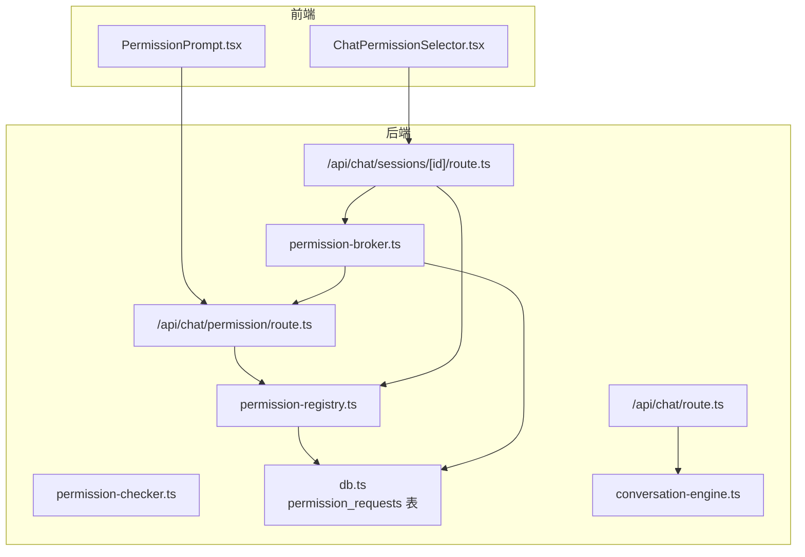
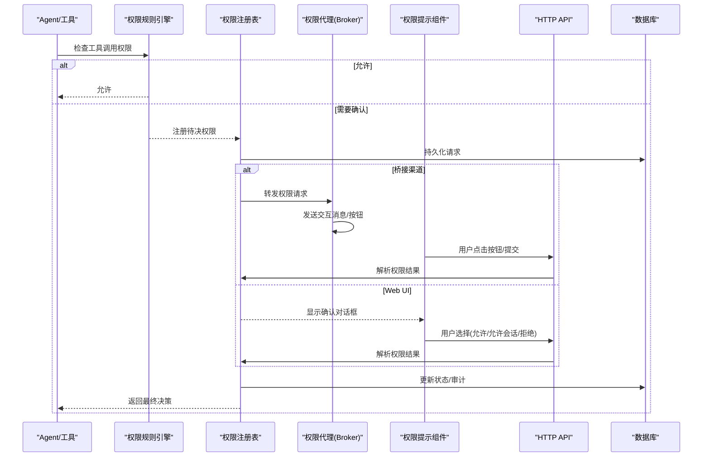
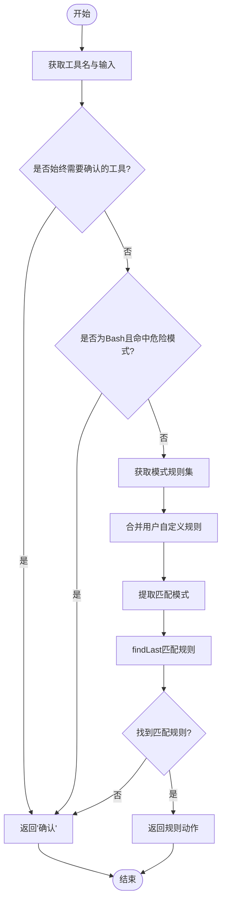
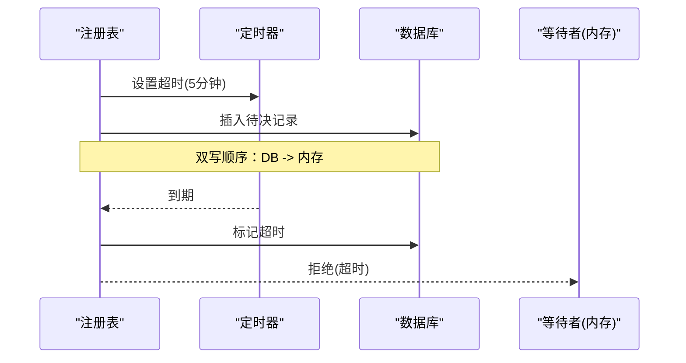
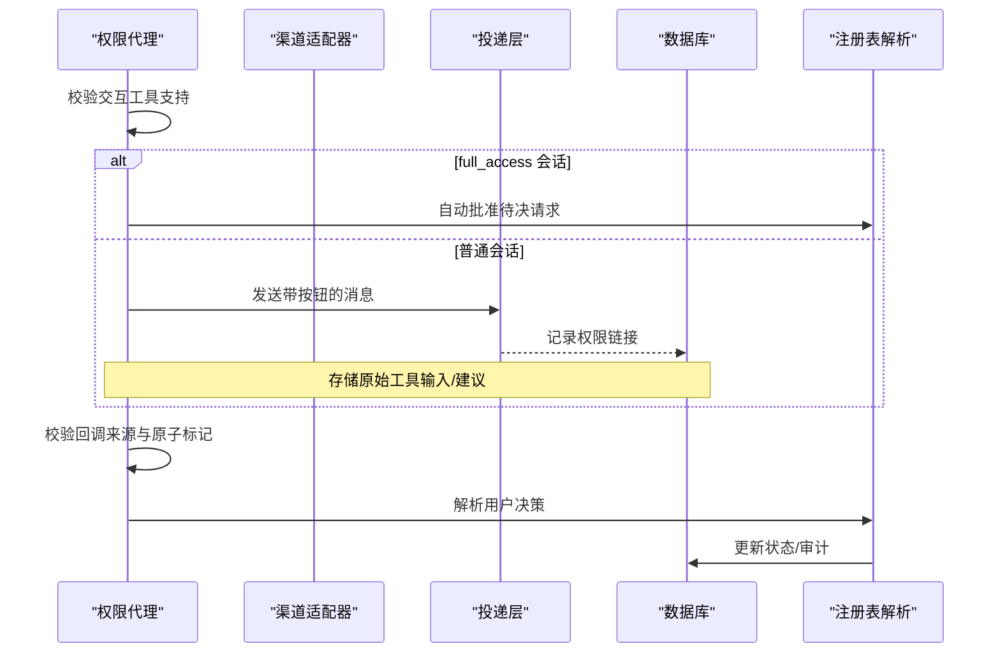
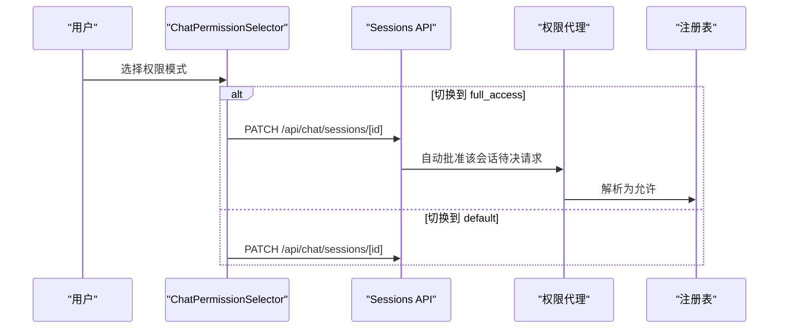
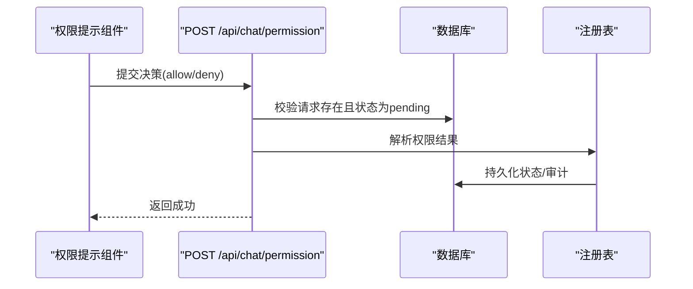
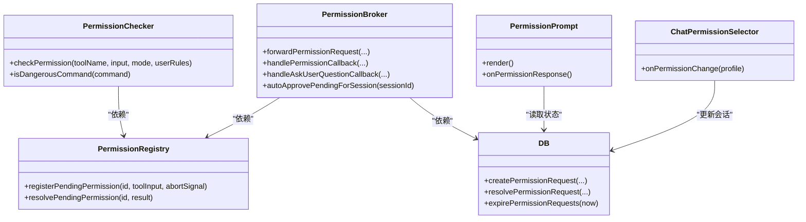

# 权限控制系统

<cite>
**本文档引用的文件**
- [permission-checker.ts](file://src/lib/permission-checker.ts)
- [permission-registry.ts](file://src/lib/permission-registry.ts)
- [permission-broker.ts](file://src/lib/bridge/permission-broker.ts)
- [route.ts](file://src/app/api/chat/permission/route.ts)
- [PermissionPrompt.tsx](file://src/components/chat/PermissionPrompt.tsx)
- [ChatPermissionSelector.tsx](file://src/components/chat/ChatPermissionSelector.tsx)
- [db.ts](file://src/lib/db.ts)
- [route.ts](file://src/app/api/chat/sessions/[id]/route.ts)
- [route.ts](file://src/app/api/chat/route.ts)
- [conversation-engine.ts](file://src/lib/bridge/conversation-engine.ts)
- [permission-broker-bridge.manual-test.ts](file://src/__tests__/unit/permission-broker-bridge.manual-test.ts)
</cite>

## 目录
1. [简介](#简介)
2. [项目结构](#项目结构)
3. [核心组件](#核心组件)
4. [架构总览](#架构总览)
5. [详细组件分析](#详细组件分析)
6. [依赖关系分析](#依赖关系分析)
7. [性能考虑](#性能考虑)
8. [故障排除指南](#故障排除指南)
9. [结论](#结论)
10. [附录](#附录)

## 简介
本文件系统性阐述 CodePilot 的权限控制系统，覆盖权限模型设计、三种模式（默认权限、全权限访问、逐动作批准）、权限检查机制、权限注册表、权限提示组件与桥接通道的协作流程。文档还包含权限验证流程、权限缓存策略、权限撤销与更新机制，并提供配置示例与安全最佳实践，解释如何实现细粒度权限控制与审计日志记录。

## 项目结构
权限控制涉及以下关键模块：
- 规则引擎与模式：permission-checker.ts
- 请求注册与超时：permission-registry.ts
- 桥接通道转发与回调：permission-broker.ts
- 前端权限提示与会话权限切换：PermissionPrompt.tsx、ChatPermissionSelector.tsx
- API 决策提交与持久化：route.ts（/api/chat/permission）、db.ts（permission_requests 表）
- 会话级权限配置与自动批准：route.ts（/api/chat/sessions/[id]）、conversation-engine.ts

图表来源
- [permission-checker.ts:1-247](file://src/lib/permission-checker.ts#L1-L247)
- [permission-registry.ts:1-128](file://src/lib/permission-registry.ts#L1-L128)
- [permission-broker.ts:1-501](file://src/lib/bridge/permission-broker.ts#L1-L501)
- [route.ts:1-75](file://src/app/api/chat/permission/route.ts#L1-L75)
- [route.ts:1-120](file://src/app/api/chat/sessions/[id]/route.ts#L1-L120)
- [route.ts:1-600](file://src/app/api/chat/route.ts#L1-L600)
- [conversation-engine.ts:1-400](file://src/lib/bridge/conversation-engine.ts#L1-L400)
- [db.ts:640-700](file://src/lib/db.ts#L640-L700)

章节来源
- [permission-checker.ts:1-247](file://src/lib/permission-checker.ts#L1-L247)
- [permission-registry.ts:1-128](file://src/lib/permission-registry.ts#L1-L128)
- [permission-broker.ts:1-501](file://src/lib/bridge/permission-broker.ts#L1-L501)
- [route.ts:1-75](file://src/app/api/chat/permission/route.ts#L1-L75)
- [route.ts:1-120](file://src/app/api/chat/sessions/[id]/route.ts#L1-L120)
- [route.ts:1-600](file://src/app/api/chat/route.ts#L1-L600)
- [conversation-engine.ts:1-400](file://src/lib/bridge/conversation-engine.ts#L1-L400)
- [db.ts:640-700](file://src/lib/db.ts#L640-L700)

## 核心组件
- 权限规则引擎：基于三种模式（探索/正常/信任）与通配规则匹配，支持危险命令强制确认。
- 权限注册表：管理待决权限请求，提供超时与中断处理，持久化到数据库。
- 权限代理（Broker）：在 IM 渠道中转发权限请求，处理按钮回调，支持会话级自动批准。
- 权限提示组件：在 Web 界面弹出确认对话框，支持“允许一次”“允许会话”“拒绝”。
- 会话权限选择器：在聊天界面切换默认/全权限模式，并通过 API 更新会话配置。
- 数据库层：维护 permission_requests 表，记录请求、状态、过期时间与审计信息。

章节来源
- [permission-checker.ts:1-247](file://src/lib/permission-checker.ts#L1-L247)
- [permission-registry.ts:1-128](file://src/lib/permission-registry.ts#L1-L128)
- [permission-broker.ts:1-501](file://src/lib/bridge/permission-broker.ts#L1-L501)
- [PermissionPrompt.tsx:1-538](file://src/components/chat/PermissionPrompt.tsx#L1-L538)
- [ChatPermissionSelector.tsx:1-133](file://src/components/chat/ChatPermissionSelector.tsx#L1-L133)
- [db.ts:640-700](file://src/lib/db.ts#L640-L700)

## 架构总览
权限控制采用“规则引擎 + 注册表 + 代理转发 + 前端提示”的分层设计。工具调用触发权限检查；若需要用户决策，则注册待决请求并通过桥接或 Web UI 展示；用户响应后由注册表解析并持久化审计记录。

图表来源
- [permission-checker.ts:127-168](file://src/lib/permission-checker.ts#L127-L168)
- [permission-registry.ts:51-92](file://src/lib/permission-registry.ts#L51-L92)
- [permission-broker.ts:134-314](file://src/lib/bridge/permission-broker.ts#L134-L314)
- [route.ts:10-74](file://src/app/api/chat/permission/route.ts#L10-L74)
- [db.ts:2125-2177](file://src/lib/db.ts#L2125-L2177)

## 详细组件分析

### 权限模型与规则引擎
- 模式定义
  - 探索模式：仅允许只读操作，写入与危险命令一律拒绝。
  - 正常模式：自动允许常见只读与编辑操作，对 Bash 命令要求确认；敏感文件仍需确认。
  - 信任模式：自动允许一切，但危险命令仍需确认。
- 危险命令检测：内置正则集合识别高危命令，强制用户确认。
- 规则匹配：findLast 语义，支持通配符“*”，按工具名与输入模式匹配。

图表来源
- [permission-checker.ts:127-168](file://src/lib/permission-checker.ts#L127-L168)
- [permission-checker.ts:179-186](file://src/lib/permission-checker.ts#L179-L186)
- [permission-checker.ts:194-210](file://src/lib/permission-checker.ts#L194-L210)
- [permission-checker.ts:216-230](file://src/lib/permission-checker.ts#L216-L230)
- [permission-checker.ts:237-246](file://src/lib/permission-checker.ts#L237-L246)

章节来源
- [permission-checker.ts:1-247](file://src/lib/permission-checker.ts#L1-L247)

### 权限注册表与缓存策略
- 待决请求存储：使用全局 Map（通过 globalThis）跨模块实例共享，避免开发模式下的模块隔离问题。
- 超时与中断：每条请求独立定时器，超时自动拒绝并持久化；AbortSignal 支持客户端断开或停止按钮触发拒绝。
- 持久化顺序：先写数据库再解析内存，DB 失败不影响内存路径。
- 缓存策略：注册表本身不缓存业务数据，但通过超时与去重（最近转发去重）提升并发安全性与用户体验。

图表来源
- [permission-registry.ts:51-92](file://src/lib/permission-registry.ts#L51-L92)
- [permission-registry.ts:98-127](file://src/lib/permission-registry.ts#L98-L127)

章节来源
- [permission-registry.ts:1-128](file://src/lib/permission-registry.ts#L1-L128)

### 权限代理（Broker）与桥接通道
- 通道适配：根据渠道类型决定是否支持内联按钮；不支持按钮的渠道使用文本命令形式。
- 交互工具保护：禁止在桥接会话中使用需要复杂交互的工具（如多选/多题），直接拒绝并给出明确原因。
- AskUserQuestion 特殊处理：在支持按钮的渠道渲染选项卡；在不支持的渠道直接拒绝。
- 会话级自动批准：当会话权限配置切换为 full_access 时，自动批准该会话中的待决请求。
- 回调校验：严格校验回调来源（chatId、messageId）与原子性标记，防止并发重复解析。

图表来源
- [permission-broker.ts:134-314](file://src/lib/bridge/permission-broker.ts#L134-L314)
- [permission-broker.ts:380-469](file://src/lib/bridge/permission-broker.ts#L380-L469)
- [permission-broker.ts:476-500](file://src/lib/bridge/permission-broker.ts#L476-L500)

章节来源
- [permission-broker.ts:1-501](file://src/lib/bridge/permission-broker.ts#L1-L501)

### 权限提示组件与会话权限切换
- 权限提示组件：针对不同工具类型渲染专用 UI（如 ExitPlanMode、AskUserQuestion），支持“允许一次”“允许会话”“拒绝”。在 full_access 模式下自动批准非交互工具。
- 会话权限选择器：在聊天界面切换默认/全权限模式；切换至 full_access 时弹出警告确认；通过 PATCH 请求更新会话配置。

图表来源
- [ChatPermissionSelector.tsx:31-67](file://src/components/chat/ChatPermissionSelector.tsx#L31-L67)
- [route.ts:72-79](file://src/app/api/chat/sessions/[id]/route.ts#L72-L79)
- [permission-broker.ts:476-500](file://src/lib/bridge/permission-broker.ts#L476-L500)

章节来源
- [PermissionPrompt.tsx:382-538](file://src/components/chat/PermissionPrompt.tsx#L382-L538)
- [ChatPermissionSelector.tsx:1-133](file://src/components/chat/ChatPermissionSelector.tsx#L1-L133)

### 权限验证流程与 API
- Web 端决策：用户在前端点击按钮后，向 /api/chat/permission 提交决策；后端校验 DB 中待决状态，解析并返回成功。
- 审计与持久化：无论允许/拒绝/超时/中断，均写入 permission_requests 表，包含 updated_permissions、updated_input、message 等字段。

图表来源
- [route.ts:10-74](file://src/app/api/chat/permission/route.ts#L10-L74)
- [db.ts:2153-2177](file://src/lib/db.ts#L2153-L2177)
- [permission-registry.ts:98-127](file://src/lib/permission-registry.ts#L98-L127)

章节来源
- [route.ts:1-75](file://src/app/api/chat/permission/route.ts#L1-L75)
- [db.ts:2125-2177](file://src/lib/db.ts#L2125-L2177)

### 权限撤销与更新机制
- 过期清理：定期扫描 permission_requests 表，将过期请求标记为 timeout。
- 会话权限切换：从 default 切换到 full_access 时，自动批准该会话中所有待决请求。
- 交互工具保护：对不支持的交互工具（如多选/多题）直接拒绝，避免降级体验。

章节来源
- [db.ts:2182-2191](file://src/lib/db.ts#L2182-L2191)
- [permission-broker.ts:476-500](file://src/lib/bridge/permission-broker.ts#L476-L500)
- [permission-broker-bridge.manual-test.ts:1-58](file://src/__tests__/unit/permission-broker-bridge.manual-test.ts#L1-L58)

## 依赖关系分析

图表来源
- [permission-checker.ts:127-168](file://src/lib/permission-checker.ts#L127-L168)
- [permission-registry.ts:51-127](file://src/lib/permission-registry.ts#L51-L127)
- [permission-broker.ts:134-314](file://src/lib/bridge/permission-broker.ts#L134-L314)
- [PermissionPrompt.tsx:382-538](file://src/components/chat/PermissionPrompt.tsx#L382-L538)
- [ChatPermissionSelector.tsx:31-67](file://src/components/chat/ChatPermissionSelector.tsx#L31-L67)
- [db.ts:2125-2191](file://src/lib/db.ts#L2125-L2191)

章节来源
- [permission-checker.ts:1-247](file://src/lib/permission-checker.ts#L1-L247)
- [permission-registry.ts:1-128](file://src/lib/permission-registry.ts#L1-L128)
- [permission-broker.ts:1-501](file://src/lib/bridge/permission-broker.ts#L1-L501)
- [PermissionPrompt.tsx:1-538](file://src/components/chat/PermissionPrompt.tsx#L1-L538)
- [ChatPermissionSelector.tsx:1-133](file://src/components/chat/ChatPermissionSelector.tsx#L1-L133)
- [db.ts:640-700](file://src/lib/db.ts#L640-L700)

## 性能考虑
- 注册表去重：最近转发去重（30 秒窗口）减少重复消息与回调压力。
- 超时与中断：独立定时器避免阻塞主流程；unref 防止进程退出挂起。
- 数据库锁：迁移阶段文件锁与 WAL 模式提升并发与可靠性。
- 建议：对高频权限请求场景，可在前端增加本地缓存策略（如会话级规则预热），但需确保与后端状态一致。

## 故障排除指南
- 404/409 错误：API 校验失败（请求不存在或已解决），检查 permissionRequestId 是否正确。
- WAITER_GONE：进程重启导致内存等待者丢失，建议重新触发权限请求。
- 回调无效：检查回调来源 chatId、messageId 是否与记录一致；确认原子标记已生效。
- 交互工具被拒：在不支持按钮的渠道上使用了 AskUserQuestion 等交互工具，改为纯文本提问或更换渠道。
- 自动批准未生效：确认会话权限配置是否已切换为 full_access，且非交互工具。

章节来源
- [route.ts:22-61](file://src/app/api/chat/permission/route.ts#L22-L61)
- [permission-broker.ts:394-430](file://src/lib/bridge/permission-broker.ts#L394-L430)
- [permission-broker-bridge.manual-test.ts:19-57](file://src/__tests__/unit/permission-broker-bridge.manual-test.ts#L19-L57)

## 结论
CodePilot 的权限控制系统通过三层设计实现了细粒度的安全控制：规则引擎提供灵活的策略配置，注册表保障请求生命周期与审计，代理与 UI 组件确保在多渠道与多界面场景下的一致体验。结合会话级权限切换与自动批准机制，系统在保证安全的同时兼顾易用性与可扩展性。

## 附录

### 权限配置示例
- 默认模式（探索/正常/信任）：通过规则引擎的模式规则实现，支持通配符匹配与危险命令强制确认。
- 用户自定义规则：在模式规则基础上追加用户规则，findLast 语义允许覆盖默认行为。
- 会话权限配置：通过 PATCH /api/chat/sessions/[id] 将 permission_profile 设为 default 或 full_access。

章节来源
- [permission-checker.ts:38-83](file://src/lib/permission-checker.ts#L38-L83)
- [permission-checker.ts:152-167](file://src/lib/permission-checker.ts#L152-L167)
- [route.ts:72-79](file://src/app/api/chat/sessions/[id]/route.ts#L72-L79)

### 审计日志记录
- permission_requests 表记录：id、session_id、tool_name、tool_input、status、expires_at、resolved_at、updated_permissions、updated_input、message 等。
- 过期与异常：expirePermissionRequests 将过期请求标记为 timeout；超时/中断/拒绝均写入 message 字段便于审计。

章节来源
- [db.ts:641-673](file://src/lib/db.ts#L641-L673)
- [db.ts:2182-2191](file://src/lib/db.ts#L2182-L2191)
- [db.ts:2153-2177](file://src/lib/db.ts#L2153-L2177)